# Audit Command

Perform a comprehensive professional code audit on a ConnectSW product.

## Usage

```
/audit <product-name>
```

Example:
```
/audit stablecoin-gateway
```

## Arguments

- **product-name**: Product directory name under `products/` (e.g., `stablecoin-gateway`, `deal-flow-platform`)

## What This Command Does

This command invokes the **Code Reviewer** agent to perform a full professional audit of the specified product across **11 technical dimensions** (Security, Architecture, Test Coverage, Code Quality, Performance, DevOps, Runability, Accessibility, Privacy, Observability, API Design) against **9 industry frameworks** (OWASP Top 10, OWASP API Top 10, OWASP ASVS, CWE/SANS Top 25, WCAG 2.1 AA, GDPR, ISO 25010, DORA, SRE Golden Signals). The audit produces a **decision-ready** report suitable for:
- CEO / Board presentations
- Investment committee reviews
- Regulated customer due diligence
- Internal engineering prioritization

The report is both technically rigorous (file:line references, exploit scenarios) AND business-actionable (ownership, phases, compliance mapping, go/no-go decisions).

## Execution Steps

### Step 0: E2E Gate (MANDATORY — block audit if E2E fails)

Before performing any audit analysis, verify E2E tests exist and pass.

```bash
# Check E2E tests exist
if [ ! -f "products/$ARGUMENTS/e2e/package.json" ]; then
  echo "AUDIT BLOCKED: No E2E tests found in products/$ARGUMENTS/e2e/"
  echo "E2E tests are required before audit. Add Playwright tests first."
  exit 1
fi

# Run E2E tests (assumes API + web are already running)
cd products/$ARGUMENTS/e2e && npm test 2>&1
E2E_STATUS=$?

if [ $E2E_STATUS -ne 0 ]; then
  echo "AUDIT BLOCKED: E2E tests failed (exit code $E2E_STATUS)"
  echo "Fix all E2E test failures before running the audit."
  exit 1
fi

echo "E2E Gate: PASS — proceeding with audit"
```

**If E2E Gate fails:** Stop immediately. Report to Orchestrator:
> AUDIT BLOCKED — E2E tests must pass before audit can proceed. Route to QA Engineer to fix failing tests.

**If services are not running:** Report to CEO:
> Audit requires the platform to be running. Start with `npm run dev` in `products/$ARGUMENTS/`, then re-run `/audit $ARGUMENTS`.

---

### Step 1: Load Agent Context

Read the Code Reviewer agent instructions:
- File: `.claude/agents/code-reviewer.md`

Read the product context:
- File: `products/$ARGUMENTS/.claude/addendum.md` (if exists)
- File: `products/$ARGUMENTS/README.md`
- File: `products/$ARGUMENTS/docs/PRD.md` (if exists)

### Step 2: Explore the Codebase

Use parallel exploration agents to analyze the product thoroughly:

1. **Services & Business Logic Agent**: Read all files in `apps/api/src/services/` and `apps/api/src/workers/`. Analyze business logic, security controls, error handling, race conditions, and data integrity.

2. **Routes & API Layer Agent**: Read all files in `apps/api/src/routes/`. Analyze input validation, authorization, error responses, pagination, and API design consistency.

3. **Plugins, Utils & Schema Agent**: Read all files in `apps/api/src/plugins/`, `apps/api/src/utils/`, and `apps/api/prisma/schema.prisma`. Analyze authentication, encryption, database schema, validation, and configuration.

4. **Tests & CI/CD Agent**: Read all files in `apps/api/tests/`, `.github/workflows/`, and `apps/web/` (if exists). Analyze test coverage, test quality, CI pipeline security, and deployment safety.

5. **Accessibility & UX Agent**: If `apps/web/` exists, analyze all frontend components for WCAG 2.1 AA compliance: color contrast, alt text, form labels, keyboard navigation, heading hierarchy, ARIA attributes, focus management, responsive design. Note: run Lighthouse Accessibility if possible.

6. **Privacy & Observability Agent**: Scan all source files for: PII handling (storage, logging, transmission), consent mechanisms, data deletion capabilities, data export features, retention policies, structured logging configuration, health check endpoints, monitoring setup, error tracking, tracing configuration.

### Step 3: Synthesize Findings

Combine all exploration results into **two deliverables** within a single report file:

1. **PART A — Sanitized Executive Memo** (Sections 1-3 + Scores + Compliance summary + Risk Register summary). This part contains NO file:line references, NO code snippets, and NO secrets. It is safe to share with board members, investors, and non-technical stakeholders.

2. **PART B — Engineering Appendix** (Sections 4 onwards). This part contains full technical detail: file:line references, code examples (with redacted secrets), exploit scenarios, and fix implementations. It is for the engineering team only.

Both parts are saved to the same file, clearly separated by `---` and headers.

---

## DIAGRAM-FIRST MANDATE (MANDATORY — CEO directive)

**Every section that can be visualised MUST include a Mermaid diagram. Text is supplementary to diagrams, never a replacement.**

| Section | Required Diagram(s) |
|---------|-------------------|
| Section 0 | Audit scope flowchart |
| Section 1 | Score dashboard (`xychart-beta` bar chart of all 11 dimensions) |
| Section 2 | Stop/Fix/Continue flowchart |
| Section 3 | C4 Context diagram + C4 Container diagram |
| Section 4 | Risk severity matrix (quadrant chart) |
| Section 5 | Risk dependency graph (flowchart) |
| Section 6 | Architecture layer diagram showing violations |
| Section 7 | Security finding flow (attack path sequence diagram) |
| Section 12 | Technical debt quadrant chart |
| Section 13 | Remediation Gantt chart |
| Section 15 | AI-Readiness radar (xychart-beta) |

A diagram-free section is an **incomplete section**. If Mermaid cannot render a concept, use ASCII art as fallback — never omit the visual entirely.

---

# PART A — EXECUTIVE MEMO

---

#### Section 0: Methodology & Limitations

This section establishes credibility and sets expectations. It MUST appear before any findings.

**REQUIRED DIAGRAM — Audit Scope Flowchart:**

```mermaid
flowchart TD
    A[Audit Start] --> B[Source Code\naps/api/src · apps/web/src]
    A --> C[Schema & Config\nprisma · .env · docker]
    A --> D[Tests & CI/CD\ntests/ · .github/workflows/]
    A --> E[Dependencies\npackage.json · lock files]
    B --> F[Static Analysis]
    C --> F
    D --> F
    E --> F
    F --> G[Synthesis]
    G --> H[Executive Memo\nPart A]
    G --> I[Engineering Appendix\nPart B]
```


**Audit Scope:**
- List every directory scanned (e.g., `apps/api/src/`, `apps/web/src/`, `apps/api/prisma/`)
- List every file type included (e.g., `.ts`, `.tsx`, `.prisma`, `.yml`, `.json`, `.env*`)
- Total files reviewed: [count]
- Total lines of code analyzed: [count]

**Methodology:**
- Static analysis: manual code review of all source files
- Schema analysis: Prisma schema, database indexes, relations
- Dependency audit: `package.json` and lock file review for known vulnerabilities
- Configuration review: environment files, Docker configs, CI/CD pipelines
- Test analysis: test coverage measurement, test quality assessment, gap identification
- Architecture review: dependency graph, layering, coupling analysis

**Out of Scope:**
- Dynamic penetration testing (no live exploit attempts were made)
- Runtime performance profiling (no load tests executed)
- Third-party SaaS integrations (only code-level integration points reviewed)
- Infrastructure-level security (cloud IAM, network policies, firewall rules)
- Generated code (e.g., Prisma client) unless it poses a security risk
- Third-party library internals (but vulnerable versions are noted)

**Limitations:**
- This audit is based on static code review. Some issues (memory leaks, race conditions under load, intermittent failures) may only manifest at runtime.
- Compliance assessments are technical gap analyses, not formal certifications.
- Scores reflect the state of the code at the time of audit and may change with subsequent commits.

#### Section 1: Executive Decision Summary (1 page)

**REQUIRED DIAGRAM — Score Dashboard (replace X with actual scores):**
```mermaid
xychart-beta
    title "Audit Score Dashboard — [Product Name]"
    x-axis ["Security", "Architecture", "Test Cov.", "Code Quality", "Performance", "DevOps", "Runability", "Accessibility", "Privacy", "Observability", "API Design"]
    y-axis "Score (0–10)" 0 --> 10
    bar [X, X, X, X, X, X, X, X, X, X, X]
    line [8, 8, 8, 8, 8, 8, 8, 8, 8, 8, 8]
```
*(The horizontal line at 8 marks the production-ready threshold)*

This section is for CEO/Board/Investors. No jargon. Answer these questions explicitly:

| Question | Answer |
|----------|--------|
| **Can this go to production?** | Yes / No / Conditionally |
| **Is it salvageable?** | Yes / No |
| **Risk if ignored** | Low / High / Catastrophic |
| **Recovery effort** | e.g., "4-8 weeks with 2 engineers" |
| **Enterprise-ready?** | Yes / No — and what's blocking |
| **Compliance-ready?** | SOC2: Y/N, OWASP Top 10: Y/N |

Include a **Top 5 Risks in Plain Language** list — no technical jargon, written so a non-technical executive understands the business consequence:
- BAD: "SQL injection in payment endpoint"
- GOOD: "An attacker could steal payment data through a known web vulnerability"

#### Section 2: Stop / Fix / Continue

**REQUIRED DIAGRAM — Action Priority Flowchart:**

```mermaid
flowchart LR
    subgraph STOP["🛑 STOP — Immediate"]
        S1[Item 1]
        S2[Item 2]
    end
    subgraph FIX["🔧 FIX — Before Production"]
        F1[Item 1]
        F2[Item 2]
        F3[Item 3]
    end
    subgraph CONTINUE["✅ CONTINUE — Working Well"]
        C1[Item 1]
        C2[Item 2]
    end
    STOP --> FIX --> CONTINUE
```


| Category | Items |
|----------|-------|
| **STOP** | Things that must cease immediately (e.g., "Deployments with embedded secrets") |
| **FIX** | Things that must be remediated before production (e.g., "Auth system, config management") |
| **CONTINUE** | Things that are working well (e.g., "Product vision, domain logic, test patterns") |

#### Section 3: System Overview

**REQUIRED DIAGRAM 1 — C4 Level 1: Context (who uses it, what it connects to):**

```mermaid
graph TD
    CEO["👤 CEO / Users"]
    PRODUCT["[Product Name]\nCore System"]
    DB[("PostgreSQL\nDatabase")]
    EXTERNAL["External Services\ne.g. Stripe · Auth0 · S3"]

    CEO -->|"Uses"| PRODUCT
    PRODUCT -->|"Reads/Writes"| DB
    PRODUCT -->|"Calls"| EXTERNAL

    style PRODUCT fill:#1e3a5f,stroke:#4a90d9,color:#fff
    style DB fill:#2d4a2d,stroke:#5a9a5a,color:#fff
    style EXTERNAL fill:#4a3a1e,stroke:#c9a050,color:#fff
```


**REQUIRED DIAGRAM 2 — C4 Level 2: Container (apps, services, tech stack):**


**Technology stack table, key flows (auth, payments, etc.), and infrastructure topology follow below.**

#### Section 4: Critical Issues (Top 10)

**REQUIRED DIAGRAM — Risk Severity Matrix:**

```mermaid
quadrantChart
    title Risk Severity Matrix — [Product Name]
    x-axis Low Likelihood --> High Likelihood
    y-axis Low Impact --> High Impact
    quadrant-1 Critical — Act Now
    quadrant-2 High — Plan Soon
    quadrant-3 Low — Monitor
    quadrant-4 Medium — Schedule
    RISK-001: [0.85, 0.90]
    RISK-002: [0.70, 0.75]
    RISK-003: [0.50, 0.80]
    RISK-004: [0.30, 0.60]
    RISK-005: [0.20, 0.30]
```

*(Replace coordinates with actual likelihood/impact values 0–1 for each finding)*

For each issue provide ALL of:
- **File/Location**: exact `file:line` reference
- **Severity**: Critical / High / Medium / Low
- **Likelihood**: How likely is exploitation or failure
- **Blast Radius**: Feature / Product / Organization
- **Risk Owner**: Dev / DevOps / Security / Management
- **Category**: Code / Infrastructure / Process / People
- **Business Impact**: What happens to the business if this is exploited (in plain language)
- **Exploit Scenario**: Step-by-step attack or failure path
- **Fix**: Concrete code or config change with example
- **Compliance Impact**: Which standards this violates (OWASP, SOC2, ISO 27001, GDPR/PDPL if applicable)

#### Section 5: Risk Register

**REQUIRED DIAGRAM — Risk Dependency Graph (resolve in this order):**

*(Replace RISK-IDs and dependency edges with actual findings from this audit)*

A single consolidated table that tracks every finding as a trackable item with clear ownership and SLAs. This is what management uses to assign work and track remediation.

| Issue ID | Title | Domain | Severity | Owner | SLA | Dependency | Verification | Status |
|----------|-------|--------|----------|-------|-----|------------|--------------|--------|
| RISK-001 | [Concise title] | Security / Performance / Architecture / DevOps / Testing | Critical / High / Medium / Low | Dev / DevOps / Security / Management (named team or person if known) | Phase 0 (48h) / Phase 1 (1-2w) / Phase 2 (2-4w) / Phase 3 (4-8w) | Other RISK-IDs that must be resolved first, or "None" | How to confirm the fix works (test name, manual check, metric threshold) | Open / In Progress / Resolved |

Rules for the Risk Register:
- Every finding from Sections 4, 6, 7, 8, and 9 MUST appear as a row in this table
- Issue IDs are sequential: RISK-001, RISK-002, etc.
- **Owner** must be a specific role, not "Team" — if unclear, assign to Management for triage
- **SLA** maps directly to the Remediation Roadmap phases
- **Dependency** prevents parallel-work conflicts (e.g., "RISK-003 requires RISK-001 to be resolved first because the auth fix changes the middleware signature")
- **Verification** must be concrete: a test file name, a curl command, a metric check — not "verify it works"

---

# PART B — ENGINEERING APPENDIX

(This section contains file:line references, code examples, and technical detail. For engineering team only.)

---

#### Section 6: Architecture Problems

**REQUIRED DIAGRAM — Architecture Layer Diagram (show actual violations as ⚡ edges):**

*(Replace ⚡ violation edges with actual file:line violations found during the audit)*

- Layering violations, coupling, bottlenecks
- Each with file:line references and impact assessment

#### Section 7: Security Findings

**REQUIRED DIAGRAM — Attack Path Sequence (show the worst-case exploit chain):**

```mermaid
sequenceDiagram
    actor Attacker
    participant API as Fastify API
    participant DB as PostgreSQL
    participant Victim as Victim Account

    Note over Attacker,Victim: Attack Path: [Describe the vulnerability chain]

    Attacker->>API: POST /api/auth/login<br/>{"email": "victim@example.com"}
    Note right of API: ⚡ No rate limiting (RISK-001)
    API->>DB: SELECT * FROM users WHERE email = ?
    DB-->>API: User record
    API-->>Attacker: 200 OK — account enumeration possible

    Attacker->>API: GET /api/users/999/profile<br/>Authorization: Bearer [attacker_token]
    Note right of API: ⚡ Missing object-level auth (RISK-002)<br/>OWASP API1: BOLA
    API->>DB: SELECT * FROM users WHERE id = 999
    DB-->>API: Victim's PII data
    API-->>Attacker: 200 OK — victim's data exposed

    Note over Attacker,Victim: Impact: PII breach, account takeover
```

*(Replace with the actual worst-case attack chain found during this audit. Show each step with RISK-ID references)*

Organized by category:
- Authentication & Authorization
- Injection Vulnerabilities
- Data Security
- API Security
- Infrastructure Security

For each finding, note:
- OWASP Top 10 category (if applicable)
- SOC2 control mapping (if applicable)

#### Section 8: Performance & Scalability

- Database query analysis
- Memory and resource usage
- Algorithm efficiency
- Caching strategy assessment
- Each with file:line references

#### Section 9: Testing Gaps

- Coverage % (actual or estimated)
- Missing test scenarios
- Brittle or flaky tests
- Missing test categories (unit, integration, E2E, load, security)

#### Section 10: DevOps Issues

- CI/CD pipeline assessment
- Deployment safety
- Monitoring and alerting
- Rollback capability
- Secret management

#### Section 11: Compliance Readiness

Map findings to compliance frameworks with explicit control-by-control assessment. Do NOT summarize with a single "X/10" — list every control individually.

**OWASP Top 10 (2021) — Control-by-Control:**

| Control | Status | Evidence / Gap |
|---------|--------|----------------|
| A01: Broken Access Control | Pass / Partial / Fail | Specific findings with file:line references |
| A02: Cryptographic Failures | Pass / Partial / Fail | Specific findings |
| A03: Injection | Pass / Partial / Fail | Specific findings |
| A04: Insecure Design | Pass / Partial / Fail | Specific findings |
| A05: Security Misconfiguration | Pass / Partial / Fail | Specific findings |
| A06: Vulnerable and Outdated Components | Pass / Partial / Fail | Specific findings |
| A07: Identification and Authentication Failures | Pass / Partial / Fail | Specific findings |
| A08: Software and Data Integrity Failures | Pass / Partial / Fail | Specific findings |
| A09: Security Logging and Monitoring Failures | Pass / Partial / Fail | Specific findings |
| A10: Server-Side Request Forgery (SSRF) | Pass / Partial / Fail | Specific findings |

**SOC2 Type II — Trust Service Principles:**

| Principle | Status | Evidence / Gap |
|-----------|--------|----------------|
| Security (Common Criteria) | Pass / Partial / Fail | Specific findings |
| Availability | Pass / Partial / Fail | Specific findings |
| Processing Integrity | Pass / Partial / Fail | Specific findings |
| Confidentiality | Pass / Partial / Fail | Specific findings |
| Privacy | Pass / Partial / Fail | Specific findings (if applicable) |

**ISO 27001 Annex A — Key Controls:**

| Control Area | Status | Evidence / Gap |
|-------------|--------|----------------|
| A.5 Information Security Policies | Pass / Partial / Fail | Specific findings |
| A.6 Organization of Information Security | Pass / Partial / Fail | Specific findings |
| A.8 Asset Management | Pass / Partial / Fail | Specific findings |
| A.9 Access Control | Pass / Partial / Fail | Specific findings |
| A.10 Cryptography | Pass / Partial / Fail | Specific findings |
| A.12 Operations Security | Pass / Partial / Fail | Specific findings |
| A.14 System Acquisition, Development and Maintenance | Pass / Partial / Fail | Specific findings |
| A.16 Information Security Incident Management | Pass / Partial / Fail | Specific findings |
| A.18 Compliance | Pass / Partial / Fail | Specific findings |

**OWASP API Security Top 10 (2023):**

| Risk | Status | Evidence / Gap |
|------|--------|----------------|
| API1: Broken Object Level Authorization (BOLA) | Pass / Partial / Fail | Specific findings |
| API2: Broken Authentication | Pass / Partial / Fail | Specific findings |
| API3: Broken Object Property Level Authorization | Pass / Partial / Fail | Specific findings |
| API4: Unrestricted Resource Consumption | Pass / Partial / Fail | Specific findings |
| API5: Broken Function Level Authorization (BFLA) | Pass / Partial / Fail | Specific findings |
| API6: Unrestricted Sensitive Business Flows | Pass / Partial / Fail | Specific findings |
| API7: Server Side Request Forgery (SSRF) | Pass / Partial / Fail | Specific findings |
| API8: Security Misconfiguration | Pass / Partial / Fail | Specific findings |
| API9: Improper Inventory Management | Pass / Partial / Fail | Specific findings |
| API10: Unsafe Consumption of APIs | Pass / Partial / Fail | Specific findings |

**WCAG 2.1 AA (Accessibility):**

| Principle | Status | Evidence / Gap |
|-----------|--------|----------------|
| 1. Perceivable (text alternatives, contrast, adaptable) | Pass / Partial / Fail | Specific findings |
| 2. Operable (keyboard, timing, navigation) | Pass / Partial / Fail | Specific findings |
| 3. Understandable (readable, predictable, input assistance) | Pass / Partial / Fail | Specific findings |
| 4. Robust (compatible with assistive tech) | Pass / Partial / Fail | Specific findings |
| Lighthouse Accessibility Score | [score]/100 | |

**GDPR/PDPL (Privacy & Data Protection):**

| Requirement | Status | Evidence / Gap |
|-------------|--------|----------------|
| Consent capture (granular, withdrawable, auditable) | Implemented / Partial / Missing | Specific findings |
| Right of Access (Art. 15) | Implemented / Missing | DSAR mechanism details |
| Right to Rectification (Art. 16) | Implemented / Missing | User data correction capability |
| Right to Erasure (Art. 17) | Implemented / Missing | Deletion cascade, backups |
| Right to Restrict Processing (Art. 18) | Implemented / Missing | Processing limitation mechanism |
| Right to Data Portability (Art. 20) | Implemented / Missing | Export format |
| Right to Object (Art. 21) | Implemented / Missing | Objection mechanism |
| Data Minimization | Pass / Fail | Only necessary data collected? |
| Retention Policies | Defined / Undefined | Per-type retention periods |
| Encryption at Rest | Yes / No | Database and file encryption |
| No PII in Logs | Pass / Fail | Log scanning results |
| Breach Notification Process | Documented / Undocumented | 72-hour notification capability |

**DORA Metrics (Delivery Health):**

| Metric | Value | Tier |
|--------|-------|------|
| Deployment Frequency | [value] | Elite / High / Medium / Low |
| Lead Time for Changes | [value] | Elite / High / Medium / Low |
| Change Failure Rate | [value] | Elite / High / Medium / Low |
| Time to Restore Service | [value] | Elite / High / Medium / Low |

Note: This is a technical audit assessment, not a formal compliance certification. It identifies technical gaps that would block compliance.

#### Section 11b: Accessibility Assessment

WCAG 2.1 AA assessment for all frontend pages:

- **Automated checks** (run Lighthouse Accessibility or axe-core):
  - Color contrast ratios (1.4.3: >= 4.5:1 text, 1.4.11: >= 3:1 non-text)
  - Alt text on all images (1.1.1)
  - Form labels present and associated (1.3.1, 3.3.2)
  - Heading hierarchy (no skipped levels) (1.3.1)
  - Language attribute on HTML element (3.1.1)
  - ARIA roles and properties correct (4.1.2)
  - Focus indicators visible (2.4.7)
  - Keyboard navigation for all interactive elements (2.1.1)
  - No keyboard traps (2.1.2)
  - Content reflows at 320px width (1.4.10)

- **Manual checks**:
  - Screen reader compatibility (meaningful reading order, status messages announced)
  - Error identification in text (3.3.1) — not just color
  - Error suggestions provided (3.3.3)
  - Consistent navigation across pages (3.2.3)
  - Link purpose clear from context (2.4.4)
  - Page titles descriptive (2.4.2)

Report: Lighthouse Accessibility score, list of violations by severity, affected pages/components.

#### Section 11c: Privacy & Data Protection Assessment

For each personal data type collected by the product:

| Data Type | Lawful Basis | Retention Period | Encrypted at Rest | Deletable | Exportable |
|-----------|-------------|------------------|-------------------|-----------|------------|
| e.g., Email | Consent | 2 years | Yes/No | Yes/No | Yes/No |

Check and report on:
- Consent capture mechanism (granular? withdrawable? timestamped?)
- All 6 GDPR data subject rights implementation status
- PII presence in application logs (scan for email patterns, names, IPs)
- Data minimization (only necessary fields collected?)
- Cross-border data transfer safeguards (if applicable)

#### Section 11d: Observability Assessment

| Signal | Monitored | Tool/Method | Alert Threshold |
|--------|-----------|-------------|-----------------|
| Latency (p50/p95/p99) | Yes/No | [tool] | [threshold] |
| Traffic (req/sec) | Yes/No | [tool] | [threshold] |
| Errors (error rate %) | Yes/No | [tool] | [threshold] |
| Saturation (CPU/mem/disk) | Yes/No | [tool] | [threshold] |

Check and report on:
- Structured logging format (JSON with correlation IDs, or unstructured?)
- Log levels configured (ERROR/WARN/INFO/DEBUG) with DEBUG off in production
- Distributed tracing present (OpenTelemetry SDK? W3C Trace Context headers?)
- Health check endpoints (exist? monitored externally?)
- Error tracking service (Sentry, Datadog, etc.?)
- Database monitoring (slow query log, connection pool, replication lag)
- Alerting strategy (SLO-based or raw metrics? Runbooks exist?)
- No sensitive data in logs (PII, tokens, passwords)

#### Section 11e: API Design Assessment

| Check | Status | Details |
|-------|--------|---------|
| OpenAPI/Swagger documentation complete | Yes/Partial/No | Coverage % |
| API versioning strategy | Implemented/Missing | URL path, header, or query param |
| Consistent error format (RFC 7807) | Yes/No | Example |
| Pagination on all list endpoints | Yes/Partial/No | Endpoints missing pagination |
| BOLA protection (object-level authz) | Pass/Fail | Test: User A accesses User B's object |
| BFLA protection (function-level authz) | Pass/Fail | Test: Regular user accesses admin endpoint |
| Rate limiting configured | Yes/Partial/No | Endpoints and limits |
| CORS properly configured | Yes/No | No wildcard in production |
| Request/response schema validation | Yes/Partial/No | Middleware used |
| Deprecated endpoints marked | N/A/Yes/No | Sunset dates |

#### Section 12: Technical Debt Map

**REQUIRED DIAGRAM — Technical Debt Quadrant (effort to fix vs. cost of delay):**

*(Replace items with actual debt found. X = effort to fix 0–1, Y = cost of delay 0–1)*

Categorize debt by urgency and cost:

| Priority | Debt Item | Interest (cost of delay) | Owner | Payoff |
|----------|-----------|--------------------------|-------|--------|
| HIGH | ... | ... | Dev/DevOps/Security | ... |
| MEDIUM | ... | ... | ... | ... |
| LOW | ... | ... | ... | ... |

#### Section 13: Remediation Roadmap (Phased)

**REQUIRED DIAGRAM — Remediation Gantt Chart:**

```mermaid
gantt
    title Remediation Roadmap — [Product Name]
    dateFormat  YYYY-MM-DD
    axisFormat  %b %d

    section Phase 0 — Immediate (48h)
    Rotate exposed secrets         :crit, p0a, 2025-01-01, 1d
    Patch critical vulnerabilities :crit, p0b, after p0a, 1d

    section Phase 1 — Stabilize (1-2 weeks)
    Auth hardening                 :active, p1a, after p0b, 4d
    Input validation & rate limits :p1b, after p0b, 3d
    CI/CD security gates           :p1c, after p1a, 3d
    Config management              :p1d, after p1b, 2d

    section Phase 2 — Production-Ready (2-4 weeks)
    Architecture refactor          :p2a, after p1c, 7d
    Test coverage to 80%+          :p2b, after p1c, 10d
    Observability stack            :p2c, after p1d, 5d
    Compliance gaps (GDPR/OWASP)   :p2d, after p2a, 7d

    section Phase 3 — Excellence (4-8 weeks)
    Performance optimization       :p3a, after p2b, 10d
    Advanced security controls     :p3b, after p2d, 14d
    External audit prep            :p3c, after p3a, 7d
```

*(Adjust task names, durations, and dates to match the actual findings and available team capacity)*

NOT a vague 30/60/90 day plan. Concrete phases with clear gates:

**Phase 0 — Immediate (48 hours)**
- What must happen RIGHT NOW to prevent breach/outage
- e.g., Rotate secrets, revoke exposed keys, patch critical vulns
- Owner for each item
- Gate: All Phase 0 items resolved before any deployment

**Phase 1 — Stabilize (1-2 weeks)**
- Security hardening, config management, CI/CD fixes
- Owner for each item
- Gate: All scores >= 6/10, no Critical issues remaining

**Phase 2 — Production-Ready (2-4 weeks)**
- Architecture improvements, test coverage, monitoring
- Owner for each item
- Gate: All scores >= 8/10, compliance gaps addressed

**Phase 3 — Excellence (4-8 weeks)**
- Optimization, advanced security, operational maturity
- Owner for each item
- Gate: All scores >= 9/10, audit-ready for external review

#### Section 14: Quick Wins (1-day fixes)

Numbered list of changes that can be done in under a day each, with file references.

#### Section 15: AI-Readiness Score (0-10 with sub-scores)

**REQUIRED DIAGRAM — AI-Readiness Profile:**
```mermaid
xychart-beta
    title "AI-Readiness Score — [Product Name]"
    x-axis ["Modularity", "API Design", "Testability", "Observability", "Documentation"]
    y-axis "Score (0–2)" 0 --> 2
    bar [X, X, X, X, X]
    line [2, 2, 2, 2, 2]
```
*(Replace X with actual sub-scores 0–2. The line at 2 marks the full-score threshold. Sum = AI-Readiness total out of 10)*

| Sub-dimension | Score | Notes |
|---------------|-------|-------|
| Modularity | X/2 | ... |
| API Design | X/2 | ... |
| Testability | X/2 | ... |
| Observability | X/2 | ... |
| Documentation | X/2 | ... |

### Step 4: Calculate Scores

Produce THREE score categories:

#### A. Technical Dimension Scores (0-10 scale, 11 dimensions)

**Core Dimensions (7):**

- **Security**: Auth, input validation, secrets, OWASP Top 10, OWASP ASVS L2, CWE/SANS Top 25 coverage. Scoring guide:
  - Check OWASP ASVS categories: V2 (Auth), V3 (Sessions), V4 (Access Control), V5 (Validation), V6 (Crypto), V7 (Error/Logging), V8 (Data Protection), V13 (API Security), V14 (Configuration)
  - Check CWE Top 25 applicable weaknesses: XSS (CWE-79), SQLi (CWE-89), CSRF (CWE-352), Path Traversal (CWE-22), Command Injection (CWE-78), Missing Auth (CWE-862/306), Hardcoded Creds (CWE-798)
  - Check OWASP API Security Top 10 (2023): BOLA (API1), Broken Auth (API2), Broken Object Property Auth (API3), Unrestricted Resource Consumption (API4), BFLA (API5), Sensitive Business Flows (API6), SSRF (API7), Misconfiguration (API8), Inventory (API9), Unsafe Consumption (API10)
- **Architecture**: Separation of concerns, patterns, scalability, ISO 25010 Maintainability (modularity, reusability, analyzability, modifiability, testability)
- **Test Coverage**: Line coverage %, edge case coverage, integration tests, database state verification, traceability to requirements
- **Code Quality**: Readability, DRY, error handling, logging, complexity (cyclomatic < 10), naming, no dead code, type safety
- **Performance**: Concrete thresholds required:
  - Backend: API p95 latency <= 400ms, p99 <= 1000ms, error rate < 1%, no N+1 queries, DB query p95 < 100ms
  - Frontend: LCP <= 2.5s, INP <= 200ms, CLS <= 0.1, Lighthouse Performance >= 90
  - Budgets: JS bundle < 300KB gzip, total page < 1.5MB, < 50 requests
- **DevOps**: CI/CD pipeline, deployment safety, secrets management, rollback capability. Include DORA metrics assessment:
  - Deployment Frequency (Elite: multiple/day, High: weekly-monthly)
  - Lead Time for Changes (Elite: < 1 day, High: < 1 week)
  - Change Failure Rate (Elite: 0-15%)
  - Time to Restore (Elite: < 1 hour, High: < 1 day)
- **Runability**: Does it actually start and serve real responses? Scoring guide:
  - 0: No start script, missing deps, immediate crash
  - 2: Starts but crashes within seconds
  - 4: Starts but /health or frontend returns errors
  - 6: Starts and /health passes, but frontend has placeholder pages
  - 8: Full stack starts, health OK, UI loads real data, no placeholders
  - 10: Full stack starts, health OK, real data, no placeholders, production build succeeds, zero console errors

**New Dimensions (4):**

- **Accessibility**: WCAG 2.1 AA compliance. Scoring guide:
  - Check: Color contrast >= 4.5:1 (WCAG 1.4.3), alt text on images (1.1.1), form labels (1.3.1/3.3.2), keyboard navigation (2.1.1), focus indicators (2.4.7), heading hierarchy (1.3.1), language attribute (3.1.1), ARIA roles (4.1.2), reflow at 320px (1.4.10), error identification (3.3.1)
  - 0: No accessibility consideration at all
  - 4: Some alt text and labels but major keyboard/contrast issues
  - 6: Lighthouse Accessibility >= 70, basic keyboard nav works
  - 8: Lighthouse Accessibility >= 90, keyboard nav complete, contrast passes, ARIA correct
  - 10: Full WCAG 2.1 AA compliance, tested with screen reader, no violations
- **Privacy & Data Protection**: GDPR/PDPL compliance. Scoring guide:
  - Check: Consent capture (granular, withdrawable, auditable), data subject rights (access, rectification, erasure, portability, restrict, object), data minimization, retention policies, encryption at rest, no PII in logs, data processing register
  - 0: No privacy consideration, PII stored in plaintext, no consent
  - 4: Passwords hashed but PII in logs, no consent mechanism, no deletion capability
  - 6: Basic consent, password hashing, but no DSAR mechanism, no retention policy
  - 8: Consent capture, all 6 data subject rights implemented, no PII in logs, encryption at rest
  - 10: Full GDPR compliance, automated retention, DPIA completed, breach notification process
- **Observability**: Production monitoring readiness (SRE Four Golden Signals). Scoring guide:
  - Check: Structured logging (JSON + correlation IDs), Four Golden Signals monitored (latency, traffic, errors, saturation), distributed tracing (OpenTelemetry/W3C Trace Context), SLO-based alerting, runbooks for P1/P2 alerts, health check endpoints, error tracking, database monitoring, dependency health monitoring
  - 0: No logging, no monitoring, no health endpoints
  - 4: Basic console.log, health endpoint exists, no structured logging
  - 6: Structured JSON logging, health checks, basic error tracking, no tracing
  - 8: Structured logging with correlation IDs, all 4 golden signals monitored, error tracking with context, DB monitoring
  - 10: Full observability stack (logs + metrics + traces), SLO-based alerting, runbooks, circuit breakers, dependency monitoring
- **API Design**: REST/GraphQL design quality and OWASP API Top 10 compliance. Scoring guide:
  - Check: OpenAPI/Swagger documentation complete, API versioning strategy, consistent error format (RFC 7807), pagination on all list endpoints, no overfetching, CORS configured (no wildcard), request/response schema validation, deprecated endpoints marked, BOLA/BFLA protection verified
  - 0: No documentation, inconsistent responses, no pagination
  - 4: Some Swagger docs but incomplete, inconsistent error format
  - 6: OpenAPI docs, consistent errors, pagination, but no versioning, some BOLA gaps
  - 8: Complete OpenAPI docs, consistent RFC 7807 errors, pagination, BOLA/BFLA verified, CORS correct
  - 10: Full API documentation, versioning, deprecation policy, all OWASP API Top 10 addressed

**Technical Score** = average of all 11 dimension scores.

#### Deterministic Score Anchoring (MANDATORY)

To ensure audit scores are consistent and reproducible across runs, each dimension score
MUST be anchored to at least 2 measurable data points. Do NOT assign scores based on
"general impression" — every score must cite evidence.

**Before assigning any score, collect these concrete measurements:**

| Dimension | Required Measurements | How to Measure |
|-----------|----------------------|----------------|
| Security | npm audit HIGH/CRITICAL count; grep for hardcoded secrets | `cd apps/api && npm audit --audit-level=high 2>&1 | grep -c "high\|critical"`; `grep -r "password\|secret\|api_key" --include="*.ts" -l` |
| Architecture | File count per directory; import depth | `find apps/ -name "*.ts" | wc -l`; check circular deps |
| Test Coverage | Coverage % from Jest | `npm test -- --coverage` |
| Code Quality | ESLint error/warning count; `any` type count | `npx eslint . --format json 2>/dev/null | grep -c "error"`; `grep -r ": any" --include="*.ts" | wc -l` |
| Performance | Lighthouse score (if available); bundle size | Lighthouse CLI; `du -sk .next/static/chunks/` |
| DevOps | CI workflow exists; Docker exists; .env.example exists | `ls .github/workflows/`; `ls Dockerfile`; `ls .env.example` |
| Runability | Server starts; health check responds; frontend loads | `curl -s localhost:{PORT}/health`; `curl -s localhost:{FRONTEND_PORT}` |
| Accessibility | Lighthouse Accessibility score | Lighthouse CLI `--only-categories=accessibility` |
| Privacy | PII in logs check; deletion endpoint exists | `grep -r "email\|password" --include="*.ts" apps/api/src/ | grep -i "log"` |
| Observability | Structured logger configured; health endpoint exists | `grep -r "pino\|winston" --include="*.ts"` |
| API Design | Route count; schema validation count | `grep -r "route\|fastify\.\(get\|post\|put\|delete\)" --include="*.ts" | wc -l` |

**Score consistency rules:**
- If npm audit shows >= 1 CRITICAL vulnerability: Security score CANNOT exceed 4/10
- If test coverage < 50%: Test Coverage score CANNOT exceed 4/10
- If no CI workflow exists: DevOps score CANNOT exceed 3/10
- If server doesn't start: Runability score CANNOT exceed 2/10
- If Lighthouse Accessibility < 50: Accessibility score CANNOT exceed 3/10
- These caps are non-negotiable and ensure score consistency across audit runs

**In the report, for each dimension score, include:**
```
**[Dimension]: X/10**
Evidence:
- [Measurement 1]: [value]
- [Measurement 2]: [value]
- [Qualitative finding]: [description with file:line]
Score justification: [1 sentence explaining why X and not X-1 or X+1]
```

#### B. Readiness Scores (0-10 scale)

These translate technical findings into business decisions:

- **Security Readiness**: Can it withstand real-world attacks? (weighted: Security 40% + API Design 20% + DevOps 20% + Architecture 20%)
- **Product Potential**: Is the core product logic sound? (weighted: Code Quality 30% + Architecture 25% + Runability 25% + Accessibility 20%)
- **Enterprise Readiness**: Can it onboard regulated/enterprise customers? (weighted: Security 30% + Privacy 25% + Observability 20% + DevOps 15% + Compliance mapping 10%)

This prevents the "everything is garbage" reaction. A product can score 3/10 on Security Readiness but 7/10 on Product Potential — meaning the vision is sound but the security posture needs work.

#### C. Overall Score

**Overall Score** = average of Technical Score and Readiness Scores.

#### D. Framework Coverage Summary

Every audit must report coverage against these frameworks:

| Framework | How to Report |
|-----------|--------------|
| OWASP Top 10 (2021) | Control-by-control: A01-A10 Pass/Partial/Fail (already in Section 11) |
| OWASP API Top 10 (2023) | API1-API10 Pass/Partial/Fail (new in Section 11) |
| OWASP ASVS L2 | Categories V1-V14 coverage percentage |
| CWE/SANS Top 25 | Applicable weaknesses checked/not-checked |
| WCAG 2.1 AA | Principles (POUR) with pass/fail per guideline |
| GDPR | 6 data subject rights + consent + retention: implemented/missing |
| ISO 25010 | Map each finding to quality characteristic |
| DORA Metrics | 4 metrics with Elite/High/Medium/Low tier |
| SRE Golden Signals | 4 signals: monitored/not-monitored |

### Step 5: Save Report

Save the full audit report to:
```
products/$ARGUMENTS/docs/AUDIT-REPORT.md
```

### Step 6: Score Gate Check

**If any technical dimension score < 8/10 OR overall score < 8/10:**

1. Identify which dimensions are below 8
2. For each low-scoring dimension, create a concrete improvement plan:
   - What specific changes are needed (with file:line references)
   - Owner: Dev / DevOps / Security / Management
   - Expected score improvement per change
   - Phase assignment (0/1/2/3)
3. Present the improvement plan to the Orchestrator
4. The Orchestrator should automatically execute the improvement plan:
   - Assign tasks to the appropriate agents (backend-engineer for code, qa-engineer for tests, etc.)
   - After improvements are made, re-run `/audit` on the improved code
   - Repeat until all scores reach 8/10

**If all scores >= 8/10:**
- Present results to CEO
- CEO decides whether to push for higher scores (9/10 or 10/10) or accept

### Step 7: Present Summary

Output a summary to the CEO:

```
Audit Complete: [product-name]

============================================
EXECUTIVE DECISION
============================================
Can go to production?  [Yes / No / Conditionally]
Is it salvageable?     [Yes]
Risk if ignored:       [Low / High / Catastrophic]
Recovery effort:       [X weeks, Y engineers]
Enterprise-ready?      [Yes / No]

============================================
STOP / FIX / CONTINUE
============================================
STOP:     [1-2 items that must cease immediately]
FIX:      [2-3 items that must be remediated]
CONTINUE: [2-3 things working well]

============================================
SCORES (11 Dimensions)
============================================
CORE DIMENSIONS:
- Security:       X/10  [PASS/BELOW THRESHOLD]
- Architecture:   X/10  [PASS/BELOW THRESHOLD]
- Test Coverage:  X/10  [PASS/BELOW THRESHOLD]
- Code Quality:   X/10  [PASS/BELOW THRESHOLD]
- Performance:    X/10  [PASS/BELOW THRESHOLD]
- DevOps:         X/10  [PASS/BELOW THRESHOLD]
- Runability:     X/10  [PASS/BELOW THRESHOLD]

NEW DIMENSIONS:
- Accessibility:  X/10  [PASS/BELOW THRESHOLD]
- Privacy:        X/10  [PASS/BELOW THRESHOLD]
- Observability:  X/10  [PASS/BELOW THRESHOLD]
- API Design:     X/10  [PASS/BELOW THRESHOLD]

READINESS:
- Security Readiness:   X/10
- Product Potential:     X/10
- Enterprise Readiness:  X/10

OVERALL: X.X/10 — [Good / Fair / Needs Work / Critical]

============================================
TOP CRITICAL ISSUES
============================================
1. [P0] [Issue title] (file:line) — Owner: [Dev/DevOps/Security]
2. [P0] [Issue title] (file:line) — Owner: [Dev/DevOps/Security]
3. [P1] [Issue title] (file:line) — Owner: [Dev/DevOps/Security]

============================================
REMEDIATION PHASES
============================================
Phase 0 (48h):  [immediate actions]
Phase 1 (1-2w): [stabilization]
Phase 2 (2-4w): [production-ready]

============================================
COMPLIANCE (Control-Level)
============================================
OWASP Top 10:       X/10 Pass, Y/10 Partial, Z/10 Fail
  Failing: [List specific A0X controls]
OWASP API Top 10:   X/10 Pass, Y/10 Partial, Z/10 Fail
  Failing: [List specific API-X risks]
SOC2 Type II:       [Ready / Not Ready]
  Gaps: [List specific principles]
ISO 27001:          [Ready / Not Ready]
  Gaps: [List specific Annex A controls]
WCAG 2.1 AA:        [Compliant / Partial / Non-Compliant]
  Lighthouse A11y: [score]/100
  Violations: [count by severity]
GDPR:               [Compliant / Partial / Non-Compliant]
  Rights: [X/6 implemented]
  Gaps: [List missing rights]
DORA:               [Elite / High / Medium / Low]
  [Metric]: [tier] for each of 4 metrics

============================================
RISK REGISTER (Top 5)
============================================
RISK-001 | [Title] | [Severity] | Owner: [X] | SLA: Phase [N]
RISK-002 | [Title] | [Severity] | Owner: [X] | SLA: Phase [N]
RISK-003 | [Title] | [Severity] | Owner: [X] | SLA: Phase [N]
RISK-004 | [Title] | [Severity] | Owner: [X] | SLA: Phase [N]
RISK-005 | [Title] | [Severity] | Owner: [X] | SLA: Phase [N]
(Full register: [N] items in report)

SCORE GATE: [PASS - all >= 8] / [FAIL - improvement plan above]

Full report: products/[product]/docs/AUDIT-REPORT.md
```

## Audit Rules

1. **Be brutally honest** — if code is bad, explain why technically
2. **No generic advice** — always reference exact files and line numbers
3. **Dual audience** — every technical finding must have a business impact translation
4. **Risk ownership is mandatory** — every finding must have an owner (Dev / DevOps / Security / Management)
5. **If something is missing, say so** — "No input validation on API endpoints"
6. **Provide code examples** — show vulnerable vs. secure code
7. **Prioritize by risk** — Severity x Likelihood x Blast Radius
8. **Score fairly** — 8/10 means production-quality, not perfect
9. **Compliance-aware** — note which standards each finding impacts (OWASP, SOC2, ISO 27001)
10. **Phase everything** — every remediation item must be assigned to a phase (0/1/2/3)
11. **Plain language for executives** — the Executive Decision Summary and Stop/Fix/Continue sections must be readable by non-technical stakeholders
12. **Never say "everything is broken"** — always separate what's working (Continue) from what needs fixing (Stop/Fix), and distinguish product potential from security readiness
13. **No truncated text** — every sentence in the report must be complete. Never use "...", ellipses, or trailing placeholders. If a table cell would be too long, write a full sentence and wrap it. Partial thoughts degrade trust and make the report look unfinished.
14. **Never print secrets verbatim** — when reporting on secrets, API keys, tokens, passwords, or credentials found in code or config, NEVER reproduce the actual value. Instead report: (a) whether the secret is present or absent, (b) the type of secret (API key, JWT secret, DB password, etc.), (c) the file and line where it was found, (d) at most the last 4 characters for identification (e.g., "...a3f9"). Use the format: `[SECRET REDACTED — type: JWT_SECRET, location: .env:3, suffix: ...a3f9]`. This rule applies to both the Executive Memo and the Engineering Appendix.
15. **Two-deliverable output** — every audit produces two documents: a Sanitized Executive Memo (Sections 1-2 + Scores + Compliance + Risk Register summary, no file:line references, no code snippets, no secrets) and an Engineering Appendix (full technical detail with file:line references, code examples, redacted secrets). Both are saved to the same report file, clearly separated by headers.

## Score Interpretation

| Score | Meaning |
|-------|---------|
| 9-10  | Exemplary. Best practices throughout. Audit-ready for external review. |
| 8     | Production-ready. Minor improvements possible. Enterprise-acceptable. |
| 6-7   | Functional but needs work before production. Not enterprise-ready. |
| 4-5   | Significant issues. Not production-safe. Conditional on Phase 1 completion. |
| 1-3   | Critical problems. Major rework needed. Stop deployments. |

## Scope

**Audit** (detailed in Section 0 of every report):
- All source code files
- Configuration files
- Database schemas
- Tests (quality and coverage)
- CI/CD pipelines
- Dependencies
- Compliance posture (OWASP A01-A10, SOC2 Trust Principles, ISO 27001 Annex A)
- Secret management practices (reported with redaction per Rule 14)
- Infrastructure configuration (Docker, deployment templates)

**Do NOT audit**:
- Generated code (unless security risk)
- Third-party library internals (but note vulnerable versions)
- Documentation files (unless they contradict code)

## Output Files

Every audit produces a single report file with two clearly separated parts:

```
products/$ARGUMENTS/docs/AUDIT-REPORT.md
```

| Part | Audience | Contains | Does NOT Contain |
|------|----------|----------|------------------|
| **Part A: Executive Memo** | CEO, Board, Investors, Regulators | Sections 0-5, Scores, Compliance summary, Risk Register summary, Remediation phases | file:line references, code snippets, secret values |
| **Part B: Engineering Appendix** | Engineering team | Sections 6-15 with full file:line references, code examples, exploit scenarios | Verbatim secrets (always redacted per Rule 14) |
