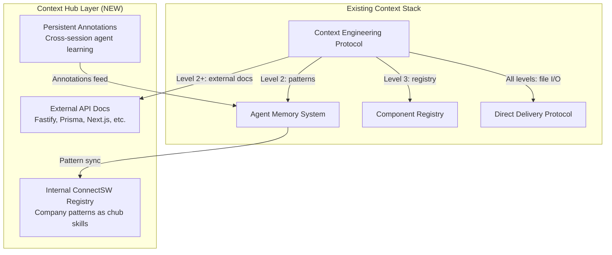

# Context Hub Integration Protocol

**Version**: 1.0.0
**Created**: 2026-03-12
**Source**: [andrewyng/context-hub](https://github.com/andrewyng/context-hub)

## Purpose

Context Hub (`chub`) provides agents with **curated, version-pinned API documentation** and **persistent cross-session annotations** for external libraries. It eliminates API hallucination, reduces rework cycles, and creates a learning feedback loop.

## How It Fits Into ConnectSW



## When to Use Context Hub

| Situation | Action | Example |
|-----------|--------|---------|
| Agent needs external API docs | `chub get <library>/<topic> --lang js` | `chub get fastify/routes --lang js` |
| Agent discovers undocumented behavior | `chub annotate <id> "<note>"` | `chub annotate prisma/client "createMany does NOT support nested relations"` |
| Agent wants to verify API exists | `chub search "<query>"` | `chub search "prisma middleware"` |
| After successful API usage | `chub feedback <id> up` | `chub feedback nextjs/app-router up` |
| After hitting docs issue | `chub feedback <id> down` | `chub feedback stripe/webhooks down` |

## Agent-to-Library Mapping

Each specialist agent has a primary set of libraries to query:

| Agent | Primary Libraries | Fetch When |
|-------|------------------|------------|
| Backend Engineer | `fastify/*`, `prisma/*`, `zod/*` | Any API/DB task |
| Frontend Engineer | `nextjs/*`, `react/*`, `tailwindcss/*` | Any UI task |
| QA Engineer | `playwright/*`, `jest/*` | Any testing task |
| Data Engineer | `prisma/*`, `postgresql/*` | Schema/migration tasks |
| DevOps Engineer | `github-actions/*`, `docker/*` | CI/CD tasks |
| Security Engineer | `helmet/*`, `jose/*`, `bcrypt/*` | Auth/security tasks |
| Mobile Developer | `expo/*`, `react-native/*` | Any mobile task |
| AI/ML Engineer | `anthropic/*`, `openai/*` | AI integration tasks |

## Integration with Progressive Disclosure

Context Hub docs are injected at **Level 2** (Relevant Context) in the progressive disclosure model.

```
┌─────────────────────────────────────────────────┐
│ Level 1: Identity + Task (always)               │
├─────────────────────────────────────────────────┤
│ Level 2: Relevant Context (Simple+)             │
│   ├── Memory patterns (scored >= 4/10)          │
│   ├── Anti-patterns, gotchas                    │
│   ├── Agent past experience                     │
│   └── 🆕 Context Hub: external API docs         │  ← NEW
│         (fetched per agent-library mapping)      │
├─────────────────────────────────────────────────┤
│ Level 3: Deep Reference (Standard+)             │
│   ├── Full agent brief                          │
│   ├── Component Registry                        │
│   ├── Product addendum                          │
│   └── 🆕 Context Hub: --full docs + references  │  ← NEW (expanded)
└─────────────────────────────────────────────────┘
```

### Token Budget Impact

| Complexity | Existing Budget | Context Hub Addition | New Total |
|------------|----------------|---------------------|-----------|
| Trivial | ~500 | 0 (no fetch) | ~500 |
| Simple | ~2,000 | ~200 (main doc only) | ~2,200 |
| Standard | ~5,000 | ~500 (main + key refs) | ~5,500 |
| Complex | ~8,000 | ~1,000 (full docs) | ~9,000 |

## Integration with Phase 0

Phase 0 (Mandatory Context Discovery) gains a new step:

```markdown
### Phase 0 — Enhanced with Context Hub

Before writing ANY code on a task, the assigned agent MUST:

1. **Inspect the target area** — Glob/grep to understand files and modules
2. **Identify the stack context** — Confirm frameworks, dependencies, patterns
3. **🆕 Fetch relevant API docs** — `chub get` for libraries the task touches
4. **Detect existing problems** — Partial migrations, inconsistent patterns
5. **Check the component registry** — Verify reusable components
6. **Report findings** — Summarize to Orchestrator before proposing changes
```

## Integration with Memory System

### Annotations → Agent Experience

When an agent annotates a Context Hub doc, the orchestrator should also update the agent's experience file:

```markdown
Agent discovers: Prisma createMany doesn't support nested relations.

1. Agent runs: chub annotate prisma/client "createMany does NOT support nested relations — use transaction with individual creates"
2. Post-task update also adds to company-knowledge.json:
   {
     "id": "GOTCHA-XXX",
     "issue": "Prisma createMany does not support nested relations",
     "solution": "Use prisma.$transaction with individual create calls",
     "category": "backend",
     "source": "context-hub-annotation"
   }
```

### Feedback → Quality Signal

Context Hub feedback (`up`/`down`) is logged to `.claude/memory/metrics/context-hub-metrics.json`:

```json
{
  "library_quality": {
    "fastify/routes": { "up": 5, "down": 0, "reliability": 1.0 },
    "prisma/client": { "up": 3, "down": 1, "reliability": 0.75 },
    "nextjs/app-router": { "up": 2, "down": 2, "reliability": 0.5 }
  },
  "annotation_count": 7,
  "last_updated": "2026-03-12T00:00:00Z"
}
```

Low-reliability libraries get flagged → agents should annotate more heavily and cross-reference with official docs.

## ConnectSW Internal Registry

ConnectSW can package its own patterns as chub-compatible content for searchable, fetchable internal docs.

### Directory Structure

```
.claude/context-hub/
├── connectsw/
│   ├── docs/
│   │   ├── fastify-plugin-pattern/DOC.md
│   │   ├── prisma-migration-workflow/DOC.md
│   │   ├── nextjs-page-pattern/DOC.md
│   │   ├── tdd-workflow/DOC.md
│   │   └── api-endpoint-scaffold/DOC.md
│   └── skills/
│       ├── integration-test-pattern/SKILL.md
│       ├── e2e-playwright-pattern/SKILL.md
│       └── error-handling-pattern/SKILL.md
├── registry.json          # Built by: chub build .claude/context-hub/connectsw/
└── config.yaml            # Local source pointing to registry.json
```

### Frontmatter Format (for ConnectSW docs)

```yaml
---
name: fastify-plugin-pattern
description: Standard Fastify plugin registration pattern used across all ConnectSW products
metadata:
  source: maintainer
  tags: [fastify, backend, plugin, pattern]
  revision: 1
  updated-on: 2026-03-12
---
```

## Orchestrator Injection (Step 3.5 Enhancement)

When the orchestrator assembles sub-agent prompts, add Context Hub docs after memory patterns:

```markdown
## External API Reference (Context Hub)

The following curated docs are available for this task. Fetch only what you need:

- `chub get fastify/routes --lang js` — Route definition, hooks, validation
- `chub get prisma/client --lang js` — Client API, queries, transactions

If you discover undocumented behavior:
- Run: `chub annotate <id> "<what you discovered>"`
- After successful usage: `chub feedback <id> up`
- After hitting issues: `chub feedback <id> down`
```

## Installation

```bash
npm install -g @aisuite/chub
```

Verify:
```bash
chub --version
chub search "fastify"
```

## Maintenance

### Weekly
- Review annotation count — high annotation rate on a library signals poor upstream docs
- Check feedback ratios — low reliability → consider switching libraries or maintaining local forks

### Monthly
- Rebuild internal registry: `chub build .claude/context-hub/connectsw/`
- Sync new patterns from `company-knowledge.json` into internal chub docs
- Archive stale annotations (>90 days, pattern already in company-knowledge.json)

### When Adding a New Product
- Identify which external libraries the product uses
- Verify Context Hub coverage: `chub search "<library>"`
- If missing: contribute docs upstream or add to internal registry
