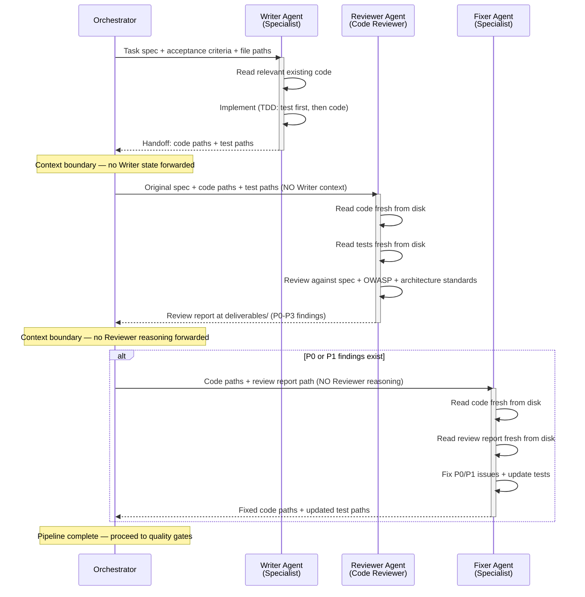

# Multi-Pass Review Protocol (Writer-Reviewer-Fixer Pipeline)

**Version**: 1.0.0
**Created**: 2026-03-01
**Source**: Adapted from context-isolation research and ConnectSW's Direct Delivery protocol.

**Purpose**: Eliminate accumulated bias in code reviews by running each stage of the review pipeline in a context-isolated agent. The writer's context — their assumptions, shortcuts, and blind spots — must never leak into the reviewer's judgment.

---

## The Core Problem

When the same agent (or an agent that inherits the writer's context) reviews code, it suffers from **confirmation bias**. The agent "knows" what the code is supposed to do, so it reads what it expects rather than what is actually there. This is the same reason authors cannot proofread their own work effectively.

Common failure modes:

- Writer implements a security shortcut "temporarily" — reviewer inherits that context and agrees it's fine
- Writer skips an edge case because the spec was ambiguous — reviewer inherits the same ambiguity and doesn't flag it
- Writer chooses a suboptimal architecture — reviewer's context already contains the justification and accepts it
- Writer's tests pass but miss a critical path — reviewer's context already "knows" the tests are sufficient

The fix is structural: each stage runs in a **separate agent invocation** with **no shared context** beyond the code and deliverable files on disk.

---

## Pipeline Stages



---

### Stage 1: Implementation (Writer Agent)

**Agent**: Specialist (Backend Engineer, Frontend Engineer, etc.) with clean context.

**Input**:
- Task specification with acceptance criteria
- File paths to relevant existing code (not the code content — the agent reads it fresh)
- Architecture design reference (deliverable file path)
- Component Registry reference

**Process**:
1. Agent reads the spec and relevant code from disk
2. Follows TDD: writes failing tests first, then implements (per Anti-Rationalization Framework)
3. Runs verification (per Verification-Before-Completion protocol)
4. Writes code and tests to the product directory

**Output**:
- Implementation code at standard product paths
- Tests at standard test paths
- Handoff report at `products/{PRODUCT}/.claude/deliverables/{TASK_ID}-writer-implementation-summary.md`

**Context loaded**: Only task spec, relevant existing code paths, architecture reference, patterns. No review criteria, no reviewer expectations, no prior review history for this code.

---

### Stage 2: Review (Code Reviewer Agent)

**Agent**: Code Reviewer with clean context. This agent has **zero knowledge** of Stage 1 — no implementation reasoning, no design decisions, no tradeoff discussions.

**Input**:
- Original task specification with acceptance criteria (same spec the writer received)
- File paths to the implemented code (the reviewer reads fresh from disk)
- File paths to the tests (the reviewer reads fresh from disk)

**Process**:
1. Agent reads the original spec
2. Agent reads the code fresh from disk — forming its own mental model
3. Agent reads the tests fresh from disk — evaluating coverage independently
4. Agent reviews against the standard checklist (below)
5. Agent writes a review report with categorized findings

**Review Checklist**:

| Category | Checks |
|----------|--------|
| **Correctness** | Does the code fulfill all acceptance criteria? Are there logic errors, off-by-one mistakes, unhandled nulls? |
| **Security (OWASP)** | Injection, broken auth, data exposure, XXE, broken access control, misconfig, XSS, deserialization, dependency vulnerabilities, insufficient logging |
| **Architecture** | Clean layering, dependency inversion, no god objects, no circular dependencies, proper separation of concerns |
| **Test Coverage** | All acceptance criteria have tests, edge cases covered, error paths tested, no brittle mocks, DB state verified |
| **Performance** | N+1 queries, missing indexes, unbounded queries, memory leaks, synchronous blocking, missing pagination |
| **Clean Code** | Method length (<50 lines), nesting depth (<3), magic numbers, naming clarity, dead code, duplication |
| **Error Handling** | All error paths handled, meaningful error messages, no swallowed exceptions, proper HTTP status codes |
| **Accessibility** | (Frontend only) ARIA labels, keyboard navigation, color contrast, semantic HTML |

**Output**:
- Review report at `products/{PRODUCT}/.claude/deliverables/{TASK_ID}-reviewer-report.md`

**Finding Categories**:

| Priority | Label | Definition | Triggers Stage 3? |
|----------|-------|------------|--------------------|
| P0 | Critical | Security vulnerability, data loss risk, or broken core functionality | Yes |
| P1 | High | Significant bug, missing validation, architectural violation, or failing acceptance criteria | Yes |
| P2 | Medium | Code smell, missing edge case test, performance concern, or maintainability issue | No |
| P3 | Low | Style nit, naming suggestion, documentation gap, or minor improvement | No |

**Context loaded**: Only the original spec and file paths. No implementation notes, no writer's reasoning, no "what I tried" history.

---

### Stage 3: Fix (Fixer Agent)

**Agent**: Same specialist type as Stage 1, but a **fresh invocation** — not a continuation of the writer's session.

**Input**:
- File paths to the code (reads fresh from disk)
- File path to the review report (reads fresh from disk)
- Original task specification (for context on intent)

**Process**:
1. Agent reads the review report from disk
2. Agent reads the code from disk — forming its own understanding
3. Agent addresses every P0 and P1 finding
4. Agent updates or adds tests to cover the fixed issues
5. Agent runs verification (per Verification-Before-Completion protocol)
6. Agent documents what was fixed and why

**Output**:
- Fixed code at the same product paths
- Updated tests
- Fix report at `products/{PRODUCT}/.claude/deliverables/{TASK_ID}-fixer-report.md`

**Trigger condition**: Stage 3 is only invoked if Stage 2 produces **one or more P0 or P1 findings**. If all findings are P2 or P3, the pipeline completes after Stage 2 — P2/P3 items are logged as tech debt for future sprints.

**Context loaded**: Only file paths to code, review report, and original spec. No writer reasoning, no reviewer reasoning beyond the written report.

---

## Context Isolation Rules

These rules are the heart of the protocol. Violating them defeats the entire purpose.

### Rule 1: Separate Invocations

Each stage is a **separate agent invocation**. Not a follow-up message. Not a continuation. A new agent with a clean context window.

```
CORRECT:
  Agent(Backend, task="implement feature X per spec at path...") → done
  Agent(Code Reviewer, task="review code at paths...") → done
  Agent(Backend, task="fix per review report at path...") → done

WRONG:
  Agent(Backend, task="implement feature X, then review your work, then fix issues")
```

### Rule 2: File Paths, Not Content

The orchestrator passes **file paths** between stages, not file content. Each agent reads the files independently, forming its own interpretation.

```
CORRECT:
  "Review the code at: products/gateway/apps/api/src/routes/payments.ts"

WRONG:
  "The writer implemented a payment endpoint that validates amounts and calls Stripe..."
```

### Rule 3: No Forwarded Reasoning

The orchestrator does NOT forward the writer's reasoning, design decisions, or tradeoff notes to the reviewer. The reviewer must evaluate the code on its own merits.

```
CORRECT:
  Orchestrator → Reviewer: "Review code at [paths] against spec at [path]."

WRONG:
  Orchestrator → Reviewer: "The writer chose to use a queue here because of rate limits.
  Review the code at [paths]."
```

### Rule 4: No Forwarded Judgment

The orchestrator does NOT forward the reviewer's severity assessment or emotional tone to the fixer. The fixer reads the review report file directly and makes its own assessment of priority.

```
CORRECT:
  Orchestrator → Fixer: "Fix P0/P1 issues per review report at [path]. Code at [paths]."

WRONG:
  Orchestrator → Fixer: "The reviewer found a critical SQL injection bug and was concerned
  about the auth flow. Fix the code at [paths]."
```

---

## When to Apply

This protocol is triggered when **any** of the following conditions are true:

| Condition | Rationale |
|-----------|-----------|
| Feature implementation touches **>3 files** | Multi-file changes are harder to review in-context |
| Any **security-sensitive** change (auth, payments, data handling, encryption, PII) | Security requires adversarial review, not collaborative review |
| Orchestrator sets `review_pipeline: true` on a task | Explicit opt-in for any task the orchestrator deems high-risk |
| **New product foundation** code (initial setup) | Foundation bugs propagate to everything built on top |
| Changes to **shared packages** used by multiple products | Blast radius extends beyond the immediate product |

This protocol is NOT required for:

| Condition | Rationale |
|-----------|-----------|
| Single-file bug fixes with clear scope | Overhead exceeds benefit |
| Documentation-only changes | No runtime risk |
| Configuration changes (ports, env vars) | Simple verification suffices |
| Dependency updates with no code changes | Automated tools handle this |

---

## Orchestrator Integration

The orchestrator chains the stages as separate agent invocations. The orchestrator's role is strictly logistical — it routes file paths, not content.

### Orchestrator Pseudocode

```
function multiPassReview(task):
    # Stage 1: Implementation
    writer_result = invoke_agent(
        role = task.specialist_type,
        prompt = f"Implement {task.id} per spec at {task.spec_path}. "
                 f"Relevant code at: {task.existing_code_paths}. "
                 f"Architecture reference: {task.architecture_path}.",
        context = "clean"  # No prior review context
    )

    # Stage 2: Review (context-isolated)
    review_result = invoke_agent(
        role = "code-reviewer",
        prompt = f"Review code at: {writer_result.code_paths}. "
                 f"Tests at: {writer_result.test_paths}. "
                 f"Original spec at: {task.spec_path}. "
                 f"Write review report to deliverables/{task.id}-reviewer-report.md.",
        context = "clean"  # No writer context forwarded
    )

    # Stage 3: Fix (only if P0/P1 found)
    review_report = read_file(review_result.report_path)
    if has_p0_or_p1(review_report):
        fix_result = invoke_agent(
            role = task.specialist_type,
            prompt = f"Fix P0/P1 issues per review report at {review_result.report_path}. "
                     f"Code at: {writer_result.code_paths}. "
                     f"Original spec at: {task.spec_path}.",
            context = "clean"  # No reviewer reasoning forwarded
        )
        return fix_result
    else:
        log_tech_debt(review_report.p2_p3_findings)
        return writer_result
```

### Deliverable File Locations

All deliverables follow the Direct Delivery protocol path convention:

```
products/{PRODUCT}/.claude/deliverables/
├── {TASK_ID}-writer-implementation-summary.md    # Stage 1 output
├── {TASK_ID}-reviewer-report.md                  # Stage 2 output
└── {TASK_ID}-fixer-report.md                     # Stage 3 output (if triggered)
```

---

## Review Report Format

The Code Reviewer agent writes its report in this standardized format:

```markdown
## Review Report: {TASK_ID}

**Reviewer**: Code Reviewer Agent
**Date**: {DATE}
**Spec**: {SPEC_PATH}
**Files Reviewed**: {LIST_OF_FILE_PATHS}

### Summary

{2-3 sentence overall assessment}

### Findings

#### P0 — Critical

##### P0-1: {Title}
- **File**: {path}:{line}
- **Issue**: {description}
- **Impact**: {what could go wrong}
- **Suggested fix**: {concrete recommendation}

#### P1 — High

##### P1-1: {Title}
- **File**: {path}:{line}
- **Issue**: {description}
- **Impact**: {what could go wrong}
- **Suggested fix**: {concrete recommendation}

#### P2 — Medium

##### P2-1: {Title}
- **File**: {path}:{line}
- **Issue**: {description}
- **Suggested fix**: {concrete recommendation}

#### P3 — Low

##### P3-1: {Title}
- **File**: {path}:{line}
- **Note**: {description}

### Verdict

- **P0 count**: {N}
- **P1 count**: {N}
- **P2 count**: {N}
- **P3 count**: {N}
- **Stage 3 required**: {Yes/No}
```

---

## Integration with Other Protocols

### Verification-Before-Completion

Both the Writer (Stage 1) and the Fixer (Stage 3) must follow the 5-step verification gate before reporting completion. The Reviewer (Stage 2) does not run verification — it produces a report, not code.

### Anti-Rationalization Framework

The Writer must follow TDD. The Reviewer must flag any evidence of skipped TDD (tests that test implementation details rather than behavior, missing edge cases, implementation committed before tests). The Fixer must write tests for any P0/P1 fix.

### Direct Delivery

All three stages write their deliverables to files per the Direct Delivery protocol. The orchestrator passes file paths between stages, never content. This is both a context engineering optimization and a context isolation requirement.

### Development-Oriented Testing

The Writer runs tests during development, not after. The Fixer runs the full test suite after fixing each P0/P1 issue. Both provide test output as verification evidence.

---

## Enforcement

### Orchestrator Responsibility

The Orchestrator MUST:

1. Check the trigger conditions before every implementation task
2. If triggered, invoke all three stages as separate agent invocations
3. Pass only file paths between stages — never content or reasoning
4. Not forward writer context to reviewer or reviewer context to fixer
5. Only trigger Stage 3 if the review report contains P0 or P1 findings
6. Log P2/P3 findings as tech debt if Stage 3 is not triggered

### Code Reviewer Responsibility

The Code Reviewer MUST:

1. Read code fresh from disk — never accept pre-digested summaries
2. Evaluate against the full review checklist, not just the spec
3. Categorize every finding with the correct priority (P0-P3)
4. Provide specific file paths and line numbers for every finding
5. Include a concrete suggested fix for every P0 and P1 finding

### Agent Self-Check

Before the orchestrator forwards results between stages, it asks:

> "Am I passing file paths only, or am I also passing reasoning, justification, or emotional framing from the previous agent?"

If the answer includes anything beyond file paths and the original spec, the orchestrator is violating context isolation.

---

## Why This Works

The protocol exploits a fundamental property of code review: **reading code you did not write produces different (and often better) analysis than reviewing code you just wrote.** The cognitive biases at play:

1. **Confirmation bias**: Writers see what they intended, not what they wrote
2. **Anchoring**: Reviewers who saw the implementation process anchor to the writer's decisions
3. **Sunk cost**: Writers (and context-inheriting reviewers) resist finding flaws in code they invested effort in
4. **Availability bias**: The most recent context (implementation details) dominates over broader concerns (security, architecture)

By forcing a clean context at each stage, we get the benefits of pair programming (a second set of eyes) without the drawbacks of shared context (groupthink, anchoring).
