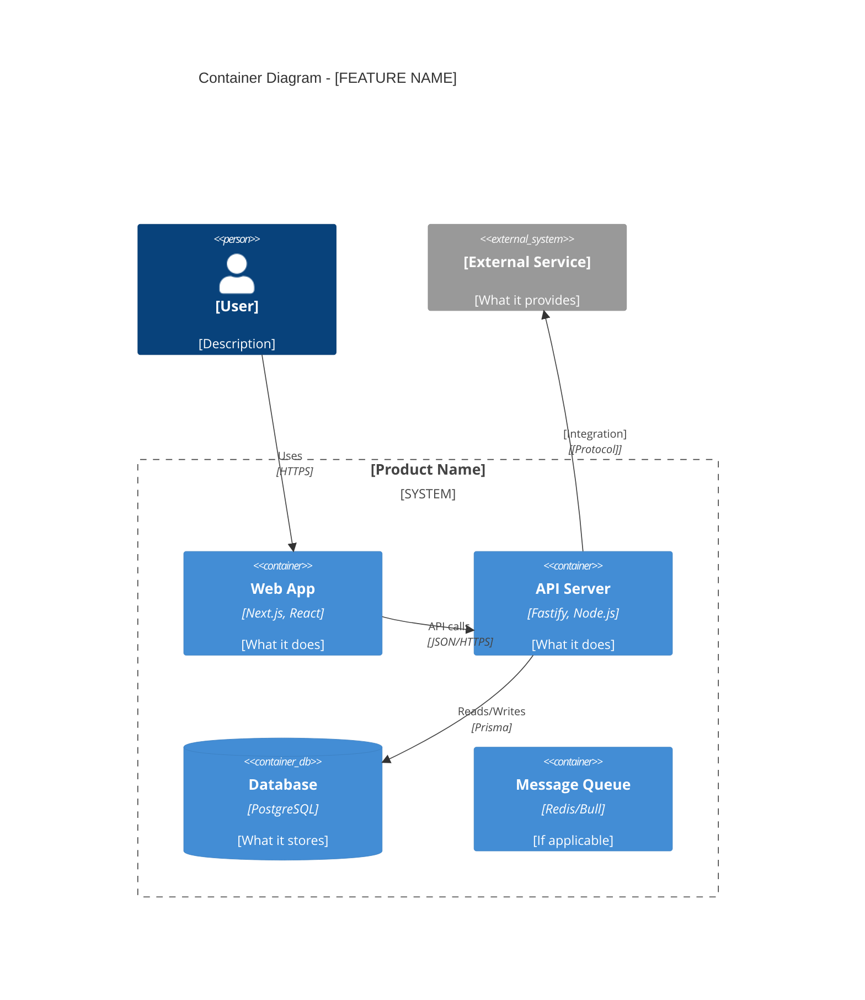
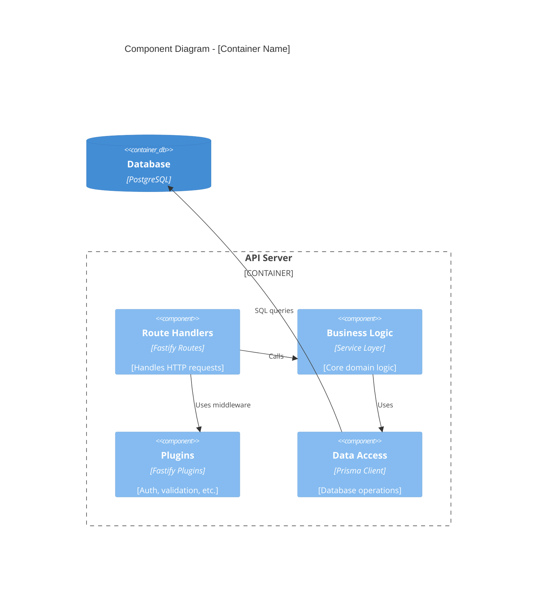
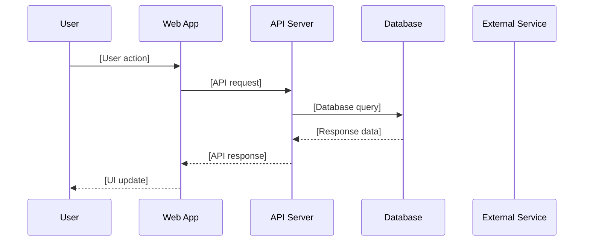

# Implementation Plan: [FEATURE NAME]

**Product**: [PRODUCT_NAME]
**Branch**: `feature/[product]/[feature-id]`
**Created**: [DATE]
**Spec**: [Link to spec.md]

## Summary

[Extract primary requirement and technical approach from feature spec. Include the business context — why this feature matters, not just what it does technically.]

## Technical Context

- **Language/Version**: TypeScript 5+ / Node.js 20+
- **Backend**: Fastify + Prisma + PostgreSQL 15
- **Frontend**: Next.js 14+ / React 18+ / Tailwind CSS
- **Testing**: Jest/Vitest + Playwright
- **Primary Dependencies**: [List key libraries]
- **Target Platform**: Web / Mobile / Both
- **Assigned Ports**: Frontend [PORT] / Backend [PORT]

## Architecture *(mandatory — C4 diagrams required)*

### Container Diagram (C4 Level 2)



### Component Diagram (C4 Level 3) — [Key Container]



### Data Flow *(mandatory)*



### Integration Points

| System | Direction | Protocol | Data Exchanged | Auth Method |
|--------|-----------|----------|---------------|-------------|
| [System 1] | Inbound/Outbound | REST/gRPC/WebSocket | [What data] | [API key/OAuth/JWT] |
| [System 2] | Inbound/Outbound | REST/gRPC/WebSocket | [What data] | [API key/OAuth/JWT] |

### Security Considerations *(mandatory)*

- **Authentication**: [How users authenticate — JWT, sessions, OAuth, etc.]
- **Authorization**: [How permissions are enforced — RBAC, ABAC, per-resource]
- **Data Protection**: [Encryption at rest/in transit, PII handling, data retention]
- **Input Validation**: [Schema validation approach, sanitization]
- **Rate Limiting**: [Limits per endpoint, per user, burst handling]

### Error Handling Strategy *(mandatory)*

| Error Category | Example | Detection | Recovery | User Experience |
|---------------|---------|-----------|----------|----------------|
| Validation | Invalid input | Schema check | Return 400 with details | Form field error messages |
| Auth | Expired token | Middleware | Redirect to login | "Session expired" toast |
| External service | API timeout | Try/catch + timeout | Retry with backoff | Loading state + retry button |
| Database | Connection lost | Health check | Reconnect pool | 503 page with retry |

## Constitution Check

**Gate: Before Phase 0**

| Article | Requirement | Status |
|---------|------------|--------|
| I. Spec-First | Specification exists and is approved | [PASS/FAIL] |
| II. Component Reuse | COMPONENT-REGISTRY.md checked | [PASS/FAIL] |
| III. TDD | Test plan defined | [PASS/FAIL] |
| IV. TypeScript | TypeScript configured | [PASS/FAIL] |
| V. Default Stack | Stack matches default or ADR exists | [PASS/FAIL] |
| VII. Port Registry | Ports assigned in PORT-REGISTRY.md | [PASS/FAIL] |

**If ANY gate fails: ERROR — resolve before proceeding.**

## Component Reuse Plan

| Need | Existing Component | Source Product | Action |
|------|-------------------|---------------|--------|
| [Need 1] | [Component name] | [Product] | Copy & Adapt / Import from @connectsw/shared |
| [Need 2] | None found | — | Build new (add to registry after) |

## Project Structure

```
products/[product]/
├── apps/
│   ├── api/
│   │   ├── src/
│   │   │   ├── plugins/        # Fastify plugins
│   │   │   ├── routes/         # API route handlers
│   │   │   ├── services/       # Business logic
│   │   │   └── server.ts       # Server entry
│   │   ├── tests/
│   │   │   ├── unit/
│   │   │   └── integration/
│   │   └── prisma/
│   │       └── schema.prisma
│   └── web/
│       ├── src/
│       │   ├── app/            # Next.js app router
│       │   ├── components/     # React components
│       │   ├── hooks/          # Custom hooks
│       │   └── lib/            # Utilities
│       └── tests/
├── e2e/
│   ├── tests/
│   └── playwright.config.ts
└── docs/
    ├── spec.md                 # Feature specification
    ├── plan.md                 # This file
    ├── data-model.md           # Entity models
    └── contracts/              # API contracts
```

## Phase 0: Research

- [ ] Investigate unknowns from spec
- [ ] Document findings in `docs/research.md`
- [ ] Resolve all `[NEEDS CLARIFICATION]` markers

## Phase 1: Design & Contracts

- [ ] Create `docs/data-model.md` from spec entities (with ER diagrams)
- [ ] Create API contracts in `docs/contracts/` (with full request/response examples)
- [ ] Verify contracts satisfy all functional requirements
- [ ] Run constitution check (post-Phase 1 re-validation)

## Complexity Tracking

| Decision | Violation of Simplicity? | Justification | Simpler Alternative Rejected |
|----------|------------------------|---------------|------------------------------|
| [Decision] | [Yes/No] | [Why needed] | [What was considered] |
