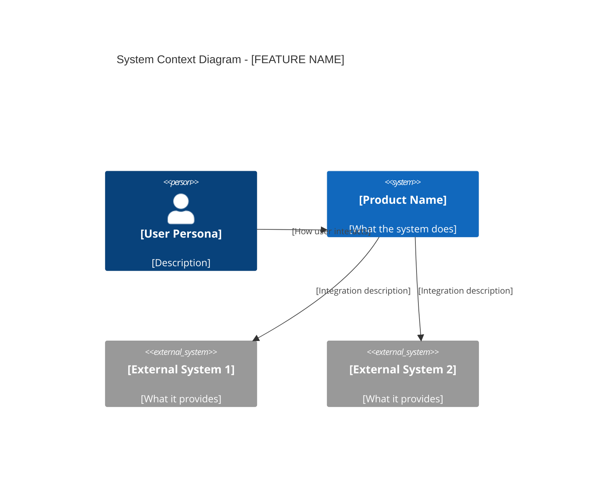
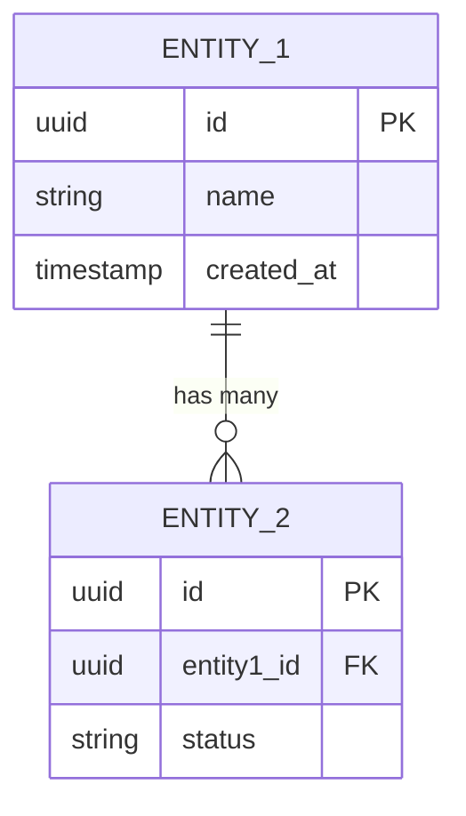

# Feature Specification: [FEATURE NAME]

**Product**: [PRODUCT_NAME]
**Feature Branch**: `feature/[product]/[feature-id]`
**Created**: [DATE]
**Status**: Draft
**Input**: User description: "$ARGUMENTS"

## Business Context *(mandatory)*

### Problem Statement

[What problem does this feature solve? Who experiences this problem? What is the impact of not solving it?]

### Target Users

| Persona | Role | Pain Point | Expected Outcome |
|---------|------|-----------|-----------------|
| [Persona 1] | [Their role] | [What frustrates them today] | [What they gain from this feature] |
| [Persona 2] | [Their role] | [What frustrates them today] | [What they gain from this feature] |

### Business Value

- **Revenue Impact**: [How this feature drives revenue — direct or indirect]
- **User Retention**: [How this reduces churn or increases engagement]
- **Competitive Position**: [How this positions us vs alternatives]
- **Strategic Alignment**: [How this fits the product roadmap]

## System Context (C4 Level 1) *(mandatory)*

## User Scenarios & Testing *(mandatory)*

### User Story 1 - [Brief Title] (Priority: P1)

**As a** [persona], **I want to** [action], **so that** [benefit].

[Describe this user journey in plain language — the full flow from the user's perspective, including what they see, what they click, and what happens.]

**Why this priority**: [Explain the value and why it has this priority level]

**Independent Test**: [Describe how this can be tested independently — e.g., "Can be fully tested by [specific action] and delivers [specific value]"]

**Acceptance Criteria**:

1. **Given** [initial state], **When** [action], **Then** [expected outcome]
2. **Given** [initial state], **When** [action], **Then** [expected outcome]
3. **Given** [error/edge state], **When** [action], **Then** [graceful handling]

---

### User Story 2 - [Brief Title] (Priority: P2)

**As a** [persona], **I want to** [action], **so that** [benefit].

[Describe this user journey in plain language]

**Why this priority**: [Explain the value and why it has this priority level]

**Independent Test**: [Describe how this can be tested independently]

**Acceptance Criteria**:

1. **Given** [initial state], **When** [action], **Then** [expected outcome]

---

### Edge Cases *(mandatory — minimum 5)*

| # | Scenario | Expected Behavior | Priority |
|---|----------|------------------|----------|
| 1 | [Boundary condition] | [How system handles it] | [P1/P2/P3] |
| 2 | [Error scenario] | [How system handles it] | [P1/P2/P3] |
| 3 | [Concurrent access] | [How system handles it] | [P1/P2/P3] |
| 4 | [Invalid input] | [How system handles it] | [P1/P2/P3] |
| 5 | [Network/service failure] | [How system handles it] | [P1/P2/P3] |

## Requirements *(mandatory)*

### Functional Requirements

- **FR-001**: System MUST [specific capability]. *Traces to: User Story 1, AC 1*
- **FR-002**: System MUST [specific capability]. *Traces to: User Story 1, AC 2*
- **FR-003**: Users MUST be able to [key interaction]. *Traces to: User Story 2, AC 1*

### Non-Functional Requirements

- **NFR-001**: Performance — [specific latency/throughput target with numbers]
- **NFR-002**: Security — [specific auth/data protection requirement]
- **NFR-003**: Accessibility — [WCAG level / specific requirement]
- **NFR-004**: Scalability — [expected load, growth projections]
- **NFR-005**: Reliability — [uptime target, recovery time objective]

### Key Entities

| Entity | Description | Key Attributes | Relationships |
|--------|-------------|---------------|---------------|
| [Entity 1] | [What it represents] | [Key fields] | [Related entities] |
| [Entity 2] | [What it represents] | [Key fields] | [Related entities] |

### Data Model *(mandatory)*

## Component Reuse Check *(mandatory — ConnectSW)*

Before planning, check `.claude/COMPONENT-REGISTRY.md`:

| Need | Existing Component | Source Product | Reuse? |
|------|-------------------|---------------|--------|
| [Need 1] | [Component or "None found"] | [Product] | [Yes/No/Adapt] |
| [Need 2] | [Component or "None found"] | [Product] | [Yes/No/Adapt] |

## Success Criteria *(mandatory)*

### Measurable Outcomes

| # | Metric | Target | Measurement Method |
|---|--------|--------|-------------------|
| SC-001 | [Measurable metric] | [Specific number] | [How to measure] |
| SC-002 | [Measurable metric] | [Specific number] | [How to measure] |
| SC-003 | [User satisfaction metric] | [Specific number] | [How to measure] |

## Out of Scope

- [Explicitly NOT included in this feature — and why]
- [Deferred to future iteration — and which iteration]

## Open Questions

| # | Question | Impact if Unresolved | Owner | Status |
|---|----------|---------------------|-------|--------|
| 1 | [Question] | [What breaks or is unclear] | [Who decides] | [Open/Resolved] |
