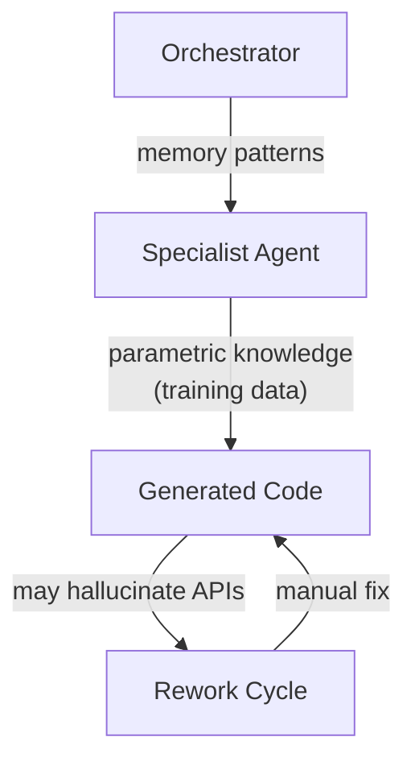
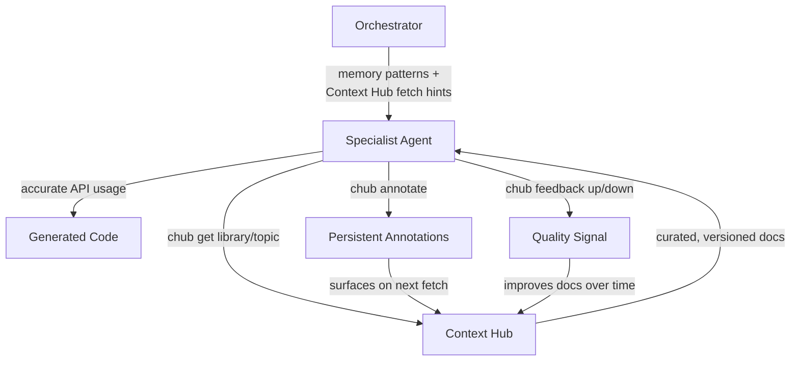
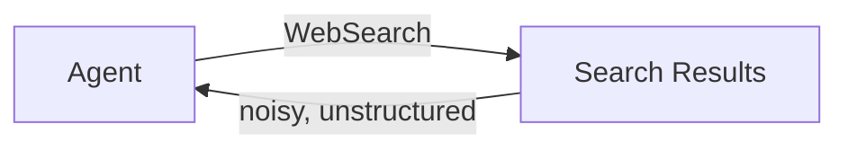
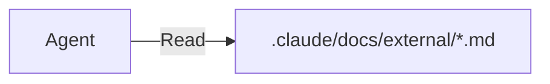

# ADR-001: Context Hub Adoption for External API Documentation

**Status**: Accepted
**Date**: 2026-03-12
**Decision Maker**: CEO
**Implemented By**: Orchestrator

## Context

ConnectSW agents (Backend, Frontend, QA, DevOps, etc.) regularly interact with external APIs — Fastify, Prisma, Next.js, Playwright, Tailwind CSS, and others. Currently, agents rely on model training data for API knowledge, which:

1. **May be stale** — training data has a knowledge cutoff
2. **May be incorrect** — agents hallucinate APIs that don't exist or have changed
3. **Is not persistent** — discoveries about API quirks are lost between sessions
4. **Has no feedback loop** — there's no way to rate or improve doc quality over time

The existing memory system (`.claude/memory/`) handles internal patterns well but doesn't address external API accuracy.

## Decision

Adopt [Context Hub](https://github.com/andrewyng/context-hub) (`chub`) as the external API documentation layer for all ConnectSW agents.

## Architecture — Before and After

### Before

### After

## Alternatives Considered

### 1. Web Search per API Call

**Pros**: Always up-to-date, no new tooling
**Cons**: Noisy results, consumes many tokens, no caching, no persistence, no quality signal

### 2. Local Documentation Files

**Pros**: Full control, no external dependency
**Cons**: Maintenance burden, no community improvements, no feedback loop, must manually keep in sync

### 3. Context Hub (Selected)

**Pros**:
- Curated, agent-optimized docs (not human-oriented)
- Version-pinned per library
- Language-specific variants (JS/TS)
- Persistent annotations across sessions
- Community feedback loop improves quality
- Incremental fetching (token-efficient)
- Supports internal registries (ConnectSW patterns as chub docs)
- CLI interface (`chub`) integrates naturally with agent workflows

**Cons**:
- New dependency (`@aisuite/chub`)
- Coverage depends on community contributions
- Requires agents to learn new commands

## Integration Points

| System | Integration | File Modified |
|--------|-------------|---------------|
| Context Engineering Protocol | Level 2 + Level 3 docs injection | `.claude/protocols/context-engineering.md` |
| Phase 0 (Context Discovery) | New step: fetch external API docs | `.claude/CLAUDE.md` |
| Memory System | Annotations sync to `company-knowledge.json` | `.claude/memory/memory-system.md` |
| Orchestrator Enhanced | Step 3.5 gains Context Hub injection (step 10) | `.claude/orchestrator/orchestrator-enhanced.md` |
| Orchestrator Brief | Context Hub instructions for sub-agent prompts | `.claude/agents/briefs/orchestrator.md` |
| New Protocol | Full integration guide | `.claude/protocols/context-hub.md` |

## Consequences

### Positive
- Agents produce more accurate code on first attempt → fewer rework cycles
- Cross-session learning via annotations → knowledge compounds over time
- Token-efficient (incremental fetching) → fits within progressive disclosure budget
- Internal registry → company patterns become searchable/fetchable like external docs

### Negative
- Adds ~200-1,000 tokens to Level 2+ context (within budget)
- Agents need to learn `chub` commands (simple CLI, low learning curve)
- Dependency on external tool availability

### Neutral
- Does not replace existing memory system — complements it
- Does not change agent hierarchy or workflow structure
- Quality gates and checkpoints are unaffected

## Review

Revisit this decision if:
- Context Hub project becomes unmaintained (>6 months no commits)
- Token budget impact exceeds 15% of total context window
- Alternative with better coverage emerges
