# The Ultimate Claude Code 100x Playbook

> **Author**: CEO Brief — ConnectSW
> **Date**: 2026-03-01
> **Purpose**: Definitive playbook for maximizing Claude Code productivity across ConnectSW's multi-agent architecture
> **Audience**: All ConnectSW agents, contributors, and the CEO

---

## Overview

This playbook synthesizes best practices from top Claude Code power users and Anthropic's own guidance, tailored for ConnectSW's 11-agent GovernAI framework. It transforms Claude Code from a code suggestion tool into a **managed team of specialists**.

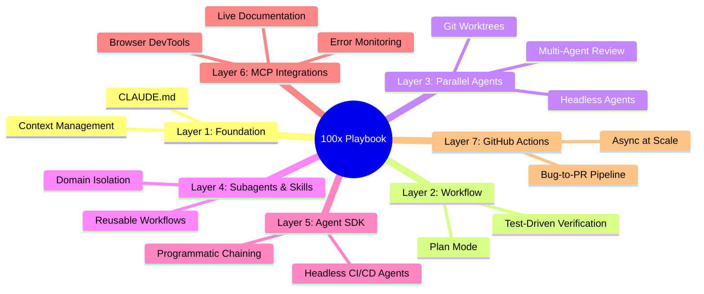

---

## Layer 1: The Foundation (Non-Negotiable)

### CLAUDE.md — Your Project's Permanent Brain

The `CLAUDE.md` file is a special document that Claude automatically reads to get context on your project. **It is the most important tool you have for guiding the AI.**

#### What to Include

| Section | Content |
|---------|---------|
| **Tech stack** | Framework choices, runtime versions, coding conventions |
| **Commands** | Common bash commands for build, test, deploy |
| **Architecture** | Key decisions, constraints, boundaries |
| **Doc pitches** | Links to deeper docs with context for *when* to read them |

#### Key Rules

- **Don't @-file docs** — it bloats the context window by embedding the entire file on every run
- **Pitch the agent** on *why* and *when* to read a file instead of embedding it
- **Keep under ~150 lines** — move domain-specific knowledge into subagent configs and skills

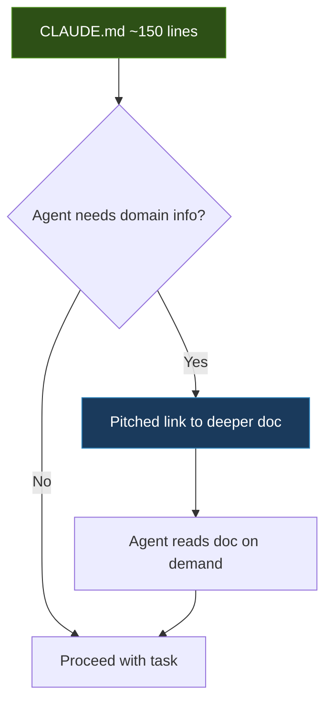

> **ConnectSW Application**: Our `.claude/CLAUDE.md` follows this pattern — it contains high-level standards and pitches agents toward protocol files in `.claude/protocols/` only when needed.

---

### Context Management Is Everything

The context window is the **most important resource to manage**. Every file read, every command output, every back-and-forth message eats tokens. When it fills up, Claude degrades.

#### Actionable Rules

| Rule | When | Why |
|------|------|-----|
| **Use `/clear` aggressively** | Every time you switch tasks | Prevents context bleed between tasks |
| **Use `/compact`** | During long sessions | Summarizes and reclaims space |
| **Track context usage** | Via status line | Know when you're approaching limits |
| **Scope prompts tightly** | Always | Point at specific files, not "look at everything" |

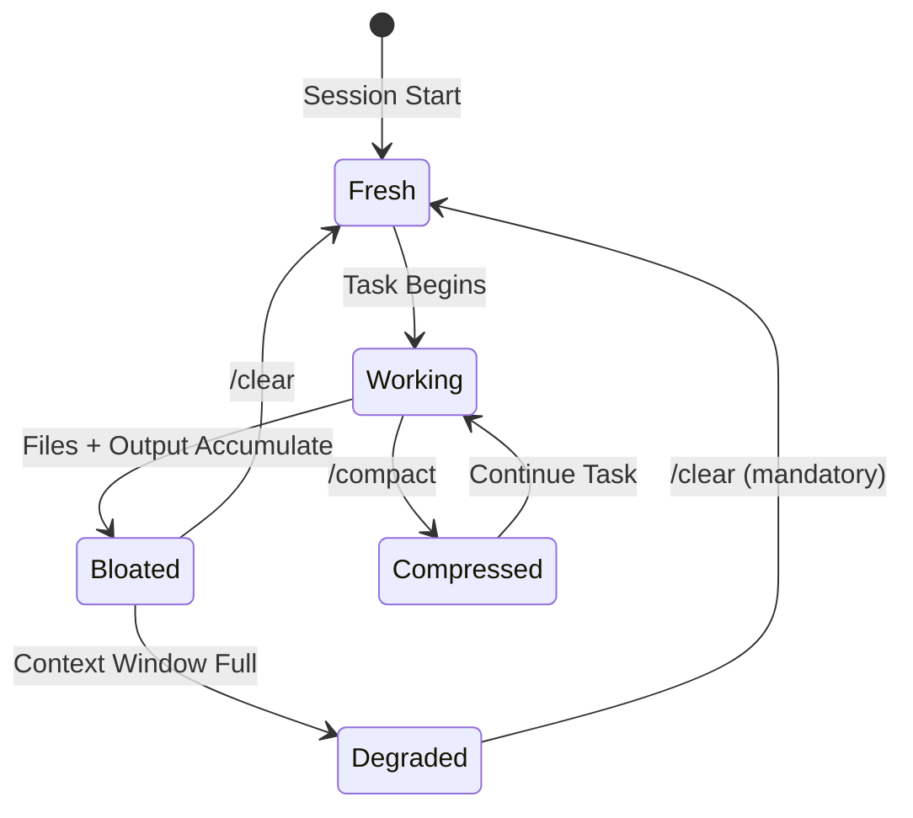

> **ConnectSW Application**: Our Context Engineering protocols (`.claude/protocols/context-engineering.md`) implement Progressive Disclosure — loading only what agents need per task complexity, from ~500 tokens for trivial tasks to ~8,000 for complex ones.

---

## Layer 2: The Workflow That Separates 10x from 100x

### Plan Mode → Review → Execute (Never Skip This)

Plan Mode is activated by pressing **Shift+Tab twice**. In this mode, Claude becomes a research and analysis machine that **cannot change any files**.

#### The 4-Step Loop

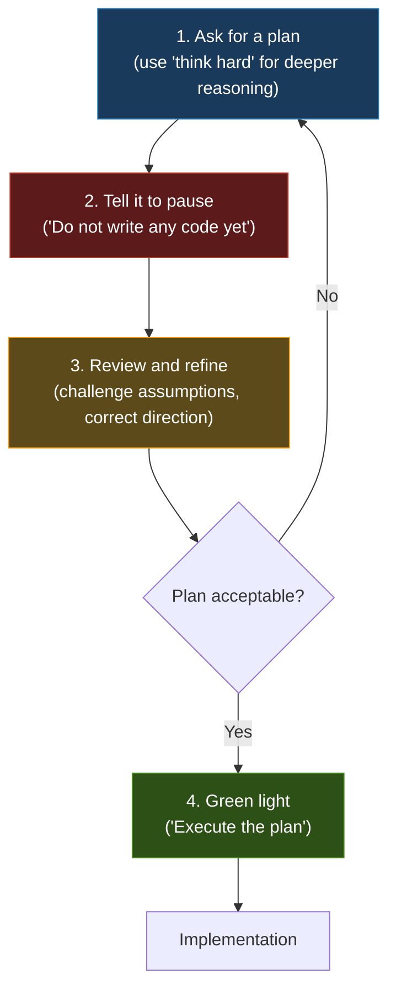

> **Critical for GovernAI**: For each of the 10+ specialized agents, run a planning phase to define the architecture before any implementation touches code.

---

### Tests as Self-Verification

Include tests, screenshots, or expected outputs so Claude can **check itself**. This is the **single highest-leverage thing you can do**.

AI-generated code often looks correct but has subtle bugs. Tests are the only reliable validation.

#### The Golden Instruction

> *"Implement your plan, then write tests and run them. Fix anything that fails."*

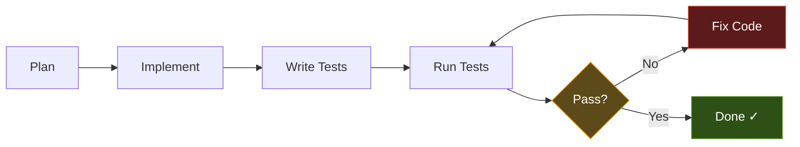

> **ConnectSW Application**: Our TDD mandate (Red-Green-Refactor), Anti-Rationalization Framework, and Verification-Before-Completion protocol enforce this at every level.

---

## Layer 3: Parallel Agents — The True Multiplier

This is where you go from "faster developer" to **"engineering team of one."**

### Git Worktrees + Multiple Instances

Traditional AI coding tools force serial work — one task at a time. Claude Code breaks this limitation entirely through **git worktrees and multiple agent instances**.

```bash
# Create isolated worktrees for parallel work
git worktree add ../governai-auth-agent feature/auth-agent
git worktree add ../governai-risk-agent feature/risk-agent
git worktree add ../governai-arabic-nlp feature/arabic-nlp

# Launch Claude Code in each (separate terminals)
cd ../governai-auth-agent && claude
cd ../governai-risk-agent && claude
cd ../governai-arabic-nlp && claude
```

Each instance has its own context, own files, **no conflicts**. Your job becomes **reviewing and merging**, not writing.

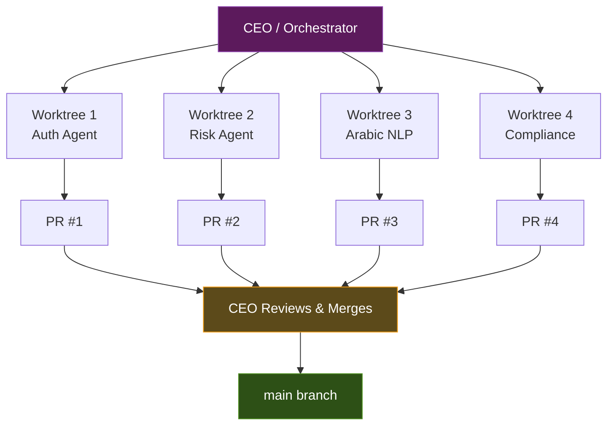

---

### Headless / Background Agents

Spawn parallel workers from Claude Code for background tasks:

```bash
claude -p "Analyze src/auth/ for security issues" --session-id "task-1" &
claude -p "Write unit tests for src/api/" --session-id "task-2" &
claude -p "Optimize database queries in src/db/" --session-id "task-3" &
wait
```

---

### The Multi-Agent Review Pipeline

The pattern: **Claude A writes code → /clear → Claude B reviews → /clear → Claude C edits based on review feedback.**

This eliminates blind spots where a single session accumulates biases.

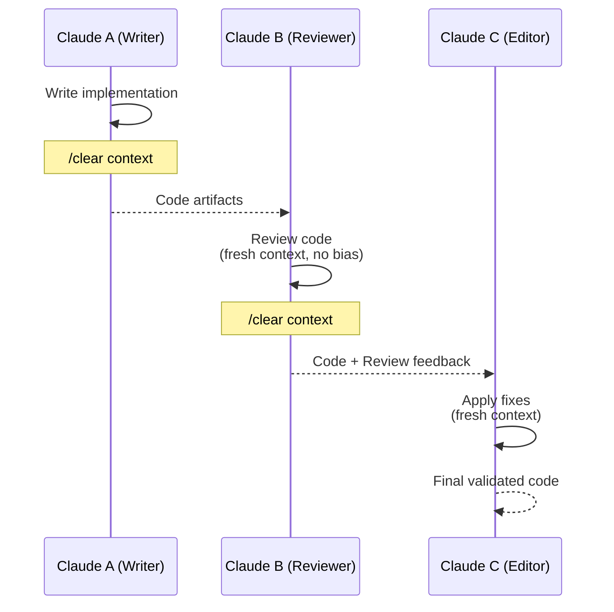

> **ConnectSW Application**: Our Orchestrator → Specialist → Code Reviewer pipeline already implements this pattern. The Code Reviewer agent always operates with fresh context.

---

## Layer 4: Custom Subagents & Skills

### Subagents for Domain Isolation

Each subagent runs in its own context window with a **custom system prompt**, **specific tool access**, and **independent permissions**.

#### ConnectSW Agent Mapping

| Subagent | Domain | System Prompt Focus |
|----------|--------|-------------------|
| **Compliance Agent** | QFCRA/QCB regulations | Compliance checklists, regulatory review |
| **Arabic NLP Agent** | Bilingual text handling | RTL layout validation, translation QA |
| **Security Agent** | AppSec | OWASP Top 10 scanning, every PR |
| **Backend Engineer** | API, business logic | Fastify, Prisma, TDD |
| **Frontend Engineer** | UI/UX | Next.js, React, Tailwind, accessibility |
| **QA Engineer** | Testing | Jest, Playwright, dynamic test generation |
| **DevOps Engineer** | CI/CD | GitHub Actions, Docker, deployment |
| **Architect** | System design | C4 diagrams, API contracts |

Place these in `.claude/agents/` with **focused system prompts** and **tool restrictions**.

---

### Skills for Reusable Workflows

Custom slash commands in `.claude/commands/`:

```markdown
# .claude/commands/deploy-check.md
Before deploying, verify:
1. All tests pass
2. No TypeScript `any` types
3. Arabic translations are complete
4. Security scan clean
5. API rate limiting configured
```

Then just type `/project:deploy-check`.

> **ConnectSW Application**: We already have skills like `/orchestrator`, `/audit`, `/check-system`, `/status`, and the full `/speckit.*` suite. Add domain-specific skills as products mature.

---

## Layer 5: The SDK — Build Your Own Agent Factory

For ConnectSW's 11-agent framework, the **Claude Agent SDK** gives access to the same core tools, context management systems, and permissions frameworks that power Claude Code.

### What This Enables

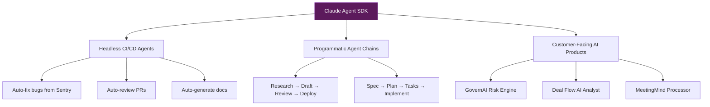

The SDK transforms how developers build AI agents by offering **autonomy with control**. You can build simple agents without having to re-implement every single tool call.

---

## Layer 6: MCP Integrations — Extend the Senses

Connect Claude Code to external tools via **Model Context Protocol**:

| MCP Server | Purpose | Priority |
|------------|---------|----------|
| **Playwright / Chrome DevTools** | See browser console logs, debug UI visually | High |
| **Sentry** | Read error logs, fix bugs autonomously | High |
| **Context7 / Docs** | Live library documentation (no hallucinated APIs) | Medium |
| **GitHub App** | Auto-review PRs, catch bugs humans miss | High |

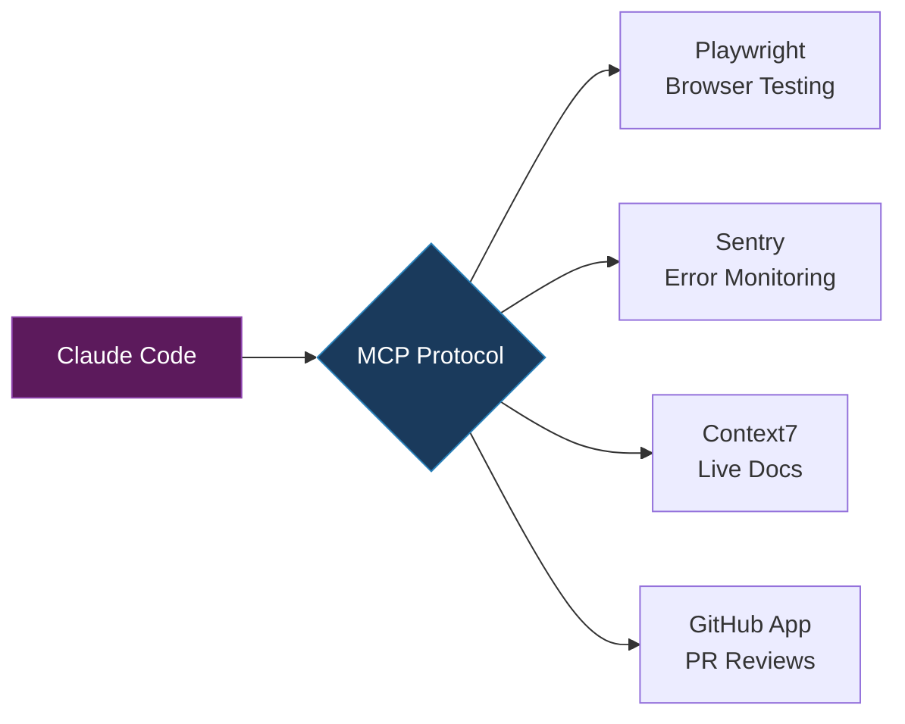

### Warning

> Be selective: One practitioner went overboard with 15 MCP servers and ended up using only 4 daily. **Quality over quantity.**

---

## Layer 7: The GitHub Actions Pipeline (Async at Scale)

The Claude Code GitHub Action is one of the most **underutilized features**. Users can trigger a PR from Slack, Jira, or even a CloudWatch alert, and the GHA will fix the bug or add the feature and return a fully tested PR.

### ConnectSW / GovernAI Pipeline

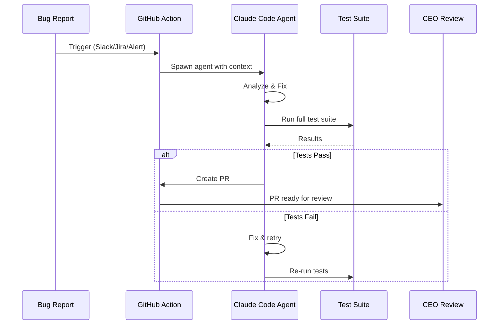

### Use Cases

| Trigger | Agent Flow | Output |
|---------|-----------|--------|
| Bug report | Claude Code GHA → fix → auto-test → PR | Tested fix PR |
| Feature request (Arabic) | Arabic NLP agent → translate → implement → review | Feature PR |
| Security alert | Security agent → scan → patch → validate | Security fix PR |
| Dependency update | DevOps agent → update → test compatibility → PR | Dependency PR |

---

## The Meta-Philosophy

### Core Wisdom

> *"Outputs are disposable; plans and prompts compound. Debugging at the source scales across every future task."*

> *"Simplicity beats complexity. Simple control loops outperform multi-agent systems. LLMs are fragile; additional complexity makes debugging exponentially harder."*

### The ConnectSW Paradox

We run a multi-agent system (the Orchestrator + specialists), but each individual agent interaction should be **as simple as possible**. The complexity lives in the orchestration layer, not in individual agent prompts.

---

## Your 100x Daily Workflow

```mermaid
gantt
    title CEO Daily Workflow
    dateFormat HH:mm
    axisFormat %H:%M

    section Morning
    Review overnight GHA PRs       :morning1, 08:00, 1h
    Triage and merge               :morning2, after morning1, 30m

    section Planning
    Plan Mode for complex work     :plan1, 09:30, 1h
    Architecture & spec reviews    :plan2, after plan1, 30m

    section Parallel Execution
    Launch 3-5 Claude worktrees    :exec1, 11:00, 30m
    Monitor & redirect agents      :exec2, after exec1, 3h
    Review & merge PRs             :exec3, after exec2, 1h

    section Evening
    Fire off async tasks           :eve1, 16:00, 30m
    Tests, refactors, docs         :eve2, after eve1, 30m
```

| Time Block | Activity | Your Role |
|------------|----------|-----------|
| **Morning** | Review overnight GHA PRs from async agents | Reviewer |
| **Planning** | Plan Mode for the day's complex work (architecture, specs) | Architect |
| **Execution** | 3-5 Claude instances in worktrees tackling different features | Orchestrator |
| **Afternoon** | Review, merge, redirect agents | Manager |
| **Evening** | Fire off async tasks (tests, refactors, docs) for overnight | Delegator |

### The Mental Model

The people seeing 100x results treat Claude Code **not as a chatbot for code suggestions**, but as a **managed team of specialists they orchestrate**.

Given the CEO's 130+ team experience at QDB, this mental model should feel natural — you're just adding AI agents to your org chart.

---

## Quick Reference: Commands & Shortcuts

| Action | Command/Shortcut |
|--------|-----------------|
| Enter Plan Mode | `Shift+Tab` twice |
| Clear context | `/clear` |
| Compact context | `/compact` |
| Launch orchestrator | `/orchestrator [request]` |
| Create spec | `/speckit.specify` |
| System status | `/status` |
| Audit code | `/audit` |
| Health check | `/check-system` |

---

## Appendix: ConnectSW-Specific Adaptations

### How Our Architecture Maps to the Playbook

| Playbook Layer | ConnectSW Implementation |
|---------------|-------------------------|
| Layer 1: CLAUDE.md | `.claude/CLAUDE.md` + protocol library |
| Layer 2: Plan → Execute | spec-kit pipeline (`/speckit.*`) |
| Layer 3: Parallel Agents | Orchestrator + git worktrees + `isolation: "worktree"` |
| Layer 4: Subagents | 16+ specialist agents in `.claude/agents/` |
| Layer 5: SDK | Future: GovernAI agent runtime |
| Layer 6: MCP | GitNexus MCP (active), Playwright (planned) |
| Layer 7: GitHub Actions | CI/CD pipelines per product |

### Key Files

| File | Purpose |
|------|---------|
| `.claude/CLAUDE.md` | Master project instructions |
| `.claude/protocols/` | Quality & context protocols |
| `.claude/COMPONENT-REGISTRY.md` | Reusable component library |
| `.claude/PORT-REGISTRY.md` | Port assignments |
| `.claude/scripts/SCRIPT-REGISTRY.md` | Script quick reference |
| `.specify/memory/constitution.md` | Governing principles |
