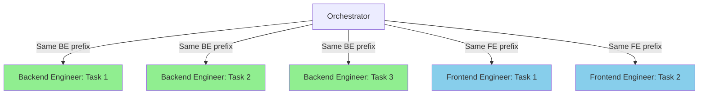

# Context Caching: What It Is and How ConnectSW Benefits

## What Is Context Caching (Prompt Caching)?

Context caching — officially called **Prompt Caching** in the Anthropic API — lets you cache frequently reused portions of your prompts between API calls. Instead of re-processing the same system instructions, tool definitions, and background context on every request, the API stores and reuses them.

### How It Works

```
┌─────────────────────────────────────────────────┐
│  API Request Structure (top → bottom)           │
│                                                 │
│  ┌──────────────────────────────┐  ← CACHED    │
│  │ Tool definitions             │    (stable)   │
│  │ System instructions          │               │
│  │ Background context / docs    │               │
│  │ Few-shot examples            │               │
│  │ ── cache_control marker ──   │               │
│  └──────────────────────────────┘               │
│  ┌──────────────────────────────┐  ← NOT CACHED│
│  │ Conversation history         │    (variable) │
│  │ Current user message         │               │
│  └──────────────────────────────┘               │
└─────────────────────────────────────────────────┘
```

You place static content at the **top** of your prompt and mark it with `cache_control`. On subsequent calls with an identical prefix, the API returns a **cache hit** — skipping re-processing of that entire block.

### Key Numbers

| Metric | Value |
|--------|-------|
| Cost reduction on cache hits | **Up to 90%** (reads cost 0.1x base input price) |
| Latency reduction | **Up to 85%** for long prompts |
| Cache write overhead | 1.25x base price (5-min TTL) or 2x (1-hour TTL) |
| Break-even point | **2 requests** with the same cached prefix |
| TTL options | 5 minutes (default) or 1 hour (extended) |
| Minimum cacheable tokens | 1,024 per checkpoint |

### Automatic Prompt Caching (New — Feb 2026)

The Claude API now **automatically caches system instructions** without any explicit `cache_control` markers. This means every ConnectSW agent invocation that reuses the same system prompt benefits immediately.

---

## How ConnectSW Already Aligns With Caching

ConnectSW's context engineering protocols were designed with KV-cache mechanics in mind. Here's the alignment:

### 1. Attention-Optimized Prompt Ordering (Article XII)

Our `context-engineering.md` protocol already mandates:

```
STABLE sections at TOP      → Role, Rules, Tech Stack, TDD, Constraints
SEMI-STABLE in MIDDLE       → Component Registry, Product conventions
VARIABLE in MIDDLE-LOW      → Patterns, Prior task context
CRITICAL at END              → Current task, Acceptance criteria
```

**Why this matters for caching:** The stable prefix is identical across invocations of the same agent type. This means the Backend Engineer's role definition, tech stack rules, and coding constraints are cached once and reused on every subsequent call — hitting the cache automatically.

**Estimated cache hit rate: 70%+** (documented in our protocol).

### 2. Progressive Disclosure Levels

| Level | Tokens | Caching Impact |
|-------|--------|----------------|
| Trivial (~500 tokens) | Role + Task + Constraints | Small prefix, but highly reusable |
| Simple (~2,200 tokens) | + Patterns + Context Hub | Medium prefix, good cache reuse |
| Standard (~5,500 tokens) | + Full Brief + Registry | Large prefix, excellent cache savings |
| Complex (~9,000 tokens) | All sections expanded | Maximum prefix, maximum savings |

The higher the complexity level, the larger the cached prefix, and the greater the cost savings per request.

### 3. Direct Delivery Protocol

Specialists write deliverables to files rather than passing them through the Orchestrator. This means:
- The Orchestrator's prompt stays **smaller and more stable** (better cache hits)
- Specialists receive **focused, cacheable context** per their role

### 4. Agent Role Definitions

Each agent (Backend Engineer, Frontend Engineer, QA Engineer, etc.) has a **fixed role definition** in `.claude/agents/`. These are identical across all tasks assigned to that agent — a perfect caching target.

---

## Concrete Benefits for ConnectSW

### Cost Savings

```
Without caching:
  10 agent invocations × 9,000 input tokens = 90,000 tokens billed at full price

With caching (70% prefix cached):
  10 invocations × 6,300 cached tokens × 0.1 price = 6,300 effective tokens
  10 invocations × 2,700 uncached tokens × 1.0 price = 27,000 effective tokens
  Total effective: 33,300 tokens (63% cost reduction)
```

For a complex product build involving 50+ agent invocations, this compounds significantly.

### Latency Improvements

A typical ConnectSW complex task sends ~9,000 tokens of context. With caching:
- **First call:** Normal latency (cache write)
- **Subsequent calls:** Up to 85% faster time-to-first-token

This directly speeds up the Orchestrator's multi-agent workflows where several specialists are invoked in sequence.

### Scaling Agent Workflows

ConnectSW's architecture (Orchestrator → many specialist agents) creates a pattern of **repeated, stable prefixes per agent type**. This is the ideal use case for prompt caching:



Tasks 2 and 3 for each agent type hit the cache from Task 1.

---

## Implementation Recommendations

### Phase 1: Automatic (Zero Effort)

Anthropic's automatic prompt caching (Feb 2026) already caches system instructions. ConnectSW benefits immediately if using the Claude API directly.

**Action:** Verify API calls use the `/v1/messages` endpoint (not OpenAI compatibility mode).

### Phase 2: Explicit Cache Control Markers

Add `cache_control` markers to agent prompt assembly to cache beyond just system instructions:

```typescript
// Example: Backend Engineer prompt assembly
const messages = [
  {
    role: "user",
    content: [
      // Stable: agent role + rules + tech stack (CACHED)
      { type: "text", text: agentRoleDefinition },
      { type: "text", text: techStackRules },
      { type: "text", text: tddProtocol },
      {
        type: "text",
        text: componentRegistry,
        cache_control: { type: "ephemeral" } // Cache everything above
      },
      // Variable: current task (NOT CACHED)
      { type: "text", text: currentTaskBrief }
    ]
  }
];
```

### Phase 3: Extended TTL for Long Workflows

For complex product builds that span hours, use the **1-hour TTL** option:

```typescript
cache_control: { type: "ephemeral", ttl: "1h" }
```

This costs 2x base price for writes but keeps caches alive across the full build workflow.

### Phase 4: Cache-Aware Orchestrator

Enhance the Orchestrator to:
1. **Batch same-agent tasks** — send all Backend Engineer tasks in sequence to maximize cache hits
2. **Track cache metrics** — log `cache_creation_input_tokens` and `cache_read_input_tokens` from API responses
3. **Optimize prefix stability** — minimize changes to the stable prefix between invocations

---

## Relationship to Existing Protocols

| ConnectSW Protocol | Caching Synergy |
|-------------------|----------------|
| `context-engineering.md` | KV-cache ordering already optimized for prompt caching |
| `context-compression.md` | Compressed summaries = smaller variable sections = larger cache ratio |
| `context-hub.md` | Fetched API docs could be cached as semi-stable content |
| `direct-delivery.md` | Keeps Orchestrator prompts stable = better cache hits |
| `parallel-execution.md` | Parallel agents of same type can share cache within TTL window |

---

## Summary

Context caching is not a new concept for ConnectSW — our context engineering protocols were **designed around KV-cache mechanics from the start**. The Anthropic Prompt Caching API gives us the infrastructure to realize these benefits at the API level:

- **90% cost reduction** on cached content
- **85% latency reduction** on long prompts
- **Natural fit** with our stable agent prefixes and progressive disclosure
- **Zero-effort baseline** via automatic caching (Feb 2026)
- **Room to optimize** with explicit markers, extended TTLs, and cache-aware orchestration

---

## Sources

- [Anthropic Prompt Caching Docs](https://platform.claude.com/docs/en/build-with-claude/prompt-caching)
- [Anthropic Prompt Caching Announcement](https://www.anthropic.com/news/prompt-caching)
- [Automatic Prompt Caching (Feb 2026)](https://medium.com/ai-software-engineer/anthropic-just-fixed-the-biggest-hidden-cost-in-ai-agents-using-automatic-prompt-caching-9d47c95903c5)
- [Spring AI Anthropic Prompt Caching Guide](https://spring.io/blog/2025/10/27/spring-ai-anthropic-prompt-caching-blog/)
- [AWS Bedrock Prompt Caching](https://docs.aws.amazon.com/bedrock/latest/userguide/prompt-caching.html)
- [Google Vertex AI Prompt Caching](https://docs.google.com/vertex-ai/generative-ai/docs/partner-models/claude/prompt-caching)
