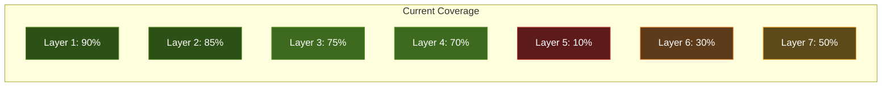
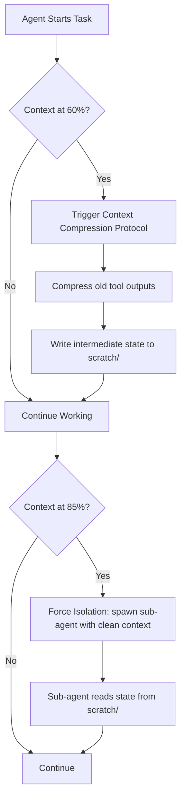
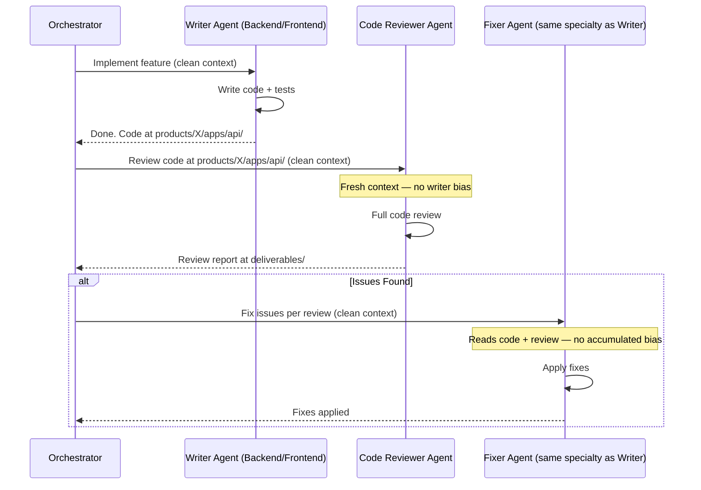
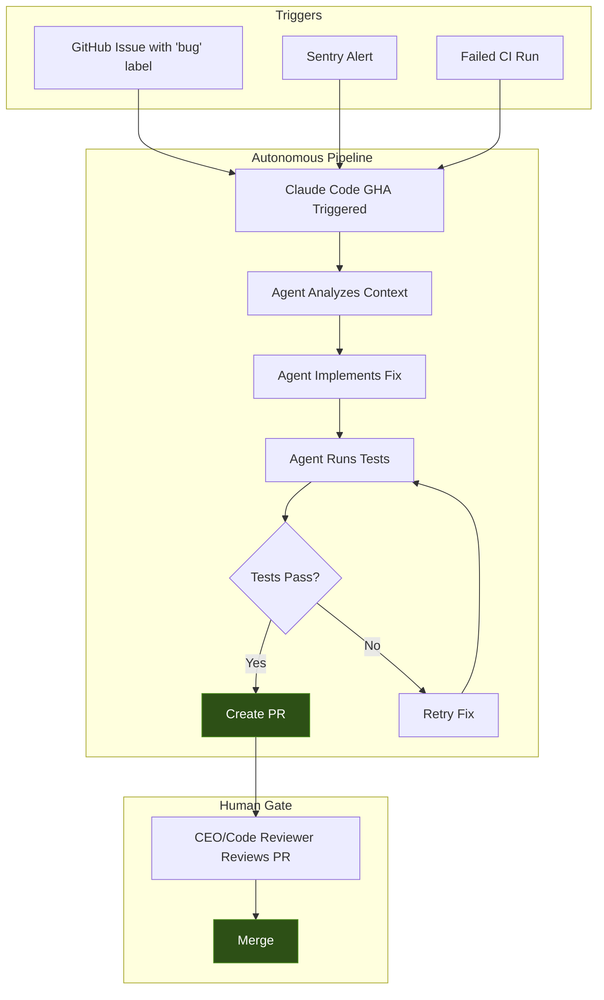
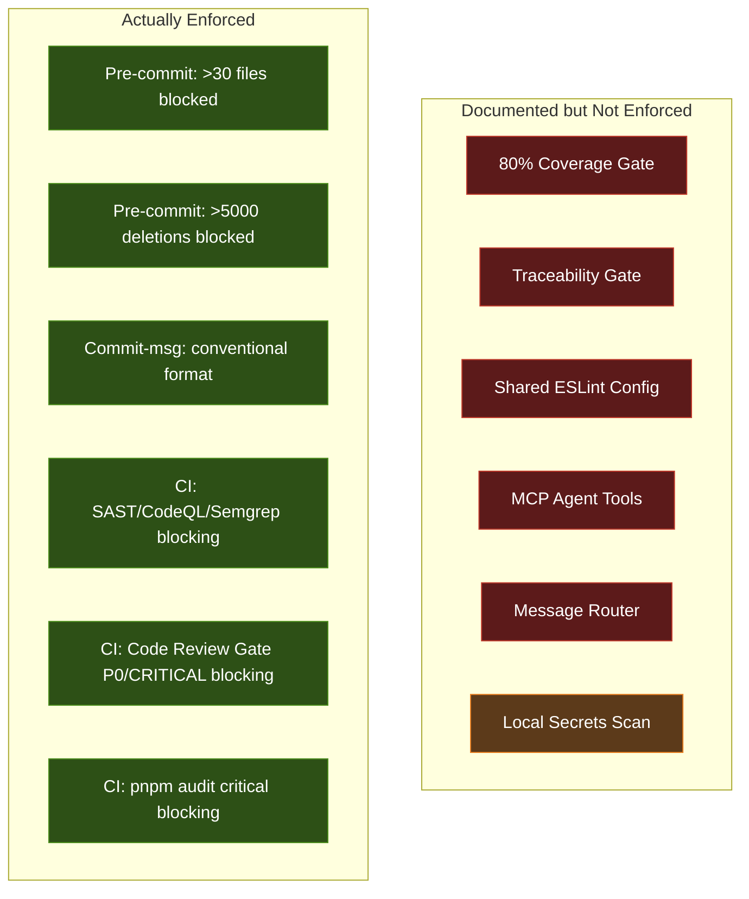
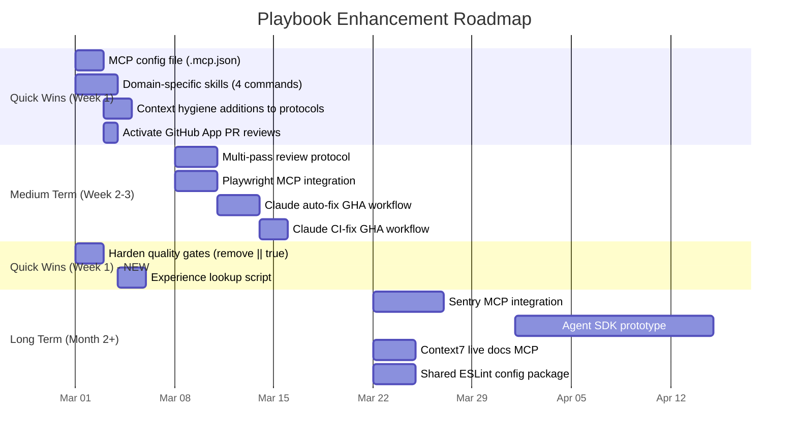

# Playbook Enhancement Plan: Applying the 100x Playbook to ConnectSW

> **Date**: 2026-03-01
> **Purpose**: Gap analysis between the Claude Code 100x Playbook and our current agentic workflow, with concrete enhancement actions

---

## Current State Assessment

### What We Already Have (Strong Foundation)

ConnectSW's existing infrastructure already implements **~60% of the playbook** at a sophisticated level:

| Playbook Layer | Current Coverage | Assessment |
|---------------|-----------------|------------|
| Layer 1: CLAUDE.md | **90%** | Excellent — well-structured, protocol pitching in place |
| Layer 2: Plan→Execute | **85%** | spec-kit pipeline, TDD mandate, verification protocols |
| Layer 3: Parallel Agents | **75%** | Parallel execution protocol, background tasks, worktree docs |
| Layer 4: Subagents & Skills | **70%** | 16+ agents, skills system, but limited domain-specific skills |
| Layer 5: Agent SDK | **10%** | Future plan only — not yet built |
| Layer 6: MCP Integrations | **30%** | GitNexus only — missing browser, error monitoring, live docs |
| Layer 7: GitHub Actions | **50%** | CI per product + claude.yml, but not fully autonomous |

---

## Gap Analysis: Where the Playbook Adds Value

### Gap 1: Context Window Hygiene (Layer 1 → Layer 2)

**Current State**: We have context-engineering.md and context-compression.md protocols, but they're **documented, not enforced**.

**Gap**: No automated `/clear` triggers. No context usage monitoring. No automatic `/compact` when context exceeds thresholds. Agents don't actively manage their context — they just run until degradation hits.

**Enhancement**:

**Concrete Actions**:
1. Add a `context-hygiene` hook (`.claude/hooks/context-monitor.sh`) that logs context usage
2. Update orchestrator prompt to explicitly instruct agents: "If you've read >10 files, use /compact before continuing"
3. Add context-check step to the Verification-Before-Completion protocol

---

### Gap 2: Multi-Agent Review Pipeline (Layer 3)

**Current State**: Code Reviewer agent exists but operates as a single-pass review. No structured Writer → Reviewer → Editor pipeline with context isolation.

**Gap**: The playbook's "Claude A writes → Claude B reviews → Claude C fixes" pattern with `/clear` between each eliminates accumulated bias. Our current flow has the same agent session accumulate context from writing through review.

**Enhancement**:

**Concrete Actions**:
1. Add a `multi-pass-review` protocol to `.claude/protocols/multi-pass-review.md`
2. Update the orchestrator to support a `review_pipeline: true` flag on tasks
3. When enabled, orchestrator chains: implement → code-review → fix (each as separate agent invocations)

---

### Gap 3: MCP Integrations (Layer 6)

**Current State**: Only GitNexus MCP is active. Missing critical integrations for browser testing, error monitoring, and live documentation.

**Gap**: Agents can't see browser console errors, can't read Sentry logs, and may hallucinate API signatures for external libraries.

**Enhancement Priority Matrix**:

| MCP Integration | Impact | Effort | Priority |
|----------------|--------|--------|----------|
| **Playwright MCP** | High — visual testing, console log access | Medium | P0 |
| **GitHub App** (claude-code-review) | High — auto-review every PR | Low (already partially set up) | P0 |
| **Sentry MCP** | Medium — auto-bug-fixing | Medium | P1 |
| **Context7 / Live Docs** | Medium — prevent API hallucination | Low | P1 |

**Concrete Actions**:
1. Configure Playwright MCP in `.mcp.json` for browser-based testing during QA gate
2. Activate the GitHub App for automatic PR reviews (claude-code-review.yml already exists but needs secrets)
3. Add Context7 MCP for live documentation of Fastify, Prisma, Next.js APIs
4. Create `.mcp.json` configuration file in project root

---

### Gap 4: Autonomous GitHub Actions Pipeline (Layer 7)

**Current State**: CI/CD workflows run tests and linting. `claude.yml` responds to `@claude` mentions. But there's no **autonomous bug-to-PR pipeline**.

**Gap**: The playbook describes a full async loop: bug report → GHA → Claude agent → tested fix → PR. Our current setup is reactive (human triggers `@claude`), not autonomous.

**Enhancement**:

**Concrete Actions**:
1. Create `.github/workflows/claude-auto-fix.yml` — triggers on issues labeled `bug` + `auto-fix`
2. Create `.github/workflows/claude-ci-fix.yml` — triggers when CI fails on a PR, attempts to fix
3. Configure with appropriate permissions (contents: write, pull-requests: write)
4. Add safety gate: auto-fix PRs require manual approval before merge

---

### Gap 5: Domain-Specific Skills (Layer 4)

**Current State**: Skills are mostly operational (`/orchestrator`, `/audit`, `/status`, spec-kit suite). Missing domain-specific reusable workflows.

**Gap**: The playbook emphasizes skills like `/deploy-check` that encode domain knowledge. ConnectSW has unique domains (Shariah compliance, Arabic NLP, Qatar regulatory) that should have dedicated skills.

**Concrete Actions**:
1. Create `.claude/commands/compliance-check.md` — Shariah/QFCRA compliance validation
2. Create `.claude/commands/i18n-check.md` — Arabic/English bilingual completeness check
3. Create `.claude/commands/pre-deploy.md` — Production readiness checklist
4. Create `.claude/commands/security-scan.md` — OWASP Top 10 quick scan

---

### Gap 6: Agent SDK Integration (Layer 5)

**Current State**: Not started. This is the longest-term gap.

**Gap**: The playbook describes building headless agents for CI/CD, programmatic chains, and customer-facing products. This is where GovernAI's agent runtime would live.

**This is a strategic initiative, not a tactical enhancement. Track in product roadmap.**

---

### Gap 7: Enforcement vs Documentation (Infrastructure Debt)

The deep audit revealed that several constitutional mandates are **documented but not mechanically enforced**. The playbook's core principle — "Tests as Self-Verification" — demands that checks actually block, not just advise.

**Current State** (from infrastructure audit):

| Constitutional Mandate | Stated Requirement | Actual Enforcement |
|----------------------|-------------------|-------------------|
| 80% test coverage (Article III) | Blocking | `continue-on-error: true` in CI — **advisory only** |
| Traceability gate (Article VI) | Blocking by Sprint 3 | `traceability-gate.sh \|\| true` — **advisory only** |
| Shared ESLint config (Article XIV) | `@connectsw/eslint-config` package | Package not created — **aspirational** |
| MCP agent tools (agent-tools.yml) | Per-agent tool access | Explicitly marked "PLANNED, NOT IMPLEMENTED" |
| `message-router.ts` | Runtime agent message routing | Exists as a file — **not wired to any runtime** |
| Secrets scanning (pre-commit) | Gitleaks blocking | Gracefully skipped if not installed — **optional** |

**Why This Matters**: The playbook says "Tests as Self-Verification" is the single highest-leverage thing. But if quality gates don't actually block, they create a false sense of security — agents "pass" checks that aren't really checking.

**Concrete Actions**:
1. **Remove `continue-on-error: true`** from coverage steps in product CI workflows — enforce the 80% threshold
2. **Remove `|| true`** from traceability gate invocations — make it a hard failure
3. **Create `packages/eslint-config/`** with the shared security-enforcing ESLint rules referenced in Article XIV
4. **Add gitleaks/actionlint to CI setup step** so local pre-commit hooks always have the tools available
5. **Graduate each enforcement incrementally** — start with one product (connectgrc or stablecoin-gateway) as the reference implementation, then roll out

---

### Gap 8: Agent Experience Data Is Underutilized

**Current State**: 17 agent experience JSON files exist in `.claude/memory/agent-experiences/` tracking completed tasks, patterns learned, common mistakes, and preferred approaches. The orchestrator's prompt template references "pre-scored patterns" but the 5-dimension relevance scoring is manual/implied.

**Gap**: The playbook emphasizes that **plans and prompts compound**. The experience data is a compounding asset, but it's not systematically fed back into agent performance. There's no automated mechanism to surface "last time the Backend Engineer worked on a Prisma migration, they hit X issue" before starting a similar task.

**Concrete Actions**:
1. Add a **pre-task experience check** step to the orchestrator: before dispatching, grep the agent's experience file for keywords matching the current task
2. Include the top 3 relevant past experiences in the agent's prompt (fits within Level 2 context budget)
3. Add a **post-task experience update** step: after task completion, append learnings to the experience file
4. Create `.claude/scripts/memory/experience-lookup.sh` — takes agent name + task keywords, returns relevant past experiences

---

## Implementation Roadmap

---

## Priority Summary

| # | Enhancement | Impact | Effort | Timeline |
|---|------------|--------|--------|----------|
| 1 | **Harden quality gates** (remove `continue-on-error`, `\|\| true`) | Critical | Low | Week 1 |
| 2 | Domain-specific skills (compliance, i18n, deploy, security) | High | Low | Week 1 |
| 3 | MCP configuration (Playwright, Context7) | High | Medium | Week 1-2 |
| 4 | Multi-pass review protocol | High | Medium | Week 2 |
| 5 | Autonomous bug-fix GHA pipeline | High | Medium | Week 2-3 |
| 6 | Context hygiene enforcement | Medium | Low | Week 1 |
| 7 | Agent experience data utilization | Medium | Low | Week 1 |
| 8 | Agent SDK (GovernAI runtime) | Transformative | High | Month 2+ |

---

## Key Insight

The playbook's meta-philosophy — **"Outputs are disposable; plans and prompts compound"** — maps perfectly to ConnectSW's existing spec-kit pipeline. Our specifications, plans, and task lists ARE the compounding assets. The enhancements above focus on **closing the automation loop**: making agents more autonomous (GHA pipelines), more aware (MCP integrations), and more reliable (multi-pass reviews, context hygiene).

Two biggest unlocks:

1. **Gap 7 (Enforcement Hardening)** — The fastest ROI. Quality gates that actually block turn documentation into defense. This is pure discipline, no new tooling needed.

2. **Gap 4 (Autonomous GHA Pipeline)** — The transformative shift. It turns ConnectSW from a system where the CEO manually triggers all work into one where work flows in continuously and the CEO's role shifts to **reviewing and approving**, not initiating.

Together, these two gaps represent the difference between a well-documented system and a **self-enforcing, self-healing** one.
