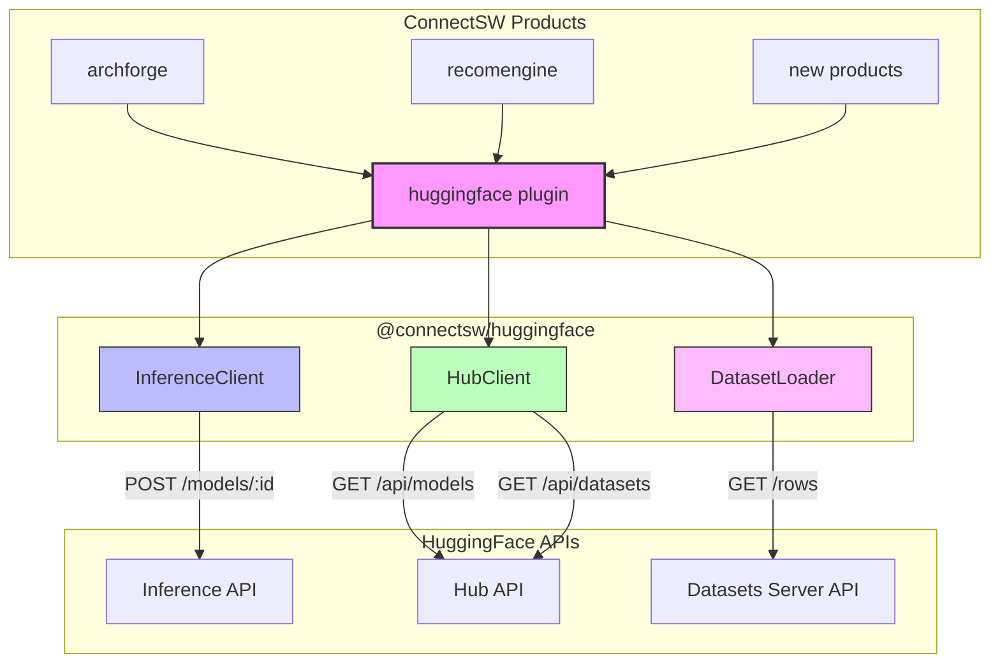
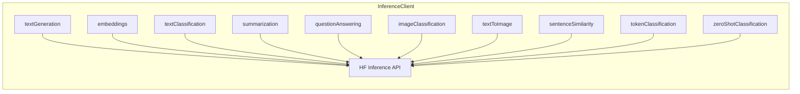
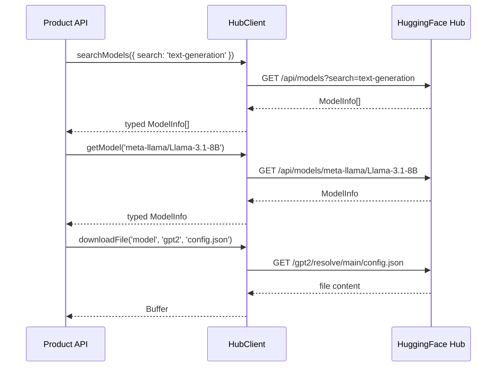
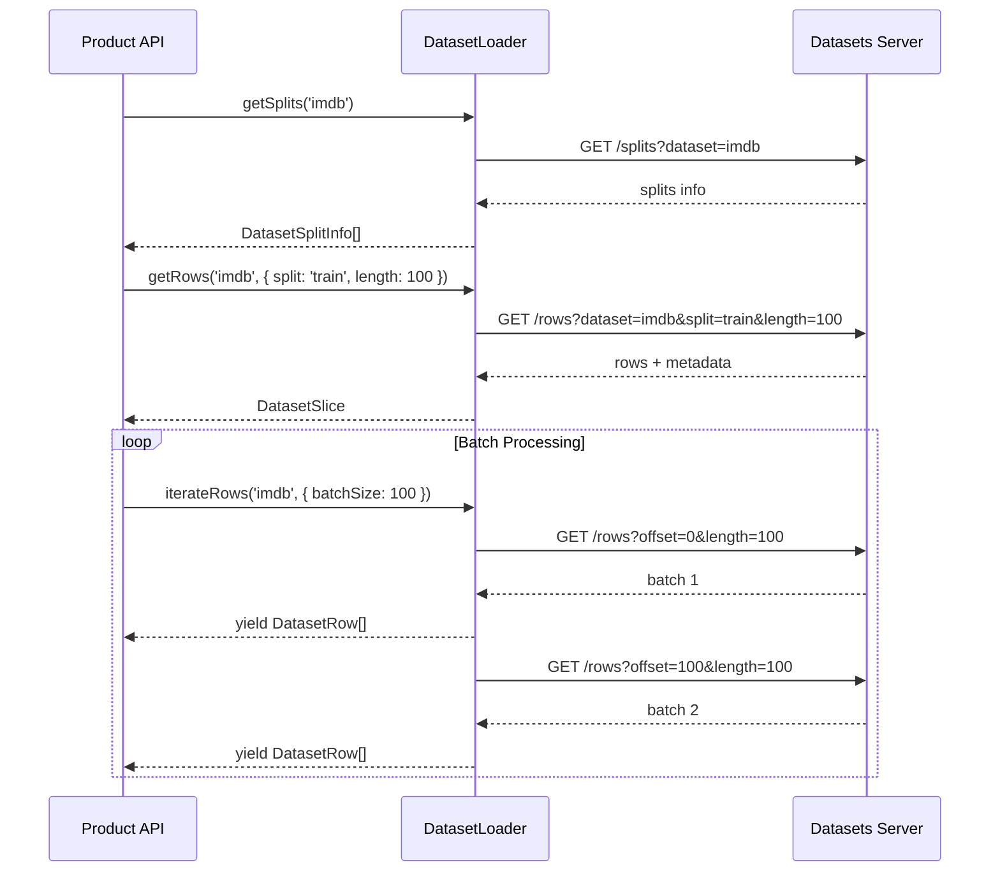

# @connectsw/huggingface

HuggingFace integration for ConnectSW products — run inference, browse models/datasets, and process data from the HuggingFace Hub.

## Business Context

ConnectSW products increasingly need AI/ML capabilities: text generation, embeddings for search/recommendations, classification, summarization, and image generation. This package provides a unified, typed interface to the HuggingFace ecosystem so any product can add ML features without reinventing the integration.

## Architecture



## Components

### InferenceClient

Run models hosted on HuggingFace Hub.



**Supported tasks:**

| Task | Method | Example Model |
|------|--------|---------------|
| Text Generation | `textGeneration()` | `meta-llama/Llama-3.1-8B-Instruct` |
| Embeddings | `embeddings()` | `sentence-transformers/all-MiniLM-L6-v2` |
| Text Classification | `textClassification()` | `distilbert/distilbert-base-uncased-finetuned-sst-2-english` |
| Summarization | `summarization()` | `facebook/bart-large-cnn` |
| Question Answering | `questionAnswering()` | `deepset/roberta-base-squad2` |
| Image Classification | `imageClassification()` | `google/vit-base-patch16-224` |
| Text to Image | `textToImage()` | `stabilityai/stable-diffusion-xl-base-1.0` |
| Sentence Similarity | `sentenceSimilarity()` | `sentence-transformers/all-MiniLM-L6-v2` |
| Token Classification (NER) | `tokenClassification()` | `dslim/bert-base-NER` |
| Zero-Shot Classification | `zeroShotClassification()` | `facebook/bart-large-mnli` |

### HubClient

Browse, search, and download from the HuggingFace Hub.



**Key methods:**

- `searchModels()` / `searchDatasets()` — Search with filters (author, pipeline_tag, library, sort)
- `getModel()` / `getDataset()` — Get details for a specific repo
- `listModelFiles()` / `listDatasetFiles()` — List files in a repo
- `trendingModels()` / `trendingDatasets()` — Most-liked repos
- `modelsByTask()` — Top models for a specific pipeline task
- `downloadFile()` — Download any file from a model or dataset repo

### DatasetLoader

Load and process datasets from the HuggingFace Hub.



**Key methods:**

- `getDatasetInfo()` — Full dataset metadata
- `getSplits()` — Available splits (train, test, validation)
- `getRows()` — Fetch rows with pagination
- `getFirstRows()` — Quick preview of a dataset
- `searchRows()` — Full-text search within a dataset
- `getParquetFiles()` — Get Parquet file URLs for direct access
- `iterateRows()` — Async generator for batch processing

## Getting Started

### 1. Environment Variable

```bash
# .env
HUGGINGFACE_API_KEY=hf_xxxxxxxxxxxxx
# or
HF_API_KEY=hf_xxxxxxxxxxxxx
```

### 2. Direct Usage (no Fastify)

```typescript
import { InferenceClient, HubClient, DatasetLoader } from '@connectsw/huggingface';

// Text generation
const inference = new InferenceClient({ apiKey: process.env.HF_API_KEY! });
const result = await inference.textGeneration({
  model: 'meta-llama/Llama-3.1-8B-Instruct',
  inputs: 'Explain quantum computing in simple terms:',
  parameters: { max_new_tokens: 200, temperature: 0.7 },
});
console.log(result[0].generated_text);

// Search models
const hub = new HubClient({ apiKey: process.env.HF_API_KEY! });
const models = await hub.searchModels({
  pipeline_tag: 'text-generation',
  sort: 'downloads',
  direction: 'desc',
  limit: 10,
});

// Load dataset rows
const datasets = new DatasetLoader({ apiKey: process.env.HF_API_KEY! });
const slice = await datasets.getRows('imdb', { split: 'train', length: 50 });
console.log(`Got ${slice.rows.length} rows from ${slice.num_rows_total} total`);
```

### 3. Fastify Plugin (recommended for products)

```typescript
import { huggingfacePlugin } from '@connectsw/huggingface';

// In your app.ts
fastify.register(huggingfacePlugin, {
  apiKey: process.env.HF_API_KEY, // or auto-reads from env
  timeoutMs: 60000,
});

// In route handlers
fastify.get('/generate', async (request, reply) => {
  const result = await fastify.hf.inference.textGeneration({
    model: 'meta-llama/Llama-3.1-8B-Instruct',
    inputs: request.query.prompt,
    parameters: { max_new_tokens: 500 },
  });
  return { text: result[0].generated_text };
});

fastify.get('/models', async (request, reply) => {
  const models = await fastify.hf.hub.searchModels({
    pipeline_tag: 'text-generation',
    limit: 20,
  });
  return { models };
});
```

### 4. Batch Dataset Processing

```typescript
import { DatasetLoader } from '@connectsw/huggingface';

const loader = new DatasetLoader({ apiKey: process.env.HF_API_KEY! });

// Process dataset in batches using async generator
for await (const batch of loader.iterateRows('imdb', {
  split: 'train',
  batchSize: 100,
})) {
  for (const row of batch) {
    // Process each row
    console.log(row);
  }
}
```

## Error Handling

All errors are thrown as `HuggingFaceError` with structured info:

```typescript
import { HuggingFaceError } from '@connectsw/huggingface';

try {
  await inference.textGeneration({ model: 'nonexistent', inputs: 'test' });
} catch (error) {
  if (error instanceof HuggingFaceError) {
    console.log(error.statusCode); // 404
    console.log(error.errorType);  // 'InferenceError'
    console.log(error.toJSON());   // structured JSON
  }
}
```

## Exports

| Path | Contents |
|------|----------|
| `@connectsw/huggingface` | All clients, types, plugin |
| `@connectsw/huggingface/clients/inference` | InferenceClient only |
| `@connectsw/huggingface/clients/hub` | HubClient only |
| `@connectsw/huggingface/utils/datasets` | DatasetLoader only |
| `@connectsw/huggingface/plugins/huggingface` | Fastify plugin only |
