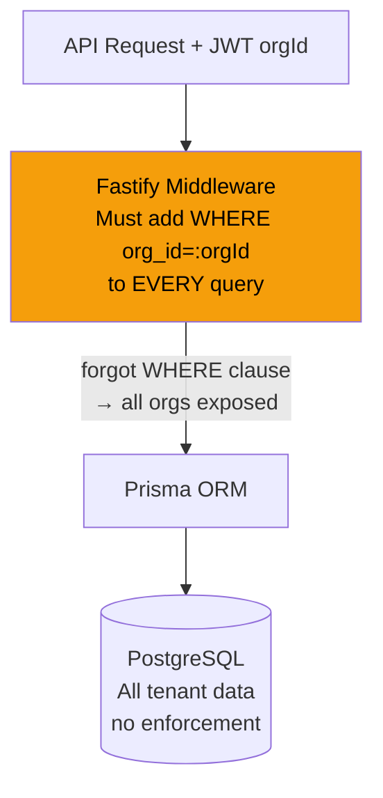
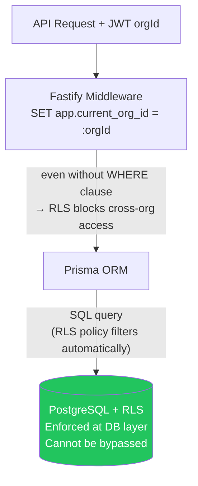

# ADR-001: Multi-Tenancy via PostgreSQL Row Level Security

## Status
Accepted

## Context

AI Fluency Platform is a B2B SaaS product serving multiple enterprise organizations simultaneously. Each organization's assessment data, user profiles, and learning records must be completely isolated — a user from Org A must never be able to access Org B's data.

We need to decide at which layer to enforce tenant isolation:

1. **Application layer**: Fastify middleware adds `WHERE org_id = :orgId` to every query
2. **ORM layer**: Prisma middleware intercepts every query and injects tenant filter
3. **Database layer**: PostgreSQL Row Level Security (RLS) policies

This decision has GDPR Article 32 implications (appropriate technical measures for data protection) and determines the blast radius of any tenant isolation bug.

### Threat Model

If tenant isolation is implemented only at the application layer, a single bug (missing WHERE clause, bypassed middleware, code path that doesn't call middleware) exposes all tenant data. This is a complete multi-tenant isolation failure.

### Before (hypothetical app-layer filtering)



### After (RLS-enforced)



## Decision

Implement multi-tenancy using **PostgreSQL Row Level Security (RLS)** policies as the primary enforcement mechanism.

Every tenant-scoped table will have:
1. `org_id UUID NOT NULL` column
2. `ALTER TABLE <table> ENABLE ROW LEVEL SECURITY`
3. A `USING (org_id = current_setting('app.current_org_id')::uuid)` policy

The application sets `app.current_org_id` as a PostgreSQL session variable at the start of every transaction via a Prisma middleware hook.

### Implementation Detail

```sql
-- Per-table setup (applied in migrations)
ALTER TABLE assessment_sessions ENABLE ROW LEVEL SECURITY;

CREATE POLICY org_isolation ON assessment_sessions
  FOR ALL
  USING (org_id = current_setting('app.current_org_id')::uuid);

-- Two database roles:
-- api_service_rls: used by application (RLS enforced)
-- api_service: used by migrations (BYPASSRLS for admin tasks)
ALTER ROLE api_service BYPASSRLS;
```

```typescript
// Prisma middleware in apps/api/src/plugins/prisma.ts
fastify.addHook('onRequest', async (request) => {
  const orgId = request.jwtPayload?.orgId;
  if (orgId) {
    await prisma.$executeRaw`SET LOCAL app.current_org_id = ${orgId}`;
  }
});
```

### Tables with RLS

| Table | org_id column | Notes |
|-------|--------------|-------|
| users | org_id | Email unique per (org_id, email) |
| user_sessions | org_id | Denormalized for RLS |
| sso_configs | org_id | Per-org SSO config |
| teams | org_id | |
| assessment_templates | org_id | NULL for platform templates |
| assessment_sessions | org_id | |
| responses | org_id | |
| fluency_profiles | org_id | |
| learning_paths | org_id | |
| learning_path_modules | org_id | |
| module_completions | org_id | |
| certificates | org_id | |
| audit_logs | org_id | |

### Tables without RLS (global)

| Table | Reason |
|-------|--------|
| organizations | SUPER_ADMIN only — accessed via service role |
| questions | Platform-wide question bank |
| behavioral_indicators | Platform-wide catalog |
| learning_modules | Platform-wide content |
| algorithm_versions | Platform-wide |

## Consequences

### Positive

- **Impossible to bypass**: Even a Fastify route that forgets to filter by org sees only its own org's data
- **Defense in depth**: Operates independently of application code bugs
- **GDPR Article 32 compliance**: Technical measure at the data layer
- **Auditable**: `pg_audit` can log RLS policy applications
- **Performance**: PostgreSQL optimizes RLS policies with the planner (index on `org_id` used)
- **Simple application code**: No need for `.where({ orgId: request.orgId })` on every query

### Negative

- **Prisma complexity**: Prisma does not natively manage RLS — must use `$executeRaw` for `SET LOCAL`
- **Connection pooling**: Session-level variables in PgBouncer transaction mode require `SET LOCAL` (transaction-scoped, not session-scoped). Must use `SET LOCAL` not `SET`.
- **Migration complexity**: Every new tenant-scoped table needs RLS policy added in migration
- **Testing**: Integration tests must set `app.current_org_id` or use `BYPASSRLS` role
- **Admin queries**: Reporting/admin queries must use `BYPASSRLS` role or explicitly set org context

### Neutral

- Connection pool must use the `api_service_rls` role (not superuser) in production
- Migrations use `api_service` (BYPASSRLS) role
- PgBouncer must be configured in transaction mode (not session mode) for `SET LOCAL` to work correctly

## Alternatives Considered

### Option A: Application-Layer Tenant Filtering

Every Prisma query includes `where: { orgId: request.orgId }`.

**Pros**: Simpler setup, no PostgreSQL-specific features
**Cons**: Any missed WHERE clause exposes all tenant data. A single bug = complete isolation failure. Hard to audit. Does not satisfy GDPR technical measures at infrastructure layer.

**Why rejected**: The failure mode is catastrophic and undetectable by code review. RLS makes the safe path the only path.

### Option B: Separate Schemas Per Tenant

Each organization gets its own PostgreSQL schema (`org_<id>.users`, `org_<id>.assessment_sessions`, etc.).

**Pros**: Complete schema-level isolation, simpler RLS not needed
**Cons**: Prisma schema-per-tenant requires runtime schema management. Migrations must run N times (once per org). Connection pool multiplied by org count. Prohibitive at scale (1000+ orgs = 1000+ schemas).

**Why rejected**: Operational complexity grows linearly with tenant count. Not viable for SaaS.

### Option C: Separate Databases Per Tenant

Each organization gets its own PostgreSQL database.

**Pros**: Maximum isolation, no RLS needed
**Cons**: Prohibitive infrastructure cost, cross-tenant analytics impossible, migrations run N times, connection pool N × pool_size.

**Why rejected**: Enterprise SaaS at 5,000+ users requires shared infrastructure economics.

## References

- [PostgreSQL Row Level Security documentation](https://www.postgresql.org/docs/15/ddl-rowsecurity.html)
- [Prisma RLS guide](https://www.prisma.io/docs/guides/performance-and-optimization/prisma-client-transactions-guide)
- GDPR Article 32 — Security of processing (technical measures)
- ADR-002 — Scoring Algorithm (independent concern)
