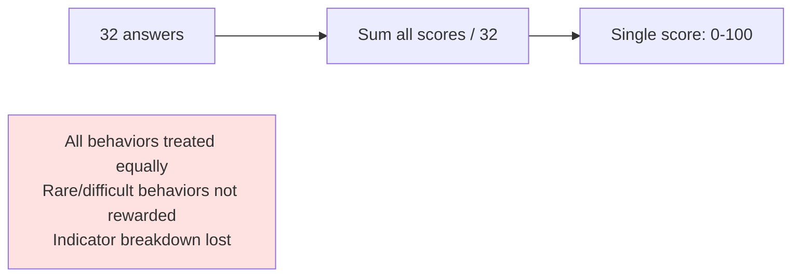
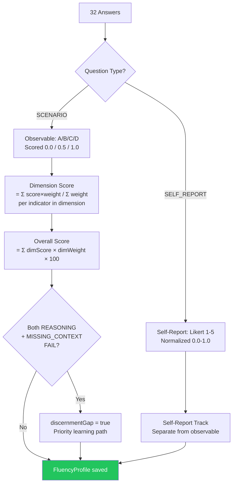
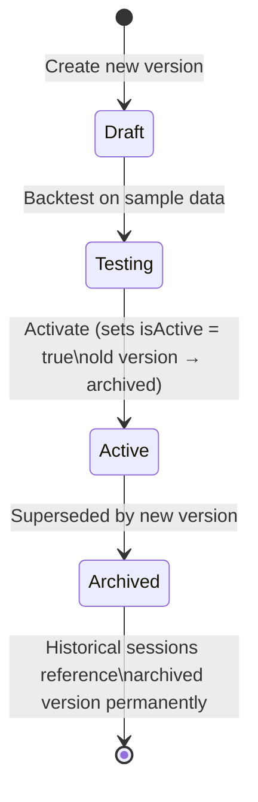

# ADR-002: Prevalence-Weighted Scoring Algorithm (Server-Side, Versioned)

## Status
Accepted

## Context

The AI Fluency Assessment requires scoring 32 questions across 4 dimensions (Delegation, Description, Discernment, Diligence) using Anthropic's 4D behavioral framework. The scoring must:

1. Use **prevalence weighting**: rare/difficult behaviors contribute more to the score than common behaviors
2. Keep **self-report and observable tracks separate**: 11 observable indicators scored from scenario questions; 13 unobservable from Likert self-report
3. Support **algorithm upgrades** without invalidating historical scores (a learner who scored 72 under v1 must still show 72, not be retroactively rescored under v2)
4. Detect the **Discernment Gap**: when both "Question AI reasoning" AND "Identify missing context" indicators both Fail

We must decide where and how to compute scores, and how to handle future algorithm updates.

### Scoring Formula (v2)

```
Indicator Score (i) = answer_score(i)         // SCENARIO: 0.0, 0.5, 1.0 per option
                    | likert_normalized(i)     // SELF_REPORT: (answer-1)/4 → 0.0-1.0

Dimension Score (d) = Σ(score(i) × prevalenceWeight(i)) / Σ(prevalenceWeight(i))
                      for all indicators in dimension d

Overall Score = Σ(dimensionScore(d) × dimensionWeight(d)) × 100
                for d in {Delegation, Description, Discernment, Diligence}

Discernment Gap = DELEGATION_REASONING.status == FAIL
               && DISCERNMENT_MISSING_CONTEXT.status == FAIL
```

### Before (naive average — rejected)



### After (prevalence-weighted, versioned)



## Decision

Implement scoring **server-side** as a pure TypeScript service (`ScoringService`) with:

1. **Algorithm versioning**: Each `AssessmentSession` stores `algorithmVersionId`. Historical profiles are never rescored. New sessions use the current active version.
2. **Prevalence weights**: Stored per `BehavioralIndicator` in the database. Algorithm version controls which weights are applied.
3. **Separate score tracks**: `FluencyProfile.dimensionScores` (observable) and `FluencyProfile.selfReportScores` (self-report) stored separately in JSONB.
4. **Indicator breakdown**: Full per-indicator scores/status stored in `FluencyProfile.indicatorBreakdown` JSONB for profile display.
5. **Discernment gap detection**: Computed during scoring, stored as `FluencyProfile.discernmentGap` boolean.

### ScoringService Interface

```typescript
// apps/api/src/services/scoring.service.ts

export interface ScoredProfile {
  overallScore: number;          // 0-100
  dimensionScores: DimensionScores;
  selfReportScores: DimensionScores;
  indicatorBreakdown: IndicatorBreakdown;
  discernmentGap: boolean;
  algorithmVersion: number;
}

export class ScoringService {
  /**
   * Main scoring entry point. Pure function — no DB writes.
   * Caller persists the result.
   */
  score(responses: Response[], template: AssessmentTemplate, indicators: BehavioralIndicator[]): ScoredProfile;

  /**
   * Detect discernment gap condition.
   * Both DELEGATION_REASONING and DISCERNMENT_MISSING_CONTEXT must be FAIL.
   */
  detectDiscernmentGap(breakdown: IndicatorBreakdown): boolean;

  /**
   * Compute prevalence-weighted score for one dimension.
   */
  scoreDimension(responses: Response[], indicators: BehavioralIndicator[], dimension: Dimension): number;
}
```

### Algorithm Version Lifecycle



When a new algorithm version is activated:
- New sessions use the new version
- Historical sessions retain their `algorithmVersionId` and their computed scores are never changed
- UI shows `"Scored with algorithm v{N}"` on historical profiles

## Consequences

### Positive

- **Tamper-proof**: Scores computed on server — cannot be manipulated by client
- **Auditable**: Algorithm version stored per session — any score can be reproduced
- **Consistent**: All learners scored the same way for the same algorithm version
- **Upgradeable**: New algorithm version does not invalidate historical data
- **Testable**: `ScoringService` is a pure function — easy to unit test

### Negative

- **Latency**: Scoring runs synchronously on completion (expected <200ms for 32 answers)
- **Server-side only**: Cannot preview scores offline (acceptable — intentional)
- **Algorithm migration complexity**: Cannot retroactively rescore historical sessions (intentional)

### Neutral

- Self-report and observable tracks are displayed separately in the UI — they are not blended
- Dimension weights are stored per template, not per algorithm version (template controls role-specific weighting)

## Alternatives Considered

### Option A: Client-Side Scoring

Score computed in JavaScript in the browser. Server receives final scores.

**Pros**: No server load for scoring
**Cons**: Score can be trivially tampered with (browser DevTools, intercepted request). Inconsistent — browser code version affects results. Not auditable.

**Why rejected**: Security: a learner could submit perfect scores without completing the assessment.

### Option B: Simple Average Score

`score = total_correct / total_questions × 100`

**Pros**: Simple to implement and explain
**Cons**: Treats all 24 behavioral indicators as equally valuable. Rare/difficult behaviors (high prevalence weight) contribute the same as easy/common ones. Does not surface behavioral gaps meaningfully. Not aligned with Anthropic's 4D framework which explicitly weights indicators.

**Why rejected**: Does not implement the 4D framework correctly. Prevalence weighting is a core requirement (FR-002).

### Option C: External Scoring Service / AI-Powered Scoring

Call an external LLM or scoring microservice per assessment.

**Pros**: Could enable more sophisticated rubric evaluation
**Cons**: Latency (network call adds 1-2s to scoring). Cost per assessment. Reliability dependency. Inconsistent scores across LLM versions. Overkill for a fixed rubric.

**Why rejected**: The 4D framework uses a defined rubric per question — deterministic scoring is appropriate and simpler.

## References

- Anthropic's 4D AI Fluency Framework whitepaper
- `products/ai-fluency/docs/specs/ai-fluency-foundation.md` — FR-002 (scoring), FR-003 (profile)
- Prisma schema: `algorithm_versions`, `behavioral_indicators.prevalenceWeight`
