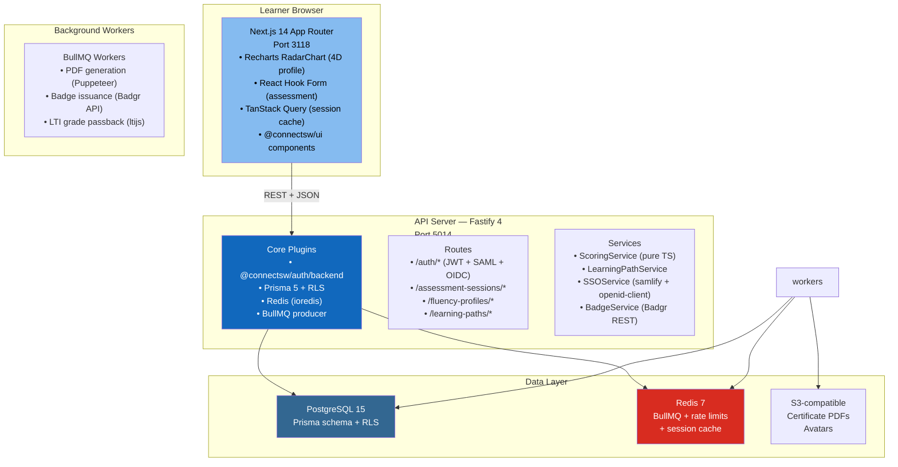

# ADR-003: Technology Stack Selection

## Status
Accepted

## Context

The AI Fluency Platform is a new ConnectSW product requiring full-stack architecture decisions. We must select:

1. Backend framework and ORM
2. Frontend framework
3. Chart library for the 4D radar visualizations
4. LTI 1.3 library for LMS grade passback
5. Job queue for async work (badge issuance, PDF generation, LTI grade passback)
6. Open Badges library for digital credentials

Research was conducted before finalizing this ADR. Key open source candidates were evaluated.

### Research Summary

**LTI 1.3 Libraries searched:**
- `ims-lti` (npm) — v3.0.2, LTI 1.1/2.0 only, outdated XML dependencies, last commit 2021
- `ltijs` (npm) — v5.9.9, MIT license, LTI 1.3 compliant, active maintainer (Hafael Couto), grade passback, OIDC login, JWKS support. 400+ GitHub stars. **Selected.**

**Chart libraries searched:**
- D3.js — Powerful but steep learning curve, no React-native API, must manage SVG manually
- Chart.js — Canvas-based, React wrapper available but SSR issues
- Recharts — React-native, declarative, SSR-compatible, accessible ARIA, MIT license, 22K+ stars. Radar chart (`RadarChart`) + LineChart for progress. **Selected.**
- Victory Charts — React-native but smaller community
- Nivo — Beautiful but heavier bundle

**Badge libraries searched:**
- `@openbadges/validator` — Validation only, no issuance
- Badgr REST API — Managed Open Badges v3 registry, widely used in education. HTTP REST integration.
- Credly API — Enterprise-grade, proprietary. **Badgr selected for MVP (Open Badges v3 compliant, free tier available).**

**Queue libraries searched:**
- Bull (original) — Widely used but based on deprecated ioredis API
- BullMQ — Modern rewrite, TypeScript-native, same Redis backend, MIT. **Selected.**
- pg-boss — PostgreSQL-based queue. Avoids Redis dependency but adds DB write pressure at scale.

## Decision

The AI Fluency Platform uses the **ConnectSW default stack** with the following product-specific additions:

### Backend Stack

| Component | Choice | Version | License | Rationale |
|-----------|--------|---------|---------|-----------|
| Runtime | Node.js | 20 LTS | N/A | ConnectSW standard |
| Language | TypeScript | 5+ | Apache 2.0 | ConnectSW standard |
| Framework | Fastify | 4.x | MIT | ConnectSW standard — 2x Express performance |
| ORM | Prisma | 5.x | Apache 2.0 | ConnectSW standard — type-safe, RLS compatible |
| Database | PostgreSQL | 15 | PostgreSQL | ConnectSW standard — ACID, JSONB, RLS |
| Cache/Queue | Redis | 7 | BSD | ConnectSW standard |
| Auth | @connectsw/auth/backend | latest | internal | Reuse — JWT + session + API keys |
| LTI 1.3 | ltijs | 5.9.9 | MIT | LTI 1.3/1.1, grade passback, OIDC, JWKS |
| Job Queue | BullMQ | latest | MIT | TypeScript-native, Redis-backed, reliable |
| Validation | Zod | 3.x | MIT | ConnectSW standard |
| Logging | @connectsw/shared/utils/logger | latest | internal | Reuse — structured PII redaction |
| Password | argon2 | latest | MIT | Argon2id — OWASP recommended |
| SSO/SAML | samlify | latest | MIT | SAML 2.0 SP implementation |
| SSO/OIDC | openid-client | latest | MIT | OIDC/OAuth2 client |

### Frontend Stack

| Component | Choice | Version | License | Rationale |
|-----------|--------|---------|---------|-----------|
| Framework | Next.js | 14 (App Router) | MIT | SSR needed for SEO, public cert verification page |
| UI Library | React | 18 | MIT | ConnectSW standard |
| Styling | Tailwind CSS | 3.x | MIT | ConnectSW standard |
| Components | @connectsw/ui | latest | internal | Reuse — Button, Card, DataTable, DashboardLayout |
| Component extras | shadcn/ui | latest | MIT | Radix-based accessible primitives |
| Charts | Recharts | 2.x | MIT | React-native radar + line charts, SSR-compatible |
| State (server) | TanStack Query | 5.x | MIT | Assessment session caching, optimistic updates |
| State (client) | React useState + Context | 18 | MIT | Simple enough — no global state manager needed |
| Auth | @connectsw/auth/frontend | latest | internal | Reuse — useAuth, ProtectedRoute, TokenManager |
| Forms | React Hook Form + Zod | latest | MIT | Type-safe form validation for assessment |
| Accessibility | jsx-a11y + @connectsw/eslint-config/frontend | latest | MIT | WCAG 2.1 AA (NFR-003) |

### Architecture Diagram (Tech Stack View)

## Consequences

### Positive

- **Reuses 7 ConnectSW packages**: auth (backend + frontend), shared logger, shared plugins (prisma + redis), ui components
- **Recharts SSR**: RadarChart renders server-side — critical for fast initial load of fluency profile page
- **ltijs maturity**: Handles LTI 1.3 OIDC Connect flow, JWKS rotation, grade passback — saves 2+ weeks vs. hand-rolling
- **BullMQ reliability**: Redis-backed durable job queue with retry/backoff — PDF and badge jobs will not be lost on restart

### Negative

- **ltijs opinionated**: ltijs manages its own Express/Fastify integration — must adapt to its plugin model
- **Recharts bundle**: ~200KB gzipped. Acceptable for dashboard feature but must lazy-load on assessment pages (where charts are not shown)
- **Badgr dependency**: Open Badges issuance depends on Badgr availability. Must queue badge jobs with retry.

### Neutral

- Argon2id replaces bcrypt (used in earlier ConnectSW products) — OWASP-preferred for new products
- samlify + openid-client are separate packages (not combined) — standard pattern for B2B SSO

## Alternatives Considered

### ims-lti vs ltijs for LTI 1.3

| | ims-lti | ltijs |
|-|---------|-------|
| LTI version | 1.1/2.0 only | 1.3 + 1.1 |
| Last updated | 2021 | 2024 |
| Stars | 300 | 400+ |
| TypeScript | No | Yes |
| Grade passback | No | Yes |
| OIDC/JWKS | No | Yes |

**ims-lti rejected**: Does not support LTI 1.3 (required by Canvas, Moodle modern versions). Last updated 2021.

### Chart.js vs Recharts

- Chart.js is Canvas-based — no SSR, accessibility requires custom ARIA
- Recharts is SVG-based — SSR works, native ARIA labels, React declarative API
- Recharts `RadarChart` is purpose-built for multi-axis profiles — perfect for 4D visualization

**Chart.js rejected**: SSR incompatibility blocks Next.js server-side rendering of profile pages.

### Bull vs BullMQ

- Bull: Older library, not actively maintained
- BullMQ: Maintained rewrite, TypeScript-native, same Redis API, better flow/dependency support

**Bull rejected**: Deprecated in favor of BullMQ by same maintainer.

## References

- [ltijs GitHub](https://github.com/Cvmcosta/ltijs) — MIT, LTI 1.3 Certified
- [Recharts](https://recharts.org) — React charting library
- [BullMQ](https://docs.bullmq.io) — TypeScript-native Redis queue
- [Badgr Open Badges API](https://badgr.com/api-docs) — Open Badges v3 issuance
- [samlify](https://github.com/tngan/samlify) — SAML 2.0 SP/IdP library
- `.claude/COMPONENT-REGISTRY.md` — ConnectSW reusable packages
