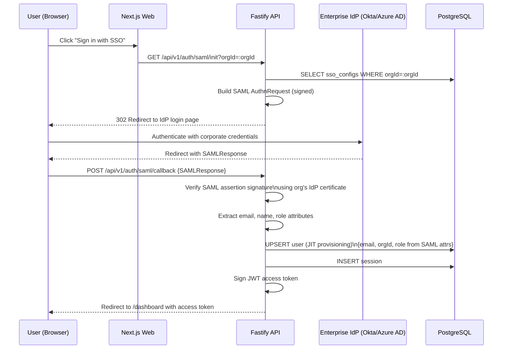
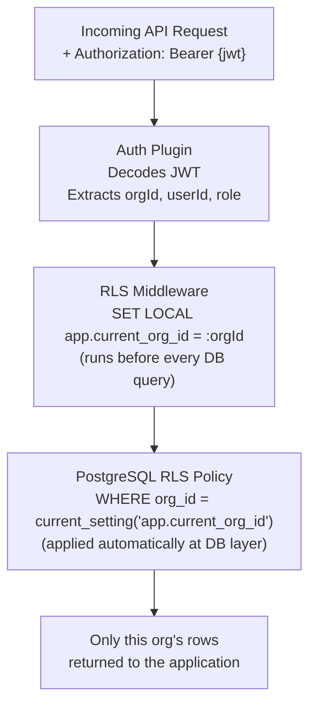

# AI Fluency Platform — API Reference

> **Base URL (local)**: `http://localhost:5014`
> **Base URL (production)**: `https://api.ai-fluency.connectsw.com`
> **API version prefix**: `/api/v1`
> **OpenAPI spec**: `docs/api-schema.yml`

---

## Table of Contents

1. [Overview](#1-overview)
2. [Authentication Flow](#2-authentication-flow)
3. [Authentication Endpoints](#3-authentication-endpoints)
4. [Health and Observability](#4-health-and-observability)
5. [Error Format (RFC 7807)](#5-error-format-rfc-7807)
6. [Rate Limiting](#6-rate-limiting)
7. [Pagination](#7-pagination)
8. [Multi-Tenancy](#8-multi-tenancy)

---

## 1. Overview

### How Requests Are Authenticated

All protected endpoints require a Bearer JWT access token in the `Authorization` header:

```
Authorization: Bearer <access_token>
```

Access tokens expire after **15 minutes**. When an access token expires, the frontend silently exchanges the httpOnly refresh cookie for a new access token via `POST /api/v1/auth/refresh`. The user is never interrupted unless the refresh token has also expired (7 days).

**Token storage rules:**
- Access token: stored in-memory only (never `localStorage` — XSS risk)
- Refresh token: stored as httpOnly, Secure, SameSite=Strict cookie (managed by the browser)

### Roles and Authorization

Every JWT payload contains a `role` claim. The platform enforces four roles:

| Role | Can Do |
|------|--------|
| `LEARNER` | Take assessments, view own profile, follow learning paths |
| `MANAGER` | All LEARNER actions + manage team, view team dashboard |
| `ADMIN` | All MANAGER actions + manage org, configure SSO, view org dashboard |
| `SUPER_ADMIN` | Platform-level admin — manage all orgs, access `/admin/*` routes |

### Content Type

All request and response bodies are `application/json` unless specified otherwise.

### CORS

The API only accepts requests from the registered web app origin. In local development this is `http://localhost:3118`.

---

## 2. Authentication Flow

### Standard Email/Password Flow

```mermaid
sequenceDiagram
    participant U as User (Browser)
    participant W as Next.js Web (3118)
    participant A as Fastify API (5014)
    participant PG as PostgreSQL
    participant R as Redis

    Note over U,R: Registration

    U->>W: Submit registration form
    W->>A: POST /api/v1/auth/register\n{email, password, name, orgId}
    A->>A: Validate input (Zod)
    A->>A: Hash password with Argon2id
    A->>PG: INSERT users {status: PENDING_VERIFICATION}
    A->>PG: INSERT email_verification_tokens
    A-->>W: 201 {user, accessToken}
    W-->>U: "Check your email"

    Note over U,R: Email Verification

    U->>W: Click link in email
    W->>A: POST /api/v1/auth/verify-email {token}
    A->>PG: Verify token, UPDATE users SET status=ACTIVE
    A-->>W: 200 OK
    W-->>U: Redirect to dashboard

    Note over U,R: Login

    U->>W: Submit login form {email, password}
    W->>A: POST /api/v1/auth/login
    A->>PG: SELECT user WHERE email=:email
    A->>A: crypto.timingSafeEqual verify Argon2id hash
    A->>PG: INSERT user_sessions\n{refreshTokenHash: SHA256(token), expiresAt: +7days}
    A->>A: Sign JWT access token\n{sub: userId, orgId, role, exp: +15min}
    A-->>W: 200 {accessToken, user}\nSet-Cookie: refresh_token (httpOnly, Secure, SameSite=Strict)
    W-->>U: Redirect to /dashboard

    Note over U,R: Silent Token Refresh (every 14 minutes)

    W->>A: POST /api/v1/auth/refresh\n(Cookie: refresh_token sent automatically)
    A->>A: Verify refresh token signature
    A->>A: SHA256(presented token)
    A->>PG: SELECT session WHERE tokenHash=:hash AND expiresAt > NOW()
    A->>PG: DELETE old session (rotation — prevents replay attacks)
    A->>PG: INSERT new session {newTokenHash, expiresAt: +7days}
    A-->>W: 200 {accessToken}\nSet-Cookie: new refresh_token
    W->>W: Store new access token in memory

    Note over U,R: Using the API

    W->>A: GET /api/v1/fluency-profiles/me\nAuthorization: Bearer {accessToken}
    A->>A: Verify JWT signature and expiry
    A->>A: Extract orgId from JWT, set RLS context
    A-->>W: 200 {profile}

    Note over U,R: Logout

    U->>W: Click "Sign out"
    W->>A: POST /api/v1/auth/logout\n(Cookie: refresh_token)
    A->>PG: DELETE session WHERE tokenHash=:hash
    A-->>W: 204 No Content\nSet-Cookie: refresh_token=; Max-Age=0
    W->>W: Clear in-memory access token
    W-->>U: Redirect to /login
```

### Enterprise SAML SSO Flow



---

## 3. Authentication Endpoints

### POST /api/v1/auth/register

Creates a new user account. The organization (`orgId`) must exist and be in `ACTIVE` status. Sends an email verification link. The account is in `PENDING_VERIFICATION` status until the email is verified.

**Authentication required**: No

**Rate limit**: 3 requests per IP per minute

**Request body**

```typescript
interface RegisterRequest {
  email: string;          // Must be a valid email address
  password: string;       // Minimum 10 characters
  name: string;           // Display name
  orgId: string;          // UUID — organization to join
}
```

**Example request**

```bash
curl -X POST http://localhost:5014/api/v1/auth/register \
  -H "Content-Type: application/json" \
  -d '{
    "email": "alex@example.com",
    "password": "SecurePass123!",
    "name": "Alex Chen",
    "orgId": "b4f8e2a1-3c7d-4e9f-8a2b-1d6e5f4c3b2a"
  }'
```

**Success response** `201 Created`

```json
{
  "user": {
    "id": "usr_01HXYZ...",
    "email": "alex@example.com",
    "name": "Alex Chen",
    "role": "LEARNER",
    "status": "PENDING_VERIFICATION",
    "orgId": "b4f8e2a1-3c7d-4e9f-8a2b-1d6e5f4c3b2a",
    "createdAt": "2026-03-03T10:00:00Z"
  },
  "accessToken": "eyJhbGciOiJIUzI1NiIsInR5cCI6IkpXVCJ9..."
}
```

**Error responses**

| Status | Error Code | Cause |
|--------|-----------|-------|
| 400 | `VALIDATION_ERROR` | Missing or invalid fields |
| 409 | `EMAIL_ALREADY_EXISTS` | Account with this email already exists |
| 404 | `ORGANIZATION_NOT_FOUND` | orgId does not exist or org is not ACTIVE |
| 429 | `RATE_LIMIT_EXCEEDED` | Too many registration attempts |

**Error example** `409 Conflict`

```json
{
  "type": "https://api.ai-fluency.connectsw.com/errors/EMAIL_ALREADY_EXISTS",
  "title": "EMAIL_ALREADY_EXISTS",
  "status": 409,
  "detail": "An account with this email address already exists.",
  "instance": "req-01HXYZ-abc123"
}
```

---

### POST /api/v1/auth/login

Authenticates a user with email and password. Returns a JWT access token in the response body and sets the refresh token as an httpOnly cookie.

**Authentication required**: No

**Rate limit**: 5 requests per IP per minute; account lockout after 10 consecutive failures (15-minute lockout)

**Request body**

```typescript
interface LoginRequest {
  email: string;
  password: string;
}
```

**Example request**

```bash
curl -X POST http://localhost:5014/api/v1/auth/login \
  -H "Content-Type: application/json" \
  -c cookies.txt \
  -d '{
    "email": "alex@example.com",
    "password": "SecurePass123!"
  }'
```

**Success response** `200 OK`

Response header:
```
Set-Cookie: refresh_token=<opaque_token>; HttpOnly; Secure; SameSite=Strict; Path=/api/v1/auth; Max-Age=604800
```

Response body:
```json
{
  "accessToken": "eyJhbGciOiJIUzI1NiIsInR5cCI6IkpXVCJ9...",
  "user": {
    "id": "usr_01HXYZ...",
    "email": "alex@example.com",
    "name": "Alex Chen",
    "role": "LEARNER",
    "status": "ACTIVE",
    "orgId": "b4f8e2a1-3c7d-4e9f-8a2b-1d6e5f4c3b2a"
  }
}
```

**JWT payload** (decoded, not to be trusted by clients — always verify server-side)

```json
{
  "sub": "usr_01HXYZ...",
  "orgId": "b4f8e2a1-3c7d-4e9f-8a2b-1d6e5f4c3b2a",
  "role": "LEARNER",
  "iat": 1741000000,
  "exp": 1741000900
}
```

**Error responses**

| Status | Error Code | Cause |
|--------|-----------|-------|
| 400 | `VALIDATION_ERROR` | Missing email or password |
| 401 | `INVALID_CREDENTIALS` | Email not found or password incorrect |
| 401 | `EMAIL_NOT_VERIFIED` | Account exists but email not yet verified |
| 423 | `ACCOUNT_LOCKED` | Too many failed attempts — retry after `retryAfter` seconds |
| 429 | `RATE_LIMIT_EXCEEDED` | IP rate limit exceeded |

**Account locked error** `423 Locked`

```json
{
  "type": "https://api.ai-fluency.connectsw.com/errors/ACCOUNT_LOCKED",
  "title": "ACCOUNT_LOCKED",
  "status": 423,
  "detail": "Account temporarily locked due to too many failed login attempts.",
  "instance": "req-01HXYZ-def456",
  "retryAfter": 900
}
```

---

### POST /api/v1/auth/refresh

Exchanges the refresh token cookie for a new access token and a new refresh token (token rotation). The old refresh token is immediately invalidated after this call — this prevents replay attacks.

**Authentication required**: No (uses httpOnly cookie automatically sent by browser)

**Cookie required**: `refresh_token` (set during login)

**Request body**: None

**Example request**

```bash
curl -X POST http://localhost:5014/api/v1/auth/refresh \
  -b cookies.txt \
  -c cookies.txt
```

**Success response** `200 OK`

Response header:
```
Set-Cookie: refresh_token=<new_opaque_token>; HttpOnly; Secure; SameSite=Strict; Path=/api/v1/auth; Max-Age=604800
```

Response body:
```json
{
  "accessToken": "eyJhbGciOiJIUzI1NiIsInR5cCI6IkpXVCJ9..."
}
```

**Error responses**

| Status | Error Code | Cause |
|--------|-----------|-------|
| 401 | `INVALID_REFRESH_TOKEN` | Cookie missing, expired, or already rotated |
| 401 | `SESSION_NOT_FOUND` | Token hash not in sessions table (replayed or revoked) |

**Implementation note for frontend developers**: Call this endpoint before the access token expires (e.g., at 14-minute intervals). The `useAuth` hook in `apps/web/src/hooks/useAuth.ts` handles this automatically via a timer.

---

### POST /api/v1/auth/logout

Invalidates the current session. Deletes the session record from the database and clears the refresh token cookie.

**Authentication required**: Yes (Bearer access token)

**Request body**: None

**Example request**

```bash
curl -X POST http://localhost:5014/api/v1/auth/logout \
  -H "Authorization: Bearer <access_token>" \
  -b cookies.txt \
  -c cookies.txt
```

**Success response** `204 No Content`

Response header:
```
Set-Cookie: refresh_token=; Max-Age=0; Path=/api/v1/auth
```

No response body.

**Error responses**

| Status | Error Code | Cause |
|--------|-----------|-------|
| 401 | `UNAUTHORIZED` | Missing or expired access token |

---

### GET /api/v1/auth/me

Returns the currently authenticated user's profile.

**Authentication required**: Yes (Bearer access token)

**Request body**: None

**Example request**

```bash
curl http://localhost:5014/api/v1/auth/me \
  -H "Authorization: Bearer <access_token>"
```

**Success response** `200 OK`

```json
{
  "id": "usr_01HXYZ...",
  "email": "alex@example.com",
  "name": "Alex Chen",
  "role": "LEARNER",
  "status": "ACTIVE",
  "orgId": "b4f8e2a1-3c7d-4e9f-8a2b-1d6e5f4c3b2a",
  "org": {
    "id": "b4f8e2a1-3c7d-4e9f-8a2b-1d6e5f4c3b2a",
    "name": "Acme Corp",
    "plan": "ENTERPRISE"
  },
  "createdAt": "2026-03-03T10:00:00Z",
  "lastLoginAt": "2026-03-03T14:30:00Z"
}
```

**Response type**

```typescript
interface MeResponse {
  id: string;
  email: string;
  name: string;
  role: 'LEARNER' | 'MANAGER' | 'ADMIN' | 'SUPER_ADMIN';
  status: 'PENDING_VERIFICATION' | 'ACTIVE' | 'SUSPENDED';
  orgId: string;
  org: {
    id: string;
    name: string;
    plan: 'STARTER' | 'PROFESSIONAL' | 'ENTERPRISE';
  };
  createdAt: string;    // ISO 8601
  lastLoginAt: string;  // ISO 8601
}
```

**Error responses**

| Status | Error Code | Cause |
|--------|-----------|-------|
| 401 | `UNAUTHORIZED` | Missing, expired, or invalid access token |

---

## 4. Health and Observability

### GET /health

Returns the operational status of all platform dependencies. Used by load balancers and uptime monitoring. This endpoint does not require authentication.

**Authentication required**: No

**Example request**

```bash
curl http://localhost:5014/health
```

**Healthy response** `200 OK`

```json
{
  "status": "healthy",
  "version": "1.0.0",
  "timestamp": "2026-03-03T14:30:00Z",
  "dependencies": {
    "postgres": {
      "status": "up",
      "latencyMs": 3
    },
    "redis": {
      "status": "up",
      "latencyMs": 1
    }
  }
}
```

**Degraded response** `503 Service Unavailable`

When any dependency is down, the endpoint returns 503 with details about which dependency is failing. The load balancer uses this to route traffic away from unhealthy instances.

```json
{
  "status": "degraded",
  "version": "1.0.0",
  "timestamp": "2026-03-03T14:30:00Z",
  "dependencies": {
    "postgres": {
      "status": "up",
      "latencyMs": 4
    },
    "redis": {
      "status": "down",
      "error": "connect ECONNREFUSED 127.0.0.1:6379"
    }
  }
}
```

**Response type**

```typescript
interface HealthResponse {
  status: 'healthy' | 'degraded';
  version: string;
  timestamp: string;
  dependencies: {
    postgres: { status: 'up' | 'down'; latencyMs?: number; error?: string };
    redis: { status: 'up' | 'down'; latencyMs?: number; error?: string };
  };
}
```

---

### GET /metrics

Exposes Prometheus-format metrics for the API server. Used by Grafana/Prometheus infrastructure monitoring. Requires the `INTERNAL_API_KEY` header.

**Authentication required**: `X-Internal-Api-Key: <INTERNAL_API_KEY>` (env var)

**Example request**

```bash
curl http://localhost:5014/metrics \
  -H "X-Internal-Api-Key: <INTERNAL_API_KEY>"
```

**Response format**: Prometheus text format (Content-Type: `text/plain; version=0.0.4`)

```
# HELP http_requests_total Total number of HTTP requests
# TYPE http_requests_total counter
http_requests_total{method="POST",route="/api/v1/auth/login",status="200"} 4521

# HELP http_request_duration_seconds HTTP request duration in seconds
# TYPE http_request_duration_seconds histogram
http_request_duration_seconds_bucket{le="0.1"} 4210
http_request_duration_seconds_bucket{le="0.5"} 4498
http_request_duration_seconds_bucket{le="1"} 4521

# HELP assessment_sessions_active Currently active (in-progress) assessment sessions
# TYPE assessment_sessions_active gauge
assessment_sessions_active 127
```

---

## 5. Error Format (RFC 7807)

All error responses from the AI Fluency API follow [RFC 7807 — Problem Details for HTTP APIs](https://www.rfc-editor.org/rfc/rfc7807). This means every error has the same predictable structure regardless of where it originates.

### Error object structure

```typescript
interface ProblemDetails {
  type: string;      // URI that identifies the error type
                     // Format: https://api.ai-fluency.connectsw.com/errors/<ERROR_CODE>

  title: string;     // Short, human-readable error code
                     // Same as the last segment of `type`
                     // Machine-readable — use this in switch statements

  status: number;    // HTTP status code (mirrors the response status)

  detail: string;    // Human-readable explanation of this specific occurrence
                     // Suitable for display to developers; NOT always user-facing

  instance: string;  // Request correlation ID for tracing
                     // Include this in bug reports — matches server logs
}
```

### Example errors by category

**Validation error** `400 Bad Request`
```json
{
  "type": "https://api.ai-fluency.connectsw.com/errors/VALIDATION_ERROR",
  "title": "VALIDATION_ERROR",
  "status": 400,
  "detail": "password: String must contain at least 10 character(s)",
  "instance": "req-01HXYZ-abc123"
}
```

**Unauthorized** `401 Unauthorized`
```json
{
  "type": "https://api.ai-fluency.connectsw.com/errors/UNAUTHORIZED",
  "title": "UNAUTHORIZED",
  "status": 401,
  "detail": "Access token is expired or invalid.",
  "instance": "req-01HXYZ-abc124"
}
```

**Forbidden** `403 Forbidden`
```json
{
  "type": "https://api.ai-fluency.connectsw.com/errors/FORBIDDEN",
  "title": "FORBIDDEN",
  "status": 403,
  "detail": "You do not have permission to access this resource. Required role: ADMIN.",
  "instance": "req-01HXYZ-abc125"
}
```

**Not found** `404 Not Found`
```json
{
  "type": "https://api.ai-fluency.connectsw.com/errors/NOT_FOUND",
  "title": "NOT_FOUND",
  "status": 404,
  "detail": "Assessment session req-01HXYZ-abc126 not found.",
  "instance": "req-01HXYZ-abc127"
}
```

**Conflict** `409 Conflict`
```json
{
  "type": "https://api.ai-fluency.connectsw.com/errors/EMAIL_ALREADY_EXISTS",
  "title": "EMAIL_ALREADY_EXISTS",
  "status": 409,
  "detail": "An account with email alex@example.com already exists.",
  "instance": "req-01HXYZ-abc128"
}
```

**Gone** `410 Gone`
```json
{
  "type": "https://api.ai-fluency.connectsw.com/errors/TOKEN_EXPIRED",
  "title": "TOKEN_EXPIRED",
  "status": 410,
  "detail": "Email verification token has expired. Request a new one.",
  "instance": "req-01HXYZ-abc129"
}
```

**Rate limit** `429 Too Many Requests`
```json
{
  "type": "https://api.ai-fluency.connectsw.com/errors/RATE_LIMIT_EXCEEDED",
  "title": "RATE_LIMIT_EXCEEDED",
  "status": 429,
  "detail": "Too many requests. Retry after 60 seconds.",
  "instance": "req-01HXYZ-abc130",
  "retryAfter": 60
}
```

**Internal server error** `500 Internal Server Error`
```json
{
  "type": "https://api.ai-fluency.connectsw.com/errors/INTERNAL_ERROR",
  "title": "INTERNAL_ERROR",
  "status": 500,
  "detail": "An unexpected error occurred. The engineering team has been alerted.",
  "instance": "req-01HXYZ-abc131"
}
```

### How to handle errors in client code

Use `title` (the error code) for programmatic handling — it is stable across versions. Use `detail` for logging and debugging. Use `instance` when reporting bugs or searching server logs.

```typescript
// Example: handling errors from the API client
try {
  const user = await api.post('/auth/login', { email, password });
} catch (err) {
  if (err.status === 401) {
    switch (err.data.title) {
      case 'INVALID_CREDENTIALS':
        setError('Invalid email or password.');
        break;
      case 'EMAIL_NOT_VERIFIED':
        setError('Please verify your email before logging in.');
        break;
      case 'ACCOUNT_LOCKED':
        setError(`Account locked. Try again in ${err.data.retryAfter} seconds.`);
        break;
    }
  }
}
```

---

## 6. Rate Limiting

Rate limits protect the API from abuse and ensure fair resource allocation. Limits are per IP address and tracked in Redis.

| Endpoint | Limit | Window | Lockout |
|----------|-------|--------|---------|
| `POST /api/v1/auth/register` | 3 requests | 1 minute | — |
| `POST /api/v1/auth/login` | 5 requests | 1 minute | Account locked for 15 min after 10 failures |
| `POST /api/v1/auth/refresh` | 10 requests | 1 minute | — |
| `POST /api/v1/auth/forgot-password` | 3 requests | 15 minutes | — |
| All other endpoints | 60 requests | 1 minute | — |

When a rate limit is exceeded, the API returns `429 Too Many Requests` with a `Retry-After` header indicating how many seconds to wait.

**Response headers on every request** (for rate limit awareness):

```
X-RateLimit-Limit: 60
X-RateLimit-Remaining: 47
X-RateLimit-Reset: 1741001000
```

---

## 7. Pagination

All list endpoints use cursor-based offset pagination with a consistent response envelope.

### Request parameters

| Parameter | Type | Default | Maximum | Description |
|-----------|------|---------|---------|-------------|
| `page` | integer | 1 | — | Page number (1-indexed) |
| `limit` | integer | 20 | 100 | Results per page |

**Example request**

```bash
curl "http://localhost:5014/api/v1/teams?page=2&limit=20" \
  -H "Authorization: Bearer <access_token>"
```

### Response envelope

All paginated endpoints wrap results in a standard envelope:

```typescript
interface PaginatedResponse<T> {
  data: T[];
  total: number;       // Total number of matching records
  page: number;        // Current page (1-indexed)
  limit: number;       // Page size used
  totalPages: number;  // Math.ceil(total / limit)
}
```

**Example response**

```json
{
  "data": [
    { "id": "team_01", "name": "Engineering" },
    { "id": "team_02", "name": "Product" }
  ],
  "total": 47,
  "page": 2,
  "limit": 20,
  "totalPages": 3
}
```

---

## 8. Multi-Tenancy

### How isolation works from the API consumer's perspective

Every authenticated user's JWT contains an `orgId` claim. The API extracts this claim and uses it to scope all database queries to that organization's data only.

**Key rules for API consumers:**

1. You never need to pass `orgId` as a query parameter or request body field on protected endpoints — it is always derived from the JWT automatically.

2. You cannot access another organization's data, even if you know their resource IDs. Attempting to do so returns `404 Not Found` (not `403 Forbidden`) — this prevents org ID enumeration.

3. Global/shared data (assessment question library, learning module content) is accessible to all authenticated users regardless of org.

**Data isolation flow:**



**Tables scoped to your organization** (you can only see your org's data):

`users`, `user_sessions`, `sso_configs`, `teams`, `assessment_templates`, `assessment_sessions`, `responses`, `fluency_profiles`, `learning_paths`, `learning_path_modules`, `module_completions`, `certificates`, `audit_logs`

**Global tables** (shared across all orgs, read-only for most roles):

`organizations`, `questions`, `behavioral_indicators`, `learning_modules`, `algorithm_versions`

### Cross-tenant access attempt example

```bash
# Attempting to access another org's assessment session
curl http://localhost:5014/api/v1/assessment-sessions/session-from-other-org \
  -H "Authorization: Bearer <your_access_token>"
```

```json
{
  "type": "https://api.ai-fluency.connectsw.com/errors/NOT_FOUND",
  "title": "NOT_FOUND",
  "status": 404,
  "detail": "Assessment session not found.",
  "instance": "req-01HXYZ-abc132"
}
```

The 404 response (rather than 403) is intentional — it prevents discovery of resource IDs belonging to other organizations.
