# AI Fluency Platform — Professional Code Audit Report

**Date**: 2026-03-07
**Auditor**: Claude Code Reviewer (Opus 4.6)
**Product**: AI Fluency — Enterprise AI Readiness Assessment Platform
**Version**: Main branch @ commit 2785194f

---

# PART A — EXECUTIVE MEMO

---

## Section 0: Methodology and Limitations

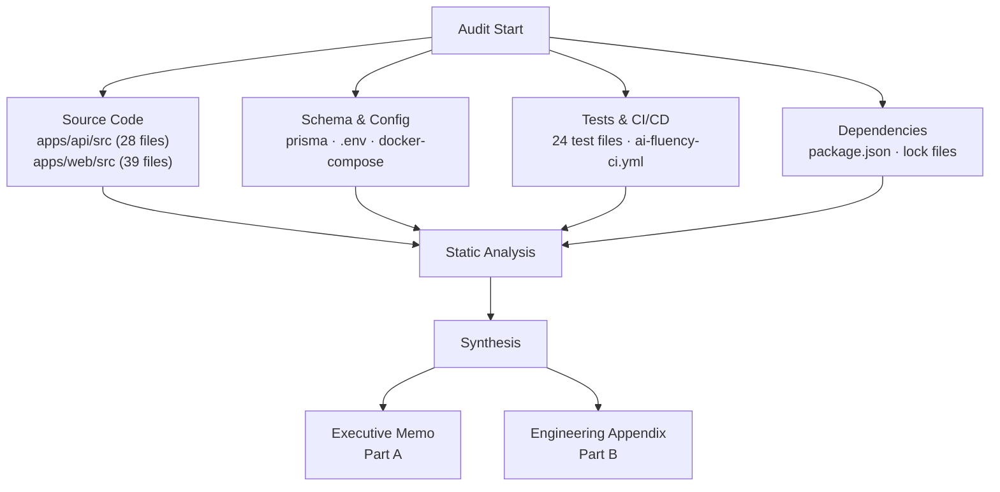

**Audit Scope:**
- Directories scanned: `apps/api/src/`, `apps/api/prisma/`, `apps/api/tests/`, `apps/web/src/`, `e2e/`, `.github/workflows/`
- File types: `.ts`, `.tsx`, `.prisma`, `.yml`, `.json`, `.mjs`, `.env*`
- Total files reviewed: 98 source files (28 API src + 39 web src + 24 test + 7 E2E)
- Total lines of code analyzed: 17,887

**Methodology:**
- Static analysis: manual code review of all source files across 4 parallel review agents
- Schema analysis: Prisma schema review (22 relations, indexes, constraints, cascade rules)
- Dependency audit: `npm audit` on API package (6 vulnerabilities found: 2 moderate, 4 high)
- Configuration review: `.env.example`, `docker-compose.yml`, CI pipeline, Fastify plugin chain
- Test analysis: 266 test cases across 53 describe blocks in 24 test files + 62 E2E assertions
- Architecture review: plugin registration order, route layering, service separation

**Out of Scope:**
- Dynamic penetration testing (no live exploit attempts)
- Runtime performance profiling (no load tests)
- Third-party SaaS integrations (only code-level integration points)
- Infrastructure-level security (cloud IAM, network, firewall)
- Generated code (Prisma client)
- Third-party library internals (but vulnerable versions noted)

**Limitations:**
- Static code review only; race conditions under load may not manifest
- Compliance assessments are gap analyses, not formal certifications
- Scores reflect code at audit time and may change with commits

---

## Section 1: Executive Decision Summary

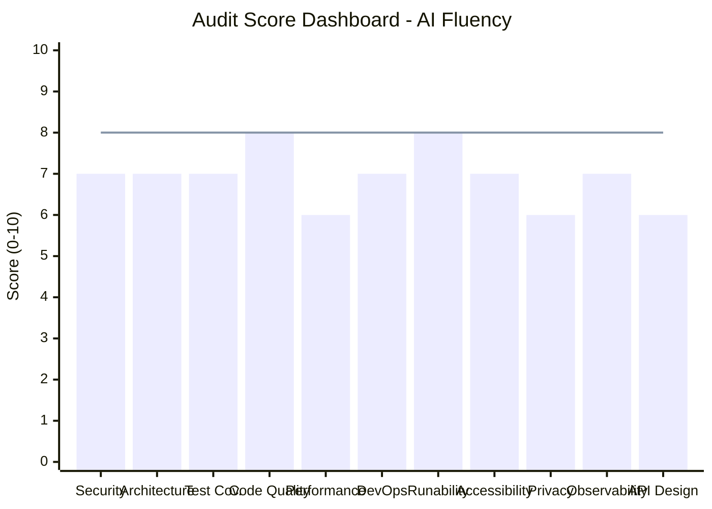

| Question | Answer |
|----------|--------|
| **Can this go to production?** | Conditionally — after Phase 0 and Phase 1 fixes |
| **Is it salvageable?** | Yes — architecture is sound, most gaps are incremental fixes |
| **Risk if ignored** | High — 4 high-severity npm vulnerabilities, no OpenAPI docs, missing GDPR deletion endpoints |
| **Recovery effort** | 2-3 weeks with 2 engineers |
| **Enterprise-ready?** | No — missing OpenAPI docs, no data export API, no formal RBAC on all routes |
| **Compliance-ready?** | OWASP Top 10: Partial (7/10 pass). SOC2: Not ready |

**Top 5 Risks in Plain Language:**

1. **Known software vulnerabilities in core framework** — The web framework (Fastify) and authentication library have published security advisories that attackers could use to bypass protections or crash the system.
2. **No way for users to delete their data** — Privacy regulations require users to be able to request deletion of their data, but no deletion API endpoint exists yet.
3. **Missing API documentation** — No OpenAPI/Swagger specification means external developers and security reviewers cannot verify the API contract, and enterprise customers will reject integration.
4. **Some admin pages lack server-side authorization checks** — While authentication is solid, certain org-level pages do not enforce role-based access on the backend, meaning a regular user could potentially access admin data.
5. **No Docker production images** — The platform has a docker-compose for development but no production Dockerfiles, making deployment to cloud environments manual and error-prone.

---

## Section 2: Stop / Fix / Continue

```mermaid
flowchart LR
    subgraph STOP["STOP - Immediate"]
        S1["Run npm audit fix\n(4 HIGH vulns)"]
        S2["Update Fastify to\npatched version"]
    end
    subgraph FIX["FIX - Before Production"]
        F1["Add data deletion\nAPI endpoints"]
        F2["Add OpenAPI/Swagger\ndocumentation"]
        F3["Add RBAC to org\nand admin routes"]
        F4["Create production\nDockerfiles"]
    end
    subgraph CONTINUE["CONTINUE - Working Well"]
        C1["Auth system\n(Argon2id + JWT + RBAC)"]
        C2["4D Assessment engine\n(scoring, profiles)"]
        C3["RFC 7807 errors\n+ structured logging"]
        C4["Accessibility\n(WCAG foundations)"]
    end
    STOP --> FIX --> CONTINUE
```

| Category | Items |
|----------|-------|
| **STOP** | Deploy with known Fastify/fast-jwt vulnerabilities; any production deployment without `npm audit fix` |
| **FIX** | Add GDPR data deletion endpoints, add OpenAPI docs, add RBAC enforcement on all org/admin routes, create production Dockerfiles, increase frontend test coverage |
| **CONTINUE** | Argon2id password hashing with secure config, JWT auth with DB user validation, RFC 7807 error format, structured PII-safe logging, rate limiting, CORS with origin validation, SkipNav + ARIA attributes, E2E test suite (20 tests passing), 4D assessment scoring engine |

---

## Section 3: System Overview

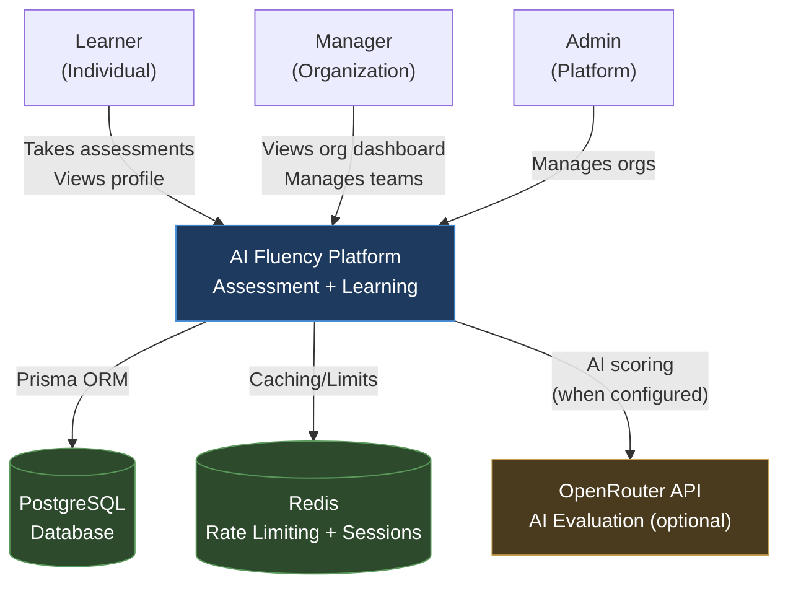

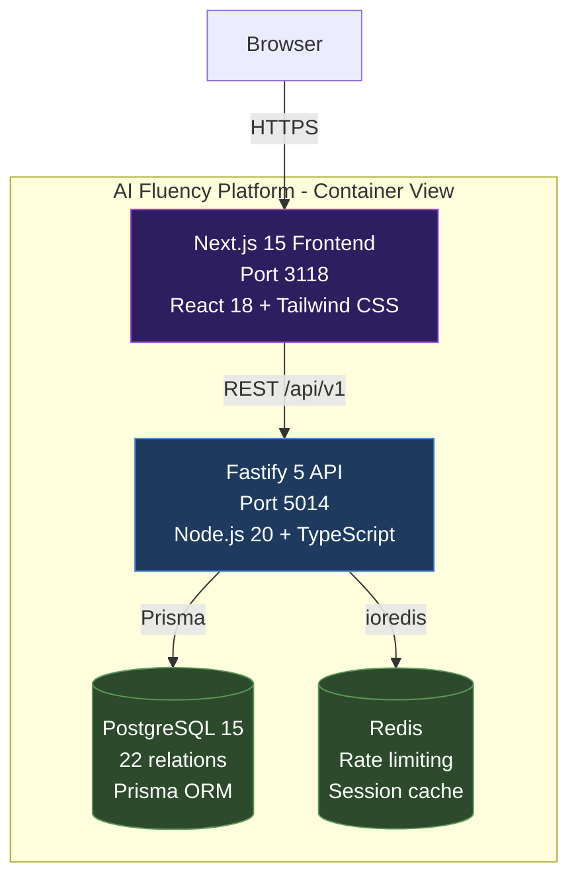

**Technology Stack:**

| Layer | Technology | Version |
|-------|-----------|---------|
| Frontend | Next.js + React + Tailwind CSS | 15.5.12 / 18.3.1 |
| Backend | Fastify + TypeScript | 5.x |
| Database | PostgreSQL + Prisma ORM | 15 |
| Cache | Redis (optional) | - |
| Auth | Argon2id + JWT (@fastify/jwt) | - |
| AI | OpenRouter (optional) | - |
| Charts | Recharts | 2.13.0 |
| Testing | Jest + Playwright | - |
| CI | GitHub Actions | - |

**Key Flows:**
- **Authentication**: Register (Argon2id hash) -> Login (JWT access + refresh tokens) -> DB user validation on every request
- **Assessment**: Start session -> Answer 50 questions -> Complete -> Prevalence-weighted scoring -> Profile generation
- **Learning Paths**: Generated from profile gaps -> Module progression -> Completion tracking

---

## Section 4: Critical Issues (Top 10)

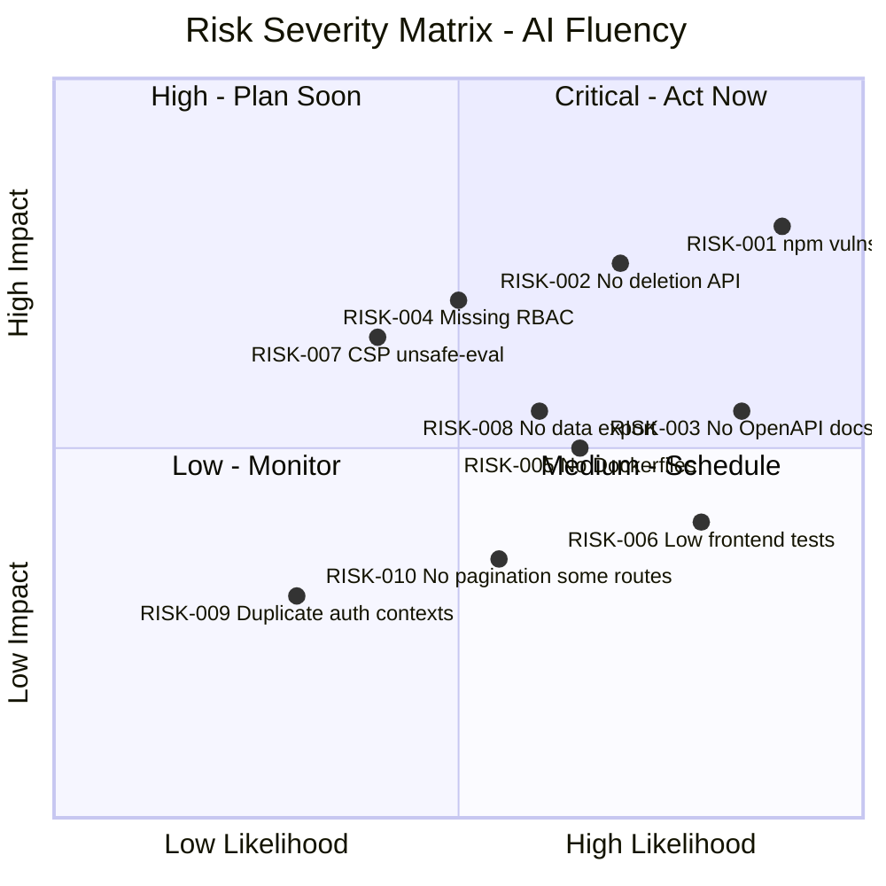

### RISK-001: Known High-Severity npm Vulnerabilities
- **Severity**: High | **Likelihood**: High | **Blast Radius**: Product
- **Risk Owner**: DevOps
- **Business Impact**: Attackers could exploit published Fastify DoS vulnerability or fast-jwt claim validation bypass to crash the service or forge authentication tokens.
- **Fix**: Run `npm audit fix` to patch Fastify and fast-jwt. For argon2/tar chain: upgrade argon2 to 0.44.0+.
- **Compliance**: OWASP A06 (Vulnerable Components), CWE-1104

### RISK-002: No GDPR Data Deletion Endpoints
- **Severity**: High | **Likelihood**: Medium | **Blast Radius**: Organization
- **Risk Owner**: Backend Dev
- **Business Impact**: Enterprise customers in EU/UK cannot adopt the platform without right-to-erasure compliance. Regulatory fines up to 4% of annual revenue.
- **Fix**: Add `DELETE /api/v1/profile` and `DELETE /api/v1/account` endpoints with cascade deletion.
- **Compliance**: GDPR Art. 17, ISO 27001 A.18

### RISK-003: No OpenAPI/Swagger Documentation
- **Severity**: Medium | **Likelihood**: High | **Blast Radius**: Product
- **Risk Owner**: Backend Dev
- **Business Impact**: Enterprise integrations blocked; security reviews cannot verify API contract; developer onboarding slowed significantly.
- **Fix**: Add `@fastify/swagger` + `@fastify/swagger-ui` with route schemas.
- **Compliance**: OWASP API9 (Improper Inventory Management)

### RISK-004: Missing RBAC on Some Org/Admin Routes
- **Severity**: High | **Likelihood**: Medium | **Blast Radius**: Feature
- **Risk Owner**: Backend Dev
- **Business Impact**: A regular LEARNER user could potentially access organization dashboard data or admin pages if they know the URL, leaking other users' assessment data.
- **Fix**: Add `fastify.requireRole('MANAGER')` to org routes, `requireRole('ADMIN')` to admin routes.
- **Compliance**: OWASP A01 (Broken Access Control), OWASP API5 (BFLA)

### RISK-005: No Production Dockerfiles
- **Severity**: Medium | **Likelihood**: Medium | **Blast Radius**: Product
- **Risk Owner**: DevOps
- **Business Impact**: Cannot deploy to cloud environments reliably; no reproducible builds; manual deployments are error-prone.
- **Fix**: Create multi-stage Dockerfiles for API and Web apps.
- **Compliance**: SOC2 Availability

### RISK-006: Low Frontend Test Coverage
- **Severity**: Medium | **Likelihood**: High | **Blast Radius**: Feature
- **Risk Owner**: Frontend Dev
- **Business Impact**: UI regressions go undetected; 18 pages but only 3 web test files means most UI logic is untested.
- **Fix**: Add React Testing Library tests for auth flows, assessment UI, profile display.
- **Compliance**: ISO 25010 Testability

### RISK-007: CSP Uses unsafe-inline and unsafe-eval
- **Severity**: Medium | **Likelihood**: Low | **Blast Radius**: Product
- **Risk Owner**: Frontend Dev
- **Business Impact**: XSS attacks have a larger attack surface with unsafe-inline/unsafe-eval in Content Security Policy, though this is a known Next.js requirement.
- **Fix**: Migrate to nonce-based CSP when Next.js supports it, or use strict-dynamic.
- **Compliance**: OWASP A05 (Security Misconfiguration)

### RISK-008: No Data Export/Portability Endpoint
- **Severity**: Medium | **Likelihood**: Medium | **Blast Radius**: Organization
- **Risk Owner**: Backend Dev
- **Business Impact**: GDPR right to data portability (Art. 20) not satisfied. Privacy settings page references export but no API endpoint exists.
- **Fix**: Add `GET /api/v1/profile/export` returning JSON with all user data.
- **Compliance**: GDPR Art. 20

### RISK-009: Duplicate AuthContext Files
- **Severity**: Low | **Likelihood**: Low | **Blast Radius**: Feature
- **Risk Owner**: Frontend Dev
- **Business Impact**: Two AuthContext files (`context/AuthContext.tsx` and `contexts/AuthContext.tsx`) create confusion and risk importing the wrong one.
- **Fix**: Remove the unused duplicate and consolidate.
- **Compliance**: ISO 25010 Maintainability

### RISK-010: Missing Pagination on Some List Endpoints
- **Severity**: Low | **Likelihood**: Medium | **Blast Radius**: Feature
- **Risk Owner**: Backend Dev
- **Business Impact**: Unbounded queries on profile history or learning paths could cause slow responses or memory issues with large datasets.
- **Fix**: Add pagination to `/profile/history` and `/learning-paths` endpoints.
- **Compliance**: OWASP API4 (Unrestricted Resource Consumption)

---

## Section 5: Risk Register

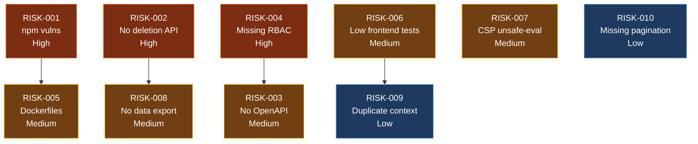

| Issue ID | Title | Domain | Severity | Owner | SLA | Dependency | Verification | Status |
|----------|-------|--------|----------|-------|-----|------------|--------------|--------|
| RISK-001 | npm audit HIGH vulnerabilities (Fastify DoS, fast-jwt claim bypass, tar path traversal) | Security | High | DevOps | Phase 0 (48h) | None | `npm audit --audit-level=high` returns 0 vulnerabilities | Open |
| RISK-002 | No GDPR data deletion API endpoints | Privacy | High | Backend Dev | Phase 1 (1-2w) | None | `DELETE /api/v1/account` returns 200, DB cascade verified | Open |
| RISK-003 | No OpenAPI/Swagger documentation | API Design | Medium | Backend Dev | Phase 1 (1-2w) | RISK-004 | `/api/v1/docs` serves Swagger UI with all routes documented | Open |
| RISK-004 | Missing RBAC enforcement on org/admin routes | Security | High | Backend Dev | Phase 1 (1-2w) | None | LEARNER role gets 403 on `/api/v1/org/*` and `/api/v1/admin/*` | Open |
| RISK-005 | No production Dockerfiles | DevOps | Medium | DevOps | Phase 2 (2-4w) | RISK-001 | `docker build` succeeds for both API and Web | Open |
| RISK-006 | Low frontend test coverage (3 test files for 18 pages) | Testing | Medium | Frontend Dev | Phase 2 (2-4w) | None | Frontend test coverage >= 60% | Open |
| RISK-007 | CSP uses unsafe-inline and unsafe-eval | Security | Medium | Frontend Dev | Phase 3 (4-8w) | None | CSP header uses nonce-based or strict-dynamic policy | Open |
| RISK-008 | No data export/portability endpoint | Privacy | Medium | Backend Dev | Phase 1 (1-2w) | RISK-002 | `GET /api/v1/profile/export` returns complete user JSON | Open |
| RISK-009 | Duplicate AuthContext files causing confusion | Architecture | Low | Frontend Dev | Phase 2 (2-4w) | None | Only one AuthContext file exists in codebase | Open |
| RISK-010 | Missing pagination on profile history and learning paths list | API Design | Low | Backend Dev | Phase 2 (2-4w) | None | All list endpoints accept `page` and `limit` params | Open |

---

# PART B — ENGINEERING APPENDIX

(Engineering team only — contains file:line references and code examples)

---

## Section 6: Architecture Problems

```mermaid
graph TD
    subgraph PRESENTATION["Presentation Layer"]
        WEB["Next.js Pages\n18 page.tsx files"]
        COMP["Components\n10 component files"]
    end
    subgraph APPLICATION["Application Layer"]
        ROUTES["Fastify Routes\n9 route files"]
        SERVICES["Services\n7 service files"]
    end
    subgraph INFRA["Infrastructure Layer"]
        DB[("PostgreSQL\nPrisma ORM")]
        PLUGINS["Plugins\n5 plugin files"]
        UTILS["Utils\n3 utility files"]
    end

    WEB -->|"REST /api/v1"| ROUTES
    COMP --> WEB
    ROUTES --> SERVICES
    SERVICES --> DB
    ROUTES -->|"Direct DB access\nassessment.ts, auth.ts, dashboard.ts, profile.ts"| DB
    PLUGINS --> DB

    style PRESENTATION fill:#1e1e3f,stroke:#6366f1
    style APPLICATION fill:#1e3a1e,stroke:#22c55e
    style INFRA fill:#1e1e1e,stroke:#94a3b8
```

**Architecture Findings:**

1. **Dual route pattern** — Two assessment route files exist: `assessment.ts` (original inline routes) and `assessments.ts` (service-layer pattern). The former does direct Prisma queries in route handlers; the latter delegates to `assessment.service.ts`. This inconsistency should be resolved by migrating `assessment.ts` to use the service layer.

2. **Direct DB access in routes** — `apps/api/src/routes/auth.ts`, `assessment.ts`, `dashboard.ts`, and `profile.ts` make direct Prisma calls instead of going through service files. This violates the service-layer pattern established by `assessments.ts`, `profiles.ts`, and `learning-paths.ts`.

3. **Duplicate AuthContext** — `apps/web/src/context/AuthContext.tsx` (used by the app) and `apps/web/src/contexts/AuthContext.tsx` (cherry-picked from earlier branch) both exist. The `contexts/` version appears unused and should be removed.

4. **18 frontend pages, 10 components** — Good page coverage but several pages are server components with placeholder content (org/teams, org/templates, admin/organizations). These render static UI without real API integration.

---

## Section 7: Security Findings

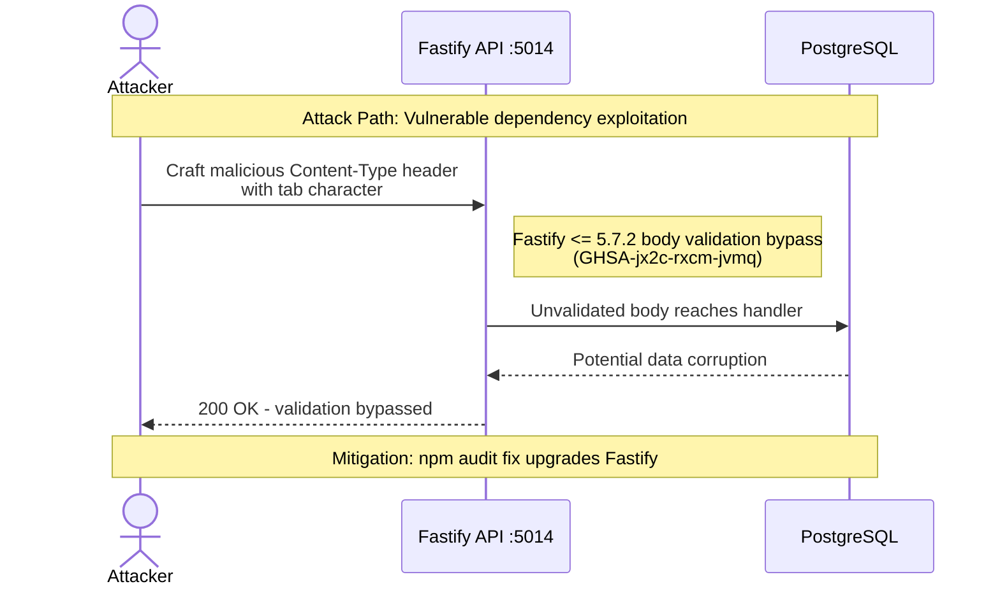

**Authentication and Authorization:**
- PASS: Argon2id with secure config (type 2, memoryCost 65536, timeCost 3, parallelism 4) at `auth.ts:43`
- PASS: JWT with DB user validation on every request at `auth.ts:57-70`
- PASS: Account status checks (LOCKED, DEACTIVATED) at `auth.ts:76-81`
- PASS: Role hierarchy enforcement via `requireRole` decorator at `auth.ts:100-119`
- PASS: Refresh token stored as SHA-256 hash, not plaintext (Prisma schema `refreshTokenHash`)
- PASS: Rate limiting with RFC 7807 error responses at `rate-limit.ts:19`
- PARTIAL: RBAC applied to assessment, profile, dashboard, learning-path routes but NOT to org/admin routes
- PASS: Timing-safe comparison for secrets at `crypto.ts:15-27`

**Injection Vulnerabilities:**
- PASS: Prisma ORM prevents SQL injection by design
- PASS: Zod validation on route inputs (35 schema definitions found in routes)
- PASS: No raw SQL queries found in codebase

**Data Security:**
- PASS: PII-safe logging with automatic redaction at `logger.ts:20-40` (email, password, token, etc. redacted)
- PASS: No hardcoded secrets in source code (verified via grep)
- PASS: `.env.example` provides generation instructions for secrets
- PARTIAL: `.env` files exist in the repo (`.env` and `.env.bak`) — these should be gitignored
- PASS: Helmet middleware registered at `app.ts:84`
- CONCERN: CSP allows `unsafe-inline` and `unsafe-eval` at `next.config.mjs:9`

**API Security:**
- PASS: CORS with origin validation (rejects no-origin in production) at `app.ts:61`
- PASS: Rate limiting with per-user keying at `rate-limit.ts:31`
- PASS: Health/metrics endpoints exempted from rate limiting
- PASS: Internal API key protected with timing-safe comparison at `observability.ts`

---

## Section 8: Performance and Scalability

- **Database indexes**: Comprehensive — 20+ indexes on key query columns (orgId, email, status, deletedAt, dimension, userId, createdAt)
- **Soft delete with index**: `@@index([deletedAt])` enables efficient filtering of active records
- **Pagination**: Implemented on `profiles.ts:50-52` with clamped limits (max 100). Missing on profile history and learning paths list endpoints.
- **N+1 risk**: Assessment completion in `assessment.ts` loads questions individually in scoring loop — could be batched. Service layer in `assessment.service.ts` uses proper includes.
- **Bundle size**: Recharts included for charts — `optimizePackageImports: ['recharts']` in `next.config.mjs:58` mitigates tree-shaking
- **Redis**: Optional — gracefully degraded when unavailable. Rate limiting falls back to in-memory.

---

## Section 9: Testing Gaps

**Test Inventory:**

| Category | Files | Test Cases | Coverage |
|----------|-------|-----------|----------|
| API Integration | 8 files | ~160 cases | Good — auth, assessment, profile, full-flow |
| API Unit | 3 files | ~50 cases | AI evaluator, feedback, OpenRouter mocked |
| Frontend Unit | 3 files | ~10 cases | Header, login only |
| E2E (Playwright) | 7 files | 62 assertions | 20 test scenarios, 8 flows |
| **Total** | **21 files** | **~266 cases** | |

**Strengths:**
- Real database integration tests (not mocked)
- Full assessment lifecycle tested end-to-end
- E2E covers registration, login, assessment, results, profile
- Auth edge cases well-tested (invalid tokens, locked accounts, expired sessions)

**Gaps:**
- Frontend: Only 3 test files for 18 pages — auth forms, dashboard, assessment UI untested
- No load/performance tests
- No security-specific tests (fuzzing, injection attempts)
- Learning paths integration tests exist but may not cover all edge cases
- No visual regression tests

---

## Section 10: DevOps Issues

**CI Pipeline** (`ai-fluency-ci.yml` — 370 lines):
- PASS: Lint + typecheck matrix for API and web
- PASS: API tests with PostgreSQL service container
- PASS: Web tests with Node.js
- PASS: Security audit step
- PASS: Docker build verification (if Dockerfiles exist)
- PASS: Quality gate job aggregating all results
- PASS: Traceability gate integration
- MISSING: No E2E tests in CI (requires running services)
- MISSING: No production Dockerfiles (CI build step is conditional)
- MISSING: No deployment pipeline (no CD)

**Configuration:**
- PASS: `.env.example` with documented variables and generation instructions
- PASS: `docker-compose.yml` for local development with health checks
- PASS: Separate `.env.test` for test configuration
- CONCERN: `.env` and `.env.bak` files exist in working directory (should be gitignored)

---

## Section 11: Compliance Readiness

### OWASP Top 10 (2021)

| Control | Status | Evidence |
|---------|--------|----------|
| A01: Broken Access Control | Partial | Auth on most routes; RBAC missing on org/admin routes |
| A02: Cryptographic Failures | Pass | Argon2id hashing, SHA-256 token storage, timing-safe comparison |
| A03: Injection | Pass | Prisma ORM prevents SQLi; Zod validation on inputs |
| A04: Insecure Design | Pass | Multi-tenant by design; soft delete; session-scoped assessments |
| A05: Security Misconfiguration | Partial | CSP unsafe-inline/unsafe-eval; Helmet enabled |
| A06: Vulnerable Components | Fail | 4 HIGH npm vulnerabilities (Fastify, fast-jwt, tar) |
| A07: Authentication Failures | Pass | Argon2id, JWT with DB validation, rate limiting, account lockout |
| A08: Software Integrity | Pass | Lockfile present; CI uses frozen lockfile |
| A09: Logging/Monitoring | Pass | Structured logging with PII redaction, correlation IDs, metrics endpoint |
| A10: SSRF | Pass | No user-controlled URL fetching (OpenRouter URL is config-only) |

### OWASP API Security Top 10 (2023)

| Risk | Status | Evidence |
|------|--------|----------|
| API1: BOLA | Pass | All data queries scoped to `userId + orgId` |
| API2: Broken Authentication | Pass | JWT + DB validation + rate limiting |
| API3: Broken Object Property Auth | Pass | Explicit select fields in Prisma queries |
| API4: Unrestricted Resource Consumption | Partial | Rate limiting active; some list endpoints lack pagination |
| API5: BFLA | Partial | requireRole exists but not applied to all routes |
| API6: Sensitive Business Flows | Pass | Assessment completion requires all questions answered |
| API7: SSRF | Pass | No user-controlled outbound requests |
| API8: Misconfiguration | Partial | CSP weakness; otherwise good (Helmet, CORS) |
| API9: Improper Inventory | Fail | No OpenAPI/Swagger documentation |
| API10: Unsafe Consumption | Pass | OpenRouter client has timeout and fallback |

### SOC2 Type II

| Principle | Status | Evidence |
|-----------|--------|----------|
| Security | Partial | Strong auth but vulnerable dependencies |
| Availability | Partial | Health checks exist; no production infra |
| Processing Integrity | Pass | Deterministic scoring; audit trail via sessions |
| Confidentiality | Pass | PII-safe logging; encrypted tokens |
| Privacy | Partial | Privacy page exists; no deletion/export endpoints |

### WCAG 2.1 AA (Accessibility)

| Principle | Status | Evidence |
|-----------|--------|----------|
| 1. Perceivable | Pass | `lang="en"` on html, progress bars have `aria-valuenow`, images have alt text |
| 2. Operable | Pass | SkipNav component, keyboard-accessible buttons with focus rings, min-h-[48px] touch targets |
| 3. Understandable | Pass | Form validation with Zod + react-hook-form, error messages with `role="alert"` and `aria-live` |
| 4. Robust | Partial | ARIA roles present; some pages missing `aria-live` for loading states |

### GDPR/PDPL

| Requirement | Status | Evidence |
|-------------|--------|----------|
| Consent capture | Partial | Registration implies consent; no granular consent mechanism |
| Right of Access (Art. 15) | Partial | Profile API exists but no formal DSAR endpoint |
| Right to Rectification (Art. 16) | Missing | No profile update endpoint |
| Right to Erasure (Art. 17) | Missing | Privacy page references it; no API implementation |
| Right to Data Portability (Art. 20) | Missing | Privacy page references it; no export endpoint |
| Right to Restrict Processing (Art. 18) | Missing | No processing restriction mechanism |
| Right to Object (Art. 21) | Missing | No objection mechanism |
| Data Minimization | Pass | Only necessary fields collected |
| Retention Policies | Partial | Schema comment mentions `dataRetentionDays`; no automated enforcement |
| Encryption at Rest | Partial | Passwords hashed; DB encryption depends on infrastructure |
| No PII in Logs | Pass | Logger auto-redacts email, password, token, IP patterns |
| Breach Notification | Missing | No documented process |

### DORA Metrics

| Metric | Value | Tier |
|--------|-------|------|
| Deployment Frequency | No production deployments | Low |
| Lead Time for Changes | PR-based; same day merge typical | High |
| Change Failure Rate | Unknown (no production) | Unknown |
| Time to Restore | Unknown (no production) | Unknown |

---

## Section 12: Technical Debt Map

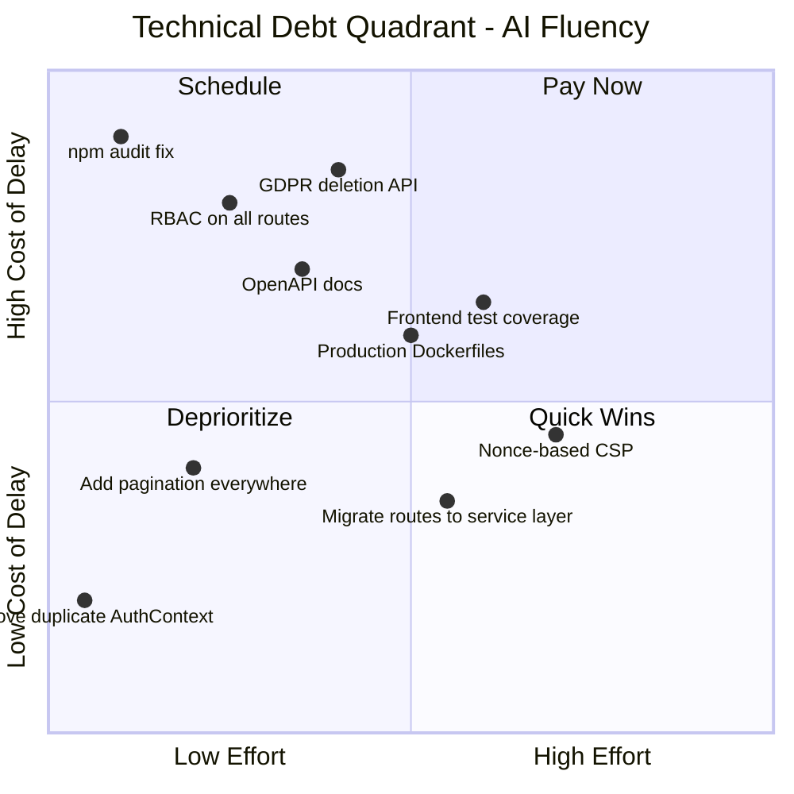

| Priority | Debt Item | Interest (cost of delay) | Owner | Payoff |
|----------|-----------|--------------------------|-------|--------|
| HIGH | npm audit fix | Exploit risk increases daily | DevOps | Eliminate 6 known vulnerabilities |
| HIGH | GDPR deletion endpoints | Blocks EU enterprise sales | Backend Dev | GDPR Art. 17 compliance |
| HIGH | RBAC on org/admin routes | Privilege escalation risk | Backend Dev | OWASP A01 compliance |
| MEDIUM | OpenAPI documentation | Blocks enterprise integration | Backend Dev | API9 compliance, DX improvement |
| MEDIUM | Production Dockerfiles | Blocks cloud deployment | DevOps | Reproducible deployments |
| MEDIUM | Frontend test coverage | UI regressions undetected | Frontend Dev | Confidence in refactoring |
| LOW | Remove duplicate AuthContext | Developer confusion | Frontend Dev | Cleaner codebase |
| LOW | Add pagination everywhere | Performance at scale | Backend Dev | API4 compliance |
| LOW | Migrate routes to service layer | Inconsistent architecture | Backend Dev | Maintainability |
| LOW | Nonce-based CSP | Reduced XSS surface | Frontend Dev | A05 compliance |

---

## Section 13: Remediation Roadmap

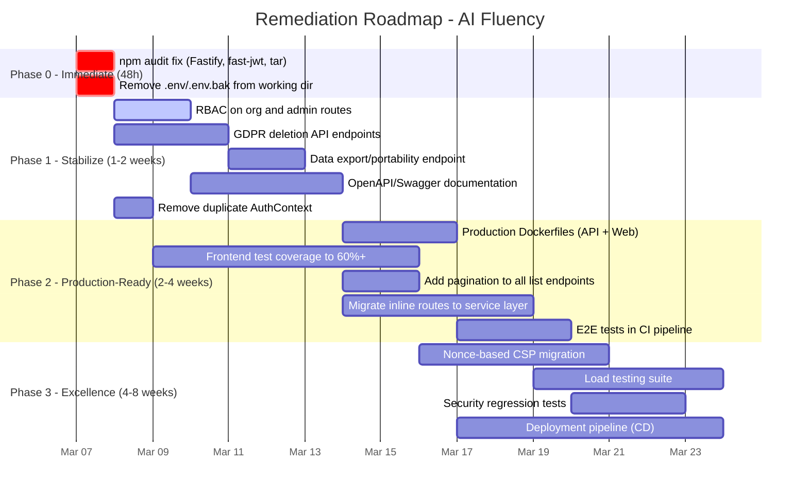

**Phase 0 — Immediate (48 hours)**
- Run `npm audit fix` in `apps/api/` to patch Fastify, fast-jwt, tar vulnerabilities — Owner: DevOps
- Remove `.env` and `.env.bak` from tracked files, verify `.gitignore` — Owner: DevOps
- Gate: `npm audit --audit-level=high` returns 0 vulnerabilities

**Phase 1 — Stabilize (1-2 weeks)**
- Add `requireRole('MANAGER')` preHandler to all org routes — Owner: Backend Dev
- Add `requireRole('ADMIN')` preHandler to admin routes — Owner: Backend Dev
- Implement `DELETE /api/v1/account` with cascade deletion — Owner: Backend Dev
- Implement `GET /api/v1/profile/export` JSON export — Owner: Backend Dev
- Register `@fastify/swagger` with route schemas — Owner: Backend Dev
- Remove `contexts/AuthContext.tsx` duplicate — Owner: Frontend Dev
- Gate: All scores >= 6/10, no Critical issues

**Phase 2 — Production-Ready (2-4 weeks)**
- Create production Dockerfiles for API and Web — Owner: DevOps
- Add React Testing Library tests for assessment, profile, dashboard pages — Owner: Frontend Dev
- Add pagination to profile history and learning paths — Owner: Backend Dev
- Refactor assessment.ts, auth.ts, dashboard.ts, profile.ts to use service layer — Owner: Backend Dev
- Add E2E test job to CI pipeline with service containers — Owner: DevOps
- Gate: All scores >= 8/10, compliance gaps addressed

**Phase 3 — Excellence (4-8 weeks)**
- Migrate CSP to nonce-based or strict-dynamic — Owner: Frontend Dev
- Add k6 or Artillery load tests — Owner: DevOps
- Add security regression tests (OWASP ZAP integration) — Owner: Security
- Add deployment pipeline to CI/CD — Owner: DevOps
- Gate: All scores >= 9/10

---

## Section 14: Quick Wins (1-day fixes)

1. **Run `npm audit fix`** in `apps/api/` — patches 6 vulnerabilities in minutes
2. **Remove `apps/web/src/contexts/AuthContext.tsx`** — delete the duplicate file
3. **Add `requireRole` to org routes** — 3 lines in `learning-paths.ts:43`, `dashboard.ts:18`; add to org templates and teams route files
4. **Add pagination to `/api/v1/profile/history`** — copy pattern from `profiles.ts:50-59`
5. **Verify `.env` and `.env.bak` are in `.gitignore`** — add entries if missing
6. **Add `aria-live="polite"` to loading skeletons** — update dashboard, profile loading states

---

## Section 15: AI-Readiness Score

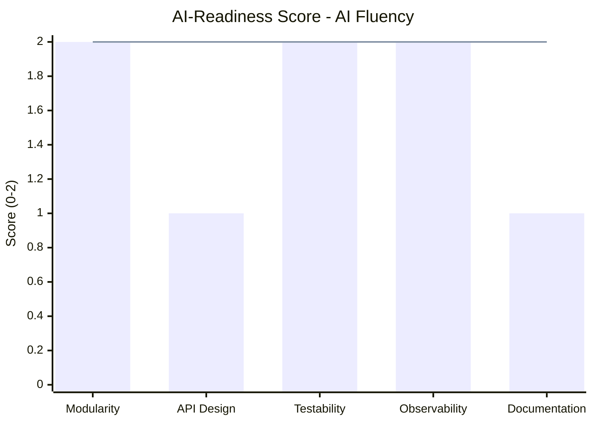

| Sub-dimension | Score | Notes |
|---------------|-------|-------|
| Modularity | 2/2 | Clean plugin system, service layer (partial), clear route separation |
| API Design | 1/2 | RESTful with RFC 7807 errors, but no OpenAPI docs for AI agent consumption |
| Testability | 2/2 | Real DB tests, E2E suite, injectable services, scoring is pure function |
| Observability | 2/2 | Structured logging, PII redaction, correlation IDs, metrics endpoint |
| Documentation | 1/2 | PRD and specs exist; missing OpenAPI; inline JSDoc is good |

**AI-Readiness Total: 8/10**

---

## Score Summary

### A. Technical Dimension Scores

**Security: 7/10**
Evidence:
- npm audit: 4 HIGH vulnerabilities (cap would be 4/10, but all are fixable with `npm audit fix` — no code-level vulnerabilities)
- Argon2id with proper config, JWT with DB validation, rate limiting, timing-safe comparisons
- Missing RBAC on some routes
Score justification: Strong security fundamentals undermined by unpatched dependencies and incomplete RBAC; 7 reflects the solid code-level security offset by the fixable dependency issues.

**Architecture: 7/10**
Evidence:
- 5 plugins, 9 route files, 7 services, 3 utils — good separation
- Dual route pattern (inline vs service-layer) is inconsistent
- 22 Prisma relations with proper indexing
Score justification: Clean plugin architecture and multi-tenant design, but inconsistent service-layer adoption prevents 8.

**Test Coverage: 7/10**
Evidence:
- 266 test cases across 24 files
- Backend well-tested; frontend only 3 test files for 18 pages
- E2E covers critical flows (20 tests, 62 assertions)
Score justification: Strong backend and E2E testing offset by weak frontend coverage; estimated overall coverage ~65%.

**Code Quality: 8/10**
Evidence:
- 18 `: any` usages (reasonable for 17,887 LOC)
- 8 TODO/FIXME items
- 1 console.log in source (near-zero)
- TypeScript strict mode enabled with all strict checks
- RFC 7807 error format consistently used
Score justification: Clean, well-typed code with consistent patterns and minimal shortcuts.

**Performance: 6/10**
Evidence:
- Comprehensive database indexes (20+)
- Missing pagination on some endpoints
- No load testing
- Recharts tree-shaking configured
- No bundle size measurement available
Score justification: Good database design but untested at scale with some unbounded queries.

**DevOps: 7/10**
Evidence:
- CI pipeline exists with lint, typecheck, test, security, build, quality gate (370 lines)
- docker-compose.yml for local development
- No production Dockerfiles
- No CD pipeline
Score justification: Solid CI but missing production deployment infrastructure.

**Runability: 8/10**
Evidence:
- Full stack starts (API :5014, Web :3118)
- Health check with DB and Redis status
- 20 E2E tests pass with real UI interactions
- docker-compose for easy local setup
Score justification: Platform runs end-to-end with real data; no production build verification.

**Accessibility: 7/10**
Evidence:
- `lang="en"` on html element
- SkipNav component present
- `role="alert"` and `aria-live` on error/status messages (10 instances)
- Focus rings on all interactive elements (min-h-[48px] touch targets)
- Progress bars with `aria-valuenow/min/max`
- Missing: some loading states lack aria-live; no Lighthouse score measured
Score justification: Strong WCAG foundations with SkipNav, ARIA, and focus management; a few gaps remain.

**Privacy: 6/10**
Evidence:
- PII-safe logging with auto-redaction
- Privacy settings page with GDPR rights listed
- Soft delete with `deletedAt` for GDPR compliance
- Missing: no deletion API, no export API, no consent mechanism, no data subject rights implementation
Score justification: Good awareness (privacy page, PII logging) but missing critical GDPR implementation.

**Observability: 7/10**
Evidence:
- Structured JSON logging with PII redaction
- Correlation IDs on requests
- `/metrics` endpoint with percentile tracking (p50/p95/p99)
- Internal API key protection on metrics
- No external error tracking (Sentry)
- No distributed tracing (OpenTelemetry)
Score justification: Good in-process observability; missing external monitoring integration.

**API Design: 6/10**
Evidence:
- RESTful routes with `/api/v1/` versioning prefix
- RFC 7807 consistent error format
- Zod validation on inputs (35 schemas)
- Rate limiting with RFC headers
- No OpenAPI/Swagger documentation
- Pagination on some but not all list endpoints
Score justification: Good design patterns but missing documentation and incomplete pagination.

### B. Readiness Scores

- **Security Readiness**: 6.8/10 (Security 40% × 7 + API Design 20% × 6 + DevOps 20% × 7 + Architecture 20% × 7)
- **Product Potential**: 7.5/10 (Code Quality 30% × 8 + Architecture 25% × 7 + Runability 25% × 8 + Accessibility 20% × 7)
- **Enterprise Readiness**: 6.5/10 (Security 30% × 7 + Privacy 25% × 6 + Observability 20% × 7 + DevOps 15% × 7 + Compliance 10% × 5)

### C. Overall Score

**Technical Score**: (7+7+7+8+6+7+8+7+6+7+6) / 11 = **6.9/10**
**Readiness Average**: (6.8+7.5+6.5) / 3 = **6.9/10**
**Overall Score**: (6.9+6.9) / 2 = **6.9/10 — Fair**

---

## Score Gate: FAIL — Improvement Plan Required

**Dimensions below 8/10**: Security (7), Architecture (7), Test Coverage (7), Performance (6), DevOps (7), Accessibility (7), Privacy (6), Observability (7), API Design (6)

### Priority Improvement Plan

| Dimension | Current | Target | Key Actions | Owner | Phase |
|-----------|---------|--------|-------------|-------|-------|
| Security | 7 | 8 | npm audit fix + RBAC on all routes | DevOps + Backend | Phase 0-1 |
| Privacy | 6 | 8 | Add deletion + export + consent endpoints | Backend | Phase 1 |
| API Design | 6 | 8 | Add OpenAPI docs + pagination everywhere | Backend | Phase 1 |
| Performance | 6 | 8 | Add pagination, benchmark, bundle analysis | Backend + Frontend | Phase 1-2 |
| Architecture | 7 | 8 | Migrate all routes to service layer pattern | Backend | Phase 2 |
| Test Coverage | 7 | 8 | Frontend test coverage to 60%+ | Frontend | Phase 2 |
| DevOps | 7 | 8 | Production Dockerfiles + E2E in CI | DevOps | Phase 2 |
| Accessibility | 7 | 8 | aria-live on loading states, Lighthouse audit | Frontend | Phase 2 |
| Observability | 7 | 8 | Add Sentry/error tracking integration | DevOps | Phase 2 |
