# AI Fluency Platform — Product Requirements Document (PRD)

**Document Version**: 1.0
**Date**: March 2, 2026
**Author**: Product Manager, ConnectSW
**Status**: Draft for CEO Review
**Product**: AI Fluency — Enterprise AI Fluency Assessment & Development Platform

---

## Table of Contents

1. [Business Context](#1-business-context)
2. [User Personas](#2-user-personas)
3. [User Stories and Acceptance Criteria](#3-user-stories-and-acceptance-criteria)
4. [User Flows](#4-user-flows)
5. [System Architecture (C4 Diagrams)](#5-system-architecture-c4-diagrams)
6. [Sequence Diagrams](#6-sequence-diagrams)
7. [State Diagrams](#7-state-diagrams)
8. [Data Model (ER Diagram)](#8-data-model-er-diagram)
9. [Functional Requirements](#9-functional-requirements)
10. [Non-Functional Requirements](#10-non-functional-requirements)
11. [Site Map](#11-site-map)
12. [Phasing: MVP, Phase 2, Future](#12-phasing-mvp-phase-2-future)
13. [Success Metrics](#13-success-metrics)
14. [Out of Scope](#14-out-of-scope)
15. [Risks and Mitigations](#15-risks-and-mitigations)

---

## 1. Business Context

### 1.1 Problem Statement

**94% of companies have NOT started AI upskilling programs** (PwC), yet workers with AI skills earn a **56% wage premium**. The AI training market is growing at **44% YoY** toward a projected **$2.52T**, while AI skill relevance degrades every ~2 years. **42% of workers expect AI-driven role changes**, creating an urgent capability gap.

Current approaches to AI training suffer from three systemic failures:

1. **No standardized measurement**: Organizations rely on generic quizzes (iMocha) or course completions (Udemy) — neither measures behavioral fluency
2. **No validated framework**: Existing tools test AI knowledge, not behavioral competency — they cannot identify specific fluency gaps
3. **No personalized remediation**: Generic training wastes budget; L&D teams cannot demonstrate ROI without pre/post behavioral data

**No existing platform implements Anthropic's peer-reviewed 4D AI Fluency Framework** (Delegation, Description, Discernment, Diligence) with its 24 empirically-validated behavioral indicators derived from analysis of 9,830+ real AI conversations. This is a blue-ocean opportunity.

### 1.2 Target Market

The global AI training market is valued at **$2.52T** and growing at **44% YoY**. The enterprise skills assessment sub-segment is estimated at **$15-20B**.

| Segment | Size (2024) | Growth | AI Fluency Opportunity |
|---------|-------------|--------|----------------------|
| Enterprise Skills Assessment | $15-20B | 18% CAGR | Primary — 4D framework assessments |
| AI Training & Upskilling | $2.52T | 44% YoY | Core — personalized learning paths |
| Higher Education EdTech | $8.2B | 12% CAGR | Secondary — university integration via LTI |

**Initial SOM**: $500K ARR from 20 enterprise customers in Year 1, growing to $2-5M ARR by Year 3.

### 1.3 Value Proposition

> **For** L&D teams and universities that need to measure and develop AI fluency, **AI Fluency** is an enterprise assessment platform **that** measures behavioral AI competency across 4 validated dimensions using 24 empirically-derived indicators, then generates personalized learning paths based on each learner's gaps. **Unlike** generic AI quizzes (iMocha), course-completion platforms (Udemy Business), or narrow data-skills trainers (DataCamp), **AI Fluency** is built on Anthropic's peer-reviewed 4D framework with prevalence-weighted scoring, discernment gap detection, and longitudinal tracking that lets organizations prove training ROI.

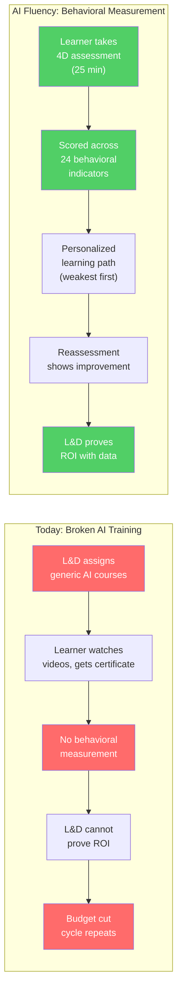
```mermaid
flowchart LR
    subgraph "Today: Broken AI Training"
        A["L&D assigns<br/>generic AI courses"] --> B["Learner watches<br/>videos, gets certificate"]
        B --> C["No behavioral<br/>measurement"]
        C --> D["L&D cannot<br/>prove ROI"]
        D --> E["Budget cut<br/>cycle repeats"]
    end

    subgraph "AI Fluency: Behavioral Measurement"
        F["Learner takes<br/>4D assessment<br/>(25 min)"] --> G["Scored across<br/>24 behavioral<br/>indicators"]
        G --> H["Personalized<br/>learning path<br/>(weakest first)"]
        H --> I["Reassessment<br/>shows improvement"]
        I --> J["L&D proves<br/>ROI with data"]
    end

    style A fill:#ff6b6b,color:#fff
    style C fill:#ff6b6b,color:#fff
    style E fill:#ff6b6b,color:#fff
    style F fill:#51cf66,color:#fff
    style G fill:#51cf66,color:#fff
    style J fill:#51cf66,color:#fff
```

### 1.4 Strategic Fit within ConnectSW Portfolio

AI Fluency is a horizontal SaaS product that complements ConnectSW's existing portfolio. Every ConnectSW product with users could integrate AI Fluency to assess and develop their users' AI capabilities.

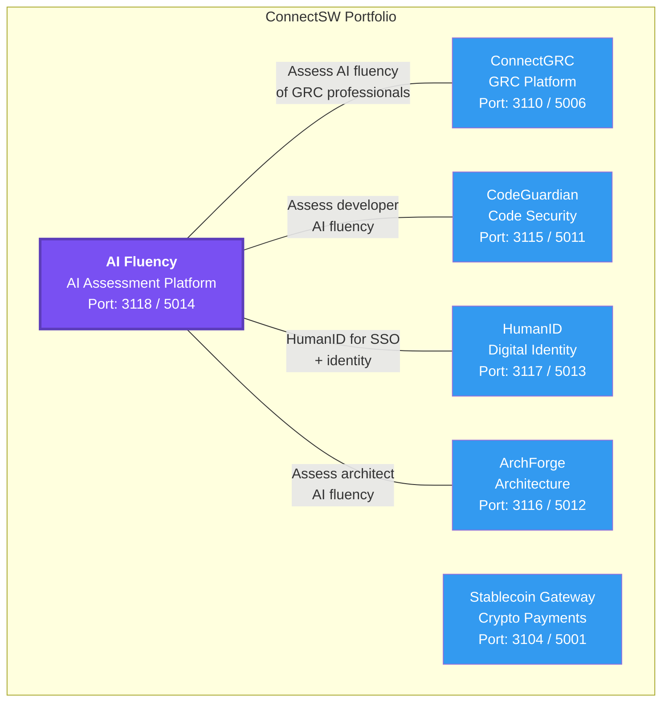
```mermaid
graph TD
    subgraph "ConnectSW Portfolio"
        AF["<b>AI Fluency</b><br/>AI Assessment Platform<br/>Port: 3118 / 5014"]
        CG["ConnectGRC<br/>GRC Platform<br/>Port: 3110 / 5006"]
        CGD["CodeGuardian<br/>Code Security<br/>Port: 3115 / 5011"]
        SG["Stablecoin Gateway<br/>Crypto Payments<br/>Port: 3104 / 5001"]
        HID["HumanID<br/>Digital Identity<br/>Port: 3117 / 5013"]
        ARCH["ArchForge<br/>Architecture<br/>Port: 3116 / 5012"]
    end

    AF ---|"Assess AI fluency<br/>of GRC professionals"| CG
    AF ---|"Assess developer<br/>AI fluency"| CGD
    AF ---|"HumanID for SSO<br/>+ identity"| HID
    AF ---|"Assess architect<br/>AI fluency"| ARCH

    style AF fill:#7950f2,color:#fff,stroke:#5c3dba,stroke-width:3px
    style CG fill:#339af0,color:#fff
    style CGD fill:#339af0,color:#fff
    style SG fill:#339af0,color:#fff
    style HID fill:#339af0,color:#fff
    style ARCH fill:#339af0,color:#fff
```

### 1.5 Competitive Differentiation

| Differentiator | AI Fluency (Ours) | iMocha | DataCamp | Udemy Business | Anthropic Academy |
|---------------|-------------------|--------|----------|---------------|-------------------|
| 4D Framework Assessment | **YES (core)** | No | No | No | No (education only) |
| 24 Behavioral Indicators | **YES (all 24)** | No | No | No | Teaches concepts |
| Prevalence-Weighted Scoring | **YES** | No | No | No | No |
| Personalized Learning Paths | **YES (per dimension)** | No | Partial (data) | No | No |
| Discernment Gap Detection | **YES (targeted)** | No | No | No | Mentions concept |
| Role-Specific Templates | **YES (6+ roles)** | Generic | Data roles | No | No |
| Organizational Dashboard | **YES** | YES | YES | Basic | No |
| Enterprise SSO | **YES** | YES | YES | YES | No |
| LMS Integration (LTI) | **YES** | YES | YES | YES | No |
| Longitudinal Tracking | **YES** | Partial | YES | Completion only | No |

**Blue Ocean**: The intersection of validated framework + behavioral measurement + personalized remediation + enterprise analytics is unoccupied. Anthropic Academy creates framework awareness (demand generation) but provides no assessment tooling.

---

## 2. User Personas

### 2.1 Lisa — L&D Manager (Primary Buyer)

| Attribute | Detail |
|-----------|--------|
| **Role** | Enterprise Learning & Development Manager |
| **Organization** | Fortune 5000 company, 500+ employees |
| **Pain point** | No standardized way to measure team AI competency; relies on subjective manager assessments; cannot justify AI training budget |
| **Goal** | Data-driven AI fluency metrics per team member, department, and organization; prove training ROI to leadership |
| **Tech comfort** | Moderate — uses LMS daily, comfortable with dashboards |
| **Decision power** | Recommends tools; budget approved by VP/CLO |
| **Success looks like** | "I can show the VP that our team's Discernment scores improved 20% after targeted training" |

### 2.2 Alex — Individual Learner

| Attribute | Detail |
|-----------|--------|
| **Role** | Knowledge Worker / Professional |
| **Organization** | Any — enterprise employee or individual user |
| **Pain point** | Lacks structured guidance on effective AI interaction; does not know personal strengths and gaps |
| **Goal** | Personalized fluency profile with targeted learning path; earn certification |
| **Tech comfort** | High — uses AI tools daily |
| **Decision power** | None — assigned assessments by L&D or self-serve signup |
| **Success looks like** | "I now know I'm strong in Delegation but weak in Discernment — and I have exercises to fix that" |

### 2.3 Prof. Sarah — University Instructor

| Attribute | Detail |
|-----------|--------|
| **Role** | Higher Education Faculty |
| **Organization** | University or college integrating AI fluency into curricula |
| **Pain point** | No validated assessment framework for grading AI fluency in coursework |
| **Goal** | Assign standardized 4D assessments with gradeable results; track class progress |
| **Tech comfort** | Moderate — uses LMS (Canvas, Moodle); expects LTI integration |
| **Decision power** | Course-level adoption; department-level recommendation |
| **Success looks like** | "Students' assessment results flow directly into Canvas grades — no manual entry needed" |

### 2.4 David — C-Suite Executive

| Attribute | Detail |
|-----------|--------|
| **Role** | VP / CTO / CLO |
| **Organization** | Enterprise with AI transformation initiative |
| **Pain point** | Cannot quantify AI readiness or justify training investment with data |
| **Goal** | Organizational dashboard with aggregate fluency scores, trends, and ROI metrics |
| **Tech comfort** | Low-moderate — views dashboards, doesn't configure |
| **Decision power** | Budget approval authority |
| **Success looks like** | "Our quarterly AI fluency report shows 15% improvement across all departments — the $200K training investment is justified" |

### 2.5 Raj — IT Administrator

| Attribute | Detail |
|-----------|--------|
| **Role** | Enterprise IT / Security |
| **Organization** | Enterprise with strict security and compliance requirements |
| **Pain point** | Security and compliance concerns with new SaaS tools; SSO and data residency requirements |
| **Goal** | SAML/OIDC SSO, multi-tenant data isolation, configurable data retention |
| **Tech comfort** | High — configures identity providers, reviews security posture |
| **Decision power** | Can block procurement on security grounds |
| **Success looks like** | "SSO is configured, data is isolated per our RLS policies, and retention policies meet our compliance requirements" |

---

## 3. User Stories and Acceptance Criteria

### 3.1 Epic: Core Assessment (EP-01) — P0

#### US-01: Take 4D Framework Assessment

> **As** Alex (learner), **I want to** take an interactive assessment that evaluates my AI fluency across Delegation, Description, Discernment, and Diligence dimensions, **so that** I understand my strengths and gaps.

**Priority**: P0 (MVP)

**Acceptance Criteria**:

| AC ID | Given | When | Then |
|-------|-------|------|------|
| AC-01-1 | A logged-in learner with no active assessment | The learner clicks "Start Assessment" | The system creates a new assessment session and displays the first question within 2 seconds |
| AC-01-2 | A learner mid-assessment | The learner answers a question | The system records the response, advances to the next question, and updates the progress indicator |
| AC-01-3 | A learner who has answered all 32 questions | The assessment is complete | The system calculates dimension scores using prevalence-weighted scoring and displays a fluency profile within 3 seconds |
| AC-01-4 | A learner mid-assessment | The learner closes the browser | The system saves progress and allows resumption from the last unanswered question on next login |
| AC-01-5 | An invalid or missing response | The learner attempts to advance | The system displays a validation error and does not advance |

---

#### US-02: View Fluency Profile

> **As** Alex (learner), **I want to** receive a detailed fluency profile showing my scores per dimension with behavioral indicator breakdowns, **so that** I know exactly where to improve.

**Priority**: P0 (MVP)

**Acceptance Criteria**:

| AC ID | Given | When | Then |
|-------|-------|------|------|
| AC-02-1 | A completed assessment | The learner views their fluency profile | The system displays an Observed Fluency Score (0-100), a Self-Reported Fluency Score (0-100), 4 dimension scores (0-100 each), and a radar chart |
| AC-02-2 | A completed assessment | The learner expands a dimension | The system displays individual behavioral indicators with pass/fail/partial status and the learner's specific responses |
| AC-02-3 | A learner with no completed assessments | The learner navigates to the profile page | The system displays a prompt to take their first assessment with a "Start Assessment" CTA |

---

#### US-03: Prevalence-Weighted Scoring Engine

> **As** the assessment engine, **I want to** evaluate 11 observable behaviors using prevalence-weighted scoring, **so that** scores reflect the relative difficulty and rarity of each behavior.

**Priority**: P0 (MVP)

**Acceptance Criteria**:

| AC ID | Given | When | Then |
|-------|-------|------|------|
| AC-03-1 | A completed assessment with all questions answered | The scoring engine processes responses | It applies prevalence-weighted scoring where rarer behaviors (lower prevalence) receive higher weights |
| AC-03-2 | A set of test responses with known expected outcomes | The scoring engine calculates scores | Each dimension score falls within 0-100 and the overall score is the weighted average of dimension scores |
| AC-03-3 | An assessment with partial responses (save-and-resume) | The scoring engine is invoked | It scores only completed sections and marks incomplete dimensions as "In Progress" |

---

#### US-04: Self-Report for Unobservable Behaviors

> **As** Alex (learner), **I want to** complete scenario-based self-assessment questions for the 13 unobservable behaviors, **so that** my full fluency profile is captured.

**Priority**: P0 (MVP)

**Acceptance Criteria**:

| AC ID | Given | When | Then |
|-------|-------|------|------|
| AC-04-1 | A learner in the assessment flow | The learner reaches the self-report section | The system presents scenario-based questions covering all 13 unobservable behaviors grouped by dimension |
| AC-04-2 | A self-report question | The learner selects a response on the Likert scale (1-5) | The system records the response and maps it to the corresponding behavioral indicator |
| AC-04-3 | A completed self-report section | Scores are calculated | Self-reported scores are displayed separately from observed-behavior scores with a clear "Self-Reported" label |

---

### 3.2 Epic: Learning & Growth (EP-02) — P0

#### US-05: Personalized Learning Path

> **As** Alex (learner), **I want to** receive a personalized learning path based on my assessment results that prioritizes my weakest dimensions, **so that** I improve efficiently.

**Priority**: P0 (MVP)

**Acceptance Criteria**:

| AC ID | Given | When | Then |
|-------|-------|------|------|
| AC-05-1 | A learner with a completed assessment | The learner clicks "Start Learning Path" | The system generates a learning path with modules ordered by dimension score (lowest first) within 2 seconds |
| AC-05-2 | A learning path in progress | The learner completes a module | The system marks it complete, updates progress percentage, and unlocks the next module |
| AC-05-3 | A learner who completed all modules in a dimension | The learner takes a mini-reassessment | The updated score is reflected in the fluency profile alongside the original score |
| AC-05-4 | A learner with all dimensions scoring above 80 | A learning path is generated | The system recommends "Advanced" modules focusing on discernment gap and agency-mode interactions |

---

#### US-06: Track Learning Progress

> **As** Alex (learner), **I want to** track my progress through learning modules and see my fluency scores update as I complete training, **so that** I stay motivated.

**Priority**: P0 (MVP)

**Acceptance Criteria**:

| AC ID | Given | When | Then |
|-------|-------|------|------|
| AC-06-1 | A learner with an active learning path | The learner views their dashboard | The system displays modules completed (count and %), time invested, and a line chart of dimension scores over time |
| AC-06-2 | A learner who completes a module | The dashboard refreshes | Progress metrics update within 5 seconds without requiring a full page reload |
| AC-06-3 | A learner with no learning activity in 7 days | 7 days elapse | The system sends a reminder email with current progress and next recommended module |

---

### 3.3 Epic: Multi-Tenant Security (EP-03) — P0

#### US-18: Multi-Tenant Data Isolation

> **As** Raj (IT admin), **I want to** verify that my organization's data is completely isolated from other tenants, **so that** we meet security and compliance requirements.

**Priority**: P0 (MVP)

**Acceptance Criteria**:

| AC ID | Given | When | Then |
|-------|-------|------|------|
| AC-18-1 | Two organizations (Org A and Org B) in the system | A user from Org A queries assessment data | The API returns ONLY Org A's data — verified by PostgreSQL RLS |
| AC-18-2 | A user from Org A | The user attempts to access Org B's data via direct API manipulation | The system returns 403 Forbidden and logs the attempt |
| AC-18-3 | Multi-tenant isolation enabled | A new organization is created | The system provisions RLS policies for the new tenant within the same transaction |

---

### 3.4 Epic: Role-Specific Assessment (EP-04) — P1

#### US-07: Role-Specific Assessment Templates

> **As** Lisa (L&D manager), **I want to** select role-specific assessment templates (developer, analyst, manager, marketer), **so that** assessments are relevant to each team member's work context.

**Priority**: P1

**Acceptance Criteria**:

| AC ID | Given | When | Then |
|-------|-------|------|------|
| AC-07-1 | An L&D manager creating a team assessment | The manager selects a role template | The system displays at least 4 role templates (Developer, Analyst, Manager, Marketer) with emphasis area descriptions |
| AC-07-2 | A selected role template | The assessment is generated | Scenario questions are contextualized to the selected role and indicator weights adjusted per template |
| AC-07-3 | A role template not in the library | The L&D manager clicks "Custom Template" | The system allows custom weight configuration per dimension with a preview |

---

#### US-08: Role-Contextualized Assessment Experience

> **As** Alex (learner), **I want to** take an assessment customized for my role, **so that** results are actionable in my daily work.

**Priority**: P1

**Acceptance Criteria**:

| AC ID | Given | When | Then |
|-------|-------|------|------|
| AC-08-1 | A learner assigned a role-specific assessment | The learner starts the assessment | Scenarios reflect the assigned role's context |
| AC-08-2 | A completed role-specific assessment | The learner views results | The profile indicates which role template was used and highlights role-relevant strengths/gaps |

---

### 3.5 Epic: Organizational Analytics (EP-05) — P1

#### US-09: Organizational Dashboard

> **As** David (executive), **I want to** view an organizational dashboard showing aggregate AI fluency scores by department, role, and dimension, **so that** I make data-driven training investment decisions.

**Priority**: P1

**Acceptance Criteria**:

| AC ID | Given | When | Then |
|-------|-------|------|------|
| AC-09-1 | An executive with org-admin role | The executive views the dashboard | The system displays aggregate fluency scores filterable by department, role, and dimension with bar and radar charts |
| AC-09-2 | An organization with fewer than 5 completions | The executive views the dashboard | The system displays "Minimum 5 learners required" to prevent individual identification |
| AC-09-3 | An organization with 20+ completions | The executive selects a date range filter | Dashboard displays fluency trend data for the selected period |

---

#### US-10: Team Fluency Trends

> **As** Lisa (L&D manager), **I want to** view team-level fluency trends over time and compare against benchmarks, **so that** I measure training program effectiveness.

**Priority**: P1

**Acceptance Criteria**:

| AC ID | Given | When | Then |
|-------|-------|------|------|
| AC-10-1 | An L&D manager with a team of 5+ learners | The manager views the team dashboard | The system displays average team scores per dimension, individual member progress, and a trend line |
| AC-10-2 | A team with pre- and post-training assessments | The manager views improvement metrics | The system calculates percentage improvement per dimension with significance indicators when sample >= 30 |

---

### 3.6 Epic: Discernment Gap (EP-06) — P1

#### US-11: Discernment Gap Training

> **As** Alex (learner flagged with a discernment gap), **I want to** receive targeted training on questioning AI reasoning and identifying missing context, **so that** I develop critical evaluation skills.

**Priority**: P1

Anthropic's research found users are less likely to question AI reasoning (-3.1pp) or identify missing context (-5.2pp) when AI produces artifacts.

**Acceptance Criteria**:

| AC ID | Given | When | Then |
|-------|-------|------|------|
| AC-11-1 | A learner whose Discernment score < 50 AND "Question AI reasoning" and "Identify missing context" both "Fail" | A learning path is generated | The system inserts a "Discernment Gap" priority module before other content |
| AC-11-2 | A learner in the Discernment Gap module | The learner completes an exercise | The exercise involves evaluating AI-generated artifacts for errors, missing context, or flawed reasoning |

---

#### US-12: Discernment Gap Tracking

> **As** Lisa (L&D manager), **I want to** see which learners have discernment gaps and track improvement, **so that** I address the most impactful fluency weakness.

**Priority**: P1

**Acceptance Criteria**:

| AC ID | Given | When | Then |
|-------|-------|------|------|
| AC-12-1 | An L&D manager viewing the team dashboard | The manager selects "Discernment Gap Analysis" | The system displays flagged team members, their Discernment scores, and improvement trends |

---

### 3.7 Epic: Interaction Modes (EP-07) — P1

#### US-13: Three Interaction Mode Assessment

> **As** Alex (learner), **I want to** complete scenarios covering Automation, Augmentation, and Agency interaction modes, **so that** my fluency is measured across all AI interaction types.

**Priority**: P1

**Acceptance Criteria**:

| AC ID | Given | When | Then |
|-------|-------|------|------|
| AC-13-1 | A learner taking an assessment | The assessment includes all three modes | Each mode has at least 2 scenario questions and results show fluency per mode |
| AC-13-2 | A completed assessment | The learner views results | The profile displays a breakdown by interaction mode alongside the 4D dimension breakdown |

---

### 3.8 Epic: Enterprise Integration (EP-08) — P1

#### US-14: Enterprise SSO

> **As** Raj (IT admin), **I want to** configure SAML/OIDC SSO for my organization, **so that** employees use existing credentials.

**Priority**: P1

**Acceptance Criteria**:

| AC ID | Given | When | Then |
|-------|-------|------|------|
| AC-14-1 | An IT admin in organization settings | The admin configures SAML SSO with IdP metadata URL | The system validates and enables SSO within 30 seconds |
| AC-14-2 | SSO is configured | An employee visits the login page | The system displays "Sign in with SSO" alongside email/password login |
| AC-14-3 | An invalid SSO configuration | A user attempts SSO login | The system displays a specific error and falls back to email/password if org allows |

---

#### US-15: LMS Integration

> **As** Lisa (L&D manager), **I want to** integrate assessments into our LMS via SCORM/LTI, **so that** results appear in existing learning records.

**Priority**: P1

**Acceptance Criteria**:

| AC ID | Given | When | Then |
|-------|-------|------|------|
| AC-15-1 | An organization with LMS integration | A learner launches the assessment from the LMS | The system authenticates via LTI and returns results to the LMS grade book on completion |
| AC-15-2 | An LTI launch with invalid credentials | The system processes the request | It returns an LTI error response and logs the failed attempt |

---

### 3.9 Epic: Longitudinal Analytics (EP-09) — P1

#### US-19: Longitudinal Fluency Trends

> **As** Lisa (L&D manager), **I want to** view longitudinal fluency trends for individuals and teams over 3-12 months, **so that** I quantify training ROI.

**Priority**: P1

**Acceptance Criteria**:

| AC ID | Given | When | Then |
|-------|-------|------|------|
| AC-19-1 | A learner with 2+ completed assessments over 3+ months | The manager views the longitudinal report | The system displays a line chart of fluency scores over time with dimension breakdowns |

---

#### US-20: Quarterly Fluency Report

> **As** David (executive), **I want to** generate a quarterly AI fluency report, **so that** I justify continued investment.

**Priority**: P1

**Acceptance Criteria**:

| AC ID | Given | When | Then |
|-------|-------|------|------|
| AC-20-1 | An organization with 3+ months of assessment data | The executive clicks "Generate Quarterly Report" | The system produces a PDF with aggregate scores, trends, department comparisons, and ROI metrics within 10 seconds |

---

### 3.10 Epic: Data Privacy (EP-10) — P1

#### US-21: Data Privacy Management

> **As** Alex (learner), **I want to** manage my data privacy preferences and exercise my right to data erasure, **so that** my personal information is protected.

**Priority**: P1

**Acceptance Criteria**:

| AC ID | Given | When | Then |
|-------|-------|------|------|
| AC-21-1 | A logged-in learner | The learner clicks "Delete My Data" in Privacy Settings | The system schedules a hard delete within 30 days (GDPR Article 17) and sends confirmation |
| AC-21-2 | A data deletion request | 30 days elapse | All personal data is permanently deleted; anonymized aggregate statistics are retained |

---

#### US-22: Data Residency and Retention

> **As** Raj (IT admin), **I want to** configure data residency and retention policies, **so that** we comply with regional regulations.

**Priority**: P1

**Acceptance Criteria**:

| AC ID | Given | When | Then |
|-------|-------|------|------|
| AC-22-1 | An IT admin in organization settings | The admin configures data retention to 24 months | The system automatically archives or deletes data older than the configured period |

---

### 3.11 Epic: Certification (EP-11) — P2

#### US-16: Digital Badges and Certification

> **As** Alex (learner), **I want to** earn a digital badge and certificate when I achieve fluency milestones, **so that** I demonstrate AI competency to employers.

**Priority**: P2

**Acceptance Criteria**:

| AC ID | Given | When | Then |
|-------|-------|------|------|
| AC-16-1 | A learner whose overall fluency score exceeds threshold (default 70) | The score is confirmed | The system generates a digital badge (Open Badges v3) and downloadable PDF certificate |
| AC-16-2 | A learner with a certificate | Validity period expires (default 12 months) | The system sends a recertification reminder 30 days before expiry |

---

#### US-17: Certification Configuration

> **As** Raj (org admin), **I want to** configure certification thresholds and recertification periods, **so that** credentials remain current.

**Priority**: P2

**Acceptance Criteria**:

| AC ID | Given | When | Then |
|-------|-------|------|------|
| AC-17-1 | An org admin in settings | The admin sets a custom threshold (e.g., 80) | All future certifications for that organization use the new threshold |

---

## 4. User Flows

### 4.1 Assessment Flow (Primary Journey)

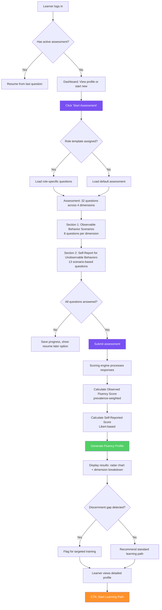
```mermaid
flowchart TD
    A[Learner logs in] --> B{Has active assessment?}
    B -->|Yes| C[Resume from last question]
    B -->|No| D[Dashboard: View profile or start new]
    D --> E[Click 'Start Assessment']
    E --> F{Role template assigned?}
    F -->|Yes| G[Load role-specific questions]
    F -->|No| H[Load default assessment]
    G --> I[Assessment: 32 questions across 4 dimensions]
    H --> I
    I --> J[Section 1: Observable Behavior Scenarios<br/>8 questions per dimension]
    J --> K[Section 2: Self-Report for Unobservable Behaviors<br/>13 scenario-based questions]
    K --> L{All questions answered?}
    L -->|No| M[Save progress, show resume later option]
    L -->|Yes| N[Submit assessment]
    N --> O[Scoring engine processes responses]
    O --> P[Calculate Observed Fluency Score<br/>prevalence-weighted]
    P --> Q[Calculate Self-Reported Score<br/>Likert-based]
    Q --> R[Generate Fluency Profile]
    R --> S[Display results: radar chart + dimension breakdown]
    S --> T{Discernment gap detected?}
    T -->|Yes| U[Flag for targeted training]
    T -->|No| V[Recommend standard learning path]
    U --> W[Learner views detailed profile]
    V --> W
    W --> X[CTA: Start Learning Path]

    style E fill:#7950f2,color:#fff
    style N fill:#7950f2,color:#fff
    style R fill:#51cf66,color:#fff
    style X fill:#ff922b,color:#fff
```

### 4.2 Learning Path Flow

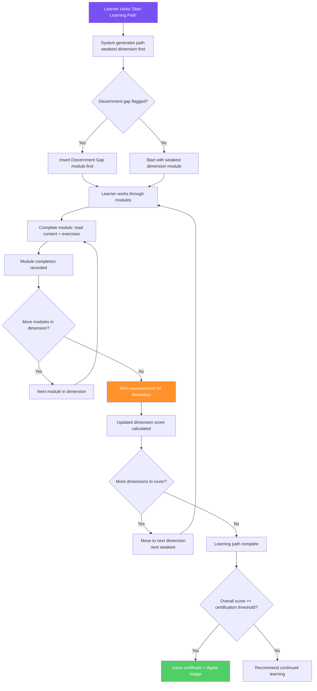
```mermaid
flowchart TD
    A[Learner clicks 'Start Learning Path'] --> B[System generates path:<br/>weakest dimension first]
    B --> C{Discernment gap flagged?}
    C -->|Yes| D[Insert Discernment Gap module first]
    C -->|No| E[Start with weakest dimension module]
    D --> F[Learner works through modules]
    E --> F
    F --> G[Complete module: read content + exercises]
    G --> H[Module completion recorded]
    H --> I{More modules in dimension?}
    I -->|Yes| J[Next module in dimension]
    I -->|No| K[Mini-reassessment for dimension]
    J --> G
    K --> L[Updated dimension score calculated]
    L --> M{More dimensions to cover?}
    M -->|Yes| N[Move to next dimension<br/>next weakest]
    M -->|No| O[Learning path complete]
    N --> F
    O --> P{Overall score >= certification threshold?}
    P -->|Yes| Q[Issue certificate + digital badge]
    P -->|No| R[Recommend continued learning]

    style A fill:#7950f2,color:#fff
    style K fill:#ff922b,color:#fff
    style Q fill:#51cf66,color:#fff
```

### 4.3 L&D Manager Dashboard Flow

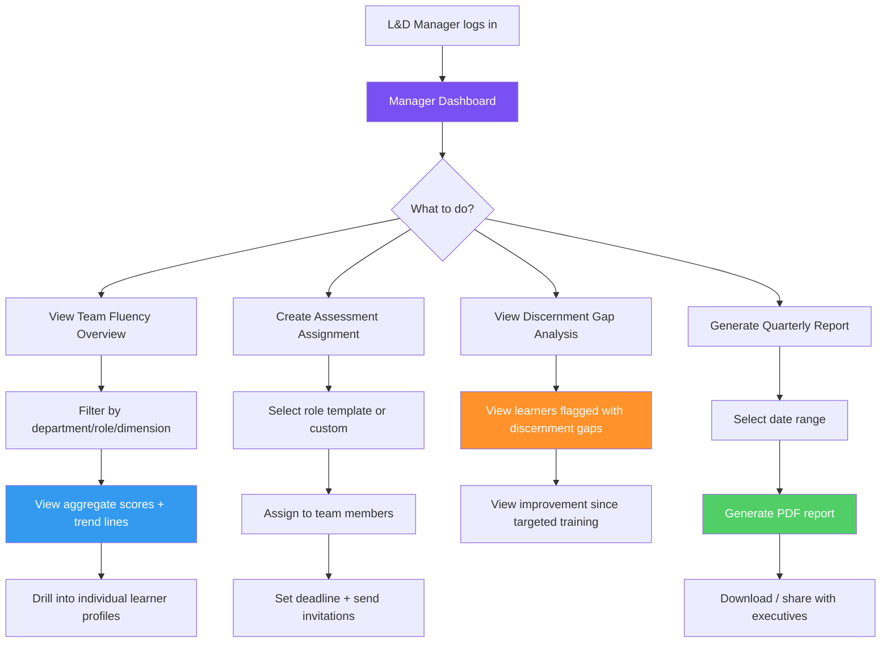
```mermaid
flowchart TD
    A[L&D Manager logs in] --> B[Manager Dashboard]
    B --> C{What to do?}
    C --> D[View Team Fluency Overview]
    C --> E[Create Assessment Assignment]
    C --> F[View Discernment Gap Analysis]
    C --> G[Generate Quarterly Report]

    D --> D1[Filter by department/role/dimension]
    D1 --> D2[View aggregate scores + trend lines]
    D2 --> D3[Drill into individual learner profiles]

    E --> E1[Select role template or custom]
    E1 --> E2[Assign to team members]
    E2 --> E3[Set deadline + send invitations]

    F --> F1[View learners flagged with discernment gaps]
    F1 --> F2[View improvement since targeted training]

    G --> G1[Select date range]
    G1 --> G2[Generate PDF report]
    G2 --> G3[Download / share with executives]

    style B fill:#7950f2,color:#fff
    style D2 fill:#339af0,color:#fff
    style F1 fill:#ff922b,color:#fff
    style G2 fill:#51cf66,color:#fff
```

---

## 5. System Architecture (C4 Diagrams)

### 5.1 C4 Level 1: System Context

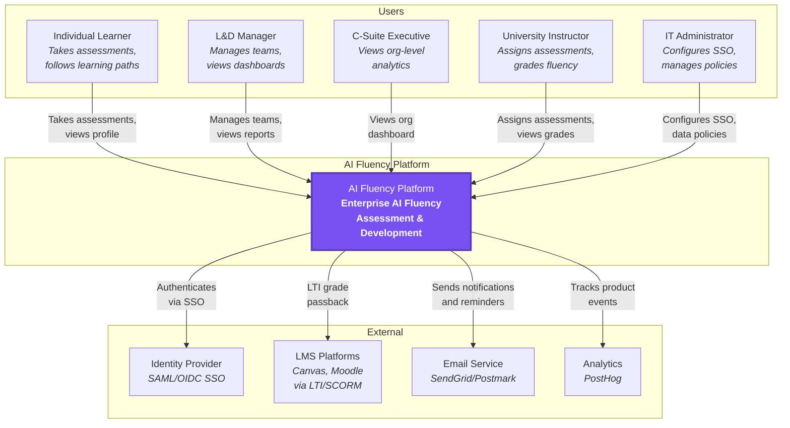
```mermaid
graph TD
    subgraph Users
        learner["Individual Learner<br/><i>Takes assessments,<br/>follows learning paths</i>"]
        ldm["L&D Manager<br/><i>Manages teams,<br/>views dashboards</i>"]
        exec["C-Suite Executive<br/><i>Views org-level<br/>analytics</i>"]
        instructor["University Instructor<br/><i>Assigns assessments,<br/>grades fluency</i>"]
        itadmin["IT Administrator<br/><i>Configures SSO,<br/>manages policies</i>"]
    end

    subgraph "AI Fluency Platform"
        platform["AI Fluency Platform<br/><b>Enterprise AI Fluency<br/>Assessment & Development</b>"]
    end

    subgraph External
        idp["Identity Provider<br/><i>SAML/OIDC SSO</i>"]
        lms["LMS Platforms<br/><i>Canvas, Moodle<br/>via LTI/SCORM</i>"]
        email["Email Service<br/><i>SendGrid/Postmark</i>"]
        analytics["Analytics<br/><i>PostHog</i>"]
    end

    learner -->|"Takes assessments,<br/>views profile"| platform
    ldm -->|"Manages teams,<br/>views reports"| platform
    exec -->|"Views org<br/>dashboard"| platform
    instructor -->|"Assigns assessments,<br/>views grades"| platform
    itadmin -->|"Configures SSO,<br/>data policies"| platform

    platform -->|"Authenticates<br/>via SSO"| idp
    platform -->|"LTI grade<br/>passback"| lms
    platform -->|"Sends notifications<br/>and reminders"| email
    platform -->|"Tracks product<br/>events"| analytics

    style platform fill:#7950f2,color:#fff,stroke:#5c3dba,stroke-width:3px
```

### 5.2 C4 Level 2: Container Diagram

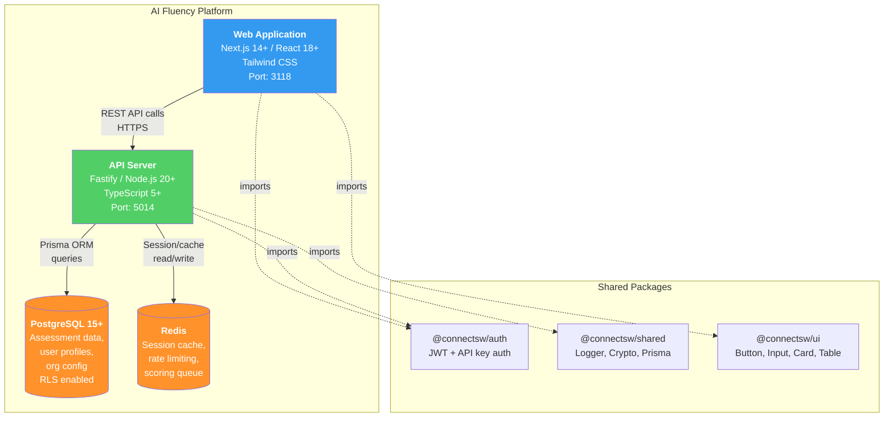
```mermaid
graph TD
    subgraph "AI Fluency Platform"
        web["<b>Web Application</b><br/>Next.js 14+ / React 18+<br/>Tailwind CSS<br/>Port: 3118"]
        api["<b>API Server</b><br/>Fastify / Node.js 20+<br/>TypeScript 5+<br/>Port: 5014"]
        db[("<b>PostgreSQL 15+</b><br/>Assessment data,<br/>user profiles,<br/>org config<br/>RLS enabled")]
        cache[("<b>Redis</b><br/>Session cache,<br/>rate limiting,<br/>scoring queue")]
    end

    subgraph "Shared Packages"
        auth["@connectsw/auth<br/>JWT + API key auth"]
        shared["@connectsw/shared<br/>Logger, Crypto, Prisma"]
        ui["@connectsw/ui<br/>Button, Input, Card, Table"]
    end

    web -->|"REST API calls<br/>HTTPS"| api
    api -->|"Prisma ORM<br/>queries"| db
    api -->|"Session/cache<br/>read/write"| cache

    web -.->|"imports"| ui
    web -.->|"imports"| auth
    api -.->|"imports"| auth
    api -.->|"imports"| shared

    style web fill:#339af0,color:#fff
    style api fill:#51cf66,color:#fff
    style db fill:#ff922b,color:#fff
    style cache fill:#ff922b,color:#fff
```

### 5.3 C4 Level 3: API Server Components

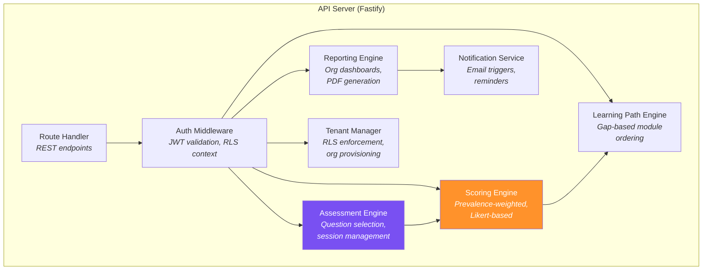
```mermaid
graph TD
    subgraph "API Server (Fastify)"
        router["Route Handler<br/><i>REST endpoints</i>"]
        authMw["Auth Middleware<br/><i>JWT validation, RLS context</i>"]
        assessment["Assessment Engine<br/><i>Question selection,<br/>session management</i>"]
        scoring["Scoring Engine<br/><i>Prevalence-weighted,<br/>Likert-based</i>"]
        learning["Learning Path Engine<br/><i>Gap-based module<br/>ordering</i>"]
        reporting["Reporting Engine<br/><i>Org dashboards,<br/>PDF generation</i>"]
        tenant["Tenant Manager<br/><i>RLS enforcement,<br/>org provisioning</i>"]
        notify["Notification Service<br/><i>Email triggers,<br/>reminders</i>"]
    end

    router --> authMw
    authMw --> assessment
    authMw --> scoring
    authMw --> learning
    authMw --> reporting
    authMw --> tenant
    assessment --> scoring
    scoring --> learning
    reporting --> notify

    style scoring fill:#ff922b,color:#fff
    style assessment fill:#7950f2,color:#fff
```

---

## 6. Sequence Diagrams

### 6.1 Assessment Submission and Scoring

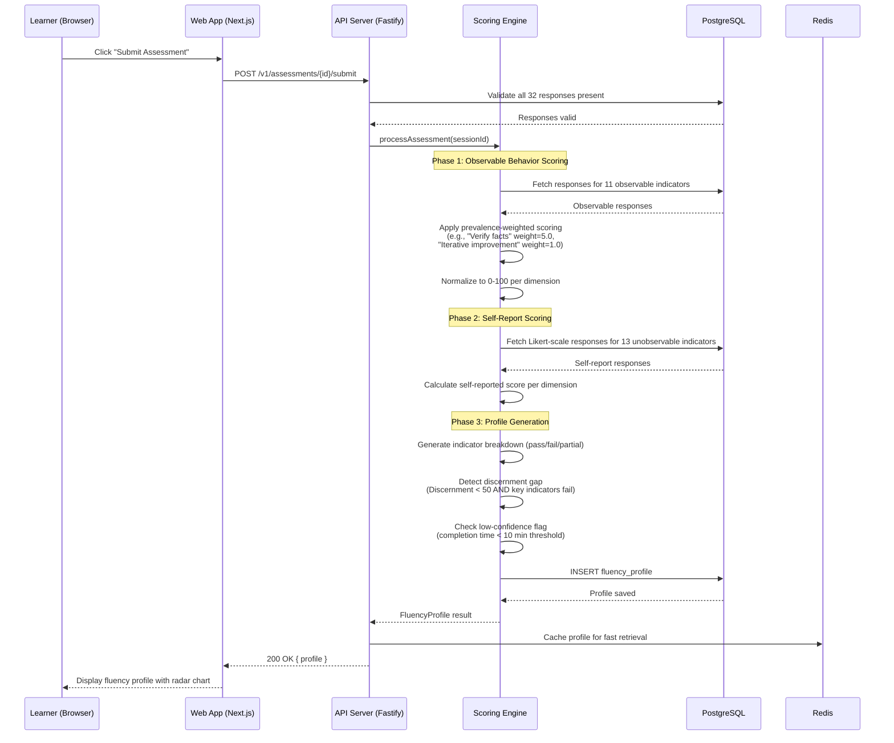
```mermaid
sequenceDiagram
    participant L as Learner (Browser)
    participant W as Web App (Next.js)
    participant A as API Server (Fastify)
    participant SE as Scoring Engine
    participant DB as PostgreSQL
    participant R as Redis

    L->>W: Click "Submit Assessment"
    W->>A: POST /v1/assessments/{id}/submit
    A->>DB: Validate all 32 responses present
    DB-->>A: Responses valid

    A->>SE: processAssessment(sessionId)
    Note over SE: Phase 1: Observable Behavior Scoring
    SE->>DB: Fetch responses for 11 observable indicators
    DB-->>SE: Observable responses
    SE->>SE: Apply prevalence-weighted scoring<br/>(e.g., "Verify facts" weight=5.0,<br/>"Iterative improvement" weight=1.0)
    SE->>SE: Normalize to 0-100 per dimension

    Note over SE: Phase 2: Self-Report Scoring
    SE->>DB: Fetch Likert-scale responses for 13 unobservable indicators
    DB-->>SE: Self-report responses
    SE->>SE: Calculate self-reported score per dimension

    Note over SE: Phase 3: Profile Generation
    SE->>SE: Generate indicator breakdown (pass/fail/partial)
    SE->>SE: Detect discernment gap<br/>(Discernment < 50 AND key indicators fail)
    SE->>SE: Check low-confidence flag<br/>(completion time < 10 min threshold)
    SE->>DB: INSERT fluency_profile
    DB-->>SE: Profile saved

    SE-->>A: FluencyProfile result
    A->>R: Cache profile for fast retrieval
    A-->>W: 200 OK { profile }
    W-->>L: Display fluency profile with radar chart
```

### 6.2 Learning Path Generation

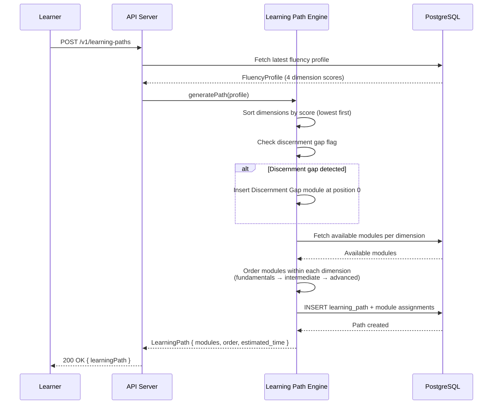
```mermaid
sequenceDiagram
    participant L as Learner
    participant A as API Server
    participant LP as Learning Path Engine
    participant DB as PostgreSQL

    L->>A: POST /v1/learning-paths
    A->>DB: Fetch latest fluency profile
    DB-->>A: FluencyProfile (4 dimension scores)

    A->>LP: generatePath(profile)
    LP->>LP: Sort dimensions by score (lowest first)
    LP->>LP: Check discernment gap flag
    alt Discernment gap detected
        LP->>LP: Insert Discernment Gap module at position 0
    end
    LP->>DB: Fetch available modules per dimension
    DB-->>LP: Available modules
    LP->>LP: Order modules within each dimension<br/>(fundamentals → intermediate → advanced)
    LP->>DB: INSERT learning_path + module assignments
    DB-->>LP: Path created

    LP-->>A: LearningPath { modules, order, estimated_time }
    A-->>L: 200 OK { learningPath }
```

### 6.3 SSO Authentication Flow

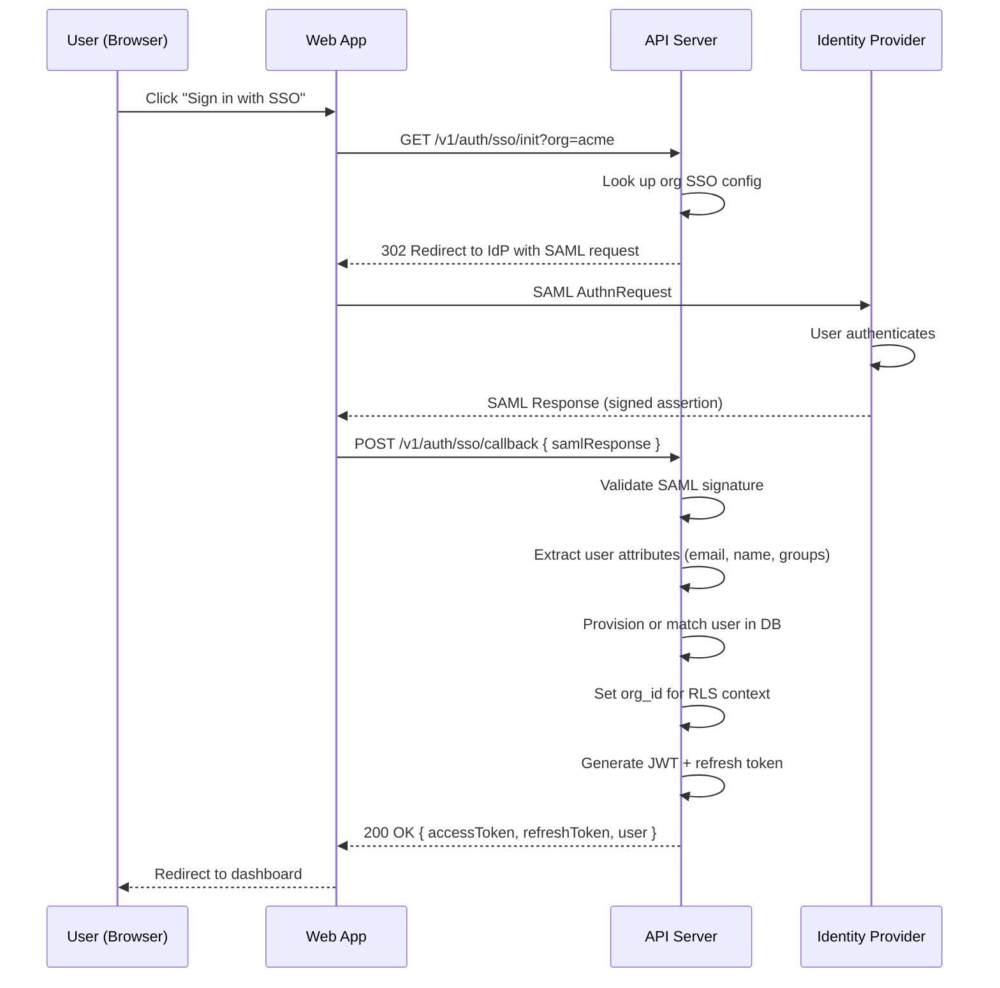
```mermaid
sequenceDiagram
    participant U as User (Browser)
    participant W as Web App
    participant A as API Server
    participant IDP as Identity Provider

    U->>W: Click "Sign in with SSO"
    W->>A: GET /v1/auth/sso/init?org=acme
    A->>A: Look up org SSO config
    A-->>W: 302 Redirect to IdP with SAML request

    W->>IDP: SAML AuthnRequest
    IDP->>IDP: User authenticates
    IDP-->>W: SAML Response (signed assertion)

    W->>A: POST /v1/auth/sso/callback { samlResponse }
    A->>A: Validate SAML signature
    A->>A: Extract user attributes (email, name, groups)
    A->>A: Provision or match user in DB
    A->>A: Set org_id for RLS context
    A->>A: Generate JWT + refresh token
    A-->>W: 200 OK { accessToken, refreshToken, user }
    W-->>U: Redirect to dashboard
```

---

## 7. State Diagrams

### 7.1 Assessment Session States

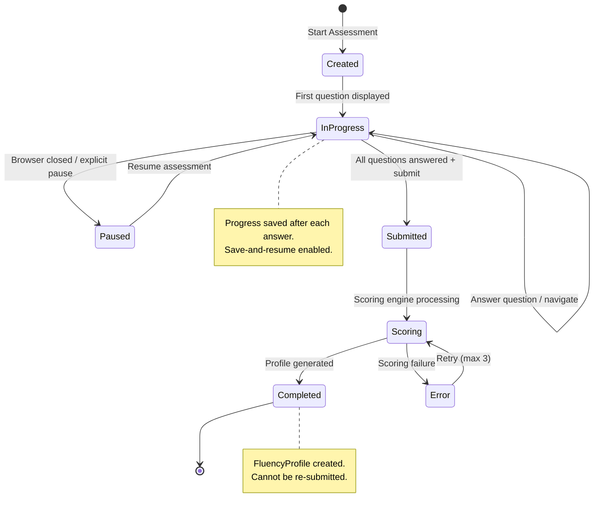
```mermaid
stateDiagram-v2
    [*] --> Created: Start Assessment
    Created --> InProgress: First question displayed
    InProgress --> InProgress: Answer question / navigate
    InProgress --> Paused: Browser closed / explicit pause
    Paused --> InProgress: Resume assessment
    InProgress --> Submitted: All questions answered + submit
    Submitted --> Scoring: Scoring engine processing
    Scoring --> Completed: Profile generated
    Scoring --> Error: Scoring failure
    Error --> Scoring: Retry (max 3)
    Completed --> [*]

    note right of InProgress
        Progress saved after each answer.
        Save-and-resume enabled.
    end note

    note right of Completed
        FluencyProfile created.
        Cannot be re-submitted.
    end note
```

### 7.2 Learning Path States

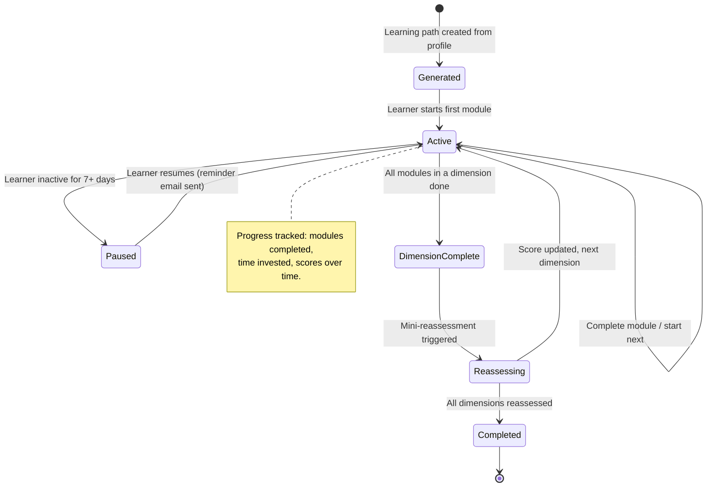
```mermaid
stateDiagram-v2
    [*] --> Generated: Learning path created from profile
    Generated --> Active: Learner starts first module
    Active --> Active: Complete module / start next
    Active --> Paused: Learner inactive for 7+ days
    Paused --> Active: Learner resumes (reminder email sent)
    Active --> DimensionComplete: All modules in a dimension done
    DimensionComplete --> Reassessing: Mini-reassessment triggered
    Reassessing --> Active: Score updated, next dimension
    Reassessing --> Completed: All dimensions reassessed
    Completed --> [*]

    note right of Active
        Progress tracked: modules completed,
        time invested, scores over time.
    end note
```

### 7.3 Certificate States

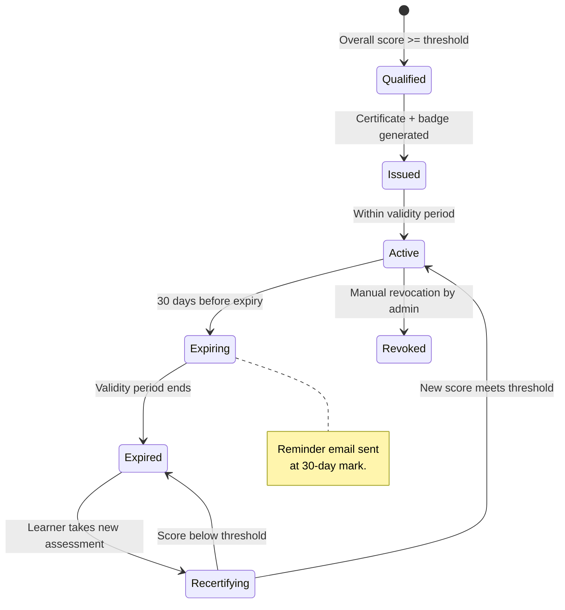
```mermaid
stateDiagram-v2
    [*] --> Qualified: Overall score >= threshold
    Qualified --> Issued: Certificate + badge generated
    Issued --> Active: Within validity period
    Active --> Expiring: 30 days before expiry
    Expiring --> Expired: Validity period ends
    Expired --> Recertifying: Learner takes new assessment
    Recertifying --> Active: New score meets threshold
    Recertifying --> Expired: Score below threshold
    Active --> Revoked: Manual revocation by admin

    note right of Expiring
        Reminder email sent
        at 30-day mark.
    end note
```

---

## 8. Data Model (ER Diagram)

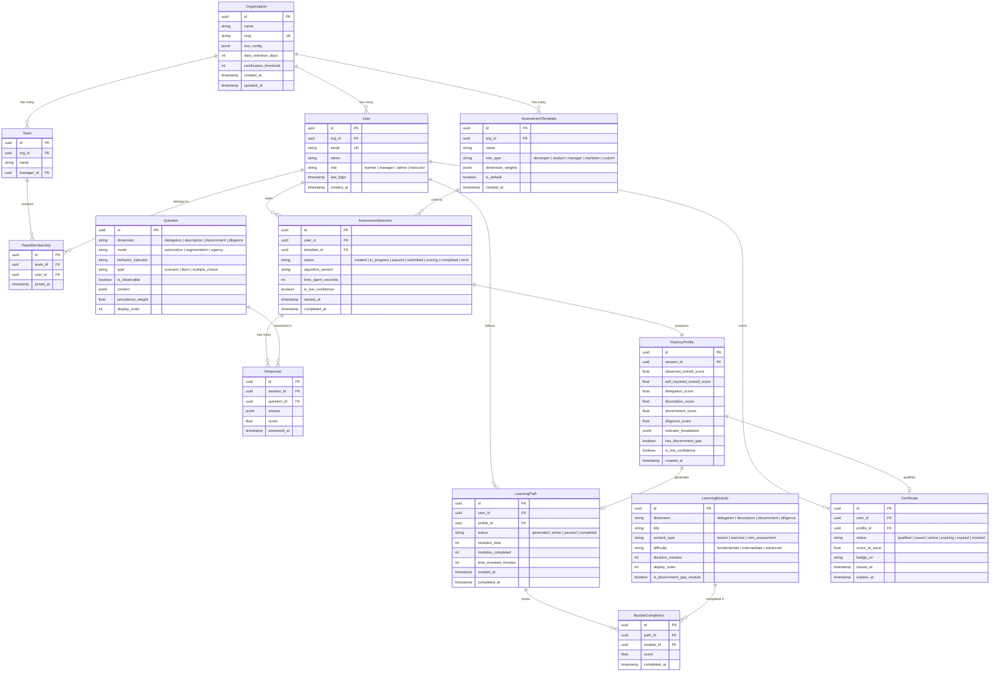
```mermaid
erDiagram
    Organization {
        uuid id PK
        string name
        string slug UK
        jsonb sso_config
        int data_retention_days
        int certification_threshold
        timestamp created_at
        timestamp updated_at
    }
    User {
        uuid id PK
        uuid org_id FK
        string email UK
        string name
        string role "learner | manager | admin | instructor"
        timestamp last_login
        timestamp created_at
    }
    Team {
        uuid id PK
        uuid org_id FK
        string name
        uuid manager_id FK
    }
    TeamMembership {
        uuid id PK
        uuid team_id FK
        uuid user_id FK
        timestamp joined_at
    }
    AssessmentTemplate {
        uuid id PK
        uuid org_id FK
        string name
        string role_type "developer | analyst | manager | marketer | custom"
        jsonb dimension_weights
        boolean is_default
        timestamp created_at
    }
    AssessmentSession {
        uuid id PK
        uuid user_id FK
        uuid template_id FK
        string status "created | in_progress | paused | submitted | scoring | completed | error"
        string algorithm_version
        int time_spent_seconds
        boolean is_low_confidence
        timestamp started_at
        timestamp completed_at
    }
    Question {
        uuid id PK
        string dimension "delegation | description | discernment | diligence"
        string mode "automation | augmentation | agency"
        string behavior_indicator
        string type "scenario | likert | multiple_choice"
        boolean is_observable
        jsonb content
        float prevalence_weight
        int display_order
    }
    Response {
        uuid id PK
        uuid session_id FK
        uuid question_id FK
        jsonb answer
        float score
        timestamp answered_at
    }
    FluencyProfile {
        uuid id PK
        uuid session_id FK
        float observed_overall_score
        float self_reported_overall_score
        float delegation_score
        float description_score
        float discernment_score
        float diligence_score
        jsonb indicator_breakdown
        boolean has_discernment_gap
        boolean is_low_confidence
        timestamp created_at
    }
    LearningPath {
        uuid id PK
        uuid user_id FK
        uuid profile_id FK
        string status "generated | active | paused | completed"
        int modules_total
        int modules_completed
        int time_invested_minutes
        timestamp created_at
        timestamp completed_at
    }
    LearningModule {
        uuid id PK
        string dimension "delegation | description | discernment | diligence"
        string title
        string content_type "lesson | exercise | mini_assessment"
        string difficulty "fundamentals | intermediate | advanced"
        int duration_minutes
        int display_order
        boolean is_discernment_gap_module
    }
    ModuleCompletion {
        uuid id PK
        uuid path_id FK
        uuid module_id FK
        float score
        timestamp completed_at
    }
    Certificate {
        uuid id PK
        uuid user_id FK
        uuid profile_id FK
        string status "qualified | issued | active | expiring | expired | revoked"
        float score_at_issue
        string badge_url
        timestamp issued_at
        timestamp expires_at
    }

    Organization ||--o{ User : "has many"
    Organization ||--o{ Team : "has many"
    Organization ||--o{ AssessmentTemplate : "has many"
    Team ||--o{ TeamMembership : "contains"
    User ||--o{ TeamMembership : "belongs to"
    User ||--o{ AssessmentSession : "takes"
    AssessmentTemplate ||--o{ AssessmentSession : "used by"
    AssessmentSession ||--o{ Response : "has many"
    Question ||--o{ Response : "answered in"
    AssessmentSession ||--|| FluencyProfile : "produces"
    User ||--o{ LearningPath : "follows"
    FluencyProfile ||--o| LearningPath : "generates"
    LearningPath ||--o{ ModuleCompletion : "tracks"
    LearningModule ||--o{ ModuleCompletion : "completed in"
    User ||--o{ Certificate : "earns"
    FluencyProfile ||--o| Certificate : "qualifies"
```

---

## 9. Functional Requirements

| ID | Requirement | Traces To | Priority |
|----|-------------|-----------|----------|
| FR-001 | System MUST present scenario-based assessment questions covering all 4 dimensions (Delegation, Description, Discernment, Diligence) with 8 questions per dimension (32 total) | US-01 | P0 |
| FR-002 | System MUST calculate dimension scores using prevalence-weighted scoring for 11 observable behaviors | US-03 | P0 |
| FR-003 | System MUST generate a fluency profile with Observed Fluency Score (0-100), Self-Reported Score (0-100), and per-dimension scores (0-100), displayed as separate sub-scores | US-02, CLARIFY-01 #3 | P0 |
| FR-004 | System MUST support save-and-resume for in-progress assessments | US-01 AC-4 | P0 |
| FR-005 | System MUST present self-report instruments for 13 unobservable behaviors with Likert-scale (1-5) responses | US-04 | P0 |
| FR-006 | System MUST display self-reported scores separately from observed-behavior scores with a clear "Self-Reported" label | US-04 AC-3, CLARIFY-01 #3 | P0 |
| FR-007 | System MUST generate personalized learning paths ordered by weakest dimension first | US-05 | P0 |
| FR-008 | System MUST track learning module completion and update progress in real-time (within 5 seconds) | US-06 | P0 |
| FR-009 | System MUST support role-specific assessment templates with configurable behavioral indicator weights for at least 4 roles | US-07 | P1 |
| FR-010 | System MUST display organizational aggregate fluency dashboards filterable by department, role, and dimension | US-09 | P1 |
| FR-011 | System MUST implement Discernment Gap detection flagging learners with Discernment < 50 AND key indicators failing | US-11 | P1 |
| FR-012 | System MUST provide assessment scenarios covering all three interaction modes (Automation, Augmentation, Agency) | US-13 | P1 |
| FR-013 | System MUST support SAML 2.0 and OIDC SSO configuration per organization | US-14 | P1 |
| FR-014 | System MUST support LTI 1.3 integration for LMS grade passback | US-15 | P1 |
| FR-015 | System MUST generate Open Badges v3 digital credentials on certification threshold achievement | US-16 | P2 |
| FR-016 | System MUST enforce multi-tenant data isolation via PostgreSQL Row Level Security | US-18 | P0 |
| FR-017 | System MUST support GDPR Article 17 data erasure requests with 30-day hard delete | US-21 | P1 |
| FR-018 | System MUST generate downloadable quarterly fluency reports in PDF format | US-20 | P1 |
| FR-019 | System MUST send reminder emails for inactive learners (7-day threshold) and certificate expiry (30-day advance) | US-06 AC-3, US-16 AC-2 | P1 |
| FR-020 | System MUST provide longitudinal fluency trend visualization for 3-12 month periods | US-19 | P1 |

---

## 10. Non-Functional Requirements

| ID | Category | Requirement | Traces To |
|----|----------|-------------|-----------|
| NFR-001 | Performance | Assessment question load time MUST be < 500ms (p95). Scoring calculation MUST complete in < 3 seconds (p95). | US-01 AC-1 |
| NFR-002 | Security | All data at rest MUST be encrypted (AES-256). All data in transit MUST use TLS 1.3. JWT with refresh token rotation for authentication. | US-18 |
| NFR-003 | Accessibility | Platform MUST meet WCAG 2.1 AA. All assessment interactions MUST be keyboard-navigable with screen reader support. | All |
| NFR-004 | Scalability | System MUST handle 10,000 concurrent assessment sessions with < 3s p95 response time. Database MUST support 1M+ assessment records. | All |
| NFR-005 | Reliability | Platform uptime MUST be >= 99.5%. Assessment data backed up every 6 hours with point-in-time recovery. | All |
| NFR-006 | Internationalization | UI MUST support English (default). Architecture MUST support future i18n via externalized strings. | All |
| NFR-007 | Multi-tenancy | Each organization's data MUST be isolated via PostgreSQL RLS. Cross-tenant data leakage MUST be impossible at the database level. | US-18 |
| NFR-008 | Compliance | System MUST support GDPR and CCPA data subject requests. Data retention MUST be configurable per organization. | US-21, US-22 |

---

## 11. Site Map

```mermaid
flowchart TD
    subgraph Public
        login["/login<br/>Email/Password + SSO"]
        signup["/signup<br/>Individual + Org signup"]
        landing["/landing<br/>Marketing page"]
    end

    subgraph Learner Dashboard
        dash["/dashboard<br/>Learner home"]
        assess_start["/assessments/new<br/>Start assessment"]
        assess_take["/assessments/:id<br/>Take assessment"]
        assess_results["/assessments/:id/results<br/>Fluency profile"]
        profile["/profile<br/>All assessments + history"]
        learn_path["/learning/:pathId<br/>Learning path"]
        learn_module["/learning/:pathId/modules/:id<br/>Module content"]
        certs["/certificates<br/>Earned certificates"]
        privacy["/settings/privacy<br/>Data management"]
    end

    subgraph Manager Dashboard
        mgr_dash["/manager<br/>Manager home"]
        mgr_team["/manager/team<br/>Team fluency overview"]
        mgr_discernment["/manager/discernment<br/>Discernment gap analysis"]
        mgr_templates["/manager/templates<br/>Role templates"]
        mgr_assign["/manager/assign<br/>Assign assessments"]
        mgr_reports["/manager/reports<br/>Quarterly reports"]
        mgr_trends["/manager/trends<br/>Longitudinal trends"]
    end

    subgraph Org Admin
        admin_dash["/admin<br/>Organization dashboard"]
        admin_users["/admin/users<br/>User management"]
        admin_teams["/admin/teams<br/>Team management"]
        admin_sso["/admin/sso<br/>SSO configuration"]
        admin_lms["/admin/lms<br/>LMS integration"]
        admin_data["/admin/data<br/>Data retention policies"]
        admin_certs["/admin/certificates<br/>Certification config"]
    end

    login --> dash
    login --> mgr_dash
    login --> admin_dash

    dash --> assess_start
    assess_start --> assess_take
    assess_take --> assess_results
    dash --> profile
    dash --> learn_path
    learn_path --> learn_module
    dash --> certs
    dash --> privacy

    mgr_dash --> mgr_team
    mgr_dash --> mgr_discernment
    mgr_dash --> mgr_templates
    mgr_dash --> mgr_assign
    mgr_dash --> mgr_reports
    mgr_dash --> mgr_trends

    admin_dash --> admin_users
    admin_dash --> admin_teams
    admin_dash --> admin_sso
    admin_dash --> admin_lms
    admin_dash --> admin_data
    admin_dash --> admin_certs
```

---

## 12. Phasing: MVP, Phase 2, Future

### Phase 1: MVP (P0 Stories — Target: Q3 2026)

| Epic | Stories | Capabilities |
|------|---------|-------------|
| Core Assessment (EP-01) | US-01, US-02, US-03, US-04 | 4D assessment with 32 questions, prevalence-weighted scoring, separate observed + self-reported scores, fluency profile with radar chart |
| Learning & Growth (EP-02) | US-05, US-06 | Personalized learning paths (weakest dimension first), progress tracking, reminder emails |
| Multi-Tenant Security (EP-03) | US-18 | PostgreSQL RLS, tenant isolation, org provisioning |

**MVP Deliverables**: Working assessment engine, fluency profiles, learning paths, multi-tenant backend, responsive web UI.

### Phase 2: Enterprise & Analytics (P1 Stories — Target: Q4 2026)

| Epic | Stories | Capabilities |
|------|---------|-------------|
| Role-Specific Assessment (EP-04) | US-07, US-08 | 4+ role templates, custom templates, role-contextualized scenarios |
| Organizational Analytics (EP-05) | US-09, US-10 | Org dashboard, team fluency trends, aggregate filtering |
| Discernment Gap (EP-06) | US-11, US-12 | Targeted discernment training module, gap tracking for managers |
| Interaction Modes (EP-07) | US-13 | Automation/Augmentation/Agency scenario coverage |
| Enterprise Integration (EP-08) | US-14, US-15 | SAML/OIDC SSO, LTI 1.3 LMS integration |
| Longitudinal Analytics (EP-09) | US-19, US-20 | Multi-month trends, quarterly PDF reports |
| Data Privacy (EP-10) | US-21, US-22 | GDPR erasure, configurable retention |

### Phase 3: Future (P2 + Beyond)

| Feature | Stories | Timeline |
|---------|---------|----------|
| Digital Badges & Certification | US-16, US-17 | Q1 2027 |
| AI-Powered Assessment Generation | (new) | Q1 2027 |
| Mobile Native Apps | (new) | Q2 2027 |
| Payment / Billing (Stripe) | (new) | Q2 2027 |
| White-Labeling | (new) | Q3 2027 |
| Multi-Language Content | (new) | Q3 2027 |
| Advanced Psychometrics (IRT) | (new) | Q4 2027 |

### Phasing Visualization

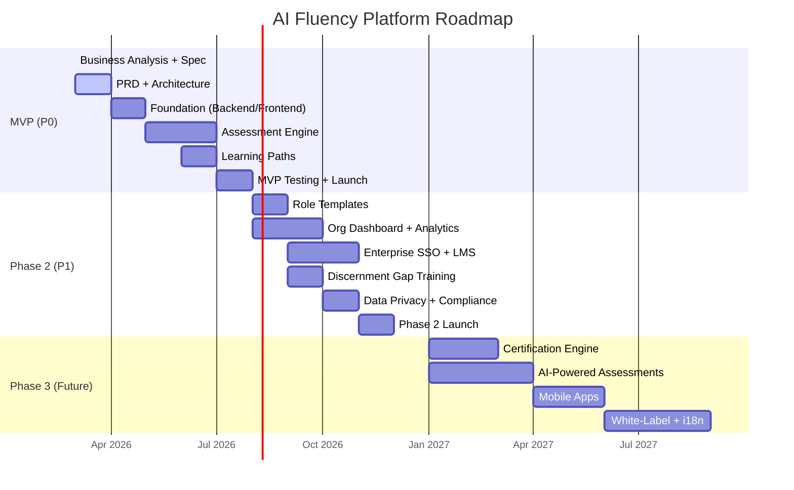
```mermaid
gantt
    title AI Fluency Platform Roadmap
    dateFormat  YYYY-MM
    axisFormat  %b %Y

    section MVP (P0)
    Business Analysis + Spec    :done, ba, 2026-03, 2026-03
    PRD + Architecture          :active, prd, 2026-03, 2026-04
    Foundation (Backend/Frontend):found, 2026-04, 2026-05
    Assessment Engine           :assess, 2026-05, 2026-07
    Learning Paths              :learn, 2026-06, 2026-07
    MVP Testing + Launch        :mvp, 2026-07, 2026-08

    section Phase 2 (P1)
    Role Templates              :role, 2026-08, 2026-09
    Org Dashboard + Analytics   :dash, 2026-08, 2026-10
    Enterprise SSO + LMS        :ent, 2026-09, 2026-11
    Discernment Gap Training    :disc, 2026-09, 2026-10
    Data Privacy + Compliance   :priv, 2026-10, 2026-11
    Phase 2 Launch              :p2, 2026-11, 2026-12

    section Phase 3 (Future)
    Certification Engine        :cert, 2027-01, 2027-03
    AI-Powered Assessments      :ai, 2027-01, 2027-04
    Mobile Apps                 :mob, 2027-04, 2027-06
    White-Label + i18n          :wl, 2027-06, 2027-09
```

---

## 13. Success Metrics

| # | Metric | Target (12 months post-GA) | Measurement |
|---|--------|---------------------------|-------------|
| SC-001 | Assessment completion rate | >= 75% (started-to-completed) | Assessment session analytics |
| SC-002 | Time to first assessment | <= 15 minutes from signup | Event analytics timestamp delta |
| SC-003 | Scoring latency (p95) | <= 3 seconds | API performance monitoring |
| SC-004 | Registered organizations | >= 50 (20 paying) | Database count |
| SC-005 | Active learners | >= 5,000 | Monthly active users with assessment activity |
| SC-006 | Average fluency improvement | >= 15% after learning path | Pre/post assessment score comparison |
| SC-007 | NPS score | >= 40 | In-app survey at 30-day mark |
| SC-008 | Platform uptime | >= 99.5% | Infrastructure monitoring |
| SC-009 | ARR | $500K (20 enterprise at ~$25K) | Billing system |
| SC-010 | Learner return rate | >= 50% take 2nd assessment | User analytics |

---

## 14. Out of Scope

- **AI-powered assessment generation** (using Claude API to generate questions dynamically) — Phase 3
- **Mobile native apps** (iOS/Android) — web-responsive only for MVP
- **Real-time proctoring** — not needed for self-paced learning
- **Third-party content marketplace** — only ConnectSW-authored modules
- **Advanced psychometric validation** (IRT, Rasch modeling) — post-MVP validity study
- **White-labeling** — ConnectSW branding in MVP; Phase 3
- **Payment/billing integration** — manual / external billing; Stripe in Phase 2
- **Multi-language content** — English only; i18n architecture prepared but not populated

---

## 15. Risks and Mitigations

| ID | Risk | Prob | Impact | Score | Mitigation |
|----|------|------|--------|-------|-----------|
| RSK-001 | CC BY-NC-SA 4.0 licensing blocks commercial use | Low | High | 6 | Proceed assuming OK (CEO decision). Our questions are original work. Seek formal Anthropic clarification in parallel. Prepare fallback framework if needed. |
| RSK-002 | Enterprise sales cycles exceed 9 months | Medium | High | 8 | Free pilot programs (3-month); target mid-market (faster procurement); self-serve freemium tier |
| RSK-003 | Scoring does not correlate with real-world AI fluency | Medium | High | 8 | Validity study with 100+ users before GA; partner with Anthropic for validation; publish methodology |
| RSK-004 | Rapid AI evolution renders assessments obsolete | Medium | Medium | 6 | Modular content system; quarterly content refresh; versioned scoring algorithms |
| RSK-005 | Competitor builds 4D assessment within 12 months | Low | Medium | 4 | Accelerate MVP; build data moat (longitudinal scores); Anthropic partnership |
| RSK-006 | Assessment content creation delays MVP | Medium | Medium | 6 | Start with 11 observable indicators; engage external content designers; use published examples as seeds |
| RSK-007 | SOC 2 timeline blocks enterprise deals | Medium | Medium | 6 | Begin SOC 2 readiness Day 1; pursue Type I first (faster interim) |
| RSK-008 | Multi-tenant data isolation breach | Low | Critical | 7 | PostgreSQL RLS; automated security testing; penetration testing before GA |
| RSK-009 | LMS integration complexity causes delays | Medium | Medium | 6 | Prioritize top 3 LMS (Canvas, Moodle, Blackboard); use established LTI libraries |
| RSK-010 | Low completion rate due to assessment length | Medium | High | 8 | 32 questions / ~25 min (CEO-approved); save-and-resume; progress indicators; A/B test variants |

---

## Resolved Clarifications (CLARIFY-01)

| # | Question | Resolution | Decided By | Date |
|---|----------|-----------|------------|------|
| 1 | Anthropic CC BY-NC-SA 4.0 licensing for commercial use | **Proceed assuming commercial OK.** Our assessment questions are original work. Seek formal clarification in parallel. | CEO | 2026-03-02 |
| 2 | Minimum viable question count per dimension | **8 questions per dimension (32 total, ~25 minutes).** Balances reliability and completion rate. | CEO | 2026-03-02 |
| 3 | Self-report vs. observed score display | **Separate sub-scores.** Display "Observed Fluency Score" and "Self-Reported Fluency Score" independently. More transparent, scientifically defensible. | CEO | 2026-03-02 |

---

## Component Reuse from ConnectSW Registry

| Need | Component | Package | Action |
|------|-----------|---------|--------|
| Auth (JWT, signup, login, refresh) | Auth Plugin + Routes | `@connectsw/auth/backend` | Reuse |
| Frontend auth (useAuth, ProtectedRoute) | Auth Frontend | `@connectsw/auth/frontend` | Reuse |
| Structured logging | Logger | `@connectsw/shared/utils/logger` | Reuse |
| Password hashing, API key HMAC | Crypto Utils | `@connectsw/shared/utils/crypto` | Reuse |
| Prisma lifecycle management | Prisma Plugin | `@connectsw/shared/plugins/prisma` | Reuse |
| Redis session/cache | Redis Plugin | `@connectsw/shared/plugins/redis` | Reuse |
| UI components | Button, Input, Card, Table | `@connectsw/ui` | Reuse |
| Assessment engine | None | N/A | Build new |
| Scoring engine | None | N/A | Build new |
| Learning path engine | None | N/A | Build new |
| Multi-tenant RLS | None | N/A | Build new (add to registry) |
| PDF report generation | None | N/A | Build new (add to registry) |
| LTI 1.3 integration | None | N/A | Build new (add to registry) |

---

*This PRD is ready for CEO review. Approved sections will proceed to Architecture Design (ARCH-01).*
