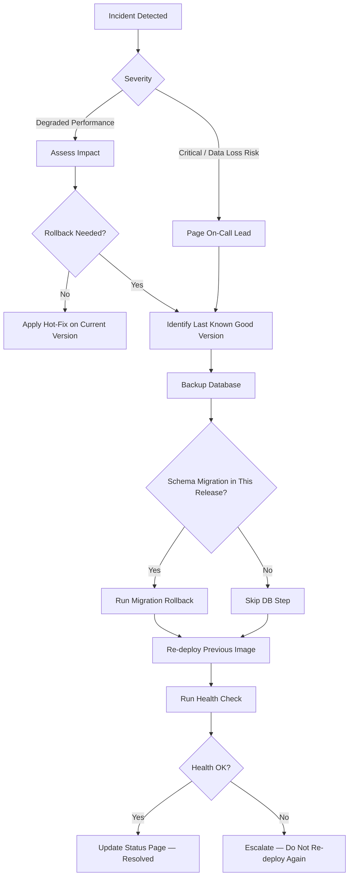

# AI Fluency — Rollback Runbook

**Product**: AI Fluency Platform
**API Port**: 5014
**Web Port**: 3118
**Last updated**: 2026-03-03

---

## Overview



---

## 1. Identify the Current Deployment Version

### Option A — Docker image tag (Render / Railway / GCP Cloud Run)

```bash
# On the platform dashboard, note the current image digest or tag.
# For Render: Services > ai-fluency-api > Deploys > Current deploy SHA
# The image tag follows the pattern: ghcr.io/connectsw/ai-fluency-api:<git-sha>
```

### Option B — Git log

```bash
# The deployed commit is recorded in the platform's deploy log.
# Locally, find the last release tag:
git tag --sort=-version:refname | grep 'ai-fluency' | head -5
# Example output: ai-fluency/v0.3.1  ai-fluency/v0.3.0  ai-fluency/v0.2.5
```

### Option C — Health endpoint

The API exposes the running version at startup via the health endpoint:

```bash
curl -s https://api.aifluency.example.com/health | jq .
# Response:
# {
#   "status": "healthy",
#   "version": "0.3.1",
#   "commit": "abc1234",
#   "timestamp": "2026-03-03T12:00:00.000Z"
# }
```

---

## 2. Rollback Steps

### Step 1 — Determine the rollback target

```bash
# List the last 10 deployment commits (GitHub Actions deploy history):
gh run list --workflow=ai-fluency-ci.yml --limit 10 --status success
```

Note the `HEAD SHA` from the last successful deploy before the bad release.

### Step 2 — Backup the current database (MANDATORY before any DB change)

```bash
# Run from a machine with DATABASE_URL set:
pg_dump "$DATABASE_URL" \
  --format=custom \
  --file="ai_fluency_backup_$(date +%Y%m%d_%H%M%S).dump"

# Verify the backup:
pg_restore --list ai_fluency_backup_*.dump | head -20
```

Store the backup in a safe location (S3, Google Cloud Storage) before proceeding.

### Step 3 — Re-deploy the previous image

#### Render (recommended for MVP)

```bash
# Trigger a re-deploy of a previous image via Render deploy hook:
# 1. Go to Render Dashboard > ai-fluency-api > Deploys
# 2. Find the last known-good deploy
# 3. Click "Rollback to this deploy"
```

#### Manual trigger via GitHub Actions

```bash
# Re-run the deployment workflow targeting the previous SHA:
gh workflow run deploy-production.yml \
  --field version=<previous-git-sha>
```

#### Docker (self-hosted)

```bash
# Pull and run the previous image tag:
docker pull ghcr.io/connectsw/ai-fluency-api:<previous-sha>
docker pull ghcr.io/connectsw/ai-fluency-web:<previous-sha>

# Update compose to use pinned tags, then:
docker compose up -d api web
```

### Step 4 — Database migration rollback (only if this release had migrations)

Prisma does not support automatic down-migrations. Follow this procedure:

```bash
# 1. Check migration history to identify what was applied:
npx prisma migrate status

# 2. If the migration is reversible (no column drops, no destructive changes):
#    Manually write and apply a reverse migration:
npx prisma migrate dev --name rollback_v0_3_1

# 3. If the migration is NOT reversible (column drops, type changes):
#    Restore from backup taken in Step 2:
pg_restore \
  --clean \
  --if-exists \
  --dbname "$DATABASE_URL" \
  ai_fluency_backup_YYYYMMDD_HHMMSS.dump
```

**Prevention**: All migrations must be reviewed for reversibility before merge.
Additive-only migrations (add column, add table, add index) are safe to rollback by re-deploying without running the new migration.
Destructive migrations (drop column, rename column, change type) require a backup restore.

---

## 3. Health Check Verification After Rollback

Run all health checks before closing the incident:

```bash
# 1. API health endpoint
curl -sf https://api.aifluency.example.com/health
# Expected: {"status":"healthy", ...}

# 2. Database connectivity (checked via health endpoint above)

# 3. Redis connectivity (checked via health endpoint above)

# 4. Critical user flow — registration smoke test
curl -sf -X POST https://api.aifluency.example.com/v1/auth/register \
  -H "Content-Type: application/json" \
  -d '{"email":"smoke-test@example.com","password":"SmokeTest123!","orgId":"..."}' \
  | jq .status

# 5. Web app loads
curl -sf https://aifluency.example.com/ -o /dev/null -w "%{http_code}"
# Expected: 200
```

All five checks must return expected results before declaring the rollback successful.

---

## 4. Escalation Contacts

| Role | Contact | When to Escalate |
|------|---------|------------------|
| On-Call Engineer | Configured in PagerDuty | Any P1 incident or failed rollback |
| Engineering Lead | Slack #ai-fluency-team | If rollback attempt fails once |
| Database Admin | Slack #infrastructure | For database restore operations |
| CEO / Stakeholders | Slack #leadership | If customer data is at risk |

**Incident severity guide:**

| Severity | Definition | SLA |
|----------|-----------|-----|
| P1 — Critical | Data loss risk, auth broken, >50% users affected | Rollback within 30 min |
| P2 — High | Core feature broken for >20% users | Rollback within 2 hours |
| P3 — Medium | Feature degraded, workaround available | Fix in next deploy |
| P4 — Low | Cosmetic, <5% users affected | Fix in next sprint |

---

## 5. Post-Rollback Actions

After a successful rollback:

1. Create a GitHub issue documenting the incident root cause.
2. Add a regression test that catches the bug before merge.
3. Update `docs/ADRs/` if an architecture decision contributed to the issue.
4. Run a post-mortem within 48 hours (blameless, timeline + action items).
5. Update this runbook if any step was unclear or missing.
