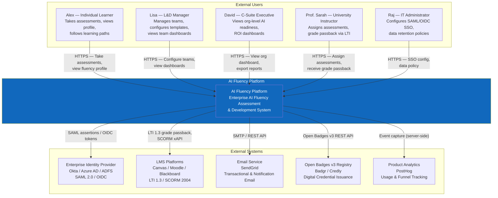
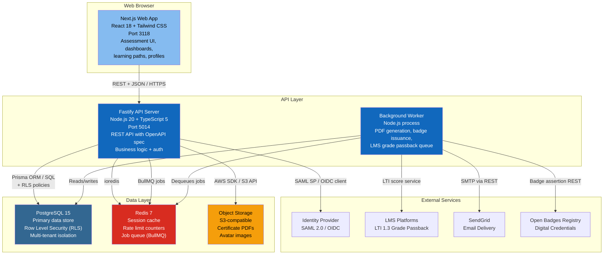
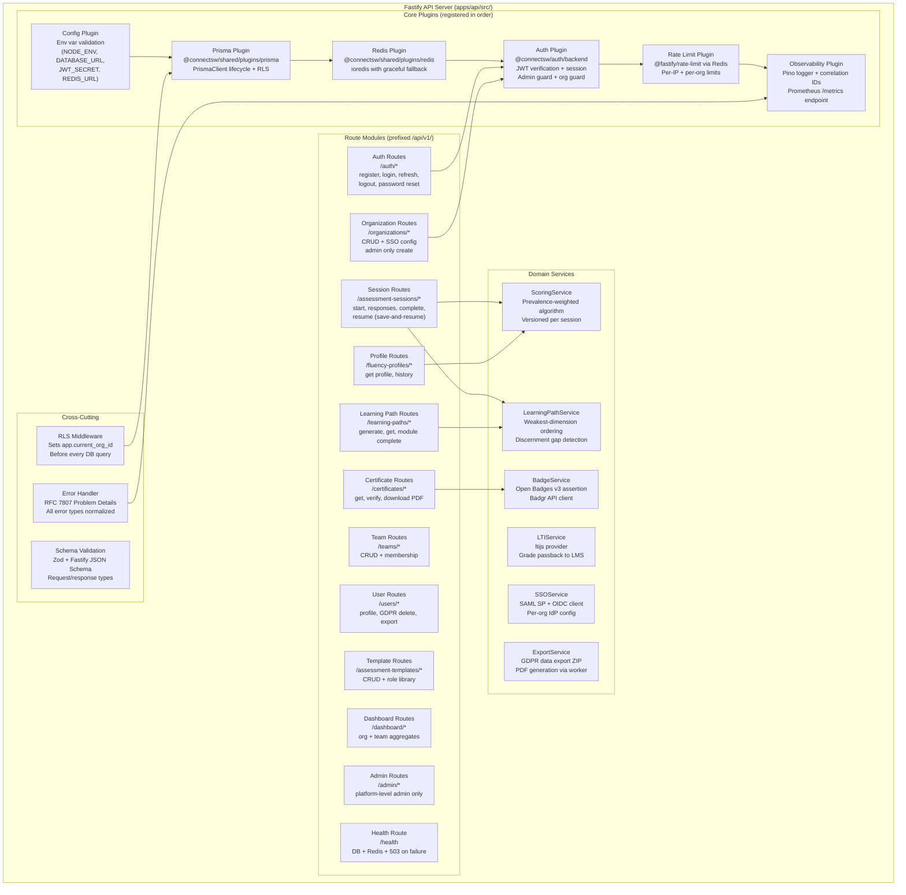
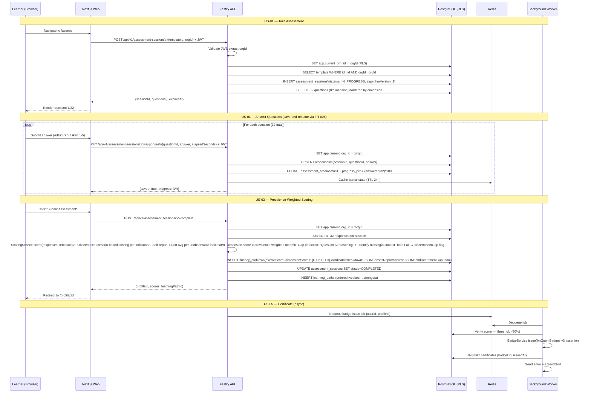
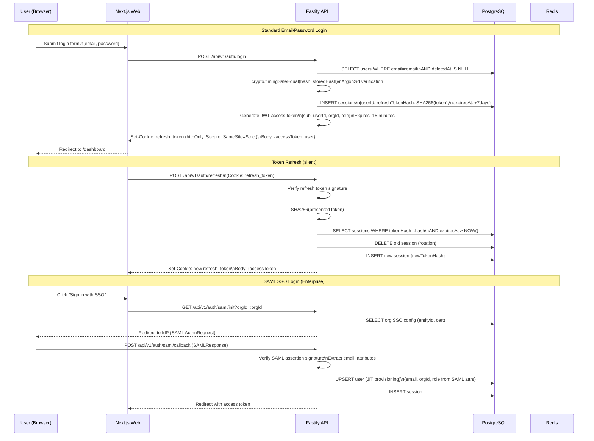
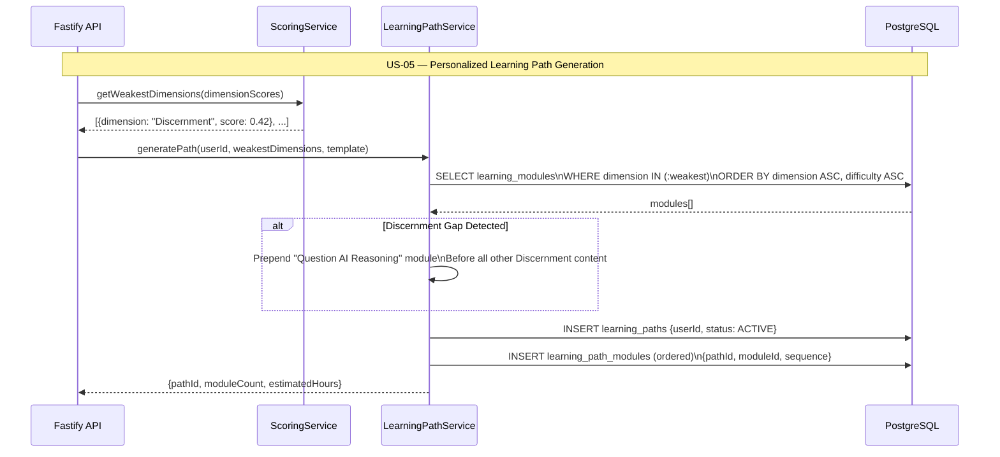
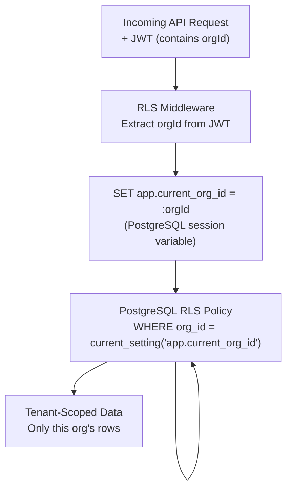

# AI Fluency Platform — System Architecture

**Product**: ai-fluency
**Version**: 1.0.0
**Author**: Architect Agent
**Date**: 2026-03-03
**Ports**: Frontend 3118, Backend API 5014

---

## Table of Contents

1. [C4 Level 1 — System Context](#c4-level-1--system-context)
2. [C4 Level 2 — Container Diagram](#c4-level-2--container-diagram)
3. [C4 Level 3 — API Component Diagram](#c4-level-3--api-component-diagram)
4. [Assessment Flow — Sequence Diagram](#assessment-flow--sequence-diagram)
5. [Auth Flow — Sequence Diagram](#auth-flow--sequence-diagram)
6. [Learning Path Generation — Sequence Diagram](#learning-path-generation--sequence-diagram)
7. [Traceability Matrix](#traceability-matrix)
8. [Multi-Tenancy Architecture](#multi-tenancy-architecture)
9. [Security Architecture](#security-architecture)
10. [Technology Decisions](#technology-decisions)
11. [Scalability Considerations](#scalability-considerations)

---

## C4 Level 1 — System Context

This diagram shows the AI Fluency Platform in its environment: who uses it, and what external systems it depends on.



---

## C4 Level 2 — Container Diagram

This diagram shows the high-level technical components (containers) that make up the AI Fluency Platform and how they communicate.



---

## C4 Level 3 — API Component Diagram

This diagram shows the internal structure of the Fastify API server — its plugins, services, and route modules.



---

## Assessment Flow — Sequence Diagram

End-to-end flow from starting an assessment through scoring and learning path generation.



---

## Auth Flow — Sequence Diagram

JWT + refresh token rotation with RLS session setup.



---

## Learning Path Generation — Sequence Diagram



---

## Traceability Matrix

| User Story | Functional Req | API Endpoint | DB Table(s) |
|------------|---------------|-------------|-------------|
| US-01 (Take Assessment) | FR-001 (4D questions) | POST /api/v1/assessment-sessions | assessment_sessions, questions |
| US-01 (Save-and-resume) | FR-004 (Save-and-resume) | PUT /api/v1/assessment-sessions/:id/responses | responses |
| US-02 (View Fluency Profile) | FR-003 (Profile) | GET /api/v1/fluency-profiles/:id | fluency_profiles |
| US-03 (Prevalence-Weighted Scoring) | FR-002 (Scoring) | POST /api/v1/assessment-sessions/:id/complete | fluency_profiles |
| US-04 (Self-Report) | FR-005 (13 unobservable) | PUT /api/v1/assessment-sessions/:id/responses | responses |
| US-04 (Self-Report Display) | FR-006 (Separate display) | GET /api/v1/fluency-profiles/:id | fluency_profiles.self_report_scores |
| US-05 (Learning Path) | FR-007 (Personalized paths) | POST /api/v1/learning-paths | learning_paths, learning_path_modules |
| US-06 (Track Progress) | FR-007 (Progress) | PUT /api/v1/learning-paths/:id/modules/:mid/complete | module_completions |
| US-18 (Multi-Tenant Isolation) | FR-016 (RLS) | All endpoints with orgId | All tenant-scoped tables (RLS) |
| — | FR-003 (Discernment Gap) | POST /api/v1/assessment-sessions/:id/complete | fluency_profiles.discernment_gap |
| — | — | GET /api/v1/organizations/:id/dashboard | (aggregation) |
| — | — | GET /api/v1/teams/:id/dashboard | (aggregation) |
| — | — | DELETE /api/v1/users/me | users (soft delete + GDPR) |
| — | — | GET /api/v1/users/me/export | All user tables (GDPR export) |
| — | — | GET /health | N/A (health check) |

---

## Multi-Tenancy Architecture

### Decision: PostgreSQL Row Level Security (RLS)

Multi-tenancy is enforced at the **database layer** using PostgreSQL Row Level Security policies. This makes tenant isolation impossible to bypass — even a Prisma query without a WHERE clause cannot return cross-tenant data.

**Architecture approach:**



**RLS Policy example (applied to every tenant-scoped table):**

```sql
-- Enable RLS on table
ALTER TABLE assessment_sessions ENABLE ROW LEVEL SECURITY;

-- Policy: users can only see their own org's sessions
CREATE POLICY org_isolation ON assessment_sessions
  USING (org_id = current_setting('app.current_org_id')::uuid);

-- Service role bypasses RLS (for admin + migrations)
ALTER ROLE api_service BYPASSRLS;
CREATE ROLE api_service_rls NOINHERIT;
-- Application uses api_service_rls (RLS enforced)
-- Migrations use api_service (RLS bypassed)
```

**Implementation in Fastify:**
- Prisma plugin wraps every query in `SET LOCAL app.current_org_id = :orgId`
- Auth plugin decodes JWT and sets `request.orgId`
- RLS middleware hook runs `onRequest` before every route handler

**Tables with RLS:** users, teams, assessment_sessions, assessment_templates, responses, fluency_profiles, learning_paths, learning_path_modules, module_completions, certificates, sso_configs

**Tables without RLS (global):** organizations (org-level admin only), questions, learning_modules, algorithm_versions

---

## Security Architecture

### Authentication

| Mechanism | Token | Storage | Expiry | Use Case |
|-----------|-------|---------|--------|----------|
| JWT Access Token | RS256 signed | In-memory (TokenManager) | 15 min | API requests |
| Refresh Token | Opaque | httpOnly Secure cookie | 7 days | Token refresh |
| Refresh Token Hash | SHA-256 | PostgreSQL sessions table | 7 days | DB lookup |
| SAML Assertion | — | Not stored | Single use | SSO login |
| OIDC ID Token | — | Not stored | Single use | SSO login |

### Security Controls

- **BOLA (API1)**: Every endpoint includes `orgId` ownership check via RLS — impossible to access cross-org data
- **Broken Auth (API2)**: Rate limiting on `/auth/*` (5 req/min per IP), account lockout after 10 failures (15-min lockout), token rotation on every refresh
- **Resource Consumption (API4)**: All list endpoints paginated (max 100), file uploads size-limited, assessment sessions rate-limited per user
- **BFLA (API5)**: RBAC roles enforced via JWT `role` claim: `LEARNER`, `MANAGER`, `ADMIN`, `SUPER_ADMIN`. Admin endpoints require `ADMIN` role minimum.
- **Sensitive data**: Refresh tokens stored as SHA-256 hashes. Passwords hashed with Argon2id (memory: 64MB, iterations: 3, parallelism: 1).
- **Encryption**: AES-256-GCM for SSO configuration secrets at rest. TLS 1.3 in transit.
- **GDPR**: `DELETE /api/v1/users/me` triggers 30-day soft delete, then hard delete by worker. `GET /api/v1/users/me/export` returns ZIP of all user data.
- **Audit trail**: All `UPDATE`/`DELETE` operations on sensitive entities written to `audit_logs` table with `actor_id`, `action`, `before`/`after` JSONB.
- **Privacy**: PII fields (email, name) excluded from log output via PII redaction in Logger.
- **CORS**: Allowlist-based. Only the registered web app origin.
- **CSP**: Strict CSP headers from Next.js middleware. No `unsafe-inline`.
- **Session management**: `GET /api/v1/auth/sessions` lists all active sessions. `DELETE /api/v1/auth/sessions/:id` revokes specific session.

---

## Technology Decisions

### Backend

| Decision | Choice | Rationale |
|----------|--------|-----------|
| Framework | Fastify 4 | 2x faster than Express, plugin ecosystem, TypeScript-first |
| ORM | Prisma 5 | Type-safe queries, migrations, RLS via `$executeRaw` |
| Auth | @connectsw/auth/backend | Reuse proven JWT+session pattern across ConnectSW |
| LTI 1.3 | ltijs 5.9.9 | Modern LTI 1.3/1.1 library, MIT license, active maintenance, grade passback support |
| Queue | BullMQ + Redis | Reliable job queuing for PDF/badge/LTI async work |
| Scoring | Custom (ScoringService) | No open-source implementation of 4D prevalence-weighted algorithm exists |
| Validation | Zod | Runtime validation + TypeScript inference |
| Logging | Pino (via @connectsw/shared/utils/logger) | Structured JSON, PII redaction, correlation IDs |

### Frontend

| Decision | Choice | Rationale |
|----------|--------|-----------|
| Framework | Next.js 14 (App Router) | SSR for SEO + initial load speed; needed for dashboard and public cert verification |
| Styling | Tailwind CSS 3 | Consistent with ConnectSW standard |
| Components | @connectsw/ui + shadcn/ui | Reuse Button, Card, DataTable, Sidebar, DashboardLayout |
| Charts | Recharts 2 | React-native, SSR-compatible, accessible, MIT license. Radar chart for 4D profile, LineChart for progress |
| State | TanStack Query (React Query) | Server state management for assessment sessions, caching |
| Auth | @connectsw/auth/frontend | useAuth hook, ProtectedRoute, TokenManager |
| Form | React Hook Form + Zod | Type-safe form validation for assessment responses |

### Infrastructure

| Decision | Choice | Rationale |
|----------|--------|-----------|
| Database | PostgreSQL 15 | ACID, RLS support, JSONB for indicator breakdown |
| Cache / Queue | Redis 7 | Rate limiting (BullMQ jobs, session cache) |
| Storage | S3-compatible | Certificate PDFs, avatar images |
| Email | SendGrid | Reliability, template management |
| Credentials | Open Badges v3 via Badgr | Industry standard digital credentials |

---

## Scalability Considerations

**NFR-004: 10,000 concurrent sessions, 1M+ assessment records**

- **Connection pooling**: PgBouncer in transaction mode between API and PostgreSQL. Pool size: 20 connections per API instance.
- **Read replicas**: Assessment dashboard aggregate queries routed to read replica via Prisma datasource URL env var override.
- **Redis cluster**: BullMQ job queue partitioned by queue type (scoring, pdf, badge, lti).
- **Horizontal scaling**: API is stateless (JWT auth, Redis for rate limits). Add instances behind load balancer.
- **BRIN indexes**: On `created_at` timestamp columns for time-range queries on large tables (responses, audit_logs).
- **Partial indexes**: `WHERE status = 'IN_PROGRESS'` on assessment_sessions for resume lookup.
- **Algorithm versioning**: `algorithm_version` field on sessions allows scoring algorithm upgrades without invalidating historical scores.
- **Assessment caching**: Redis caches active session question order (TTL 24h) to avoid DB read on each answer.

**NFR-001: <500ms question load (p95), <3s scoring (p95)**

- Questions served from Redis cache after first load.
- Scoring computation is O(n) on 32 answers — no external calls, pure algorithmic.
- Database write on completion is a single transaction (INSERT profile + UPDATE session + INSERT learning_path).
