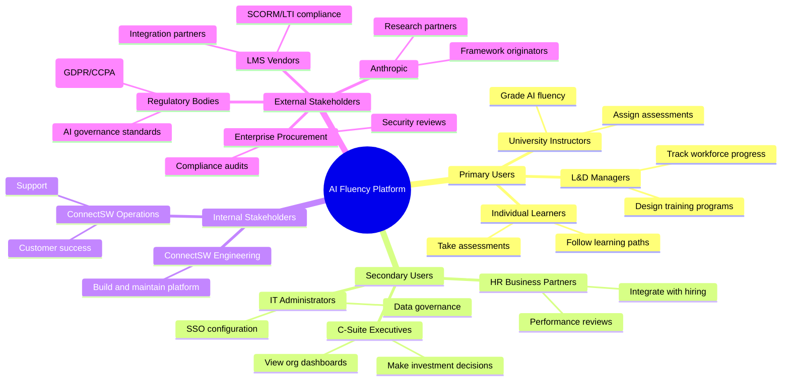
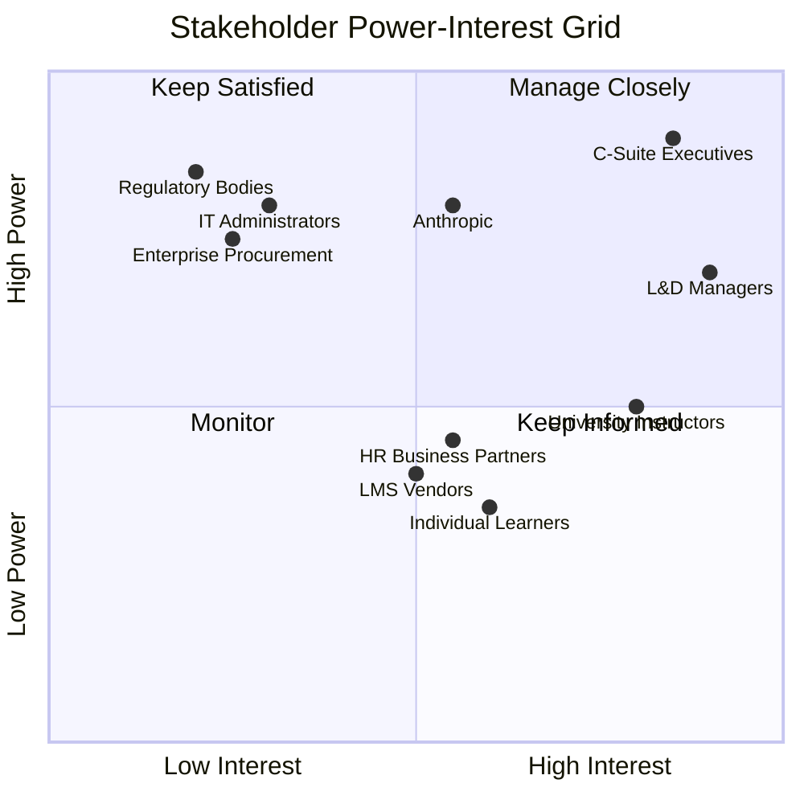
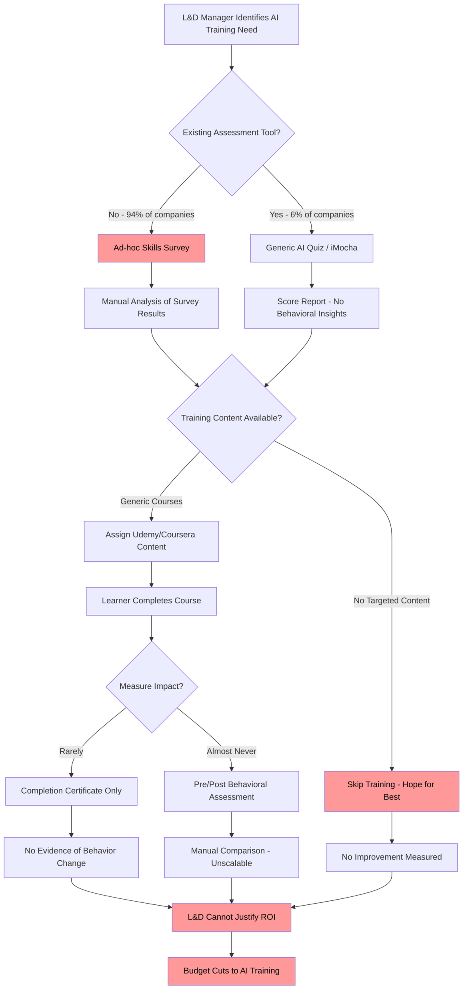
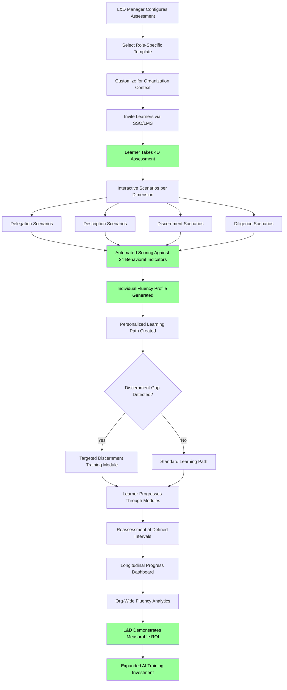
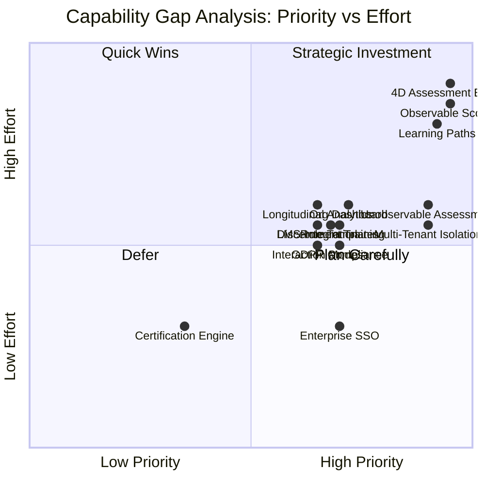

# Business Analysis Report: AI Fluency

## 1. Executive Summary

The AI Fluency platform addresses a critical and rapidly growing market need: assessing and developing organizational AI competency using Anthropic's empirically-validated 4D AI Fluency Framework (Delegation, Description, Discernment, Diligence). With AI skills commanding a 56% wage premium (PwC), only 6% of companies having started AI upskilling, and 42% of workers expecting role changes due to AI, the gap between demand and readiness is enormous. The AI training market is growing at 44% YoY toward a projected $2.52T, with skills shelf life averaging only 2 years for AI tools.

This report recommends a GO decision for the AI Fluency product. The platform differentiates from existing competitors (iMocha, DataCamp, Udemy Business) by being the first to implement Anthropic's research-backed 4D assessment framework with its 24 behavioral indicators. The product targets enterprise workforce development teams and educational institutions, delivering interactive assessments that measure observable and unobservable AI fluency behaviors, personalized learning paths per dimension, role-specific assessments, and organizational dashboards. The CC BY-NC-SA 4.0 licensing of the framework enables commercial assessment tooling while requiring attribution and share-alike for derived educational materials.

Technical feasibility is high given alignment with ConnectSW's default stack (Next.js, Fastify, PostgreSQL). Market feasibility is high given the massive supply-demand gap and absence of framework-specific tooling. The primary risks are framework licensing interpretation for commercial use, rapid evolution of AI tools reducing assessment relevance, and enterprise sales cycle length. Recommended MVP launch targets Q3 2026 with enterprise pilot programs.

## 2. Business Context

### 2.1 Problem Statement

**Problem**: Organizations lack a standardized, empirically-validated method to assess and develop their workforce's AI fluency. Current approaches to AI training are fragmented, subjective, and disconnected from measurable behavioral outcomes.

**Who experiences it**: Chief Learning Officers, HR/L&D teams, university administrators, and department managers responsible for workforce readiness. Secondary sufferers include individual contributors who lack structured guidance on effective AI interaction.

**Quantified impact**:
- 94% of companies have NOT started AI upskilling programs (PwC)
- Workers with AI skills earn 56% more than those without (PwC wage premium data)
- AI skill relevance degrades every ~2 years, requiring continuous reassessment
- Organizations without AI fluency programs risk losing competitive advantage as AI adoption accelerates across every sector

**Cost of inaction**: Organizations that delay AI fluency development face compounding workforce capability gaps. With 42% of workers expecting AI-driven role changes, the cost of an unprepared workforce includes reduced productivity, talent attrition to AI-fluent competitors, and missed opportunities from underutilized AI tooling.

### 2.2 Market Landscape

**Market Size**: The global AI training and upskilling market is valued at approximately $2.52 trillion and growing at 44% YoY. The enterprise skills assessment sub-segment (assessments + training platforms) is estimated at $15-20 billion.

**Growth Trends**:
- Enterprise AI adoption accelerating across all sectors
- Shift from "AI awareness" to "AI fluency" as a workforce KPI
- Increasing regulatory and compliance requirements around AI use (EU AI Act, corporate governance)
- Remote work driving demand for digital assessment tools

**Key Players**: iMocha (skill assessment), DataCamp (data/AI literacy), Degreed (skills-based learning), Udemy Business (enterprise upskilling), Anthropic Academy (free foundational courses)

**Disruption Opportunity**: No existing platform implements a peer-reviewed, empirically-validated AI fluency framework with behavioral indicators derived from analysis of 9,830+ real conversations. This is a blue-ocean positioning opportunity as the first purpose-built assessment tool for the 4D framework.

### 2.3 Target Segments

**Primary Segments**:

| Segment | Description | Estimated Size | Willingness to Pay |
|---------|-------------|---------------|-------------------|
| Enterprise L&D | Fortune 5000 companies with 500+ employees needing AI upskilling | ~5,000 organizations | $50-200K/year |
| Higher Education | Universities and colleges integrating AI fluency into curricula | ~4,000 institutions (US/EU) | $10-50K/year |

**Secondary Segments**:

| Segment | Description | Estimated Size | Willingness to Pay |
|---------|-------------|---------------|-------------------|
| Government/Public Sector | Federal, state, and local agencies modernizing with AI | ~2,000 agencies | $25-100K/year |
| Professional Development | Individual professionals seeking AI fluency certification | ~50M knowledge workers globally | $50-500/individual |
| Consulting Firms | Firms delivering AI transformation services needing assessment tools | ~1,000 firms | $20-80K/year |

## 3. Stakeholder Analysis

### 3.1 Stakeholder Map

### 3.2 Stakeholder Register

| Stakeholder | Role | Interest Level | Influence Level | Key Needs | Communication Cadence |
|-------------|------|---------------|----------------|-----------|----------------------|
| L&D Managers | Primary User | High | High | Measurable ROI on training spend, role-specific assessments, progress tracking | Weekly product updates |
| Individual Learners | Primary User | Medium | Medium | Clear feedback, actionable learning paths, minimal time commitment | In-app notifications |
| University Instructors | Primary User | High | Medium | LMS integration, gradebook export, curriculum alignment | Monthly feature updates |
| C-Suite Executives | Decision Maker | High | High | Org-wide dashboards, benchmarking data, ROI metrics | Quarterly business reviews |
| HR Business Partners | Secondary User | Medium | Medium | Integration with HRIS, competency mapping, hiring assessments | Monthly updates |
| IT Administrators | Gatekeeper | Low | High | SOC 2 compliance, SSO/SAML, data residency controls | As-needed security reviews |
| Anthropic | Framework Partner | Medium | High | Proper attribution, research collaboration, framework accuracy | Quarterly alignment |
| LMS Vendors | Integration Partner | Medium | Medium | SCORM/LTI compliance, clean API documentation | Per-integration basis |
| Enterprise Procurement | Gatekeeper | Low | High | Security questionnaires, SLA guarantees, data processing agreements | Per-deal basis |
| Regulatory Bodies | External | Low | High | GDPR/CCPA compliance, AI transparency, data minimization | Ongoing compliance |

### 3.3 Power/Interest Grid

**Manage Closely** (High Power, High Interest): C-Suite Executives, L&D Managers, Anthropic
**Keep Satisfied** (High Power, Low Interest): IT Administrators, Enterprise Procurement, Regulatory Bodies
**Keep Informed** (Low Power, High Interest): University Instructors, Individual Learners
**Monitor** (Low Power, Low Interest): LMS Vendors, HR Business Partners

## 4. Requirements Elicitation

### 4.1 Business Needs

| ID | Need | Source | Priority | Rationale |
|----|------|--------|----------|-----------|
| BN-001 | Assess individual AI fluency across all 4 dimensions (Delegation, Description, Discernment, Diligence) | CEO Brief / Anthropic Framework | P0 | Core value proposition; without this, the product has no differentiation |
| BN-002 | Measure all 24 behavioral indicators (11 observable + 13 unobservable) with validated instruments | Anthropic Research | P0 | Framework fidelity is essential for credibility; the 11 observable indicators have empirical prevalence data |
| BN-003 | Provide personalized learning paths per dimension based on assessment results | CEO Brief | P0 | Assessment without remediation delivers no ROI; learning paths convert one-time assessments to ongoing engagement |
| BN-004 | Deliver role-specific assessments (managers, developers, analysts, marketers, etc.) | CEO Brief | P1 | Different roles require different AI fluency profiles; a developer needs strong Description, an analyst needs strong Discernment |
| BN-005 | Provide organizational dashboards with aggregated fluency metrics and benchmarking | CEO Brief | P1 | Enterprise buyers need org-wide visibility to justify budget; dashboards are the primary executive interface |
| BN-006 | Address the "discernment gap" identified in Anthropic's research as a specific training focus | Anthropic Research (AI Fluency Index) | P1 | Research shows artifact conversations reduce critical evaluation by -3.1pp (reasoning questioning) and -5.2pp (context identification); this is a known weakness to target |
| BN-007 | Support three modes of AI interaction (Automation, Augmentation, Agency) in assessments | Anthropic Framework | P1 | The framework defines these as distinct interaction modalities; assessments must cover all three to be comprehensive |
| BN-008 | Integrate with enterprise SSO (SAML/OIDC) and LMS platforms (SCORM/LTI) | Stakeholder Analysis | P1 | Enterprise adoption requires frictionless authentication and integration with existing L&D infrastructure |
| BN-009 | Provide certification and credentialing upon fluency milestone achievement | Market Analysis | P2 | Certifications create individual motivation, employer signaling value, and recurring revenue through recertification |
| BN-010 | Support multi-tenant architecture with data isolation per organization | Enterprise Requirements | P0 | Enterprise customers require strict data isolation; multi-tenancy is a non-negotiable for B2B SaaS |
| BN-011 | Track fluency progression over time with longitudinal analytics | L&D Manager Needs | P1 | Training ROI requires before/after measurement; longitudinal data proves program effectiveness |
| BN-012 | Comply with GDPR, CCPA, and SOC 2 Type II requirements | Regulatory/Enterprise | P1 | Enterprise procurement requires compliance certifications as a precondition for purchase |

### 4.2 Business Rules

| ID | Rule | Source | Impact |
|----|------|--------|--------|
| BR-001 | The 4D framework attribution MUST comply with CC BY-NC-SA 4.0 license requirements (attribution to Dakan, Feller, and Anthropic; share-alike for derived educational content) | Anthropic License | All assessment content, scoring rubrics, and training materials derived from the framework must carry proper attribution. Commercial assessment tooling is permitted; derived educational materials must be shared under the same license. |
| BR-002 | Observable behavior scoring MUST align with the empirical prevalence data from the AI Fluency Index (e.g., iterative improvement at 85.7% prevalence, verifying facts at 8.7%) | Anthropic Research | Scoring normalization must use research baselines; a user demonstrating "verifying important facts" scores higher (rarer behavior) than one demonstrating "iterative improvement" (common behavior) |
| BR-003 | Assessment results MUST NOT be used as sole criteria for employment decisions | Legal/Ethical | The platform must include disclaimers and usage guidelines; assessments inform development plans, not hire/fire decisions |
| BR-004 | User assessment data MUST be retained for a minimum of 3 years for longitudinal tracking but deleted upon explicit user or organization request | GDPR/CCPA | Data retention policies must balance analytics value with privacy rights; implement right-to-erasure workflows |
| BR-005 | Organization-level data MUST be isolated at the database level (tenant isolation) | Enterprise Security | Row-level security or schema-per-tenant; no cross-organization data leakage is acceptable |
| BR-006 | Assessment scoring algorithms MUST be versioned; when scoring changes, historical scores remain under their original version | Assessment Integrity | Score comparability over time requires version tracking; retrospective rescoring is optional but original scores are immutable |

### 4.3 Assumptions

| ID | Assumption | Risk if Wrong | Validation Plan |
|----|-----------|---------------|-----------------|
| ASM-001 | CC BY-NC-SA 4.0 permits building commercial assessment tooling around the framework (since the assessment tool itself is not a "derivative work" of the educational content) | High - If Anthropic considers the platform a derivative work, we need explicit licensing permission, delaying launch by 2-3 months | Contact Anthropic's partnerships team within 30 days to confirm licensing interpretation; obtain written clarification |
| ASM-002 | Enterprise L&D budgets will allocate $50-200K/year for AI fluency assessment tooling | Medium - If budgets are lower, pricing model needs adjustment; freemium or per-seat pricing may be necessary | Conduct 10 discovery calls with L&D leaders in target companies within 60 days; validate willingness-to-pay range |
| ASM-003 | The 11 observable behavioral indicators can be reliably assessed through structured interactive scenarios (not just conversation analysis) | High - If indicators require real AI conversation analysis, the technical architecture changes significantly (need AI integration, conversation monitoring) | Build a prototype assessment for 2-3 indicators and test with 20 users; measure inter-rater reliability against Anthropic's benchmarks |
| ASM-004 | The 13 unobservable behaviors (ethical use, disclosure practices, consequence consideration) can be assessed through self-report and scenario-based questions with acceptable validity | Medium - Self-report has known social desirability bias; if validity is too low, we need alternative assessment methods (peer review, 360-degree feedback) | Design pilot assessment with both self-report and peer-validation; compare scores for convergent validity |
| ASM-005 | University adoption will follow the enterprise sales cycle (6-9 months) rather than academic procurement cycles (12-18 months) | Low - If academic procurement is slower, we adjust go-to-market sequencing to lead with enterprise | Track first 5 university pipeline deals; measure average cycle length; adjust segment prioritization if >12 months |
| ASM-006 | Anthropic will continue updating the 4D framework with new research, providing a sustained competitive moat through framework partnership | Medium - If framework stagnates, our differentiation erodes as competitors build equivalent assessments | Establish quarterly check-ins with Anthropic research team; monitor for competing framework publications |

## 5. Process Analysis

### 5.1 Current State (As-Is): Enterprise AI Training

**Pain Points in Current State**:
- 94% of companies have no structured AI assessment at all
- Existing tools (iMocha, generic quizzes) test knowledge, not behavioral fluency
- No mapping to empirically-validated behavioral indicators
- Training is generic (one-size-fits-all), not personalized to fluency gaps
- ROI measurement is impossible without pre/post behavioral data
- L&D budgets are at risk due to inability to demonstrate training impact

### 5.2 Future State (To-Be): AI Fluency Platform

### 5.3 Process Improvement Opportunities

| Improvement | As-Is | To-Be | Quantified Benefit |
|-------------|-------|-------|-------------------|
| Assessment Method | Ad-hoc surveys or generic quizzes | Structured 4D behavioral assessment with 24 indicators | From 0% behavioral measurement to 100% coverage of validated indicators |
| Personalization | One-size-fits-all training | Dimension-specific learning paths based on individual gaps | Estimated 40% reduction in time-to-competency (targeted vs. generic training) |
| ROI Measurement | Completion certificates only | Pre/post behavioral scoring with longitudinal tracking | From 0% ROI measurability to quantified skill improvement per dollar spent |
| Discernment Focus | Not addressed | Specific module targeting the -3.1pp/-5.2pp discernment gap | Addresses the single largest fluency weakness identified in research |
| Scale | Manual survey analysis | Automated scoring and dashboarding for 10,000+ users | From weeks of manual analysis to real-time organizational insights |
| Role Relevance | Generic assessments | Role-specific templates (developer, analyst, manager, marketer) | 4-6x role templates with tailored behavioral indicator weighting |

## 6. Gap Analysis

### 6.1 Capability Gap Matrix

| Capability | Current State | Desired State | Gap | Priority | Effort |
|-----------|--------------|---------------|-----|----------|--------|
| 4D Framework Assessment Engine | None exists in market | Interactive assessment measuring all 4 dimensions with 24 behavioral indicators | Full build required | P0 | L |
| Observable Behavior Scoring | N/A | Automated scoring of 11 observable behaviors with prevalence-weighted normalization | Full build required | P0 | L |
| Unobservable Behavior Assessment | N/A | Scenario-based self-report + peer validation for 13 unobservable behaviors | Full build required | P0 | M |
| Personalized Learning Paths | Generic course recommendations | Dimension-specific, gap-driven learning paths with progress tracking | Full build required | P0 | L |
| Role-Specific Templates | N/A | Pre-built assessment templates for 6+ roles with tailored indicator weighting | Full build required | P1 | M |
| Organizational Dashboard | N/A | Real-time org-wide fluency metrics, benchmarking, and trend analysis | Full build required | P1 | M |
| Discernment Gap Training | N/A | Targeted training module addressing the artifact-context discernment weakness | Full build required | P1 | M |
| Three Interaction Modes | N/A | Assessment scenarios covering Automation, Augmentation, and Agency modes | Full build required | P1 | M |
| Enterprise SSO (SAML/OIDC) | N/A | SAML 2.0 and OIDC integration for enterprise identity providers | Full build; reuse ConnectSW auth patterns | P1 | S |
| LMS Integration (SCORM/LTI) | N/A | SCORM 1.2/2004 content packaging and LTI 1.3 tool integration | Full build required | P1 | M |
| Multi-Tenant Data Isolation | N/A | Row-level security or schema-per-tenant PostgreSQL implementation | Full build; reuse ConnectSW patterns | P0 | M |
| Longitudinal Analytics | N/A | Time-series fluency tracking with statistical trend analysis | Full build required | P1 | M |
| Certification Engine | N/A | Milestone-based credentialing with digital badge issuance | Full build required | P2 | S |
| GDPR/CCPA Compliance | N/A | Data residency controls, consent management, right-to-erasure workflows | Full build required | P1 | M |

### 6.2 Gap Visualization

**Reading**: The upper-right quadrant ("Strategic Investment") contains the P0 capabilities that require significant effort but are essential: the 4D Assessment Engine, Observable Behavior Scoring, and Personalized Learning Paths. Enterprise SSO and Certification Engine are "Quick Wins" with relatively lower effort. LMS Integration and Longitudinal Analytics fall into "Plan Carefully" as medium-effort, medium-priority items.

## 7. Competitive Analysis

### 7.1 Competitive Landscape

| Competitor | Strengths | Weaknesses | Market Position | Key Differentiator |
|-----------|-----------|-----------|----------------|-------------------|
| **iMocha** | 3,000+ pre-built skill assessments; enterprise-grade; HR system integrations (SAP, Workday); AI-powered proctoring | No AI fluency-specific framework; assessments test knowledge not behavioral fluency; no personalized learning paths; generic AI quizzes | Market leader in technical skill assessment; strong enterprise presence | Breadth of skill coverage across all domains |
| **DataCamp** | Strong data/AI literacy training content; annual State of AI Literacy reports; enterprise dashboards; hands-on coding exercises | Focused on data skills, not general AI fluency; no behavioral assessment; no 4D framework alignment; limited non-technical roles | Leader in data science education; growing enterprise segment | Hands-on coding exercises and data-specific training |
| **Udemy Business** | Massive course library; 10-step AI upskilling framework; affordable per-seat pricing; recognized brand | No assessment engine; completion-based (not competency-based); no behavioral indicators; generic content not role-specific | Largest online course marketplace; strong SMB adoption | Volume and variety of content at low price point |
| **Degreed** | Skills graph technology; learning experience platform; integrates with 100+ content sources; career mobility pathways | No AI-specific assessment framework; platform-agnostic (no proprietary content); expensive enterprise pricing; complex implementation | Enterprise LXP leader; competes with Cornerstone | Skills ontology and learning pathway technology |
| **Anthropic Academy** | Free; created by framework originators; authoritative content; covers foundations well | Free courses only (no assessment); no enterprise features; no dashboards or tracking; no LMS integration; no certification | Free educational resource; establishes framework awareness | Direct authority from framework creators |

### 7.2 Feature Comparison Matrix

| Feature | AI Fluency (Ours) | iMocha | DataCamp | Udemy Business | Anthropic Academy |
|---------|-------------------|--------|----------|---------------|-------------------|
| 4D Framework Assessment | YES (core) | No | No | No | No (education only) |
| 24 Behavioral Indicators | YES (all 24) | No | No | No | Teaches concepts only |
| Observable Behavior Scoring | YES (automated) | Generic AI quiz | No | No | No |
| Unobservable Behavior Assessment | YES (scenario-based) | No | No | No | No |
| Personalized Learning Paths | YES (per dimension) | No | Partial (data skills) | No | No |
| Role-Specific Templates | YES (6+ roles) | Generic categories | Data roles only | No | No |
| Organizational Dashboard | YES | YES | YES | Basic | No |
| Discernment Gap Training | YES (targeted module) | No | No | No | Mentions concept |
| Enterprise SSO | YES | YES | YES | YES | No |
| LMS Integration | YES (SCORM/LTI) | YES | YES (LTI) | YES (SCORM) | No |
| Longitudinal Tracking | YES | Partial | YES | Completion only | No |
| Certification | YES | YES | YES | YES | Certificate of completion |
| Multi-Tenant Isolation | YES | YES | YES | YES | N/A |
| Interaction Mode Coverage | YES (3 modes) | No | No | No | Teaches concepts only |
| Pricing Model | Per-seat enterprise | Per-seat enterprise | Per-seat enterprise | Per-seat enterprise | Free |

### 7.3 Competitive Positioning

**Our Differentiation**: AI Fluency is the ONLY platform that implements Anthropic's empirically-validated 4D framework as interactive assessments with automated behavioral scoring. Every competitor either (a) offers generic AI knowledge quizzes without behavioral indicators, (b) focuses on a narrow domain (data skills), or (c) provides training content without assessment capabilities.

**Blue Ocean Opportunity**: The intersection of "validated assessment framework" + "behavioral measurement" + "personalized remediation" + "enterprise analytics" is unoccupied. Anthropic Academy creates framework awareness (demand generation) but provides no assessment tooling (our product fills this gap).

**Defensible Moat**:
1. First-mover advantage on 4D framework implementation
2. Prevalence-weighted scoring normalization using Anthropic's research data
3. Discernment gap training as proprietary module
4. Longitudinal behavioral data that improves assessment accuracy over time
5. Partnership potential with Anthropic for framework evolution alignment

## 8. Feasibility Assessment

### 8.1 Technical Feasibility

**Stack Alignment**: HIGH. The platform aligns directly with ConnectSW's default stack:
- **Backend**: Fastify (Node.js) for API, with PostgreSQL + Prisma for data persistence
- **Frontend**: Next.js 14+ with React 18+ for the assessment interface and dashboards
- **Styling**: Tailwind CSS for rapid UI development
- **Testing**: Jest + Playwright for quality assurance
- **Ports**: Frontend on 3118, Backend API on 5014

**Complexity Estimate**: MODERATE-COMPLEX. The core assessment engine and scoring algorithms require careful design, but the CRUD operations (users, organizations, assessments, results) are standard patterns. The most complex components are:
1. **Behavioral indicator scoring engine** (weighted scoring with prevalence normalization) -- algorithmically complex but well-defined
2. **Adaptive assessment flow** (question selection based on prior answers) -- requires state machine design
3. **Multi-tenant data isolation** (row-level security in PostgreSQL) -- proven pattern, reusable from ConnectSW registry
4. **Learning path recommendation engine** (gap-based content selection) -- moderate complexity, rule-based initially

**Technical Risks and Mitigations**:

| Risk | Impact | Mitigation |
|------|--------|-----------|
| Scoring algorithm validity | Scores may not correlate with real AI fluency | Partner with Anthropic to validate scoring against their research data; pilot with 100+ users before GA |
| Assessment content creation | Scenario design for 24 indicators is labor-intensive | Start with 11 observable indicators (empirical data exists); add unobservable indicators in Phase 2 |
| LTI/SCORM integration complexity | LMS integrations have notoriously inconsistent implementations | Use established libraries (ltijs for LTI 1.3); test against top 5 LMS platforms (Canvas, Blackboard, Moodle, D2L, Cornerstone) |

### 8.2 Market Feasibility

**Market Demand Evidence**: STRONG.
- 94% of companies have not started AI upskilling (massive unmet demand)
- AI skills command 56% wage premium (strong ROI signal for employers)
- 44% YoY market growth demonstrates sustained momentum
- Anthropic Academy's free courses create framework awareness without filling the assessment gap

**Timing Considerations**: FAVORABLE.
- The 4D framework was published in early 2026 with the AI Fluency Index
- Enterprise AI budgets are expanding (not contracting)
- First-mover advantage window is approximately 12-18 months before competitors build similar assessment tools

**Go-to-Market Barriers**:
1. Enterprise sales cycles (6-9 months) require upfront sales investment
2. Assessment content creation requires subject matter expertise in AI interaction
3. SOC 2 Type II certification takes 6-12 months to obtain
4. LMS integration certification from each platform adds 2-3 months per integration

### 8.3 Resource Feasibility

**Agent Effort Estimate**:

| Phase | Effort | Sprints (2-week) |
|-------|--------|-----------------|
| Phase 0: Business Analysis + Specification | 3 agent-days | 0.5 sprints |
| Phase 1: PRD + Architecture | 5 agent-days | 1 sprint |
| Phase 2: Foundation (Backend + Frontend + DevOps) | 10 agent-days | 2 sprints |
| Phase 3: Assessment Engine MVP | 15 agent-days | 3 sprints |
| Phase 4: Learning Paths + Dashboard | 10 agent-days | 2 sprints |
| Phase 5: Enterprise Features (SSO, Multi-tenant) | 8 agent-days | 1.5 sprints |
| Phase 6: Testing + Security + Documentation | 5 agent-days | 1 sprint |
| **Total** | **56 agent-days** | **11 sprints (~22 weeks)** |

**Infrastructure Requirements**:
- PostgreSQL database (managed, e.g., Supabase or AWS RDS)
- Node.js application hosting (e.g., Railway, Fly.io, or AWS ECS)
- CDN for static assets (Vercel or Cloudflare)
- Redis for session management and caching (optional, graceful fallback per ConnectSW patterns)
- Object storage for assessment media (S3-compatible)

**Third-Party Dependencies**:
- Anthropic API (optional, for AI-powered assessment generation in future phases)
- Email service (SendGrid, Postmark) for notifications
- Analytics (PostHog, Mixpanel) for product analytics
- LTI library (ltijs) for LMS integration
- SAML library (passport-saml or saml2-js) for enterprise SSO

### 8.4 Feasibility Summary

| Dimension | Rating | Confidence | Key Risk |
|-----------|--------|------------|----------|
| Technical | High | High | Scoring algorithm validity requires empirical validation |
| Market | High | High | Enterprise sales cycle length (6-9 months to first revenue) |
| Resource | High | Medium | Assessment content creation is labor-intensive and requires domain expertise |

## 9. Success Metrics

### 9.1 Key Performance Indicators

| KPI | Baseline | Target (12 months) | Measurement Method | Frequency |
|-----|----------|--------------------|--------------------|-----------|
| Registered Organizations | 0 | 50 (20 paying, 30 free trial) | Database count of organizations | Weekly |
| Active Learners | 0 | 5,000 (across all organizations) | Users who completed at least 1 assessment in past 30 days | Weekly |
| Assessment Completion Rate | N/A | >= 75% (started-to-completed ratio) | Assessment session analytics | Weekly |
| Average Fluency Score Improvement | N/A | >= 15% improvement after learning path completion | Pre/post assessment score comparison | Monthly |
| Net Promoter Score (NPS) | N/A | >= 40 (enterprise SaaS benchmark) | In-app NPS survey at 30-day mark | Monthly |
| Annual Recurring Revenue (ARR) | $0 | $500K (20 enterprise customers at ~$25K average) | Billing system | Monthly |
| Customer Acquisition Cost (CAC) | N/A | <= $5,000 per enterprise customer | Sales + marketing spend / new customers | Quarterly |
| Time to First Assessment | N/A | <= 15 minutes from signup to first assessment start | Event analytics (signup timestamp to assessment start) | Weekly |
| Platform Uptime | N/A | >= 99.5% | Infrastructure monitoring (UptimeRobot, Datadog) | Daily |
| Assessment Scoring Latency | N/A | <= 3 seconds (p95) from assessment submission to results display | API performance monitoring | Daily |

### 9.2 Success Criteria

The AI Fluency product is considered successful when ALL of the following are met within 12 months of GA launch:

1. **Product-Market Fit**: >= 40 NPS score AND >= 75% assessment completion rate
2. **Revenue**: >= $500K ARR from >= 20 paying enterprise customers
3. **Engagement**: >= 5,000 active learners with >= 50% returning for a second assessment
4. **Outcome**: >= 15% average fluency score improvement after learning path completion (measured across >= 500 learners)
5. **Scale**: Platform handles >= 10,000 concurrent assessment sessions without degradation (p95 response time <= 3 seconds)

## 10. Risk Register

| ID | Risk | Probability | Impact | Score | Mitigation Strategy | Owner |
|----|------|-------------|--------|-------|---------------------|-------|
| RSK-001 | CC BY-NC-SA 4.0 licensing interpretation blocks commercial use of framework-derived assessment content | Low | High | 6 | Obtain written licensing clarification from Anthropic within 30 days; prepare fallback framework if needed | Business Analyst |
| RSK-002 | Enterprise sales cycles exceed 9 months, delaying revenue below projections | Medium | High | 8 | Offer free pilot programs (3-month trials); target mid-market companies (faster procurement); build self-serve freemium tier for individual users | Product Manager |
| RSK-003 | Assessment scoring does not correlate with real-world AI fluency, undermining credibility | Medium | High | 8 | Conduct validity study with 100+ users before GA; partner with Anthropic for research validation; publish methodology and invite peer review | Architect / QA Engineer |
| RSK-004 | Rapid AI tool evolution (new models, new interaction paradigms) renders assessments obsolete within 12 months | Medium | Medium | 6 | Design modular assessment content system that allows scenario updates without platform changes; plan quarterly content refresh cycles; version assessment scoring algorithms | Product Manager |
| RSK-005 | Competitor (iMocha, DataCamp) builds 4D framework assessment within 12 months, eroding first-mover advantage | Low | Medium | 4 | Accelerate MVP to Q3 2026; build proprietary data moat (longitudinal scoring data); establish Anthropic partnership for framework evolution access | Orchestrator |
| RSK-006 | Assessment content creation takes longer than estimated, delaying MVP | Medium | Medium | 6 | Start with 11 observable indicators only (Phase 1); engage external educational content designers as needed; use Anthropic's published examples as content seeds | Product Manager |
| RSK-007 | SOC 2 Type II certification timeline (6-12 months) blocks enterprise deals | Medium | Medium | 6 | Begin SOC 2 readiness from Day 1; implement security controls during foundation phase; pursue SOC 2 Type I first (faster) as interim credential | Security Engineer |
| RSK-008 | Multi-tenant data isolation breach leaks organization data across tenants | Low | Critical | 7 | Implement PostgreSQL Row Level Security (RLS); automated security testing for tenant isolation; penetration testing before GA | Security Engineer |
| RSK-009 | LMS integration complexity causes delayed or broken integrations with major platforms | Medium | Medium | 6 | Prioritize top 3 LMS platforms (Canvas, Moodle, Blackboard) for MVP; use established LTI libraries; allocate 2 extra sprints for integration testing | Backend Engineer |
| RSK-010 | Low assessment completion rate (< 50%) due to assessment length or complexity | Medium | High | 8 | Design assessments to complete in <= 30 minutes; implement save-and-resume; show progress indicators; A/B test assessment length variants | UI/UX Designer |

## 11. Recommendations

### 11.1 Go/No-Go Recommendation

**RECOMMENDATION: GO**

**Supporting Evidence**:
1. **Market opportunity is massive and growing**: 94% of companies have no AI assessment tools; 44% YoY market growth; $2.52T total market
2. **Clear differentiation exists**: No competitor implements the empirically-validated 4D framework; we occupy a blue-ocean position
3. **Technical feasibility is high**: Full alignment with ConnectSW's stack; moderate-complex but well-understood patterns
4. **Revenue potential is significant**: 20 enterprise customers at $25K average = $500K ARR in Year 1, with expansion revenue from seat growth
5. **Timing is optimal**: Framework published in early 2026; 12-18 month first-mover window before competitors react
6. **Risk is manageable**: The two highest-risk items (licensing, scoring validity) have clear validation paths with 30-60 day timelines

**Conditions for Go**:
- Obtain written licensing clarification from Anthropic within 30 days (RSK-001)
- Validate assessment scoring approach with a 20-user prototype within 60 days (RSK-003)

### 11.2 Prioritized Action Items

1. **[Immediate]** Contact Anthropic partnerships team to clarify CC BY-NC-SA 4.0 licensing for commercial assessment tooling (RSK-001 mitigation)
2. **[Week 1-2]** Complete specification and PRD (SPEC-01, CLARIFY-01, PRD-01) incorporating this business analysis
3. **[Week 2-3]** Design system architecture with focus on assessment engine and scoring algorithms (ARCH-01)
4. **[Week 3-6]** Build foundation: backend API, frontend app, database schema, CI/CD pipeline (BACKEND-01, FRONTEND-01, DEVOPS-01)
5. **[Week 6-12]** Build MVP assessment engine covering 11 observable behavioral indicators
6. **[Week 8-14]** Build personalized learning path system and organizational dashboard
7. **[Week 10-16]** Add enterprise features: SSO, multi-tenancy, LMS integration
8. **[Week 14-18]** Conduct scoring validity study with 100+ users; iterate on algorithms
9. **[Week 16-20]** Security hardening, SOC 2 readiness, penetration testing
10. **[Week 18-22]** Enterprise pilot program launch with 5-10 organizations

### 11.3 Traceability: Business Need to User Story Mapping

| Business Need | Suggested User Stories | Priority |
|--------------|----------------------|----------|
| BN-001: 4D Framework Assessment | US-01: As a learner, I take an interactive assessment that evaluates my AI fluency across Delegation, Description, Discernment, and Diligence dimensions so that I understand my strengths and gaps. US-02: As a learner, I receive a detailed fluency profile showing my score per dimension with behavioral indicator breakdowns so that I know exactly where to improve. | P0 |
| BN-002: 24 Behavioral Indicators | US-03: As an assessment engine, I evaluate 11 observable behaviors using prevalence-weighted scoring so that scores reflect the relative difficulty and rarity of each behavior. US-04: As a learner, I complete scenario-based questions for 13 unobservable behaviors (ethics, disclosure, consequences) so that my full fluency profile is captured. | P0 |
| BN-003: Personalized Learning Paths | US-05: As a learner, I receive a personalized learning path based on my assessment results that prioritizes my weakest dimensions so that I improve efficiently. US-06: As a learner, I track my progress through learning modules and see my fluency scores update as I complete training so that I stay motivated. | P0 |
| BN-004: Role-Specific Assessments | US-07: As an L&D manager, I select role-specific assessment templates (developer, analyst, manager, marketer) so that assessments are relevant to each team member's work context. US-08: As a learner, I take an assessment customized for my role that emphasizes the behavioral indicators most relevant to my job function. | P1 |
| BN-005: Organizational Dashboards | US-09: As a C-suite executive, I view an organizational dashboard showing aggregate AI fluency scores by department, role, and dimension so that I make data-driven training investment decisions. US-10: As an L&D manager, I view team-level fluency trends over time and compare against industry benchmarks so that I measure training program effectiveness. | P1 |
| BN-006: Discernment Gap Training | US-11: As a learner flagged with a discernment gap, I receive targeted training on questioning AI reasoning and identifying missing context so that I develop critical evaluation skills. US-12: As an L&D manager, I see which learners have discernment gaps and track improvement after targeted training so that I address the most impactful fluency weakness. | P1 |
| BN-007: Three Interaction Modes | US-13: As a learner, I complete assessment scenarios that cover Automation, Augmentation, and Agency interaction modes so that my fluency is measured across all AI interaction types. | P1 |
| BN-008: Enterprise SSO + LMS | US-14: As an IT administrator, I configure SAML/OIDC SSO for my organization so that employees use existing credentials. US-15: As an L&D manager, I integrate AI Fluency assessments into our LMS via SCORM/LTI so that results appear in our existing learning records. | P1 |
| BN-009: Certification | US-16: As a learner, I earn a digital badge and certificate when I achieve fluency milestones so that I demonstrate my AI competency to employers. US-17: As an organization admin, I configure certification thresholds and recertification periods so that credentials remain current. | P2 |
| BN-010: Multi-Tenant Isolation | US-18: As an IT administrator, I verify that my organization's data is completely isolated from other tenants so that we meet our security and compliance requirements. | P0 |
| BN-011: Longitudinal Analytics | US-19: As an L&D manager, I view longitudinal fluency trends for individuals and teams over 3-12 months so that I quantify training ROI. US-20: As a C-suite executive, I generate a quarterly AI fluency report showing organization-wide improvement so that I justify continued investment. | P1 |
| BN-012: GDPR/CCPA Compliance | US-21: As a learner, I manage my data privacy preferences and exercise my right to data erasure so that my personal information is protected. US-22: As an IT administrator, I configure data residency and retention policies for my organization so that we comply with regional regulations. | P1 |

---

## Appendix A: Anthropic 4D Framework Reference

**Source**: Prof. Rick Dakan (Ringling College), Prof. Joseph Feller (University College Cork), in partnership with Anthropic. Published early 2026. Licensed CC BY-NC-SA 4.0.

**The 4 Dimensions**:
1. **Delegation**: Deciding what work to do with AI vs. independently
2. **Description**: Communicating clearly with AI systems (prompting)
3. **Discernment**: Evaluating AI outputs critically
4. **Diligence**: Ensuring responsible AI interaction

**The 3 Interaction Modes**:
1. **Automation**: AI executes human-specified tasks
2. **Augmentation**: Human-AI collaboration as thinking partners
3. **Agency**: Human configures AI for independent future action

**The 24 Behavioral Indicators** (11 observable, 13 unobservable):
- Observable behaviors measured from 9,830 conversations (Jan 2026)
- Prevalence ranges from 8.7% (verifying facts) to 85.7% (iterative improvement)
- Key finding: Iterative conversations show 2x more fluency behaviors
- Key finding: Artifact conversations show discernment gap (-3.1pp reasoning questioning, -5.2pp context identification)

## Appendix B: Market Data Sources

- PwC AI Skills Wage Premium Study (2025-2026)
- AI Fluency Index Report (Anthropic, Feb 2026)
- DataCamp State of AI Literacy Report (2026)
- Enterprise AI Adoption Surveys (McKinsey, Deloitte 2025-2026)

## Appendix C: Assessment Scoring Concept

**Prevalence-Weighted Scoring**:
Observable behaviors with lower prevalence in the research data indicate higher fluency. Scoring weights inversely correlate with prevalence:

| Behavior | Prevalence | Suggested Weight |
|----------|-----------|-----------------|
| Verifying important facts and assertions | 8.7% | 5.0 (highest) |
| Consult AI about approach before execution | 10.1% | 4.8 |
| Question AI reasoning when not valid | 15.8% | 4.2 |
| Define target audience for deliverables | 17.6% | 3.8 |
| Identify potential lack of context in AI | 20.3% | 3.5 |
| Express preference for tone and style | 22.7% | 3.2 |
| Set interactive mode | 30.0% | 2.5 |
| Specify required format and structure | 30.0% | 2.5 |
| Show examples of good condition | 41.1% | 2.0 |
| Clarify goals before asking for help | 51.1% | 1.5 |
| Iterative improvement | 85.7% | 1.0 (lowest) |

This weighting ensures that demonstrating rarer, more sophisticated behaviors yields higher scores, aligning assessment outcomes with empirical fluency data.
