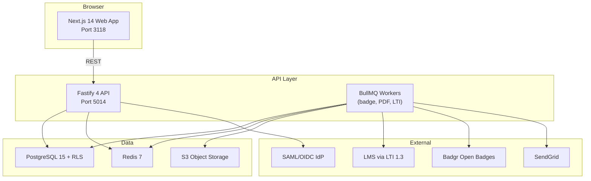
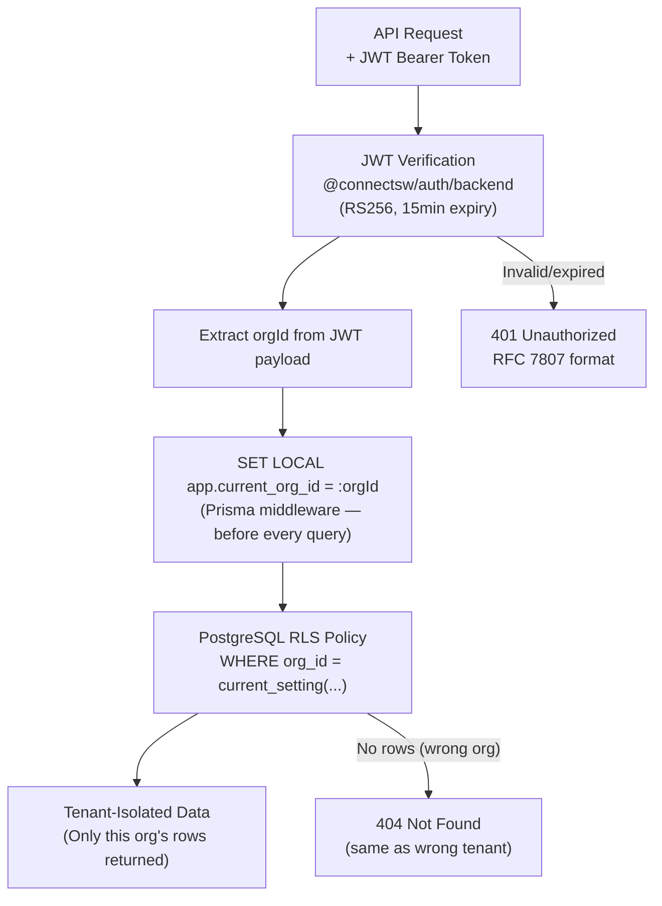
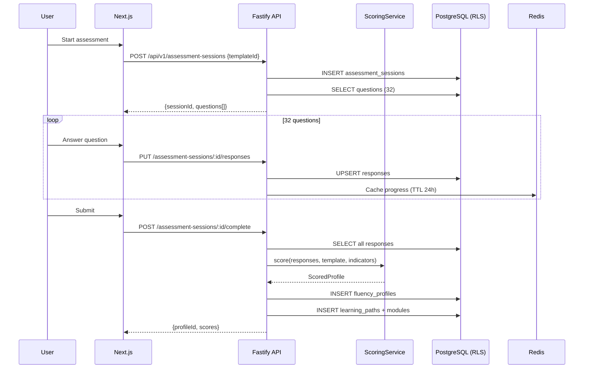

# AI Fluency Platform — Implementation Plan

**Product**: ai-fluency
**Plan version**: 1.0.0
**Created**: 2026-03-03
**Author**: Architect Agent
**Input spec**: `products/ai-fluency/docs/specs/ai-fluency-foundation.md`

---

## Constitution Check

| Article | Requirement | Status |
|---------|-------------|--------|
| I | Approved spec exists before planning | PASS — foundation spec exists |
| II | COMPONENT-REGISTRY.md checked | PASS — 7 reusable packages identified |
| III | TDD plan included in each phase | PASS — each task has test specifications |
| IV | TypeScript strict mode configured | PASS — standard ConnectSW setup |
| V | Default stack or ADR justification | PASS — ADR-003 documents all deviations |
| VI | Spec traceability in commit messages | PASS — format defined in addendum |
| VII | Ports assigned and registered | PASS — API 5014, Web 3118 (from brief) |
| VIII | Git safety rules referenced | PASS — addendum includes git rules |
| IX | All diagrams in Mermaid | PASS — architecture.md has full C4 suite |
| X | Documentation standards met | PASS — all deliverables are diagram-rich |
| XI | Verification-before-completion applied | PASS — acceptance criteria per phase |
| XII | Context engineering applied | PASS — addendum.md written for agents |

---

## Implementation Audit

Capabilities classified against what currently exists in the codebase (products/ai-fluency/).

| Capability | Status | Notes |
|------------|--------|-------|
| Product directory structure | PARTIALLY_IMPLEMENTED | docs/ and specs/ exist, apps/ missing |
| Fastify API server | NOT_IMPLEMENTED | No apps/api/ yet |
| Next.js web app | NOT_IMPLEMENTED | No apps/web/ yet |
| Prisma schema | NOT_IMPLEMENTED | schema.prisma written in ARCH-01, not yet committed |
| Auth routes | NOT_IMPLEMENTED | @connectsw/auth/backend will be imported |
| RLS PostgreSQL setup | NOT_IMPLEMENTED | Migration SQL needed |
| Assessment session CRUD | NOT_IMPLEMENTED | |
| ScoringService | NOT_IMPLEMENTED | |
| LearningPathService | NOT_IMPLEMENTED | |
| Fluency profile retrieval | NOT_IMPLEMENTED | |
| Organization management | NOT_IMPLEMENTED | |
| Team management | NOT_IMPLEMENTED | |
| Dashboard endpoints | NOT_IMPLEMENTED | |
| LTI 1.3 integration | NOT_IMPLEMENTED | |
| Open Badges integration | NOT_IMPLEMENTED | |
| SAML/OIDC SSO | NOT_IMPLEMENTED | |
| PDF certificate generation | NOT_IMPLEMENTED | |
| BullMQ worker setup | NOT_IMPLEMENTED | |

All capabilities are new. No existing code to integrate with.

---

## Component Reuse Plan

| Need | Registry Component | Effort |
|------|--------------------|--------|
| Auth (JWT, sessions, signup, login) | `@connectsw/auth/backend` | Import + configure |
| Frontend auth (useAuth, ProtectedRoute) | `@connectsw/auth/frontend` | Import + configure |
| Logger with PII redaction | `@connectsw/shared/utils/logger` | Import |
| Crypto (Argon2 hashing, HMAC) | `@connectsw/shared/utils/crypto` | Import |
| Prisma plugin lifecycle | `@connectsw/shared/plugins/prisma` | Import + extend for RLS |
| Redis plugin with fallback | `@connectsw/shared/plugins/redis` | Import |
| UI components (Button, Card, DataTable, DashboardLayout, Sidebar) | `@connectsw/ui` | Import + extend |

New components to register after implementation:
- `ScoringService` — Prevalence-weighted scoring (reusable for future assessment products)
- `RLS Prisma Middleware` — PostgreSQL RLS session variable setter

---

## System Architecture

### C4 Level 2 — Container Diagram



### Integration Points

| External System | Protocol | Data Exchanged | Auth Method |
|----------------|----------|----------------|-------------|
| Enterprise IdP | SAML 2.0 / OIDC | User attributes (email, role, org) | SP-initiated SAML / OIDC auth code |
| LMS (Canvas, Moodle) | LTI 1.3 | Assessment launch context, grade passback | OIDC + JWKS |
| Badgr | REST API | Badge assertion JSON, user email | Bearer token |
| SendGrid | REST API | HTML email + variables | API key |
| S3 | AWS SDK | Binary PDF upload | IAM role / access key |

### Security Architecture



---

## Data Flow (Assessment End-to-End)



---

## Error Handling Strategy

| Error Category | Detection | Recovery | User Experience |
|---------------|-----------|----------|-----------------|
| Network timeout (question load) | Axios timeout + retry | TanStack Query retry (3x, exponential) | "Loading..." with retry button |
| Session expired mid-assessment | 401 from API | Redirect to login → deep link back to session | "Session expired — please log in to continue" |
| Duplicate session | 409 from POST /sessions | FE redirects to existing in-progress session | "You have an in-progress assessment — resume?" |
| Scoring failure | 500 from complete endpoint | Session marked IN_PROGRESS, user can retry | "Scoring failed — please try again" |
| DB connection lost | Prisma error caught in health check | Health endpoint returns 503 | Load balancer removes instance |
| Redis unavailable | ioredis error | Graceful fallback: rate limit via DB, cache bypassed | Transparent to user (degraded performance) |
| LTI grade passback failure | BullMQ job failure | Retry 3x with exponential backoff | Admin notified via email if all retries fail |

---

## Phases

---

## Phase 1: Foundation (Sprint 1 — 5 days)

**Goal**: Runnable API + web app with auth, database migrations, and CI.

**Traceability**: FR-016 (multi-tenant RLS), US-18 (tenant isolation)

### Tasks

#### FOUND-01: Project Scaffold
- Create `products/ai-fluency/apps/api/` (Fastify 4 + TypeScript)
- Create `products/ai-fluency/apps/web/` (Next.js 14 App Router)
- Create root `package.json` with workspaces
- Configure ports: API 5014, Web 3118
- Install and configure ESLint (`@connectsw/eslint-config/backend`, `@connectsw/eslint-config/frontend`)
- Set up Jest for API, React Testing Library for Web, Playwright for E2E

**Test specification**:
- `GET /health` returns 200 with `{status: "ok"}` when DB + Redis connected
- `GET /health` returns 503 when DB is down (mock DB connection)

#### FOUND-02: Database Setup + RLS Migrations
- Copy schema.prisma from `products/ai-fluency/apps/api/prisma/schema.prisma` (ARCH-01 deliverable)
- Run `prisma migrate dev --name init`
- Write RLS policy migration SQL for all tenant-scoped tables
- Create two DB roles: `api_service` (BYPASSRLS) and `api_service_rls` (RLS enforced)
- Create seed script: organizations, users (LEARNER, MANAGER, ADMIN), sample questions, behavioral indicators, algorithm_versions

**Test specification**:
- RLS test: Connect as `api_service_rls`, SET orgId=A, SELECT from users → only org A's users returned
- RLS test: SELECT without setting orgId → 0 rows returned (RLS blocks all)
- Seed script runs idempotently

#### FOUND-03: Core Plugin Registration
- Register plugins in order: config → prisma (with RLS middleware) → redis → auth → rateLimiter → observability → routes
- Implement RLS middleware: `SET LOCAL app.current_org_id = :orgId` on `onRequest` hook
- Implement RFC 7807 error handler
- Set up Pino logger with correlation IDs

**Test specification**:
- Config plugin fails fast with descriptive error if `DATABASE_URL` or `JWT_SECRET` missing
- Error handler returns RFC 7807 format for all error types (AppError, Zod, 404, 500)
- Correlation ID present in all log entries for a request

#### FOUND-04: Auth Routes (using @connectsw/auth/backend)
- Import and register `authPlugin` + `authRoutes` from `@connectsw/auth/backend`
- Configure for AI Fluency: roles = ['LEARNER', 'MANAGER', 'ADMIN', 'SUPER_ADMIN']
- Adapt User model to include `orgId`, `teamId`, `status` fields

**Test specification**:
- POST /api/v1/auth/register → 201, sets emailVerified = false
- POST /api/v1/auth/login → 200, returns JWT + sets httpOnly cookie
- POST /api/v1/auth/refresh → 200, rotates token (old token invalid after)
- POST /api/v1/auth/login with wrong password (10x) → 423 account locked
- Rate limit: 6th login attempt in 1 minute → 429

---

## Phase 2: Assessment Core (Sprint 2-3 — 8 days)

**Goal**: Complete assessment lifecycle from start to scored profile.

**Traceability**: US-01, US-02, US-03, US-04, FR-001, FR-002, FR-003, FR-004, FR-005, FR-006

### Tasks

#### ASSESS-01: Question Bank Seeding
- Seed all 32 questions (8/dimension) with correct `options_json` format
- Seed all 24 behavioral indicators with `prevalenceWeight` values
- Mark 11 as OBSERVABLE, 13 as SELF_REPORT

**Test specification**:
- 32 questions seeded, 8 per dimension
- 24 behavioral indicators: 11 OBSERVABLE, 13 SELF_REPORT
- All SCENARIO questions have exactly 4 options with `isCorrect` flag

#### ASSESS-02: Assessment Session Routes
- POST /api/v1/assessment-sessions (start) — FR-001
- GET /api/v1/assessment-sessions/active — FR-004
- GET /api/v1/assessment-sessions/:id — FR-004
- PUT /api/v1/assessment-sessions/:id/responses — FR-004, FR-005
- POST /api/v1/assessment-sessions/:id/complete — FR-002, FR-003

**Test specification**:
- POST /sessions → 201, session created IN_PROGRESS, 32 questions returned
- POST /sessions when active session exists → 409 with existing sessionId
- PUT /sessions/:id/responses (A/B/C/D) → 200, response saved
- PUT /sessions/:id/responses (Likert 1-5) → 200, self-report saved
- PUT /sessions/:id/responses (re-submit same question) → 200, UPSERT (no duplicate)
- GET /sessions/active → returns in-progress session (FR-004 resume)
- POST /sessions/:id/complete with <28 answers → 400 "insufficient answers"
- POST /sessions/:id/complete → RLS verified (cannot complete another org's session)

#### ASSESS-03: ScoringService (TDD — pure function)
- Implement `ScoringService.score()` with prevalence-weighted algorithm
- Implement `ScoringService.detectDiscernmentGap()`
- Implement `ScoringService.scoreDimension()`

**Test specification** (unit tests — no DB required):
- All PASS answers → overallScore = 100
- All FAIL answers → overallScore = 0
- Mixed answers → score within expected range for given prevalenceWeights
- Discernment gap detection: both REASONING + MISSING_CONTEXT FAIL → discernmentGap = true
- Self-report track: Likert 5/5 on all self-report questions → selfReportScores near 100
- Self-report scores do NOT affect `dimensionScores` (they are separate)
- Algorithm version stored correctly on profile

#### ASSESS-04: Fluency Profile Routes
- GET /api/v1/fluency-profiles/:id — FR-003, FR-006
- GET /api/v1/users/me/fluency-profiles (history)

**Test specification**:
- GET /fluency-profiles/:id → includes dimensionScores, selfReportScores (separate), indicatorBreakdown, discernmentGap
- GET /fluency-profiles/:id of another org's profile → 403 (RLS enforced)
- GET /users/me/fluency-profiles → paginated, newest first

---

## Phase 3: Learning Paths (Sprint 4 — 5 days)

**Goal**: Personalized learning path generation and progress tracking.

**Traceability**: US-05, US-06, FR-007

### Tasks

#### LEARN-01: Learning Module Catalog Seeding
- Seed learning modules for all 4 dimensions × 3 modes × 3 difficulty levels
- Include special "Question AI Reasoning" module (Discernment dimension, critical for gap)
- Seed module metadata: title, description, contentType, estimatedMinutes

#### LEARN-02: LearningPathService
- Implement `LearningPathService.generatePath()` — orders by weakest dimension score
- Implement discernment gap handling: prepend "Question AI Reasoning" module
- Implement `LearningPathService.updateProgress()` — recalculate progressPct on completion

**Test specification** (unit tests):
- Profile with lowest Discernment score → first modules are Discernment
- Discernment gap flag = true → "Question AI Reasoning" is module 1
- All modules complete → path status = COMPLETED, progressPct = 100

#### LEARN-03: Learning Path Routes
- POST /api/v1/learning-paths (generate) — FR-007
- GET /api/v1/learning-paths/:id (with modules + progress)
- PUT /api/v1/learning-paths/:id/modules/:moduleId/complete — US-06

**Test specification**:
- POST /learning-paths {profileId} → 201, modules ordered weakest dimension first
- PUT /modules/:id/complete → 200, path progressPct increases
- GET /learning-paths/:id of another org → 403 (RLS)
- Mark already-completed module → 200 idempotent (no error)

---

## Phase 4: Organization Features (Sprint 5 — 5 days)

**Goal**: Multi-org management, teams, and dashboards.

**Traceability**: US-18, FR-016, Lisa (L&D Manager) + David (Executive) personas

### Tasks

#### ORG-01: Organization and Team Routes
- POST /api/v1/organizations (ADMIN only)
- GET/PUT /api/v1/organizations/:id
- CRUD /api/v1/teams
- POST/DELETE /api/v1/teams/:id/members

**Test specification**:
- LEARNER trying POST /organizations → 403
- GET /organizations/:id of another org → 403 (RLS)
- Add user to team → user.teamId updated
- Remove from team → teamId set to null

#### ORG-02: GDPR Endpoints
- DELETE /api/v1/users/me (soft delete, schedule hard delete) — GDPR Art. 17
- GET /api/v1/users/me/export (ZIP of all data) — GDPR Art. 20

**Test specification**:
- DELETE /users/me → 202, user.deletedAt set, login fails after
- GET /users/me/export → 200, ZIP contains user.json, sessions.json, profiles.json
- Soft-deleted user cannot login → 401

#### ORG-03: Dashboard Endpoints
- GET /api/v1/organizations/:id/dashboard (aggregate metrics)
- GET /api/v1/teams/:id/dashboard

**Test specification**:
- Dashboard for org with 10 users → correct avgScore, completionRate, discernmentGapCount
- LEARNER accessing org dashboard → 403
- Empty org → avgScore = null (not 0)

---

## Phase 5: Enterprise Features (Sprint 6-7 — 8 days)

**Goal**: SAML/OIDC SSO, LTI 1.3 grade passback, Open Badges v3.

**Traceability**: Raj (IT Admin) persona, instructor persona, badge requirement

### Tasks

#### ENT-01: SAML/OIDC SSO
- Implement SSOService using `samlify` (SAML 2.0) and `openid-client` (OIDC)
- GET /api/v1/auth/saml/init (redirect to IdP)
- POST /api/v1/auth/saml/callback (receive assertion)
- GET /api/v1/auth/oidc/callback
- PUT /api/v1/organizations/:id (store encrypted SSO config)
- JIT provisioning: create user on first SSO login

**Test specification**:
- SAML callback with valid assertion → user created (JIT), JWT returned
- SAML callback with invalid signature → 401
- OIDC callback → same JIT provisioning flow
- SSO config stored with AES-256-GCM encryption (never plaintext cert)

#### ENT-02: LTI 1.3 Integration (ltijs)
- Register ltijs as Fastify plugin
- Handle LTI launch request → redirect to assessment with ltiContextId
- BullMQ worker: grade passback after session completion

**Test specification**:
- LTI launch with valid JWT → session created with ltiContextId set
- Grade passback worker: score 85/100 sent to LMS grade column
- Grade passback failure → retried 3x with exponential backoff

#### ENT-03: Open Badges v3 Certificate Issuance
- Implement BadgeService using Badgr REST API
- BullMQ worker: issue badge when overallScore >= threshold (default 80)
- GET /api/v1/certificates/:id
- GET /api/v1/certificates/:id/verify (public, no auth)
- GET /api/v1/certificates/:id/pdf

**Test specification**:
- Score >= 80 → badge job enqueued within 5 seconds of completion
- Badge job succeeds → certificate record created with badgeUrl
- GET /certificates/:id/verify (no auth) → valid: true, holder name
- PDF download → returns valid PDF binary

---

## Phase 6: Analytics & Reporting (Sprint 8 — 5 days)

**Goal**: Enhanced dashboards, admin panel, export reports.

**Traceability**: David (Executive) persona, SUPER_ADMIN role

### Tasks

#### ANA-01: Admin Routes
- GET /api/v1/admin/organizations (platform-level, SUPER_ADMIN)
- POST /api/v1/admin/organizations/:id/suspend
- GET /api/v1/admin/organizations/:id/algorithm-versions

#### ANA-02: Frontend Dashboard (Next.js)
- Organization dashboard page with Recharts RadarChart (4D scores)
- Team dashboard with member score table (DataTable from @connectsw/ui)
- Fluency profile page with radar + progress chart

**Test specification** (React Testing Library):
- RadarChart renders with 4 data points (one per dimension)
- DataTable shows member scores with sort on overall score
- Empty state shown when no assessments completed

#### ANA-03: CI/CD Setup
- GitHub Actions workflow: `.github/workflows/ai-fluency.yml`
- Path filter: `products/ai-fluency/**`
- Steps: lint → typecheck → unit tests → integration tests → E2E (Playwright)
- Environment secrets: `AI_FLUENCY_DATABASE_URL`, `AI_FLUENCY_REDIS_URL`

---

## Project Structure

```
products/ai-fluency/
├── apps/
│   ├── api/
│   │   ├── src/
│   │   │   ├── app.ts                  # Fastify app builder
│   │   │   ├── server.ts               # HTTP listen entrypoint
│   │   │   ├── config.ts               # Env var validation
│   │   │   ├── plugins/
│   │   │   │   ├── prisma.ts           # Prisma + RLS middleware
│   │   │   │   ├── redis.ts            # Redis connection
│   │   │   │   ├── auth.ts             # @connectsw/auth/backend adapter
│   │   │   │   ├── rate-limit.ts       # @fastify/rate-limit config
│   │   │   │   └── error-handler.ts    # RFC 7807 error handler
│   │   │   ├── routes/
│   │   │   │   ├── auth.ts
│   │   │   │   ├── organizations.ts
│   │   │   │   ├── teams.ts
│   │   │   │   ├── users.ts
│   │   │   │   ├── assessment-templates.ts
│   │   │   │   ├── assessment-sessions.ts
│   │   │   │   ├── fluency-profiles.ts
│   │   │   │   ├── learning-paths.ts
│   │   │   │   ├── certificates.ts
│   │   │   │   ├── dashboard.ts
│   │   │   │   └── admin.ts
│   │   │   ├── services/
│   │   │   │   ├── scoring.service.ts  # Pure scoring function
│   │   │   │   ├── learning-path.service.ts
│   │   │   │   ├── badge.service.ts    # Badgr REST client
│   │   │   │   ├── lti.service.ts      # ltijs wrapper
│   │   │   │   └── sso.service.ts      # SAML + OIDC
│   │   │   └── workers/
│   │   │       ├── badge.worker.ts     # BullMQ badge issuance
│   │   │       ├── pdf.worker.ts       # Certificate PDF generation
│   │   │       └── lti-grade.worker.ts # LTI grade passback
│   │   ├── prisma/
│   │   │   ├── schema.prisma
│   │   │   ├── migrations/
│   │   │   └── seed.ts
│   │   ├── tests/
│   │   │   ├── unit/                   # ScoringService, LearningPathService
│   │   │   └── integration/            # Route tests with real DB
│   │   └── package.json
│   └── web/
│       ├── src/
│       │   ├── app/                    # Next.js App Router
│       │   │   ├── (auth)/             # Login, register pages
│       │   │   ├── (dashboard)/        # Protected dashboard pages
│       │   │   │   ├── assess/         # Assessment flow
│       │   │   │   ├── profile/        # Fluency profile view
│       │   │   │   ├── learn/          # Learning path view
│       │   │   │   └── org/            # Org + team dashboards
│       │   │   └── cert/               # Public cert verification
│       │   ├── components/
│       │   │   ├── assessment/         # Question display, progress bar
│       │   │   ├── profile/            # RadarChart, indicator breakdown
│       │   │   ├── learning/           # Module list, progress tracker
│       │   │   └── dashboard/          # Org + team aggregate views
│       │   └── lib/
│       │       ├── api.ts              # API client (TanStack Query hooks)
│       │       └── auth.ts             # @connectsw/auth/frontend adapter
│       ├── tests/
│       └── package.json
├── e2e/                                # Playwright E2E tests
├── docs/
│   ├── architecture.md
│   ├── api-schema.yml
│   ├── plan.md
│   ├── ADRs/
│   └── specs/
└── .claude/
    └── addendum.md
```

---

## Complexity Tracking

| Phase | Tasks | Estimated Days | Risk | Notes |
|-------|-------|---------------|------|-------|
| 1 — Foundation | 4 | 5 | LOW | Mostly reusing @connectsw packages + RLS setup |
| 2 — Assessment Core | 4 | 8 | MEDIUM | ScoringService is novel — complex algorithm |
| 3 — Learning Paths | 3 | 5 | LOW | Clear data model, straightforward logic |
| 4 — Org Features | 3 | 5 | LOW | Standard CRUD + dashboard aggregation |
| 5 — Enterprise | 3 | 8 | HIGH | LTI 1.3 + SAML are complex integrations |
| 6 — Analytics | 3 | 5 | LOW | Frontend charts + admin routes |
| **Total** | **20** | **36** | — | ~7.5 weeks |

---

## Suggested Next Step

Run `/speckit.tasks` to generate dependency-ordered task list from this plan.

Each task will be assigned to: Backend Engineer (routes, services), Frontend Engineer (Next.js), Data Engineer (migrations + seed), DevOps (CI/CD), QA Engineer (test specs).
