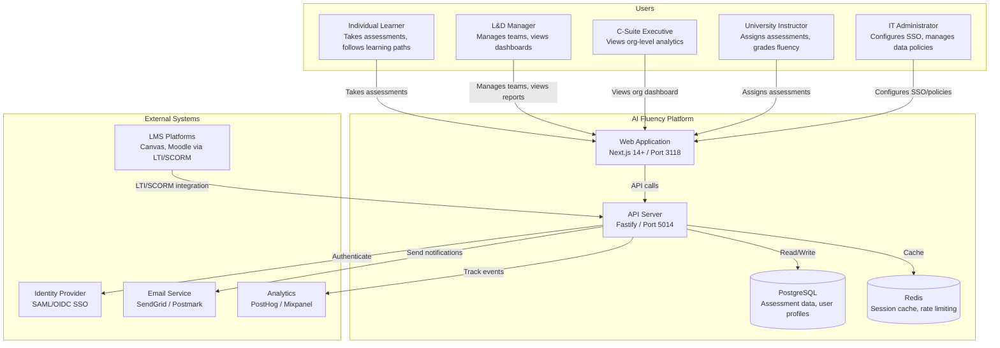
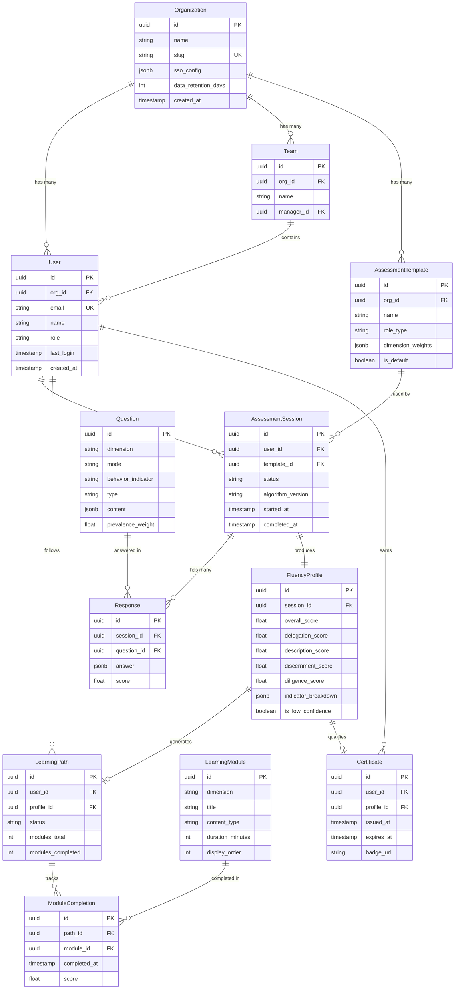

# Feature Specification: AI Fluency Platform — Foundation

**Product**: ai-fluency
**Feature Branch**: `feature/ai-fluency/foundation`
**Created**: 2026-03-02
**Status**: Draft
**Input**: CEO brief: "Create a product for AI fluency following Anthropic's latest 4D assessment"

---

## Business Context

### Problem Statement

Organizations lack a standardized, empirically-validated method to assess and develop their workforce's AI fluency. Current approaches to AI training are fragmented, subjective, and disconnected from measurable behavioral outcomes. 94% of companies have NOT started AI upskilling programs (PwC), while AI skills command a 56% wage premium. The cost of inaction compounds as 42% of workers expect AI-driven role changes.

No existing platform implements Anthropic's peer-reviewed 4D AI Fluency Framework (Delegation, Description, Discernment, Diligence) with its 24 empirically-validated behavioral indicators. This is a blue-ocean opportunity.

### Target Users

| Persona | Role | Pain Point | Expected Outcome |
|---------|------|-----------|-----------------|
| Lisa (L&D Manager) | Enterprise Learning & Development | No standardized way to measure team AI competency; relies on subjective manager assessments | Data-driven AI fluency metrics per team member, department, and organization |
| Alex (Individual Learner) | Knowledge Worker / Professional | Lacks structured guidance on effective AI interaction; does not know personal strengths and gaps | Personalized fluency profile with targeted learning path |
| Prof. Sarah (University Instructor) | Higher Education Faculty | No validated assessment framework for grading AI fluency in coursework | Assign standardized 4D assessments with gradeable results |
| David (C-Suite Executive) | VP/CTO/CLO | Cannot quantify AI readiness or justify training investment with data | Organizational dashboard with aggregate fluency scores and ROI metrics |
| Raj (IT Administrator) | Enterprise IT | Security and compliance concerns with new SaaS tools; SSO and data residency requirements | SAML/OIDC SSO, multi-tenant data isolation, configurable data retention |

### Business Value

- **Revenue Impact**: $500K ARR target from 20 enterprise customers at ~$25K average within 12 months of GA
- **User Retention**: Longitudinal tracking and recertification create recurring engagement; 50%+ return for second assessment
- **Competitive Position**: First-to-market with Anthropic's validated 4D framework as interactive assessments
- **Strategic Alignment**: Extends ConnectSW's portfolio into the $15-20B enterprise skills assessment market

## System Context (C4 Level 1)

---

## User Scenarios & Testing

### US-01 — Take 4D Framework Assessment (Priority: P0)

**As a** learner, **I want to** take an interactive assessment that evaluates my AI fluency across Delegation, Description, Discernment, and Diligence dimensions, **so that** I understand my strengths and gaps.

The learner logs in, selects "Start Assessment," and is presented with a series of scenario-based questions organized by the 4 dimensions. Each scenario presents a realistic AI interaction situation and asks the learner to choose the most fluent response or evaluate an AI output. The assessment covers all 4 dimensions with at least 3 scenarios per dimension. Progress is shown throughout. On completion, a summary screen displays results.

**Why this priority**: Core product functionality — without assessments, there is no product.

**Independent Test**: Can be tested by creating a test user, starting an assessment, completing all questions, and verifying a result is generated with per-dimension scores.

**Acceptance Criteria**:

1. **Given** a logged-in learner with no active assessment, **When** the learner clicks "Start Assessment," **Then** the system creates a new assessment session and displays the first question within 2 seconds.
2. **Given** a learner mid-assessment, **When** the learner answers a question, **Then** the system records the response, advances to the next question, and updates the progress indicator.
3. **Given** a learner who has answered all questions, **When** the assessment is complete, **Then** the system calculates dimension scores using prevalence-weighted scoring and displays a fluency profile within 3 seconds.
4. **Given** a learner mid-assessment, **When** the learner closes the browser, **Then** the system saves progress and allows resumption from the last unanswered question on next login.
5. **Given** an invalid or missing response, **When** the learner attempts to advance, **Then** the system displays a validation error and does not advance.

---

### US-02 — View Fluency Profile (Priority: P0)

**As a** learner, **I want to** receive a detailed fluency profile showing my score per dimension with behavioral indicator breakdowns, **so that** I know exactly where to improve.

After completing an assessment, the learner sees a profile page with: overall fluency score (0-100), individual scores for each of the 4 dimensions, breakdown of the 11 observable and 13 unobservable behavioral indicators with pass/fail/partial status, and comparison to aggregate benchmarks.

**Why this priority**: Assessment results are the core value proposition — without clear, actionable results, assessments have no purpose.

**Independent Test**: Complete an assessment and verify the profile page displays all 4 dimension scores, the overall score, and behavioral indicator breakdowns.

**Acceptance Criteria**:

1. **Given** a completed assessment, **When** the learner views their fluency profile, **Then** the system displays an overall fluency score (0-100), 4 dimension scores (0-100 each), and a radar chart visualization.
2. **Given** a completed assessment, **When** the learner expands a dimension, **Then** the system displays the individual behavioral indicators under that dimension with pass/fail/partial status and the learner's specific responses.
3. **Given** a learner with no completed assessments, **When** the learner navigates to the profile page, **Then** the system displays a prompt to take their first assessment with a "Start Assessment" CTA.

---

### US-03 — Prevalence-Weighted Scoring Engine (Priority: P0)

**As an** assessment engine, **I want to** evaluate 11 observable behaviors using prevalence-weighted scoring, **so that** scores reflect the relative difficulty and rarity of each behavior.

The scoring engine weights each observable behavior inversely to its prevalence rate from Anthropic's research (e.g., "Verifying facts" at 8.7% prevalence gets weight 5.0; "Iterative improvement" at 85.7% gets weight 1.0). The total score normalizes to 0-100 per dimension.

**Why this priority**: Scoring credibility is foundational to product value.

**Independent Test**: Submit a set of known responses and verify the computed scores match expected prevalence-weighted calculations.

**Acceptance Criteria**:

1. **Given** a completed assessment with all questions answered, **When** the scoring engine processes the responses, **Then** it applies prevalence-weighted scoring where rarer behaviors (lower prevalence) receive higher weights.
2. **Given** a set of test responses with known expected outcomes, **When** the scoring engine calculates scores, **Then** each dimension score falls within 0-100 and the overall score is the weighted average of dimension scores.
3. **Given** an assessment with partial responses (save-and-resume), **When** the scoring engine is invoked, **Then** it scores only completed sections and marks incomplete dimensions as "In Progress."

---

### US-04 — Self-Report for Unobservable Behaviors (Priority: P0)

**As a** learner, **I want to** complete scenario-based self-assessment questions for the 13 unobservable behaviors (ethics, disclosure, consequences), **so that** my full fluency profile is captured.

The 13 unobservable behaviors (e.g., being honest about AI's role, considering downstream consequences) cannot be directly observed in AI conversations. The platform uses validated self-report instruments with Likert-scale and scenario-based questions to assess these behaviors.

**Why this priority**: Without unobservable behaviors, the assessment covers only 11 of 24 indicators — an incomplete fluency profile.

**Independent Test**: Complete the self-report section and verify all 13 unobservable behaviors are assessed and included in the fluency profile.

**Acceptance Criteria**:

1. **Given** a learner in the assessment flow, **When** the learner reaches the self-report section, **Then** the system presents scenario-based questions covering all 13 unobservable behaviors grouped by dimension.
2. **Given** a self-report question, **When** the learner selects a response on the Likert scale (1-5), **Then** the system records the response and maps it to the corresponding behavioral indicator.
3. **Given** a completed self-report section, **When** scores are calculated, **Then** self-reported scores are displayed separately from observed-behavior scores with a clear "Self-Reported" label to maintain transparency.

---

### US-05 — Personalized Learning Path (Priority: P0)

**As a** learner, **I want to** receive a personalized learning path based on my assessment results that prioritizes my weakest dimensions, **so that** I improve efficiently.

After viewing their fluency profile, the learner clicks "Start Learning Path." The system generates a sequence of learning modules ordered by dimension weakness (lowest-scoring dimension first). Each module contains educational content, practice exercises, and a mini-assessment to verify improvement.

**Why this priority**: Assessment without training is a dead end. Learning paths drive retention and recurring engagement.

**Independent Test**: Complete an assessment with deliberately low scores in Discernment, verify the learning path starts with Discernment modules.

**Acceptance Criteria**:

1. **Given** a learner with a completed assessment, **When** the learner clicks "Start Learning Path," **Then** the system generates a learning path with modules ordered by dimension score (lowest first) within 2 seconds.
2. **Given** a learning path in progress, **When** the learner completes a module, **Then** the system marks it complete, updates progress (percentage), and unlocks the next module.
3. **Given** a learner who has completed all modules in a dimension, **When** the learner takes a mini-reassessment, **Then** the updated score is reflected in the fluency profile alongside the original score to show improvement.
4. **Given** a learner with all dimensions scoring above 80, **When** a learning path is generated, **Then** the system recommends "Advanced" modules focusing on the discernment gap and agency-mode interactions.

---

### US-06 — Track Learning Progress (Priority: P0)

**As a** learner, **I want to** track my progress through learning modules and see my fluency scores update as I complete training, **so that** I stay motivated.

The learner's dashboard shows a progress summary: modules completed, time invested, dimension scores over time (line chart), and badges earned.

**Why this priority**: Progress visualization drives engagement and completion rates.

**Independent Test**: Complete 3 learning modules and verify the dashboard reflects accurate progress and score changes.

**Acceptance Criteria**:

1. **Given** a learner with an active learning path, **When** the learner views their dashboard, **Then** the system displays modules completed (count and percentage), time invested, and a line chart of dimension scores over time.
2. **Given** a learner who completes a module, **When** the dashboard refreshes, **Then** the progress metrics update within 5 seconds without requiring a full page reload.
3. **Given** a learner with no learning activity in 7 days, **When** 7 days elapse, **Then** the system sends a reminder email with current progress and next recommended module.

---

### US-07 — Role-Specific Assessment Templates (Priority: P1)

**As an** L&D manager, **I want to** select role-specific assessment templates (developer, analyst, manager, marketer), **so that** assessments are relevant to each team member's work context.

L&D managers access a template library with pre-built role profiles. Each template emphasizes behavioral indicators most relevant to that role (e.g., developers: higher weight on Description and Delegation; managers: higher weight on Discernment and Diligence).

**Why this priority**: Role relevance increases assessment adoption and credibility within organizations.

**Independent Test**: Select "Developer" template, verify assessment questions are weighted toward Description and Delegation scenarios.

**Acceptance Criteria**:

1. **Given** an L&D manager creating a team assessment, **When** the manager selects a role template from the library, **Then** the system displays at least 4 role templates (Developer, Analyst, Manager, Marketer) with descriptions of emphasis areas.
2. **Given** a selected role template, **When** the assessment is generated, **Then** scenario questions are contextualized to the selected role and behavioral indicator weights are adjusted per template configuration.
3. **Given** a role template not in the library, **When** the L&D manager clicks "Custom Template," **Then** the system allows custom weight configuration per dimension with a preview of the resulting assessment balance.

---

### US-08 — Role-Contextualized Assessment Experience (Priority: P1)

**As a** learner, **I want to** take an assessment customized for my role that emphasizes the behavioral indicators most relevant to my job function, **so that** results are actionable in my daily work.

**Acceptance Criteria**:

1. **Given** a learner assigned a role-specific assessment, **When** the learner starts the assessment, **Then** scenarios reflect the assigned role's context (e.g., developer scenarios involve code review with AI, not marketing copy).
2. **Given** a completed role-specific assessment, **When** the learner views results, **Then** the profile indicates which role template was used and highlights role-relevant strengths and gaps.

---

### US-09 — Organizational Dashboard (Priority: P1)

**As a** C-suite executive, **I want to** view an organizational dashboard showing aggregate AI fluency scores by department, role, and dimension, **so that** I make data-driven training investment decisions.

**Why this priority**: Enterprise buyers require executive-level visibility to justify purchasing decisions.

**Independent Test**: Create an organization with 10+ users who have completed assessments, verify dashboard shows aggregate scores by department and dimension.

**Acceptance Criteria**:

1. **Given** an executive with org-admin role, **When** the executive views the organizational dashboard, **Then** the system displays aggregate fluency scores filterable by department, role, and dimension with bar and radar chart visualizations.
2. **Given** an organization with fewer than 5 assessment completions, **When** the executive views the dashboard, **Then** the system displays "Insufficient data — at least 5 completed assessments required" instead of potentially misleading aggregate scores.
3. **Given** an organization with 20+ completed assessments, **When** the executive selects a date range filter, **Then** the dashboard displays fluency trend data for the selected period.

---

### US-10 — Team Fluency Trends (Priority: P1)

**As an** L&D manager, **I want to** view team-level fluency trends over time and compare against benchmarks, **so that** I measure training program effectiveness.

**Acceptance Criteria**:

1. **Given** an L&D manager with a team of 5+ learners, **When** the manager views the team dashboard, **Then** the system displays average team fluency scores per dimension, individual member progress, and a trend line over time.
2. **Given** a team with pre- and post-training assessments, **When** the manager views improvement metrics, **Then** the system calculates and displays percentage improvement per dimension with statistical significance indicators when sample size >= 30.

---

### US-11 — Discernment Gap Training (Priority: P1)

**As a** learner flagged with a discernment gap, **I want to** receive targeted training on questioning AI reasoning and identifying missing context, **so that** I develop critical evaluation skills.

Anthropic's research found that users are less likely to question AI reasoning (-3.1pp) or identify missing context (-5.2pp) when AI produces artifacts. This targeted training addresses that specific gap.

**Acceptance Criteria**:

1. **Given** a learner whose Discernment dimension score is below 50 AND whose "Question AI reasoning" and "Identify missing context" indicators are both "Fail," **When** the learning path is generated, **Then** the system inserts a "Discernment Gap" priority module before other learning content.
2. **Given** a learner in the Discernment Gap module, **When** the learner completes an exercise, **Then** the exercise involves evaluating AI-generated artifacts for errors, missing context, or flawed reasoning.

---

### US-12 — Discernment Gap Tracking for Managers (Priority: P1)

**As an** L&D manager, **I want to** see which learners have discernment gaps and track improvement after targeted training, **so that** I address the most impactful fluency weakness.

**Acceptance Criteria**:

1. **Given** an L&D manager viewing the team dashboard, **When** the manager selects "Discernment Gap Analysis," **Then** the system displays a list of team members flagged with discernment gaps, their current Discernment scores, and improvement trend since targeted training began.

---

### US-13 — Three Interaction Mode Assessment (Priority: P1)

**As a** learner, **I want to** complete assessment scenarios that cover Automation, Augmentation, and Agency interaction modes, **so that** my fluency is measured across all AI interaction types.

**Acceptance Criteria**:

1. **Given** a learner taking an assessment, **When** the assessment includes all three modes, **Then** each mode (Automation, Augmentation, Agency) has at least 2 scenario questions and results show fluency per mode.
2. **Given** a completed assessment, **When** the learner views results, **Then** the profile displays a breakdown by interaction mode alongside the 4D dimension breakdown.

---

### US-14 — Enterprise SSO Configuration (Priority: P1)

**As an** IT administrator, **I want to** configure SAML/OIDC SSO for my organization, **so that** employees use existing credentials.

**Acceptance Criteria**:

1. **Given** an IT admin in organization settings, **When** the admin configures SAML SSO with IdP metadata URL, **Then** the system validates the configuration and enables SSO login within 30 seconds.
2. **Given** SSO is configured, **When** an employee visits the login page, **Then** the system displays a "Sign in with SSO" option alongside email/password login.
3. **Given** an invalid SSO configuration, **When** a user attempts SSO login, **Then** the system displays a specific error message and falls back to email/password login.

---

### US-15 — LMS Integration via LTI/SCORM (Priority: P1)

**As an** L&D manager, **I want to** integrate AI Fluency assessments into our LMS via SCORM/LTI, **so that** results appear in existing learning records.

**Acceptance Criteria**:

1. **Given** an organization with LMS integration configured, **When** a learner launches the assessment from the LMS, **Then** the system authenticates via LTI and returns results to the LMS grade book on completion.
2. **Given** an LTI launch request with invalid credentials, **When** the system processes the request, **Then** it returns an LTI error response and logs the failed attempt.

---

### US-16 — Digital Badges and Certification (Priority: P2)

**As a** learner, **I want to** earn a digital badge and certificate when I achieve fluency milestones, **so that** I demonstrate my AI competency to employers.

**Acceptance Criteria**:

1. **Given** a learner whose overall fluency score exceeds the certification threshold (configurable, default 70), **When** the score is confirmed, **Then** the system generates a digital badge (Open Badges v3 format) and a downloadable PDF certificate.
2. **Given** a learner with a certificate, **When** the certificate validity period expires (configurable, default 12 months), **Then** the system sends a recertification reminder email 30 days before expiry.

---

### US-17 — Certification Configuration (Priority: P2)

**As an** organization admin, **I want to** configure certification thresholds and recertification periods, **so that** credentials remain current.

**Acceptance Criteria**:

1. **Given** an org admin in settings, **When** the admin sets a custom certification threshold (e.g., 80), **Then** all future certifications for that organization use the new threshold.

---

### US-18 — Multi-Tenant Data Isolation (Priority: P0)

**As an** IT administrator, **I want to** verify that my organization's data is completely isolated from other tenants, **so that** we meet security and compliance requirements.

**Why this priority**: Enterprise customers require tenant isolation as a non-negotiable security requirement.

**Independent Test**: Create two organizations, submit assessments for both, verify that API calls from Org A cannot access Org B's data under any query permutation.

**Acceptance Criteria**:

1. **Given** two organizations (Org A and Org B) in the system, **When** a user from Org A queries assessment data, **Then** the API returns ONLY Org A's data — verified by PostgreSQL Row Level Security (RLS) policies.
2. **Given** a user from Org A, **When** the user attempts to access Org B's data via direct API manipulation (e.g., changing org_id in request), **Then** the system returns 403 Forbidden and logs the attempt.
3. **Given** multi-tenant isolation is enabled, **When** a new organization is created, **Then** the system automatically provisions RLS policies for the new tenant within the same transaction.

---

### US-19 — Longitudinal Fluency Trends (Priority: P1)

**As an** L&D manager, **I want to** view longitudinal fluency trends for individuals and teams over 3-12 months, **so that** I quantify training ROI.

**Acceptance Criteria**:

1. **Given** a learner with 2+ completed assessments over 3+ months, **When** the manager views the learner's longitudinal report, **Then** the system displays a line chart of fluency scores over time with dimension breakdowns.

---

### US-20 — Quarterly Fluency Report (Priority: P1)

**As a** C-suite executive, **I want to** generate a quarterly AI fluency report showing organization-wide improvement, **so that** I justify continued investment.

**Acceptance Criteria**:

1. **Given** an organization with 3+ months of assessment data, **When** the executive clicks "Generate Quarterly Report," **Then** the system produces a PDF report with aggregate scores, trends, department comparisons, and ROI metrics within 10 seconds.

---

### US-21 — Data Privacy Management (Priority: P1)

**As a** learner, **I want to** manage my data privacy preferences and exercise my right to data erasure, **so that** my personal information is protected.

**Acceptance Criteria**:

1. **Given** a logged-in learner, **When** the learner navigates to Privacy Settings and clicks "Delete My Data," **Then** the system schedules a hard delete of all personal data within 30 days (GDPR Article 17 compliance) and sends a confirmation email.
2. **Given** a data deletion request, **When** 30 days elapse, **Then** all personal data is permanently deleted; anonymized aggregate statistics are retained.

---

### US-22 — Data Residency and Retention Policies (Priority: P1)

**As an** IT administrator, **I want to** configure data residency and retention policies for my organization, **so that** we comply with regional regulations.

**Acceptance Criteria**:

1. **Given** an IT admin in organization settings, **When** the admin configures data retention to 24 months, **Then** the system automatically archives or deletes data older than the configured period.

---

### Edge Cases

| # | Scenario | Expected Behavior | Priority |
|---|----------|------------------|----------|
| 1 | Learner submits assessment with network disconnect mid-submission | System retries submission 3 times; if all fail, saves locally and syncs on reconnect; no duplicate submissions created | P0 |
| 2 | Two L&D managers simultaneously modify the same role template | System uses optimistic locking; second save receives a conflict error with option to merge or overwrite | P1 |
| 3 | Assessment scoring algorithm is updated while learners have in-progress assessments | In-progress assessments complete with the algorithm version they started with; new assessments use the updated algorithm | P0 |
| 4 | Organization has exactly 1 learner — aggregate dashboards would expose individual data | Dashboard displays "Minimum 5 learners required for aggregate view" to prevent individual identification | P1 |
| 5 | Learner completes assessment in under 2 minutes (speed-running without reading) | System flags assessments completed below a minimum time threshold (configurable, default 10 minutes) as "Low Confidence" and excludes from org aggregates | P1 |
| 6 | SSO IdP goes down while users are mid-session | Existing sessions remain valid per JWT expiry; new logins show "SSO temporarily unavailable, try again in a few minutes" with optional email/password fallback if org allows | P1 |
| 7 | Learner attempts assessment in unsupported browser (IE11, very old Safari) | System detects browser on load and displays "Please use a modern browser" with supported browser list | P2 |
| 8 | Organization exceeds their license seat count | New user registrations for that org are blocked; L&D manager receives notification to upgrade; existing users unaffected | P1 |

---

## Requirements

### Functional Requirements

- **FR-001**: System MUST present scenario-based assessment questions covering all 4 dimensions (Delegation, Description, Discernment, Diligence). *Traces to: US-01, AC 1-2*
- **FR-002**: System MUST calculate dimension scores using prevalence-weighted scoring algorithm. *Traces to: US-03, AC 1-2*
- **FR-003**: System MUST generate a fluency profile with overall score (0-100), per-dimension scores (0-100), and behavioral indicator breakdowns. *Traces to: US-02, AC 1-2*
- **FR-004**: System MUST support save-and-resume for in-progress assessments. *Traces to: US-01, AC 4*
- **FR-005**: System MUST present self-report instruments for 13 unobservable behaviors with Likert-scale responses. *Traces to: US-04, AC 1-2*
- **FR-006**: System MUST display self-reported scores separately from observed-behavior scores with a clear label. *Traces to: US-04, AC 3*
- **FR-007**: System MUST generate personalized learning paths ordered by weakest dimension first. *Traces to: US-05, AC 1*
- **FR-008**: System MUST track learning module completion and update progress in real-time. *Traces to: US-06, AC 1-2*
- **FR-009**: System MUST support role-specific assessment templates with configurable behavioral indicator weights. *Traces to: US-07, AC 1-3*
- **FR-010**: System MUST display organizational aggregate fluency dashboards filterable by department, role, and dimension. *Traces to: US-09, AC 1-3*
- **FR-011**: System MUST implement a Discernment Gap detection algorithm that flags learners with low scores on "Question AI reasoning" and "Identify missing context" indicators. *Traces to: US-11, AC 1*
- **FR-012**: System MUST provide assessment scenarios covering all three interaction modes (Automation, Augmentation, Agency). *Traces to: US-13, AC 1*
- **FR-013**: System MUST support SAML and OIDC SSO configuration per organization. *Traces to: US-14, AC 1-3*
- **FR-014**: System MUST support LTI 1.3 integration for LMS grade passback. *Traces to: US-15, AC 1*
- **FR-015**: System MUST generate Open Badges v3 digital credentials on certification threshold achievement. *Traces to: US-16, AC 1*
- **FR-016**: System MUST enforce multi-tenant data isolation via PostgreSQL Row Level Security. *Traces to: US-18, AC 1-3*
- **FR-017**: System MUST support GDPR Article 17 data erasure requests with 30-day hard delete. *Traces to: US-21, AC 1-2*
- **FR-018**: System MUST generate downloadable quarterly fluency reports in PDF format. *Traces to: US-20, AC 1*
- **FR-019**: System MUST send reminder emails for inactive learners (7-day threshold) and certificate expiry (30-day advance). *Traces to: US-06 AC 3, US-16 AC 2*
- **FR-020**: System MUST provide longitudinal fluency trend visualization for 3-12 month periods. *Traces to: US-19, AC 1*

### Non-Functional Requirements

- **NFR-001**: Performance — Assessment question load time MUST be < 500ms (p95). Scoring calculation MUST complete in < 3 seconds (p95). *Traces to: US-01 AC 1, US-02*
- **NFR-002**: Security — All data at rest MUST be encrypted (AES-256). All data in transit MUST use TLS 1.3. Authentication MUST use JWT with refresh token rotation. *Traces to: US-18*
- **NFR-003**: Accessibility — Platform MUST meet WCAG 2.1 AA compliance. All assessment interactions MUST be keyboard-navigable. Screen reader support MUST cover all assessment flows.
- **NFR-004**: Scalability — System MUST handle 10,000 concurrent assessment sessions with < 3 second p95 response time. Database MUST support 1M+ assessment records.
- **NFR-005**: Reliability — Platform uptime MUST be >= 99.5%. Assessment data MUST be backed up every 6 hours with point-in-time recovery.
- **NFR-006**: Internationalization — UI MUST support English (default). Architecture MUST support future i18n (Arabic, Spanish, French) via externalized strings.
- **NFR-007**: Multi-tenancy — Each organization's data MUST be isolated via PostgreSQL RLS. Cross-tenant data leakage MUST be impossible at the database level. *Traces to: US-18*
- **NFR-008**: Compliance — System MUST support GDPR and CCPA data subject requests. Data retention MUST be configurable per organization. *Traces to: US-21, US-22*

### Key Entities

| Entity | Description | Key Attributes | Relationships |
|--------|-------------|---------------|---------------|
| Organization | Enterprise tenant | id, name, slug, sso_config, data_retention_days | Has many Users, Teams, AssessmentTemplates |
| User | Individual user (learner, admin, manager) | id, org_id, email, name, role, last_login | Belongs to Organization, has many AssessmentSessions |
| Team | Department/group within org | id, org_id, name, manager_id | Belongs to Organization, has many Users |
| AssessmentTemplate | Role-specific assessment config | id, org_id, name, role_type, dimension_weights | Belongs to Organization, has many AssessmentSessions |
| AssessmentSession | Single assessment attempt | id, user_id, template_id, status, started_at, completed_at | Belongs to User and Template, has many Responses |
| Question | Assessment question | id, dimension, mode, behavior_indicator, type, content | Has many Responses |
| Response | User answer to a question | id, session_id, question_id, answer, score | Belongs to Session and Question |
| FluencyProfile | Computed assessment result | id, session_id, overall_score, delegation_score, description_score, discernment_score, diligence_score | Belongs to AssessmentSession |
| LearningPath | Personalized learning plan | id, user_id, profile_id, status, modules_total, modules_completed | Belongs to User and FluencyProfile |
| LearningModule | Individual training module | id, dimension, title, content_type, duration_minutes, order | Has many ModuleCompletions |
| ModuleCompletion | Record of module completion | id, path_id, module_id, completed_at, score | Belongs to LearningPath and LearningModule |
| Certificate | Earned credential | id, user_id, profile_id, issued_at, expires_at, badge_url | Belongs to User and FluencyProfile |

### Data Model

---

## Component Reuse Check

| Need | Existing Component | Source Package | Reuse? |
|------|-------------------|---------------|--------|
| Authentication (JWT, signup, login, refresh) | Auth Plugin + Auth Routes | `@connectsw/auth/backend` | Yes — full reuse |
| Frontend auth (useAuth, ProtectedRoute, TokenManager) | Auth Frontend | `@connectsw/auth/frontend` | Yes — full reuse |
| Structured logging with PII redaction | Logger | `@connectsw/shared/utils/logger` | Yes — full reuse |
| Password hashing, API key HMAC | Crypto Utils | `@connectsw/shared/utils/crypto` | Yes — full reuse |
| Prisma lifecycle management | Prisma Plugin | `@connectsw/shared/plugins/prisma` | Yes — full reuse |
| Redis session/cache | Redis Plugin | `@connectsw/shared/plugins/redis` | Yes — full reuse |
| UI components (Button, Input, Card, Table) | Shared UI Library | `@connectsw/ui` | Yes — full reuse |
| Assessment engine (scoring, questions) | None found | N/A | No — build new |
| Learning path generation | None found | N/A | No — build new |
| Multi-tenant RLS policies | None found | N/A | No — build new (candidate for registry) |
| LTI/SCORM integration | None found | N/A | No — build new (candidate for registry) |
| PDF report generation | None found | N/A | No — build new (candidate for registry) |
| Radar chart visualization | None found | N/A | No — build new with Chart.js or Recharts |

---

## Success Criteria

### Measurable Outcomes

| # | Metric | Target | Measurement Method |
|---|--------|--------|-------------------|
| SC-001 | Assessment completion rate | >= 75% (started-to-completed) | Assessment session analytics (completed / started) |
| SC-002 | Time to first assessment | <= 15 minutes from signup | Event analytics timestamp delta |
| SC-003 | Scoring latency (p95) | <= 3 seconds | API performance monitoring |
| SC-004 | Registered organizations (12 months) | >= 50 (20 paying) | Database count |
| SC-005 | Active learners (12 months) | >= 5,000 | Monthly active users with assessment activity |
| SC-006 | Average fluency improvement | >= 15% after learning path | Pre/post assessment score comparison |
| SC-007 | NPS score | >= 40 | In-app survey at 30-day mark |
| SC-008 | Platform uptime | >= 99.5% | Infrastructure monitoring |

---

## Out of Scope

- **AI-powered assessment generation** (using Claude API to generate questions dynamically) — deferred to Phase 2
- **Mobile native apps** (iOS/Android) — web-responsive only for MVP; native apps in future
- **Real-time proctoring** of assessments — not needed for self-paced learning context
- **Marketplace for third-party content** — only ConnectSW-authored learning modules in MVP
- **Advanced psychometric validation** (IRT, Rasch modeling) — planned for post-MVP validity study
- **White-labeling** — organizations use ConnectSW branding in MVP; white-label in Phase 3
- **Payment/billing integration** — handled manually or via external billing (Stripe integration in Phase 2)
- **Multi-language content** — English only for MVP; i18n architecture prepared but not populated

---

## Open Questions

| # | Question | Impact if Unresolved | Owner | Status |
|---|----------|---------------------|-------|--------|
| 1 | [NEEDS CLARIFICATION] Does Anthropic's CC BY-NC-SA 4.0 license permit commercial use of framework-derived assessment content, or only the educational materials? | Blocks product launch if commercial use is prohibited; may need custom licensing agreement | CEO / Legal | Open |
| 2 | [NEEDS CLARIFICATION] What is the minimum viable question count per dimension for a statistically reliable assessment? Proposed: 8 questions per dimension (32 total) — is this sufficient? | Affects assessment length, completion rate, and scoring validity | Architect / QA | Open |
| 3 | [NEEDS CLARIFICATION] Should the self-report scores for unobservable behaviors be weighted equally with observed-behavior scores in the overall fluency score, or displayed as a separate sub-score? | Affects scoring algorithm design and profile display | Product Manager / CEO | Open |
