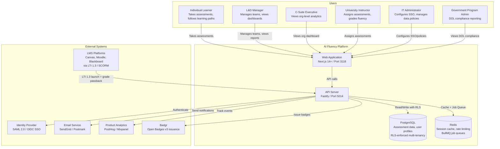
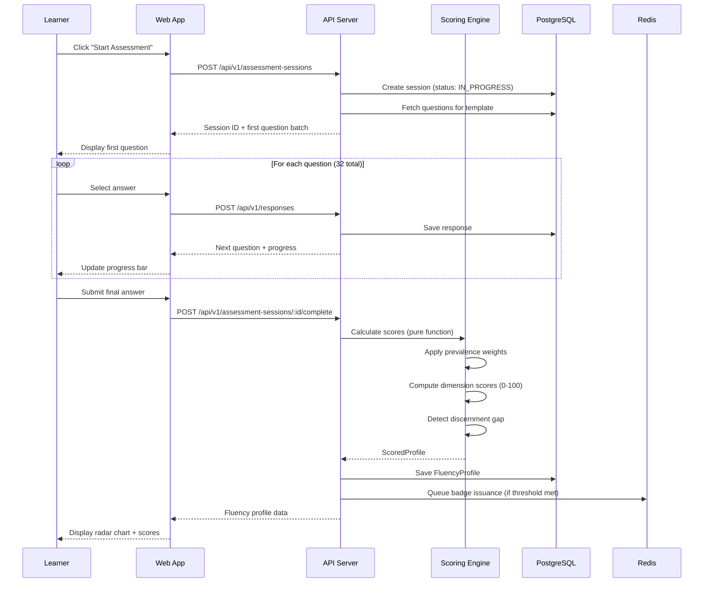
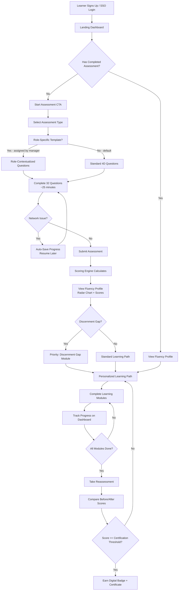
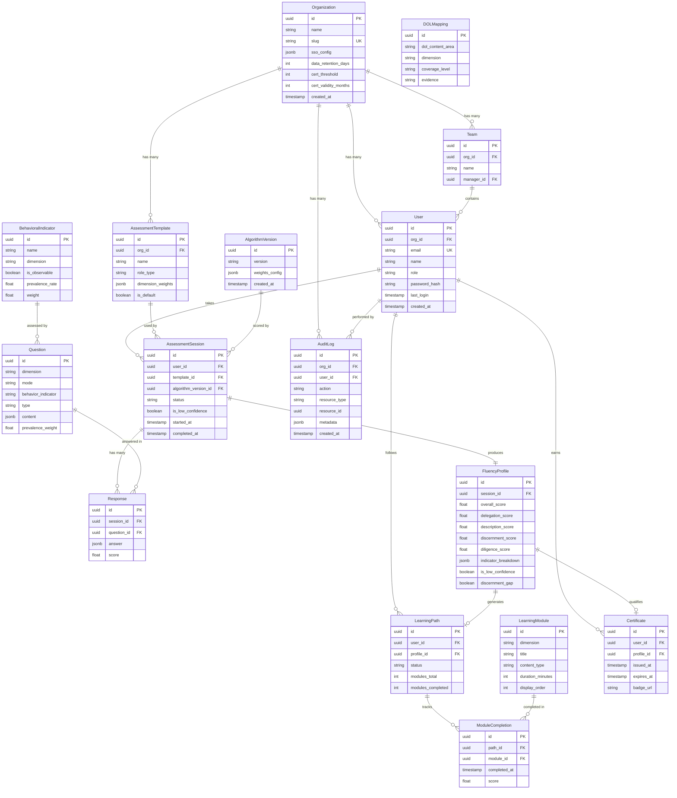
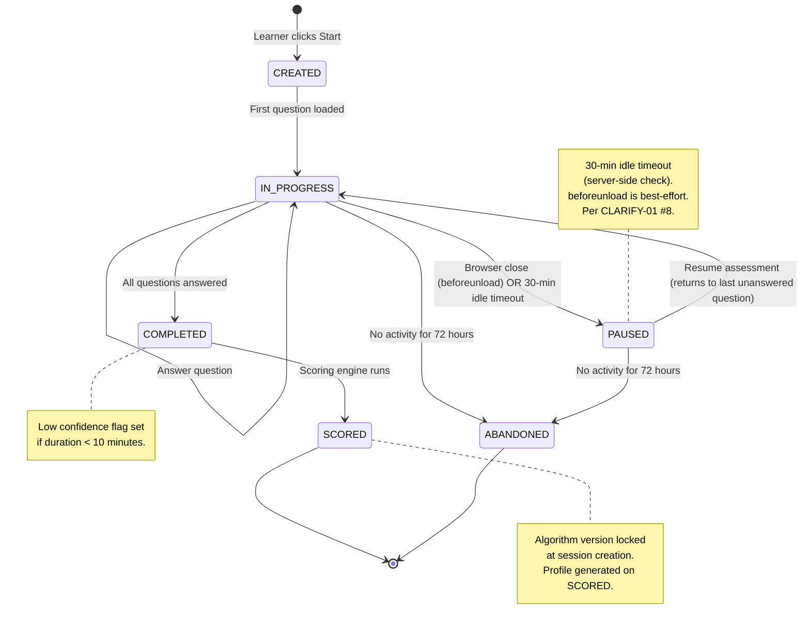
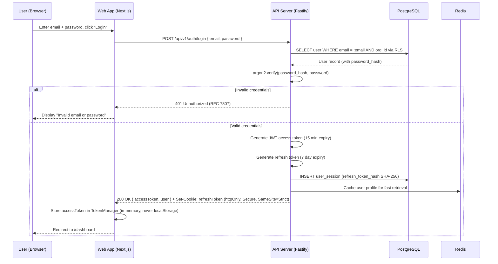
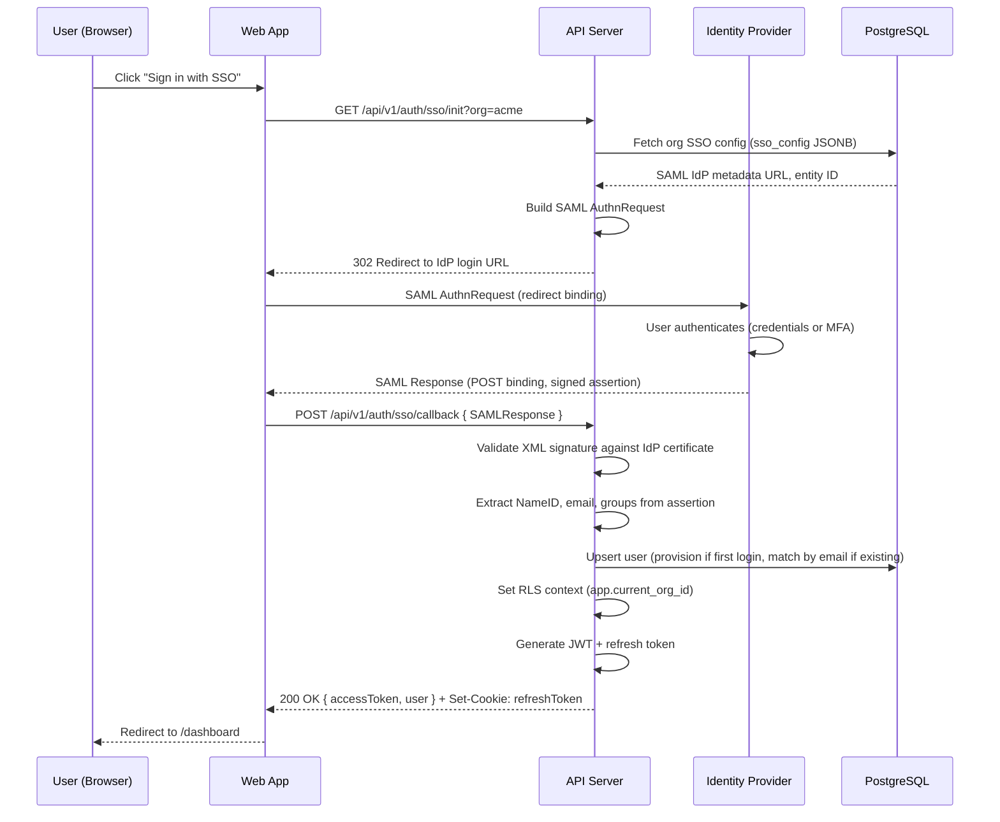

# Feature Specification: AI Fluency Platform -- Foundation

**Product**: ai-fluency
**Feature Branch**: `feature/ai-fluency/foundation`
**Created**: 2026-03-02
**Updated**: 2026-03-06 (CLARIFY-01 -- resolves 5 implementation-blocking ambiguities: dimension weights, RBAC model, signup flow, retake policy, session timeout)
**Status**: Approved
**Input**: CEO brief: "Create a product for AI fluency following Anthropic's latest 4D assessment"
**BA Reference**: `products/ai-fluency/docs/business-analysis.md` (BA-01 v2.0)

---

## Business Context

### Problem Statement

Organizations lack a standardized, empirically-validated method to assess and develop their workforce's AI fluency. Current approaches to AI training are fragmented, subjective, and disconnected from measurable behavioral outcomes. Nearly two in three leaders report a data or AI skills gap within their organization (DataCamp 2026), only 35% of organizations have a mature workforce-wide upskilling program, and AI skills command a 56% wage premium (PwC). The cost of inaction compounds: organizations that do NOT invest in AI workforce development forfeit a 40-60% improvement in AI initiative success rates that investing organizations achieve.

No existing platform implements Anthropic's peer-reviewed 4D AI Fluency Framework (Delegation, Description, Discernment, Diligence) with its 24 empirically-validated behavioral indicators (11 observable, 13 unobservable) derived from analysis of 9,830 real conversations. Three converging forces make the timing optimal:

1. **Anthropic's AI Fluency Index** (published February 23, 2026) provides the empirical behavioral data that powers scoring algorithms
2. **The US Department of Labor AI Literacy Framework** (published February 13, 2026) creates federal-level mandate for AI literacy programs
3. **Enterprise AI platform market** growing at 27.7% CAGR toward $50.3B by 2030

This is a blue-ocean opportunity: the intersection of "validated assessment framework" + "behavioral measurement" + "personalized remediation" + "enterprise analytics" + "DOL alignment" is unoccupied by any competitor.

### Target Users

| Persona | Role | Pain Point | Expected Outcome |
|---------|------|-----------|-----------------|
| Lisa (L&D Manager) | Enterprise Learning & Development | No standardized way to measure team AI competency; relies on subjective manager assessments; cannot demonstrate training ROI | Data-driven AI fluency metrics per team member, department, and organization; DOL-aligned reporting |
| Alex (Individual Learner) | Knowledge Worker / Professional | Lacks structured guidance on effective AI interaction; does not know personal strengths and gaps across AI fluency dimensions | Personalized fluency profile with targeted learning path ordered by weakest dimension |
| Prof. Sarah (University Instructor) | Higher Education Faculty | No validated assessment framework for grading AI fluency in coursework; existing tools test knowledge, not behavioral fluency | Assign standardized 4D assessments with gradeable results via LMS integration |
| David (C-Suite Executive) | VP/CTO/CLO | Cannot quantify AI readiness or justify training investment with data; lacks benchmarking against industry peers | Organizational dashboard with aggregate fluency scores, ROI metrics, and quarterly reports |
| Raj (IT Administrator) | Enterprise IT | Security and compliance concerns with new SaaS tools; SSO and data residency requirements; multi-tenant isolation mandated by security team | SAML/OIDC SSO, PostgreSQL RLS-based multi-tenant data isolation, configurable data retention |
| Maria (Government Program Admin) | Federal/State Workforce Agency | Must align training programs with DOL AI Literacy Framework; needs to report compliance with federal standards | DOL content area mapping, delivery principle alignment reporting |

### Business Value

- **Revenue Impact**: $500K ARR target from 20 enterprise customers at ~$25K average within 12 months of GA. Secondary revenue from higher education ($10-50K/year) and government segments ($25-100K/year).
- **User Retention**: Longitudinal tracking and recertification create recurring engagement; target 50%+ return for second assessment. Learning paths convert one-time assessments to ongoing engagement.
- **Competitive Position**: First-to-market with Anthropic's validated 4D framework as interactive assessments. No competitor (iMocha, DataCamp, Udemy Business, Degreed, Anthropic Academy) implements behavioral indicator scoring.
- **Strategic Alignment**: Extends ConnectSW's portfolio into the $15-20B enterprise skills assessment sub-segment. DOL AI Literacy Framework alignment positions platform for government procurement.

### Business Need Traceability

| Business Need | ID | Priority | User Stories |
|---------------|----|----------|-------------|
| 4D Framework Assessment | BN-001 | P0 | US-01, US-02 |
| 24 Behavioral Indicators (11 observable + 13 unobservable) | BN-002 | P0 | US-03, US-04 |
| Personalized Learning Paths | BN-003 | P0 | US-05, US-06 |
| Role-Specific Assessments | BN-004 | P1 | US-07, US-08 |
| Organizational Dashboards | BN-005 | P1 | US-09, US-10 |
| Discernment Gap Training | BN-006 | P1 | US-11, US-12 |
| Three Interaction Modes (Automation, Augmentation, Agency) | BN-007 | P1 | US-13 |
| Enterprise SSO + LMS Integration | BN-008 | P1 | US-14, US-15 |
| Certification and Credentialing | BN-009 | P2 | US-16, US-17 |
| Multi-Tenant Data Isolation | BN-010 | P0 | US-18 |
| Longitudinal Analytics | BN-011 | P1 | US-19, US-20 |
| GDPR/CCPA Compliance | BN-012 | P1 | US-21, US-22 |
| DOL AI Literacy Framework Alignment | BN-013 | P1 | US-23, US-24 |

---

## System Context (C4 Level 1)

```mermaid
graph TD
    subgraph Users
        learner[Individual Learner<br/>Takes assessments, follows learning paths]
        ldm[L&D Manager<br/>Manages teams, views dashboards]
        exec[C-Suite Executive<br/>Views org-level analytics]
        instructor[University Instructor<br/>Assigns assessments, grades fluency]
        itadmin[IT Administrator<br/>Configures SSO, manages data policies]
        govadmin[Government Program Admin<br/>DOL compliance reporting]
    end

    subgraph AI Fluency Platform
        web[Web Application<br/>Next.js 14+ / Port 3118]
        api[API Server<br/>Fastify / Port 5014]
        db[(PostgreSQL<br/>Assessment data, user profiles<br/>RLS-enforced multi-tenancy)]
        cache[(Redis<br/>Session cache, rate limiting<br/>BullMQ job queues)]
    end

    subgraph External Systems
        idp[Identity Provider<br/>SAML 2.0 / OIDC SSO]
        lms[LMS Platforms<br/>Canvas, Moodle, Blackboard<br/>via LTI 1.3 / SCORM]
        email[Email Service<br/>SendGrid / Postmark]
        analytics[Product Analytics<br/>PostHog / Mixpanel]
        badges[Badgr<br/>Open Badges v3 issuance]
    end

    learner -->|Takes assessments| web
    ldm -->|Manages teams, views reports| web
    exec -->|Views org dashboard| web
    instructor -->|Assigns assessments| web
    itadmin -->|Configures SSO/policies| web
    govadmin -->|Views DOL compliance| web

    web -->|API calls| api
    api -->|Read/Write with RLS| db
    api -->|Cache + Job Queue| cache
    api -->|Authenticate| idp
    api -->|Send notifications| email
    api -->|Track events| analytics
    api -->|Issue badges| badges
    lms -->|LTI 1.3 launch + grade passback| api
```

### Assessment Flow (Sequence Diagram)

```mermaid
sequenceDiagram
    participant L as Learner
    participant W as Web App
    participant A as API Server
    participant S as Scoring Engine
    participant D as PostgreSQL
    participant R as Redis

    L->>W: Click "Start Assessment"
    W->>A: POST /api/v1/assessment-sessions
    A->>D: Create session (status: IN_PROGRESS)
    A->>D: Fetch questions for template
    A-->>W: Session ID + first question batch
    W-->>L: Display first question

    loop For each question (32 total)
        L->>W: Select answer
        W->>A: POST /api/v1/responses
        A->>D: Save response
        A-->>W: Next question + progress
        W-->>L: Update progress bar
    end

    L->>W: Submit final answer
    W->>A: POST /api/v1/assessment-sessions/:id/complete
    A->>S: Calculate scores (pure function)
    S->>S: Apply prevalence weights
    S->>S: Compute dimension scores (0-100)
    S->>S: Detect discernment gap
    S-->>A: ScoredProfile
    A->>D: Save FluencyProfile
    A->>R: Queue badge issuance (if threshold met)
    A-->>W: Fluency profile data
    W-->>L: Display radar chart + scores
```

### User Journey Flowchart

```mermaid
flowchart TD
    A[Learner Signs Up / SSO Login] --> B[Landing Dashboard]
    B --> C{Has Completed Assessment?}
    C -->|No| D[Start Assessment CTA]
    C -->|Yes| E[View Fluency Profile]

    D --> F[Select Assessment Type]
    F --> G[Role-Specific Template?]
    G -->|Yes - assigned by manager| H[Role-Contextualized Questions]
    G -->|No - default| I[Standard 4D Questions]
    H --> J[Complete 32 Questions<br/>~25 minutes]
    I --> J

    J --> K{Network Issue?}
    K -->|Yes| L[Auto-Save Progress<br/>Resume Later]
    K -->|No| M[Submit Assessment]
    L --> J

    M --> N[Scoring Engine Calculates]
    N --> O[View Fluency Profile<br/>Radar Chart + Scores]
    O --> P{Discernment Gap?}
    P -->|Yes| Q[Priority: Discernment Gap Module]
    P -->|No| R[Standard Learning Path]
    Q --> S[Personalized Learning Path]
    R --> S

    S --> T[Complete Learning Modules]
    T --> U[Track Progress on Dashboard]
    U --> V{All Modules Done?}
    V -->|No| T
    V -->|Yes| W[Take Reassessment]
    W --> X[Compare Before/After Scores]
    X --> Y{Score >= Certification Threshold?}
    Y -->|Yes| Z[Earn Digital Badge + Certificate]
    Y -->|No| S

    E --> S
```

---

## User Scenarios & Testing

### US-01 -- Take 4D Framework Assessment (Priority: P0)

**As a** learner, **I want to** take an interactive assessment that evaluates my AI fluency across Delegation, Description, Discernment, and Diligence dimensions, **so that** I understand my strengths and gaps.

The learner logs in, selects "Start Assessment," and is presented with a series of scenario-based questions organized by the 4 dimensions. Each scenario presents a realistic AI interaction situation and asks the learner to choose the most fluent response or evaluate an AI output. The assessment covers all 4 dimensions with 8 questions per dimension (32 total, ~25 minutes). Progress is shown throughout. On completion, a summary screen displays results.

**Why this priority**: Core product functionality -- without assessments, there is no product. *Traces to: BN-001*

**Independent Test**: Can be tested by creating a test user, starting an assessment, completing all questions, and verifying a result is generated with per-dimension scores.

**Acceptance Criteria**:

1. **Given** a logged-in learner with no active assessment, **When** the learner clicks "Start Assessment," **Then** the system creates a new assessment session and displays the first question within 2 seconds.
2. **Given** a learner mid-assessment, **When** the learner answers a question, **Then** the system records the response, advances to the next question, and updates the progress indicator.
3. **Given** a learner who has answered all questions, **When** the assessment is complete, **Then** the system calculates dimension scores using prevalence-weighted scoring and displays a fluency profile within 3 seconds.
4. **Given** a learner mid-assessment, **When** the learner closes the browser, **Then** the system saves progress and allows resumption from the last unanswered question on next login.
5. **Given** an invalid or missing response, **When** the learner attempts to advance, **Then** the system displays a validation error and does not advance.

---

### US-02 -- View Fluency Profile (Priority: P0)

**As a** learner, **I want to** receive a detailed fluency profile showing my score per dimension with behavioral indicator breakdowns, **so that** I know exactly where to improve.

After completing an assessment, the learner sees a profile page with: overall fluency score (0-100), individual scores for each of the 4 dimensions, breakdown of the 11 observable and 13 unobservable behavioral indicators with pass/fail/partial status, and comparison to aggregate benchmarks. Observed and self-reported scores are displayed separately per CLARIFY-01 resolution.

**Why this priority**: Assessment results are the core value proposition -- without clear, actionable results, assessments have no purpose. *Traces to: BN-001*

**Independent Test**: Complete an assessment and verify the profile page displays all 4 dimension scores, the overall score, and behavioral indicator breakdowns.

**Acceptance Criteria**:

1. **Given** a completed assessment, **When** the learner views their fluency profile, **Then** the system displays an overall fluency score (0-100), 4 dimension scores (0-100 each), and a radar chart visualization.
2. **Given** a completed assessment, **When** the learner expands a dimension, **Then** the system displays the individual behavioral indicators under that dimension with pass/fail/partial status and the learner's specific responses.
3. **Given** a learner with no completed assessments, **When** the learner navigates to the profile page, **Then** the system displays a prompt to take their first assessment with a "Start Assessment" CTA.

---

### US-03 -- Prevalence-Weighted Scoring Engine (Priority: P0)

**As an** assessment engine, **I want to** evaluate 11 observable behaviors using prevalence-weighted scoring, **so that** scores reflect the relative difficulty and rarity of each behavior.

The scoring engine weights each observable behavior inversely to its prevalence rate from Anthropic's research (e.g., "Verifying facts" at 8.7% prevalence gets weight 5.0; "Iterative improvement" at 85.7% gets weight 1.0). The total score normalizes to 0-100 per dimension. The scoring engine is a pure function -- takes inputs, returns ScoredProfile, no DB writes. Algorithm version is stored per session for immutability.

**Why this priority**: Scoring credibility is foundational to product value. *Traces to: BN-002*

**Independent Test**: Submit a set of known responses and verify the computed scores match expected prevalence-weighted calculations.

**Acceptance Criteria**:

1. **Given** a completed assessment with all questions answered, **When** the scoring engine processes the responses, **Then** it applies prevalence-weighted scoring where rarer behaviors (lower prevalence) receive higher weights.
2. **Given** a set of test responses with known expected outcomes, **When** the scoring engine calculates scores, **Then** each dimension score falls within 0-100 and the overall score is the equally-weighted average of dimension scores (each dimension weighted 0.25; per CLARIFY-01 resolution #4).
3. **Given** an assessment with partial responses (save-and-resume), **When** the scoring engine is invoked, **Then** it scores only completed sections and marks incomplete dimensions as "In Progress."

---

### US-04 -- Self-Report for Unobservable Behaviors (Priority: P0)

**As a** learner, **I want to** complete scenario-based self-assessment questions for the 13 unobservable behaviors (ethics, disclosure, consequences), **so that** my full fluency profile is captured.

The 13 unobservable behaviors (e.g., being honest about AI's role, considering downstream consequences) cannot be directly observed in AI conversations. The platform uses validated self-report instruments with Likert-scale and scenario-based questions to assess these behaviors. Per CLARIFY-01 resolution, self-reported scores are displayed separately from observed-behavior scores.

**Why this priority**: Without unobservable behaviors, the assessment covers only 11 of 24 indicators -- an incomplete fluency profile. *Traces to: BN-002*

**Independent Test**: Complete the self-report section and verify all 13 unobservable behaviors are assessed and included in the fluency profile.

**Acceptance Criteria**:

1. **Given** a learner in the assessment flow, **When** the learner reaches the self-report section, **Then** the system presents scenario-based questions covering all 13 unobservable behaviors grouped by dimension.
2. **Given** a self-report question, **When** the learner selects a response on the Likert scale (1-5), **Then** the system records the response and maps it to the corresponding behavioral indicator.
3. **Given** a completed self-report section, **When** scores are calculated, **Then** self-reported scores are displayed separately from observed-behavior scores with a clear "Self-Reported" label to maintain transparency.

---

### US-05 -- Personalized Learning Path (Priority: P0)

**As a** learner, **I want to** receive a personalized learning path based on my assessment results that prioritizes my weakest dimensions, **so that** I improve efficiently.

After viewing their fluency profile, the learner clicks "Start Learning Path." The system generates a sequence of learning modules ordered by dimension weakness (lowest-scoring dimension first). Each module contains educational content, practice exercises, and a mini-assessment to verify improvement.

**Why this priority**: Assessment without training is a dead end. Learning paths drive retention and recurring engagement. Research shows training increases AI adoption from 25% to 76%. *Traces to: BN-003*

**Independent Test**: Complete an assessment with deliberately low scores in Discernment, verify the learning path starts with Discernment modules.

**Acceptance Criteria**:

1. **Given** a learner with a completed assessment, **When** the learner clicks "Start Learning Path," **Then** the system generates a learning path with modules ordered by dimension score (lowest first) within 2 seconds.
2. **Given** a learning path in progress, **When** the learner completes a module, **Then** the system marks it complete, updates progress (percentage), and unlocks the next module.
3. **Given** a learner who has completed all modules in a dimension, **When** the learner takes a mini-reassessment, **Then** the updated score is reflected in the fluency profile alongside the original score to show improvement.
4. **Given** a learner with all dimensions scoring above 80, **When** a learning path is generated, **Then** the system recommends "Advanced" modules focusing on the discernment gap and agency-mode interactions.

---

### US-06 -- Track Learning Progress (Priority: P0)

**As a** learner, **I want to** track my progress through learning modules and see my fluency scores update as I complete training, **so that** I stay motivated.

The learner's dashboard shows a progress summary: modules completed, time invested, dimension scores over time (line chart), and badges earned.

**Why this priority**: Progress visualization drives engagement and completion rates. *Traces to: BN-003*

**Independent Test**: Complete 3 learning modules and verify the dashboard reflects accurate progress and score changes.

**Acceptance Criteria**:

1. **Given** a learner with an active learning path, **When** the learner views their dashboard, **Then** the system displays modules completed (count and percentage), time invested, and a line chart of dimension scores over time.
2. **Given** a learner who completes a module, **When** the dashboard refreshes, **Then** the progress metrics update within 5 seconds without requiring a full page reload.
3. **Given** a learner with no learning activity in 7 days, **When** 7 days elapse, **Then** the system sends a reminder email with current progress and next recommended module.

---

### US-07 -- Role-Specific Assessment Templates (Priority: P1)

**As an** L&D manager, **I want to** select role-specific assessment templates (developer, analyst, manager, marketer), **so that** assessments are relevant to each team member's work context.

L&D managers access a template library with pre-built role profiles. Each template emphasizes behavioral indicators most relevant to that role (e.g., developers: higher weight on Description and Delegation; managers: higher weight on Discernment and Diligence).

**Why this priority**: Role relevance increases assessment adoption and credibility within organizations. *Traces to: BN-004*

**Independent Test**: Select "Developer" template, verify assessment questions are weighted toward Description and Delegation scenarios.

**Acceptance Criteria**:

1. **Given** an L&D manager creating a team assessment, **When** the manager selects a role template from the library, **Then** the system displays at least 4 role templates (Developer, Analyst, Manager, Marketer) with descriptions of emphasis areas.
2. **Given** a selected role template, **When** the assessment is generated, **Then** scenario questions are contextualized to the selected role and behavioral indicator weights are adjusted per template configuration.
3. **Given** a role template not in the library, **When** the L&D manager clicks "Custom Template," **Then** the system allows custom weight configuration per dimension with a preview of the resulting assessment balance.

---

### US-08 -- Role-Contextualized Assessment Experience (Priority: P1)

**As a** learner, **I want to** take an assessment customized for my role that emphasizes the behavioral indicators most relevant to my job function, **so that** results are actionable in my daily work.

**Why this priority**: Role-contextualized scenarios increase assessment validity and learner engagement. *Traces to: BN-004*

**Acceptance Criteria**:

1. **Given** a learner assigned a role-specific assessment, **When** the learner starts the assessment, **Then** scenarios reflect the assigned role's context (e.g., developer scenarios involve code review with AI, not marketing copy).
2. **Given** a completed role-specific assessment, **When** the learner views results, **Then** the profile indicates which role template was used and highlights role-relevant strengths and gaps.

---

### US-09 -- Organizational Dashboard (Priority: P1)

**As a** C-suite executive, **I want to** view an organizational dashboard showing aggregate AI fluency scores by department, role, and dimension, **so that** I make data-driven training investment decisions.

**Why this priority**: Enterprise buyers require executive-level visibility to justify purchasing decisions. *Traces to: BN-005*

**Independent Test**: Create an organization with 10+ users who have completed assessments, verify dashboard shows aggregate scores by department and dimension.

**Acceptance Criteria**:

1. **Given** an executive with org-admin role, **When** the executive views the organizational dashboard, **Then** the system displays aggregate fluency scores filterable by department, role, and dimension with bar and radar chart visualizations.
2. **Given** an organization with fewer than 5 assessment completions, **When** the executive views the dashboard, **Then** the system displays "Insufficient data -- at least 5 completed assessments required" instead of potentially misleading aggregate scores.
3. **Given** an organization with 20+ completed assessments, **When** the executive selects a date range filter, **Then** the dashboard displays fluency trend data for the selected period.

---

### US-10 -- Team Fluency Trends (Priority: P1)

**As an** L&D manager, **I want to** view team-level fluency trends over time and compare against benchmarks, **so that** I measure training program effectiveness.

**Why this priority**: Training ROI requires before/after measurement; longitudinal data proves program effectiveness. *Traces to: BN-005*

**Acceptance Criteria**:

1. **Given** an L&D manager with a team of 5+ learners, **When** the manager views the team dashboard, **Then** the system displays average team fluency scores per dimension, individual member progress, and a trend line over time.
2. **Given** a team with pre- and post-training assessments, **When** the manager views improvement metrics, **Then** the system calculates and displays percentage improvement per dimension with statistical significance indicators when sample size >= 30.

---

### US-11 -- Discernment Gap Training (Priority: P1)

**As a** learner flagged with a discernment gap, **I want to** receive targeted training on questioning AI reasoning and identifying missing context, **so that** I develop critical evaluation skills.

Anthropic's research found that users are less likely to question AI reasoning (-3.1pp) or identify missing context (-5.2pp) when AI produces artifacts. This targeted training addresses that specific gap -- the single largest fluency weakness identified in the AI Fluency Index.

**Why this priority**: Addresses the most impactful fluency weakness identified in Anthropic's research. *Traces to: BN-006*

**Acceptance Criteria**:

1. **Given** a learner whose Discernment dimension score is below 50 AND whose "Question AI reasoning" and "Identify missing context" indicators are both "Fail," **When** the learning path is generated, **Then** the system inserts a "Discernment Gap" priority module before other learning content.
2. **Given** a learner in the Discernment Gap module, **When** the learner completes an exercise, **Then** the exercise involves evaluating AI-generated artifacts for errors, missing context, or flawed reasoning.

---

### US-12 -- Discernment Gap Tracking for Managers (Priority: P1)

**As an** L&D manager, **I want to** see which learners have discernment gaps and track improvement after targeted training, **so that** I address the most impactful fluency weakness.

**Why this priority**: Managers need visibility into the most common and impactful fluency gap. *Traces to: BN-006*

**Acceptance Criteria**:

1. **Given** an L&D manager viewing the team dashboard, **When** the manager selects "Discernment Gap Analysis," **Then** the system displays a list of team members flagged with discernment gaps, their current Discernment scores, and improvement trend since targeted training began.

---

### US-13 -- Three Interaction Mode Assessment (Priority: P1)

**As a** learner, **I want to** complete assessment scenarios that cover Automation, Augmentation, and Agency interaction modes, **so that** my fluency is measured across all AI interaction types.

The 4D framework defines three distinct interaction modalities: Automation (AI executes human-specified tasks), Augmentation (human-AI collaboration as thinking partners), and Agency (human configures AI for independent future action). Assessments MUST cover all three to be comprehensive.

**Why this priority**: Comprehensive fluency measurement requires coverage of all interaction modalities. *Traces to: BN-007*

**Acceptance Criteria**:

1. **Given** a learner taking an assessment, **When** the assessment includes all three modes, **Then** each mode (Automation, Augmentation, Agency) has at least 2 scenario questions and results show fluency per mode.
2. **Given** a completed assessment, **When** the learner views results, **Then** the profile displays a breakdown by interaction mode alongside the 4D dimension breakdown.

---

### US-14 -- Enterprise SSO Configuration (Priority: P1)

**As an** IT administrator, **I want to** configure SAML/OIDC SSO for my organization, **so that** employees use existing credentials.

**Why this priority**: Enterprise adoption requires frictionless authentication. *Traces to: BN-008*

**Acceptance Criteria**:

1. **Given** an IT admin in organization settings, **When** the admin configures SAML SSO with IdP metadata URL, **Then** the system validates the configuration and enables SSO login within 30 seconds.
2. **Given** SSO is configured, **When** an employee visits the login page, **Then** the system displays a "Sign in with SSO" option alongside email/password login.
3. **Given** an invalid SSO configuration, **When** a user attempts SSO login, **Then** the system displays a specific error message and falls back to email/password login.

---

### US-15 -- LMS Integration via LTI/SCORM (Priority: P1)

**As an** L&D manager, **I want to** integrate AI Fluency assessments into our LMS via SCORM/LTI, **so that** results appear in existing learning records.

**Why this priority**: Integration with existing L&D infrastructure is required for enterprise adoption. *Traces to: BN-008*

**Acceptance Criteria**:

1. **Given** an organization with LMS integration configured, **When** a learner launches the assessment from the LMS, **Then** the system authenticates via LTI and returns results to the LMS grade book on completion.
2. **Given** an LTI launch request with invalid credentials, **When** the system processes the request, **Then** it returns an LTI error response and logs the failed attempt.

---

### US-16 -- Digital Badges and Certification (Priority: P2)

**As a** learner, **I want to** earn a digital badge and certificate when I achieve fluency milestones, **so that** I demonstrate my AI competency to employers.

**Why this priority**: Certifications create individual motivation, employer signaling value, and recurring revenue through recertification. *Traces to: BN-009*

**Acceptance Criteria**:

1. **Given** a learner whose overall fluency score exceeds the certification threshold (configurable, default 70), **When** the score is confirmed, **Then** the system generates a digital badge (Open Badges v3 format) and a downloadable PDF certificate.
2. **Given** a learner with a certificate, **When** the certificate validity period expires (configurable, default 12 months), **Then** the system sends a recertification reminder email 30 days before expiry.

---

### US-17 -- Certification Configuration (Priority: P2)

**As an** organization admin, **I want to** configure certification thresholds and recertification periods, **so that** credentials remain current.

**Why this priority**: Enterprise buyers need configurable credentialing to align with their internal competency standards. *Traces to: BN-009*

**Acceptance Criteria**:

1. **Given** an org admin in settings, **When** the admin sets a custom certification threshold (e.g., 80), **Then** all future certifications for that organization use the new threshold.

---

### US-18 -- Multi-Tenant Data Isolation (Priority: P0)

**As an** IT administrator, **I want to** verify that my organization's data is completely isolated from other tenants, **so that** we meet security and compliance requirements.

**Why this priority**: Enterprise customers require tenant isolation as a non-negotiable security requirement. Multi-tenancy is a prerequisite for B2B SaaS. *Traces to: BN-010*

**Independent Test**: Create two organizations, submit assessments for both, verify that API calls from Org A cannot access Org B's data under any query permutation.

**Acceptance Criteria**:

1. **Given** two organizations (Org A and Org B) in the system, **When** a user from Org A queries assessment data, **Then** the API returns ONLY Org A's data -- verified by PostgreSQL Row Level Security (RLS) policies.
2. **Given** a user from Org A, **When** the user attempts to access Org B's data via direct API manipulation (e.g., changing org_id in request), **Then** the system returns 403 Forbidden and logs the attempt.
3. **Given** multi-tenant isolation is enabled, **When** a new organization is created, **Then** the system automatically provisions RLS policies for the new tenant within the same transaction.

---

### US-19 -- Longitudinal Fluency Trends (Priority: P1)

**As an** L&D manager, **I want to** view longitudinal fluency trends for individuals and teams over 3-12 months, **so that** I quantify training ROI.

**Why this priority**: Training ROI requires before/after measurement over time. *Traces to: BN-011*

**Acceptance Criteria**:

1. **Given** a learner with 2+ completed assessments over 3+ months, **When** the manager views the learner's longitudinal report, **Then** the system displays a line chart of fluency scores over time with dimension breakdowns.

---

### US-20 -- Quarterly Fluency Report (Priority: P1)

**As a** C-suite executive, **I want to** generate a quarterly AI fluency report showing organization-wide improvement, **so that** I justify continued investment.

**Why this priority**: Executive reporting is required to justify ongoing budget allocation. *Traces to: BN-011*

**Acceptance Criteria**:

1. **Given** an organization with 3+ months of assessment data, **When** the executive clicks "Generate Quarterly Report," **Then** the system produces a PDF report with aggregate scores, trends, department comparisons, and ROI metrics within 10 seconds.

---

### US-21 -- Data Privacy Management (Priority: P1)

**As a** learner, **I want to** manage my data privacy preferences and exercise my right to data erasure, **so that** my personal information is protected.

**Why this priority**: GDPR/CCPA compliance is required for enterprise sales and regulatory compliance. *Traces to: BN-012*

**Acceptance Criteria**:

1. **Given** a logged-in learner, **When** the learner navigates to Privacy Settings and clicks "Delete My Data," **Then** the system schedules a hard delete of all personal data within 30 days (GDPR Article 17 compliance) and sends a confirmation email.
2. **Given** a data deletion request, **When** 30 days elapse, **Then** all personal data is permanently deleted; anonymized aggregate statistics are retained.

---

### US-22 -- Data Residency and Retention Policies (Priority: P1)

**As an** IT administrator, **I want to** configure data residency and retention policies for my organization, **so that** we comply with regional regulations.

**Why this priority**: Regional data regulations (GDPR, CCPA) require configurable retention and residency. *Traces to: BN-012*

**Acceptance Criteria**:

1. **Given** an IT admin in organization settings, **When** the admin configures data retention to 24 months, **Then** the system automatically archives or deletes data older than the configured period.

---

### US-23 -- DOL AI Literacy Framework Content Mapping (Priority: P1)

**As an** L&D manager, **I want to** view a mapping between assessment content and DOL AI Literacy Framework content areas, **so that** I report compliance with federal workforce development standards.

The US Department of Labor published its AI Literacy Framework (Training and Employment Notice 07-25) on February 13, 2026, establishing five foundational content areas. The AI Fluency platform maps its 4D assessment dimensions to these DOL content areas, enabling organizations to report DOL compliance.

**Why this priority**: DOL framework creates compliance-driven demand; alignment positions platform for government procurement and DOL-funded workforce programs. *Traces to: BN-013*

**Independent Test**: Navigate to the DOL Alignment page, verify all five DOL content areas are mapped to 4D dimensions with coverage percentages.

**Acceptance Criteria**:

1. **Given** an L&D manager on the compliance reporting page, **When** the manager selects "DOL AI Literacy Framework Alignment," **Then** the system displays a mapping table showing each of the 5 DOL content areas mapped to the corresponding 4D framework dimensions with coverage indicators.
2. **Given** an organization with completed assessments, **When** the manager views the DOL alignment report, **Then** the system displays aggregate assessment scores organized by DOL content area (derived from the 4D dimension mapping) with exportable CSV format.
3. **Given** a DOL content area with no assessment coverage, **When** the mapping is displayed, **Then** the system marks the area as "Not Yet Assessed" with a recommendation to enable relevant assessment sections.

---

### US-24 -- DOL Delivery Principle Alignment (Priority: P1)

**As a** government program administrator, **I want to** confirm that the platform aligns with DOL delivery principles, **so that** I use it in federally-funded training programs.

The DOL AI Literacy Framework defines seven delivery principles for AI literacy programs. The AI Fluency platform implements principles 1-4 through its assessment + learning path model. Principles 5-7 are addressed through role-specific templates and organizational context customization.

**Why this priority**: Government buyers require explicit alignment with DOL delivery principles for procurement approval. *Traces to: BN-013*

**Acceptance Criteria**:

1. **Given** a government program administrator viewing the platform compliance page, **When** the admin selects "DOL Delivery Principles," **Then** the system displays all 7 DOL delivery principles with the platform's alignment status (Implemented / Partially Implemented / Planned) and evidence for each.
2. **Given** a delivery principle marked as "Partially Implemented," **When** the admin expands the principle, **Then** the system displays which platform features address the principle, what gaps remain, and the planned timeline for full alignment.

---

### Edge Cases

| # | Scenario | Expected Behavior | Priority |
|---|----------|------------------|----------|
| 1 | Learner submits assessment with network disconnect mid-submission | System retries submission 3 times; if all fail, saves locally and syncs on reconnect; no duplicate submissions created | P0 |
| 2 | Two L&D managers simultaneously modify the same role template | System uses optimistic locking; second save receives a conflict error with option to merge or overwrite | P1 |
| 3 | Assessment scoring algorithm is updated while learners have in-progress assessments | In-progress assessments complete with the algorithm version they started with; new assessments use the updated algorithm (algorithm_version stored per session) | P0 |
| 4 | Organization has exactly 1 learner -- aggregate dashboards would expose individual data | Dashboard displays "Minimum 5 learners required for aggregate view" to prevent individual identification | P1 |
| 5 | Learner completes assessment in under 2 minutes (speed-running without reading) | System flags assessments completed below a minimum time threshold (configurable, default 10 minutes) as "Low Confidence" and excludes from org aggregates | P1 |
| 6 | SSO IdP goes down while users are mid-session | Existing sessions remain valid per JWT expiry; new logins show "SSO temporarily unavailable, try again in a few minutes" with optional email/password fallback if org allows | P1 |
| 7 | Learner attempts assessment in unsupported browser (IE11, very old Safari) | System detects browser on load and displays "Please use a modern browser" with supported browser list | P2 |
| 8 | Organization exceeds their license seat count | New user registrations for that org are blocked; L&D manager receives notification to upgrade; existing users unaffected | P1 |
| 9 | Learner takes assessment in two browser tabs simultaneously | System detects duplicate active sessions and blocks the second tab with "Assessment already in progress in another window" message | P1 |
| 10 | Data deletion request received for a user whose scores are included in org aggregates | Personal data is deleted per GDPR; anonymized scores remain in aggregates; aggregate recalculation excludes identifiable data | P1 |
| 11 | Learner attempts to start a new assessment within 24-hour cooldown period | System displays "You can retake this assessment in X hours" with the remaining cooldown time; "Start Assessment" button is disabled for that template | P0 |
| 12 | Individual self-signup user later joins an organization via SSO or admin invitation | System migrates user from personal org to the new org; personal org is archived (not deleted) to preserve historical assessment data; user role is set to `learner` in the new org | P1 |
| 13 | Admin demotes themselves from `admin` role | System prevents demotion if the user is the last `admin` in the organization; displays "At least one admin is required" error | P1 |

---

## Requirements

### Functional Requirements

- **FR-001**: System MUST present scenario-based assessment questions covering all 4 dimensions (Delegation, Description, Discernment, Diligence) with 8 questions per dimension (32 total). *Traces to: US-01, AC 1-2; BN-001*
- **FR-002**: System MUST calculate dimension scores using prevalence-weighted scoring algorithm where rarer behaviors receive higher weights. *Traces to: US-03, AC 1-2; BN-002*
- **FR-003**: System MUST generate a fluency profile with overall score (0-100), per-dimension scores (0-100), and behavioral indicator breakdowns with observed and self-reported scores displayed separately. *Traces to: US-02, AC 1-2; US-04, AC 3; BN-001, BN-002*
- **FR-004**: System MUST support save-and-resume for in-progress assessments. *Traces to: US-01, AC 4*
- **FR-005**: System MUST present self-report instruments for 13 unobservable behaviors with Likert-scale responses (1-5). *Traces to: US-04, AC 1-2; BN-002*
- **FR-006**: System MUST display self-reported scores separately from observed-behavior scores with a clear "Self-Reported" label. *Traces to: US-04, AC 3*
- **FR-007**: System MUST generate personalized learning paths ordered by weakest dimension first. *Traces to: US-05, AC 1; BN-003*
- **FR-008**: System MUST track learning module completion and update progress in real-time (within 5 seconds). *Traces to: US-06, AC 1-2; BN-003*
- **FR-009**: System MUST support role-specific assessment templates with configurable behavioral indicator weights for at least 4 roles (Developer, Analyst, Manager, Marketer). *Traces to: US-07, AC 1-3; BN-004*
- **FR-010**: System MUST display organizational aggregate fluency dashboards filterable by department, role, and dimension with minimum 5 assessment threshold. *Traces to: US-09, AC 1-3; BN-005*
- **FR-011**: System MUST implement a Discernment Gap detection algorithm that flags learners when "Question AI reasoning" AND "Identify missing context" indicators are both "Fail" AND Discernment score is below 50. *Traces to: US-11, AC 1; BN-006*
- **FR-012**: System MUST provide assessment scenarios covering all three interaction modes (Automation, Augmentation, Agency) with at least 2 questions per mode. *Traces to: US-13, AC 1; BN-007*
- **FR-013**: System MUST support SAML 2.0 and OIDC SSO configuration per organization. *Traces to: US-14, AC 1-3; BN-008*
- **FR-014**: System MUST support LTI 1.3 integration for LMS grade passback. *Traces to: US-15, AC 1; BN-008*
- **FR-015**: System MUST generate Open Badges v3 digital credentials on certification threshold achievement. *Traces to: US-16, AC 1; BN-009*
- **FR-016**: System MUST enforce multi-tenant data isolation via PostgreSQL Row Level Security on all tenant-scoped tables. *Traces to: US-18, AC 1-3; BN-010*
- **FR-017**: System MUST support GDPR Article 17 data erasure requests with 30-day hard delete and anonymized aggregate retention. *Traces to: US-21, AC 1-2; BN-012*
- **FR-018**: System MUST generate downloadable quarterly fluency reports in PDF format within 10 seconds. *Traces to: US-20, AC 1; BN-011*
- **FR-019**: System MUST send reminder emails for inactive learners (7-day threshold) and certificate expiry (30-day advance). *Traces to: US-06 AC 3, US-16 AC 2*
- **FR-020**: System MUST provide longitudinal fluency trend visualization for 3-12 month periods with per-dimension breakdowns. *Traces to: US-19, AC 1; BN-011*
- **FR-021**: System MUST display a mapping between 4D framework dimensions and DOL AI Literacy Framework five foundational content areas with coverage indicators. *Traces to: US-23, AC 1-3; BN-013*
- **FR-022**: System MUST display DOL delivery principle alignment status (Implemented / Partially Implemented / Planned) with evidence per principle. *Traces to: US-24, AC 1-2; BN-013*
- **FR-023**: System MUST calculate overall fluency score as the equally-weighted average of the four dimension scores (each dimension weight = 0.25). Role-specific templates adjust indicator weights within dimensions but do not change dimension-level weights. *Traces to: US-03, AC 2; CLARIFY-01 #4*
- **FR-024**: System MUST enforce role-based access control (RBAC) with six roles: `learner`, `manager`, `instructor`, `executive`, `admin`, `gov_admin`. Each user has exactly one role per organization. Permission boundaries are defined in CLARIFY-01 #5. *Traces to: US-18; CLARIFY-01 #5*
- **FR-025**: System MUST support dual-track signup: individual self-signup (auto-creates personal organization with `learner` role) and organization signup (creates org with `admin` role, supports email invitations and SSO auto-provisioning). *Traces to: CLARIFY-01 #6*
- **FR-026**: System MUST enforce a 24-hour cooldown between assessment retakes of the same template type. Unlimited retakes are permitted. The most recent non-low-confidence score is used for certification eligibility and dashboard aggregates. All historical scores are retained. *Traces to: US-01; CLARIFY-01 #7*
- **FR-027**: System MUST transition assessment sessions from IN_PROGRESS to PAUSED after 30 minutes of inactivity (no answer submission or navigation). A best-effort `beforeunload` pause request is also supported. Sessions transition to ABANDONED after 72 hours of inactivity from last activity timestamp. *Traces to: US-01, AC 4; CLARIFY-01 #8*

### Non-Functional Requirements

- **NFR-001**: Performance -- Assessment question load time MUST be < 500ms (p95). Scoring calculation MUST complete in < 3 seconds (p95). Dashboard aggregation MUST complete in < 5 seconds (p95) for organizations with up to 10,000 users. *Traces to: US-01 AC 1, US-02, US-09*
- **NFR-002**: Security -- All data at rest MUST be encrypted (AES-256). All data in transit MUST use TLS 1.3. Authentication MUST use JWT with refresh token rotation. SSO config secrets MUST be encrypted with AES-256-GCM. *Traces to: US-18, US-14*
- **NFR-003**: Accessibility -- Platform MUST meet WCAG 2.1 AA compliance. All assessment interactions MUST be keyboard-navigable. Screen reader support MUST cover all assessment flows. Color MUST NOT be the sole indicator of meaning. Minimum contrast ratio: 4.5:1.
- **NFR-004**: Scalability -- System MUST handle 10,000 concurrent assessment sessions with < 3 second p95 response time. Database MUST support 1M+ assessment records. Architecture MUST support horizontal scaling.
- **NFR-005**: Reliability -- Platform uptime MUST be >= 99.5%. Assessment data MUST be backed up every 6 hours with point-in-time recovery. Graceful degradation MUST be implemented for Redis unavailability.
- **NFR-006**: Internationalization -- UI MUST support English (default). Architecture MUST support future i18n (Arabic, Spanish, French) via externalized strings.
- **NFR-007**: Multi-tenancy -- Each organization's data MUST be isolated via PostgreSQL RLS. Cross-tenant data leakage MUST be impossible at the database level. RLS MUST be enforced on all tenant-scoped tables listed in addendum. *Traces to: US-18, BN-010*
- **NFR-008**: Compliance -- System MUST support GDPR and CCPA data subject requests. Data retention MUST be configurable per organization (minimum 3 years default, deletable on request). *Traces to: US-21, US-22, BN-012*
- **NFR-009**: Licensing -- All assessment content MUST comply with CC BY-NC-SA 4.0 attribution requirements. Framework attribution to Dakan, Feller, and Anthropic MUST be visible on all assessment pages. *Traces to: BR-001*

### Key Entities

| Entity | Description | Key Attributes | Relationships |
|--------|-------------|---------------|---------------|
| Organization | Enterprise tenant | id, name, slug, sso_config, data_retention_days, cert_threshold, cert_validity_months | Has many Users, Teams, AssessmentTemplates |
| User | Individual user with one of six roles: `learner`, `manager`, `instructor`, `executive`, `admin`, `gov_admin` (per CLARIFY-01 #5). One role per user per organization. | id, org_id, email, name, role, last_login | Belongs to Organization, has many AssessmentSessions |
| Team | Department/group within org | id, org_id, name, manager_id | Belongs to Organization, has many Users |
| AssessmentTemplate | Role-specific assessment config | id, org_id, name, role_type, dimension_weights, is_default | Belongs to Organization, has many AssessmentSessions |
| AssessmentSession | Single assessment attempt | id, user_id, template_id, algorithm_version_id, status, started_at, completed_at, is_low_confidence | Belongs to User and Template, has many Responses |
| Question | Assessment question (global) | id, dimension, mode, behavior_indicator, type, content, prevalence_weight | Has many Responses |
| BehavioralIndicator | One of 24 indicators (global) | id, name, dimension, is_observable, prevalence_rate, weight | Referenced by Questions |
| Response | User answer to a question | id, session_id, question_id, answer, score | Belongs to Session and Question |
| FluencyProfile | Computed assessment result | id, session_id, overall_score, delegation_score, description_score, discernment_score, diligence_score, indicator_breakdown, is_low_confidence, discernment_gap | Belongs to AssessmentSession |
| AlgorithmVersion | Scoring algorithm version (global) | id, version, weights_config, created_at | Referenced by AssessmentSessions |
| LearningPath | Personalized learning plan | id, user_id, profile_id, status, modules_total, modules_completed | Belongs to User and FluencyProfile |
| LearningModule | Individual training module (global) | id, dimension, title, content_type, duration_minutes, display_order | Has many ModuleCompletions |
| ModuleCompletion | Record of module completion | id, path_id, module_id, completed_at, score | Belongs to LearningPath and LearningModule |
| Certificate | Earned credential | id, user_id, profile_id, issued_at, expires_at, badge_url | Belongs to User and FluencyProfile |
| AuditLog | Activity tracking | id, org_id, user_id, action, resource_type, resource_id, metadata, created_at | Belongs to Organization and User |
| DOLMapping | DOL content area to 4D mapping (global) | id, dol_content_area, dimension, coverage_level, evidence | Referenced by compliance reports |

### Data Model

```mermaid
erDiagram
    Organization {
        uuid id PK
        string name
        string slug UK
        jsonb sso_config
        int data_retention_days
        int cert_threshold
        int cert_validity_months
        timestamp created_at
    }
    User {
        uuid id PK
        uuid org_id FK
        string email UK
        string name
        string role
        string password_hash
        timestamp last_login
        timestamp created_at
    }
    Team {
        uuid id PK
        uuid org_id FK
        string name
        uuid manager_id FK
    }
    AssessmentTemplate {
        uuid id PK
        uuid org_id FK
        string name
        string role_type
        jsonb dimension_weights
        boolean is_default
    }
    AlgorithmVersion {
        uuid id PK
        string version
        jsonb weights_config
        timestamp created_at
    }
    AssessmentSession {
        uuid id PK
        uuid user_id FK
        uuid template_id FK
        uuid algorithm_version_id FK
        string status
        boolean is_low_confidence
        timestamp started_at
        timestamp completed_at
    }
    BehavioralIndicator {
        uuid id PK
        string name
        string dimension
        boolean is_observable
        float prevalence_rate
        float weight
    }
    Question {
        uuid id PK
        string dimension
        string mode
        string behavior_indicator
        string type
        jsonb content
        float prevalence_weight
    }
    Response {
        uuid id PK
        uuid session_id FK
        uuid question_id FK
        jsonb answer
        float score
    }
    FluencyProfile {
        uuid id PK
        uuid session_id FK
        float overall_score
        float delegation_score
        float description_score
        float discernment_score
        float diligence_score
        jsonb indicator_breakdown
        boolean is_low_confidence
        boolean discernment_gap
    }
    LearningPath {
        uuid id PK
        uuid user_id FK
        uuid profile_id FK
        string status
        int modules_total
        int modules_completed
    }
    LearningModule {
        uuid id PK
        string dimension
        string title
        string content_type
        int duration_minutes
        int display_order
    }
    ModuleCompletion {
        uuid id PK
        uuid path_id FK
        uuid module_id FK
        timestamp completed_at
        float score
    }
    Certificate {
        uuid id PK
        uuid user_id FK
        uuid profile_id FK
        timestamp issued_at
        timestamp expires_at
        string badge_url
    }
    AuditLog {
        uuid id PK
        uuid org_id FK
        uuid user_id FK
        string action
        string resource_type
        uuid resource_id
        jsonb metadata
        timestamp created_at
    }
    DOLMapping {
        uuid id PK
        string dol_content_area
        string dimension
        string coverage_level
        string evidence
    }

    Organization ||--o{ User : "has many"
    Organization ||--o{ Team : "has many"
    Organization ||--o{ AssessmentTemplate : "has many"
    Organization ||--o{ AuditLog : "has many"
    Team ||--o{ User : "contains"
    User ||--o{ AssessmentSession : "takes"
    User ||--o{ LearningPath : "follows"
    User ||--o{ Certificate : "earns"
    User ||--o{ AuditLog : "performed by"
    AssessmentTemplate ||--o{ AssessmentSession : "used by"
    AlgorithmVersion ||--o{ AssessmentSession : "scored by"
    AssessmentSession ||--o{ Response : "has many"
    Question ||--o{ Response : "answered in"
    BehavioralIndicator ||--o{ Question : "assessed by"
    AssessmentSession ||--|| FluencyProfile : "produces"
    FluencyProfile ||--o| LearningPath : "generates"
    FluencyProfile ||--o| Certificate : "qualifies"
    LearningPath ||--o{ ModuleCompletion : "tracks"
    LearningModule ||--o{ ModuleCompletion : "completed in"
```

### Assessment Session State Diagram

```mermaid
stateDiagram-v2
    [*] --> CREATED: Learner clicks Start
    CREATED --> IN_PROGRESS: First question loaded
    IN_PROGRESS --> IN_PROGRESS: Answer question
    IN_PROGRESS --> PAUSED: Browser close (beforeunload) OR 30-min idle timeout
    PAUSED --> IN_PROGRESS: Resume assessment (returns to last unanswered question)
    IN_PROGRESS --> COMPLETED: All questions answered
    COMPLETED --> SCORED: Scoring engine runs
    SCORED --> [*]

    IN_PROGRESS --> ABANDONED: No activity for 72 hours
    PAUSED --> ABANDONED: No activity for 72 hours
    ABANDONED --> [*]

    note right of SCORED
        Algorithm version locked
        at session creation.
        Profile generated on SCORED.
    end note

    note right of COMPLETED
        Low confidence flag set
        if duration < 10 minutes.
    end note

    note left of PAUSED
        30-min idle timeout
        (server-side check).
        beforeunload is best-effort.
        Per CLARIFY-01 #8.
    end note
```

---

## Site Map

Every page/route in the AI Fluency platform is listed below. Status indicates whether the route is included in the MVP (P0), deferred to Phase 2 (P1), or future (P2+). Deferred routes MUST render a page skeleton with an appropriate empty state -- never a 404 or "Coming Soon" placeholder.

| Route | Status | Description | Persona(s) |
|-------|--------|-------------|------------|
| `/` | MVP | Marketing landing page -- product overview, value proposition, CTA to signup | All (unauthenticated) |
| `/login` | MVP | Email/password login + "Sign in with SSO" button (if org has SSO configured) | All |
| `/signup` | MVP | Individual learner signup + organization signup flow | Alex, Lisa |
| `/forgot-password` | MVP | Password reset request form | All |
| `/reset-password/:token` | MVP | Password reset confirmation with new password entry | All |
| `/verify-email/:token` | MVP | Email verification callback page | All |
| `/dashboard` | MVP | Learner home -- fluency summary, active learning path, recent assessments, quick actions | Alex |
| `/assessments/new` | MVP | Start new assessment -- select template (default or role-specific if assigned) | Alex |
| `/assessments/:id` | MVP | Take assessment -- question-by-question with progress indicator, save-and-resume | Alex |
| `/assessments/:id/results` | MVP | Fluency profile -- radar chart, dimension scores (observed + self-reported separate), indicator breakdown | Alex |
| `/profile` | MVP | Assessment history -- all completed assessments with scores and dates | Alex |
| `/learning/:pathId` | MVP | Learning path overview -- module list, progress bar, time invested | Alex |
| `/learning/:pathId/modules/:id` | MVP | Module content -- lesson text, exercises, mini-assessment | Alex |
| `/certificates` | Deferred (P2) | Earned certificates and digital badges -- page skeleton with "Certificates available after Phase 2" empty state | Alex |
| `/settings` | MVP | User settings hub -- links to profile, notifications, privacy | Alex |
| `/settings/profile` | MVP | User profile editing -- name, email, password change | Alex |
| `/settings/notifications` | Deferred (P1) | Notification preferences -- page skeleton with default preferences displayed | Alex |
| `/settings/privacy` | Deferred (P1) | Data privacy management -- GDPR erasure request, data export | Alex |
| `/manager` | Deferred (P1) | Manager dashboard home -- team overview, pending assignments, quick stats | Lisa |
| `/manager/team` | Deferred (P1) | Team fluency overview -- aggregate scores per dimension, individual member list | Lisa |
| `/manager/discernment` | Deferred (P1) | Discernment gap analysis -- flagged learners, improvement trends | Lisa |
| `/manager/templates` | Deferred (P1) | Role template library -- browse, create custom templates | Lisa |
| `/manager/assign` | Deferred (P1) | Assign assessments to team members -- select template, set deadline | Lisa |
| `/manager/reports` | Deferred (P1) | Generate quarterly reports -- date range selection, PDF download | Lisa, David |
| `/manager/trends` | Deferred (P1) | Longitudinal fluency trends -- 3-12 month line charts per dimension | Lisa |
| `/admin` | Deferred (P1) | Organization admin dashboard -- org-wide fluency metrics, user count, config summary | David, Raj |
| `/admin/users` | Deferred (P1) | User management -- invite, deactivate, role assignment | Raj |
| `/admin/teams` | Deferred (P1) | Team management -- create, edit, assign managers | Raj |
| `/admin/sso` | Deferred (P1) | SSO configuration -- SAML/OIDC metadata URL, test connection | Raj |
| `/admin/lms` | Deferred (P1) | LMS integration -- LTI 1.3 configuration, SCORM package download | Raj |
| `/admin/data` | Deferred (P1) | Data retention policies -- configurable retention period, residency settings | Raj |
| `/admin/certificates` | Deferred (P2) | Certification configuration -- threshold, validity period, badge design | Raj |
| `/compliance/dol` | Deferred (P1) | DOL AI Literacy Framework alignment -- 5 content area mapping, 7 delivery principles | Lisa, Maria |
| `/help` | MVP | Help and FAQ -- assessment instructions, framework overview, contact support | All |
| `/api/docs` | MVP | API documentation (Swagger/OpenAPI) -- developer reference for integrations | Raj |

### Site Map Diagram

```mermaid
flowchart TD
    subgraph "Public (Unauthenticated)"
        landing["/"]
        login["/login"]
        signup["/signup"]
        forgot["/forgot-password"]
        reset["/reset-password/:token"]
        verify["/verify-email/:token"]
        help["/help"]
        apidocs["/api/docs"]
    end

    subgraph "Learner (Alex)"
        dash["/dashboard"]
        assess_new["/assessments/new"]
        assess_take["/assessments/:id"]
        assess_results["/assessments/:id/results"]
        profile["/profile"]
        learn_path["/learning/:pathId"]
        learn_module["/learning/:pathId/modules/:id"]
        certs["/certificates"]
        settings["/settings"]
        settings_profile["/settings/profile"]
        settings_notif["/settings/notifications"]
        settings_privacy["/settings/privacy"]
    end

    subgraph "Manager (Lisa)"
        mgr["/manager"]
        mgr_team["/manager/team"]
        mgr_disc["/manager/discernment"]
        mgr_tpl["/manager/templates"]
        mgr_assign["/manager/assign"]
        mgr_reports["/manager/reports"]
        mgr_trends["/manager/trends"]
    end

    subgraph "Admin (Raj / David)"
        admin["/admin"]
        admin_users["/admin/users"]
        admin_teams["/admin/teams"]
        admin_sso["/admin/sso"]
        admin_lms["/admin/lms"]
        admin_data["/admin/data"]
        admin_certs["/admin/certificates"]
    end

    subgraph "Compliance (Lisa / Maria)"
        dol["/compliance/dol"]
    end

    login --> dash
    login --> mgr
    login --> admin
    signup --> dash

    dash --> assess_new --> assess_take --> assess_results
    dash --> profile
    dash --> learn_path --> learn_module
    dash --> certs
    dash --> settings --> settings_profile
    settings --> settings_notif
    settings --> settings_privacy

    mgr --> mgr_team
    mgr --> mgr_disc
    mgr --> mgr_tpl
    mgr --> mgr_assign
    mgr --> mgr_reports
    mgr --> mgr_trends

    admin --> admin_users
    admin --> admin_teams
    admin --> admin_sso
    admin --> admin_lms
    admin --> admin_data
    admin --> admin_certs

    mgr --> dol
    admin --> dol

    style dash fill:#7950f2,color:#fff
    style mgr fill:#339af0,color:#fff
    style admin fill:#ff922b,color:#fff
    style dol fill:#51cf66,color:#fff
    style certs fill:#868e96,color:#fff
    style settings_notif fill:#868e96,color:#fff
    style settings_privacy fill:#868e96,color:#fff
    style admin_certs fill:#868e96,color:#fff
```

**Legend**: Purple = Learner MVP, Blue = Manager (P1), Orange = Admin (P1), Green = Compliance (P1), Gray = Deferred page skeletons

---

## C4 Level 2: Container Diagram

```mermaid
graph TD
    subgraph "AI Fluency Platform"
        web["Web Application<br/><b>Next.js 14+ / React 18+</b><br/>Tailwind CSS<br/>Port: 3118"]
        api["API Server<br/><b>Fastify 4 / Node.js 20+</b><br/>TypeScript 5+<br/>Port: 5014"]
        db[("PostgreSQL 15+<br/><b>Assessment data</b><br/>User profiles, org config<br/>RLS-enforced multi-tenancy")]
        cache[("Redis 7<br/><b>Session cache</b><br/>Rate limiting<br/>BullMQ job queues")]
        workers["Background Workers<br/><b>BullMQ processors</b><br/>Badge issuance, PDF gen,<br/>LTI grade passback"]
    end

    subgraph "Shared Packages"
        auth["@connectsw/auth<br/>JWT + API key auth"]
        shared["@connectsw/shared<br/>Logger, Crypto, Prisma, Redis"]
        ui["@connectsw/ui<br/>Button, Input, Card, Table"]
    end

    subgraph "External Systems"
        idp["Identity Provider<br/>SAML 2.0 / OIDC"]
        lms["LMS Platforms<br/>Canvas, Moodle, Blackboard<br/>via LTI 1.3"]
        email["Email Service<br/>SendGrid"]
        analytics["PostHog<br/>Product Analytics"]
        badges["Badgr<br/>Open Badges v3"]
        s3["S3-Compatible Storage<br/>Assessment media, PDFs"]
    end

    web -->|"REST API<br/>HTTPS"| api
    api -->|"Prisma ORM<br/>RLS-scoped queries"| db
    api -->|"Session / Cache<br/>Job enqueue"| cache
    workers -->|"Dequeue jobs"| cache
    workers -->|"Read/Write"| db

    web -.->|imports| ui
    web -.->|imports| auth
    api -.->|imports| auth
    api -.->|imports| shared

    api -->|"SSO auth"| idp
    api -->|"LTI 1.3"| lms
    api -->|"Notifications"| email
    api -->|"Track events"| analytics
    workers -->|"Issue badges"| badges
    workers -->|"Store PDFs"| s3

    style web fill:#339af0,color:#fff
    style api fill:#51cf66,color:#fff
    style db fill:#ff922b,color:#fff
    style cache fill:#ff922b,color:#fff
    style workers fill:#be4bdb,color:#fff
```

---

## Authentication Sequence Diagram

### Email/Password Authentication

```mermaid
sequenceDiagram
    participant U as User (Browser)
    participant W as Web App (Next.js)
    participant A as API Server (Fastify)
    participant DB as PostgreSQL
    participant R as Redis

    U->>W: Enter email + password, click "Login"
    W->>A: POST /api/v1/auth/login { email, password }
    A->>DB: SELECT user WHERE email = :email AND org_id via RLS
    DB-->>A: User record (with password_hash)
    A->>A: argon2.verify(password_hash, password)
    alt Invalid credentials
        A-->>W: 401 Unauthorized (RFC 7807)
        W-->>U: Display "Invalid email or password"
    else Valid credentials
        A->>A: Generate JWT access token (15 min expiry)
        A->>A: Generate refresh token (7 day expiry)
        A->>DB: INSERT user_session (refresh_token_hash SHA-256)
        A->>R: Cache user profile for fast retrieval
        A-->>W: 200 OK { accessToken, user } + Set-Cookie: refreshToken (httpOnly, Secure, SameSite=Strict)
        W->>W: Store accessToken in TokenManager (in-memory, never localStorage)
        W-->>U: Redirect to /dashboard
    end
```

### SSO Authentication (SAML)

```mermaid
sequenceDiagram
    participant U as User (Browser)
    participant W as Web App
    participant A as API Server
    participant IDP as Identity Provider
    participant DB as PostgreSQL

    U->>W: Click "Sign in with SSO"
    W->>A: GET /api/v1/auth/sso/init?org=acme
    A->>DB: Fetch org SSO config (sso_config JSONB)
    DB-->>A: SAML IdP metadata URL, entity ID
    A->>A: Build SAML AuthnRequest
    A-->>W: 302 Redirect to IdP login URL

    W->>IDP: SAML AuthnRequest (redirect binding)
    IDP->>IDP: User authenticates (credentials or MFA)
    IDP-->>W: SAML Response (POST binding, signed assertion)

    W->>A: POST /api/v1/auth/sso/callback { SAMLResponse }
    A->>A: Validate XML signature against IdP certificate
    A->>A: Extract NameID, email, groups from assertion
    A->>DB: Upsert user (provision if first login, match by email if existing)
    A->>A: Set RLS context (app.current_org_id)
    A->>A: Generate JWT + refresh token
    A-->>W: 200 OK { accessToken, user } + Set-Cookie: refreshToken
    W-->>U: Redirect to /dashboard
```

---

## Component Reuse Check

| Need | Existing Component | Source Package | Reuse? |
|------|-------------------|---------------|--------|
| Authentication (JWT, signup, login, refresh) | Auth Plugin + Auth Routes | `@connectsw/auth/backend` | Yes -- full reuse |
| Frontend auth (useAuth, ProtectedRoute, TokenManager) | Auth Frontend | `@connectsw/auth/frontend` | Yes -- full reuse |
| Structured logging with PII redaction | Logger | `@connectsw/shared/utils/logger` | Yes -- full reuse |
| Password hashing (Argon2id), API key HMAC | Crypto Utils | `@connectsw/shared/utils/crypto` | Yes -- full reuse |
| Prisma lifecycle management | Prisma Plugin | `@connectsw/shared/plugins/prisma` | Yes -- full reuse |
| Redis session/cache with graceful degradation | Redis Plugin | `@connectsw/shared/plugins/redis` | Yes -- full reuse |
| UI components (Button, Input, Card, Table) | Shared UI Library | `@connectsw/ui` | Yes -- full reuse |
| RFC 7807 error handling | AppError class | `@connectsw/auth/backend` | Yes -- adapt |
| Assessment engine (scoring, questions) | None found | N/A | No -- build new (candidate for registry) |
| Learning path generation | None found | N/A | No -- build new |
| Multi-tenant RLS policies | None found | N/A | No -- build new (candidate for registry: reusable RLS middleware) |
| LTI/SCORM integration | None found | N/A | No -- build new (candidate for registry) |
| PDF report generation | None found | N/A | No -- build new (candidate for registry) |
| Radar chart visualization | None found | N/A | No -- build new with Recharts (per addendum; NOT Chart.js) |
| DOL compliance reporting | None found | N/A | No -- build new |

---

## Success Criteria

### Measurable Outcomes

| # | Metric | Target | Measurement Method |
|---|--------|--------|-------------------|
| SC-001 | Assessment completion rate | >= 75% (started-to-completed) | Assessment session analytics (completed / started) |
| SC-002 | Time to first assessment | <= 15 minutes from signup | Event analytics timestamp delta |
| SC-003 | Scoring latency (p95) | <= 3 seconds | API performance monitoring |
| SC-004 | Registered organizations (12 months) | >= 50 (20 paying) | Database count |
| SC-005 | Active learners (12 months) | >= 5,000 | Monthly active users with assessment activity |
| SC-006 | Average fluency improvement | >= 15% after learning path | Pre/post assessment score comparison across >= 500 learners |
| SC-007 | NPS score | >= 40 | In-app survey at 30-day mark |
| SC-008 | Platform uptime | >= 99.5% | Infrastructure monitoring |
| SC-009 | Annual Recurring Revenue | >= $500K | Billing system (20 enterprise customers at ~$25K average) |
| SC-010 | AI adoption rate lift | >= 70% (vs 25% baseline without training) | Post-training survey measuring AI tool usage |

---

## Out of Scope

- **AI-powered assessment generation** (using Claude API to generate questions dynamically) -- deferred to Phase 2; MVP uses pre-authored questions
- **Mobile native apps** (iOS/Android) -- web-responsive only for MVP; native apps planned for future
- **Real-time proctoring** of assessments -- not needed for self-paced learning context
- **Marketplace for third-party content** -- only ConnectSW-authored learning modules in MVP
- **Advanced psychometric validation** (IRT, Rasch modeling) -- planned for post-MVP validity study with 100+ users
- **White-labeling** -- organizations use ConnectSW branding in MVP; white-label in Phase 3
- **Payment/billing integration** -- handled manually or via external billing; Stripe integration in Phase 2
- **Multi-language content** -- English only for MVP; i18n architecture prepared but not populated
- **Peer review validation** for unobservable behaviors -- self-report only in MVP; 360-degree feedback in Phase 2
- **Industry benchmarking** -- per-organization data only in MVP; cross-organization benchmarks require sufficient data volume (Phase 2+)

---

## Open Questions

| # | Question | Impact if Unresolved | Owner | Status |
|---|----------|---------------------|-------|--------|
| 1 | Formal Anthropic licensing clarification for CC BY-NC-SA 4.0 commercial use | Platform launch may require framework licensing negotiation; proceeding under assumption that assessment tooling is not a derivative work (per CEO decision) | Business Analyst | Open -- CEO approved proceeding; formal clarification in parallel |
| 2 | Validity study design for scoring algorithm correlation with real-world AI fluency | Scoring credibility risk if not validated before GA; planned for 100+ user pilot | Product Manager | Open -- planned for Week 14-18 |
| 3 | DOL AI Literacy Framework evolution timeline and update process | If DOL framework changes, content mapping needs updating; designed as configurable layer | Product Manager | Open -- monitoring quarterly |

**Note**: All implementation-blocking ambiguities have been resolved in CLARIFY-01 resolutions #4-#8 (2026-03-06). The three open questions above are strategic/business concerns that do not block development.

---

## Resolved Clarifications (CLARIFY-01)

| # | Question | Resolution | Decided By | Date |
|---|----------|-----------|------------|------|
| 1 | Does Anthropic's CC BY-NC-SA 4.0 license permit commercial use of framework-derived assessment content? | **Proceed assuming commercial OK.** The CC BY-NC-SA license covers educational materials, not the concept of assessing the 4 dimensions. Our assessment questions are original work. Seek formal Anthropic clarification in parallel but do not block development. | CEO | 2026-03-02 |
| 2 | What is the minimum viable question count per dimension? | **8 questions per dimension (32 total, ~25 minutes).** Provides adequate statistical reliability for prevalence-weighted scoring across 11 observable + 13 unobservable behaviors while keeping the assessment under 30 minutes to maximize completion rate. | CEO | 2026-03-02 |
| 3 | Should self-report scores be combined with observed-behavior scores or kept separate? | **Separate sub-scores.** Display "Observed Fluency Score" and "Self-Reported Fluency Score" independently. More transparent, avoids mixing validated behavioral measurement with self-assessment, and is easier to defend scientifically. | CEO | 2026-03-02 |
| 4 | What are the dimension weights for the overall score formula? | **Equal weights (0.25 each).** All four dimensions (Delegation, Description, Discernment, Diligence) are weighted equally at 0.25 for the overall score calculation. Justification: Anthropic's research does not establish a hierarchy among dimensions; all four are presented as equally important facets of fluency. Role-specific templates adjust indicator weights within dimensions but do not change dimension-level weights. This keeps the default scoring defensible and simple. Custom dimension weights can be considered for Phase 2 as a template configuration option. | Product Manager | 2026-03-06 |
| 5 | What is the RBAC model -- which roles exist and what are their permission boundaries? | **Six roles with hierarchical permissions.** The `User.role` field accepts: `learner`, `manager`, `instructor`, `executive`, `admin`, `gov_admin`. Permission matrix: (1) `learner` -- take assessments, view own profile/results/learning path, manage own settings; (2) `manager` -- all learner permissions + view team dashboards, assign assessments, manage templates, generate reports for own team; (3) `instructor` -- all learner permissions + assign assessments to students, view student results, LMS grade passback; (4) `executive` -- all learner permissions + view org-wide dashboards, generate quarterly reports (read-only, no user management); (5) `admin` -- all permissions including user management, SSO config, data policies, certification config, team management; (6) `gov_admin` -- all learner permissions + DOL compliance reporting page access. Roles are scoped to the user's organization via RLS. A user has exactly one role per organization. | Product Manager | 2026-03-06 |
| 6 | What is the organization signup and user provisioning flow? | **Dual-track signup: individual self-signup (B2C) and organization provisioning (B2B).** The `/signup` page supports two flows: (1) **Individual signup** -- a learner creates a personal account with email/password, is assigned to a "Personal" organization (single-tenant, auto-created), and gets the `learner` role. This enables freemium/trial access. (2) **Organization signup** -- an admin creates an organization account, provides org name and billing contact, gets the `admin` role, and can then invite users via email or configure SSO for auto-provisioning. SSO-provisioned users are auto-assigned the `learner` role on first login; admins can promote roles afterward. Justification: B2C self-signup is critical for bottom-up adoption and freemium conversion (BA-01 identifies this as a key go-to-market channel). B2B provisioning is required for enterprise sales. Both flows converge on the same platform with RLS isolation. | Product Manager | 2026-03-06 |
| 7 | What is the assessment retake policy and cooldown period? | **Unlimited retakes with a 24-hour cooldown.** Learners can retake assessments an unlimited number of times, but must wait at least 24 hours between completing one assessment and starting another of the same template type. Justification: The platform's value proposition depends on longitudinal improvement tracking (BN-011), which requires retakes. A 24-hour cooldown prevents gaming (memorizing answers immediately after seeing results) while not being so restrictive that it discourages re-engagement. All historical scores are retained for trend analysis. The most recent score is used for certification eligibility and dashboard aggregates. Low-confidence assessments (completed in under 10 minutes) do not count toward certification but are retained for the learner's own reference. | Product Manager | 2026-03-06 |
| 8 | What triggers the PAUSED state and what is the active session idle timeout? | **30-minute idle timeout triggers PAUSED; explicit browser close also triggers PAUSED via beforeunload.** An assessment session transitions from IN_PROGRESS to PAUSED when: (1) no user interaction (answer submission or navigation) occurs for 30 consecutive minutes -- the server marks the session PAUSED via a scheduled check, or (2) the browser fires a `beforeunload` event which sends a lightweight `PATCH /api/v1/assessment-sessions/:id/pause` request. On resume, the learner is returned to the last unanswered question. The 72-hour abandonment timer runs from the last activity timestamp regardless of state (IN_PROGRESS or PAUSED). Justification: 30 minutes balances allowing breaks (coffee, meeting interruption) with preventing stale sessions from accumulating. The beforeunload approach is best-effort (not guaranteed by all browsers) so the server-side 30-minute check is the authoritative mechanism. | Product Manager | 2026-03-06 |

---

## Business Rules Reference

These rules are defined in BA-01 and govern implementation decisions:

| ID | Rule | Impact |
|----|------|--------|
| BR-001 | 4D framework attribution MUST comply with CC BY-NC-SA 4.0 (attribution to Dakan, Feller, and Anthropic) | All assessment pages carry attribution footer |
| BR-002 | Observable behavior scoring MUST align with empirical prevalence data from AI Fluency Index | Scoring normalization uses research baselines; rarer behaviors score higher |
| BR-003 | Assessment results MUST NOT be used as sole criteria for employment decisions | Platform includes disclaimers and usage guidelines |
| BR-004 | User assessment data MUST be retained for minimum 3 years for longitudinal tracking but deleted upon explicit request | Data retention policies balance analytics with GDPR/CCPA |
| BR-005 | Organization-level data MUST be isolated at the database level (tenant isolation) | PostgreSQL RLS on all tenant-scoped tables |
| BR-006 | Assessment scoring algorithms MUST be versioned; historical scores remain under their original version | algorithm_version_id stored per AssessmentSession |
| BR-007 | Platform MUST map assessment content to DOL AI Literacy Framework content areas | Enables marketing as "DOL-aligned" for government procurement |

---

## Appendix: DOL-to-4D Framework Mapping

| DOL Content Area | Description | 4D Framework Mapping |
|-----------------|-------------|---------------------|
| Understanding how AI works | Foundational AI concepts and capabilities | Delegation (knowing what AI can do) |
| Exploring AI applications | Domain-specific AI use cases | Delegation + Description |
| Effective prompting techniques | Communicating with AI systems | Description (core alignment) |
| Evaluating AI outputs | Critical assessment of AI responses | Discernment (core alignment) |
| Managing AI responsibly | Secure and ethical AI usage | Diligence (core alignment) |

**DOL Delivery Principles Coverage**:

| Principle | Platform Coverage | Status |
|-----------|------------------|--------|
| 1. Enabling experiential learning | Assessment scenarios simulate real AI interactions | Implemented |
| 2. Building complementary human skills | Learning paths develop discernment and critical evaluation | Implemented |
| 3. Creating pathways for continued learning | Longitudinal tracking + personalized learning paths | Implemented |
| 4. Designing for agility | Modular content system allows scenario updates without platform changes | Implemented |
| 5. Embedding learning in context | Role-specific templates contextualize to job function | Partially Implemented |
| 6. Addressing prerequisites to AI literacy | Delegation dimension covers foundational AI understanding | Partially Implemented |
| 7. Preparing enabling roles | L&D manager tools + organizational dashboards | Partially Implemented |
