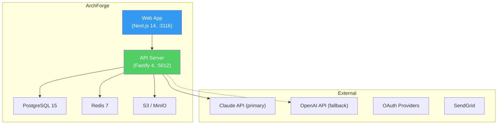

# ArchForge - Product Addendum

## Product Overview

**ArchForge** is an AI-powered enterprise architecture platform that generates standards-compliant EA artifacts from natural language descriptions. It targets enterprise architects, solution architects, IT directors, and business analysts who spend 60-80% of their time on manual documentation.

### Key Value Proposition
- Natural language → TOGAF, ArchiMate, C4, BPMN artifacts in seconds
- Interactive canvas for viewing, editing, and refining generated artifacts
- Multi-format export (PNG, SVG, PDF, PlantUML, ArchiMate XML)
- Living architecture that auto-updates as systems change

### Market Context
- $1.14B market (2024) → $1.6-2.2B by 2030
- No AI-native EA tool exists — 18-month first-mover window
- Competitors: LeanIX, Ardoq, MEGA HOPEX, BiZZdesign, Sparx Systems

## Tech Stack

| Layer | Technology | Notes |
|-------|-----------|-------|
| Frontend | Next.js 14+ / React 18+ | App Router, Tailwind CSS, shadcn/ui |
| Backend | Fastify + TypeScript | Plugin architecture |
| Database | PostgreSQL 15+ via Prisma | Primary data store |
| AI/LLM | Claude API (Anthropic) | Artifact generation, document ingestion |
| Canvas | React Flow (xyflow) | Interactive diagram editing (ADR-002) |
| Real-time | WebSocket (Fastify WS) | Collaboration |
| Auth | JWT + API Keys | Dual auth pattern |
| Export | Sharp (images), PDFKit (PDF) | Multi-format |
| Testing | Jest (unit), Playwright (E2E) | TDD mandatory |

## Port Assignments

| Service | Port | URL |
|---------|------|-----|
| Frontend (Web) | 3116 | http://localhost:3116 |
| Backend (API) | 5012 | http://localhost:5012 |

## Conventions

### Directory Structure
```
products/archforge/
├── apps/
│   ├── api/              # Fastify backend
│   │   ├── src/
│   │   │   ├── plugins/  # Fastify plugins
│   │   │   ├── routes/   # API routes
│   │   │   ├── services/ # Business logic
│   │   │   ├── schemas/  # Zod validation schemas
│   │   │   └── types/    # TypeScript types
│   │   ├── prisma/       # Database schema + migrations
│   │   └── tests/        # Backend tests
│   └── web/              # Next.js frontend
│       ├── src/
│       │   ├── app/      # App Router pages
│       │   ├── components/ # React components
│       │   ├── hooks/    # Custom hooks
│       │   ├── lib/      # Utilities
│       │   └── types/    # Frontend types
│       └── tests/        # Frontend tests
├── packages/             # Shared code
├── e2e/                  # Playwright E2E tests
├── docs/
│   ├── PRD.md           # Product Requirements
│   ├── strategy/        # Strategy documents
│   ├── ADRs/            # Architecture decisions
│   └── specs/           # Feature specifications
└── .claude/
    └── addendum.md      # This file
```

### API Design Patterns
- RESTful API with versioned prefix: `/api/v1/`
- Zod input validation at route boundary
- Service layer for business logic (no logic in route handlers)
- AppError with RFC 7807 problem details
- Structured logging with request correlation

### Key Domain Concepts

| Concept | Description |
|---------|-------------|
| Project | A workspace containing related architecture artifacts |
| Artifact | A generated EA artifact (diagram, model, document) |
| Framework | EA standard (TOGAF, ArchiMate, C4, BPMN, Zachman) |
| Template | Pre-built starting point for artifact generation |
| Canvas | Interactive visual editor for artifacts |
| Generation | AI process of creating artifacts from natural language |
| Ingestion | AI process of extracting architecture from documents |

### Artifact Lifecycle
```
Draft → In Review → Approved → Published → Archived
```

### User Roles
- **Viewer**: Read-only access to shared artifacts
- **Editor**: Can create and modify artifacts
- **Admin**: Full project management (RBAC, settings)
- **Owner**: Project creator, full control

## Key Documents
- **PRD**: `products/archforge/docs/PRD.md`
- **Strategy**: `products/archforge/docs/strategy/PRODUCT-STRATEGY-2026.md`
- **Architecture**: `products/archforge/docs/architecture.md`
- **API Contract**: `products/archforge/docs/api-contract.yaml`
- **DB Schema**: `products/archforge/docs/db-schema.sql`
- **ADRs**: `products/archforge/docs/ADRs/`

---

## Technical Architecture

### System Components



| Component | Technology | Responsibility |
|-----------|-----------|----------------|
| Web App | Next.js 14, React 18, Tailwind, React Flow | UI, interactive canvas, NL input |
| API Server | Fastify 4, TypeScript | REST API, WebSocket, business logic |
| AI Layer | Claude API (primary), OpenAI (fallback) | NL processing, artifact generation, document extraction |
| Canvas | React Flow (xyflow) | Interactive diagram editing with custom nodes |
| Database | PostgreSQL 15 via Prisma | Primary data store (18 tables) |
| Cache / Pub/Sub | Redis 7 | Rate limiting, generation cache, WebSocket broadcast |
| Object Storage | S3 (prod) / MinIO (dev) | Document uploads, exports, avatars |
| Auth | @connectsw/auth package | JWT + API key dual authentication |
| Export | Sharp + PDFKit + custom serializers | PNG, SVG, PDF, PlantUML, ArchiMate XML, Mermaid, Draw.io |

### API Surface Summary

| Area | Endpoints | Method Summary |
|------|-----------|----------------|
| Auth | 5 | Register, login, refresh, logout, profile |
| Projects | 7 | CRUD + members + archive |
| Artifacts | 6 | CRUD + generate + ingest |
| Versions | 3 | List, create, restore |
| Templates | 3 | List, get, create |
| Collaboration | 5 | Comments CRUD + share + WebSocket |
| Export | 1 | Multi-format export |
| **Total** | **30** | |

All endpoints use `/api/v1/` prefix. Full spec: `docs/api-contract.yaml`.

### Data Model Overview

18 tables organized into domains:

| Domain | Tables | Key Entity |
|--------|--------|-----------|
| Identity | users, oauth_accounts, sessions, api_keys, notification_preferences | User |
| Organization | workspaces, workspace_members | Workspace |
| Architecture | projects, artifacts, artifact_versions, artifact_elements, artifact_relationships | Artifact |
| Content | templates, document_uploads | Template |
| Collaboration | comments, shares | Comment |
| Operations | exports, audit_log | AuditLog |

Full schema: `docs/db-schema.sql`.

### Key Architectural Decisions

| ADR | Decision | Rationale |
|-----|----------|-----------|
| ADR-001 | Streaming AI with circuit-breaker failover | Real-time element rendering; automatic failover to OpenAI if Claude is down |
| ADR-002 | React Flow for canvas | MIT license, React-native custom nodes, viewport culling for 200+ elements |
| ADR-003 | WebSocket + Redis Pub/Sub for collaboration | Low-latency comments/presence; scales across server instances; no CRDT complexity in MVP |
| ADR-004 | Server-side export pipeline | Deterministic output; browser-independent; enables future API batch exports |

### Reused ConnectSW Packages

| Package | Usage |
|---------|-------|
| `@connectsw/auth` | JWT + API key auth plugin, auth routes, frontend useAuth hook |
| `@connectsw/ui` | Button, Card, Input, Badge, DataTable, DashboardLayout, Sidebar |
| `@connectsw/shared` | Logger, crypto utils, Prisma plugin, Redis plugin |

### Plugin Registration Order (Fastify)

Per PATTERN-009:
```
1. Observability (Pino logging, Sentry)
2. Prisma (database connection)
3. Redis (cache, pub/sub)
4. Rate Limit (Redis-backed)
5. Auth (@connectsw/auth plugin)
6. WebSocket (@fastify/websocket)
7. Routes (auth, projects, artifacts, templates, collaboration)
```
