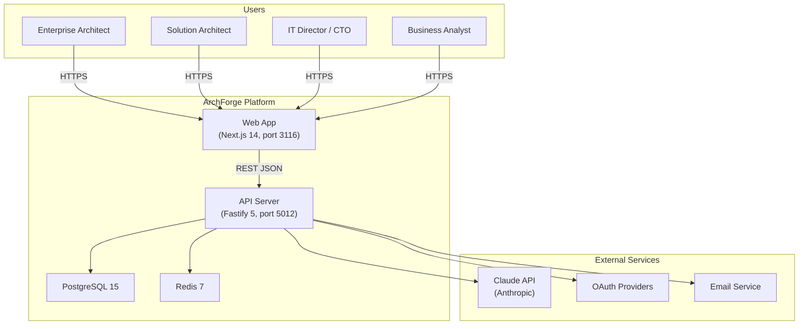
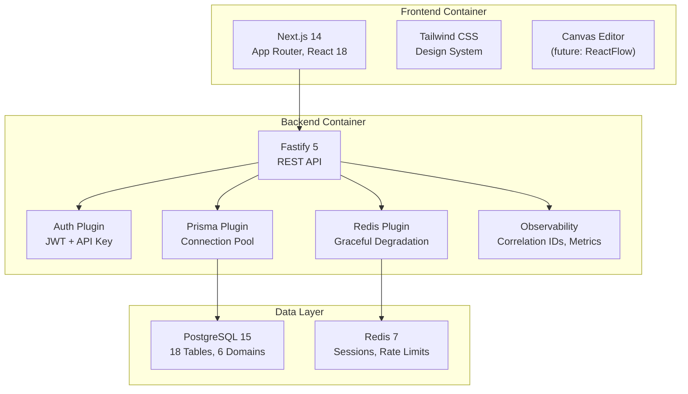
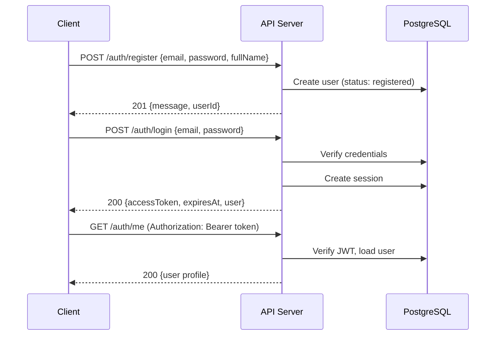
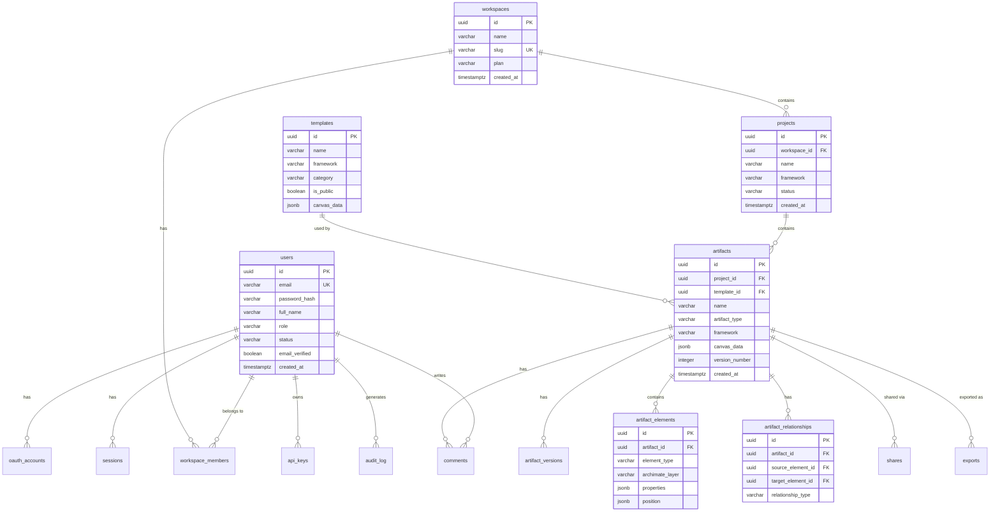

# ArchForge — AI-Powered Enterprise Architecture

ArchForge transforms natural language descriptions into standards-compliant enterprise architecture diagrams. It supports **ArchiMate 3.2**, **C4 Model**, and **TOGAF** — powered by AI, refined on an interactive canvas, and exported to any format your team uses.

## Business Context

**Problem**: Enterprise architects spend days manually creating and maintaining architecture diagrams. Keeping them consistent with standards (ArchiMate, TOGAF) requires deep expertise, and sharing across tools is painful.

**Solution**: ArchForge lets architects describe systems in plain English and get a standards-compliant diagram in seconds. The interactive canvas allows visual refinement, and multi-format export ensures compatibility with any toolchain.

**Target Users**: Enterprise Architects, Solution Architects, IT Directors/CTOs, Business Analysts

**Value Proposition**: 10x faster architecture documentation. Standards compliance by default. Export to any format.

---

## Architecture Overview



### Container Diagram (C4 Level 2)



---

## Getting Started

### Prerequisites

- **Node.js** 20+
- **PostgreSQL** 15+
- **Redis** 7+ (optional — backend degrades gracefully without it)

### 1. Clone and Install

```bash
cd products/archforge
npm install
cd apps/api && npm install
cd ../web && npm install
cd ../..
```

### 2. Database Setup

```bash
# Create the database
createdb archforge_dev

# Copy and configure environment
cp .env.example apps/api/.env
# Edit apps/api/.env with your DATABASE_URL, e.g.:
# DATABASE_URL="postgresql://youruser@localhost:5432/archforge_dev"
# JWT_SECRET="your-secret-here"

# Run migrations
cd apps/api && npx prisma migrate deploy
```

### 3. Start Development

```bash
# From products/archforge/
npm run dev

# Or start individually:
cd apps/api && npm run dev   # API on http://localhost:5012
cd apps/web && npm run dev   # Web on http://localhost:3116
```

### 4. Verify

```bash
# Health check
curl http://localhost:5012/health

# Register a user
curl -X POST http://localhost:5012/api/v1/auth/register \
  -H "Content-Type: application/json" \
  -d '{"email":"test@example.com","password":"Test123!@#","fullName":"Test User"}'

# Login
curl -X POST http://localhost:5012/api/v1/auth/login \
  -H "Content-Type: application/json" \
  -d '{"email":"test@example.com","password":"Test123!@#"}'
```

### Docker (Alternative)

```bash
docker-compose up -d   # PostgreSQL on 5433, Redis on 6380
```

---

## API Overview

Base URL: `http://localhost:5012/api/v1`

### Authentication Endpoints

| Method | Endpoint | Description | Auth |
|--------|----------|-------------|------|
| `POST` | `/auth/register` | Create account | None |
| `POST` | `/auth/login` | Get access token | None |
| `POST` | `/auth/refresh` | Refresh token | JWT |
| `POST` | `/auth/logout` | Invalidate session | JWT |
| `GET` | `/auth/me` | Current user profile | JWT |

### Auth Flow



### Future Endpoints (30 total in API contract)

| Domain | Endpoints | Status |
|--------|-----------|--------|
| Projects | CRUD, fork, archive | Planned |
| Artifacts | Generate, elements, relationships | Planned |
| Versions | History, diff, restore | Planned |
| Templates | Browse, use, create | Planned |
| Collaboration | Share, comments, real-time | Planned |
| Export | PNG, SVG, PDF, PlantUML, XML, Mermaid | Planned |

### Error Handling

All errors follow [RFC 7807 Problem Details](https://datatracker.ietf.org/doc/html/rfc7807):

```json
{
  "type": "https://archforge.io/errors/validation",
  "title": "Validation Error",
  "status": 400,
  "detail": "Email already registered",
  "instance": "/api/v1/auth/register"
}
```

---

## Data Model

### Entity-Relationship Diagram



### Database Domains (18 Tables)

| Domain | Tables | Purpose |
|--------|--------|---------|
| **Identity** | users, oauth_accounts, sessions | Authentication and user management |
| **Organization** | workspaces, workspace_members | Multi-tenant workspace management |
| **Architecture** | projects, artifacts, artifact_versions, artifact_elements, artifact_relationships | Core EA modeling |
| **Content** | templates, document_uploads | Template library and file uploads |
| **Collaboration** | comments, shares | Sharing and discussion |
| **Operations** | exports, api_keys, audit_log, notification_preferences | Platform operations |

---

## Tech Stack

| Layer | Technology | Version |
|-------|-----------|---------|
| Runtime | Node.js | 20+ |
| Language | TypeScript | 5+ |
| Backend | Fastify | 5 |
| Frontend | Next.js (App Router) | 14 |
| UI | React + Tailwind CSS | 18 / 3.4 |
| Database | PostgreSQL | 15 |
| ORM | Prisma | 6 |
| Cache | Redis | 7 |
| Auth | JWT + API Keys | - |
| Logging | Pino | - |
| Testing | Jest | - |

---

## Project Structure

```
products/archforge/
├── apps/
│   ├── api/                    # Fastify backend (port 5012)
│   │   ├── src/
│   │   │   ├── plugins/        # Prisma, Redis, Auth, Observability
│   │   │   ├── routes/v1/      # API route handlers
│   │   │   ├── types/          # TypeScript types, RFC 7807 errors
│   │   │   ├── utils/          # Logger, crypto, env validation
│   │   │   ├── app.ts          # App builder
│   │   │   └── index.ts        # Entry point
│   │   ├── prisma/
│   │   │   ├── schema.prisma   # 18-table schema
│   │   │   └── migrations/     # Database migrations
│   │   └── tests/
│   │       └── integration/    # Health endpoint tests
│   └── web/                    # Next.js frontend (port 3116)
│       └── src/
│           ├── app/            # App Router pages
│           └── components/     # Shared components
├── docs/
│   ├── PRD.md                  # Product Requirements
│   ├── architecture.md         # System Architecture (C4)
│   ├── db-schema.sql           # Database DDL
│   ├── api-contract.yaml       # OpenAPI 3.0.3 spec
│   └── ADRs/                   # Architecture Decision Records
├── docker-compose.yml          # PostgreSQL + Redis
├── package.json                # Monorepo root
└── README.md                   # This file
```

---

## Development

### Running Tests

```bash
cd apps/api
npm test                    # Run all tests
npm test -- --verbose       # With detailed output
```

### Database Commands

```bash
cd apps/api
npx prisma studio          # Visual database browser
npx prisma migrate dev      # Create and apply migrations
npx prisma generate         # Regenerate Prisma client
```

### Ports

| Service | Port |
|---------|------|
| Frontend (Next.js) | 3116 |
| Backend (Fastify) | 5012 |
| PostgreSQL (Docker) | 5433 |
| Redis (Docker) | 6380 |

---

## Related Documents

- [Product Requirements (PRD)](docs/PRD.md)
- [System Architecture](docs/architecture.md)
- [Database Schema](docs/db-schema.sql)
- [API Contract (OpenAPI)](docs/api-contract.yaml)
- [ADR-001: Monolith-First Architecture](docs/ADRs/ADR-001-monolith-first.md)
- [ADR-002: Canvas as Structured JSON](docs/ADRs/ADR-002-canvas-as-json.md)
- [ADR-003: AI Provider Abstraction](docs/ADRs/ADR-003-ai-provider-abstraction.md)
- [ADR-004: ArchiMate Compliance Strategy](docs/ADRs/ADR-004-archimate-compliance.md)
