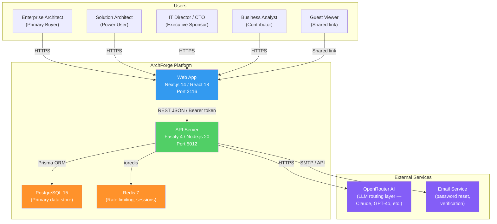
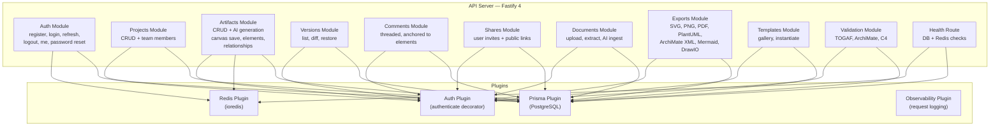
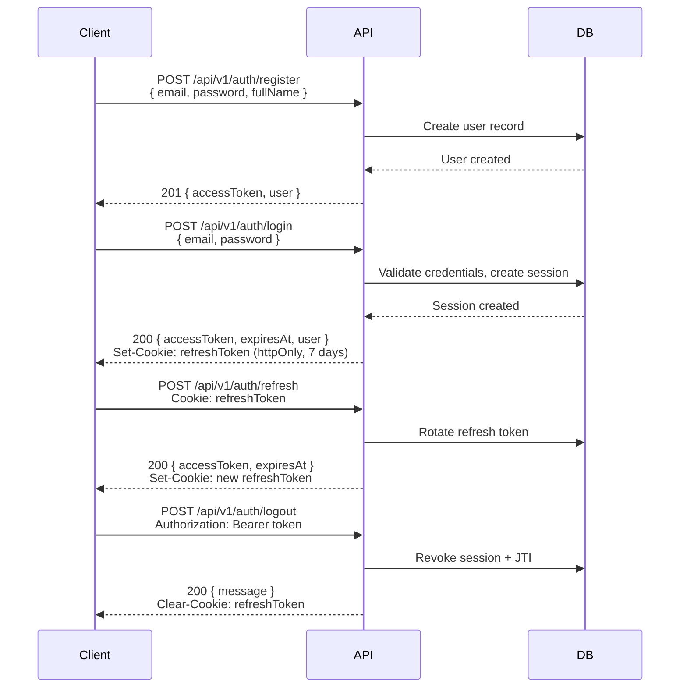

# ArchForge -- AI-Powered Enterprise Architecture Platform

ArchForge is an AI-first enterprise architecture platform that generates
standards-compliant architecture artifacts (TOGAF, ArchiMate, C4) from
natural language descriptions. It transforms enterprise architecture from
a 3-6 month manual documentation exercise into a 5-minute AI-assisted
workflow, producing interactive diagrams, architecture documents, and
compliance-validated models.

## Business Context

Enterprise architects spend 60-80% of their working time on manual
documentation and diagram creation rather than strategic architecture
decisions. Current tools (LeanIX, Ardoq, MEGA HOPEX) require 3-6 months
of onboarding, cost $50K-$500K annually, and produce models that become
stale within weeks. No incumbent tool generates complete,
standards-compliant EA artifacts from natural language input.

**ArchForge is the first AI-native enterprise architecture tool.** Time
to first artifact drops from 8-16 hours (manual) to under 5 minutes.

The enterprise architecture tools market is valued at $1.14B (2024) and
projected to reach $1.6-2.2B by 2030. ArchForge targets a competitive
window of approximately 18 months before incumbents mature their AI
offerings.

**Primary users**: Enterprise Architects, Solution Architects, IT
Directors/CTOs, and Business Analysts in organizations undergoing digital
transformation, cloud migration, or regulatory compliance initiatives.

## Architecture

### C4 Container Diagram



### C4 Component Diagram (API Server)



## Tech Stack

| Layer | Technology | Version | Port |
|-------|-----------|---------|------|
| Frontend framework | Next.js (App Router) | 14+ | 3116 |
| UI library | React | 18+ | — |
| Styling | Tailwind CSS | 3+ | — |
| Diagram rendering | Mermaid | 11+ | — |
| Backend framework | Fastify | 4+ | 5012 |
| Runtime | Node.js | 20+ | — |
| Language | TypeScript | 5+ | — |
| Database | PostgreSQL | 15+ | 5432 |
| ORM | Prisma | 5+ | — |
| Cache / rate-limit | Redis | 7+ | 6379 |
| AI routing | OpenRouter | — | — |
| Validation | Zod | 3+ | — |
| Testing (API) | Jest | — | — |
| Testing (E2E) | Playwright | 1.42+ | — |

## Key Design Decisions

| Decision | Choice | Rationale |
|----------|--------|-----------|
| AI provider | OpenRouter | Provider-agnostic routing — swap Claude/GPT or add failover without touching business logic |
| Auth strategy | JWT access token (15 min) + httpOnly refresh cookie (7 days) with rotation | Security best practice; stateless API with revocable sessions |
| Canvas storage | Structured JSON in PostgreSQL JSONB | Canvas is data, not pixels; rendering is a client-side concern |
| Export location | Server-side rendering | Deterministic output; avoids browser inconsistencies |
| Architecture style | Layered monolith | No microservices until scale demands it; Fastify handles all routes |

## Getting Started

### Prerequisites

- Node.js 20+
- PostgreSQL 15+ (local or Docker)
- Redis 7+ (optional — falls back to in-memory rate limiting)
- OpenRouter API key (for AI generation)

### Environment Variables

Create `products/archforge/apps/api/.env`:

```bash
# Required
DATABASE_URL="postgresql://postgres@localhost:5432/archforge_dev"
JWT_SECRET="your-32-char-minimum-secret-here"
OPENROUTER_API_KEY="sk-or-..."

# Optional
PORT=5012
HOST=0.0.0.0
NODE_ENV=development
REDIS_URL="redis://localhost:6379"
INTERNAL_API_KEY="your-internal-key"   # for detailed /health response
ALLOWED_ORIGINS="http://localhost:3116"
RATE_LIMIT_MAX=100
RATE_LIMIT_WINDOW=60000
```

Create `products/archforge/apps/web/.env.local`:

```bash
NEXT_PUBLIC_API_URL="http://localhost:5012"
```

### Setup and Run

```bash
# 1. Install dependencies
cd products/archforge
npm install
cd apps/api && npm install
cd ../web && npm install

# 2. Run database migrations
cd products/archforge/apps/api
npx prisma migrate dev

# 3. Start both services (from product root)
cd products/archforge
npm run dev

# Or start individually:
# API:     cd apps/api && npm run dev    → http://localhost:5012
# Web:     cd apps/web && npm run dev    → http://localhost:3116
```

### Run Tests

```bash
# API integration tests (216 tests)
cd products/archforge/apps/api
npm test

# E2E tests (requires both servers running)
cd products/archforge/e2e
npx playwright test

# Health check
curl http://localhost:5012/health
```

## Key Features

| Feature | Description | Status |
|---------|-------------|--------|
| NL-to-Diagram Generation | Describe a system; AI generates TOGAF/ArchiMate/C4 artifacts | MVP |
| Document Ingestion | Upload PDF/DOCX/MD; AI extracts and models architecture | MVP |
| Interactive Canvas | Visual editor with ReactFlow — drag, drop, connect | MVP |
| Multi-Format Export | SVG, PNG, PDF, PlantUML, ArchiMate XML, Mermaid, DrawIO | MVP |
| Project Workspaces | Create workspaces, organize artifacts, manage team access | MVP |
| Version History | Track changes, view diffs, restore previous versions | MVP |
| Template Library | Pre-built TOGAF, C4, ArchiMate, cloud pattern templates | MVP |
| Collaboration | Share artifacts, threaded comments anchored to elements | MVP |
| Framework Validation | Validate artifacts against TOGAF/ArchiMate/C4 standards | MVP |

## API Overview

All endpoints are prefixed with `/api/v1`. Authentication uses Bearer
tokens (`Authorization: Bearer <accessToken>`).

### Authentication Sequence



### Key Endpoints by Module

| Module | Endpoints |
|--------|-----------|
| Auth | `POST /auth/register`, `POST /auth/login`, `POST /auth/refresh`, `POST /auth/logout`, `GET /auth/me`, `POST /auth/forgot-password`, `POST /auth/reset-password`, `GET /auth/verify-email/:token` |
| Projects | `GET /projects`, `POST /projects`, `GET /projects/:id`, `PUT /projects/:id`, `DELETE /projects/:id`, `GET /projects/:id/members`, `POST /projects/:id/members` |
| Artifacts | `POST /projects/:pid/artifacts/generate` (AI), `POST /projects/:pid/artifacts`, `GET /projects/:pid/artifacts`, `GET /projects/:pid/artifacts/:id`, `PUT /projects/:pid/artifacts/:id`, `DELETE /projects/:pid/artifacts/:id`, `POST /projects/:pid/artifacts/:id/regenerate`, `PUT /projects/:pid/artifacts/:id/canvas` |
| Elements | `POST /projects/:pid/artifacts/:id/elements`, `GET /projects/:pid/artifacts/:id/elements`, `PUT /projects/:pid/artifacts/:id/elements/:eid`, `DELETE /projects/:pid/artifacts/:id/elements/:eid` |
| Relationships | `POST /projects/:pid/artifacts/:id/relationships`, `GET /projects/:pid/artifacts/:id/relationships`, `DELETE /projects/:pid/artifacts/:id/relationships/:rid` |
| Versions | `GET /artifacts/:id/versions`, `GET /artifacts/:id/versions/:vid`, `GET /artifacts/:id/versions/:fid/diff/:tid`, `POST /artifacts/:id/versions/:vid/restore` |
| Comments | `POST /artifacts/:id/comments`, `GET /artifacts/:id/comments`, `PUT /artifacts/:id/comments/:cid`, `DELETE /artifacts/:id/comments/:cid`, `POST /artifacts/:id/comments/:cid/resolve` |
| Shares | `POST /artifacts/:id/shares/user`, `POST /artifacts/:id/shares/link`, `GET /artifacts/:id/shares`, `DELETE /artifacts/:id/shares/:sid`, `GET /shares/link/:token` (public) |
| Documents | `POST /projects/:pid/documents`, `GET /projects/:pid/documents`, `GET /projects/:pid/documents/:did`, `POST /projects/:pid/documents/:did/generate` (AI) |
| Exports | `POST /projects/:pid/artifacts/:id/export` |
| Templates | `GET /templates`, `GET /templates/:id`, `POST /templates`, `POST /templates/:id/instantiate` |
| Validation | `POST /projects/:pid/artifacts/:id/validate` |

See [docs/API.md](docs/API.md) for full request/response details.

## Project Structure

```
products/archforge/
├── apps/
│   ├── api/                    # Fastify backend (port 5012)
│   │   ├── src/
│   │   │   ├── app.ts          # App builder (plugins + routes)
│   │   │   ├── index.ts        # Entry point (start server)
│   │   │   ├── lib/
│   │   │   │   └── openrouter.ts   # AI client (OpenRouter)
│   │   │   ├── modules/        # Feature modules (routes, service, schemas)
│   │   │   │   ├── auth/
│   │   │   │   ├── projects/
│   │   │   │   ├── artifacts/
│   │   │   │   ├── versions/
│   │   │   │   ├── comments/
│   │   │   │   ├── shares/
│   │   │   │   ├── documents/
│   │   │   │   ├── exports/
│   │   │   │   ├── templates/
│   │   │   │   └── validation/
│   │   │   ├── plugins/        # Fastify plugins (prisma, redis, auth, obs)
│   │   │   ├── types/          # Shared TypeScript types
│   │   │   └── utils/          # Logger, env validator
│   │   └── tests/              # Jest integration tests (216 passing)
│   └── web/                    # Next.js frontend (port 3116)
│       └── src/
│           ├── app/            # Next.js App Router pages
│           │   ├── dashboard/
│           │   ├── projects/[id]/
│           │   ├── artifacts/[id]/
│           │   ├── templates/
│           │   ├── settings/
│           │   ├── login/
│           │   └── register/
│           ├── components/     # Shared UI components
│           └── lib/            # API client, auth context
├── e2e/                        # Playwright E2E tests
├── docs/
│   ├── PRD.md                  # Product requirements with user stories
│   ├── architecture.md         # System architecture (C4 diagrams)
│   ├── API.md                  # Full API reference
│   ├── MASTER-PLAN.md          # MVP status, ER diagrams, sequence diagrams
│   ├── db-schema.sql           # PostgreSQL schema
│   ├── api-contract.yaml       # OpenAPI 3.0 contract
│   ├── ADRs/                   # Architecture decision records
│   └── strategy/               # Market analysis
└── README.md                   # This file
```

## Test Coverage

| Layer | Count | Status |
|-------|-------|--------|
| API integration tests (Jest) | 216/216 | Passing |
| E2E tests (Playwright) | 4 suites | Requires running servers |
| Web unit tests | 0 | Not yet implemented |

## Documentation

| Document | Description |
|----------|-------------|
| [docs/PRD.md](docs/PRD.md) | Product requirements, user personas, acceptance criteria |
| [docs/architecture.md](docs/architecture.md) | System architecture with C4 diagrams |
| [docs/API.md](docs/API.md) | Complete API reference with examples |
| [docs/MASTER-PLAN.md](docs/MASTER-PLAN.md) | MVP status, ER diagrams, sequence diagrams, test coverage |
| [docs/db-schema.sql](docs/db-schema.sql) | PostgreSQL schema DDL |
| [docs/api-contract.yaml](docs/api-contract.yaml) | OpenAPI 3.0 specification |
| [docs/ADRs/](docs/ADRs/) | Architecture decision records (ADR-001 through ADR-004) |
| [docs/strategy/](docs/strategy/) | Market analysis and product roadmap |

## License

UNLICENSED -- ConnectSW Internal
