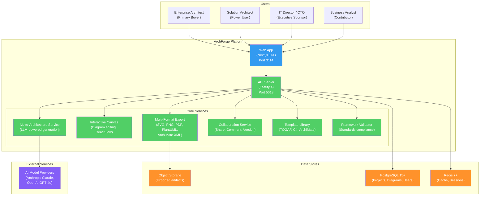

# ArchForge -- AI-Powered Enterprise Architecture Platform

ArchForge is an AI-powered enterprise architecture platform that generates standards-compliant architecture artifacts (TOGAF, ArchiMate, C4) from natural language descriptions. It transforms enterprise architecture from a 3-6 month manual documentation exercise into a 5-minute AI-assisted workflow, producing interactive diagrams, architecture documents, and compliance-validated models.

## Why ArchForge Exists

Enterprise architects spend 60-80% of their working time on manual documentation and diagram creation rather than strategic architecture decisions. Current EA tools (LeanIX, Ardoq, MEGA HOPEX, BiZZdesign, Sparx Systems) require 3-6 months of onboarding, cost $50K-$500K annually, and produce models that become stale within weeks. No incumbent tool generates complete, standards-compliant EA artifacts from natural language input.

ArchForge is the first AI-native enterprise architecture tool. Time to first artifact drops from 8-16 hours (manual) to under 5 minutes.

The enterprise architecture tools market is valued at $1.14B (2024) and projected to reach $1.6-2.2B by 2030. ArchForge targets a competitive window of approximately 18 months before incumbents mature their AI offerings.

## Architecture Overview



## Tech Stack

| Layer | Technology | Version |
|-------|-----------|---------|
| Runtime | Node.js | 20+ |
| Language | TypeScript | 5+ |
| Backend Framework | Fastify | 4+ |
| Frontend Framework | Next.js (App Router) | 14+ |
| UI Library | React | 18+ |
| Styling | Tailwind CSS | Latest |
| Diagram Canvas | ReactFlow | Latest |
| Database | PostgreSQL | 15+ |
| ORM | Prisma | Latest |
| Cache | Redis | 7+ |
| AI Models | Anthropic Claude, OpenAI GPT-4o | Latest |
| Authentication | JWT | -- |
| Validation | Zod | Latest |
| Testing | Jest, Playwright | Latest |

## Port Assignments

| Service | Port |
|---------|------|
| Frontend (Web App) | 3114 |
| Backend (API Server) | 5013 |
| PostgreSQL | 5432 |
| Redis | 6379 |

## Getting Started

### Prerequisites

- Node.js 20+
- Docker and Docker Compose
- PostgreSQL 15+ (or use Docker)
- Redis 7+ (or use Docker)
- An AI model API key (Anthropic or OpenAI)

### Current Status

ArchForge is in the **architecture and design phase**. The product has comprehensive documentation (PRD, architecture, ADRs, API contracts, database schema, product strategy) but source code implementation has not yet begun.

To review the design:

```bash
# Read the PRD
cat products/archforge/docs/PRD.md

# Read the architecture
cat products/archforge/docs/architecture.md

# Review the database schema
cat products/archforge/docs/db-schema.sql

# Review the API contract
cat products/archforge/docs/api-contract.yaml

# Read architecture decision records
ls products/archforge/docs/ADRs/
```

## Project Structure

```
products/archforge/
├── docs/
│   ├── PRD.md                              # Product Requirements Document
│   ├── architecture.md                     # System Architecture (C4 diagrams)
│   ├── db-schema.sql                       # Database schema design
│   ├── api-contract.yaml                   # OpenAPI 3.0 API contract
│   ├── ADRs/
│   │   ├── ADR-001-ai-service-architecture.md   # AI service design
│   │   ├── ADR-002-canvas-technology.md         # Canvas tech choice
│   │   ├── ADR-003-realtime-collaboration.md    # Collaboration approach
│   │   └── ADR-004-export-pipeline.md           # Export pipeline design
│   └── strategy/
│       └── PRODUCT-STRATEGY-2026.md        # Market analysis and strategy
└── README.md                               # This file
```

## Key Features (Planned)

### MVP (Phase 1: 0-6 months)

| Feature | Description |
|---------|-------------|
| NL-to-Diagram Generation | Describe a system in natural language; AI generates TOGAF/ArchiMate diagrams |
| Document Ingestion | Upload existing architecture documents; AI extracts and models components |
| Interactive Canvas | Visual diagram editor with drag-drop, connection management |
| Multi-Format Export | Export to SVG, PNG, PDF, PlantUML, ArchiMate XML, Draw.io |
| Project Management | Create workspaces, organize diagrams, manage team access |
| Version History | Track changes, view diffs, restore previous versions |
| Template Library | Pre-built templates for TOGAF, C4, ArchiMate, AWS/Azure |
| Collaboration | Share diagrams, add comments, review changes |
| Framework Validation | Validate diagrams against TOGAF/ArchiMate standards |

### Phase 2 (6-18 months)

| Feature | Description |
|---------|-------------|
| Living Architecture | Auto-sync with cloud infrastructure (AWS, Azure, GCP) |
| BPMN Process Modeling | Business process diagrams from natural language |
| Compliance Validation | Validate architecture against regulatory requirements |
| Enterprise SSO and RBAC | SAML/OIDC integration, role-based access |
| Integration API | Platform API for third-party tool integration |

### Future (18-36 months)

| Feature | Description |
|---------|-------------|
| AI Architecture Advisor | Proactive recommendations for architectural improvements |
| Predictive Impact Analysis | Simulate changes before implementation |
| ConnectGRC Integration | Architecture artifacts feed risk/compliance assessments |

## Competitive Landscape

| Differentiator | ArchForge | Incumbents |
|---------------|-----------|-----------|
| AI artifact generation from natural language | Core feature | Not available |
| Time to first artifact | Under 5 minutes | 3-6 months onboarding |
| Living architecture (auto-sync) | Built-in | Partial or absent |
| Framework expertise required | None (AI handles notation) | Extensive training |
| Pricing transparency | Published tiers | "Contact sales" |

## Documentation

| Document | Path | Description |
|----------|------|-------------|
| PRD | [docs/PRD.md](docs/PRD.md) | Comprehensive requirements with personas and acceptance criteria |
| Architecture | [docs/architecture.md](docs/architecture.md) | System architecture with C4 diagrams |
| Database Schema | [docs/db-schema.sql](docs/db-schema.sql) | PostgreSQL schema design |
| API Contract | [docs/api-contract.yaml](docs/api-contract.yaml) | OpenAPI 3.0 specification |
| Product Strategy | [docs/strategy/PRODUCT-STRATEGY-2026.md](docs/strategy/PRODUCT-STRATEGY-2026.md) | Market analysis and roadmap |
| ADR-001 | [docs/ADRs/ADR-001-ai-service-architecture.md](docs/ADRs/ADR-001-ai-service-architecture.md) | AI service architecture |
| ADR-002 | [docs/ADRs/ADR-002-canvas-technology.md](docs/ADRs/ADR-002-canvas-technology.md) | Canvas technology choice |
| ADR-003 | [docs/ADRs/ADR-003-realtime-collaboration.md](docs/ADRs/ADR-003-realtime-collaboration.md) | Collaboration approach |
| ADR-004 | [docs/ADRs/ADR-004-export-pipeline.md](docs/ADRs/ADR-004-export-pipeline.md) | Export pipeline design |

## License

UNLICENSED -- ConnectSW Internal
