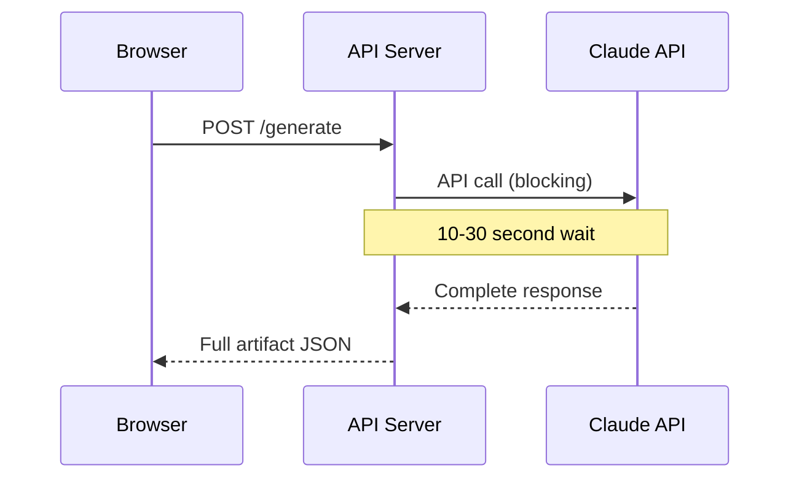
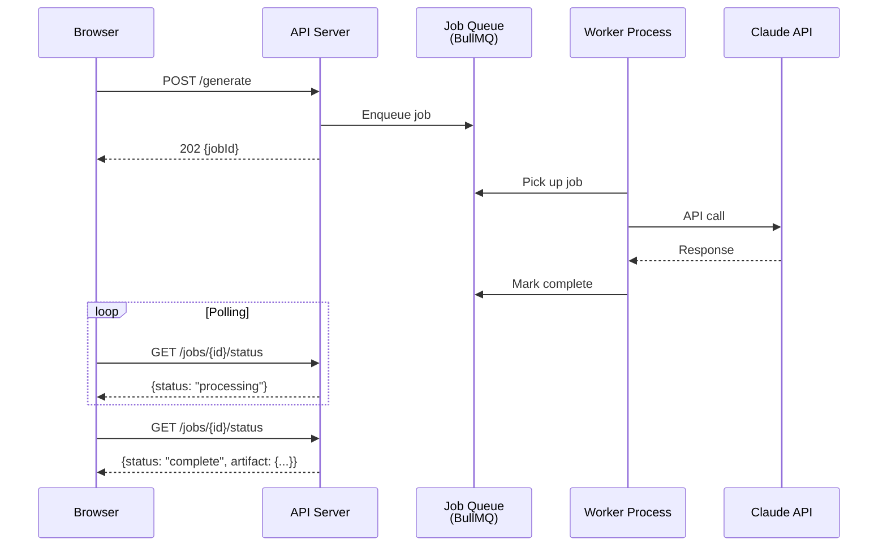
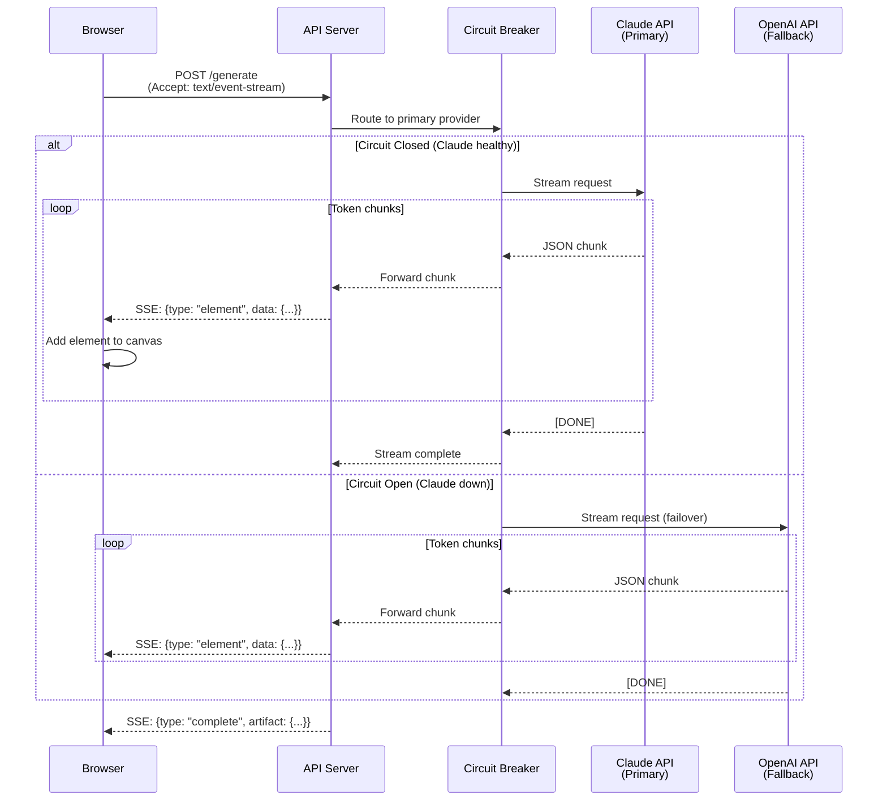
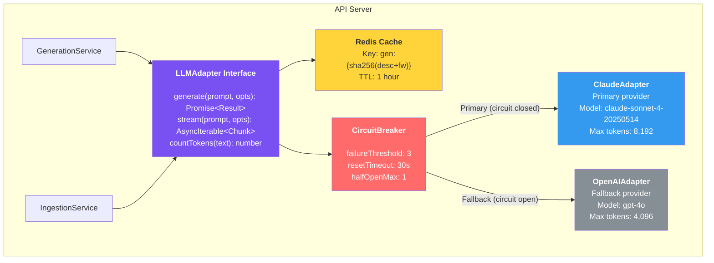

# ADR-001: AI Service Architecture

## Status

Accepted

## Date

2026-02-19

## Context

ArchForge's core value proposition is generating standards-compliant EA artifacts from natural language. This requires integrating with Large Language Model (LLM) APIs to process NL descriptions and produce structured architecture data.

Key decisions needed:
- **How to call the LLM?** Direct synchronous calls, queue-based async, or streaming?
- **Single provider or multi-provider?** Risk of vendor lock-in vs complexity.
- **How to handle long-running generation?** Some artifact generation may take 15-30 seconds.
- **How to manage costs?** LLM token usage is a significant variable cost.

### Requirements from PRD

- NFR: Artifact generation under 30 seconds (p95) for descriptions under 500 words.
- NFR: Artifact refinement under 15 seconds.
- Risk R9: Single LLM provider dependency creates availability and pricing risk.
- Risk R4: LLM costs may be higher than projected.

### Constraints

- Must provide immediate visual feedback during generation (PRD AC-01.1).
- Must support streaming responses to show elements appearing on canvas.
- Must handle LLM provider downtime gracefully.
- MVP budget: no job queue infrastructure (BullMQ, SQS) in initial deployment.

---

## Options Considered

### Option A: Direct Synchronous API Calls

**Pros**: Simple implementation. No infrastructure beyond the API server.
**Cons**: User sees a loading spinner for 10-30 seconds. HTTP timeout risk. No progress feedback.

### Option B: Queue-Based Async Processing

**Pros**: Handles long-running tasks well. Retryable. Scales workers independently.
**Cons**: Requires Redis + BullMQ infrastructure. Polling adds latency. Complex for MVP. No real-time progress.

### Option C: Streaming with Circuit-Breaker Failover (Selected)

**Pros**: Immediate visual feedback (elements appear as they stream in). No polling. Automatic failover. No extra infrastructure.
**Cons**: Client must handle SSE parsing. Partial failure mid-stream requires recovery logic.

---

## Decision

**Option C: Streaming with circuit-breaker failover.**

### Architecture

### Implementation Details

1. **LLMAdapter interface**: Provider-agnostic. All services call `adapter.stream()` or `adapter.generate()`. No direct Claude/OpenAI imports in business logic.

2. **Circuit breaker**: 3 consecutive failures within 60 seconds trips the circuit. After 30 seconds, one request is allowed through (half-open). If it succeeds, circuit closes. Implemented in-process (no external dependency).

3. **Streaming**: Claude's streaming API returns JSON chunks. The API server wraps them as Server-Sent Events (SSE). The frontend `useGeneration` hook parses SSE and progressively adds elements to the React Flow canvas.

4. **Token budget**: Redis tracks per-user token usage (sliding window, 1-hour). Before each LLM call, the adapter checks remaining budget. If exceeded, returns 429.

5. **Prompt structure**: System prompt defines the output JSON schema and framework rules. User prompt contains the NL description. This separation ensures consistent output format across providers.

6. **Fallback provider**: OpenAI GPT-4o serves as a fallback. The same prompt templates work for both providers (minor formatting differences handled in adapters).

---

## Consequences

### Positive

- Users see elements appearing in real-time during generation (better UX than loading spinner).
- Automatic failover ensures service continuity when Claude is down.
- No additional infrastructure (no job queue, no worker processes) for MVP.
- Token budget and caching reduce LLM costs by an estimated 15-25%.
- Provider-agnostic interface makes it easy to add providers (Gemini, Llama, etc.) later.

### Negative

- SSE adds complexity to the frontend (must handle partial data, reconnection).
- Mid-stream failures require recovery logic (retry from last successful element).
- Two LLM providers means two sets of API keys, billing accounts, and prompt tuning.
- Claude and GPT may produce slightly different output for the same prompt, requiring normalization.

### Risks

- If both providers are down simultaneously, generation fails entirely. Mitigation: graceful error message, retry button, and alert to ops team.
- Streaming responses cannot be cached efficiently (only the final result is cached).
