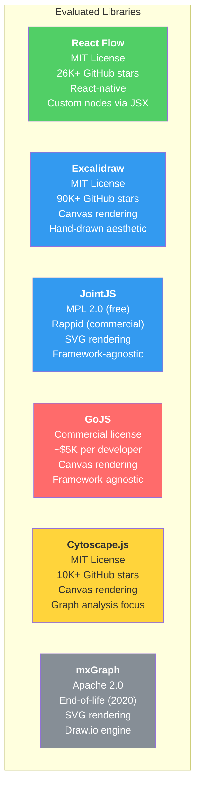
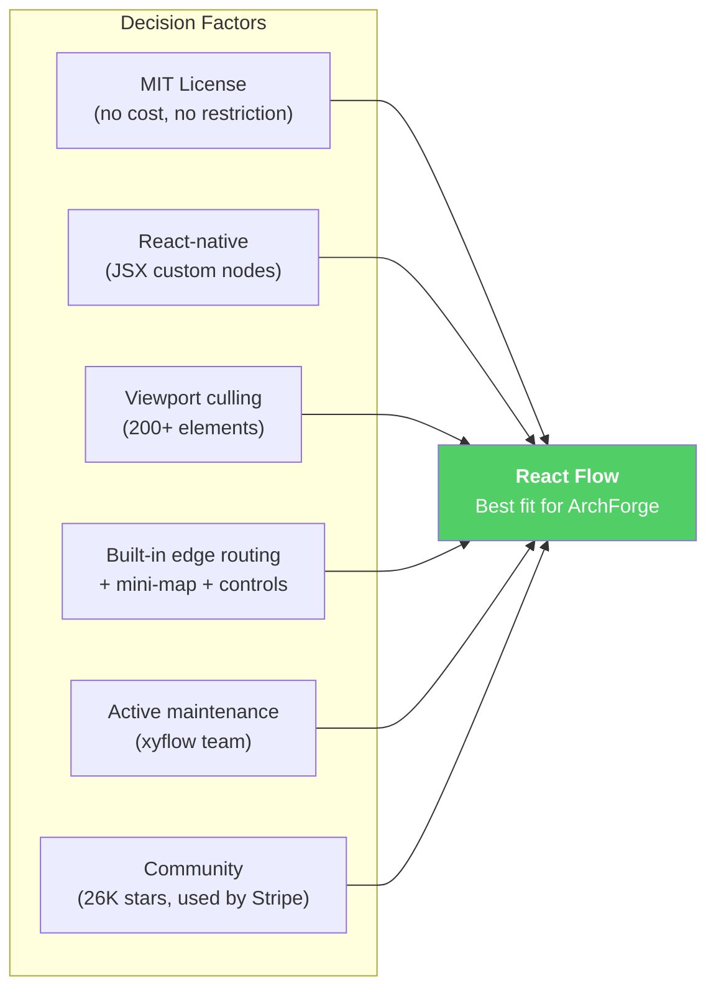

# ADR-002: Canvas Technology Selection

## Status

Accepted

## Date

2026-02-19

## Context

ArchForge requires an interactive canvas for viewing, editing, and refining AI-generated architecture diagrams. Users must be able to:

- Drag, zoom, and pan across diagrams with 50-200+ elements.
- Add, remove, and modify elements and relationships.
- Select multiple elements (Ctrl+click, lasso).
- Undo/redo operations.
- Render at 60fps during interaction.
- Support custom element types (ArchiMate, C4, TOGAF notation).

### Requirements from PRD

- AC-03.1: Drag moves component, relationships re-route, renders within 200ms.
- AC-03.4: Undo/redo stack with 200ms per operation.
- AC-03.5: Zoom 10%-400%, pan, mini-map, 60fps with 50+ elements.
- NFR: Canvas render under 2 seconds for 100 elements.
- NFR: Viewport minimum 1024x768.

### Evaluation Criteria

| Criterion | Weight | Reasoning |
|-----------|--------|-----------|
| License (open source, permissive) | High | Company policy: prefer MIT/Apache. Avoid proprietary lock-in. |
| React integration | High | Frontend is React 18 (Next.js 14). Native React is preferred. |
| Custom node rendering | Critical | Must render ArchiMate/C4/TOGAF notation with custom shapes. |
| Performance at 200+ elements | High | PRD supports up to 200 elements (MVP), 1000 (Phase 2). |
| Maintenance activity | High | Active maintainers, regular releases, responsive to issues. |
| Community / ecosystem | Medium | Plugins, examples, documentation quality. |
| Edge (relationship) routing | High | Relationships must auto-route and re-route on element moves. |
| Built-in features | Medium | Selection, undo/redo, mini-map, keyboard shortcuts. |

---

## Options Evaluated

### Comparison Matrix

| Criterion | React Flow | Excalidraw | JointJS | GoJS | Cytoscape.js | mxGraph |
|-----------|-----------|------------|---------|------|-------------|---------|
| **License** | MIT | MIT | MPL 2.0 (free tier limited) | Commercial ($5K/dev) | MIT | Apache 2.0 |
| **React integration** | Native (React components) | Embeddable React component | Wrapper needed | Wrapper needed | Wrapper needed | Wrapper needed |
| **Custom nodes** | JSX components (full React) | Limited (shape presets) | SVG templates (verbose) | GoJS templates | Basic styling | mxGraph shapes |
| **200+ element perf** | Good (viewport culling) | Good (canvas rendering) | Good (optimized SVG) | Excellent (canvas + culling) | Good (canvas) | Good (SVG) |
| **Edge routing** | Built-in (straight, step, bezier) | Limited (arrows only) | Advanced (manhattan, metro) | Advanced | Basic (bezier) | Advanced |
| **Mini-map** | Built-in | No | Plugin (Rappid only) | Built-in | No | Built-in |
| **Selection / multi-select** | Built-in | Built-in | Built-in | Built-in | Built-in | Built-in |
| **Undo/redo** | Via React state (easy) | Built-in | Plugin (Rappid only) | Built-in | No | Built-in |
| **Maintenance** | Active (xyflow team, Berlin) | Active (Meta employees) | Active (client9) | Active (Northwoods) | Active | **End-of-life (2020)** |
| **Community** | 26K stars, strong React community | 90K stars, huge community | 4K stars, enterprise focus | Closed source | 10K stars, academic | Deprecated |
| **TypeScript support** | Native | Native | Native | Native | Partial | Limited |
| **Cost** | Free (MIT). Pro subscription optional. | Free (MIT) | Free for basic. Rappid: $4K+/yr | $5,295/developer | Free (MIT) | Free |

### Detailed Analysis

**React Flow** (xyflow/xyflow):
- Nodes are React components: we can render ArchiMate/C4/TOGAF notation using JSX, styled with Tailwind.
- Built-in viewport culling only renders visible nodes (good for 200+ elements).
- Edge types: straight, step, smoothstep, bezier. Custom edge components possible.
- Mini-map, controls, and background grid are built-in sub-components.
- Undo/redo is trivial: store node/edge arrays in a React state history stack.
- Used by Stripe, Typeform, and numerous production applications.
- MIT license with optional Pro subscription for commercial users wanting to remove attribution.

**Excalidraw**:
- Excellent for freeform whiteboarding with a hand-drawn aesthetic.
- Not designed for structured, notation-compliant diagrams (ArchiMate shapes, typed relationships).
- Custom element types would require deep library modification.
- Great for brainstorming, not for formal EA artifacts.

**JointJS**:
- Powerful SVG-based diagramming with advanced edge routing (manhattan, metro).
- Free tier (MPL 2.0) lacks key features: mini-map, keyboard shortcuts, undo/redo are Rappid-only.
- Rappid (commercial tier) costs $4,000+/year per developer.
- Not React-native; requires a wrapper component.

**GoJS**:
- Most feature-complete option with excellent performance (canvas + virtualization).
- Commercial license at $5,295 per developer seat. No free tier.
- Not React-native; wrapper needed.
- License restricts hosting to a single domain per license.

**Cytoscape.js**:
- Optimized for graph analysis and visualization (network graphs, dependency maps).
- Best built-in layout algorithms (dagre, cola, klay, cose).
- Weaker at structured diagramming with custom shapes and typed relationships.
- Better suited for data visualization than architecture modeling.

**mxGraph**:
- Powers Draw.io (diagrams.net), so it is proven for diagramming.
- Declared end-of-life in 2020. No new development. Security patches only.
- Choosing a dead library creates long-term maintenance risk.

---

## Decision

**React Flow** is the selected canvas library.

### Rationale

1. **React-native architecture**: Nodes are React components. We define `ArchiMateNode`, `C4ContainerNode`, `TOGAFBuildingBlockNode` as JSX components with Tailwind styling. This is the most natural fit for a Next.js/React frontend.

2. **Custom notation rendering**: Each framework element type maps to a custom React Flow node component that renders the correct visual notation (ArchiMate shapes, C4 boxes, TOGAF building blocks).

3. **Sufficient performance**: Viewport culling handles our MVP target of 200 elements. For Phase 2 (1000 elements), we can add Web Worker-based layout and level-of-detail rendering.

4. **No licensing cost**: MIT license means zero upfront cost and no per-developer fees. Optional Pro subscription ($299/month) only needed if we want to remove the attribution watermark.

5. **Built-in features reduce development time**: Mini-map, background grid, controls panel, selection, keyboard shortcuts, and multiple edge types come out of the box.

### Rejected Options

| Library | Rejection Reason |
|---------|-----------------|
| Excalidraw | Hand-drawn aesthetic inappropriate for formal EA artifacts; limited custom element types |
| JointJS | Advanced features (undo/redo, mini-map) locked behind Rappid paywall |
| GoJS | $5K/developer commercial license; not React-native |
| Cytoscape.js | Optimized for graph analysis, not structured architecture diagramming |
| mxGraph | End-of-life since 2020; no active development |

---

## Consequences

### Positive

- Zero licensing cost (MIT).
- Custom ArchiMate/C4/TOGAF node components are React components -- same technology as the rest of the frontend.
- Built-in viewport culling provides good performance for MVP element counts.
- Rich ecosystem of examples and community support.
- TypeScript-first with strong type definitions.

### Negative

- Edge routing is simpler than JointJS/GoJS (no manhattan routing). Mitigation: implement custom edge routing for orthogonal connections if needed.
- No built-in graph layout algorithms. Mitigation: use `dagre` or `elkjs` as separate layout engines, run in Web Worker.
- Performance ceiling may be hit at 500+ elements in Phase 2. Mitigation: implement level-of-detail rendering and element grouping/collapsing.

### Migration Path

If React Flow proves insufficient for Phase 2 (1000+ elements), the migration path is:
1. Extract the canvas data model (elements, relationships, layout) into a provider-agnostic format (already our data model).
2. Replace React Flow with JointJS + Rappid (accepting the commercial cost at Phase 2 scale).
3. Custom node components would need to be rewritten from JSX to JointJS SVG templates.

The data model is canvas-library-agnostic by design, so migration affects only the rendering layer.
