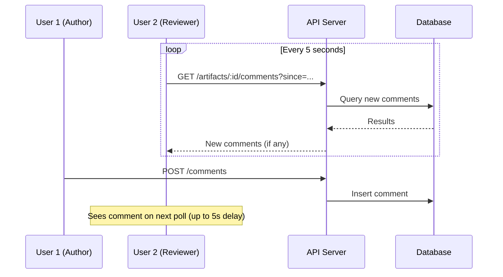
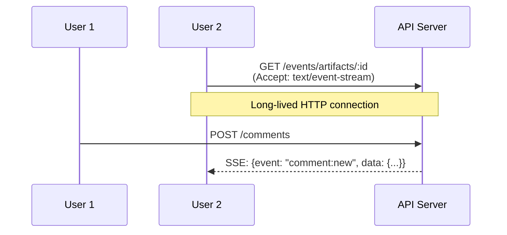
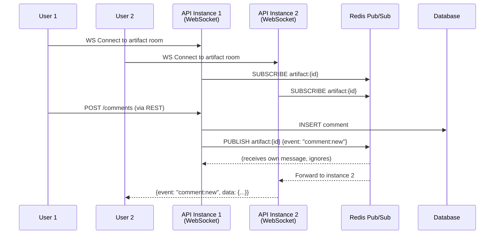
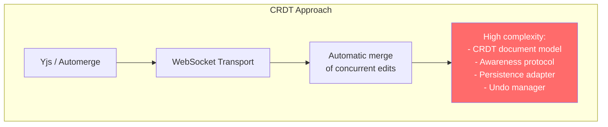
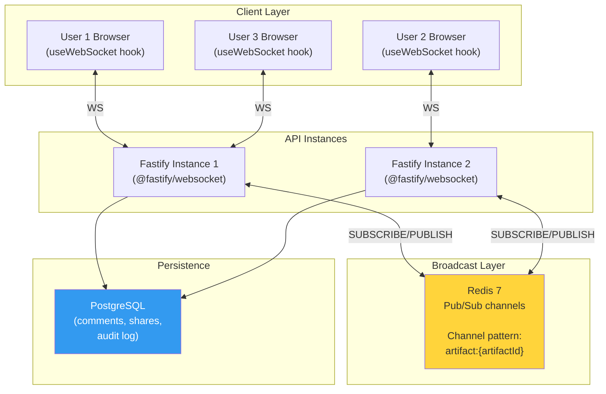
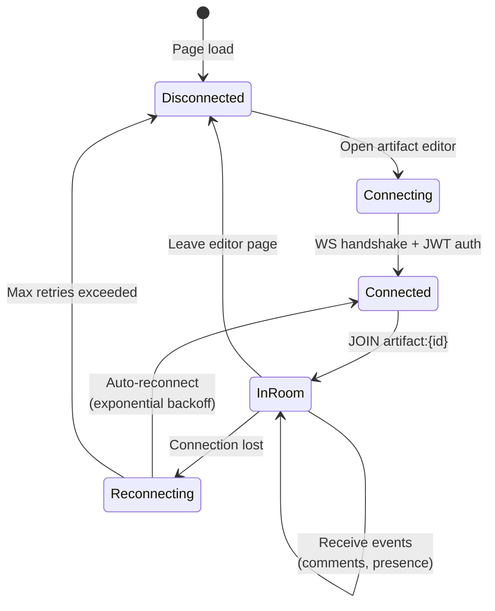

# ADR-003: Real-Time Collaboration Architecture

## Status

Accepted

## Date

2026-02-19

## Context

ArchForge must support collaboration features where multiple users can share artifacts, add comments, and see each other's presence on the same artifact. The PRD explicitly excludes Google Docs-style simultaneous co-editing (CRDTs) from the MVP, but requires:

- Comments anchored to specific canvas elements, visible in real-time to all viewers.
- Presence awareness (who is viewing the artifact).
- Notifications when comments are added or resolved.
- Future-proofing for Phase 2 partial real-time co-editing.

### Requirements from PRD

- AC-08.3: Comments anchored to components, threaded replies.
- AC-08.4: Comment badges visible on components, comment panel shows status.
- AC-08.5: In-app and email notifications for new comments.
- Out of scope (MVP): Google Docs-style simultaneous editing (CRDT/OT).
- Phase 2 scope: Partial real-time co-editing.

### Constraints

- No microservices: collaboration runs within the Fastify monolith.
- Must work with 2+ API server instances (horizontal scaling).
- Minimize infrastructure: avoid Kafka, RabbitMQ, or external event systems.
- WebSocket connections must be authenticated.

---

## Options Considered

### Option A: Polling



**Pros**: Simplest to implement. Works with any infrastructure. No WebSocket complexity.
**Cons**: 5-second latency on updates. Wasteful polling (most requests return empty). Does not support presence. Poor UX for collaboration.

### Option B: Server-Sent Events (SSE)



**Pros**: One-directional push from server. Simple HTTP protocol. No WebSocket library needed.
**Cons**: Unidirectional (server to client only). Client events (cursor position, typing indicator) require separate REST calls. Reconnection logic needed. Does not scale easily across multiple server instances without a broadcast mechanism.

### Option C: WebSocket + Redis Pub/Sub (Selected)



**Pros**: Bidirectional (supports presence, cursor sharing). Low latency (<100ms). Redis Pub/Sub enables broadcast across server instances. Room-based architecture is natural for artifact collaboration. Well-supported by Fastify (@fastify/websocket).
**Cons**: WebSocket connection management adds complexity. Redis becomes a required dependency for multi-instance. More moving parts than polling.

### Option D: CRDT-Based Conflict-Free Editing



**Pros**: True real-time co-editing. Automatic conflict resolution. Proven (Google Docs, Figma).
**Cons**: Massive complexity increase. CRDT library (Yjs, Automerge) adds 50-100KB to bundle. Data model must be restructured as CRDT documents. Undo/redo becomes significantly harder. Overkill for MVP scope (comments + presence only). PRD explicitly defers this to Phase 2+.

---

## Decision

**Option C: WebSocket + Redis Pub/Sub.**

### Architecture



### Room Model

Each artifact has a **room**. When a user opens an artifact in the editor, their browser establishes a WebSocket connection and joins the artifact's room.



### Event Types

| Event | Direction | Payload | Purpose |
|-------|-----------|---------|---------|
| `presence:join` | Server -> Clients | `{user, connectedAt}` | User joined artifact room |
| `presence:leave` | Server -> Clients | `{user}` | User left artifact room |
| `presence:list` | Server -> Client | `{users: [...]}` | Current room occupants (on join) |
| `cursor:move` | Client -> Server -> Clients | `{user, position: {x, y}}` | Cursor position (throttled 100ms) |
| `comment:new` | Server -> Clients | `{comment}` | New comment added |
| `comment:reply` | Server -> Clients | `{comment, parentId}` | Reply to comment |
| `comment:resolved` | Server -> Clients | `{commentId, resolvedBy}` | Comment resolved |
| `artifact:updated` | Server -> Clients | `{version, updatedBy}` | Artifact saved (prompt to reload) |
| `ping` | Client -> Server | `{}` | Keepalive (every 30s) |
| `pong` | Server -> Client | `{}` | Keepalive response |

### Authentication

WebSocket connections authenticate via JWT passed as a query parameter:

```
wss://api.archforge.io/api/v1/ws/artifacts/{id}?token={jwt}
```

The server validates the JWT on connection upgrade. If invalid, the connection is rejected with a 401 close frame. The token is also checked against the artifact's sharing permissions to determine what events the client may receive.

### Scaling Strategy

- **Single instance**: WebSocket events are broadcast in-process (no Redis needed for dev).
- **Multi-instance (production)**: Redis Pub/Sub broadcasts events across instances. Each instance subscribes to channels for active rooms only.
- **Connection limits**: Max 50 concurrent WebSocket connections per artifact room. Max 500 total WebSocket connections per server instance.

---

## Consequences

### Positive

- Real-time comments and presence with <100ms latency.
- Room-based model is a natural fit for "users viewing the same artifact."
- Redis Pub/Sub enables horizontal scaling without additional infrastructure.
- @fastify/websocket integrates cleanly with the existing Fastify server.
- Cursor sharing provides visual awareness of collaborators.
- Clear upgrade path to CRDTs in Phase 2 (WebSocket transport layer can be reused).

### Negative

- Redis becomes a hard dependency for multi-instance deployments. Mitigation: single instance works without Redis for MVP.
- WebSocket connections are stateful, making load balancing more complex. Mitigation: use sticky sessions or connection draining.
- Client must handle reconnection logic (exponential backoff, re-join room). Mitigation: `useWebSocket` hook encapsulates this complexity.

### Phase 2 Migration Path

When real-time co-editing is needed (Phase 2), the migration plan is:
1. Add Yjs as the CRDT library for canvas state synchronization.
2. Use the existing WebSocket transport for Yjs awareness and sync protocols.
3. Redis Pub/Sub continues to handle cross-instance broadcast.
4. Comments and presence continue to work as-is (additive change).

The WebSocket infrastructure built for MVP collaboration becomes the transport layer for CRDT-based co-editing.
