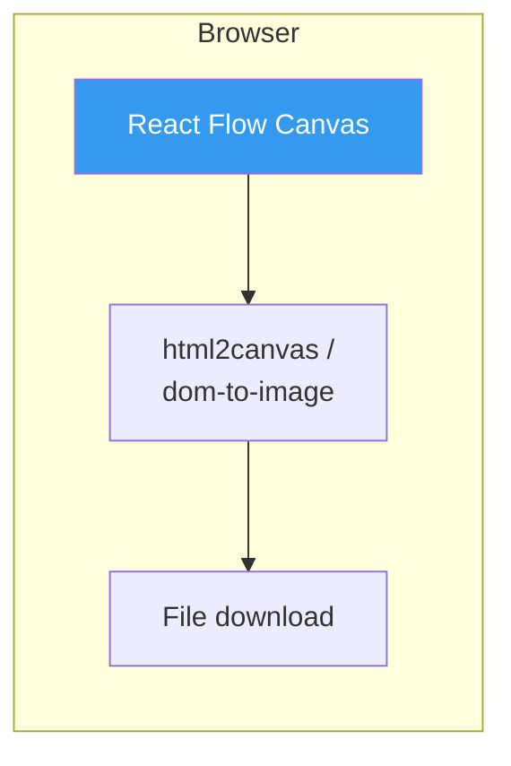
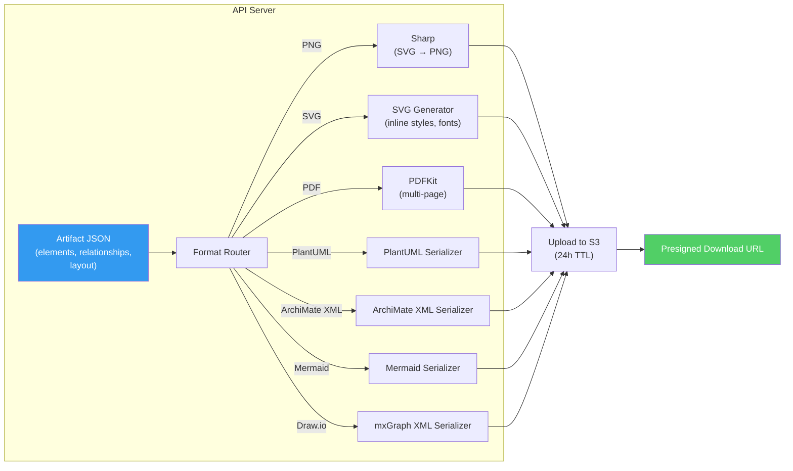
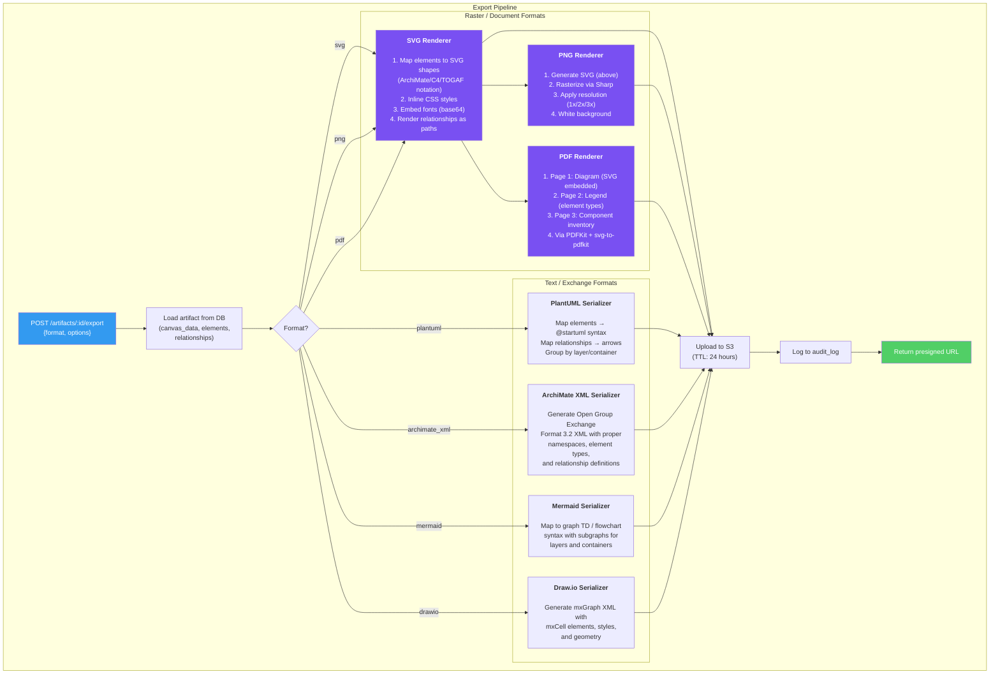
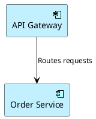

# ADR-004: Export Pipeline Architecture

## Status

Accepted

## Date

2026-02-19

## Context

ArchForge must export artifacts in 7 formats: PNG, SVG, PDF, PlantUML, ArchiMate XML, Mermaid, and Draw.io. Each format has different technical requirements:

| Format | Type | Purpose | Technical Requirement |
|--------|------|---------|----------------------|
| PNG | Raster image | Presentations, documentation | SVG-to-PNG rasterization |
| SVG | Vector graphic | Scalable diagrams, embedding | Clean SVG with inline styles |
| PDF | Document | Formal deliverables, printing | Multi-page: diagram + legend + inventory |
| PlantUML | Text notation | Integration with PlantUML tools | Map elements to PlantUML syntax |
| ArchiMate XML | Exchange format | Interop with EA tools (Archi, Sparx) | Open Group Exchange Format 3.2 |
| Mermaid | Text notation | GitHub, Markdown embedding | Map elements to Mermaid syntax |
| Draw.io | XML diagram | Integration with diagrams.net | mxGraph XML format |

### Requirements from PRD

- AC-04.1: PNG at 2x resolution, white background, within 5 seconds.
- AC-04.3: PDF with diagram, legend, and component inventory table.
- AC-04.5: ArchiMate XML conforming to Exchange Format 3.2.
- AC-04.8: Prompt to save unsaved changes before export.
- NFR: Export generation under 5 seconds for any format.

### Constraints

- Must produce deterministic output (same artifact = same export, regardless of browser).
- Must work without a browser (CLI export for future API usage).
- Maximum export file size: 50MB.
- Export files are temporary (24-hour TTL on S3).

---

## Options Considered

### Option A: Client-Side Export



**Pros**: No server load. Immediate download. Works offline.
**Cons**: Browser-dependent rendering (different browsers produce different output). No server-side PDF generation. Cannot export without a browser (no API export). Font rendering inconsistencies. Memory issues with large diagrams.

### Option B: Server-Side Export (Selected)



**Pros**: Deterministic output. Works without a browser. Consistent fonts and rendering. Can generate PDF with multiple pages. Enables future API-based batch exports.
**Cons**: Server CPU/memory usage. Requires server-side rendering libraries. Export adds latency (upload to S3).

### Option C: Hybrid (Client for Simple, Server for Complex)

**Pros**: Reduces server load for simple exports (SVG, text formats).
**Cons**: Two code paths to maintain. Inconsistent output between client and server exports. Complex to test.

---

## Decision

**Option B: Server-side export with format-specific serializers.**

All exports are rendered on the API server from the canonical artifact JSON data model. This ensures deterministic, browser-independent output.

### Architecture



### Format-Specific Implementation

#### SVG (Foundation for PNG and PDF)

The SVG renderer is the foundation. It maps canvas elements to SVG shapes based on the framework:

| Framework | Element → SVG Shape |
|-----------|-------------------|
| ArchiMate | Application Component → rounded rectangle with icon; Technology Service → rectangle with gear; Business Actor → stick figure |
| C4 | Person → person shape; Container → rectangle with tech label; System → large rounded box |
| TOGAF | Building Block → rectangle with classification badge |

Libraries: Custom TypeScript SVG builder (no external dependency). Fonts embedded as base64 to ensure consistency.

#### PNG

SVG → PNG via [Sharp](https://sharp.pixelplumbing.com/) (libvips binding). Sharp is the fastest Node.js image processing library.

```
Artifact JSON → SVG Renderer → Sharp.svg().png({density: 144}) → Buffer → S3
```

Resolution options: 1x (72 DPI), 2x (144 DPI, default), 3x (216 DPI).

#### PDF

Multi-page PDF via [PDFKit](https://pdfkit.org/) with `svg-to-pdfkit` for embedding the diagram SVG.

```
Page 1: Diagram (SVG embedded, scaled to fit A4/Letter)
Page 2: Legend (element types, relationship types, color coding)
Page 3: Component Inventory Table (name, type, layer, description)
```

#### PlantUML

Custom serializer that maps the canonical element/relationship model to PlantUML syntax:



#### ArchiMate XML (Open Group Exchange Format)

XML serialization conforming to the [ArchiMate Model Exchange File Format](https://www.opengroup.org/open-group-archimate-model-exchange-file-format) specification (version 3.2). Uses namespaces `http://www.opengroup.org/xsd/archimate/3.0/`.

#### Mermaid

Maps elements to Mermaid `graph TD` or `flowchart TD` syntax. Subgraphs represent layers or containers. Relationships map to Mermaid edge syntax.

#### Draw.io (mxGraph XML)

Generates XML compatible with [diagrams.net](https://diagrams.net). Each element maps to an `mxCell` with style attributes for shape, color, and position. Relationships map to `mxCell` edges with routing.

### Performance Budget

| Format | Target | Strategy |
|--------|--------|----------|
| SVG | < 1s | Pure string generation, no I/O |
| PNG | < 3s | Sharp is optimized (libvips) |
| PDF | < 3s | PDFKit streams to buffer |
| PlantUML | < 0.5s | String template generation |
| ArchiMate XML | < 0.5s | XML string generation |
| Mermaid | < 0.5s | String template generation |
| Draw.io | < 0.5s | XML string generation |

All under the 5-second PRD requirement.

### S3 Upload and Download

1. Export file is generated in memory (buffer).
2. Uploaded to S3 with a key: `exports/{userId}/{exportId}.{ext}`.
3. S3 lifecycle policy deletes objects after 24 hours.
4. A presigned GET URL (valid 24 hours) is returned to the client.
5. The export record is logged in the `exports` table and `audit_log`.

---

## Consequences

### Positive

- Deterministic output: same artifact always produces the same export, regardless of browser.
- Server-side rendering enables future API-based batch exports (CI/CD integration).
- Single code path: no browser-specific rendering differences to debug.
- ArchiMate XML export enables interoperability with Archi, Sparx, and other EA tools.
- PDF export includes professional documentation (legend, inventory), not just the diagram.

### Negative

- Server CPU usage for PNG/PDF rendering. Mitigation: Sharp uses libvips (fast), and exports are rate-limited to 20/min per user.
- SVG renderer must be maintained for each framework's notation. Mitigation: notation shapes are defined as reusable template functions.
- No instant preview in browser before download. Mitigation: the canvas already shows the artifact; export is "download what you see."

### Future Enhancements

- **Batch export**: Export all artifacts in a project as a ZIP archive.
- **Scheduled exports**: Automatic nightly PDF generation for published artifacts.
- **Custom branding**: Add company logo and colors to exported PDFs.
- **PowerPoint export**: Generate .pptx slides for executive presentations.
