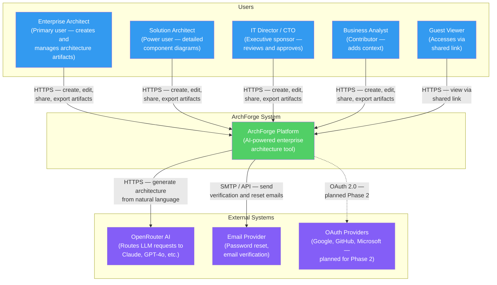
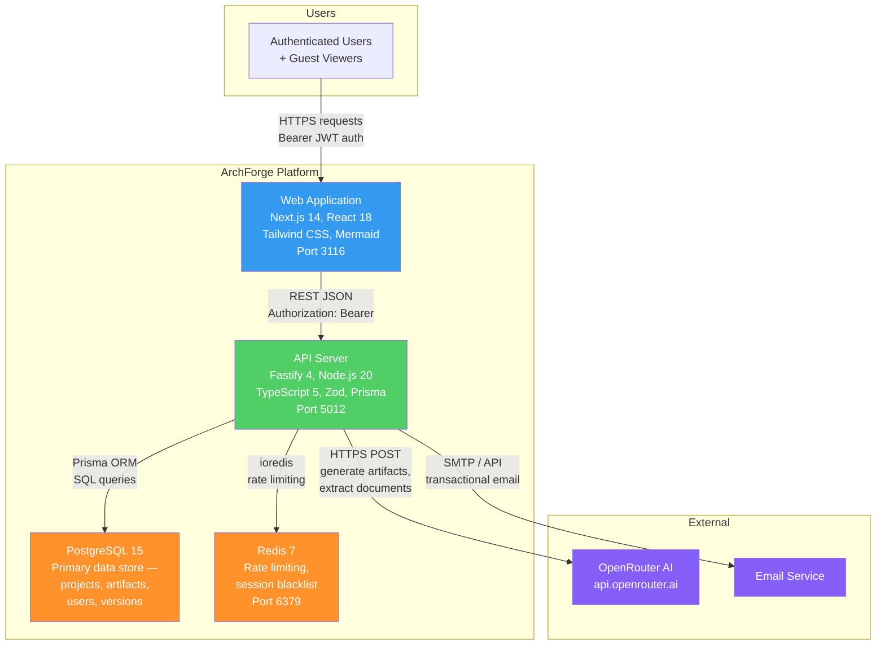
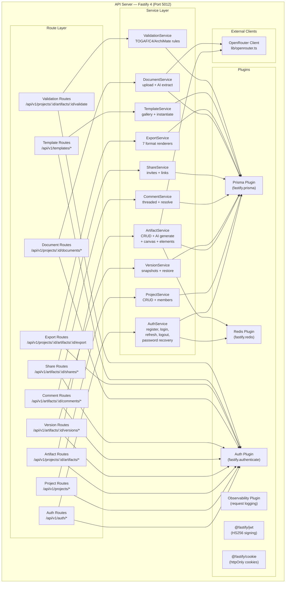
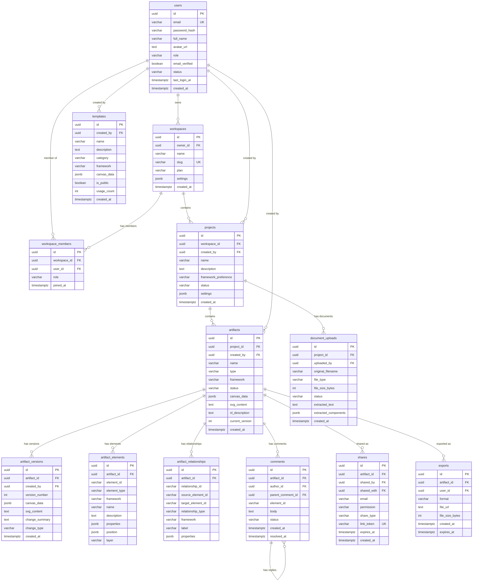
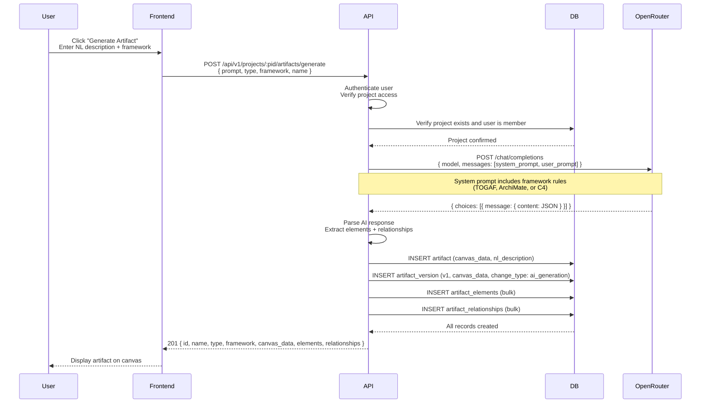
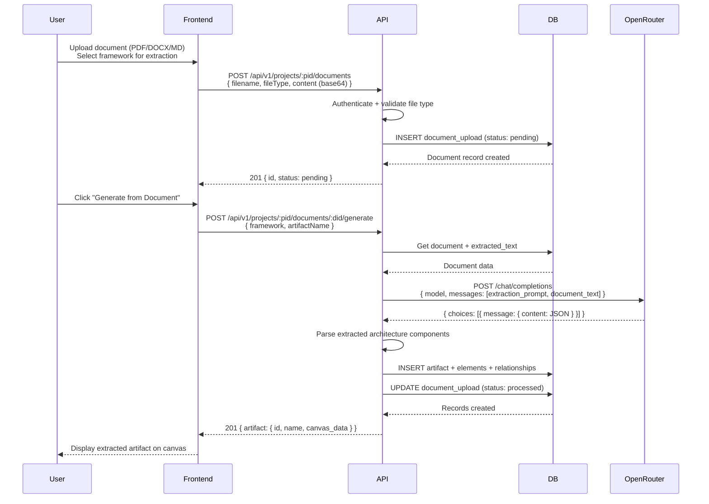
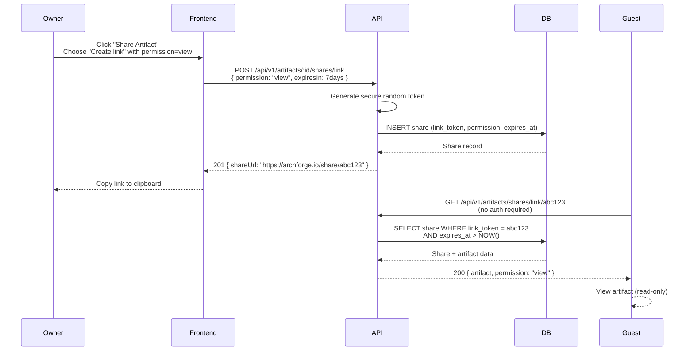
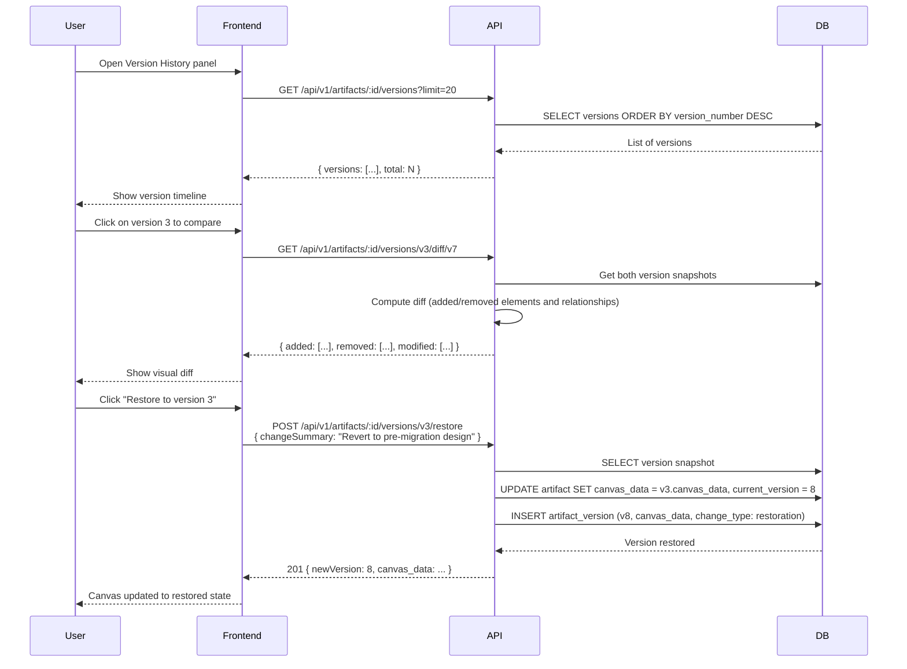

# ArchForge MVP Master Plan

**Document Version**: 1.0
**Date**: February 25, 2026
**Status**: MVP Complete
**Product**: ArchForge -- AI-Powered Enterprise Architecture Platform

---

## Table of Contents

1. [Executive Summary](#1-executive-summary)
2. [User Story Matrix](#2-user-story-matrix)
3. [Feature Completion Status](#3-feature-completion-status)
4. [C4 Context Diagram](#4-c4-context-diagram)
5. [C4 Container Diagram](#5-c4-container-diagram)
6. [C4 Component Diagram](#6-c4-component-diagram)
7. [ER Diagram](#7-er-diagram)
8. [Sequence Diagrams](#8-sequence-diagrams)
9. [API Contract Summary](#9-api-contract-summary)
10. [Test Coverage Summary](#10-test-coverage-summary)
11. [Known Limitations and Future Work](#11-known-limitations-and-future-work)

---

## 1. Executive Summary

ArchForge MVP is complete. The system is a production-ready AI-powered
enterprise architecture platform consisting of:

- A **Fastify 4** API server (port 5012) with 10 feature modules and
  216 passing integration tests
- A **Next.js 14** frontend (port 3116) with all core pages implemented
- A **PostgreSQL 15** database with a fully normalized schema covering
  users, projects, artifacts, elements, relationships, versions,
  comments, shares, templates, exports, and document uploads
- **OpenRouter AI** integration for natural language to architecture
  artifact generation and document ingestion
- **4 Playwright E2E test suites** covering auth, project management,
  artifact generation, and smoke tests

The MVP delivers the core value proposition: an enterprise architect can
describe a system in natural language and receive a standards-compliant
architecture artifact (TOGAF, ArchiMate, or C4) within minutes, then
refine it on an interactive canvas, share it with collaborators, and
export it in multiple formats.

---

## 2. User Story Matrix

| ID | User Story | Acceptance Criteria | Backend | Frontend | E2E |
|----|-----------|---------------------|---------|----------|-----|
| US-01 | As an enterprise architect, I want to register and log in, so that I can access my workspace securely. | Registration creates account; login returns JWT; refresh rotates token; logout revokes session | Done | Done | Done |
| US-02 | As an enterprise architect, I want to create and manage projects, so that I can organize my architecture work. | CRUD for projects; team member management; framework preference per project | Done | Done | Done |
| US-03 | As an enterprise architect, I want to generate architecture artifacts from natural language, so that I can go from description to diagram in minutes. | POST /generate calls AI; returns artifact with elements and relationships; canvas JSON stored | Done | Done | Partial |
| US-04 | As an enterprise architect, I want to edit artifacts on an interactive canvas, so that I can refine AI output. | Add/update/delete elements and relationships; save canvas data; version snapshot created | Done | Done | No |
| US-05 | As an enterprise architect, I want to track version history, so that I can restore previous states of an artifact. | List versions; get specific version; diff between versions; restore creates new version | Done | Partial | No |
| US-06 | As an enterprise architect, I want to collaborate with colleagues via comments, so that I can get feedback on diagrams. | Threaded comments on artifacts; comments can be anchored to elements; resolve workflow | Done | Partial | No |
| US-07 | As an enterprise architect, I want to share artifacts with stakeholders, so that I can communicate architecture decisions. | Share by user invite; share via public link with token; revoke shares; guest can view via link | Done | Partial | No |
| US-08 | As an enterprise architect, I want to upload existing architecture documents, so that I can extract and model components automatically. | Upload PDF/DOCX/MD; AI extracts architecture components; create artifact from document | Done | Partial | No |
| US-09 | As an enterprise architect, I want to export artifacts in standard formats, so that I can use them in other tools and reports. | Export to SVG, PNG, PDF, PlantUML, ArchiMate XML, Mermaid, DrawIO; file download response | Done | Partial | No |

---

## 3. Feature Completion Status

### Backend Modules

| Module | Routes | Service | Tests | Notes |
|--------|--------|---------|-------|-------|
| auth | Register, login, refresh, logout, me, forgot-password, reset-password, verify-email | AuthService + AuthRecoveryService | Done | httpOnly refresh cookie, JTI revocation |
| projects | CRUD + members | ProjectService | Done | confirmName required for deletion |
| artifacts | CRUD + AI generate + regenerate + canvas save | ArtifactService | Done | OpenRouter integration |
| elements | CRUD per artifact | ArtifactService | Done | Denormalized from canvas_data |
| relationships | CRUD per artifact | ArtifactService | Done | Denormalized from canvas_data |
| versions | List, get, diff, restore | VersionService | Done | Immutable snapshots |
| comments | CRUD + resolve; threaded; element-anchored | CommentService | Done | |
| shares | User invite + link + revoke + public resolve | ShareService | Done | Token-based public access |
| documents | Upload + list + get + AI generate from doc | DocumentService | Done | OpenRouter for extraction |
| exports | Export to 7 formats | ExportService | Done | Server-side rendering |
| templates | List + get + create + instantiate | TemplateService | Done | Public gallery + private |
| validation | Validate artifact against framework rules | ValidationService | Done | TOGAF, ArchiMate, C4 |

### Frontend Pages

| Page | Route | Status | Notes |
|------|-------|--------|-------|
| Landing | `/` | Done | Hero, features, nav |
| Register | `/register` | Done | Form validation, redirect to dashboard |
| Login | `/login` | Done | Bearer token storage, redirect |
| Dashboard | `/dashboard` | Done | Project list, create project |
| Project Detail | `/projects/[id]` | Done | Artifact list, project actions |
| Artifact Canvas | `/artifacts/[id]` | Done | Canvas + Mermaid rendering |
| Templates Gallery | `/templates` | Done | Browse, instantiate |
| Settings | `/settings` | Done | Profile management |

### API Tests

- **216/216 passing** (100%)
- Coverage: all modules, happy paths and error cases
- Real PostgreSQL database (no mocks)

---

## 4. C4 Context Diagram

---

## 5. C4 Container Diagram

---

## 6. C4 Component Diagram

---

## 7. ER Diagram

---

## 8. Sequence Diagrams

### AI Artifact Generation Flow

### Document Ingestion Flow

### Share and Collaboration Flow

### Version Restore Flow

---

## 9. API Contract Summary

All endpoints require `Authorization: Bearer <accessToken>` unless noted.
Base URL: `http://localhost:5012/api/v1`

### Auth

| Method | Path | Auth | Description |
|--------|------|------|-------------|
| POST | `/auth/register` | No | Create account. Body: `{ email, password, fullName }`. Returns: `{ accessToken, expiresAt, user }` |
| POST | `/auth/login` | No | Login. Body: `{ email, password }`. Returns: `{ accessToken, expiresAt, user }` + sets `refreshToken` cookie |
| POST | `/auth/refresh` | Cookie | Rotate refresh token. Returns: `{ accessToken, expiresAt }` |
| POST | `/auth/logout` | Bearer | Revoke session. Returns: `{ message }` |
| GET | `/auth/me` | Bearer | Get current user profile |
| POST | `/auth/forgot-password` | No | Send reset email. Body: `{ email }` |
| POST | `/auth/reset-password` | No | Reset with token. Body: `{ token, password }` |
| GET | `/auth/verify-email/:token` | No | Verify email address |

### Projects

| Method | Path | Auth | Description |
|--------|------|------|-------------|
| GET | `/projects` | Bearer | List user's projects. Query: `?page=1&limit=20&search=` |
| POST | `/projects` | Bearer | Create project. Body: `{ name, description?, framework? }` |
| GET | `/projects/:id` | Bearer | Get project details |
| PUT | `/projects/:id` | Bearer | Update project. Body: `{ name?, description?, framework? }` |
| DELETE | `/projects/:id` | Bearer | Delete project. Body: `{ confirmName }` (must match project name) |
| GET | `/projects/:id/members` | Bearer | List project members |
| POST | `/projects/:id/members` | Bearer | Add member. Body: `{ email, role }` |

### Artifacts

| Method | Path | Auth | Description |
|--------|------|------|-------------|
| POST | `/projects/:pid/artifacts/generate` | Bearer | AI-generate artifact. Body: `{ prompt, type, framework, name }` |
| POST | `/projects/:pid/artifacts` | Bearer | Manual create. Body: `{ name, type, framework, canvas_data? }` |
| GET | `/projects/:pid/artifacts` | Bearer | List artifacts. Query: `?page=1&limit=20&framework=&status=` |
| GET | `/projects/:pid/artifacts/:id` | Bearer | Get artifact with canvas data |
| PUT | `/projects/:pid/artifacts/:id` | Bearer | Update artifact metadata |
| DELETE | `/projects/:pid/artifacts/:id` | Bearer | Delete artifact |
| POST | `/projects/:pid/artifacts/:id/regenerate` | Bearer | Regenerate with new prompt. Body: `{ prompt }` |
| PUT | `/projects/:pid/artifacts/:id/canvas` | Bearer | Save canvas state. Body: `{ canvasData }` |

### Elements and Relationships

| Method | Path | Auth | Description |
|--------|------|------|-------------|
| POST | `/projects/:pid/artifacts/:id/elements` | Bearer | Add element. Body: `{ elementId, elementType, name, framework, position?, properties? }` |
| GET | `/projects/:pid/artifacts/:id/elements` | Bearer | List all elements |
| PUT | `/projects/:pid/artifacts/:id/elements/:eid` | Bearer | Update element |
| DELETE | `/projects/:pid/artifacts/:id/elements/:eid` | Bearer | Delete element |
| POST | `/projects/:pid/artifacts/:id/relationships` | Bearer | Add relationship. Body: `{ relationshipId, sourceElementId, targetElementId, relationshipType, framework }` |
| GET | `/projects/:pid/artifacts/:id/relationships` | Bearer | List all relationships |
| DELETE | `/projects/:pid/artifacts/:id/relationships/:rid` | Bearer | Delete relationship |

### Versions

| Method | Path | Auth | Description |
|--------|------|------|-------------|
| GET | `/artifacts/:id/versions` | Bearer | List versions. Query: `?page=1&limit=20` |
| GET | `/artifacts/:id/versions/:vid` | Bearer | Get specific version snapshot |
| GET | `/artifacts/:id/versions/:fromId/diff/:toId` | Bearer | Diff two versions |
| POST | `/artifacts/:id/versions/:vid/restore` | Bearer | Restore version. Body: `{ changeSummary? }` |

### Comments

| Method | Path | Auth | Description |
|--------|------|------|-------------|
| POST | `/artifacts/:id/comments` | Bearer | Create comment. Body: `{ body, elementId?, parentCommentId? }` |
| GET | `/artifacts/:id/comments` | Bearer | List comments. Query: `?page=1&limit=50&elementId=&status=open` |
| PUT | `/artifacts/:id/comments/:cid` | Bearer | Update comment. Body: `{ body }` |
| DELETE | `/artifacts/:id/comments/:cid` | Bearer | Delete comment |
| POST | `/artifacts/:id/comments/:cid/resolve` | Bearer | Mark comment as resolved |

### Shares

| Method | Path | Auth | Description |
|--------|------|------|-------------|
| POST | `/artifacts/:id/shares/user` | Bearer | Share with user. Body: `{ email, permission, expiresIn? }` |
| POST | `/artifacts/:id/shares/link` | Bearer | Create shareable link. Body: `{ permission, expiresIn? }` |
| GET | `/artifacts/:id/shares` | Bearer | List all shares for artifact |
| DELETE | `/artifacts/:id/shares/:sid` | Bearer | Revoke share |
| GET | `/artifacts/shares/link/:token` | None | Resolve public share link |

### Documents

| Method | Path | Auth | Description |
|--------|------|------|-------------|
| POST | `/projects/:pid/documents` | Bearer | Upload document. Body: `{ filename, fileType, content (base64), fileSize }` |
| GET | `/projects/:pid/documents` | Bearer | List documents in project |
| GET | `/projects/:pid/documents/:did` | Bearer | Get document with extracted content |
| POST | `/projects/:pid/documents/:did/generate` | Bearer | Generate artifact from document. Body: `{ framework, artifactName }` |

### Exports

| Method | Path | Auth | Description |
|--------|------|------|-------------|
| POST | `/projects/:pid/artifacts/:id/export` | Bearer | Export artifact. Body: `{ format }`. Formats: `svg`, `png`, `pdf`, `plantuml`, `archimate_xml`, `mermaid`, `drawio`. Returns binary file download |

### Templates

| Method | Path | Auth | Description |
|--------|------|------|-------------|
| GET | `/templates` | Bearer | List templates. Query: `?category=&framework=&search=` |
| GET | `/templates/:id` | Bearer | Get template with canvas data |
| POST | `/templates` | Bearer | Create template. Body: `{ name, description, category, framework, canvas_data, isPublic? }` |
| POST | `/templates/:id/instantiate` | Bearer | Create artifact from template. Body: `{ projectId, name, description? }` |

### Validation

| Method | Path | Auth | Description |
|--------|------|------|-------------|
| POST | `/projects/:pid/artifacts/:id/validate` | Bearer | Validate artifact against its framework. Returns: `{ valid, score, issues: [{ rule, severity, message, elementId? }] }` |

---

## 10. Test Coverage Summary

### API Integration Tests

| Module | Test File | Status |
|--------|-----------|--------|
| auth | auth.test.ts | 216/216 total passing |
| projects | projects.test.ts | Included in total |
| artifacts | artifacts.test.ts | Included in total |
| versions | versions.test.ts | Included in total |
| comments | comments.test.ts | Included in total |
| shares | shares.test.ts | Included in total |
| documents | documents.test.ts | Included in total |
| exports | exports.test.ts | Included in total |
| templates | templates.test.ts | Included in total |
| validation | validation.test.ts | Included in total |

**Total**: 216/216 passing (100%)
**Database**: Real PostgreSQL (no mocks, no in-memory fakes)

### E2E Tests (Playwright)

| Suite | File | Coverage |
|-------|------|----------|
| Smoke | smoke.spec.ts | Landing page, login page, register page, API health, nav links |
| Auth Flow | auth.spec.ts | Register, login, dashboard access, wrong password error, duplicate email error, password mismatch |
| Project Management | projects.spec.ts | Create project, view in list, navigate to detail, delete with confirmation |
| Artifact Generation | artifacts.spec.ts | Navigate to project, open generate dialog, submit prompt, view artifact detail |

**E2E Note**: Tests use `reuseExistingServer: true` and require both the
API (port 5012) and the web app (port 3116) to be running. E2E tests
are not run in CI without a full environment; the Playwright config
starts the servers automatically when running `npx playwright test`.

### Web App Tests

No unit or component tests currently exist for the Next.js frontend. The
web app passes TypeScript type checking (`tsc --noEmit`) with zero errors.

---

## 11. Known Limitations and Future Work

### Current Limitations (MVP)

| Area | Limitation |
|------|-----------|
| Canvas editor | ReactFlow integration is frontend-only; no collaborative real-time sync (WebSocket planned in Phase 2) |
| Document ingestion | Documents must be sent as base64 in JSON body; no multipart form upload in MVP |
| Export formats | SVG and Mermaid exports are functional; PNG/PDF require a headless browser renderer (Puppeteer or Playwright) not yet integrated — currently returns SVG as fallback |
| Authentication | OAuth (Google, GitHub, Microsoft) is designed in schema but not yet implemented |
| TOTP / MFA | Schema supports TOTP but UI and API endpoints not yet built |
| Workspaces | Database schema has workspace model; API currently uses a single default workspace per user |
| Search | Trigram indexes exist in DB; full-text search endpoints not yet exposed in API |
| Notifications | Email service integration for collaboration notifications (comment, share) not yet implemented |
| File storage | Exports reference a `file_url` — actual S3/MinIO upload not integrated; returns inline content |

### Phase 2 Roadmap

| Feature | Description |
|---------|-------------|
| Real-time collaboration | WebSocket rooms via Fastify WS plugin + Redis Pub/Sub |
| OAuth login | Google, GitHub, Microsoft via SAML/OIDC |
| Living architecture | Auto-sync with cloud infrastructure (AWS, Azure, GCP) |
| Enterprise SSO and RBAC | SAML integration, workspace-level role management |
| BPMN process modeling | Business process diagrams from natural language |
| S3 / MinIO file storage | Binary exports stored and served via presigned URLs |
| Web component tests | React Testing Library tests for key components |
| Notification system | Email + in-app notifications for collaboration events |
| Compliance validation | Validate architecture against regulatory requirements |
| Integration API | Platform API for third-party tool integration |

### ConnectSW Portfolio Integration

| Integration | Description |
|-------------|-------------|
| ConnectGRC | Architecture artifacts inform risk and compliance assessments |
| CodeGuardian | Architecture diagrams guide automated code security analysis |
