# ArchForge Product Requirements Document (PRD)

**Document Version**: 1.0
**Date**: February 19, 2026
**Author**: Product Manager, ConnectSW
**Status**: Draft for CEO Review
**Product**: ArchForge -- AI-Powered Enterprise Architecture Platform

---

## Table of Contents

1. [Business Context](#1-business-context)
2. [User Personas](#2-user-personas)
3. [User Stories and Acceptance Criteria](#3-user-stories-and-acceptance-criteria)
4. [User Flows](#4-user-flows)
5. [System Architecture (C4 Diagrams)](#5-system-architecture-c4-diagrams)
6. [Sequence Diagrams](#6-sequence-diagrams)
7. [State Diagrams](#7-state-diagrams)
8. [Data Model (ER Diagram)](#8-data-model-er-diagram)
9. [Site Map](#9-site-map)
10. [Non-Functional Requirements](#10-non-functional-requirements)
11. [Phasing: MVP, Phase 2, Future](#11-phasing-mvp-phase-2-future)
12. [Success Metrics](#12-success-metrics)
13. [Out of Scope](#13-out-of-scope)
14. [Risks and Mitigations](#14-risks-and-mitigations)

---

## 1. Business Context

### 1.1 Problem Statement

Enterprise architects spend **60-80% of their working time** on manual documentation and diagram creation rather than strategic architecture decisions. Current enterprise architecture tools (LeanIX, Ardoq, MEGA HOPEX, BiZZdesign, Sparx Systems) require 3-6 months of onboarding, cost $50K-500K annually, and produce models that become stale within weeks of creation. No incumbent tool generates complete, standards-compliant EA artifacts from natural language input.

The result: architecture programs fail to deliver strategic value, stakeholder engagement is low because artifacts are inaccessible to non-specialists, and organizations lack an accurate, living view of their IT landscape.

### 1.2 Target Market and Users

The enterprise architecture tools market is valued at **$1.14B (2024)** and is projected to reach **$1.6-2.2B by 2030** at a **6% CAGR** (Grand View Research, Research and Markets). Key segments:

| Segment | Share | Growth |
|---------|-------|--------|
| Cloud-based platforms | 53.71% | Dominant, expected 65%+ by 2026 |
| Large enterprises | 63.52% | Primary market today |
| SMEs | 36.48% | Fastest growing at 9.48% CAGR -- underserved |
| North America | 37% | Largest regional market |

**Primary target users**: Enterprise Architects, Solution Architects, IT Directors/CTOs, and Business Analysts in organizations undergoing digital transformation, cloud migration, or regulatory compliance initiatives.

**Initial serviceable obtainable market (SOM)**: $2-5M in Year 1, growing to $15-45M by Year 3 (1-3% of SAM).

### 1.3 Value Proposition

> **For** enterprise architects, solution architects, and IT leaders **who** need to document, communicate, and govern their organization's IT landscape, **ArchForge** is an AI-powered enterprise architecture platform **that** generates standards-compliant architecture artifacts from natural language descriptions. **Unlike** LeanIX, Ardoq, MEGA, and other traditional EA tools, **ArchForge** is built AI-first, delivers value in minutes instead of months, and keeps architecture living and current through continuous infrastructure synchronization.

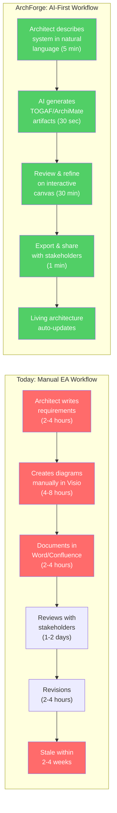
```mermaid
flowchart LR
    subgraph "Today: Manual EA Workflow"
        A["Architect writes<br/>requirements<br/>(2-4 hours)"] --> B["Creates diagrams<br/>manually in Visio<br/>(4-8 hours)"]
        B --> C["Documents in<br/>Word/Confluence<br/>(2-4 hours)"]
        C --> D["Reviews with<br/>stakeholders<br/>(1-2 days)"]
        D --> E["Revisions<br/>(2-4 hours)"]
        E --> F["Stale within<br/>2-4 weeks"]
    end

    subgraph "ArchForge: AI-First Workflow"
        G["Architect describes<br/>system in natural<br/>language (5 min)"] --> H["AI generates<br/>TOGAF/ArchiMate<br/>artifacts (30 sec)"]
        H --> I["Review & refine<br/>on interactive<br/>canvas (30 min)"]
        I --> J["Export & share<br/>with stakeholders<br/>(1 min)"]
        J --> K["Living architecture<br/>auto-updates"]
    end

    style A fill:#ff6b6b,color:#fff
    style B fill:#ff6b6b,color:#fff
    style C fill:#ff6b6b,color:#fff
    style F fill:#ff6b6b,color:#fff
    style G fill:#51cf66,color:#fff
    style H fill:#51cf66,color:#fff
    style I fill:#51cf66,color:#fff
    style J fill:#51cf66,color:#fff
    style K fill:#51cf66,color:#fff
```

**Time to first artifact**: From 8-16 hours (manual) to under 5 minutes (ArchForge).

### 1.4 Strategic Fit within ConnectSW Portfolio

ArchForge is the purest expression of ConnectSW's AI-first thesis. It has strong synergies with the existing product portfolio:

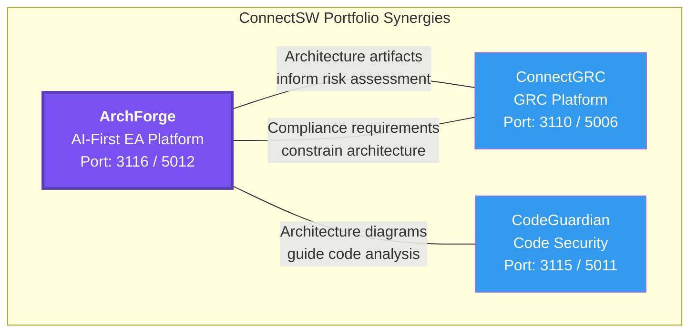
```mermaid
graph TD
    subgraph "ConnectSW Portfolio Synergies"
        AF["<b>ArchForge</b><br/>AI-First EA Platform<br/>Port: 3116 / 5012"]
        CG["ConnectGRC<br/>GRC Platform<br/>Port: 3110 / 5006"]
        CGD["CodeGuardian<br/>Code Security<br/>Port: 3115 / 5011"]
    end

    AF ---|"Architecture artifacts<br/>inform risk assessment"| CG
    AF ---|"Architecture diagrams<br/>guide code analysis"| CGD
    CG ---|"Compliance requirements<br/>constrain architecture"| AF

    style AF fill:#7950f2,color:#fff,stroke:#5c3dba,stroke-width:3px
    style CG fill:#339af0,color:#fff
    style CGD fill:#339af0,color:#fff
```

| Synergy | Value |
|---------|-------|
| ArchForge + ConnectGRC | Architecture artifacts feed risk/compliance assessments; compliance requirements constrain architecture decisions |
| ArchForge + CodeGuardian | Architecture diagrams provide context for code security analysis; security findings inform architecture |
| Shared AI engine | Common NLP and LLM infrastructure across products reduces cost and accelerates development |
| Shared enterprise customer base | Same buyers (CTO, CIO, CISO) across products enables cross-selling |

**Strategic Fit Score**: 9/10 (from Product Strategy assessment).

### 1.5 Competitive Differentiation

| Differentiator | ArchForge | Incumbents |
|---------------|-----------|-----------|
| AI artifact generation from NL | Core feature | Not available |
| Time to first artifact | Under 5 minutes | 3-6 months onboarding |
| Living architecture (auto-sync) | Built-in | Partial or absent |
| Framework expertise required | None (AI handles notation) | Extensive (months of training) |
| Pricing transparency | Published tiers ($0-custom) | "Contact sales" |

**18-month competitive window**: Incumbents are retrofitting AI onto legacy platforms. No AI-native EA tool exists. This window narrows by H2 2027 as incumbents mature their AI offerings.

---

## 2. User Personas

### 2.1 Persona Overview

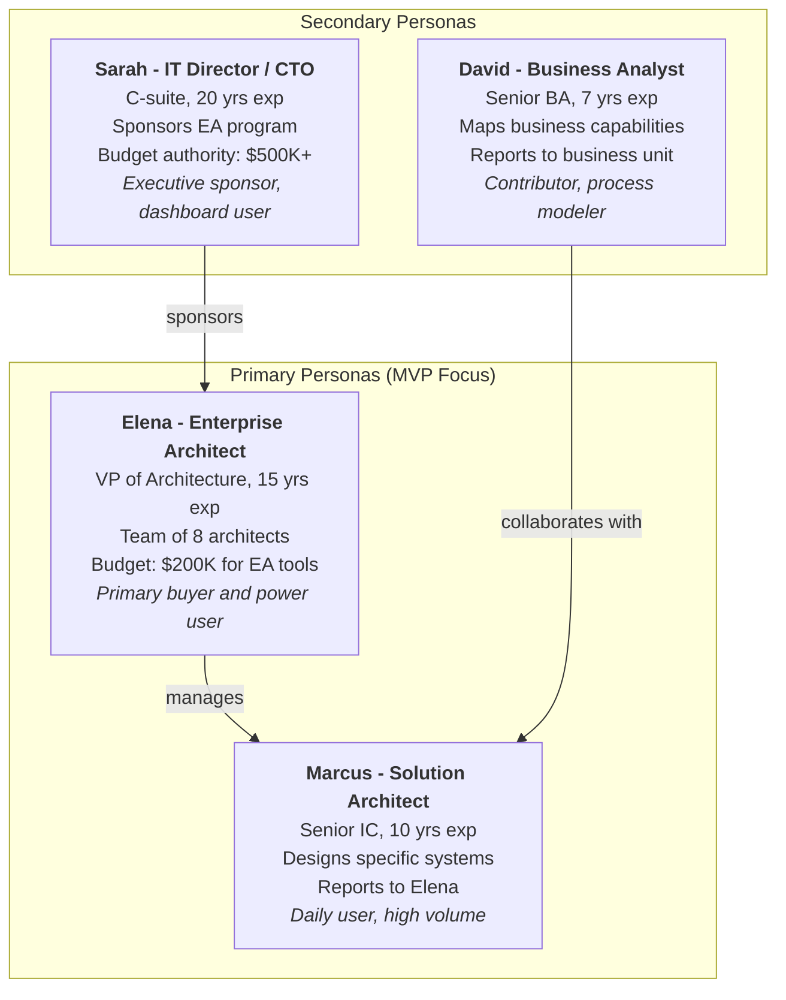
```mermaid
flowchart TD
    subgraph "Primary Personas (MVP Focus)"
        P1["<b>Elena - Enterprise Architect</b><br/>VP of Architecture, 15 yrs exp<br/>Team of 8 architects<br/>Budget: $200K for EA tools<br/><i>Primary buyer and power user</i>"]
        P2["<b>Marcus - Solution Architect</b><br/>Senior IC, 10 yrs exp<br/>Designs specific systems<br/>Reports to Elena<br/><i>Daily user, high volume</i>"]
    end

    subgraph "Secondary Personas"
        P3["<b>Sarah - IT Director / CTO</b><br/>C-suite, 20 yrs exp<br/>Sponsors EA program<br/>Budget authority: $500K+<br/><i>Executive sponsor, dashboard user</i>"]
        P4["<b>David - Business Analyst</b><br/>Senior BA, 7 yrs exp<br/>Maps business capabilities<br/>Reports to business unit<br/><i>Contributor, process modeler</i>"]
    end

    P1 -->|"manages"| P2
    P3 -->|"sponsors"| P1
    P4 -->|"collaborates with"| P2
```

### 2.2 Elena -- Enterprise Architect (Primary Buyer)

| Attribute | Detail |
|-----------|--------|
| **Title** | VP of Enterprise Architecture |
| **Age** | 42 |
| **Experience** | 15 years in IT, 8 years in enterprise architecture |
| **Organization** | Mid-to-large enterprise (1,000-10,000 employees), financial services |
| **Team** | Manages 8 architects (solution, data, integration) |
| **Reports to** | CTO |
| **Budget authority** | $200K annually for EA tools and training |
| **Current tools** | LeanIX (primary), Confluence (documentation), Visio (ad hoc diagrams) |
| **Certifications** | TOGAF 10 Certified, ArchiMate 3.2 Practitioner |
| **Key frustration** | "I spend more time making diagrams than making decisions. My team is drowning in documentation, and our models are outdated before the ink is dry." |
| **Desired outcome** | Be recognized as a strategic advisor to the CTO, not a documentation team. Reduce time-to-architecture from weeks to hours. |
| **Decision criteria** | (1) Standards compliance (TOGAF, ArchiMate), (2) integration with existing tools, (3) time-to-value, (4) stakeholder accessibility |
| **Buying trigger** | Cloud migration initiative, M&A architecture assessment, regulatory audit preparation |

**Goals**:
- Generate standards-compliant architecture artifacts in minutes, not days
- Maintain a living, always-current architecture repository
- Communicate architecture effectively to non-technical stakeholders
- Demonstrate measurable EA program ROI to the CTO

**Pain points**:
- 60% of her team's time goes to manual diagram creation and documentation
- Architecture models become stale within 2-4 weeks of creation
- Stakeholders (CFO, business unit heads) dismiss architecture artifacts as too complex
- Current LeanIX subscription costs $150K/year and requires significant manual effort

### 2.3 Marcus -- Solution Architect (Power User)

| Attribute | Detail |
|-----------|--------|
| **Title** | Senior Solution Architect |
| **Age** | 35 |
| **Experience** | 10 years in software engineering, 4 years as solution architect |
| **Organization** | Same organization as Elena; reports to her |
| **Current tools** | Sparx Systems EA (modeling), Draw.io (quick diagrams), PlantUML (code-based diagrams) |
| **Certifications** | AWS Solutions Architect Professional, TOGAF Foundation |
| **Key frustration** | "Every project needs architecture docs, but creating them from scratch is painfully slow. I end up copying from old projects and modifying, which leads to inconsistencies." |
| **Desired outcome** | Produce high-quality solution architecture documents in hours instead of days. Focus on design decisions, not diagram mechanics. |

**Goals**:
- Rapidly generate solution architecture diagrams for new projects
- Ensure consistency across solution designs within the organization
- Export artifacts in formats compatible with existing tools (Sparx, Draw.io, PlantUML)
- Version-track architecture changes as projects evolve

**Pain points**:
- Creates 3-5 new solution architecture documents per month; each takes 2-3 days
- No templates or reusable patterns; every project starts from scratch
- Switching between tools (Sparx for formal models, Draw.io for quick diagrams) is inefficient
- Cannot easily show the relationship between his solution designs and Elena's enterprise architecture

### 2.4 Sarah -- IT Director / CTO (Executive Sponsor)

| Attribute | Detail |
|-----------|--------|
| **Title** | Chief Technology Officer |
| **Age** | 48 |
| **Experience** | 20 years in IT leadership |
| **Organization** | Mid-market tech company (500 employees) without a formal EA program |
| **Current tools** | PowerPoint (architecture presentations), Confluence (wiki-based documentation) |
| **Key frustration** | "I know we need enterprise architecture, but the tools are too expensive and complex for our size. My architects use PowerPoint and it shows." |
| **Desired outcome** | Stand up a lightweight EA program without hiring a dedicated EA team or spending $100K+ on tools. |

**Goals**:
- Get visibility into the organization's application portfolio and technology landscape
- Make informed decisions about technology investments and technical debt
- Prepare for SOC 2 and regulatory audits with proper architecture documentation
- Communicate technology strategy to the board with clear, professional diagrams

**Pain points**:
- No dedicated EA tool; architecture lives in scattered PowerPoints and wiki pages
- Cannot justify $100K+ for traditional EA tools at the company's current size
- Architecture decisions are made without a holistic view of the technology landscape
- Board presentations require manually created architecture diagrams that take days to prepare

### 2.5 David -- Business Analyst (Contributor)

| Attribute | Detail |
|-----------|--------|
| **Title** | Senior Business Analyst |
| **Age** | 31 |
| **Experience** | 7 years in business analysis, transitioning toward business architecture |
| **Organization** | Large enterprise; works in the business operations unit, collaborates with architecture team |
| **Current tools** | Confluence, Lucidchart, Excel |
| **Certifications** | CBAP, Six Sigma Green Belt |
| **Key frustration** | "I understand the business processes but I can't create proper architecture artifacts. ArchiMate and TOGAF feel like a foreign language." |
| **Desired outcome** | Contribute business capability maps and process models to the EA repository without learning ArchiMate notation. |

**Goals**:
- Map business capabilities and processes in natural language, have them converted to proper EA notation
- Collaborate with architects on business-IT alignment
- Track how business process changes impact the technology landscape
- Generate BPMN process diagrams from written process descriptions

**Pain points**:
- ArchiMate and TOGAF notation are intimidating; feels excluded from architecture conversations
- Business capability maps created in Excel/PowerPoint are not connected to the architecture repository
- Cannot see how proposed business process changes would impact IT systems
- Collaboration with architects is friction-heavy: meetings, email chains, document handoffs

---

## 3. User Stories and Acceptance Criteria

### 3.1 Story Map Overview

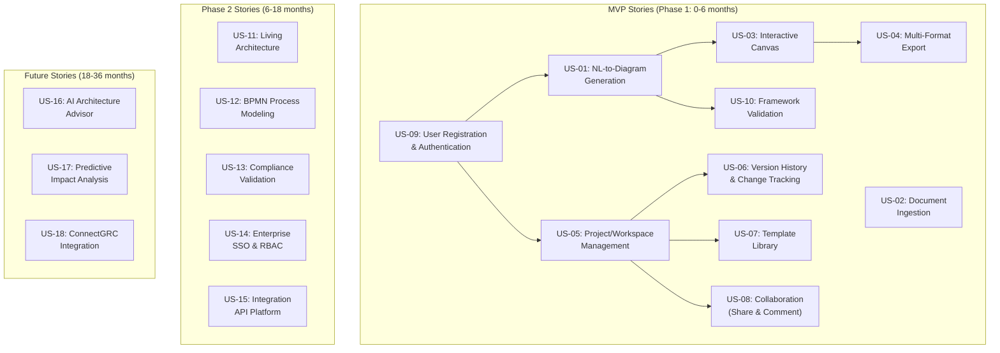
```mermaid
flowchart TD
    subgraph "MVP Stories (Phase 1: 0-6 months)"
        US01["US-01: NL-to-Diagram<br/>Generation"]
        US02["US-02: Document<br/>Ingestion"]
        US03["US-03: Interactive<br/>Canvas"]
        US04["US-04: Multi-Format<br/>Export"]
        US05["US-05: Project/Workspace<br/>Management"]
        US06["US-06: Version History<br/>& Change Tracking"]
        US07["US-07: Template<br/>Library"]
        US08["US-08: Collaboration<br/>(Share & Comment)"]
        US09["US-09: User Registration<br/>& Authentication"]
        US10["US-10: Framework<br/>Validation"]
    end

    subgraph "Phase 2 Stories (6-18 months)"
        US11["US-11: Living<br/>Architecture"]
        US12["US-12: BPMN Process<br/>Modeling"]
        US13["US-13: Compliance<br/>Validation"]
        US14["US-14: Enterprise<br/>SSO & RBAC"]
        US15["US-15: Integration<br/>API Platform"]
    end

    subgraph "Future Stories (18-36 months)"
        US16["US-16: AI Architecture<br/>Advisor"]
        US17["US-17: Predictive<br/>Impact Analysis"]
        US18["US-18: ConnectGRC<br/>Integration"]
    end

    US09 --> US01
    US09 --> US05
    US01 --> US03
    US03 --> US04
    US05 --> US06
    US01 --> US10
    US05 --> US07
    US05 --> US08
```

### US-01: Natural Language to Diagram Generation

**As** Elena (Enterprise Architect), **I want** to describe a system or architecture in natural language and have ArchForge generate standards-compliant diagrams (ArchiMate, C4, TOGAF views), **so that** I can produce professional architecture artifacts in minutes instead of days.

**Priority**: P0 (MVP Core)

**Acceptance Criteria**:

| # | Given | When | Then |
|---|-------|------|------|
| AC-01.1 | I am logged into ArchForge and have an active project | I type a natural language description such as "Our e-commerce platform has a React frontend, a Node.js API gateway, three microservices (orders, inventory, payments), a PostgreSQL database, and integrates with Stripe for payments and SendGrid for emails" | The system generates an ArchiMate application layer diagram showing all described components with correct ArchiMate notation (application components, application services, serving relationships) within 30 seconds |
| AC-01.2 | I have entered a natural language description | I select "C4 Model" as the output format | The system generates a C4 Context diagram showing the system boundary, actors, and external dependencies with correct C4 notation |
| AC-01.3 | I have entered a natural language description | I select "TOGAF" as the output format | The system generates a TOGAF Application Architecture view showing building blocks, interfaces, and data flows |
| AC-01.4 | The AI generates a diagram | I review the generated output | Each diagram element has a label, a type classification conforming to the selected framework, and correctly drawn relationships with labeled connections |
| AC-01.5 | The AI generates a diagram with an error (e.g., missing component I mentioned) | I provide corrective feedback in natural language such as "Add the Redis cache layer between the API gateway and microservices" | The system updates the diagram to incorporate my feedback without regenerating unaffected elements, and the update completes within 15 seconds |
| AC-01.6 | I enter an ambiguous or incomplete description | The system processes my input | The system asks up to 3 clarifying questions before generating, rather than making assumptions |
| AC-01.7 | I enter a description in a non-English language | The system processes my input | The system responds with a clear error message stating that only English is supported in the MVP, and suggests translating the input |

### US-02: Document and Text Ingestion

**As** Elena (Enterprise Architect), **I want** to upload existing documents (PDF, Word, Confluence exports, plain text) and have ArchForge extract architecture information and generate artifacts from them, **so that** I can modernize legacy documentation without manually re-entering information.

**Priority**: P0 (MVP Core)

**Acceptance Criteria**:

| # | Given | When | Then |
|---|-------|------|------|
| AC-02.1 | I am in an active project | I upload a PDF document (up to 50 pages, up to 20MB) containing system architecture descriptions | The system extracts system components, relationships, technologies, and data flows within 60 seconds and presents them as a structured summary for my review before generating artifacts |
| AC-02.2 | The system has extracted architecture information from my document | I confirm the extracted information is accurate (or make corrections) | The system generates ArchiMate or C4 diagrams from the confirmed extraction |
| AC-02.3 | I upload a document that contains no discernible architecture information | The system processes the document | The system displays a message: "No architecture elements could be identified in this document. Please upload a document that describes system components, technologies, or data flows." |
| AC-02.4 | I upload a file in an unsupported format (e.g., .xlsx, .pptx) | The system processes the upload | The system displays a clear error: "Unsupported file format. Supported formats: PDF, DOCX, TXT, MD, HTML." |
| AC-02.5 | I upload multiple documents for the same project | The system processes all documents | The system merges extracted information, identifies overlapping components, and flags potential conflicts for my review |
| AC-02.6 | I upload a document containing sensitive data (PII, credentials) | The system processes the document | The system does not store raw document contents after extraction; only the structured architecture data is retained. A confirmation message states: "Document processed. Raw content has been discarded; only extracted architecture data is retained." |

### US-03: Interactive Canvas for Viewing and Editing

**As** Marcus (Solution Architect), **I want** to view AI-generated artifacts on an interactive canvas where I can rearrange elements, add new components, modify relationships, and annotate diagrams, **so that** I can customize the AI output to match my specific needs.

**Priority**: P0 (MVP Core)

**Acceptance Criteria**:

| # | Given | When | Then |
|---|-------|------|------|
| AC-03.1 | An AI-generated diagram is displayed on the canvas | I click and drag a component | The component moves to the new position; connected relationships re-route automatically; the canvas renders the change within 200ms |
| AC-03.2 | A diagram is displayed on the canvas | I double-click a component | An editing panel opens allowing me to change the component's name, type, description, and properties |
| AC-03.3 | A diagram is displayed on the canvas | I right-click on empty space | A context menu appears with options: "Add Component", "Add Relationship", "Add Note", "Undo", "Redo" |
| AC-03.4 | I have made 5 changes to a diagram | I click "Undo" 3 times | The last 3 changes are reverted in reverse order; the canvas updates within 200ms per undo operation |
| AC-03.5 | A diagram has more than 50 components | I use zoom and pan controls | The canvas supports zoom levels from 10% to 400%, panning via mouse drag or scroll, and a mini-map for navigation; all interactions render at 60fps |
| AC-03.6 | I am editing a diagram on the canvas | I click "AI Refine" and type "group the microservices into a container boundary" | The AI rearranges the specified elements into a visual group while preserving my manual layout changes to other elements |
| AC-03.7 | A diagram is displayed on the canvas | I select multiple components (via Ctrl+click or lasso selection) | The selected components can be moved as a group, deleted together, or have a shared property changed |
| AC-03.8 | The canvas is rendered in a browser | The viewport is at least 1024x768 pixels | The canvas renders correctly without horizontal scrolling; toolbars and panels are accessible without overlapping the diagram area |

### US-04: Multi-Format Export

**As** Marcus (Solution Architect), **I want** to export generated artifacts in multiple formats (PNG, SVG, PDF, PlantUML, ArchiMate XML, Mermaid, Draw.io), **so that** I can integrate ArchForge output with my existing tools and workflows.

**Priority**: P0 (MVP Core)

**Acceptance Criteria**:

| # | Given | When | Then |
|---|-------|------|------|
| AC-04.1 | A diagram is displayed on the canvas | I click "Export" and select "PNG" | A PNG image is downloaded at 2x resolution (for print quality), with a white background and all elements rendered at their current canvas positions, within 5 seconds |
| AC-04.2 | A diagram is displayed on the canvas | I click "Export" and select "SVG" | An SVG file is downloaded that is fully vector-based, scalable, and can be opened in Adobe Illustrator, Inkscape, or any SVG-compatible editor |
| AC-04.3 | A diagram is displayed on the canvas | I click "Export" and select "PDF" | A PDF document is generated containing the diagram on the first page, a legend on the second page, and a component inventory table on the third page |
| AC-04.4 | A diagram is displayed on the canvas | I click "Export" and select "PlantUML" | A .puml text file is downloaded containing valid PlantUML syntax that reproduces the diagram when rendered by a PlantUML processor |
| AC-04.5 | A diagram is displayed on the canvas | I click "Export" and select "ArchiMate XML" | An ArchiMate Model Exchange File (.xml) is downloaded conforming to The Open Group ArchiMate Exchange Format specification (version 3.2) |
| AC-04.6 | A diagram is displayed on the canvas | I click "Export" and select "Mermaid" | A .md file is downloaded containing valid Mermaid syntax enclosed in a code fence that renders correctly on GitHub |
| AC-04.7 | A diagram is displayed on the canvas | I click "Export" and select "Draw.io" | A .drawio XML file is downloaded that can be opened in Draw.io (diagrams.net) with all elements and relationships preserved |
| AC-04.8 | I attempt to export a diagram that has unsaved changes | I click "Export" | The system prompts: "You have unsaved changes. Save before exporting?" with options "Save & Export" and "Export Current" |

### US-05: Project and Workspace Management

**As** Elena (Enterprise Architect), **I want** to organize my architecture work into projects within workspaces, with the ability to create, rename, archive, and delete projects, **so that** I can manage multiple architecture initiatives and keep my team's work organized.

**Priority**: P1 (MVP)

**Acceptance Criteria**:

| # | Given | When | Then |
|---|-------|------|------|
| AC-05.1 | I am logged in and on the dashboard | I click "New Project" and enter a name, description, and select a framework preference (ArchiMate, C4, TOGAF, or "Auto-detect") | A new project is created and I am redirected to the empty project workspace within 2 seconds |
| AC-05.2 | I have 3 projects in my workspace | I view the dashboard | All 3 projects are listed with their name, description, last-modified date, artifact count, and a thumbnail of the most recently edited diagram |
| AC-05.3 | I am viewing a project | I click "Settings" on the project | I can rename the project, update the description, change the framework preference, and transfer ownership to another team member |
| AC-05.4 | I have a project with 10 artifacts | I click "Archive Project" | The project is moved to an "Archived" section, no longer appears in the main project list, but is still accessible via the archive view. All artifacts remain intact. |
| AC-05.5 | I have an archived project | I click "Restore" on the archived project | The project is moved back to the active project list with all artifacts intact |
| AC-05.6 | I want to delete a project | I click "Delete Project" | A confirmation dialog appears: "This will permanently delete [project name] and all its artifacts. This action cannot be undone. Type the project name to confirm." The project is only deleted after I type the name correctly and click "Confirm Delete." |
| AC-05.7 | I have a workspace with multiple projects | I search for a project by name | The project list filters in real-time as I type, showing matching projects within 300ms |

### US-06: Version History and Change Tracking

**As** Elena (Enterprise Architect), **I want** to view the version history of every artifact, compare versions side-by-side, and restore previous versions, **so that** I can track how our architecture evolves and recover from unintended changes.

**Priority**: P1 (MVP)

**Acceptance Criteria**:

| # | Given | When | Then |
|---|-------|------|------|
| AC-06.1 | I am viewing an artifact that has been edited 5 times | I click "Version History" | A chronological list of all 5 versions is displayed, each showing: version number, timestamp, author, and a summary of changes (e.g., "Added 3 components, removed 1 relationship") |
| AC-06.2 | I am viewing the version history | I select two versions and click "Compare" | A side-by-side diff view shows the two versions, with added elements highlighted in green, removed elements in red, and modified elements in yellow |
| AC-06.3 | I am viewing a previous version in the diff view | I click "Restore This Version" | A confirmation dialog appears. After confirmation, the artifact reverts to the selected version, a new version entry is created (e.g., "Restored to v3"), and the canvas displays the restored artifact. |
| AC-06.4 | I make a change to an artifact on the canvas | The system saves automatically | A new version is created automatically. Auto-saves are batched: changes made within 30 seconds of each other are grouped into a single version entry. |
| AC-06.5 | I am viewing the version history of an artifact | I want to understand who changed what | Each version entry shows the author's name and avatar, the exact timestamp (with timezone), and a machine-generated change summary |

### US-07: Template Library

**As** Sarah (CTO), **I want** to browse and use pre-built architecture templates organized by industry vertical and architecture pattern, **so that** I can start new architecture projects quickly without deep EA framework expertise.

**Priority**: P1 (MVP)

**Acceptance Criteria**:

| # | Given | When | Then |
|---|-------|------|------|
| AC-07.1 | I am creating a new project or artifact | I click "Start from Template" | A template gallery is displayed with at least 20 templates organized by category: Industry (Financial Services, Healthcare, Retail, Technology), Pattern (Microservices, Event-Driven, Layered, Serverless), and Framework (ArchiMate, C4, TOGAF) |
| AC-07.2 | I am browsing the template gallery | I click on a template | A preview is displayed showing the template diagram, a description of the architecture pattern, applicable use cases, and a list of included components |
| AC-07.3 | I have selected a template | I click "Use This Template" | The template is copied into my project as a new artifact. All elements are editable. The original template is not modified. |
| AC-07.4 | I have customized a template for my project | I click "Save as Template" | My customized artifact is saved as a personal template in a "My Templates" section, available for reuse in future projects |
| AC-07.5 | I am in the template gallery | I search for "microservices healthcare" | The gallery filters to show templates matching both keywords, with relevance-ranked results displayed within 300ms |
| AC-07.6 | I am using a template | I ask the AI to "adapt this for a fintech company processing credit card payments" | The AI modifies the template to reflect fintech-specific components (payment processor, PCI DSS compliance boundary, KYC service) while preserving the structural pattern |

### US-08: Collaboration (Share and Comment)

**As** Elena (Enterprise Architect), **I want** to share artifacts with team members and stakeholders, collect comments and feedback on specific elements, and track review status, **so that** architecture review is collaborative and asynchronous.

**Priority**: P1 (MVP)

**Acceptance Criteria**:

| # | Given | When | Then |
|---|-------|------|------|
| AC-08.1 | I am viewing an artifact | I click "Share" and enter a colleague's email address | The colleague receives an email with a link to view the artifact. They can view the artifact without an ArchForge account (read-only guest access). |
| AC-08.2 | I am sharing an artifact | I set the permission to "Can Edit" | The invited user can make changes to the artifact after logging into their ArchForge account. All their changes are attributed to their user account in version history. |
| AC-08.3 | I am viewing a shared artifact | I click on a specific component and select "Add Comment" | A comment thread is created anchored to that specific component. The comment includes my text, my name, and a timestamp. Other viewers can reply to the comment. |
| AC-08.4 | There are 3 unresolved comments on an artifact | I view the artifact | Comment indicators (badges) are visible on the components that have comments. A comment panel shows all comments with their resolution status. |
| AC-08.5 | A colleague comments on my artifact | I am not currently viewing the artifact | I receive an in-app notification and an email notification (if email notifications are enabled) that "[colleague name] commented on [artifact name]: [first 100 characters of comment]" |
| AC-08.6 | I want to share a read-only view with an executive who does not have an ArchForge account | I click "Share" and select "Generate View Link" | A read-only URL is generated that expires after 7 days (configurable: 1-30 days). The link does not require authentication. The viewer sees the diagram but cannot edit, export, or comment. |

### US-09: User Registration and Authentication

**As** any user, **I want** to register for an ArchForge account using email/password or OAuth (Google, GitHub, Microsoft), **so that** I can securely access the platform and my architecture artifacts.

**Priority**: P0 (MVP Core -- prerequisite for all other stories)

**Acceptance Criteria**:

| # | Given | When | Then |
|---|-------|------|------|
| AC-09.1 | I am on the ArchForge landing page | I click "Sign Up" and enter my email, password (minimum 8 characters, at least 1 uppercase, 1 lowercase, 1 number, 1 special character), and full name | My account is created, a verification email is sent, and I am redirected to a "Check your email" page |
| AC-09.2 | I have received a verification email | I click the verification link within 24 hours | My email is verified, and I am redirected to the onboarding flow |
| AC-09.3 | I am on the registration page | I click "Continue with Google" | I am redirected to Google OAuth, and after authorizing, my account is created (or linked if an account with that email exists) and I am logged in |
| AC-09.4 | I am on the registration page | I click "Continue with GitHub" | I am redirected to GitHub OAuth, and after authorizing, my account is created (or linked) and I am logged in |
| AC-09.5 | I am on the registration page | I click "Continue with Microsoft" | I am redirected to Microsoft OAuth, and after authorizing, my account is created (or linked) and I am logged in |
| AC-09.6 | I have a verified account | I enter my email and password on the login page | I am authenticated and redirected to my dashboard. A JWT token is issued with a 24-hour expiry for the access token and a 7-day expiry for the refresh token. |
| AC-09.7 | I have forgotten my password | I click "Forgot Password" and enter my email | A password reset link is sent to my email. The link expires after 1 hour. After clicking the link, I can set a new password. |
| AC-09.8 | I attempt to register with an email already in use | I submit the registration form | The system displays: "An account with this email already exists. Please log in or reset your password." |
| AC-09.9 | I am logged in | I navigate to account settings | I can update my profile (name, avatar), change my password, manage connected OAuth accounts, and enable two-factor authentication (TOTP) |

### US-10: Framework Validation

**As** Elena (Enterprise Architect), **I want** AI-generated artifacts to be validated against official framework specifications (ArchiMate 3.2, TOGAF 10, C4 Model), **so that** I can trust that the output complies with industry standards and will pass governance reviews.

**Priority**: P1 (MVP)

**Acceptance Criteria**:

| # | Given | When | Then |
|---|-------|------|------|
| AC-10.1 | An AI-generated ArchiMate diagram is displayed | I click "Validate" | The system checks every element against the ArchiMate 3.2 specification: correct element types, valid relationship types between element pairs, proper layer assignments (Business, Application, Technology). A validation report is displayed with PASS/FAIL per rule. |
| AC-10.2 | The validation report shows 2 errors | I click on an error in the report | The canvas highlights the offending element or relationship, and the error message explains the violation (e.g., "A 'Serving' relationship from 'Application Component' to 'Business Actor' is not permitted in ArchiMate 3.2. Valid targets for this source include: Application Interface, Application Service.") |
| AC-10.3 | The validation report shows errors | I click "Auto-Fix" | The AI corrects the violations by changing element types or relationships to the nearest valid alternative, explains each fix, and re-validates to confirm compliance |
| AC-10.4 | I generate a C4 diagram | The system validates automatically | The diagram is checked for C4 model compliance: correct abstraction levels (Context, Container, Component, Code), proper boundary definitions, and consistent notation |
| AC-10.5 | I generate a TOGAF artifact | The system validates automatically | The artifact is checked against the TOGAF 10 Architecture Development Method (ADM) deliverable definitions |

---

## 4. User Flows

### 4.1 New User Onboarding Flow

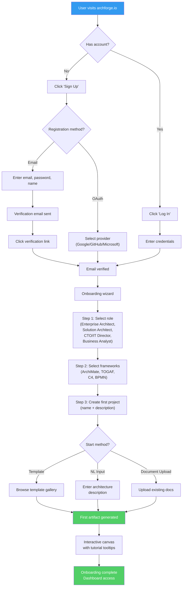
```mermaid
flowchart TD
    A["User visits archforge.io"] --> B{"Has account?"}
    B -->|No| C["Click 'Sign Up'"]
    B -->|Yes| D["Click 'Log In'"]

    C --> E{"Registration method?"}
    E -->|Email| F["Enter email, password, name"]
    E -->|OAuth| G["Select provider<br/>(Google/GitHub/Microsoft)"]

    F --> H["Verification email sent"]
    H --> I["Click verification link"]
    I --> J["Email verified"]

    G --> J

    D --> K["Enter credentials"]
    K --> J

    J --> L["Onboarding wizard"]
    L --> M["Step 1: Select role<br/>(Enterprise Architect,<br/>Solution Architect,<br/>CTO/IT Director,<br/>Business Analyst)"]
    M --> N["Step 2: Select frameworks<br/>(ArchiMate, TOGAF,<br/>C4, BPMN)"]
    N --> O["Step 3: Create first project<br/>(name + description)"]
    O --> P{"Start method?"}

    P -->|Template| Q["Browse template gallery"]
    P -->|NL Input| R["Enter architecture<br/>description"]
    P -->|Document Upload| S["Upload existing docs"]

    Q --> T["First artifact generated"]
    R --> T
    S --> T

    T --> U["Interactive canvas<br/>with tutorial tooltips"]
    U --> V["Onboarding complete<br/>Dashboard access"]

    style A fill:#339af0,color:#fff
    style T fill:#51cf66,color:#fff
    style V fill:#51cf66,color:#fff
```

### 4.2 Artifact Generation Flow (NL to Review to Refine to Export)

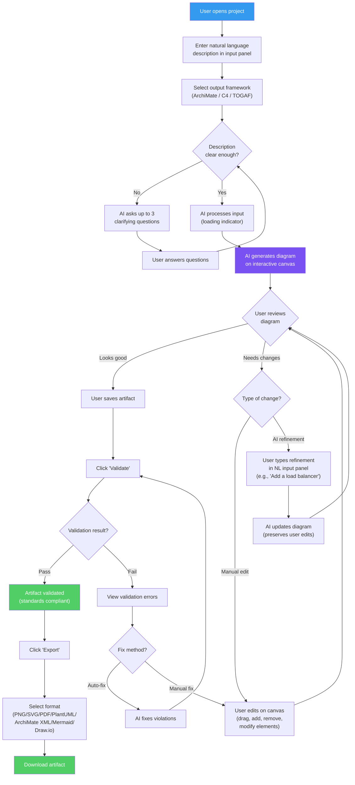
```mermaid
flowchart TD
    A["User opens project"] --> B["Enter natural language<br/>description in input panel"]
    B --> C["Select output framework<br/>(ArchiMate / C4 / TOGAF)"]
    C --> D{"Description<br/>clear enough?"}

    D -->|No| E["AI asks up to 3<br/>clarifying questions"]
    E --> F["User answers questions"]
    F --> D

    D -->|Yes| G["AI processes input<br/>(loading indicator)"]
    G --> H["AI generates diagram<br/>on interactive canvas"]

    H --> I{"User reviews<br/>diagram"}

    I -->|Looks good| J["User saves artifact"]
    I -->|Needs changes| K{"Type of change?"}

    K -->|Manual edit| L["User edits on canvas<br/>(drag, add, remove,<br/>modify elements)"]
    K -->|AI refinement| M["User types refinement<br/>in NL input panel<br/>(e.g., 'Add a load balancer')"]

    L --> I
    M --> N["AI updates diagram<br/>(preserves user edits)"]
    N --> I

    J --> O["Click 'Validate'"]
    O --> P{"Validation result?"}

    P -->|Pass| Q["Artifact validated<br/>(standards compliant)"]
    P -->|Fail| R["View validation errors"]
    R --> S{"Fix method?"}
    S -->|Auto-fix| T["AI fixes violations"]
    S -->|Manual fix| L
    T --> O

    Q --> U["Click 'Export'"]
    U --> V["Select format<br/>(PNG/SVG/PDF/PlantUML/<br/>ArchiMate XML/Mermaid/<br/>Draw.io)"]
    V --> W["Download artifact"]

    style A fill:#339af0,color:#fff
    style H fill:#7950f2,color:#fff
    style Q fill:#51cf66,color:#fff
    style W fill:#51cf66,color:#fff
```

### 4.3 Document Ingestion Flow

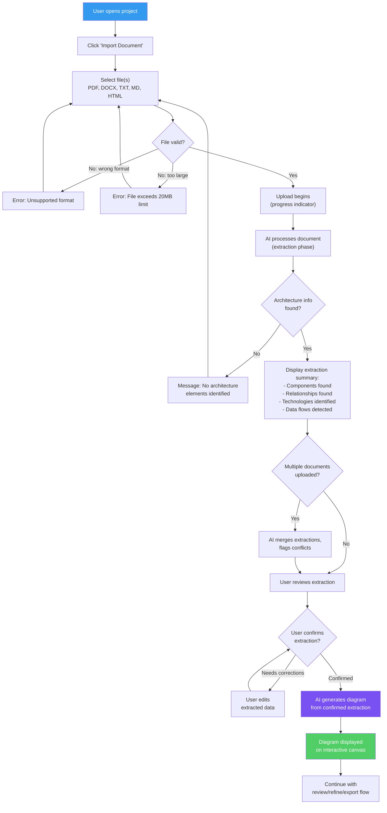
```mermaid
flowchart TD
    A["User opens project"] --> B["Click 'Import Document'"]
    B --> C["Select file(s)<br/>PDF, DOCX, TXT, MD, HTML"]
    C --> D{"File valid?"}

    D -->|No: wrong format| E["Error: Unsupported format"]
    D -->|No: too large| F["Error: File exceeds 20MB limit"]
    D -->|Yes| G["Upload begins<br/>(progress indicator)"]

    E --> C
    F --> C

    G --> H["AI processes document<br/>(extraction phase)"]
    H --> I{"Architecture info<br/>found?"}

    I -->|No| J["Message: No architecture<br/>elements identified"]
    J --> C

    I -->|Yes| K["Display extraction summary:<br/>- Components found<br/>- Relationships found<br/>- Technologies identified<br/>- Data flows detected"]

    K --> L{"Multiple documents<br/>uploaded?"}
    L -->|Yes| M["AI merges extractions,<br/>flags conflicts"]
    L -->|No| N["User reviews extraction"]
    M --> N

    N --> O{"User confirms<br/>extraction?"}
    O -->|Needs corrections| P["User edits<br/>extracted data"]
    P --> O
    O -->|Confirmed| Q["AI generates diagram<br/>from confirmed extraction"]

    Q --> R["Diagram displayed<br/>on interactive canvas"]
    R --> S["Continue with<br/>review/refine/export flow"]

    style A fill:#339af0,color:#fff
    style Q fill:#7950f2,color:#fff
    style R fill:#51cf66,color:#fff
```

### 4.4 Collaboration Flow

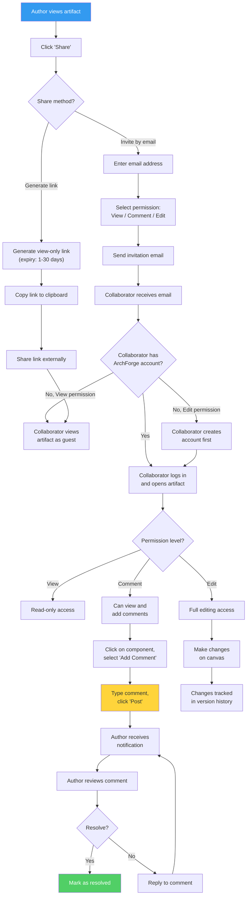
```mermaid
flowchart TD
    A["Author views artifact"] --> B["Click 'Share'"]
    B --> C{"Share method?"}

    C -->|Invite by email| D["Enter email address"]
    C -->|Generate link| E["Generate view-only link<br/>(expiry: 1-30 days)"]

    D --> F["Select permission:<br/>View / Comment / Edit"]
    F --> G["Send invitation email"]
    G --> H["Collaborator receives email"]

    E --> I["Copy link to clipboard"]
    I --> J["Share link externally"]

    H --> K{"Collaborator has<br/>ArchForge account?"}
    K -->|Yes| L["Collaborator logs in<br/>and opens artifact"]
    K -->|No, View permission| M["Collaborator views<br/>artifact as guest"]
    K -->|No, Edit permission| N["Collaborator creates<br/>account first"]
    N --> L

    J --> M

    L --> O{"Permission level?"}
    O -->|View| P["Read-only access"]
    O -->|Comment| Q["Can view and<br/>add comments"]
    O -->|Edit| R["Full editing access"]

    Q --> S["Click on component,<br/>select 'Add Comment'"]
    S --> T["Type comment,<br/>click 'Post'"]
    T --> U["Author receives<br/>notification"]
    U --> V["Author reviews comment"]
    V --> W{"Resolve?"}
    W -->|Yes| X["Mark as resolved"]
    W -->|No| Y["Reply to comment"]
    Y --> U

    R --> Z["Make changes<br/>on canvas"]
    Z --> AA["Changes tracked<br/>in version history"]

    style A fill:#339af0,color:#fff
    style T fill:#ffd43b,color:#333
    style X fill:#51cf66,color:#fff
```

---

## 5. System Architecture (C4 Diagrams)

### 5.1 Level 1: System Context Diagram

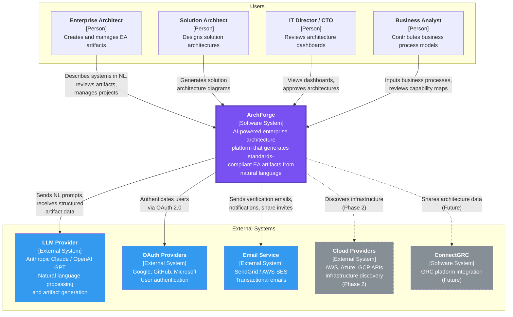
```mermaid
graph TD
    subgraph "Users"
        EA["<b>Enterprise Architect</b><br/>[Person]<br/>Creates and manages EA artifacts"]
        SA["<b>Solution Architect</b><br/>[Person]<br/>Designs solution architectures"]
        CTO["<b>IT Director / CTO</b><br/>[Person]<br/>Reviews architecture dashboards"]
        BA["<b>Business Analyst</b><br/>[Person]<br/>Contributes business process models"]
    end

    AF["<b>ArchForge</b><br/>[Software System]<br/>AI-powered enterprise architecture<br/>platform that generates standards-<br/>compliant EA artifacts from<br/>natural language"]

    subgraph "External Systems"
        LLM["<b>LLM Provider</b><br/>[External System]<br/>Anthropic Claude / OpenAI GPT<br/>Natural language processing<br/>and artifact generation"]
        OAuth["<b>OAuth Providers</b><br/>[External System]<br/>Google, GitHub, Microsoft<br/>User authentication"]
        Email["<b>Email Service</b><br/>[External System]<br/>SendGrid / AWS SES<br/>Transactional emails"]
        Cloud["<b>Cloud Providers</b><br/>[External System]<br/>AWS, Azure, GCP APIs<br/>Infrastructure discovery<br/>(Phase 2)"]
        GRC["<b>ConnectGRC</b><br/>[Software System]<br/>GRC platform integration<br/>(Future)"]
    end

    EA -->|"Describes systems in NL,<br/>reviews artifacts,<br/>manages projects"| AF
    SA -->|"Generates solution<br/>architecture diagrams"| AF
    CTO -->|"Views dashboards,<br/>approves architectures"| AF
    BA -->|"Inputs business processes,<br/>reviews capability maps"| AF

    AF -->|"Sends NL prompts,<br/>receives structured<br/>artifact data"| LLM
    AF -->|"Authenticates users<br/>via OAuth 2.0"| OAuth
    AF -->|"Sends verification emails,<br/>notifications, share invites"| Email
    AF -.->|"Discovers infrastructure<br/>(Phase 2)"| Cloud
    AF -.->|"Shares architecture data<br/>(Future)"| GRC

    style AF fill:#7950f2,color:#fff,stroke:#5c3dba,stroke-width:3px
    style LLM fill:#339af0,color:#fff
    style OAuth fill:#339af0,color:#fff
    style Email fill:#339af0,color:#fff
    style Cloud fill:#868e96,color:#fff,stroke-dasharray: 5 5
    style GRC fill:#868e96,color:#fff,stroke-dasharray: 5 5
```

### 5.2 Level 2: Container Diagram

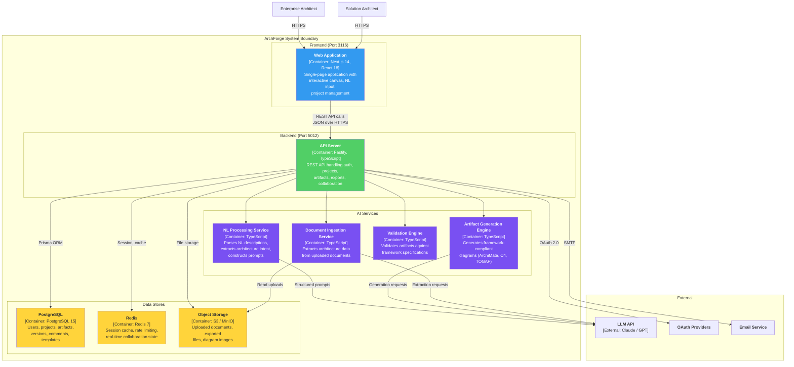
```mermaid
graph TD
    subgraph "ArchForge System Boundary"
        subgraph "Frontend (Port 3116)"
            WEB["<b>Web Application</b><br/>[Container: Next.js 14, React 18]<br/>Single-page application with<br/>interactive canvas, NL input,<br/>project management"]
        end

        subgraph "Backend (Port 5012)"
            API["<b>API Server</b><br/>[Container: Fastify, TypeScript]<br/>REST API handling auth, projects,<br/>artifacts, exports, collaboration"]
        end

        subgraph "AI Services"
            NLP["<b>NL Processing Service</b><br/>[Container: TypeScript]<br/>Parses NL descriptions,<br/>extracts architecture intent,<br/>constructs prompts"]
            GEN["<b>Artifact Generation Engine</b><br/>[Container: TypeScript]<br/>Generates framework-compliant<br/>diagrams (ArchiMate, C4, TOGAF)"]
            VAL["<b>Validation Engine</b><br/>[Container: TypeScript]<br/>Validates artifacts against<br/>framework specifications"]
            ING["<b>Document Ingestion Service</b><br/>[Container: TypeScript]<br/>Extracts architecture data<br/>from uploaded documents"]
        end

        subgraph "Data Stores"
            DB["<b>PostgreSQL</b><br/>[Container: PostgreSQL 15]<br/>Users, projects, artifacts,<br/>versions, comments, templates"]
            REDIS["<b>Redis</b><br/>[Container: Redis 7]<br/>Session cache, rate limiting,<br/>real-time collaboration state"]
            S3["<b>Object Storage</b><br/>[Container: S3 / MinIO]<br/>Uploaded documents, exported<br/>files, diagram images"]
        end
    end

    subgraph "External"
        LLM["<b>LLM API</b><br/>[External: Claude / GPT]"]
        OAuth["<b>OAuth Providers</b>"]
        EmailSvc["<b>Email Service</b>"]
    end

    EA["Enterprise Architect"] -->|"HTTPS"| WEB
    SA["Solution Architect"] -->|"HTTPS"| WEB
    WEB -->|"REST API calls<br/>JSON over HTTPS"| API
    API --> NLP
    API --> GEN
    API --> VAL
    API --> ING
    NLP -->|"Structured prompts"| LLM
    GEN -->|"Generation requests"| LLM
    ING -->|"Extraction requests"| LLM
    API -->|"Prisma ORM"| DB
    API -->|"Session, cache"| REDIS
    API -->|"File storage"| S3
    ING -->|"Read uploads"| S3
    API -->|"OAuth 2.0"| OAuth
    API -->|"SMTP"| EmailSvc

    style WEB fill:#339af0,color:#fff
    style API fill:#51cf66,color:#fff
    style NLP fill:#7950f2,color:#fff
    style GEN fill:#7950f2,color:#fff
    style VAL fill:#7950f2,color:#fff
    style ING fill:#7950f2,color:#fff
    style DB fill:#ffd43b,color:#333
    style REDIS fill:#ffd43b,color:#333
    style S3 fill:#ffd43b,color:#333
```

---

## 6. Sequence Diagrams

### 6.1 Natural Language to Artifact Generation Flow

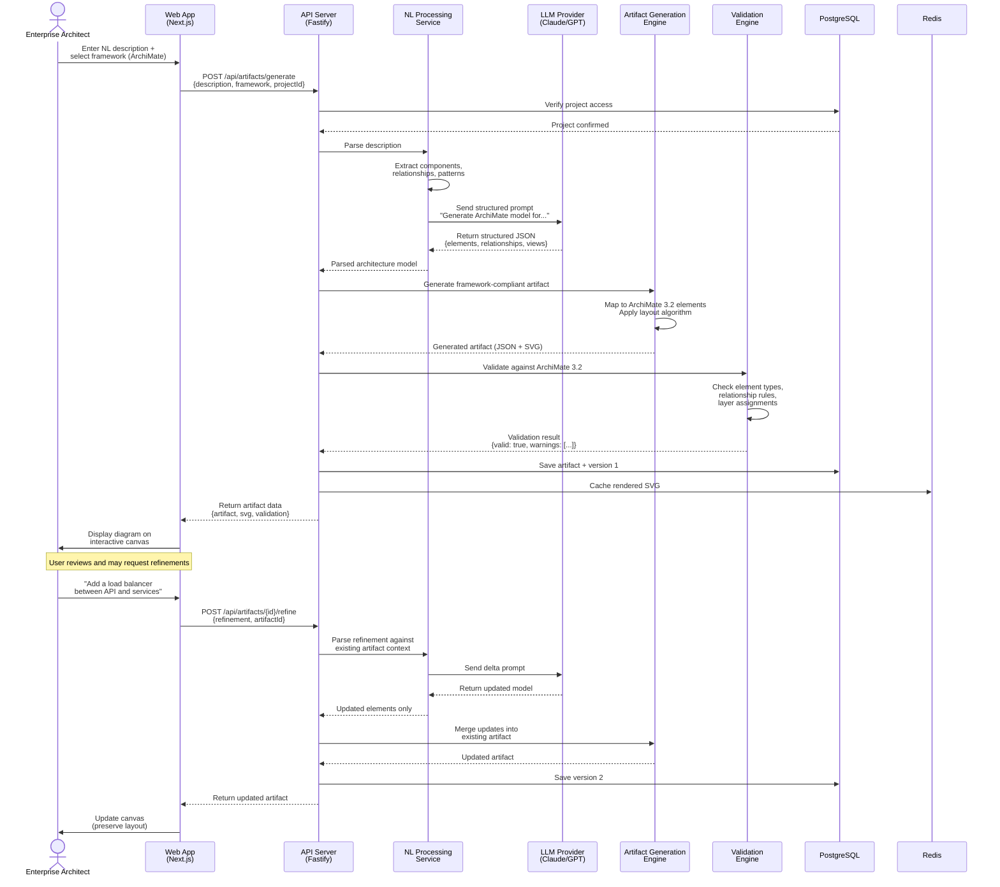
```mermaid
sequenceDiagram
    actor User as Enterprise Architect
    participant Web as Web App<br/>(Next.js)
    participant API as API Server<br/>(Fastify)
    participant NLP as NL Processing<br/>Service
    participant LLM as LLM Provider<br/>(Claude/GPT)
    participant Gen as Artifact Generation<br/>Engine
    participant Val as Validation<br/>Engine
    participant DB as PostgreSQL
    participant Cache as Redis

    User->>Web: Enter NL description +<br/>select framework (ArchiMate)
    Web->>API: POST /api/artifacts/generate<br/>{description, framework, projectId}
    API->>DB: Verify project access
    DB-->>API: Project confirmed

    API->>NLP: Parse description
    NLP->>NLP: Extract components,<br/>relationships, patterns
    NLP->>LLM: Send structured prompt<br/>"Generate ArchiMate model for..."
    LLM-->>NLP: Return structured JSON<br/>{elements, relationships, views}
    NLP-->>API: Parsed architecture model

    API->>Gen: Generate framework-compliant artifact
    Gen->>Gen: Map to ArchiMate 3.2 elements<br/>Apply layout algorithm
    Gen-->>API: Generated artifact (JSON + SVG)

    API->>Val: Validate against ArchiMate 3.2
    Val->>Val: Check element types,<br/>relationship rules,<br/>layer assignments
    Val-->>API: Validation result<br/>{valid: true, warnings: [...]}

    API->>DB: Save artifact + version 1
    API->>Cache: Cache rendered SVG
    API-->>Web: Return artifact data<br/>{artifact, svg, validation}
    Web->>User: Display diagram on<br/>interactive canvas

    Note over User,Web: User reviews and may request refinements
    User->>Web: "Add a load balancer<br/>between API and services"
    Web->>API: POST /api/artifacts/{id}/refine<br/>{refinement, artifactId}
    API->>NLP: Parse refinement against<br/>existing artifact context
    NLP->>LLM: Send delta prompt
    LLM-->>NLP: Return updated model
    NLP-->>API: Updated elements only
    API->>Gen: Merge updates into<br/>existing artifact
    Gen-->>API: Updated artifact
    API->>DB: Save version 2
    API-->>Web: Return updated artifact
    Web->>User: Update canvas<br/>(preserve layout)
```

### 6.2 Document Ingestion and Extraction Flow

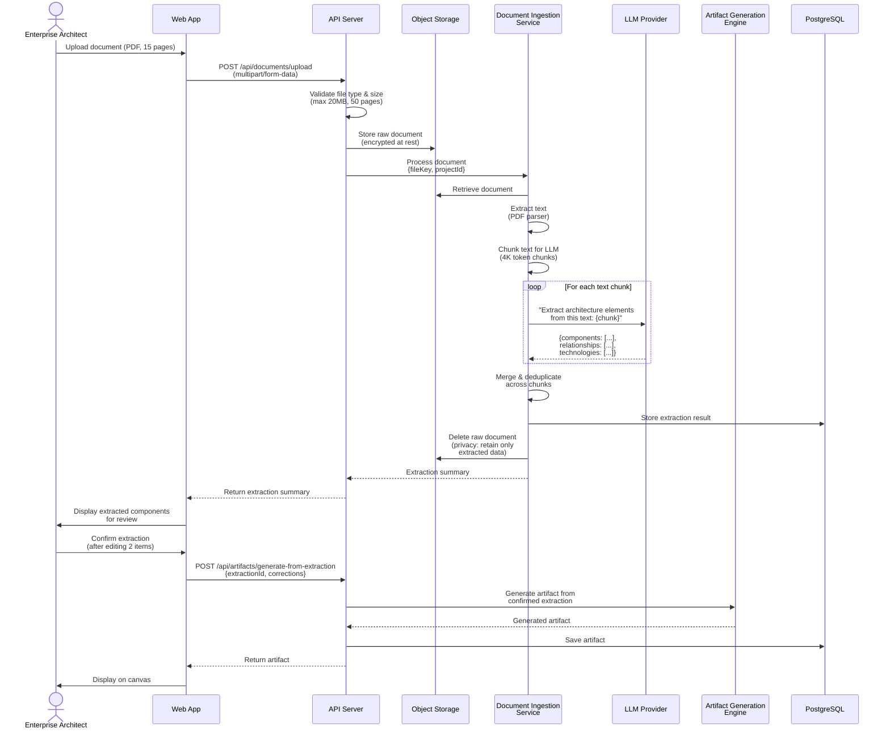
```mermaid
sequenceDiagram
    actor User as Enterprise Architect
    participant Web as Web App
    participant API as API Server
    participant S3 as Object Storage
    participant Ing as Document Ingestion<br/>Service
    participant LLM as LLM Provider
    participant Gen as Artifact Generation<br/>Engine
    participant DB as PostgreSQL

    User->>Web: Upload document (PDF, 15 pages)
    Web->>API: POST /api/documents/upload<br/>(multipart/form-data)
    API->>API: Validate file type & size<br/>(max 20MB, 50 pages)
    API->>S3: Store raw document<br/>(encrypted at rest)

    API->>Ing: Process document<br/>{fileKey, projectId}
    Ing->>S3: Retrieve document
    Ing->>Ing: Extract text<br/>(PDF parser)
    Ing->>Ing: Chunk text for LLM<br/>(4K token chunks)

    loop For each text chunk
        Ing->>LLM: "Extract architecture elements<br/>from this text: {chunk}"
        LLM-->>Ing: {components: [...],<br/>relationships: [...],<br/>technologies: [...]}
    end

    Ing->>Ing: Merge & deduplicate<br/>across chunks
    Ing->>DB: Store extraction result
    Ing->>S3: Delete raw document<br/>(privacy: retain only<br/>extracted data)
    Ing-->>API: Extraction summary

    API-->>Web: Return extraction summary
    Web->>User: Display extracted components<br/>for review

    User->>Web: Confirm extraction<br/>(after editing 2 items)
    Web->>API: POST /api/artifacts/generate-from-extraction<br/>{extractionId, corrections}
    API->>Gen: Generate artifact from<br/>confirmed extraction
    Gen-->>API: Generated artifact
    API->>DB: Save artifact
    API-->>Web: Return artifact
    Web->>User: Display on canvas
```

### 6.3 Real-Time Collaboration Flow

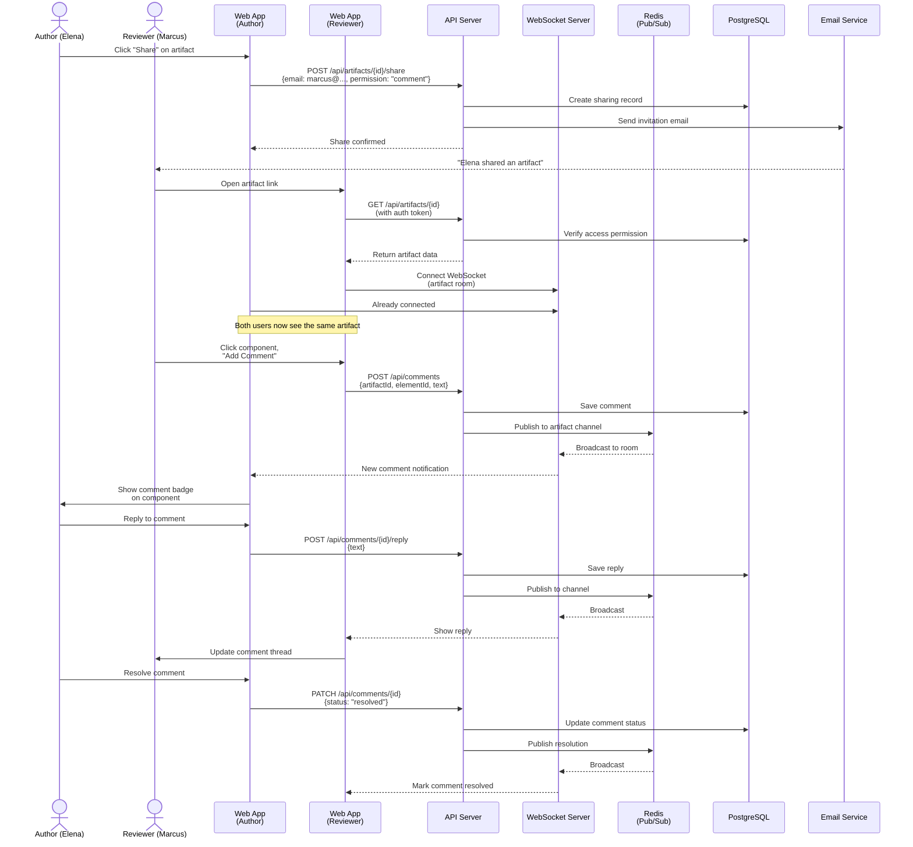
```mermaid
sequenceDiagram
    actor Author as Author (Elena)
    actor Reviewer as Reviewer (Marcus)
    participant Web1 as Web App<br/>(Author)
    participant Web2 as Web App<br/>(Reviewer)
    participant API as API Server
    participant WS as WebSocket Server
    participant Cache as Redis<br/>(Pub/Sub)
    participant DB as PostgreSQL
    participant Email as Email Service

    Author->>Web1: Click "Share" on artifact
    Web1->>API: POST /api/artifacts/{id}/share<br/>{email: marcus@..., permission: "comment"}
    API->>DB: Create sharing record
    API->>Email: Send invitation email
    API-->>Web1: Share confirmed

    Email-->>Reviewer: "Elena shared an artifact"

    Reviewer->>Web2: Open artifact link
    Web2->>API: GET /api/artifacts/{id}<br/>(with auth token)
    API->>DB: Verify access permission
    API-->>Web2: Return artifact data
    Web2->>WS: Connect WebSocket<br/>(artifact room)
    Web1->>WS: Already connected

    Note over Web1,Web2: Both users now see the same artifact

    Reviewer->>Web2: Click component,<br/>"Add Comment"
    Web2->>API: POST /api/comments<br/>{artifactId, elementId, text}
    API->>DB: Save comment
    API->>Cache: Publish to artifact channel
    Cache-->>WS: Broadcast to room
    WS-->>Web1: New comment notification
    Web1->>Author: Show comment badge<br/>on component

    Author->>Web1: Reply to comment
    Web1->>API: POST /api/comments/{id}/reply<br/>{text}
    API->>DB: Save reply
    API->>Cache: Publish to channel
    Cache-->>WS: Broadcast
    WS-->>Web2: Show reply
    Web2->>Reviewer: Update comment thread

    Author->>Web1: Resolve comment
    Web1->>API: PATCH /api/comments/{id}<br/>{status: "resolved"}
    API->>DB: Update comment status
    API->>Cache: Publish resolution
    Cache-->>WS: Broadcast
    WS-->>Web2: Mark comment resolved
```

---

## 7. State Diagrams

### 7.1 Artifact Lifecycle

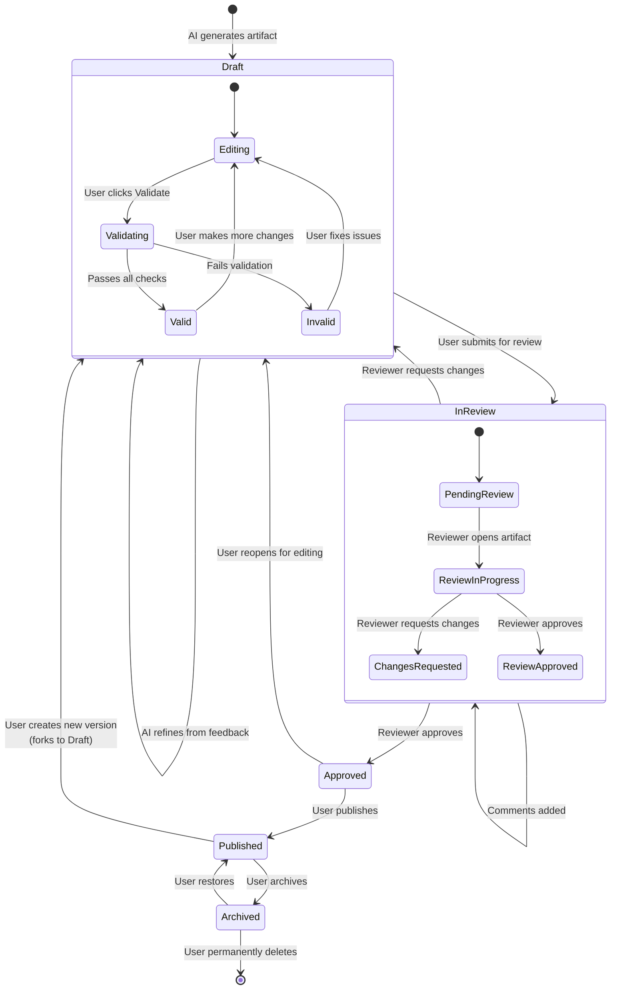
```mermaid
stateDiagram-v2
    [*] --> Draft: AI generates artifact

    Draft --> Draft: User edits on canvas
    Draft --> Draft: AI refines from feedback
    Draft --> InReview: User submits for review

    InReview --> Draft: Reviewer requests changes
    InReview --> Approved: Reviewer approves
    InReview --> InReview: Comments added

    Approved --> Published: User publishes
    Approved --> Draft: User reopens for editing

    Published --> Archived: User archives
    Published --> Draft: User creates new version<br/>(forks to Draft)

    Archived --> Published: User restores
    Archived --> [*]: User permanently deletes

    state Draft {
        [*] --> Editing
        Editing --> Validating: User clicks Validate
        Validating --> Valid: Passes all checks
        Validating --> Invalid: Fails validation
        Invalid --> Editing: User fixes issues
        Valid --> Editing: User makes more changes
    }

    state InReview {
        [*] --> PendingReview
        PendingReview --> ReviewInProgress: Reviewer opens artifact
        ReviewInProgress --> ChangesRequested: Reviewer requests changes
        ReviewInProgress --> ReviewApproved: Reviewer approves
    }
```

### 7.2 Project Lifecycle

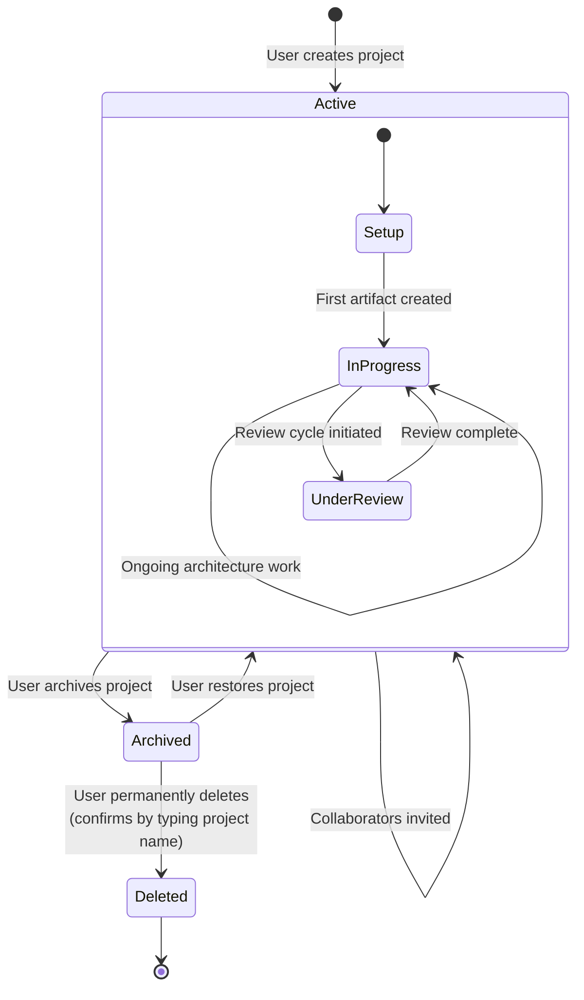
```mermaid
stateDiagram-v2
    [*] --> Active: User creates project

    Active --> Active: Artifacts added/modified
    Active --> Active: Collaborators invited
    Active --> Archived: User archives project

    Archived --> Active: User restores project
    Archived --> Deleted: User permanently deletes<br/>(confirms by typing project name)

    Deleted --> [*]

    state Active {
        [*] --> Setup
        Setup --> InProgress: First artifact created
        InProgress --> InProgress: Ongoing architecture work
        InProgress --> UnderReview: Review cycle initiated
        UnderReview --> InProgress: Review complete
    }
```

### 7.3 User Account Lifecycle

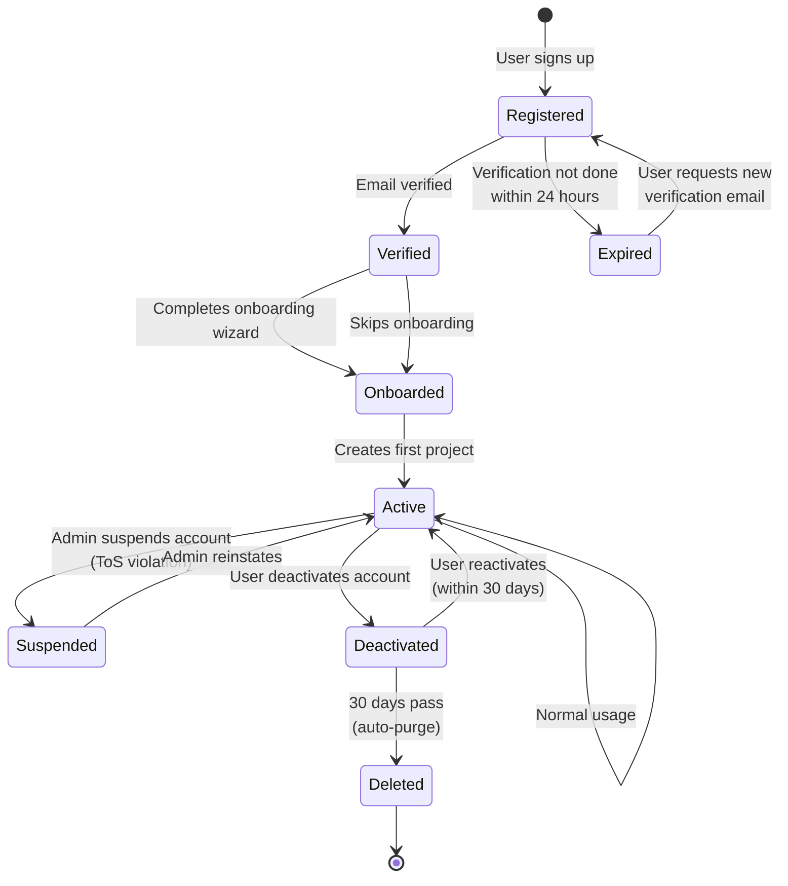
```mermaid
stateDiagram-v2
    [*] --> Registered: User signs up

    Registered --> Verified: Email verified
    Registered --> Expired: Verification not done<br/>within 24 hours
    Expired --> Registered: User requests new<br/>verification email

    Verified --> Onboarded: Completes onboarding wizard
    Verified --> Onboarded: Skips onboarding

    Onboarded --> Active: Creates first project
    Active --> Active: Normal usage
    Active --> Suspended: Admin suspends account<br/>(ToS violation)
    Active --> Deactivated: User deactivates account

    Suspended --> Active: Admin reinstates
    Deactivated --> Active: User reactivates<br/>(within 30 days)
    Deactivated --> Deleted: 30 days pass<br/>(auto-purge)

    Deleted --> [*]
```

---

## 8. Data Model (ER Diagram)

```mermaid
erDiagram
    USERS {
        uuid id PK
        string email UK
        string password_hash
        string full_name
        string avatar_url
        string role "admin | member | viewer"
        boolean email_verified
        boolean totp_enabled
        string totp_secret
        timestamp created_at
        timestamp updated_at
        timestamp last_login_at
        string status "registered | verified | active | suspended | deactivated"
    }

    OAUTH_ACCOUNTS {
        uuid id PK
        uuid user_id FK
        string provider "google | github | microsoft"
        string provider_account_id
        string access_token
        string refresh_token
        timestamp token_expires_at
        timestamp created_at
    }

    WORKSPACES {
        uuid id PK
        string name
        string slug UK
        uuid owner_id FK
        string plan "free | pro | team | enterprise"
        jsonb settings
        timestamp created_at
        timestamp updated_at
    }

    WORKSPACE_MEMBERS {
        uuid id PK
        uuid workspace_id FK
        uuid user_id FK
        string role "owner | admin | editor | viewer"
        timestamp joined_at
    }

    PROJECTS {
        uuid id PK
        uuid workspace_id FK
        uuid created_by FK
        string name
        string description
        string framework_preference "archimate | c4 | togaf | auto"
        string status "active | archived | deleted"
        jsonb settings
        timestamp created_at
        timestamp updated_at
        timestamp archived_at
    }

    ARTIFACTS {
        uuid id PK
        uuid project_id FK
        uuid created_by FK
        string name
        string type "archimate_diagram | c4_diagram | togaf_view | bpmn_diagram | custom"
        string framework "archimate | c4 | togaf | bpmn | custom"
        string status "draft | in_review | approved | published | archived"
        jsonb canvas_data "elements, relationships, layout"
        text svg_content "rendered SVG"
        text nl_description "original NL input"
        integer current_version
        timestamp created_at
        timestamp updated_at
    }

    ARTIFACT_VERSIONS {
        uuid id PK
        uuid artifact_id FK
        uuid created_by FK
        integer version_number
        jsonb canvas_data "snapshot of canvas at this version"
        text svg_content
        text change_summary "auto-generated description of changes"
        string change_type "manual_edit | ai_generation | ai_refinement | restoration | auto_save"
        timestamp created_at
    }

    ARTIFACT_ELEMENTS {
        uuid id PK
        uuid artifact_id FK
        string element_id "unique within artifact"
        string element_type "e.g., ApplicationComponent, Container, Actor"
        string framework "archimate | c4 | togaf"
        string name
        text description
        jsonb properties "framework-specific properties"
        jsonb position "x, y, width, height"
        string layer "business | application | technology | motivation | strategy"
        timestamp created_at
        timestamp updated_at
    }

    ARTIFACT_RELATIONSHIPS {
        uuid id PK
        uuid artifact_id FK
        string relationship_id "unique within artifact"
        string source_element_id FK
        string target_element_id FK
        string relationship_type "e.g., Serving, Composition, Association"
        string framework "archimate | c4 | togaf"
        string label
        jsonb properties
        timestamp created_at
    }

    TEMPLATES {
        uuid id PK
        uuid created_by FK
        string name
        text description
        string category "industry | pattern | framework"
        string subcategory "e.g., financial_services, microservices, archimate"
        string framework "archimate | c4 | togaf | multi"
        jsonb canvas_data
        text svg_preview
        boolean is_public
        integer usage_count
        timestamp created_at
        timestamp updated_at
    }

    COMMENTS {
        uuid id PK
        uuid artifact_id FK
        uuid author_id FK
        uuid parent_comment_id FK "null for top-level comments"
        string element_id "null if not anchored to element"
        text body
        string status "open | resolved"
        timestamp created_at
        timestamp updated_at
        timestamp resolved_at
    }

    SHARES {
        uuid id PK
        uuid artifact_id FK
        uuid shared_by FK
        uuid shared_with FK "null for link shares"
        string email "for pending invitations"
        string permission "view | comment | edit"
        string share_type "invite | link"
        string link_token UK "for link shares"
        timestamp expires_at
        timestamp created_at
    }

    EXPORTS {
        uuid id PK
        uuid artifact_id FK
        uuid user_id FK
        string format "png | svg | pdf | plantuml | archimate_xml | mermaid | drawio"
        string file_url "S3 URL"
        integer file_size_bytes
        timestamp created_at
        timestamp expires_at "auto-delete after 24h"
    }

    DOCUMENT_UPLOADS {
        uuid id PK
        uuid project_id FK
        uuid uploaded_by FK
        string original_filename
        string file_type "pdf | docx | txt | md | html"
        integer file_size_bytes
        string storage_key "S3 key"
        string processing_status "uploaded | processing | completed | failed"
        jsonb extraction_result "extracted components, relationships"
        timestamp created_at
        timestamp processed_at
    }

    AUDIT_LOG {
        uuid id PK
        uuid user_id FK
        uuid resource_id
        string resource_type "project | artifact | template | user"
        string action "create | update | delete | share | export | login"
        jsonb metadata "additional context"
        string ip_address
        string user_agent
        timestamp created_at
    }

    USERS ||--o{ OAUTH_ACCOUNTS : "has"
    USERS ||--o{ WORKSPACES : "owns"
    USERS ||--o{ WORKSPACE_MEMBERS : "belongs to"
    WORKSPACES ||--o{ WORKSPACE_MEMBERS : "has"
    WORKSPACES ||--o{ PROJECTS : "contains"
    USERS ||--o{ PROJECTS : "creates"
    PROJECTS ||--o{ ARTIFACTS : "contains"
    USERS ||--o{ ARTIFACTS : "creates"
    ARTIFACTS ||--o{ ARTIFACT_VERSIONS : "has versions"
    USERS ||--o{ ARTIFACT_VERSIONS : "creates"
    ARTIFACTS ||--o{ ARTIFACT_ELEMENTS : "contains"
    ARTIFACTS ||--o{ ARTIFACT_RELATIONSHIPS : "contains"
    USERS ||--o{ TEMPLATES : "creates"
    ARTIFACTS ||--o{ COMMENTS : "has"
    USERS ||--o{ COMMENTS : "authors"
    COMMENTS ||--o{ COMMENTS : "replies to"
    ARTIFACTS ||--o{ SHARES : "shared via"
    USERS ||--o{ SHARES : "shares"
    USERS ||--o{ SHARES : "receives"
    ARTIFACTS ||--o{ EXPORTS : "exported as"
    USERS ||--o{ EXPORTS : "exports"
    PROJECTS ||--o{ DOCUMENT_UPLOADS : "has"
    USERS ||--o{ DOCUMENT_UPLOADS : "uploads"
    USERS ||--o{ AUDIT_LOG : "generates"
```

---

## 9. Site Map

### 9.1 Route Map

```mermaid
flowchart TD
    Root["archforge.io<br/>(/)"]

    Root --> Landing["Landing Page<br/>(/landing)"]
    Root --> Auth["Authentication<br/>(/auth)"]
    Root --> App["Application<br/>(/app)"]
    Root --> Public["Public Pages"]

    Auth --> Login["Login<br/>(/auth/login)"]
    Auth --> Register["Register<br/>(/auth/register)"]
    Auth --> Forgot["Forgot Password<br/>(/auth/forgot-password)"]
    Auth --> Reset["Reset Password<br/>(/auth/reset-password)"]
    Auth --> Verify["Verify Email<br/>(/auth/verify)"]

    App --> Dashboard["Dashboard<br/>(/app/dashboard)"]
    App --> Projects["Projects<br/>(/app/projects)"]
    App --> Templates["Templates<br/>(/app/templates)"]
    App --> Settings["Settings<br/>(/app/settings)"]

    Projects --> ProjectDetail["Project Detail<br/>(/app/projects/:id)"]
    ProjectDetail --> ArtifactEditor["Artifact Editor<br/>(/app/projects/:id/artifacts/:artifactId)"]
    ProjectDetail --> ArtifactNew["New Artifact<br/>(/app/projects/:id/artifacts/new)"]
    ProjectDetail --> ImportDoc["Import Document<br/>(/app/projects/:id/import)"]
    ProjectDetail --> ProjectSettings["Project Settings<br/>(/app/projects/:id/settings)"]

    ArtifactEditor --> VersionHistory["Version History<br/>(/app/projects/:id/artifacts/:artifactId/versions)"]
    ArtifactEditor --> ArtifactShare["Share Artifact<br/>(/app/projects/:id/artifacts/:artifactId/share)"]

    Templates --> TemplateGallery["Template Gallery<br/>(/app/templates/gallery)"]
    Templates --> MyTemplates["My Templates<br/>(/app/templates/mine)"]

    Settings --> Profile["Profile<br/>(/app/settings/profile)"]
    Settings --> Security["Security<br/>(/app/settings/security)"]
    Settings --> Workspace["Workspace<br/>(/app/settings/workspace)"]
    Settings --> Billing["Billing<br/>(/app/settings/billing)"]
    Settings --> Notifications["Notifications<br/>(/app/settings/notifications)"]

    Public --> SharedArtifact["Shared Artifact View<br/>(/shared/:token)"]
    Public --> Pricing["Pricing<br/>(/pricing)"]
    Public --> Docs["Documentation<br/>(/docs)"]
    Public --> Privacy["Privacy Policy<br/>(/privacy)"]
    Public --> Terms["Terms of Service<br/>(/terms)"]

    style Root fill:#339af0,color:#fff
    style App fill:#7950f2,color:#fff
    style ArtifactEditor fill:#51cf66,color:#fff
```

### 9.2 Complete Route Table

| Route | Page | Purpose | Key Elements | Auth Required | MVP Phase |
|-------|------|---------|-------------|---------------|-----------|
| `/` | Landing Page | Marketing, product overview, CTA | Hero section, feature highlights, pricing preview, testimonials | No | MVP |
| `/pricing` | Pricing | Detailed pricing tiers | Free/Pro/Team/Enterprise comparison table, FAQ | No | MVP |
| `/docs` | Documentation | User guides and API docs | Searchable documentation, code examples | No | MVP |
| `/privacy` | Privacy Policy | Legal: privacy policy | Static content | No | MVP |
| `/terms` | Terms of Service | Legal: terms of service | Static content | No | MVP |
| `/auth/login` | Login | User authentication | Email/password form, OAuth buttons (Google, GitHub, Microsoft), "Forgot password" link | No | MVP |
| `/auth/register` | Register | New user registration | Email/password form, OAuth buttons, ToS checkbox | No | MVP |
| `/auth/forgot-password` | Forgot Password | Password recovery initiation | Email input, "Send reset link" button | No | MVP |
| `/auth/reset-password` | Reset Password | Password reset completion | New password form (with token from email) | No | MVP |
| `/auth/verify` | Email Verification | Confirm email address | Auto-verifies from token in URL, success/error message | No | MVP |
| `/app/dashboard` | Dashboard | Main hub after login | Recent projects, recent artifacts, activity feed, quick actions (New Project, New Artifact) | Yes | MVP |
| `/app/projects` | Projects List | View all projects | Project cards with name, description, artifact count, last modified; search/filter; "New Project" button | Yes | MVP |
| `/app/projects/:id` | Project Detail | Single project workspace | Artifact list, project info, "New Artifact" button, "Import Document" button, collaborator list | Yes | MVP |
| `/app/projects/:id/artifacts/new` | New Artifact | Create a new artifact | NL input panel, framework selector, "Start from Template" option | Yes | MVP |
| `/app/projects/:id/artifacts/:artifactId` | Artifact Editor | Interactive canvas | Canvas (drag, zoom, pan), NL refinement input, element properties panel, toolbar (validate, export, share, version history), comment panel | Yes | MVP |
| `/app/projects/:id/artifacts/:artifactId/versions` | Version History | View artifact versions | Version list with timestamps and change summaries, side-by-side diff, "Restore" button | Yes | MVP |
| `/app/projects/:id/artifacts/:artifactId/share` | Share Artifact | Manage sharing | Email invite form, permission selector, link generation, active shares list | Yes | MVP |
| `/app/projects/:id/import` | Import Document | Upload documents for ingestion | File upload area (drag & drop), supported format list, upload progress, extraction results | Yes | MVP |
| `/app/projects/:id/settings` | Project Settings | Configure project | Rename, description, framework preference, archive/delete, transfer ownership | Yes | MVP |
| `/app/templates/gallery` | Template Gallery | Browse public templates | Template cards with preview, category filters (industry, pattern, framework), search | Yes | MVP |
| `/app/templates/mine` | My Templates | Personal template library | User-saved templates, "Create from artifact" option | Yes | MVP |
| `/app/settings/profile` | Profile Settings | User profile management | Name, email, avatar upload, timezone | Yes | MVP |
| `/app/settings/security` | Security Settings | Account security | Change password, 2FA setup (TOTP), OAuth account management, active sessions | Yes | MVP |
| `/app/settings/workspace` | Workspace Settings | Workspace management | Workspace name, invite members, manage roles, workspace plan | Yes | MVP |
| `/app/settings/billing` | Billing | Subscription management | Current plan, upgrade/downgrade, payment method, invoice history | Yes | MVP |
| `/app/settings/notifications` | Notifications | Notification preferences | Email notification toggles (comments, shares, reviews), in-app notification settings | Yes | MVP |
| `/shared/:token` | Shared Artifact View | Public read-only view | Artifact diagram (non-editable), zoom/pan only, expiry notice, "Sign up" CTA | No | MVP |
| `/app/notifications` | Notification Center | View all notifications | Notification list (comments, shares, reviews, system), mark as read, filter by type | Yes | MVP |
| `/app/projects/:id/archive` | Archived Projects | View archived projects | List of archived projects, "Restore" button, "Delete Permanently" button | Yes | MVP |
| `/onboarding` | Onboarding Wizard | First-time user setup | Role selection, framework preferences, first project creation (3-step wizard) | Yes | MVP |

---

## 10. Non-Functional Requirements

### 10.1 Performance

| Metric | Target | Measurement Method |
|--------|--------|-------------------|
| Artifact generation (NL to diagram) | Less than 30 seconds for descriptions under 500 words | End-to-end timing from submit to canvas render |
| Artifact refinement (delta update) | Less than 15 seconds | Timing from refinement submit to canvas update |
| Canvas rendering (initial load) | Less than 2 seconds for diagrams with up to 100 elements | Time from page load to interactive canvas |
| Canvas interaction (drag, zoom, pan) | 60fps minimum, less than 200ms response | Frame rate measurement and interaction latency |
| Document ingestion | Less than 60 seconds for documents up to 50 pages | Upload start to extraction summary display |
| Export generation | Less than 5 seconds for any format | Click "Export" to download start |
| Page load (any page) | Less than 3 seconds (First Contentful Paint) | Lighthouse FCP metric |
| API response (non-AI endpoints) | Less than 200ms (p95) | Server-side response time measurement |
| Search (projects, templates) | Less than 300ms for results to appear | Keypress to result display |

### 10.2 Scalability

| Dimension | MVP Target | Phase 2 Target |
|-----------|-----------|---------------|
| Concurrent users | 500 | 5,000 |
| Total registered users | 5,000 | 50,000 |
| Projects per workspace | 100 | 1,000 |
| Artifacts per project | 50 | 500 |
| Elements per artifact | 200 | 1,000 |
| Document upload size | 20MB | 50MB |
| API requests per minute (per user) | 60 | 120 |

### 10.3 Security

| Requirement | Implementation |
|------------|---------------|
| Authentication | JWT (access: 24h, refresh: 7d), OAuth 2.0 (Google, GitHub, Microsoft), optional TOTP 2FA |
| Authorization | Role-based access control (RBAC): workspace roles (owner, admin, editor, viewer), artifact-level sharing permissions |
| Data encryption at rest | AES-256 encryption for database and object storage |
| Data encryption in transit | TLS 1.3 for all HTTPS connections |
| Password policy | Minimum 8 characters, 1 uppercase, 1 lowercase, 1 number, 1 special character; bcrypt hashing with cost factor 12 |
| Session management | Secure HTTP-only cookies, CSRF protection, session invalidation on password change |
| Rate limiting | 60 requests/minute per user (API), 10 requests/minute for AI generation endpoints |
| Input validation | Server-side validation on all inputs; sanitize NL descriptions before LLM submission |
| Document security | Uploaded documents are processed and then deleted; only extracted architecture data is retained |
| Audit logging | All create, update, delete, share, and export actions logged with user ID, timestamp, IP address |
| Dependency scanning | Automated vulnerability scanning (npm audit, Snyk) in CI/CD pipeline |
| SOC 2 readiness | Design controls for SOC 2 Type I compliance by Phase 2 |

### 10.4 Accessibility

| Requirement | Standard |
|------------|----------|
| Compliance level | WCAG 2.1 Level AA |
| Keyboard navigation | All interactive elements accessible via keyboard; canvas supports keyboard shortcuts for element selection, movement, and actions |
| Screen reader support | ARIA labels on all interactive elements; canvas provides a text-based element list as an alternative to the visual diagram |
| Color contrast | Minimum 4.5:1 contrast ratio for normal text, 3:1 for large text |
| Focus indicators | Visible focus indicators on all interactive elements |
| Motion sensitivity | Respect prefers-reduced-motion; provide alternative to canvas animations |
| Responsive design | Functional on viewports from 1024px width and up (desktop-first; canvas not optimized for mobile) |

### 10.5 Reliability

| Metric | Target |
|--------|--------|
| Uptime (SLA) | 99.5% (MVP), 99.9% (Phase 2) |
| Recovery Time Objective (RTO) | 4 hours (MVP), 1 hour (Phase 2) |
| Recovery Point Objective (RPO) | 1 hour (MVP), 15 minutes (Phase 2) |
| Data backup frequency | Daily full backup, hourly incremental |
| Error handling | Graceful degradation: if LLM is unavailable, show message; never lose user data |
| Auto-save interval | Every 30 seconds during canvas editing |

### 10.6 Observability

| Requirement | Tool/Approach |
|------------|---------------|
| Application logging | Structured JSON logs (Pino via Fastify) |
| Error tracking | Sentry for frontend and backend |
| Performance monitoring | Application Performance Monitoring (DataDog or equivalent) |
| Uptime monitoring | External health checks every 60 seconds |
| Usage analytics | PostHog or Mixpanel for product analytics (artifact generation counts, export formats, template usage) |

---

## 11. Phasing: MVP, Phase 2, Future

### 11.1 Phase Overview

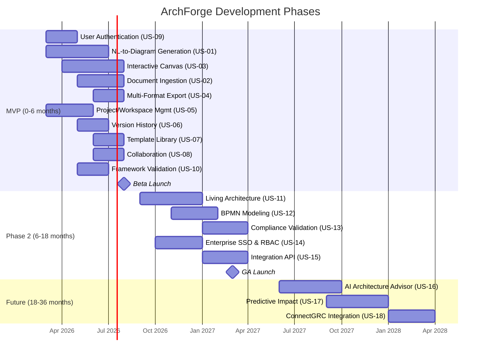
```mermaid
gantt
    title ArchForge Development Phases
    dateFormat YYYY-MM
    axisFormat %b %Y

    section MVP (0-6 months)
    User Authentication (US-09)          :a1, 2026-03, 2M
    NL-to-Diagram Generation (US-01)     :a2, 2026-03, 4M
    Interactive Canvas (US-03)           :a3, 2026-04, 4M
    Document Ingestion (US-02)           :a4, 2026-05, 3M
    Multi-Format Export (US-04)          :a5, 2026-06, 2M
    Project/Workspace Mgmt (US-05)       :a6, 2026-03, 3M
    Version History (US-06)             :a7, 2026-05, 2M
    Template Library (US-07)            :a8, 2026-06, 2M
    Collaboration (US-08)               :a9, 2026-06, 2M
    Framework Validation (US-10)        :a10, 2026-05, 2M
    Beta Launch                         :milestone, m1, 2026-08, 0d

    section Phase 2 (6-18 months)
    Living Architecture (US-11)          :b1, 2026-09, 4M
    BPMN Modeling (US-12)               :b2, 2026-11, 3M
    Compliance Validation (US-13)       :b3, 2027-01, 3M
    Enterprise SSO & RBAC (US-14)       :b4, 2026-10, 3M
    Integration API (US-15)             :b5, 2027-01, 3M
    GA Launch                           :milestone, m2, 2027-03, 0d

    section Future (18-36 months)
    AI Architecture Advisor (US-16)      :c1, 2027-06, 4M
    Predictive Impact (US-17)           :c2, 2027-09, 4M
    ConnectGRC Integration (US-18)       :c3, 2028-01, 3M
```

### 11.2 MVP Scope (0-6 Months: March - August 2026)

**Goal**: Prove the core value proposition: NL to standards-compliant EA artifacts.

**Theme**: "Describe it, ArchForge builds it."

| Story ID | Feature | Priority | Persona |
|----------|---------|----------|---------|
| US-09 | User Registration & Authentication | P0 | All |
| US-01 | NL-to-Diagram Generation (ArchiMate, C4, TOGAF) | P0 | Elena, Marcus |
| US-03 | Interactive Canvas (view, edit, refine) | P0 | Marcus, Elena |
| US-02 | Document/Text Ingestion and Extraction | P0 | Elena |
| US-04 | Multi-Format Export (PNG, SVG, PDF, PlantUML, XML, Mermaid, Draw.io) | P0 | Marcus |
| US-05 | Project/Workspace Management | P1 | Elena, Sarah |
| US-06 | Version History and Change Tracking | P1 | Elena |
| US-10 | Framework Validation (ArchiMate 3.2, TOGAF 10, C4) | P1 | Elena |
| US-07 | Template Library (20+ templates) | P1 | Sarah, David |
| US-08 | Collaboration (Share, Comment) | P1 | Elena, Marcus |

### 11.3 Phase 2 Scope (6-18 Months: September 2026 - February 2027)

**Goal**: Become the living architecture platform; expand frameworks and enterprise features.

**Theme**: "Architecture that breathes."

| Story ID | Feature | Priority | Persona |
|----------|---------|----------|---------|
| US-11 | Living Architecture (cloud infra sync: AWS, Azure, GCP) | P0 | Elena |
| US-12 | BPMN Process Modeling (AI-generated) | P0 | David |
| US-14 | Enterprise SSO (SAML, SCIM) & Advanced RBAC | P1 | Sarah |
| US-13 | Compliance Validation Engine (EU AI Act, DORA, SOX) | P1 | Elena |
| US-15 | Integration API Platform (REST/GraphQL) | P1 | Marcus |

### 11.4 Future Scope (18-36 Months: March 2027 - August 2028)

**Goal**: AI architecture intelligence platform; ConnectSW portfolio integration.

**Theme**: "The architect's AI co-pilot."

| Story ID | Feature | Priority | Persona |
|----------|---------|----------|---------|
| US-16 | AI Architecture Advisor (proactive recommendations, anti-pattern detection) | P0 | Elena |
| US-17 | Predictive Impact Analysis (change impact prediction across architecture) | P0 | Elena, Sarah |
| US-18 | ConnectGRC Integration (bi-directional architecture-risk data flow) | P1 | Elena |

---

## 12. Success Metrics

### 12.1 MVP Success Criteria (Month 6)

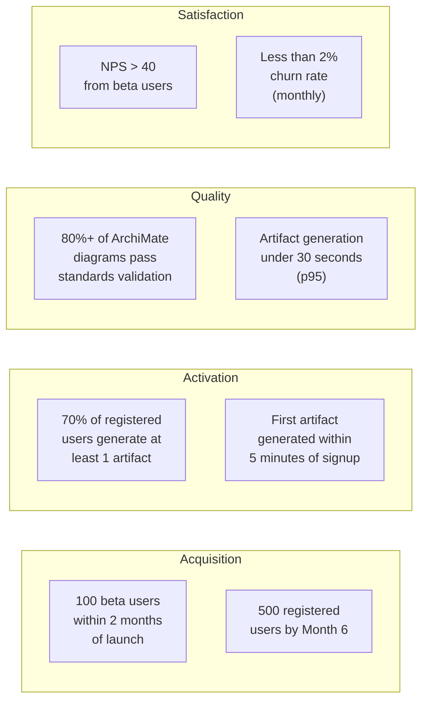
```mermaid
flowchart LR
    subgraph "Acquisition"
        M1["100 beta users<br/>within 2 months<br/>of launch"]
        M2["500 registered<br/>users by Month 6"]
    end

    subgraph "Activation"
        M3["70% of registered<br/>users generate at<br/>least 1 artifact"]
        M4["First artifact<br/>generated within<br/>5 minutes of signup"]
    end

    subgraph "Quality"
        M5["80%+ of ArchiMate<br/>diagrams pass<br/>standards validation"]
        M6["Artifact generation<br/>under 30 seconds<br/>(p95)"]
    end

    subgraph "Satisfaction"
        M7["NPS > 40<br/>from beta users"]
        M8["Less than 2%<br/>churn rate<br/>(monthly)"]
    end
```

| Category | Metric | Target | Measurement |
|----------|--------|--------|-------------|
| **Acquisition** | Beta users (within 2 months of beta launch) | 100 | User registrations with beta flag |
| **Acquisition** | Total registered users (Month 6) | 500 | Database user count |
| **Activation** | Users who generate at least 1 artifact | 70% of registered users | Artifact creation events / user count |
| **Activation** | Time to first artifact (from signup) | Under 5 minutes (median) | Timestamp delta: registration to first artifact |
| **Quality** | ArchiMate standards compliance rate | 80% of generated diagrams pass validation | Validation engine pass/fail ratio |
| **Quality** | Artifact generation latency (p95) | Under 30 seconds | API response time measurement |
| **Quality** | Canvas render time (p95) | Under 2 seconds | Frontend performance measurement |
| **Satisfaction** | Net Promoter Score (NPS) | Greater than 40 | In-app NPS survey |
| **Satisfaction** | Monthly churn rate | Less than 2% | (Users who deactivated) / (Active users at month start) |
| **Engagement** | Artifacts generated per active user per month | At least 5 | Artifact count / active user count |
| **Engagement** | Return rate (weekly) | 60% of active users return at least 3x/week | Session analytics |

### 12.2 Phase 2 Success Criteria (Month 18)

| Category | Metric | Target |
|----------|--------|--------|
| **Revenue** | Annual Recurring Revenue (ARR) | $2-5M |
| **Customers** | Paying customers | 1,000+ |
| **Expansion** | Users per paying customer (average) | 3+ |
| **Infrastructure** | Cloud provider integrations | 3 (AWS, Azure, GCP) |
| **Infrastructure** | Sync latency | Under 15 minutes |
| **Quality** | SOC 2 Type I certification | Obtained |
| **Satisfaction** | NPS | Greater than 50 |

### 12.3 Future Success Criteria (Month 36)

| Category | Metric | Target |
|----------|--------|--------|
| **Revenue** | ARR | $15-45M |
| **Customers** | Total customers | 5,000+ across 3+ verticals |
| **Ecosystem** | Marketplace templates/extensions | 50+ |
| **Portfolio** | ConnectSW cross-sell rate | Greater than 20% |
| **Recognition** | Gartner MQ position | Visionary or Challenger |

---

## 13. Out of Scope

The following items are explicitly **NOT** included in the MVP or Phase 2 and should not be built, designed, or planned for until the Future phase (unless market conditions change):

| # | Out of Scope Item | Reason | When Considered |
|---|-------------------|--------|-----------------|
| 1 | **Mobile application** (iOS/Android) | Desktop-first product; architects work on large screens. Mobile adds complexity without proportional value in early phases. | Future (24+ months) |
| 2 | **On-premise deployment** | Cloud-first strategy reduces operational complexity and accelerates iteration. On-prem is an enterprise upsell feature. | Future (enterprise tier) |
| 3 | **Real-time collaborative editing** (Google Docs-style simultaneous editing) | Complex engineering effort (CRDTs/OT); MVP collaboration covers sharing, commenting, and async editing. Real-time co-editing is a Phase 2+ feature. | Phase 2 (partial), Future (full) |
| 4 | **Custom framework/metamodel creation** | MVP supports ArchiMate, C4, TOGAF. Custom metamodels add significant complexity. | Future |
| 5 | **AI-powered architecture advisory** (proactive recommendations) | Requires deep domain knowledge and training data. Build after core generation is proven. | Future (US-16) |
| 6 | **Predictive impact analysis** | Depends on living architecture and substantial architecture data. | Future (US-17) |
| 7 | **Multi-language support** (non-English NL input) | MVP supports English only. Multi-language NL processing adds complexity. | Phase 2 or Future |
| 8 | **Marketplace for third-party extensions** | Build after platform is stable and has sufficient user base. | Future |
| 9 | **White-labeling / OEM** | Enterprise feature; not needed in early phases. | Future |
| 10 | **Zachman Framework support** | Lower demand than ArchiMate/TOGAF/C4. Add based on user requests. | Phase 2 or Future |
| 11 | **Integration with specific EA tools** (LeanIX import, MEGA import) | Useful but not core. Focus on export formats that enable manual interop. | Phase 2 |
| 12 | **Offline mode** | Cloud-first architecture; offline adds significant data sync complexity. | Future |
| 13 | **Video/screen recording of architecture walkthroughs** | Nice-to-have but not core to artifact generation. | Future |
| 14 | **AI-generated architecture documentation** (prose documents, not diagrams) | MVP focuses on diagrams and visual artifacts. Prose generation is secondary. | Phase 2 |
| 15 | **Multi-organization federation** | Enterprise feature for M&A and partnerships. | Future (US-18 related) |

---

## 14. Risks and Mitigations

### 14.1 Risk Assessment Matrix

```mermaid
quadrantChart
    title ArchForge Risk Assessment
    x-axis Low Probability --> High Probability
    y-axis Low Impact --> High Impact
    quadrant-1 "Monitor & Prepare"
    quadrant-2 "Accept & Watch"
    quadrant-3 "Low Priority"
    quadrant-4 "Active Mitigation Required"
    "R1: AI hallucination": [0.60, 0.85]
    "R2: Standards compliance": [0.55, 0.80]
    "R3: Incumbent catch-up": [0.50, 0.75]
    "R4: LLM cost escalation": [0.45, 0.60]
    "R5: Platform entry": [0.40, 0.70]
    "R6: Enterprise sales cycles": [0.75, 0.55]
    "R7: Architect resistance": [0.35, 0.45]
    "R8: Data privacy concerns": [0.30, 0.65]
    "R9: LLM provider dependency": [0.40, 0.55]
    "R10: Canvas performance": [0.50, 0.50]
```

### 14.2 Risk Details

| ID | Risk | Category | Probability | Impact | Mitigation Strategy |
|----|------|----------|-------------|--------|-------------------|
| R1 | **AI-generated artifacts contain incorrect elements, invalid relationships, or hallucinated components that do not exist in the user's system** | Technical | Medium-High | Very High | (1) Framework validation engine checks every generated artifact against ArchiMate 3.2 / TOGAF 10 specs before displaying. (2) Confidence scores on each element (high/medium/low). (3) Human-in-the-loop: user reviews and confirms before saving. (4) "Explain this element" feature shows AI reasoning. (5) Audit trail for all AI decisions. |
| R2 | **AI-generated artifacts fail to comply with ArchiMate 3.2, TOGAF 10, or C4 Model specifications, undermining trust with framework-certified users** | Technical | Medium | High | (1) Dedicated validation engine with rules derived from official specs. (2) Hire or contract 2-3 ArchiMate/TOGAF-certified architects as domain advisors for validation rule development. (3) Automated regression testing against 200+ known-valid artifact patterns. (4) Auto-fix feature that corrects common violations. |
| R3 | **Incumbents (LeanIX, Ardoq, BiZZdesign) accelerate AI feature development faster than expected, closing the competitive gap before ArchForge gains traction** | Competitive | Medium | High | (1) Ship MVP within 6 months (speed is primary advantage). (2) Focus on end-to-end NL artifact generation -- the gap incumbents cannot close quickly due to architectural constraints. (3) Build community and content moat (templates, guides, case studies). (4) Product-led growth to acquire users before enterprise sales cycles begin. |
| R4 | **LLM API costs (Claude, GPT) are higher than projected, making the free tier and lower pricing tiers unprofitable** | Financial | Medium | Medium | (1) Implement token budgets per user tier. (2) Cache common generation patterns to reduce API calls. (3) Use smaller/cheaper models for simple tasks (validation, formatting) and large models only for generation. (4) Negotiate volume pricing with LLM providers. (5) Monitor cost per artifact generated and adjust pricing if needed. |
| R5 | **A major platform (Microsoft, ServiceNow, Google) launches an AI-powered EA tool as part of their broader platform, commoditizing the market** | Competitive | Medium | High | (1) Differentiate on depth of EA expertise (platforms offer breadth, not depth). (2) Focus on standards compliance (ArchiMate, TOGAF) that platforms will not invest in deeply. (3) Position as best-of-breed vs. platform-embedded. (4) Build integrations with those platforms (become complementary rather than competitive). |
| R6 | **Enterprise customers have long evaluation and procurement cycles (6-12 months), delaying revenue beyond projections** | Business | High | Medium | (1) Product-led growth (PLG) targeting individual architects and SMEs for immediate revenue. (2) Free tier as pipeline generator for enterprise deals. (3) Build enterprise pipeline in parallel with PLG motion. (4) Offer free POC/pilot programs (30 days) to accelerate enterprise evaluation. |
| R7 | **Enterprise architects perceive AI-generated artifacts as a threat to their role, leading to resistance and low adoption** | Adoption | Low-Medium | Medium | (1) Position as augmentation, not replacement: "ArchForge handles the tedious documentation so you can focus on strategy." (2) Marketing emphasizes architect empowerment, not automation. (3) Case studies showing architects being promoted to strategic roles after adopting AI tools. (4) Community engagement with EA practitioners. |
| R8 | **Enterprises are unwilling to send architecture descriptions to third-party LLM providers due to data sensitivity and IP concerns** | Business | Medium | Medium-High | (1) Offer bring-your-own-key (BYOK) for LLM providers so data goes directly to customer's LLM account. (2) Data processing agreement (DPA) with LLM providers ensuring no training on customer data. (3) Document data flow transparency. (4) Phase 2: on-premise LLM option for highest-sensitivity customers. (5) SOC 2 certification. |
| R9 | **Single LLM provider dependency creates availability and pricing risk** | Technical | Medium | Medium | (1) Abstract LLM integration behind a provider-agnostic interface. (2) Support at least 2 LLM providers (Anthropic Claude + OpenAI GPT) from MVP. (3) Automatic failover between providers. (4) Monitor provider SLAs and availability. |
| R10 | **Interactive canvas performance degrades with complex diagrams (100+ elements), leading to poor user experience** | Technical | Medium | Medium | (1) Use WebGL-accelerated canvas rendering (e.g., Pixi.js or Konva.js). (2) Implement virtualization: only render visible elements. (3) Performance budget: test with 200-element diagrams in CI. (4) Lazy-load element details. (5) Offer "simplified view" that collapses detail levels. |

### 14.3 Risk Monitoring Plan

| Risk | Monitoring Trigger | Response Plan |
|------|-------------------|--------------|
| R1 (Hallucination) | Validation failure rate exceeds 30% | Increase prompt engineering investment; add post-generation review step; consider fine-tuned models |
| R2 (Standards) | User-reported compliance issues exceed 5/week | Hire additional EA domain advisor; expand validation rule set; add framework-specific regression tests |
| R3 (Competitor) | Incumbent announces AI-native EA product | Accelerate roadmap; double down on differentiators; increase marketing spend |
| R4 (LLM Cost) | Cost per artifact exceeds $0.50 | Implement caching layer; adjust pricing tiers; evaluate open-source LLM alternatives |
| R6 (Sales cycles) | Enterprise pipeline conversion rate below 10% | Increase PLG investment; add self-serve enterprise trial; reduce friction in evaluation |
| R8 (Data privacy) | More than 3 enterprise prospects cite data concerns as deal-breaker | Accelerate BYOK and on-prem LLM options; prioritize SOC 2 certification |

---

## Appendix A: Glossary

| Term | Definition |
|------|-----------|
| **ArchiMate** | An open and independent modeling language for enterprise architecture, maintained by The Open Group. Version 3.2 is the current release. |
| **TOGAF** | The Open Group Architecture Framework, a methodology for enterprise architecture development. Version 10 is the current release. |
| **C4 Model** | A software architecture visualization model with 4 levels: Context, Container, Component, Code. Created by Simon Brown. |
| **BPMN** | Business Process Model and Notation, a graphical representation standard for business processes. |
| **ADM** | Architecture Development Method, the core process of TOGAF defining phases for architecture development. |
| **NL** | Natural Language, referring to human-readable text input (as opposed to structured or programmatic input). |
| **Living Architecture** | Architecture models that automatically stay current by syncing with actual infrastructure and systems. |
| **PLG** | Product-Led Growth, a go-to-market strategy where the product itself drives user acquisition and conversion. |
| **RBAC** | Role-Based Access Control, a method of regulating access based on user roles within an organization. |
| **BYOK** | Bring Your Own Key, allowing customers to use their own API keys for third-party services (e.g., LLM providers). |

## Appendix B: Referenced Documents

| Document | Location | Purpose |
|----------|----------|---------|
| Product Strategy 2026 | `products/archforge/docs/strategy/PRODUCT-STRATEGY-2026.md` | Market research, competitive analysis, roadmap horizons, SWOT, and strategic recommendation |
| ConnectSW CLAUDE.md | `.claude/CLAUDE.md` | Company standards, development practices, documentation requirements |
| Port Registry | `.claude/PORT-REGISTRY.md` | Port assignments (ArchForge: Frontend 3116, Backend 5012) |
| Component Registry | `.claude/COMPONENT-REGISTRY.md` | Reusable components across ConnectSW products |

---

**Document Status**: Draft for CEO Review
**Next Steps**: Upon CEO approval, this PRD will be passed to the Architect agent for system design (`/speckit.plan`), followed by task decomposition (`/speckit.tasks`) and implementation (`/speckit.implement`).
