# ArchForge System Architecture

**Document Version**: 1.0
**Date**: February 19, 2026
**Author**: Architect, ConnectSW
**Status**: Approved
**Product**: ArchForge -- AI-Powered Enterprise Architecture Platform

---

## Table of Contents

1. [Architecture Overview](#1-architecture-overview)
2. [C4 Model Diagrams](#2-c4-model-diagrams)
3. [Data Flow Diagrams](#3-data-flow-diagrams)
4. [Integration Points](#4-integration-points)
5. [Security Architecture](#5-security-architecture)
6. [Performance Architecture](#6-performance-architecture)
7. [Technology Decisions Summary](#7-technology-decisions-summary)
8. [Deployment Architecture](#8-deployment-architecture)
9. [Referenced ADRs](#9-referenced-adrs)

---

## 1. Architecture Overview

ArchForge is a server-rendered web application with an API backend that orchestrates AI-powered artifact generation. The system follows a layered monolith architecture with clear separation between presentation, business logic, and data access layers. AI integration is handled through a provider-agnostic abstraction layer that supports multiple LLM providers.

### 1.1 Guiding Principles

| Principle | Rationale |
|-----------|-----------|
| **Monolith-first** | No microservices until scale demands it. A single Fastify process handles all API routes. |
| **AI provider abstraction** | LLM calls go through an adapter interface so we can swap Claude/GPT or add failover without touching business logic. |
| **Real-time via WebSocket rooms** | Collaboration uses Fastify WebSocket plugin with Redis Pub/Sub for multi-instance broadcast. No CRDT complexity in MVP. |
| **Canvas as data, not pixels** | Artifacts are stored as structured JSON (elements + relationships + layout). Rendering is a client-side concern. |
| **Export is server-side** | Image/PDF/XML exports happen on the API server to guarantee deterministic output and avoid browser inconsistencies. |
| **Reuse ConnectSW packages** | Auth, UI components, logging, and crypto come from `@connectsw/*` shared packages. |

### 1.2 High-Level System Diagram

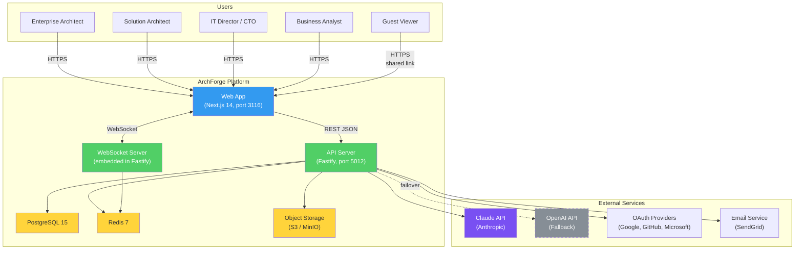
```mermaid
graph TD
    subgraph "Users"
        U1["Enterprise Architect"]
        U2["Solution Architect"]
        U3["IT Director / CTO"]
        U4["Business Analyst"]
        U5["Guest Viewer"]
    end

    subgraph "ArchForge Platform"
        WEB["Web App<br/>(Next.js 14, port 3116)"]
        API["API Server<br/>(Fastify, port 5012)"]
        WS["WebSocket Server<br/>(embedded in Fastify)"]
        DB["PostgreSQL 15"]
        REDIS["Redis 7"]
        S3["Object Storage<br/>(S3 / MinIO)"]
    end

    subgraph "External Services"
        CLAUDE["Claude API<br/>(Anthropic)"]
        OPENAI["OpenAI API<br/>(Fallback)"]
        OAUTH["OAuth Providers<br/>(Google, GitHub, Microsoft)"]
        EMAIL["Email Service<br/>(SendGrid)"]
    end

    U1 & U2 & U3 & U4 -->|HTTPS| WEB
    U5 -->|HTTPS<br/>shared link| WEB
    WEB -->|REST JSON| API
    WEB <-->|WebSocket| WS
    API --> DB
    API --> REDIS
    API --> S3
    API --> CLAUDE
    API -.->|failover| OPENAI
    API --> OAUTH
    API --> EMAIL
    WS --> REDIS

    style WEB fill:#339af0,color:#fff
    style API fill:#51cf66,color:#fff
    style WS fill:#51cf66,color:#fff
    style DB fill:#ffd43b,color:#333
    style REDIS fill:#ffd43b,color:#333
    style S3 fill:#ffd43b,color:#333
    style CLAUDE fill:#7950f2,color:#fff
    style OPENAI fill:#868e96,color:#fff,stroke-dasharray:5 5
```

---

## 2. C4 Model Diagrams

### 2.1 Level 1: System Context

This diagram shows ArchForge in relation to its users and external systems.

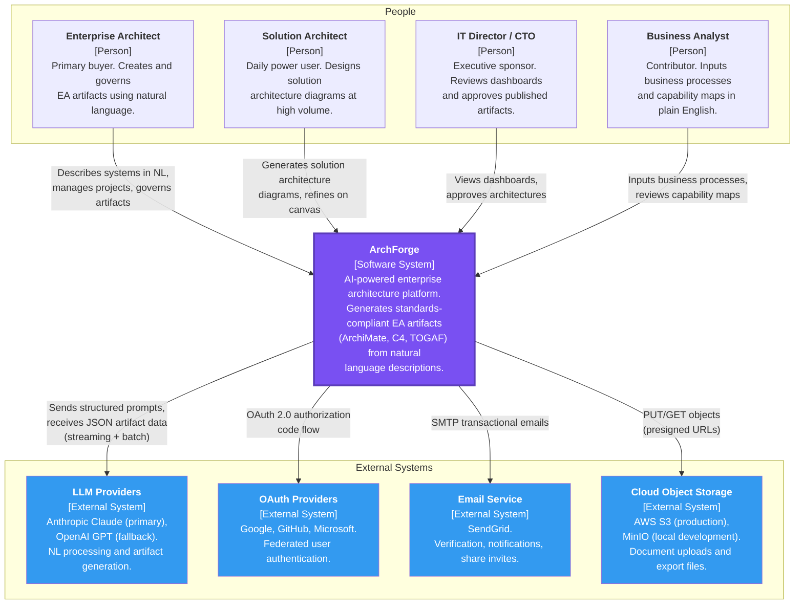
```mermaid
graph TD
    subgraph "People"
        EA["<b>Enterprise Architect</b><br/>[Person]<br/>Primary buyer. Creates and governs<br/>EA artifacts using natural language."]
        SA["<b>Solution Architect</b><br/>[Person]<br/>Daily power user. Designs solution<br/>architecture diagrams at high volume."]
        CTO["<b>IT Director / CTO</b><br/>[Person]<br/>Executive sponsor. Reviews dashboards<br/>and approves published artifacts."]
        BA["<b>Business Analyst</b><br/>[Person]<br/>Contributor. Inputs business processes<br/>and capability maps in plain English."]
    end

    AF["<b>ArchForge</b><br/>[Software System]<br/>AI-powered enterprise architecture platform.<br/>Generates standards-compliant EA artifacts<br/>(ArchiMate, C4, TOGAF) from natural<br/>language descriptions."]

    subgraph "External Systems"
        LLM["<b>LLM Providers</b><br/>[External System]<br/>Anthropic Claude (primary),<br/>OpenAI GPT (fallback).<br/>NL processing and artifact generation."]
        OAUTH["<b>OAuth Providers</b><br/>[External System]<br/>Google, GitHub, Microsoft.<br/>Federated user authentication."]
        EMAIL["<b>Email Service</b><br/>[External System]<br/>SendGrid.<br/>Verification, notifications, share invites."]
        STORAGE["<b>Cloud Object Storage</b><br/>[External System]<br/>AWS S3 (production),<br/>MinIO (local development).<br/>Document uploads and export files."]
    end

    EA -->|"Describes systems in NL,<br/>manages projects, governs artifacts"| AF
    SA -->|"Generates solution architecture<br/>diagrams, refines on canvas"| AF
    CTO -->|"Views dashboards,<br/>approves architectures"| AF
    BA -->|"Inputs business processes,<br/>reviews capability maps"| AF

    AF -->|"Sends structured prompts,<br/>receives JSON artifact data<br/>(streaming + batch)"| LLM
    AF -->|"OAuth 2.0 authorization<br/>code flow"| OAUTH
    AF -->|"SMTP transactional emails"| EMAIL
    AF -->|"PUT/GET objects<br/>(presigned URLs)"| STORAGE

    style AF fill:#7950f2,color:#fff,stroke:#5c3dba,stroke-width:3px
    style LLM fill:#339af0,color:#fff
    style OAUTH fill:#339af0,color:#fff
    style EMAIL fill:#339af0,color:#fff
    style STORAGE fill:#339af0,color:#fff
```

### 2.2 Level 2: Container Diagram

This diagram shows the high-level technical building blocks inside the ArchForge system boundary.

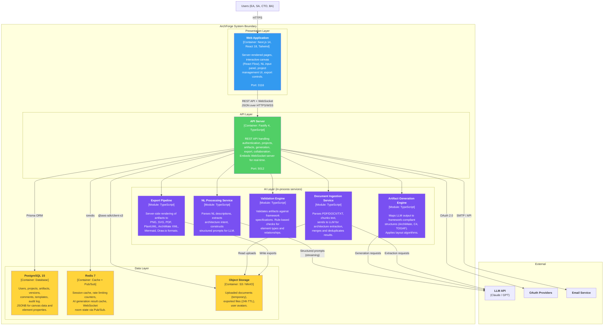
```mermaid
graph TD
    subgraph "ArchForge System Boundary"
        subgraph "Presentation Layer"
            WEB["<b>Web Application</b><br/>[Container: Next.js 14, React 18, Tailwind]<br/><br/>Server-rendered pages, interactive canvas<br/>(React Flow), NL input panel, project<br/>management UI, export controls.<br/><br/>Port: 3116"]
        end

        subgraph "API Layer"
            API["<b>API Server</b><br/>[Container: Fastify 4, TypeScript]<br/><br/>REST API handling authentication, projects,<br/>artifacts, generation, export, collaboration.<br/>Embeds WebSocket server for real-time.<br/><br/>Port: 5012"]
        end

        subgraph "AI Layer (in-process services)"
            NLP["<b>NL Processing Service</b><br/>[Module: TypeScript]<br/><br/>Parses NL descriptions, extracts<br/>architecture intent, constructs<br/>structured prompts for LLM."]
            GEN["<b>Artifact Generation Engine</b><br/>[Module: TypeScript]<br/><br/>Maps LLM output to framework-compliant<br/>structures (ArchiMate, C4, TOGAF).<br/>Applies layout algorithms."]
            VAL["<b>Validation Engine</b><br/>[Module: TypeScript]<br/><br/>Validates artifacts against framework<br/>specifications. Rule-based checks for<br/>element types and relationships."]
            ING["<b>Document Ingestion Service</b><br/>[Module: TypeScript]<br/><br/>Parses PDF/DOCX/TXT, chunks text,<br/>sends to LLM for architecture extraction,<br/>merges and deduplicates results."]
            EXP["<b>Export Pipeline</b><br/>[Module: TypeScript]<br/><br/>Server-side rendering of artifacts to<br/>PNG, SVG, PDF, PlantUML, ArchiMate XML,<br/>Mermaid, Draw.io formats."]
        end

        subgraph "Data Layer"
            DB["<b>PostgreSQL 15</b><br/>[Container: Database]<br/><br/>Users, projects, artifacts, versions,<br/>comments, templates, audit log.<br/>JSONB for canvas data and<br/>element properties."]
            REDIS["<b>Redis 7</b><br/>[Container: Cache + Pub/Sub]<br/><br/>Session cache, rate limiting counters,<br/>AI generation result cache, WebSocket<br/>room state via Pub/Sub."]
            S3["<b>Object Storage</b><br/>[Container: S3 / MinIO]<br/><br/>Uploaded documents (temporary),<br/>exported files (24h TTL),<br/>user avatars."]
        end
    end

    subgraph "External"
        LLM["<b>LLM API</b><br/>(Claude / GPT)"]
        OAUTH["<b>OAuth Providers</b>"]
        EMAIL["<b>Email Service</b>"]
    end

    Users["Users (EA, SA, CTO, BA)"] -->|"HTTPS"| WEB
    WEB -->|"REST API + WebSocket<br/>JSON over HTTPS/WSS"| API

    API --> NLP
    API --> GEN
    API --> VAL
    API --> ING
    API --> EXP

    NLP -->|"Structured prompts<br/>(streaming)"| LLM
    GEN -->|"Generation requests"| LLM
    ING -->|"Extraction requests"| LLM

    API -->|"Prisma ORM"| DB
    API -->|"ioredis"| REDIS
    API -->|"@aws-sdk/client-s3"| S3

    ING -->|"Read uploads"| S3
    EXP -->|"Write exports"| S3

    API -->|"OAuth 2.0"| OAUTH
    API -->|"SMTP / API"| EMAIL

    style WEB fill:#339af0,color:#fff
    style API fill:#51cf66,color:#fff
    style NLP fill:#7950f2,color:#fff
    style GEN fill:#7950f2,color:#fff
    style VAL fill:#7950f2,color:#fff
    style ING fill:#7950f2,color:#fff
    style EXP fill:#7950f2,color:#fff
    style DB fill:#ffd43b,color:#333
    style REDIS fill:#ffd43b,color:#333
    style S3 fill:#ffd43b,color:#333
```

### 2.3 Level 3: Component Diagram (API Server)

This diagram shows the internal structure of the Fastify API server.

```mermaid
graph TD
    subgraph "API Server (Fastify, Port 5012)"
        subgraph "Plugin Layer (registered in order)"
            P1["<b>Observability Plugin</b><br/>Pino structured logging,<br/>request correlation IDs,<br/>Sentry error tracking"]
            P2["<b>Prisma Plugin</b><br/>PrismaClient lifecycle,<br/>connection pool (10 conns),<br/>graceful shutdown"]
            P3["<b>Redis Plugin</b><br/>ioredis connection,<br/>TLS in production,<br/>graceful degradation"]
            P4["<b>Rate Limit Plugin</b><br/>Redis-backed counters,<br/>60 req/min general,<br/>10 req/min AI endpoints"]
            P5["<b>Auth Plugin</b><br/>@connectsw/auth package,<br/>JWT + API key dual auth,<br/>refresh token rotation"]
            P6["<b>WebSocket Plugin</b><br/>@fastify/websocket,<br/>room-based connections,<br/>Redis Pub/Sub broadcast"]
        end

        subgraph "Route Layer"
            R1["<b>Auth Routes</b><br/>POST /auth/register<br/>POST /auth/login<br/>POST /auth/refresh<br/>POST /auth/logout<br/>GET /auth/me"]
            R2["<b>Project Routes</b><br/>CRUD /projects<br/>GET /projects/:id/members<br/>POST /projects/:id/members"]
            R3["<b>Artifact Routes</b><br/>CRUD /artifacts<br/>POST /artifacts/generate<br/>POST /artifacts/ingest<br/>POST /artifacts/:id/export"]
            R4["<b>Version Routes</b><br/>GET /artifacts/:id/versions<br/>POST /artifacts/:id/versions<br/>POST /artifacts/:id/restore"]
            R5["<b>Template Routes</b><br/>GET /templates<br/>GET /templates/:id<br/>POST /templates"]
            R6["<b>Collaboration Routes</b><br/>GET /artifacts/:id/comments<br/>POST /artifacts/:id/comments<br/>POST /artifacts/:id/share<br/>WS /ws/artifacts/:id"]
        end

        subgraph "Service Layer"
            S1["<b>AuthService</b><br/>Registration, login,<br/>OAuth, token mgmt,<br/>password reset"]
            S2["<b>ProjectService</b><br/>CRUD, membership,<br/>archival, deletion,<br/>search"]
            S3["<b>GenerationService</b><br/>NL parsing, prompt<br/>construction, LLM call,<br/>artifact mapping"]
            S4["<b>IngestionService</b><br/>Doc parsing, text<br/>chunking, extraction,<br/>merge & dedup"]
            S5["<b>CanvasService</b><br/>Element CRUD, layout<br/>persistence, refinement,<br/>auto-save batching"]
            S6["<b>ExportService</b><br/>PNG/SVG/PDF/PlantUML/<br/>ArchiMate XML/Mermaid/<br/>Draw.io rendering"]
            S7["<b>ValidationService</b><br/>ArchiMate 3.2 rules,<br/>C4 structure rules,<br/>TOGAF compliance"]
            S8["<b>TemplateService</b><br/>Gallery browsing,<br/>template application,<br/>custom template save"]
            S9["<b>CollaborationService</b><br/>Sharing, comments,<br/>WebSocket rooms,<br/>notifications"]
            S10["<b>VersionService</b><br/>Version creation,<br/>diff computation,<br/>restore operations"]
        end

        subgraph "Infrastructure Layer"
            I1["<b>LLMAdapter</b><br/>Provider-agnostic interface.<br/>ClaudeAdapter (primary),<br/>OpenAIAdapter (fallback).<br/>Streaming + batch modes."]
            I2["<b>StorageAdapter</b><br/>S3Adapter (production),<br/>LocalAdapter (development).<br/>Presigned URL generation."]
            I3["<b>EmailAdapter</b><br/>SendGrid (production),<br/>Console logger (dev).<br/>Template-based emails."]
            I4["<b>CacheAdapter</b><br/>Redis-backed caching<br/>for AI generation results<br/>and rendered SVGs."]
        end
    end

    P1 --> P2 --> P3 --> P4 --> P5 --> P6

    R1 --> S1
    R2 --> S2
    R3 --> S3
    R3 --> S4
    R3 --> S6
    R4 --> S10
    R5 --> S8
    R6 --> S9

    S3 --> I1
    S4 --> I1
    S6 --> I2
    S4 --> I2
    S1 --> I3
    S9 --> I3
    S3 --> I4
    S5 --> S10
    S3 --> S7

    style P1 fill:#868e96,color:#fff
    style P2 fill:#868e96,color:#fff
    style P3 fill:#868e96,color:#fff
    style P4 fill:#868e96,color:#fff
    style P5 fill:#868e96,color:#fff
    style P6 fill:#868e96,color:#fff
    style R1 fill:#339af0,color:#fff
    style R2 fill:#339af0,color:#fff
    style R3 fill:#339af0,color:#fff
    style R4 fill:#339af0,color:#fff
    style R5 fill:#339af0,color:#fff
    style R6 fill:#339af0,color:#fff
    style S1 fill:#51cf66,color:#fff
    style S2 fill:#51cf66,color:#fff
    style S3 fill:#51cf66,color:#fff
    style S4 fill:#51cf66,color:#fff
    style S5 fill:#51cf66,color:#fff
    style S6 fill:#51cf66,color:#fff
    style S7 fill:#51cf66,color:#fff
    style S8 fill:#51cf66,color:#fff
    style S9 fill:#51cf66,color:#fff
    style S10 fill:#51cf66,color:#fff
    style I1 fill:#7950f2,color:#fff
    style I2 fill:#7950f2,color:#fff
    style I3 fill:#7950f2,color:#fff
    style I4 fill:#7950f2,color:#fff
```

### 2.4 Level 3: Component Diagram (Web Application)

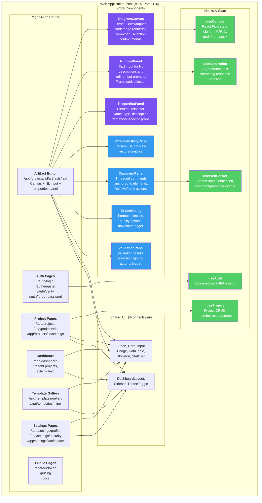
```mermaid
graph TD
    subgraph "Web Application (Next.js 14, Port 3116)"
        subgraph "Pages (App Router)"
            PG1["<b>Auth Pages</b><br/>/auth/login<br/>/auth/register<br/>/auth/verify<br/>/auth/forgot-password"]
            PG2["<b>Dashboard</b><br/>/app/dashboard<br/>Recent projects,<br/>activity feed"]
            PG3["<b>Project Pages</b><br/>/app/projects<br/>/app/projects/:id<br/>/app/projects/:id/settings"]
            PG4["<b>Artifact Editor</b><br/>/app/projects/:id/artifacts/:aid<br/>Canvas + NL input +<br/>properties panel"]
            PG5["<b>Template Gallery</b><br/>/app/templates/gallery<br/>/app/templates/mine"]
            PG6["<b>Settings Pages</b><br/>/app/settings/profile<br/>/app/settings/security<br/>/app/settings/workspace"]
            PG7["<b>Public Pages</b><br/>/shared/:token<br/>/pricing<br/>/docs"]
        end

        subgraph "Core Components"
            C1["<b>DiagramCanvas</b><br/>React Flow wrapper.<br/>Node/edge rendering,<br/>zoom/pan, selection,<br/>context menus."]
            C2["<b>NLInputPanel</b><br/>Text input for NL<br/>descriptions and<br/>refinement prompts.<br/>Framework selector."]
            C3["<b>PropertiesPanel</b><br/>Element inspector.<br/>Name, type, description,<br/>framework-specific props."]
            C4["<b>VersionHistoryPanel</b><br/>Version list, diff view,<br/>restore controls."]
            C5["<b>CommentPanel</b><br/>Threaded comments<br/>anchored to elements.<br/>Resolve/reply actions."]
            C6["<b>ExportDialog</b><br/>Format selection,<br/>quality options,<br/>download trigger."]
            C7["<b>ValidationPanel</b><br/>Validation results,<br/>error highlighting,<br/>auto-fix trigger."]
        end

        subgraph "Shared UI (@connectsw/ui)"
            UI1["Button, Card, Input,<br/>Badge, DataTable,<br/>Skeleton, StatCard"]
            UI2["DashboardLayout,<br/>Sidebar, ThemeToggle"]
        end

        subgraph "Hooks & State"
            H1["<b>useAuth</b><br/>@connectsw/auth/frontend"]
            H2["<b>useCanvas</b><br/>React Flow state,<br/>element CRUD,<br/>undo/redo stack"]
            H3["<b>useGeneration</b><br/>AI generation API,<br/>streaming response<br/>handling"]
            H4["<b>useWebSocket</b><br/>Artifact room connection,<br/>comment/presence events"]
            H5["<b>useProject</b><br/>Project CRUD,<br/>member management"]
        end
    end

    PG4 --> C1 & C2 & C3 & C4 & C5 & C6 & C7
    C1 --> H2
    C2 --> H3
    C5 --> H4
    PG1 --> H1
    PG3 --> H5
    PG2 & PG3 & PG4 & PG5 & PG6 --> UI1 & UI2

    style C1 fill:#7950f2,color:#fff
    style C2 fill:#7950f2,color:#fff
    style C3 fill:#7950f2,color:#fff
    style C4 fill:#339af0,color:#fff
    style C5 fill:#339af0,color:#fff
    style C6 fill:#339af0,color:#fff
    style C7 fill:#339af0,color:#fff
    style H1 fill:#51cf66,color:#fff
    style H2 fill:#51cf66,color:#fff
    style H3 fill:#51cf66,color:#fff
    style H4 fill:#51cf66,color:#fff
    style H5 fill:#51cf66,color:#fff
```

---

## 3. Data Flow Diagrams

### 3.1 NL-to-Artifact Generation Flow

This is the core flow of the product. A user describes a system in natural language and receives a standards-compliant architecture diagram.

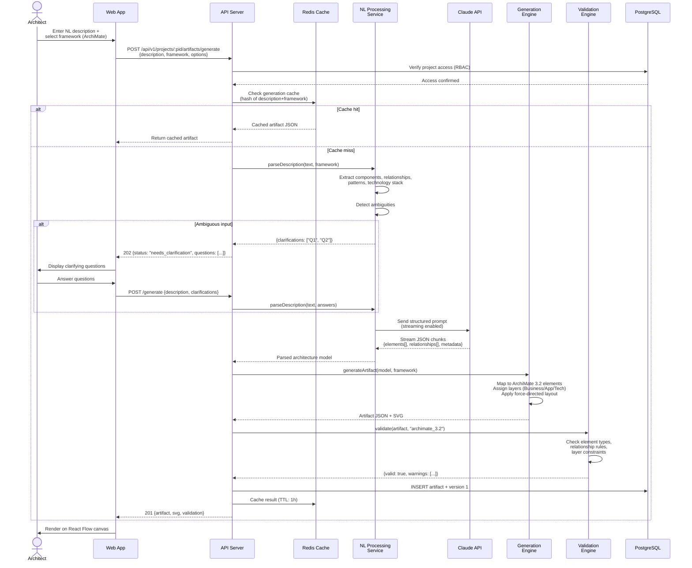
```mermaid
sequenceDiagram
    actor User as Architect
    participant Web as Web App
    participant API as API Server
    participant Cache as Redis Cache
    participant NLP as NL Processing<br/>Service
    participant LLM as Claude API
    participant Gen as Generation<br/>Engine
    participant Val as Validation<br/>Engine
    participant DB as PostgreSQL

    User->>Web: Enter NL description +<br/>select framework (ArchiMate)
    Web->>API: POST /api/v1/projects/:pid/artifacts/generate<br/>{description, framework, options}

    API->>DB: Verify project access (RBAC)
    DB-->>API: Access confirmed

    API->>Cache: Check generation cache<br/>(hash of description+framework)
    alt Cache hit
        Cache-->>API: Cached artifact JSON
        API-->>Web: Return cached artifact
    else Cache miss
        API->>NLP: parseDescription(text, framework)
        NLP->>NLP: Extract components, relationships,<br/>patterns, technology stack
        NLP->>NLP: Detect ambiguities

        alt Ambiguous input
            NLP-->>API: {clarifications: ["Q1", "Q2"]}
            API-->>Web: 202 {status: "needs_clarification", questions: [...]}
            Web->>User: Display clarifying questions
            User->>Web: Answer questions
            Web->>API: POST /generate {description, clarifications}
            API->>NLP: parseDescription(text, answers)
        end

        NLP->>LLM: Send structured prompt<br/>(streaming enabled)
        LLM-->>NLP: Stream JSON chunks<br/>{elements[], relationships[], metadata}
        NLP-->>API: Parsed architecture model

        API->>Gen: generateArtifact(model, framework)
        Gen->>Gen: Map to ArchiMate 3.2 elements<br/>Assign layers (Business/App/Tech)<br/>Apply force-directed layout
        Gen-->>API: Artifact JSON + SVG

        API->>Val: validate(artifact, "archimate_3.2")
        Val->>Val: Check element types,<br/>relationship rules,<br/>layer constraints
        Val-->>API: {valid: true, warnings: [...]}

        API->>DB: INSERT artifact + version 1
        API->>Cache: Cache result (TTL: 1h)
        API-->>Web: 201 {artifact, svg, validation}
    end

    Web->>User: Render on React Flow canvas
```

### 3.2 Document Ingestion Flow

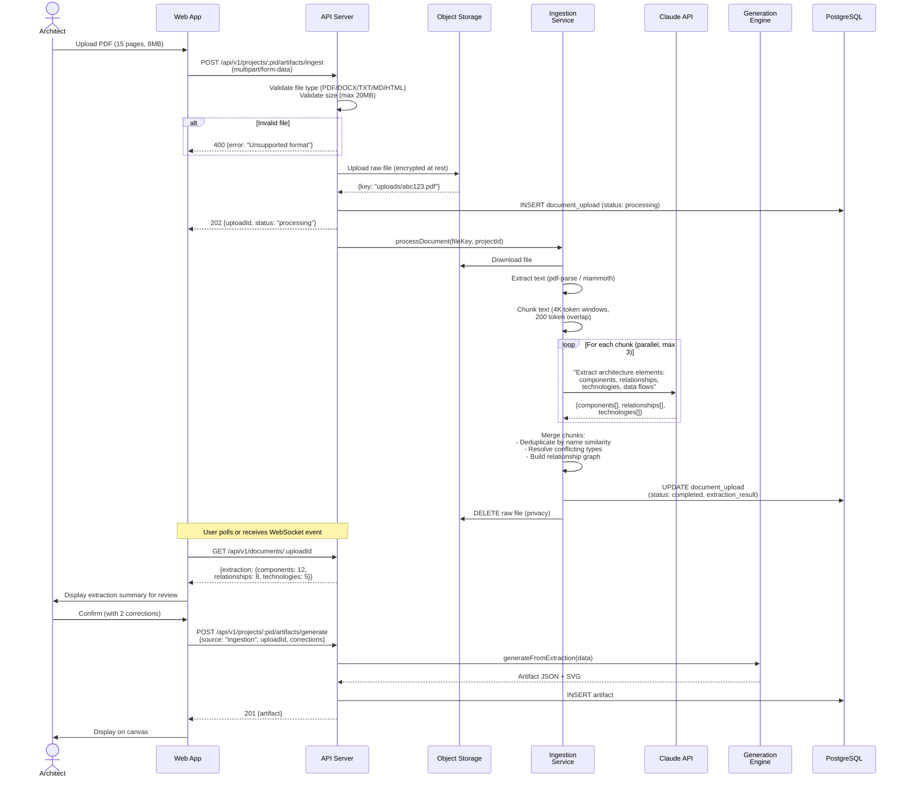
```mermaid
sequenceDiagram
    actor User as Architect
    participant Web as Web App
    participant API as API Server
    participant S3 as Object Storage
    participant Ing as Ingestion<br/>Service
    participant LLM as Claude API
    participant Gen as Generation<br/>Engine
    participant DB as PostgreSQL

    User->>Web: Upload PDF (15 pages, 8MB)
    Web->>API: POST /api/v1/projects/:pid/artifacts/ingest<br/>(multipart/form-data)

    API->>API: Validate file type (PDF/DOCX/TXT/MD/HTML)<br/>Validate size (max 20MB)

    alt Invalid file
        API-->>Web: 400 {error: "Unsupported format"}
    end

    API->>S3: Upload raw file (encrypted at rest)
    S3-->>API: {key: "uploads/abc123.pdf"}
    API->>DB: INSERT document_upload (status: processing)
    API-->>Web: 202 {uploadId, status: "processing"}

    API->>Ing: processDocument(fileKey, projectId)
    Ing->>S3: Download file
    Ing->>Ing: Extract text (pdf-parse / mammoth)
    Ing->>Ing: Chunk text (4K token windows,<br/>200 token overlap)

    loop For each chunk (parallel, max 3)
        Ing->>LLM: "Extract architecture elements:<br/>components, relationships,<br/>technologies, data flows"
        LLM-->>Ing: {components[], relationships[],<br/>technologies[]}
    end

    Ing->>Ing: Merge chunks:<br/>- Deduplicate by name similarity<br/>- Resolve conflicting types<br/>- Build relationship graph
    Ing->>DB: UPDATE document_upload<br/>(status: completed, extraction_result)
    Ing->>S3: DELETE raw file (privacy)

    Note over Web,API: User polls or receives WebSocket event

    Web->>API: GET /api/v1/documents/:uploadId
    API-->>Web: {extraction: {components: 12,<br/>relationships: 8, technologies: 5}}
    Web->>User: Display extraction summary for review

    User->>Web: Confirm (with 2 corrections)
    Web->>API: POST /api/v1/projects/:pid/artifacts/generate<br/>{source: "ingestion", uploadId, corrections}
    API->>Gen: generateFromExtraction(data)
    Gen-->>API: Artifact JSON + SVG
    API->>DB: INSERT artifact
    API-->>Web: 201 {artifact}
    Web->>User: Display on canvas
```

### 3.3 Real-Time Collaboration Flow

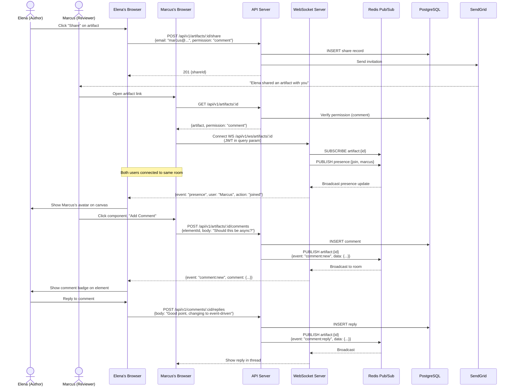
```mermaid
sequenceDiagram
    actor Author as Elena (Author)
    actor Reviewer as Marcus (Reviewer)
    participant W1 as Elena's Browser
    participant W2 as Marcus's Browser
    participant API as API Server
    participant WS as WebSocket Server
    participant Redis as Redis Pub/Sub
    participant DB as PostgreSQL
    participant Email as SendGrid

    Author->>W1: Click "Share" on artifact
    W1->>API: POST /api/v1/artifacts/:id/share<br/>{email: "marcus@...", permission: "comment"}
    API->>DB: INSERT share record
    API->>Email: Send invitation
    API-->>W1: 201 {shareId}

    Email-->>Reviewer: "Elena shared an artifact with you"

    Reviewer->>W2: Open artifact link
    W2->>API: GET /api/v1/artifacts/:id
    API->>DB: Verify permission (comment)
    API-->>W2: {artifact, permission: "comment"}

    W2->>WS: Connect WS /api/v1/ws/artifacts/:id<br/>(JWT in query param)
    WS->>Redis: SUBSCRIBE artifact:{id}
    WS->>Redis: PUBLISH presence:{join, marcus}

    Note over W1,W2: Both users connected to same room

    Redis-->>WS: Broadcast presence update
    WS-->>W1: {event: "presence", user: "Marcus", action: "joined"}
    W1->>Author: Show Marcus's avatar on canvas

    Reviewer->>W2: Click component, "Add Comment"
    W2->>API: POST /api/v1/artifacts/:id/comments<br/>{elementId, body: "Should this be async?"}
    API->>DB: INSERT comment
    API->>Redis: PUBLISH artifact:{id}<br/>{event: "comment:new", data: {...}}
    Redis-->>WS: Broadcast to room
    WS-->>W1: {event: "comment:new", comment: {...}}
    W1->>Author: Show comment badge on element

    Author->>W1: Reply to comment
    W1->>API: POST /api/v1/comments/:cid/replies<br/>{body: "Good point, changing to event-driven"}
    API->>DB: INSERT reply
    API->>Redis: PUBLISH artifact:{id}<br/>{event: "comment:reply", data: {...}}
    Redis-->>WS: Broadcast
    WS-->>W2: Show reply in thread
```

### 3.4 Export Pipeline Flow

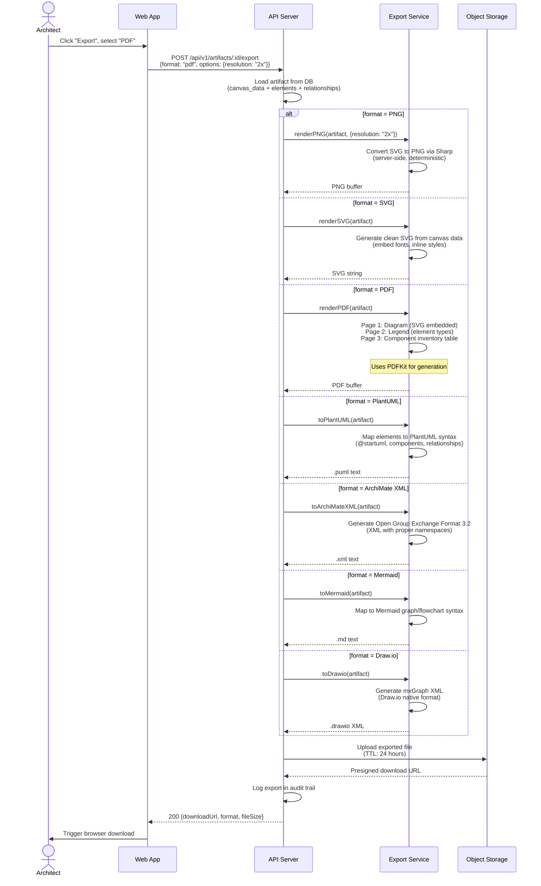
```mermaid
sequenceDiagram
    actor User as Architect
    participant Web as Web App
    participant API as API Server
    participant Exp as Export Service
    participant S3 as Object Storage

    User->>Web: Click "Export", select "PDF"
    Web->>API: POST /api/v1/artifacts/:id/export<br/>{format: "pdf", options: {resolution: "2x"}}

    API->>API: Load artifact from DB<br/>(canvas_data + elements + relationships)

    alt format = PNG
        API->>Exp: renderPNG(artifact, {resolution: "2x"})
        Exp->>Exp: Convert SVG to PNG via Sharp<br/>(server-side, deterministic)
        Exp-->>API: PNG buffer
    else format = SVG
        API->>Exp: renderSVG(artifact)
        Exp->>Exp: Generate clean SVG from canvas data<br/>(embed fonts, inline styles)
        Exp-->>API: SVG string
    else format = PDF
        API->>Exp: renderPDF(artifact)
        Exp->>Exp: Page 1: Diagram (SVG embedded)<br/>Page 2: Legend (element types)<br/>Page 3: Component inventory table
        Note over Exp: Uses PDFKit for generation
        Exp-->>API: PDF buffer
    else format = PlantUML
        API->>Exp: toPlantUML(artifact)
        Exp->>Exp: Map elements to PlantUML syntax<br/>(@startuml, components, relationships)
        Exp-->>API: .puml text
    else format = ArchiMate XML
        API->>Exp: toArchiMateXML(artifact)
        Exp->>Exp: Generate Open Group Exchange Format 3.2<br/>(XML with proper namespaces)
        Exp-->>API: .xml text
    else format = Mermaid
        API->>Exp: toMermaid(artifact)
        Exp->>Exp: Map to Mermaid graph/flowchart syntax
        Exp-->>API: .md text
    else format = Draw.io
        API->>Exp: toDrawio(artifact)
        Exp->>Exp: Generate mxGraph XML<br/>(Draw.io native format)
        Exp-->>API: .drawio XML
    end

    API->>S3: Upload exported file<br/>(TTL: 24 hours)
    S3-->>API: Presigned download URL

    API->>API: Log export in audit trail
    API-->>Web: 200 {downloadUrl, format, fileSize}
    Web->>User: Trigger browser download
```

---

## 4. Integration Points

### 4.1 Claude API Integration Architecture

ArchForge uses Anthropic's Claude API as its primary LLM provider. The integration is built behind a provider-agnostic adapter interface to allow failover and future provider additions.

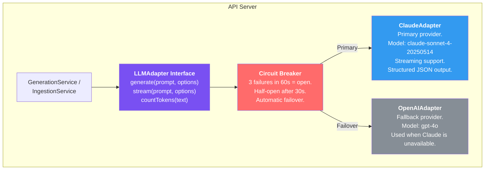
```mermaid
graph TD
    subgraph "API Server"
        SVC["GenerationService /<br/>IngestionService"]
        ADAPTER["<b>LLMAdapter Interface</b><br/>generate(prompt, options)<br/>stream(prompt, options)<br/>countTokens(text)"]
        CLAUDE["<b>ClaudeAdapter</b><br/>Primary provider.<br/>Model: claude-sonnet-4-20250514<br/>Streaming support.<br/>Structured JSON output."]
        OPENAI["<b>OpenAIAdapter</b><br/>Fallback provider.<br/>Model: gpt-4o<br/>Used when Claude is unavailable."]
        CB["<b>Circuit Breaker</b><br/>3 failures in 60s = open.<br/>Half-open after 30s.<br/>Automatic failover."]
    end

    SVC --> ADAPTER
    ADAPTER --> CB
    CB -->|Primary| CLAUDE
    CB -->|Failover| OPENAI

    style ADAPTER fill:#7950f2,color:#fff
    style CLAUDE fill:#339af0,color:#fff
    style OPENAI fill:#868e96,color:#fff
    style CB fill:#ff6b6b,color:#fff
```

**Prompt Engineering Strategy**:

| Prompt Type | Purpose | Token Budget |
|-------------|---------|-------------|
| **System prompt** | Framework rules, output schema, element type definitions | ~2,000 tokens |
| **Generation prompt** | NL description + framework + output format instructions | ~1,500 tokens input, ~4,000 tokens output |
| **Refinement prompt** | Existing artifact context + delta change request | ~3,000 tokens input, ~2,000 tokens output |
| **Extraction prompt** | Document chunk + extraction schema | ~4,500 tokens input, ~2,000 tokens output |
| **Clarification prompt** | NL description + "identify ambiguities" instruction | ~1,000 tokens input, ~500 tokens output |

**Streaming Architecture**: For generation requests, the API streams tokens from Claude using Server-Sent Events to the frontend. The frontend progressively renders elements on the canvas as they arrive, giving immediate visual feedback.

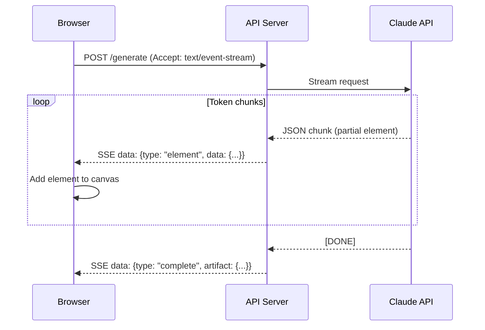
```mermaid
sequenceDiagram
    participant Web as Browser
    participant API as API Server
    participant LLM as Claude API

    Web->>API: POST /generate (Accept: text/event-stream)
    API->>LLM: Stream request
    loop Token chunks
        LLM-->>API: JSON chunk (partial element)
        API-->>Web: SSE data: {type: "element", data: {...}}
        Web->>Web: Add element to canvas
    end
    LLM-->>API: [DONE]
    API-->>Web: SSE data: {type: "complete", artifact: {...}}
```

**Token Management**:
- Per-user token budget tracked in Redis (reset hourly)
- Free tier: 50,000 tokens/hour
- Pro tier: 200,000 tokens/hour
- Team tier: 500,000 tokens/hour per seat
- Token count logged per request for cost tracking

### 4.2 OAuth Integration

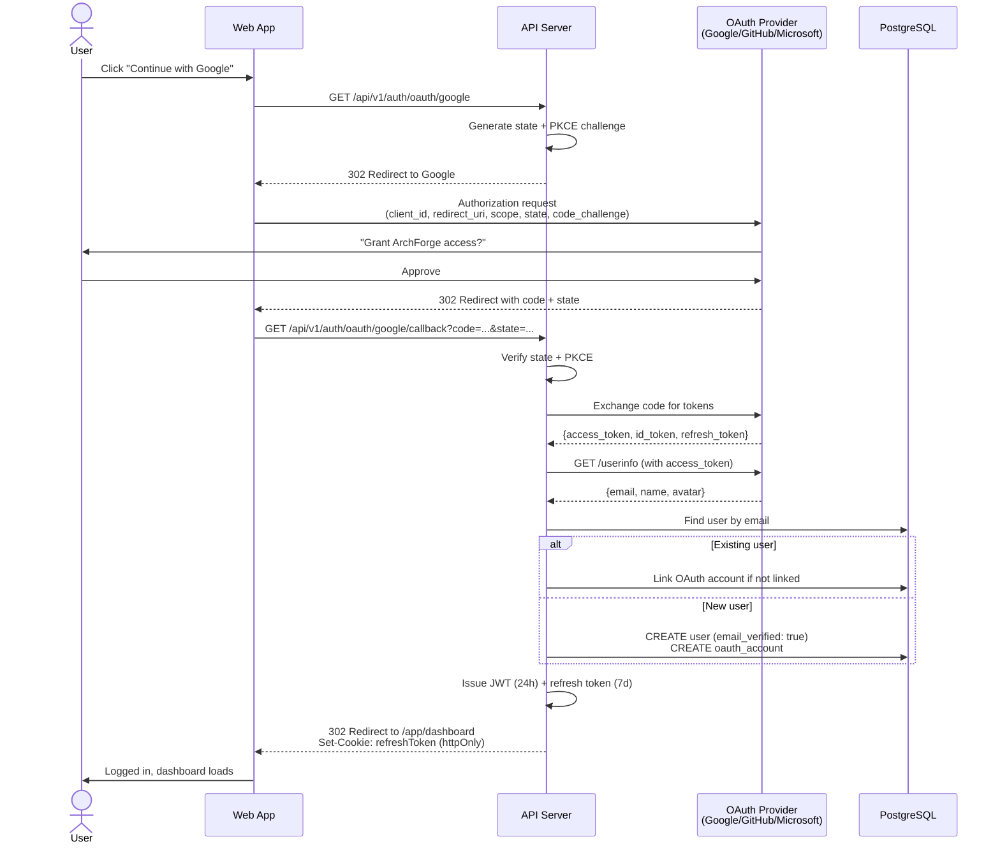
```mermaid
sequenceDiagram
    actor User
    participant Web as Web App
    participant API as API Server
    participant Provider as OAuth Provider<br/>(Google/GitHub/Microsoft)
    participant DB as PostgreSQL

    User->>Web: Click "Continue with Google"
    Web->>API: GET /api/v1/auth/oauth/google
    API->>API: Generate state + PKCE challenge
    API-->>Web: 302 Redirect to Google

    Web->>Provider: Authorization request<br/>(client_id, redirect_uri, scope, state, code_challenge)
    Provider->>User: "Grant ArchForge access?"
    User->>Provider: Approve
    Provider-->>Web: 302 Redirect with code + state

    Web->>API: GET /api/v1/auth/oauth/google/callback?code=...&state=...
    API->>API: Verify state + PKCE
    API->>Provider: Exchange code for tokens
    Provider-->>API: {access_token, id_token, refresh_token}

    API->>Provider: GET /userinfo (with access_token)
    Provider-->>API: {email, name, avatar}

    API->>DB: Find user by email
    alt Existing user
        API->>DB: Link OAuth account if not linked
    else New user
        API->>DB: CREATE user (email_verified: true)<br/>CREATE oauth_account
    end

    API->>API: Issue JWT (24h) + refresh token (7d)
    API-->>Web: 302 Redirect to /app/dashboard<br/>Set-Cookie: refreshToken (httpOnly)
    Web->>User: Logged in, dashboard loads
```

### 4.3 File Storage Strategy

| Environment | Provider | Configuration |
|-------------|----------|---------------|
| Local development | MinIO (Docker) | `localhost:9000`, bucket: `archforge-dev` |
| Staging | AWS S3 | Region: `us-east-1`, bucket: `archforge-staging` |
| Production | AWS S3 | Region: `us-east-1`, bucket: `archforge-prod`, encryption: `AES-256` |

**Storage categories**:

| Category | Path Pattern | TTL | Access |
|----------|-------------|-----|--------|
| Document uploads | `uploads/{userId}/{uploadId}.*` | Deleted after processing | Private (server only) |
| Export files | `exports/{userId}/{exportId}.*` | 24 hours | Presigned URL (user) |
| User avatars | `avatars/{userId}.*` | Permanent | Public read |
| Template previews | `templates/{templateId}/preview.*` | Permanent | Public read |

---

## 5. Security Architecture

### 5.1 Authentication Flow

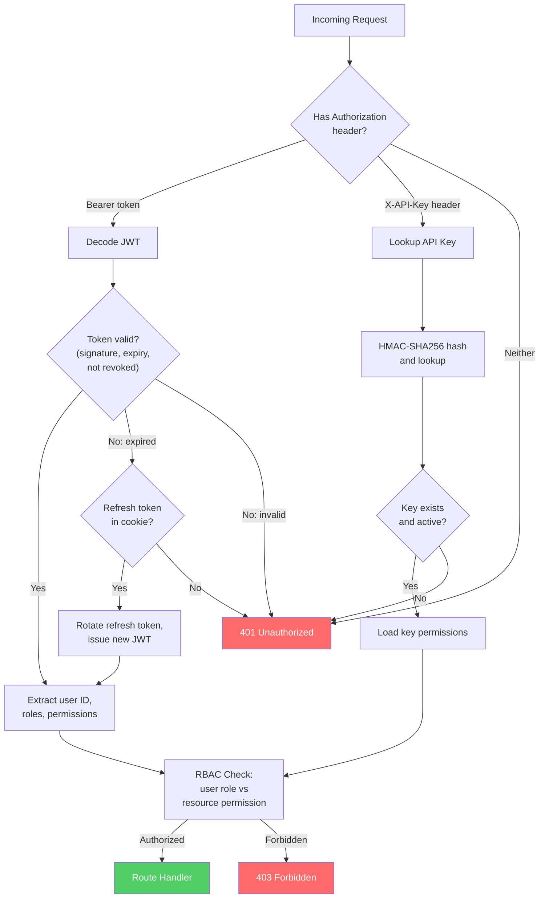
```mermaid
flowchart TD
    REQ["Incoming Request"] --> CHECK{"Has Authorization<br/>header?"}

    CHECK -->|"Bearer token"| JWT["Decode JWT"]
    CHECK -->|"X-API-Key header"| APIKEY["Lookup API Key"]
    CHECK -->|"Neither"| UNAUTH["401 Unauthorized"]

    JWT --> VERIFY{"Token valid?<br/>(signature, expiry,<br/>not revoked)"}
    VERIFY -->|Yes| EXTRACT["Extract user ID,<br/>roles, permissions"]
    VERIFY -->|No: expired| REFRESH{"Refresh token<br/>in cookie?"}
    VERIFY -->|No: invalid| UNAUTH
    REFRESH -->|Yes| ROTATE["Rotate refresh token,<br/>issue new JWT"]
    REFRESH -->|No| UNAUTH
    ROTATE --> EXTRACT

    APIKEY --> HASH["HMAC-SHA256 hash<br/>and lookup"]
    HASH --> FOUND{"Key exists<br/>and active?"}
    FOUND -->|Yes| PERMS["Load key permissions"]
    FOUND -->|No| UNAUTH

    EXTRACT --> RBAC["RBAC Check:<br/>user role vs<br/>resource permission"]
    PERMS --> RBAC

    RBAC -->|Authorized| HANDLER["Route Handler"]
    RBAC -->|Forbidden| FORBIDDEN["403 Forbidden"]

    style UNAUTH fill:#ff6b6b,color:#fff
    style FORBIDDEN fill:#ff6b6b,color:#fff
    style HANDLER fill:#51cf66,color:#fff
```

### 5.2 Authorization Model (RBAC)

ArchForge uses a two-level RBAC model: workspace roles and artifact-level sharing permissions.

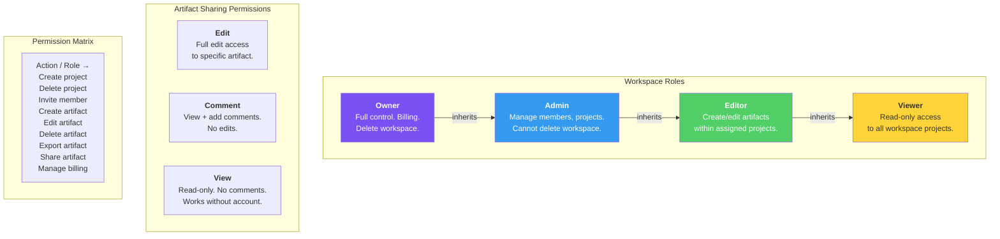
```mermaid
graph TD
    subgraph "Workspace Roles"
        WO["<b>Owner</b><br/>Full control. Billing.<br/>Delete workspace."]
        WA["<b>Admin</b><br/>Manage members, projects.<br/>Cannot delete workspace."]
        WE["<b>Editor</b><br/>Create/edit artifacts<br/>within assigned projects."]
        WV["<b>Viewer</b><br/>Read-only access<br/>to all workspace projects."]
    end

    subgraph "Artifact Sharing Permissions"
        SE["<b>Edit</b><br/>Full edit access<br/>to specific artifact."]
        SC["<b>Comment</b><br/>View + add comments.<br/>No edits."]
        SV["<b>View</b><br/>Read-only. No comments.<br/>Works without account."]
    end

    WO -->|inherits| WA -->|inherits| WE -->|inherits| WV

    subgraph "Permission Matrix"
        direction LR
        M["Action / Role →<br/>Create project<br/>Delete project<br/>Invite member<br/>Create artifact<br/>Edit artifact<br/>Delete artifact<br/>Export artifact<br/>Share artifact<br/>Manage billing"]
    end

    style WO fill:#7950f2,color:#fff
    style WA fill:#339af0,color:#fff
    style WE fill:#51cf66,color:#fff
    style WV fill:#ffd43b,color:#333
```

**Permission Matrix**:

| Action | Owner | Admin | Editor | Viewer | Share:Edit | Share:Comment | Share:View |
|--------|-------|-------|--------|--------|------------|---------------|------------|
| Create project | Y | Y | N | N | -- | -- | -- |
| Delete project | Y | Y | N | N | -- | -- | -- |
| Invite member | Y | Y | N | N | -- | -- | -- |
| Create artifact | Y | Y | Y | N | -- | -- | -- |
| Edit artifact | Y | Y | Y | N | Y | N | N |
| Delete artifact | Y | Y | own | N | N | N | N |
| Export artifact | Y | Y | Y | Y | Y | N | N |
| View artifact | Y | Y | Y | Y | Y | Y | Y |
| Add comment | Y | Y | Y | N | Y | Y | N |
| Share artifact | Y | Y | own | N | N | N | N |
| Manage billing | Y | N | N | N | -- | -- | -- |

### 5.3 Data Protection

| Layer | Mechanism | Detail |
|-------|-----------|--------|
| **In transit** | TLS 1.3 | All HTTP and WebSocket connections. HSTS header. |
| **At rest (DB)** | PostgreSQL TDE | Transparent Data Encryption for the database volume. |
| **At rest (S3)** | AES-256-GCM | Server-side encryption for all stored objects. |
| **Passwords** | bcrypt (cost 12) | Via `@connectsw/shared/utils/crypto`. |
| **API keys** | HMAC-SHA256 | Only the hash is stored. Raw key shown once at creation. |
| **JWT** | RS256 (asymmetric) | 2048-bit RSA key pair. Access token: 24h. Refresh: 7d. |
| **OAuth tokens** | AES-256-GCM | Provider tokens encrypted before DB storage. |
| **Document uploads** | Ephemeral | Raw files deleted after extraction. Only structured data retained. |

### 5.4 Rate Limiting Strategy

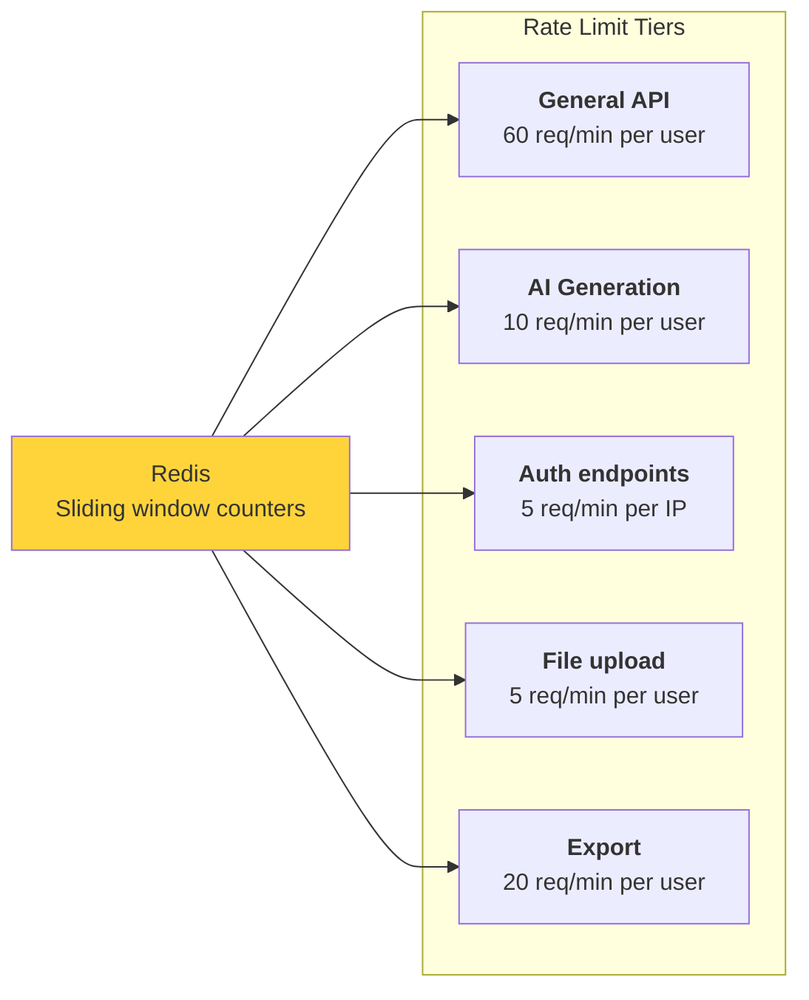
```mermaid
graph LR
    subgraph "Rate Limit Tiers"
        T1["<b>General API</b><br/>60 req/min per user"]
        T2["<b>AI Generation</b><br/>10 req/min per user"]
        T3["<b>Auth endpoints</b><br/>5 req/min per IP"]
        T4["<b>File upload</b><br/>5 req/min per user"]
        T5["<b>Export</b><br/>20 req/min per user"]
    end

    REDIS["Redis<br/>Sliding window counters"] --> T1 & T2 & T3 & T4 & T5

    style REDIS fill:#ffd43b,color:#333
```

### 5.5 Input Sanitization

| Input | Sanitization |
|-------|-------------|
| NL descriptions | Strip HTML tags, limit 10,000 chars, detect prompt injection patterns |
| File uploads | Virus scan (ClamAV in production), MIME type verification, size limit |
| Comment text | Markdown-only (no HTML), XSS sanitization via DOMPurify |
| Project/artifact names | Alphanumeric + spaces + hyphens, max 255 chars |
| Search queries | Parameterized SQL via Prisma, no raw queries |

---

## 6. Performance Architecture

### 6.1 AI Generation Caching

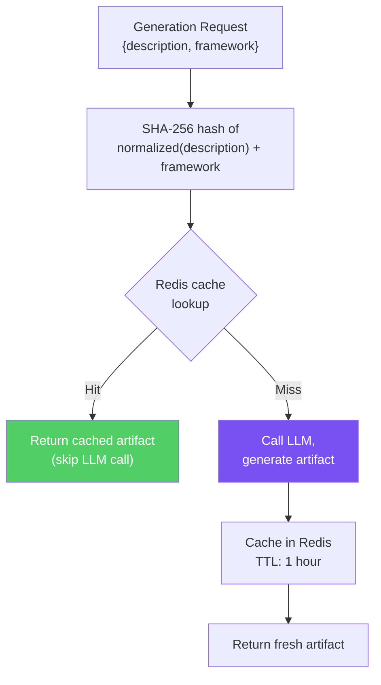
```mermaid
graph TD
    REQ["Generation Request<br/>{description, framework}"] --> HASH["SHA-256 hash of<br/>normalized(description) + framework"]
    HASH --> CHECK{"Redis cache<br/>lookup"}
    CHECK -->|Hit| RETURN["Return cached artifact<br/>(skip LLM call)"]
    CHECK -->|Miss| GENERATE["Call LLM,<br/>generate artifact"]
    GENERATE --> STORE["Cache in Redis<br/>TTL: 1 hour"]
    STORE --> RETURN2["Return fresh artifact"]

    style RETURN fill:#51cf66,color:#fff
    style GENERATE fill:#7950f2,color:#fff
```

**Cache invalidation**: Cache entries are keyed by `gen:{hash}`. TTL is 1 hour. No manual invalidation needed since identical descriptions produce identical results. Refinements always bypass cache (they reference a specific artifact state).

**Expected cache hit rate**: ~15-25% based on template usage patterns and users exploring similar architectures.

### 6.2 Canvas Rendering Optimization

| Technique | Implementation |
|-----------|---------------|
| **Virtualization** | React Flow's built-in viewport culling renders only visible nodes |
| **Lazy detail loading** | Nodes at low zoom show only labels; full properties load on zoom-in |
| **Batch DOM updates** | React Flow batches node position updates during drag operations |
| **Web Workers** | Layout calculations (force-directed, dagre) run in a Web Worker to keep UI thread free |
| **Memoization** | Custom node components wrapped in `React.memo()` with shallow comparison |
| **60fps budget** | Performance monitoring: if frame time exceeds 16ms, reduce visual detail level |

**Benchmark targets**:

| Scenario | Target | Measurement |
|----------|--------|-------------|
| 50 elements, initial render | < 500ms | Time from data load to interactive |
| 100 elements, initial render | < 1,000ms | Time from data load to interactive |
| 200 elements, initial render | < 2,000ms | Time from data load to interactive |
| Drag single element (100 elements on canvas) | 60fps | requestAnimationFrame timing |
| Zoom/pan (200 elements) | 60fps | requestAnimationFrame timing |

### 6.3 Database Query Optimization

**Indexes** (defined in `db-schema.sql`):

| Table | Index | Purpose |
|-------|-------|---------|
| `users` | `email` (unique) | Login lookup |
| `projects` | `workspace_id, status` | Dashboard listing |
| `projects` | `name` (GIN trigram) | Full-text search |
| `artifacts` | `project_id, status` | Project artifact listing |
| `artifact_versions` | `artifact_id, version_number` | Version history |
| `comments` | `artifact_id, status` | Comment panel loading |
| `templates` | `category, subcategory, is_public` | Template gallery filtering |
| `audit_log` | `user_id, created_at` | Audit trail queries |
| `audit_log` | `resource_type, resource_id` | Resource history |

**Pagination**: All list endpoints use cursor-based pagination (keyset pagination on `id` + `created_at`) for consistent performance regardless of offset depth. Default page size: 20, max: 100.

### 6.4 File Upload Handling

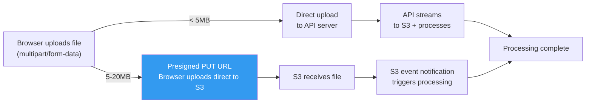
```mermaid
flowchart LR
    UPLOAD["Browser uploads file<br/>(multipart/form-data)"] -->|"< 5MB"| DIRECT["Direct upload<br/>to API server"]
    UPLOAD -->|"5-20MB"| PRESIGNED["Presigned PUT URL<br/>Browser uploads direct to S3"]

    DIRECT --> PROCESS["API streams<br/>to S3 + processes"]
    PRESIGNED --> S3["S3 receives file"]
    S3 --> NOTIFY["S3 event notification<br/>triggers processing"]

    PROCESS --> DONE["Processing complete"]
    NOTIFY --> DONE

    style PRESIGNED fill:#339af0,color:#fff
```

For files over 5MB, the API issues a presigned S3 URL so the browser uploads directly to object storage, avoiding API server memory pressure.

---

## 7. Technology Decisions Summary

| Decision | Choice | Rationale | ADR |
|----------|--------|-----------|-----|
| **Canvas library** | React Flow | MIT license, React-native, custom nodes, active community (26K+ GitHub stars), built-in virtualization. See ADR-002. | ADR-002 |
| **AI integration** | Streaming with circuit-breaker failover | Immediate visual feedback via SSE; automatic failover to secondary provider. See ADR-001. | ADR-001 |
| **Real-time collaboration** | WebSocket + Redis Pub/Sub | Low latency for comments/presence; no CRDT complexity in MVP. See ADR-003. | ADR-003 |
| **Export rendering** | Server-side (Sharp + PDFKit + custom serializers) | Deterministic output, no browser dependency, format consistency. See ADR-004. | ADR-004 |
| **Backend framework** | Fastify 4 | Company standard, plugin architecture, high performance (65K req/s) |  |
| **ORM** | Prisma 5 | Company standard, type-safe queries, migration management |  |
| **Database** | PostgreSQL 15 | Company standard, JSONB for flexible canvas data, GIN indexes for search |  |
| **Frontend framework** | Next.js 14 (App Router) | Company standard, SSR for SEO/landing pages, RSC for dashboard |  |
| **Auth** | `@connectsw/auth` package | Reuse existing JWT + API key dual auth. No rebuilding. |  |
| **UI components** | `@connectsw/ui` package | Reuse existing Button, Card, Input, DashboardLayout |  |
| **Object storage** | S3 (prod) / MinIO (dev) | Industry standard, presigned URLs, lifecycle policies |  |
| **Cache / Pub/Sub** | Redis 7 | Rate limiting, session cache, generation cache, WebSocket broadcast |  |
| **Email** | SendGrid | Transactional email API, template support, deliverability |  |
| **Document parsing** | pdf-parse + mammoth | MIT-licensed, lightweight, handles PDF and DOCX |  |

---

## 8. Deployment Architecture

### 8.1 Local Development

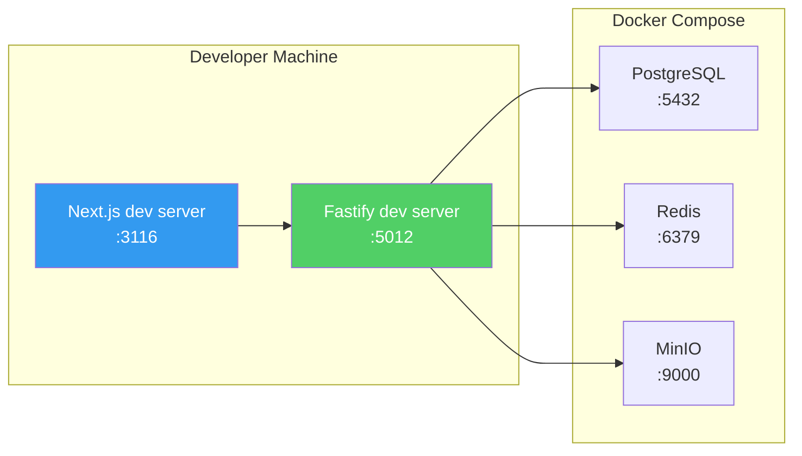
```mermaid
graph LR
    subgraph "Developer Machine"
        WEB["Next.js dev server<br/>:3116"]
        API["Fastify dev server<br/>:5012"]
    end

    subgraph "Docker Compose"
        PG["PostgreSQL<br/>:5432"]
        RD["Redis<br/>:6379"]
        MIO["MinIO<br/>:9000"]
    end

    WEB --> API
    API --> PG & RD & MIO

    style WEB fill:#339af0,color:#fff
    style API fill:#51cf66,color:#fff
```

### 8.2 Production (Target)

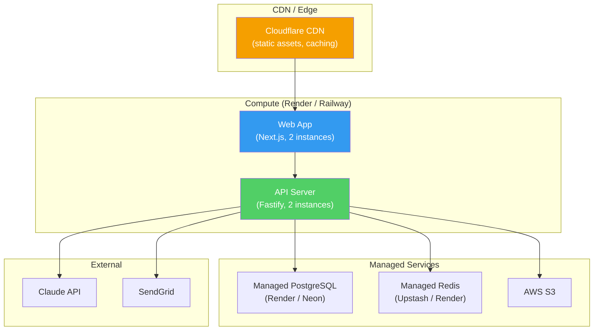
```mermaid
graph TD
    subgraph "CDN / Edge"
        CF["Cloudflare CDN<br/>(static assets, caching)"]
    end

    subgraph "Compute (Render / Railway)"
        WEB["Web App<br/>(Next.js, 2 instances)"]
        API["API Server<br/>(Fastify, 2 instances)"]
    end

    subgraph "Managed Services"
        PG["Managed PostgreSQL<br/>(Render / Neon)"]
        RD["Managed Redis<br/>(Upstash / Render)"]
        S3["AWS S3"]
    end

    subgraph "External"
        CLAUDE["Claude API"]
        SG["SendGrid"]
    end

    CF --> WEB
    WEB --> API
    API --> PG & RD & S3
    API --> CLAUDE & SG

    style CF fill:#f59f00,color:#fff
    style WEB fill:#339af0,color:#fff
    style API fill:#51cf66,color:#fff
```

---

## 9. Referenced ADRs

| ADR | Title | Decision |
|-----|-------|----------|
| [ADR-001](./ADRs/ADR-001-ai-service-architecture.md) | AI Service Architecture | Streaming with circuit-breaker failover to secondary LLM provider |
| [ADR-002](./ADRs/ADR-002-canvas-technology.md) | Canvas Technology Selection | React Flow (MIT, React-native, custom nodes, virtualization) |
| [ADR-003](./ADRs/ADR-003-realtime-collaboration.md) | Real-Time Collaboration Architecture | WebSocket + Redis Pub/Sub for comments/presence; no CRDTs in MVP |
| [ADR-004](./ADRs/ADR-004-export-pipeline.md) | Export Pipeline Architecture | Server-side rendering with format-specific serializers |
