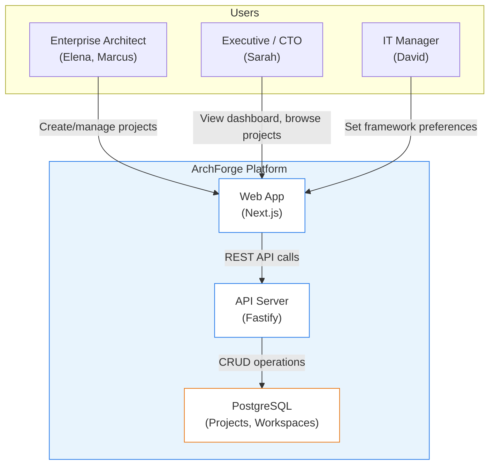
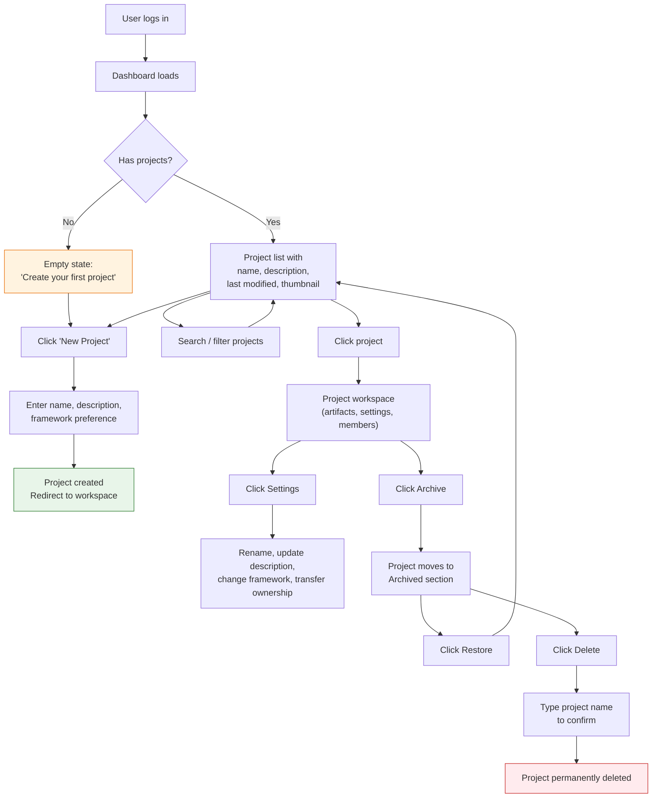
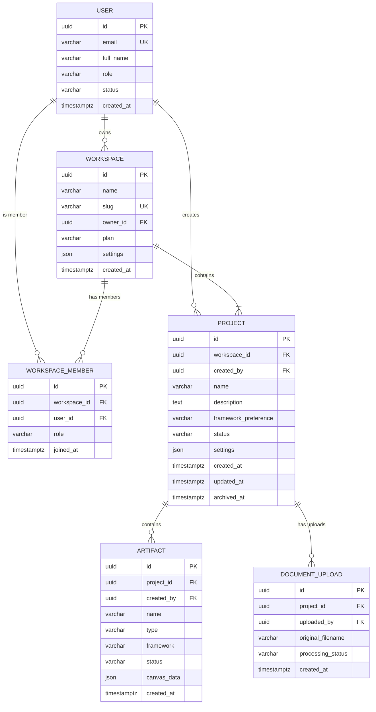
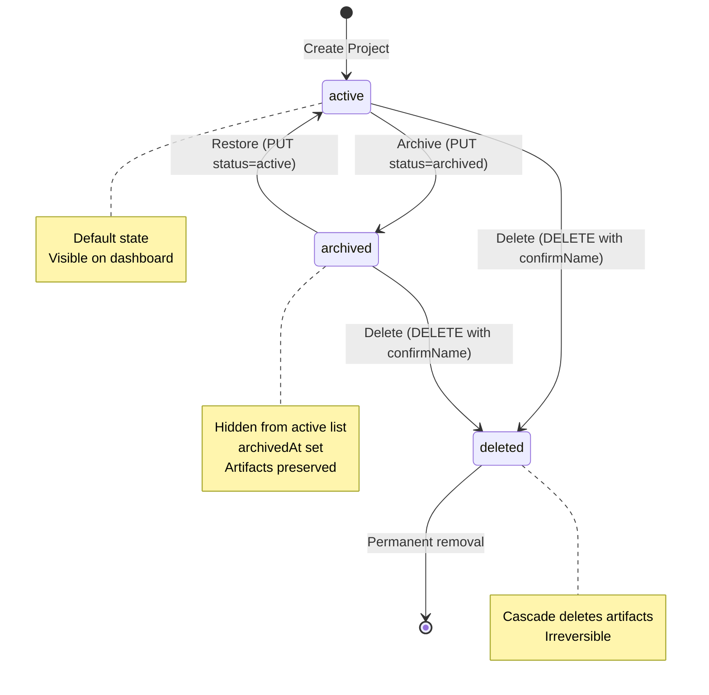
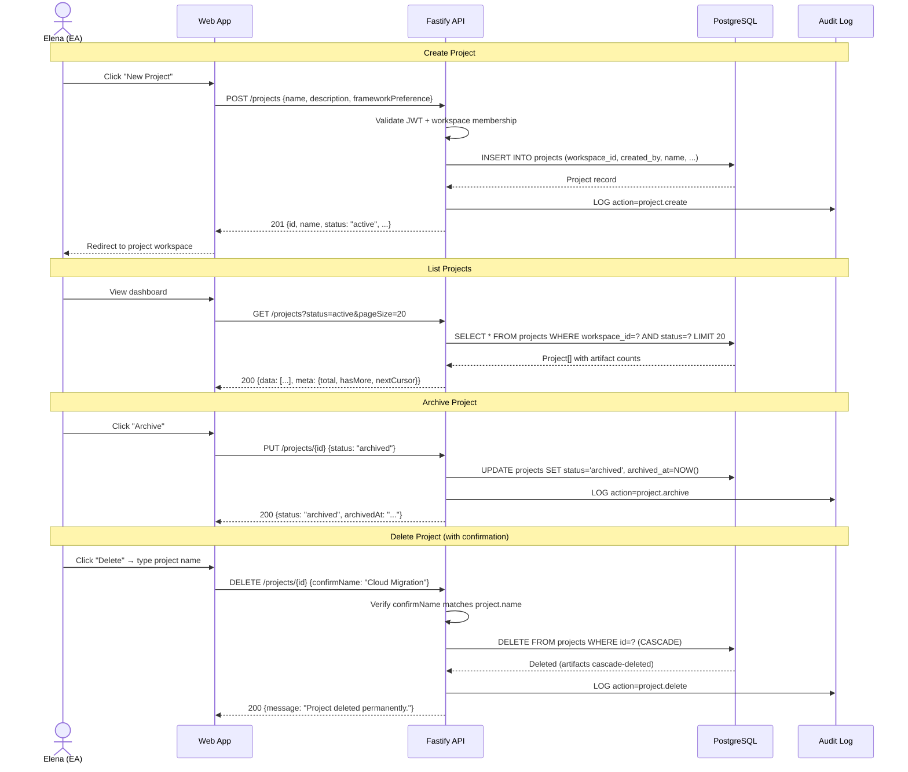

# Feature Specification: Project and Workspace Management

**Product**: ArchForge
**Feature Branch**: `feature/archforge/project-management`
**Created**: 2026-02-24
**Status**: Draft
**Traces to**: PRD US-05 (AC-05.1 through AC-05.7)

## Business Context

### Problem Statement

Enterprise architects managing multiple architecture initiatives (cloud migrations, digital transformations, compliance overhauls) need a way to organize their work into discrete projects within a shared workspace. Without project management, all artifacts exist in a flat list — making it impossible for teams to group related work, control access per initiative, or archive completed projects. This directly blocks the dashboard (US-02) and collaboration (US-08) features which depend on project context.

### Target Users

| Persona | Role | Pain Point | Expected Outcome |
|---------|------|-----------|-----------------|
| Elena (Enterprise Architect) | Lead EA managing 5+ active initiatives | Cannot group artifacts by initiative; flat list grows unwieldy | Projects organize work by initiative; archive hides completed work |
| Sarah (CTO) | Executive sponsor reviewing EA output | Cannot quickly find the right initiative's diagrams | Dashboard shows projects with thumbnails and last-modified dates |
| Marcus (Solution Architect) | Individual contributor on a single initiative | Wastes time scrolling through artifacts from other teams | Project scoping limits visibility to relevant artifacts only |
| David (IT Manager) | Department lead overseeing framework compliance | Cannot enforce framework standards per initiative | Per-project framework preference (ArchiMate, C4, TOGAF, Auto-detect) |

### Business Value

- **Revenue Impact**: Project organization is table-stakes for enterprise sales — no EA tool sells without it. Directly unblocks paid workspace tiers.
- **User Retention**: Architects with 10+ artifacts churn without project grouping (industry pattern from Lucidchart/Miro). Archive/restore prevents permanent deletion anxiety.
- **Competitive Position**: Matches capabilities of LeanIX, Ardoq, and Enterprise Architect while adding AI-powered framework preference that competitors lack.
- **Strategic Alignment**: US-05 is a P1 MVP dependency — US-02 (Dashboard), US-03 (AI Generation), US-06 (Version History), and US-08 (Collaboration) all require project context.

## System Context (C4 Level 1)

## User Journey

## User Scenarios & Testing

### User Story 1 — Create a New Project (Priority: P1)

**As** Elena (Enterprise Architect), **I want to** create a new project with a name, description, and framework preference, **so that** I can organize a new architecture initiative in my workspace.

Elena clicks "New Project" on the dashboard, fills in the project name ("Cloud Migration 2026"), an optional description, and selects "C4" as the framework preference. Within 2 seconds, the project is created and she's redirected to the empty project workspace.

**Why this priority**: Foundation for all other project operations. Nothing works without project creation.

**Independent Test**: Can be fully tested by creating a project via POST /projects and verifying the response contains all fields with correct defaults.

**Acceptance Criteria**:

1. **Given** I am logged in and on the dashboard, **When** I click "New Project" and submit a valid name + framework preference, **Then** a project is created with status "active" and I am redirected to the project workspace within 2 seconds
2. **Given** I am creating a project, **When** I leave the description blank, **Then** the project is created with description=null (description is optional)
3. **Given** I am creating a project, **When** I select framework preference "auto", **Then** the project's frameworkPreference is stored as "auto" (default)
4. **Given** I am creating a project, **When** I submit a name longer than 255 characters, **Then** I receive a 400 validation error
5. **Given** I am not authenticated, **When** I attempt POST /projects, **Then** I receive 401 Unauthorized

---

### User Story 2 — List Projects on Dashboard (Priority: P1)

**As** Elena (Enterprise Architect), **I want to** see all my projects listed with name, description, last-modified date, artifact count, and a thumbnail, **so that** I can quickly find and navigate to the right initiative.

Elena opens the dashboard and sees her 3 active projects listed in a card grid. Each card shows the project name, description excerpt, last modified timestamp, artifact count, and a small thumbnail of the most recently edited diagram.

**Why this priority**: Dashboard is the primary navigation surface — users land here after login.

**Independent Test**: Can be fully tested by seeding 3 projects and verifying GET /projects returns all with correct fields and pagination metadata.

**Acceptance Criteria**:

1. **Given** I have 3 active projects, **When** I view the dashboard, **Then** all 3 projects are listed with name, description, updatedAt, artifactCount, and thumbnailUrl
2. **Given** I have 25 projects, **When** I load the dashboard with default pageSize=20, **Then** 20 projects are returned with hasMore=true and a nextCursor
3. **Given** I have active and archived projects, **When** I view the dashboard without filter, **Then** only active projects are shown (default status=active)
4. **Given** I have no projects, **When** I view the dashboard, **Then** an empty state is shown with a call-to-action to create a project

---

### User Story 3 — Update Project Settings (Priority: P1)

**As** Elena (Enterprise Architect), **I want to** rename my project, update the description, and change the framework preference, **so that** I can keep project metadata current as initiatives evolve.

Elena opens a project's Settings panel, changes the name from "Cloud Migration" to "Cloud Migration 2026 Phase II", updates the description, and switches the framework from "C4" to "ArchiMate".

**Why this priority**: Projects evolve — names and frameworks change as initiatives mature.

**Independent Test**: Can be tested by PUT /projects/{id} with partial updates and verifying only specified fields change.

**Acceptance Criteria**:

1. **Given** I am viewing a project I own, **When** I update the name via Settings, **Then** the project name is updated and updatedAt is refreshed
2. **Given** I am updating a project, **When** I send only `{ "description": "new desc" }`, **Then** only the description changes; name and frameworkPreference are unchanged (partial update)
3. **Given** I am not the project owner or admin, **When** I attempt to update, **Then** I receive 403 Forbidden
4. **Given** I update the frameworkPreference to "archimate", **When** I view the project, **Then** the frameworkPreference reflects "archimate"

---

### User Story 4 — Archive and Restore Projects (Priority: P1)

**As** Elena (Enterprise Architect), **I want to** archive completed projects and restore them later if needed, **so that** my active project list stays clean without permanently losing completed work.

Elena archives "Q4 Security Review" once it's complete. It disappears from her active list but appears under "Archived". Six months later, the review is reopened — she clicks "Restore" and it's back in the active list with all artifacts intact.

**Why this priority**: Enterprise architects accumulate 10-20 projects/year. Without archive, the list becomes unmanageable.

**Independent Test**: Can be tested by archiving via PUT /projects/{id} with `{ "status": "archived" }`, verifying it no longer appears in active list, then restoring with `{ "status": "active" }`.

**Acceptance Criteria**:

1. **Given** I have an active project, **When** I archive it (status → "archived"), **Then** archivedAt is set to current timestamp and the project no longer appears in the default (active) project list
2. **Given** I filter by status=archived, **When** I view the project list, **Then** only archived projects are shown
3. **Given** I have an archived project, **When** I restore it (status → "active"), **Then** archivedAt is set to null and the project reappears in the active list
4. **Given** an archived project has 10 artifacts, **When** I restore it, **Then** all 10 artifacts are still present and accessible

---

### User Story 5 — Delete Project with Confirmation (Priority: P2)

**As** Elena (Enterprise Architect), **I want to** permanently delete a project only after typing the project name to confirm, **so that** accidental deletion of entire architecture initiatives is prevented.

Elena decides to permanently delete an old test project. She clicks "Delete", sees a dialog saying "Type 'Test Project' to confirm permanent deletion", types the name, and clicks "Confirm Delete". The project and all its artifacts are permanently removed.

**Why this priority**: Destructive action — safety mechanism is critical but less frequently used than CRUD.

**Independent Test**: Can be tested by DELETE /projects/{id} with confirmName matching/not matching the project name.

**Acceptance Criteria**:

1. **Given** I want to delete a project named "Test Project", **When** I call DELETE with `{ "confirmName": "Test Project" }`, **Then** the project and all its artifacts are permanently deleted
2. **Given** I want to delete a project named "Test Project", **When** I call DELETE with `{ "confirmName": "Wrong Name" }`, **Then** I receive 400 with error "Project name confirmation does not match"
3. **Given** I am not the project owner, **When** I attempt to delete, **Then** I receive 403 Forbidden
4. **Given** I delete a project, **When** I attempt to access it afterwards, **Then** I receive 404 Not Found

---

### User Story 6 — Search and Filter Projects (Priority: P2)

**As** Elena (Enterprise Architect), **I want to** search projects by name with real-time filtering, **so that** I can quickly find a specific initiative in a large workspace.

Elena has 15 projects and types "cloud" in the search bar. Within 300ms, the list filters to show only projects with "cloud" in the name.

**Why this priority**: Usability at scale — becomes critical once users have 10+ projects.

**Independent Test**: Can be tested by GET /projects?search=cloud and verifying results match within 300ms.

**Acceptance Criteria**:

1. **Given** I have projects "Cloud Migration", "Cloud Security", "Data Platform", **When** I search for "cloud", **Then** only "Cloud Migration" and "Cloud Security" are returned
2. **Given** I search for "cloud", **When** the response arrives, **Then** it arrives within 300ms (NFR)
3. **Given** I search with an empty string, **When** I view results, **Then** all projects are returned (no filter applied)
4. **Given** I search for "nonexistent", **When** I view results, **Then** an empty array is returned with total=0

---

### User Story 7 — Project Members (Priority: P2)

**As** Elena (Enterprise Architect), **I want to** view and invite team members to a project with specific roles, **so that** I can control who has access to each architecture initiative.

Elena opens the project members panel, sees herself as "owner", and invites Marcus as "editor" by entering his email. Marcus receives access and can now create and edit artifacts in the project.

**Why this priority**: Multi-user collaboration requires access control per project. Deferred to P2 because single-user MVP works without it.

**Independent Test**: Can be tested by POST /projects/{id}/members and GET /projects/{id}/members.

**Acceptance Criteria**:

1. **Given** I am the project owner, **When** I invite a user by email with role "editor", **Then** a ProjectMember record is created with the correct role
2. **Given** a user is already a member, **When** I invite them again, **Then** I receive 409 Conflict
3. **Given** I am not the project owner/admin, **When** I attempt to invite, **Then** I receive 403 Forbidden
4. **Given** a project has 3 members, **When** I list members, **Then** all 3 are returned with user details and roles

---

### Edge Cases (minimum 5)

| # | Scenario | Expected Behavior | Priority |
|---|----------|------------------|----------|
| 1 | Create project with name containing only whitespace | 400 validation error — name must have at least 1 non-whitespace character | P1 |
| 2 | Create project with duplicate name in same workspace | Allowed — project names are not unique (differentiated by UUID) | P1 |
| 3 | Archive a project that is already archived | Idempotent — returns 200 with same archivedAt timestamp | P2 |
| 4 | Delete an archived project (not active) | Allowed — user can delete from either active or archived state | P2 |
| 5 | Concurrent archive + update on same project | Last-write-wins via updatedAt; both operations succeed independently | P3 |
| 6 | Search with SQL injection attempt (`'; DROP TABLE projects; --`) | Input is parameterized via Prisma — no injection possible; returns empty results | P1 |
| 7 | Create project when workspace has reached plan limit | 403 with error message indicating plan upgrade needed (future — free tier: 3 projects) | P3 |
| 8 | Access project from a different workspace | 404 — workspace scoping ensures cross-workspace isolation | P1 |

## Requirements

### Functional Requirements

- **FR-001**: System MUST allow authenticated users to create a project with name (required), description (optional), and frameworkPreference (default: "auto"). *Traces to: US-1, AC 1-3*
- **FR-002**: System MUST return paginated project lists with cursor-based pagination (default pageSize=20, max 100). *Traces to: US-2, AC 1-2*
- **FR-003**: System MUST support partial updates to project name, description, and frameworkPreference. *Traces to: US-3, AC 1-2*
- **FR-004**: System MUST support project archiving (status → "archived", sets archivedAt) and restoring (status → "active", clears archivedAt). *Traces to: US-4, AC 1-3*
- **FR-005**: System MUST require confirmName matching the exact project name for deletion. *Traces to: US-5, AC 1-2*
- **FR-006**: System MUST support full-text search on project name via `search` query parameter. *Traces to: US-6, AC 1-4*
- **FR-007**: System MUST support project membership with roles: owner, admin, editor, viewer. *Traces to: US-7, AC 1-4*
- **FR-008**: System MUST enforce authorization — only owner/admin can update settings, invite members, and delete. *Traces to: US-3 AC 3, US-5 AC 3, US-7 AC 3*
- **FR-009**: System MUST cascade-delete all artifacts when a project is permanently deleted. *Traces to: US-5, AC 1*
- **FR-010**: System MUST return computed fields artifactCount and memberCount in project responses. *Traces to: US-2, AC 1*

### Non-Functional Requirements

- **NFR-001**: Performance — Project list API MUST respond within 300ms for workspaces with up to 100 projects (p95 latency). *Traces to: US-6, AC 2*
- **NFR-002**: Security — All project endpoints MUST require valid JWT authentication. Workspace isolation MUST prevent cross-workspace access.
- **NFR-003**: Accessibility — Dashboard project cards MUST meet WCAG 2.1 AA. Search input MUST have proper ARIA labels.
- **NFR-004**: Scalability — Schema indexes support up to 10,000 projects per workspace without query degradation.
- **NFR-005**: Reliability — Delete operation MUST be transactional — either all artifacts are deleted with the project or none are (atomic).
- **NFR-006**: Auditability — All project CRUD operations MUST be logged to the audit_log table.

### Key Entities

| Entity | Description | Key Attributes | Relationships |
|--------|-------------|---------------|---------------|
| Project | An architecture initiative containing artifacts | id, workspaceId, createdBy, name, description, frameworkPreference, status, settings, archivedAt | belongs to Workspace, has many Artifacts, has many DocumentUploads, created by User |
| Workspace | Organization-level container for projects | id, name, slug, ownerId, plan, settings | owned by User, has many WorkspaceMembers |
| WorkspaceMember | User's membership in a workspace | id, workspaceId, userId, role | belongs to Workspace, belongs to User |
| Artifact | Architecture diagram/document within a project | id, projectId, createdBy, name, type, framework, status | belongs to Project, created by User |
| User | Platform user | id, email, fullName, role, status | owns Workspaces, creates Projects |

### Data Model

## Project Status State Diagram

## API Sequence Diagram — Project CRUD Flow

## Component Reuse Check

| Need | Existing Component | Source | Reuse? |
|------|-------------------|--------|--------|
| JWT authentication middleware | `@connectsw/auth/backend` Auth Plugin | packages/auth | Yes — already in use for auth module |
| Prisma database plugin | `@connectsw/shared/plugins/prisma` | packages/shared | Yes — already registered in app.ts |
| Request validation (Zod) | Auth validation patterns | archforge/auth | Adapt — same Zod schema pattern for project validation |
| Cursor-based pagination | None found | — | Build new — add to registry after |
| Audit logging | AuditLog model exists in schema | archforge | Adapt — create audit utility from existing model |
| RFC 7807 error responses | `AppError` from `@connectsw/auth/backend` | packages/auth | Yes — import and use for project errors |

## Success Criteria

| # | Metric | Target | Measurement Method |
|---|--------|--------|-------------------|
| SC-001 | All project CRUD API tests passing | 100% pass rate | Jest test suite (unit + integration) |
| SC-002 | Project list response time (100 projects) | < 300ms p95 | Integration test with timer assertion |
| SC-003 | Test coverage for project module | >= 80% lines | Jest --coverage on src/modules/projects/ |
| SC-004 | All 7 acceptance criteria from PRD verified | 7/7 pass | Mapped test cases to AC-05.1 through AC-05.7 |
| SC-005 | Delete cascade verified | Artifacts removed with project | Integration test: create project + artifacts, delete project, verify artifacts gone |
| SC-006 | Authorization enforced | Non-owner/admin receives 403 | Integration tests with different user roles |

## Out of Scope

- **Project member role management UI** (edit/remove members) — deferred to US-08 (Collaboration)
- **Ownership transfer** — mentioned in AC-05.3 but deferred to Collaboration feature; API accepts it but frontend deferred
- **Workspace creation/management** — workspace exists from auth/registration; this feature only reads workspace context
- **Project thumbnails** — computed from most recent artifact; will return null until Artifacts feature (US-03/US-04) is implemented
- **Plan-based project limits** — edge case 7 noted but enforcement deferred to billing feature
- **Real-time project list updates** — WebSocket push deferred to Collaboration feature

## Open Questions

| # | Question | Impact if Unresolved | Owner | Status |
|---|----------|---------------------|-------|--------|
| 1 | Should workspace be auto-created at user registration or require explicit creation? | Blocks project creation flow — projects need a workspace_id | Architect | Resolved — auto-create "Personal Workspace" at registration (existing behavior from auth module) |
| 2 | Should archived projects count toward workspace plan limits? | Affects future billing calculations | Product Manager | Open — assume NO for MVP (only active projects count) |
| 3 | Should project names support Unicode (emoji, CJK characters)? | Affects validation and search behavior | Product Manager | Resolved — Yes, VARCHAR(255) supports UTF-8; Prisma handles encoding |
