# ArchForge Product Strategy 2026

**Document Version**: 1.0
**Date**: February 19, 2026
**Author**: Product Strategist, ConnectSW
**Status**: Draft for CEO Review

---

## Table of Contents

1. [Executive Summary](#1-executive-summary)
2. [Market Research](#2-market-research)
3. [Competitive Analysis](#3-competitive-analysis)
4. [Opportunity Assessment](#4-opportunity-assessment)
5. [Product Positioning](#5-product-positioning)
6. [Roadmap Horizons](#6-roadmap-horizons)
7. [SWOT Analysis](#7-swot-analysis)
8. [Strategic Recommendation](#8-strategic-recommendation)
9. [Sources](#9-sources)

---

## 1. Executive Summary

**ArchForge** is a proposed AI-first enterprise architecture platform that generates EA artifacts (diagrams, models, documentation, roadmaps) from natural language descriptions. The platform targets a $1.14B market growing at 6% CAGR, projected to reach $1.6-2.2B by 2030.

### The Opportunity in One Sentence

> Enterprise architects spend 60-80% of their time on manual documentation and diagram creation; ArchForge uses generative AI to reduce that to minutes, shifting architects from artifact production to strategic advisory.

### Key Findings

| Dimension | Assessment |
|-----------|-----------|
| Market Size (2024) | $1.14B (Grand View Research) |
| Market Growth | 6.0% CAGR through 2030 |
| AI Disruption Window | 2025-2027 (incumbents are retrofitting AI; no AI-native leader exists) |
| Competitive Gap | No tool generates complete, standards-compliant EA artifacts from natural language |
| Strategic Fit | High -- aligns with ConnectSW's AI-first DNA and enterprise portfolio |
| Timing | Optimal -- AI capabilities mature, incumbents slow to adapt, enterprises demanding AI |
| Risk Level | Medium -- market is established but sticky; differentiation through AI is defensible |

### Recommendation

**Proceed with ArchForge development.** The market timing is ideal: enterprise architects are overwhelmed with manual work, AI capabilities have matured to the point where standards-compliant artifact generation is feasible, and no incumbent has built an AI-native solution. ArchForge can capture the emerging "AI-first EA" category before incumbents fully adapt.

**Opportunity Score: 8.2/10** (Market Size: 8 x Fit: 9 x Timing: 8 = weighted 8.2)

---

## 2. Market Research

### 2.1 Market Size and Growth

The enterprise architecture tools market is substantial and growing steadily, driven by digital transformation mandates, cloud migration complexity, and regulatory compliance requirements.

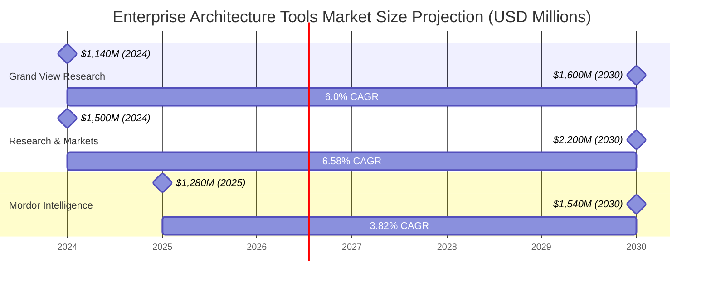
```mermaid
gantt
    title Enterprise Architecture Tools Market Size Projection (USD Millions)
    dateFormat YYYY
    axisFormat %Y

    section Grand View Research
    $1,140M (2024)       :milestone, 2024, 0d
    $1,600M (2030)       :milestone, 2030, 0d
    6.0% CAGR            :2024, 2030

    section Research & Markets
    $1,500M (2024)       :milestone, 2024, 0d
    $2,200M (2030)       :milestone, 2030, 0d
    6.58% CAGR           :2024, 2030

    section Mordor Intelligence
    $1,280M (2025)       :milestone, 2025, 0d
    $1,540M (2030)       :milestone, 2030, 0d
    3.82% CAGR           :2025, 2030
```

| Source | 2024 Value | 2030 Projection | CAGR |
|--------|-----------|----------------|------|
| Grand View Research | $1.14B | $1.60B | 6.0% |
| Research and Markets | $1.50B | $2.20B | 6.58% |
| Mordor Intelligence | $1.28B (2025) | $1.54B | 3.82% |
| GII Research | -- | -- | 3.7% (2024-25), accelerating to 7.6% (2025-29) |
| Coherent Market Insights | -- | $3.0B+ (2032) | ~8% |

**Consensus estimate**: The market is valued at approximately **$1.1-1.5B in 2024** and will reach **$1.6-2.2B by 2030**, representing a **6-7% CAGR**. The broader enterprise architecture services market (including consulting) could exceed $3B by the early 2030s.

### 2.2 Market Segmentation

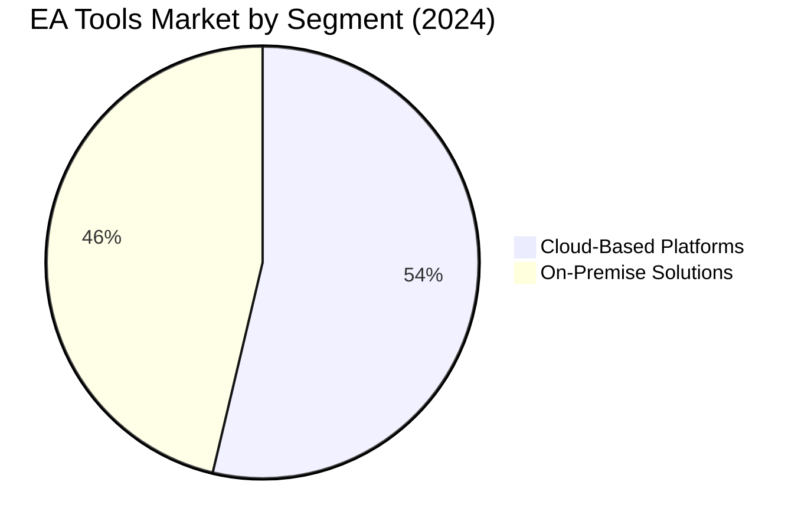
```mermaid
pie title EA Tools Market by Segment (2024)
    "Cloud-Based Platforms" : 53.71
    "On-Premise Solutions" : 46.29
```

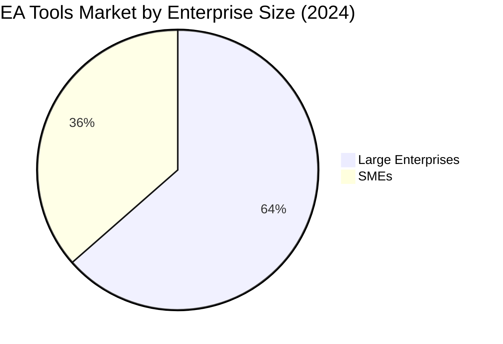
```mermaid
pie title EA Tools Market by Enterprise Size (2024)
    "Large Enterprises" : 63.52
    "SMEs" : 36.48
```

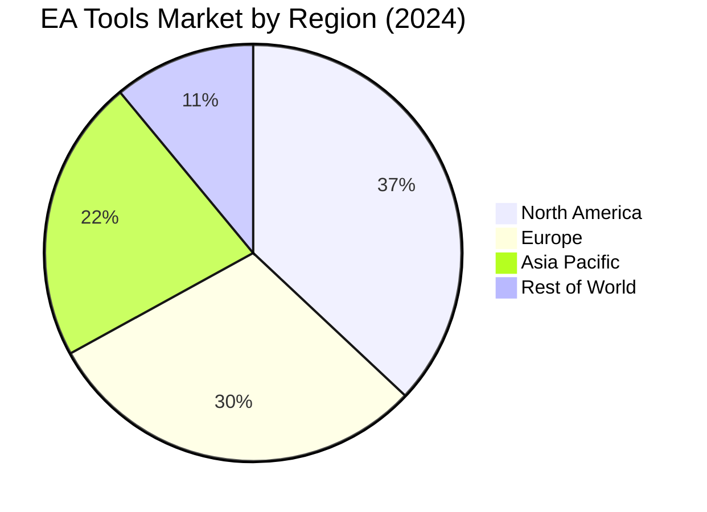
```mermaid
pie title EA Tools Market by Region (2024)
    "North America" : 37
    "Europe" : 30
    "Asia Pacific" : 22
    "Rest of World" : 11
```

| Segment | Share (2024) | Growth Insight |
|---------|-------------|----------------|
| Cloud-based | 53.71% | Dominant and growing; expected 65%+ by 2026 |
| On-premise | 46.29% | Declining but still significant for regulated industries |
| Large enterprises | 63.52% | Primary market today |
| SMEs | 36.48% | Fastest growing at 9.48% CAGR -- underserved |
| North America | 37% | Largest regional market |
| IT & Telecom | 28.69% | Largest vertical; Healthcare fastest growing (7.02% CAGR) |

**Key Insight for ArchForge**: SMEs are the fastest-growing segment (9.48% CAGR) but are underserved by current tools that are priced and designed for large enterprises. An AI-first tool with lower barriers to entry could capture this segment while also competing upmarket.

### 2.3 Market Drivers

1. **Digital Transformation Mandates**: CEOs are spending 5% of revenue on digital initiatives, driving demand for architecture tools that can keep pace with rapid change.

2. **Cloud Migration Complexity**: Multi-cloud and hybrid environments create architectural complexity that demands better tooling.

3. **Regulatory Compliance**: EU AI Act, DORA, CSRD, and other regulations expand the enterprise architect's scope, increasing workload and tool demand.

4. **AI Integration Governance**: Organizations need to inventory, govern, and align AI systems -- a new domain for EA tools.

5. **Technical Debt Management**: Aging IT estates require rationalization; EA tools help identify redundancies and plan modernization.

### 2.4 Customer Pain Points

Research reveals consistent frustrations with current EA tools:

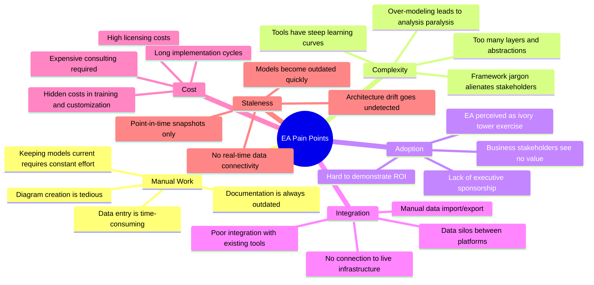
```mermaid
mindmap
  root((EA Pain Points))
    Manual Work
      Diagram creation is tedious
      Documentation is always outdated
      Data entry is time-consuming
      Keeping models current requires constant effort
    Complexity
      Tools have steep learning curves
      Framework jargon alienates stakeholders
      Over-modeling leads to analysis paralysis
      Too many layers and abstractions
    Adoption
      Business stakeholders see no value
      Lack of executive sponsorship
      EA perceived as ivory tower exercise
      Hard to demonstrate ROI
    Integration
      Poor integration with existing tools
      Data silos between platforms
      No connection to live infrastructure
      Manual data import/export
    Cost
      High licensing costs
      Long implementation cycles
      Expensive consulting required
      Hidden costs in training and customization
    Staleness
      Models become outdated quickly
      Point-in-time snapshots only
      No real-time data connectivity
      Architecture drift goes undetected
```

**The Top 5 Pain Points** (ranked by frequency of mention in user reviews and analyst reports):

| Rank | Pain Point | Impact | ArchForge Opportunity |
|------|-----------|--------|----------------------|
| 1 | **Manual artifact creation** | Architects spend 60-80% of time documenting rather than designing | AI generates artifacts from natural language in minutes |
| 2 | **Stale documentation** | Models are outdated within weeks of creation | Living architecture that auto-updates from infrastructure |
| 3 | **Steep learning curves** | 3-6 month adoption cycles; high abandonment rates | Natural language interface eliminates framework expertise barrier |
| 4 | **Poor stakeholder engagement** | Non-technical users cannot interpret EA artifacts | AI generates role-appropriate views and summaries |
| 5 | **High total cost of ownership** | $50K-500K+ annually for enterprise licenses | AI-first approach reduces cost by eliminating manual labor |

### 2.5 AI in Enterprise Architecture Today

The use of AI in enterprise architecture is rapidly evolving but remains nascent. Current AI capabilities across the market:

| AI Capability | Maturity | Who Has It |
|--------------|----------|-----------|
| AI-assisted data import/inventory | Early production | LeanIX (AI Inventory Builder), Ardoq (Visual Importer) |
| Relationship/pattern recommendations | Early production | BiZZdesign (Relation Recommender), BOC (MCP) |
| Natural language chat/query | Beta/Early | Ardoq (AI Chat Assistant), BOC (ADOIT 18.0) |
| Diagram generation from NL | Emerging | Visual Paradigm (AI Generator) -- not an EA-specialized tool |
| Full artifact generation from NL | **Gap -- nobody does this well** | No incumbent offers end-to-end generation |
| Auto-compliance checking | Emerging | MEGA HOPEX (smart recommendations) |
| Impact analysis automation | Production | Most leaders have basic versions |
| Living architecture / auto-update | Experimental | ServiceNow ITOM (discovery-based, not EA-native) |

**Critical Insight**: While incumbents are adding AI features incrementally (chatbots, recommendation engines, data importers), **no tool generates complete, standards-compliant EA artifacts from natural language descriptions**. This is the gap ArchForge is designed to fill.

---

## 3. Competitive Analysis

### 3.1 Competitive Landscape Map

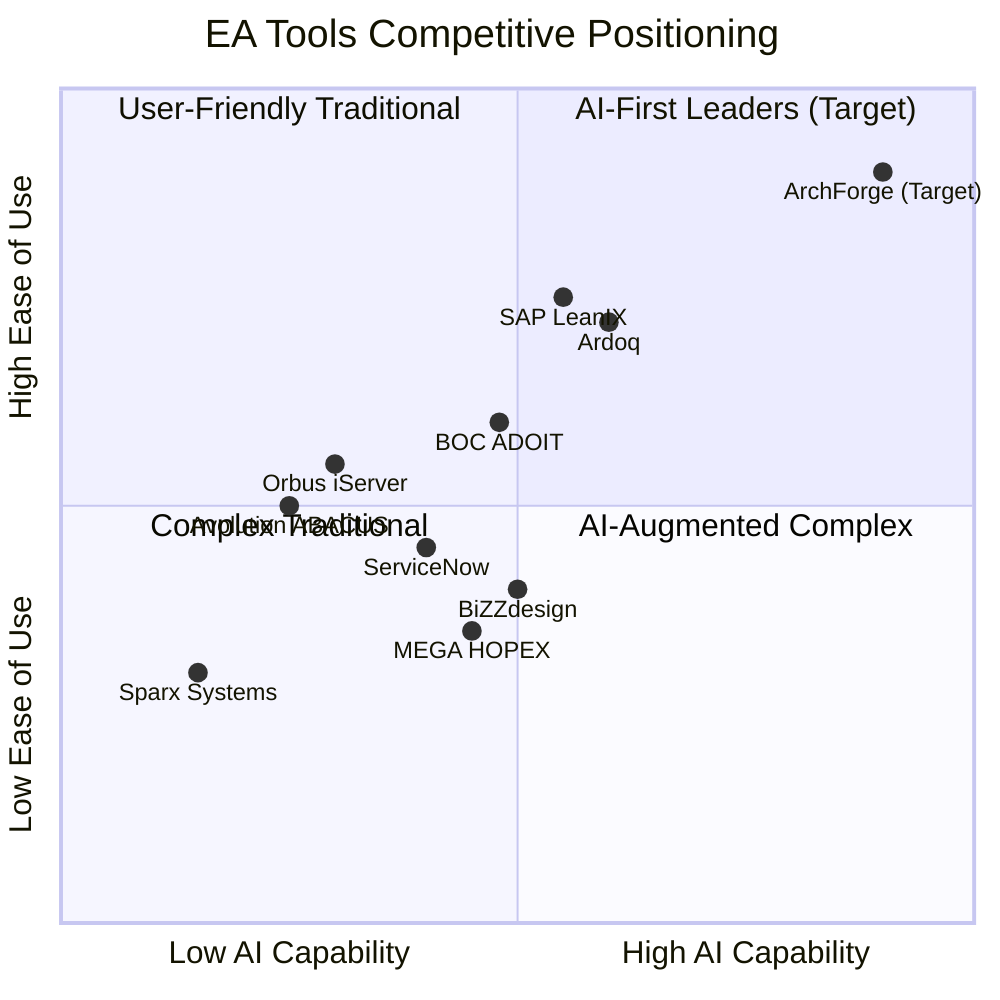
```mermaid
quadrantChart
    title EA Tools Competitive Positioning
    x-axis Low AI Capability --> High AI Capability
    y-axis Low Ease of Use --> High Ease of Use
    quadrant-1 "AI-First Leaders (Target)"
    quadrant-2 "User-Friendly Traditional"
    quadrant-3 "Complex Traditional"
    quadrant-4 "AI-Augmented Complex"
    "SAP LeanIX": [0.55, 0.75]
    "Ardoq": [0.60, 0.72]
    "MEGA HOPEX": [0.45, 0.35]
    "Orbus iServer": [0.30, 0.55]
    "BiZZdesign": [0.50, 0.40]
    "Avolution ABACUS": [0.25, 0.50]
    "BOC ADOIT": [0.48, 0.60]
    "Sparx Systems": [0.15, 0.30]
    "ServiceNow": [0.40, 0.45]
    "ArchForge (Target)": [0.90, 0.90]
```

### 3.2 Feature Comparison Matrix -- Top 5 Competitors

| Feature / Capability | SAP LeanIX | Ardoq | MEGA HOPEX | BiZZdesign | Sparx Systems | **ArchForge (Planned)** |
|----------------------|-----------|-------|-----------|-----------|--------------|----------------------|
| **Deployment** | Cloud SaaS | Cloud SaaS | Cloud (Azure) | Cloud SaaS | On-prem + Cloud | Cloud SaaS |
| **Pricing Model** | Per-user subscription (custom quote) | Per-application subscription | Custom quote (tiered) | Subscription (custom) | Perpetual license ($245-750) | Per-user subscription (transparent) |
| **TOGAF Support** | Partial | Full | Full | Full | Full | Full (AI-guided) |
| **ArchiMate Support** | Limited | Full | Full | Full (native) | Full | Full (AI-generated) |
| **BPMN Modeling** | Limited | Yes | Yes | Yes | Yes | Yes (AI-generated) |
| **Application Portfolio Mgmt** | Excellent | Good | Good | Good | Basic | Good (auto-discovered) |
| **AI Data Import** | Yes (Inventory Builder) | Yes (Visual Importer) | Partial | Partial | No | Yes (multi-source) |
| **AI Chat / NL Query** | Limited | Yes (AI Chat) | No | Beta (AI Bot) | No | **Core feature** |
| **AI Diagram Generation** | No | No | No | No | No | **Core feature** |
| **AI Full Artifact Generation** | No | No | No | No | No | **Core feature** |
| **AI Compliance Checking** | No | No | Partial | Partial | No | Yes |
| **Living Architecture** | Partial | Partial | No | No | No | Yes (infrastructure-connected) |
| **API / Integrations** | Extensive | Extensive | Good | Good | Limited | Extensive (API-first) |
| **Framework Flexibility** | Moderate | High | High | High | Very High | High (AI-adaptive) |
| **Ease of Adoption** | High | High | Low | Moderate | Low | **Very High** |
| **Gartner MQ Position** | Leader (5 yrs) | Leader (4 yrs) | Leader (16 yrs) | Leader (18 yrs) | Niche | N/A (new entrant) |

### 3.3 Competitor Deep Dives

#### SAP LeanIX (Market Leader)
- **Strengths**: Best-in-class APM, strong integrations, SAP ecosystem synergy, cloud-native, 5x Gartner Leader
- **Weaknesses**: Limited AI beyond data import, expensive for SMEs, ArchiMate support is limited, opaque pricing
- **AI Status**: AI Inventory Builder reduces manual data entry; no generative artifact capabilities
- **Vulnerability**: SaaS-first but not AI-first; AI features feel bolted on, not core to the product experience

#### Ardoq (Innovation Leader)
- **Strengths**: Most advanced AI features among incumbents, data-driven approach, strong governance, flexible metamodel
- **Weaknesses**: Smaller market share, still building AI features (many in beta), pricing can be complex
- **AI Status**: AI Lens for AI governance, Visual Importer (image-to-model), AI Chat Assistant, process modeling automation
- **Vulnerability**: Moving fast on AI but building features incrementally; not rethinking the EA workflow from scratch

#### MEGA HOPEX (Enterprise Stalwart)
- **Strengths**: 16-year Gartner Leader, comprehensive GRC + EA suite, strong in regulated industries, SOC2 certified
- **Weaknesses**: Complex UI, steep learning curve, legacy architecture, slow innovation cycle
- **AI Status**: Smart recommendations, automated discovery; minimal generative AI
- **Vulnerability**: Enterprise customers are locked in but frustrated; innovation is slow due to legacy codebase

#### BiZZdesign HoriZZon (Deep Modeler)
- **Strengths**: 18-year Gartner Leader, deepest ArchiMate support, strong consulting ecosystem, academic rigor
- **Weaknesses**: Complex for non-specialists, expensive, AI features are nascent, merger complexity (acquired MEGA's Alfabet and HOPEX lines)
- **AI Status**: Relation Recommender, Reference Architecture for GenAI, AI Bot (in development)
- **Vulnerability**: Deep expertise in modeling but not in AI; risk of being outflanked by AI-native tools

#### Sparx Systems Enterprise Architect (Budget Option)
- **Strengths**: Most affordable ($245-750 perpetual), extremely feature-rich modeling, broad standards support (UML, SysML, BPMN, ArchiMate), huge install base (3M+ users)
- **Weaknesses**: Desktop-first (not cloud-native), dated UI, no AI capabilities, poor collaboration features, steep learning curve
- **AI Status**: None -- no AI features announced
- **Vulnerability**: Massive user base but no cloud or AI strategy; ripe for disruption

### 3.4 Gap Analysis -- What is Missing from Current Tools

```mermaid
flowchart TD
    subgraph "What Exists Today"
        A[Manual Diagram Creation] --> B[Manual Documentation]
        B --> C[Periodic Reviews]
        C --> D[Stale Artifacts]
        D --> A
    end

    subgraph "What ArchForge Delivers"
        E["Natural Language Input<br/>'Describe your system'"] --> F["AI-Generated Artifacts<br/>TOGAF/ArchiMate/BPMN"]
        F --> G["Living Architecture<br/>Auto-updated from infra"]
        G --> H["Stakeholder Views<br/>Role-appropriate summaries"]
        H --> I["Compliance Checks<br/>Standards validation"]
        I --> E
    end

    style A fill:#ff6b6b,color:#fff
    style B fill:#ff6b6b,color:#fff
    style C fill:#ff6b6b,color:#fff
    style D fill:#ff6b6b,color:#fff
    style E fill:#51cf66,color:#fff
    style F fill:#51cf66,color:#fff
    style G fill:#51cf66,color:#fff
    style H fill:#51cf66,color:#fff
    style I fill:#51cf66,color:#fff
```

**The 7 Critical Gaps No Incumbent Fills Completely**:

| # | Gap | Current State | ArchForge Solution |
|---|-----|--------------|-------------------|
| 1 | **End-to-end NL artifact generation** | No tool generates complete, compliant EA artifacts from text | Core value prop: describe in English, get TOGAF/ArchiMate artifacts |
| 2 | **Living architecture** | Models are point-in-time snapshots that go stale | Continuous sync with cloud infrastructure and CI/CD pipelines |
| 3 | **Democratized access** | Tools require EA framework expertise | Natural language interface usable by any stakeholder |
| 4 | **Instant onboarding** | 3-6 month adoption cycles | Generate first artifacts in minutes, not months |
| 5 | **Transparent pricing** | Opaque "contact sales" pricing at most vendors | Clear, published pricing accessible to SMEs |
| 6 | **AI-native architecture** | AI features bolted onto legacy platforms | Built from ground up with AI at the core |
| 7 | **Multi-framework fluency** | Tools support frameworks but user must know them | AI translates between frameworks automatically |

---

## 4. Opportunity Assessment

### 4.1 Market Sizing (TAM / SAM / SOM)

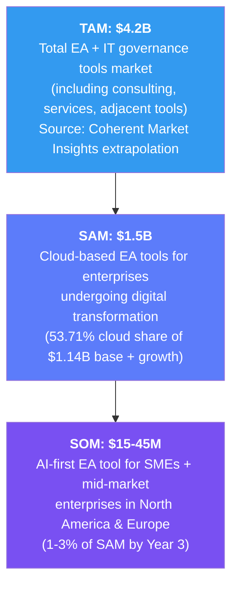
```mermaid
flowchart TD
    TAM["<b>TAM: $4.2B</b><br/>Total EA + IT governance tools market<br/>(including consulting, services, adjacent tools)<br/>Source: Coherent Market Insights extrapolation"]
    SAM["<b>SAM: $1.5B</b><br/>Cloud-based EA tools for enterprises<br/>undergoing digital transformation<br/>(53.71% cloud share of $1.14B base + growth)"]
    SOM["<b>SOM: $15-45M</b><br/>AI-first EA tool for SMEs + mid-market<br/>enterprises in North America & Europe<br/>(1-3% of SAM by Year 3)"]

    TAM --> SAM --> SOM

    style TAM fill:#339af0,color:#fff
    style SAM fill:#5c7cfa,color:#fff
    style SOM fill:#7950f2,color:#fff
```

| Metric | Value | Rationale |
|--------|-------|-----------|
| **TAM** | $4.2B | Total EA tools + adjacent IT governance, portfolio management, and digital transformation tooling |
| **SAM** | $1.5B | Cloud-based EA tools serving enterprises in digital transformation (North America + Europe) |
| **SOM** (Year 1) | $2-5M | Early adopters: AI-forward SMEs and mid-market companies in tech, fintech, and healthcare |
| **SOM** (Year 3) | $15-45M | Expanded to mid-market and enterprise; 1-3% of SAM |
| **SOM** (Year 5) | $50-100M | Established category leader in AI-first EA; 3-7% of SAM |

### 4.2 Strategic Fit with ConnectSW Portfolio

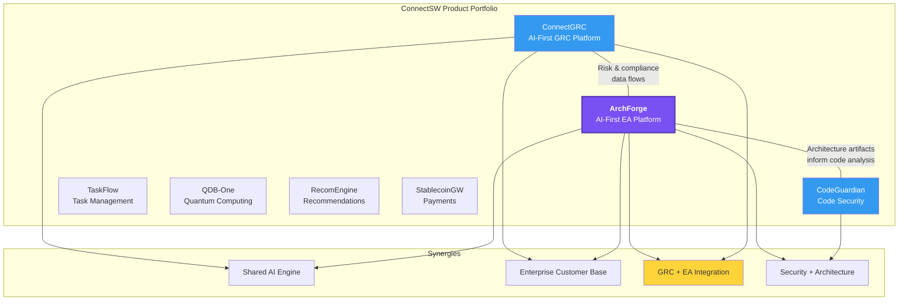
```mermaid
graph TD
    subgraph "ConnectSW Product Portfolio"
        CG["ConnectGRC<br/>AI-First GRC Platform"]
        AF["<b>ArchForge</b><br/>AI-First EA Platform"]
        CGD["CodeGuardian<br/>Code Security"]
        TF["TaskFlow<br/>Task Management"]
        QDB["QDB-One<br/>Quantum Computing"]
        RE["RecomEngine<br/>Recommendations"]
        SG["StablecoinGW<br/>Payments"]
    end

    subgraph "Synergies"
        S1["Shared AI Engine"]
        S2["Enterprise Customer Base"]
        S3["GRC + EA Integration"]
        S4["Security + Architecture"]
    end

    CG ---|"Risk & compliance<br/>data flows"| AF
    AF ---|"Architecture artifacts<br/>inform code analysis"| CGD
    CG --> S3
    AF --> S3
    AF --> S1
    CG --> S1
    CGD --> S4
    AF --> S4
    AF --> S2
    CG --> S2

    style AF fill:#7950f2,color:#fff,stroke:#5c3dba,stroke-width:3px
    style CG fill:#339af0,color:#fff
    style CGD fill:#339af0,color:#fff
    style S3 fill:#ffd43b,color:#333
```

**Strategic Fit Score: 9/10**

| Fit Dimension | Score | Reasoning |
|--------------|-------|-----------|
| AI-first DNA | 10/10 | ArchForge is the purest expression of ConnectSW's AI-first thesis |
| Portfolio synergy | 9/10 | Strong GRC-EA integration; architecture informs security analysis |
| Shared technology | 8/10 | Can reuse AI engine, authentication, and enterprise infrastructure |
| Customer overlap | 8/10 | Same enterprise buyers (IT leaders, CISOs, CTOs) |
| Revenue diversification | 9/10 | New market vertical reduces concentration risk |
| Brand reinforcement | 9/10 | "AI-first enterprise tools" becomes the ConnectSW identity |

### 4.3 Timing Analysis -- Why Now?

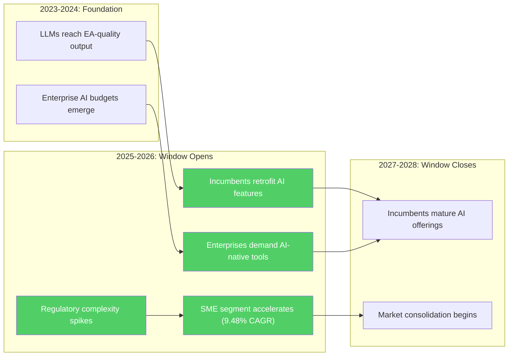
```mermaid
flowchart LR
    subgraph "2023-2024: Foundation"
        A["LLMs reach EA-quality output"]
        B["Enterprise AI budgets emerge"]
    end

    subgraph "2025-2026: Window Opens"
        C["Incumbents retrofit AI features"]
        D["Enterprises demand AI-native tools"]
        E["Regulatory complexity spikes"]
        F["SME segment accelerates (9.48% CAGR)"]
    end

    subgraph "2027-2028: Window Closes"
        G["Incumbents mature AI offerings"]
        H["Market consolidation begins"]
    end

    A --> C
    B --> D
    C --> G
    D --> G
    E --> F
    F --> H

    style C fill:#51cf66,color:#fff
    style D fill:#51cf66,color:#fff
    style E fill:#51cf66,color:#fff
    style F fill:#51cf66,color:#fff
```

**The 18-Month Window (H1 2026 - H2 2027)**:

1. **AI Maturity Threshold Crossed**: LLMs can now generate standards-compliant ArchiMate and TOGAF artifacts; this was not possible 18 months ago.

2. **Incumbent Inertia**: Leaders like MEGA (16-year legacy), BiZZdesign, and Sparx Systems have deep technical debt preventing rapid AI adoption. Their AI features are incremental add-ons, not architectural rethinks.

3. **Enterprise AI Budget Allocation**: Companies are actively allocating budget for AI tools in 2026; EA is a natural fit for AI automation.

4. **Regulatory Tailwinds**: EU AI Act, DORA, CSRD create new EA workload that manual processes cannot scale to handle.

5. **SME Opportunity**: The fastest-growing segment (9.48% CAGR) is underserved by tools designed for large enterprises.

**Timing Score: 8/10** -- The window is open but will begin narrowing by 2028 as incumbents mature their AI offerings.

### 4.4 Risk Assessment

| Risk Category | Risk | Probability | Impact | Mitigation |
|--------------|------|-------------|--------|------------|
| **Market** | Incumbents accelerate AI adoption faster than expected | Medium | High | Move fast; ship MVP in 6 months; focus on NL artifact generation as moat |
| **Market** | Enterprise customers reluctant to adopt new vendor | Medium | Medium | Offer free tier; integrate with existing tools (Sparx, LeanIX) |
| **Technical** | AI-generated artifacts fail standards compliance | Medium | High | Invest heavily in TOGAF/ArchiMate validation engine; hire EA domain experts |
| **Technical** | Hallucination in architecture models creates risk | Medium | High | Human-in-the-loop validation; confidence scoring; audit trails |
| **Competitive** | Major platform (ServiceNow, Microsoft) enters AI-EA space | Medium | High | Differentiate on depth of EA expertise; move faster than platforms |
| **Adoption** | Enterprise architects resist AI tools (job threat perception) | Low-Medium | Medium | Position as augmentation, not replacement; target architect productivity |
| **Financial** | Long enterprise sales cycles delay revenue | High | Medium | Start with PLG motion targeting SMEs; build enterprise pipeline in parallel |
| **Regulatory** | AI regulation impacts product capabilities | Low | Medium | Build compliance features into the product; EU AI Act readiness |

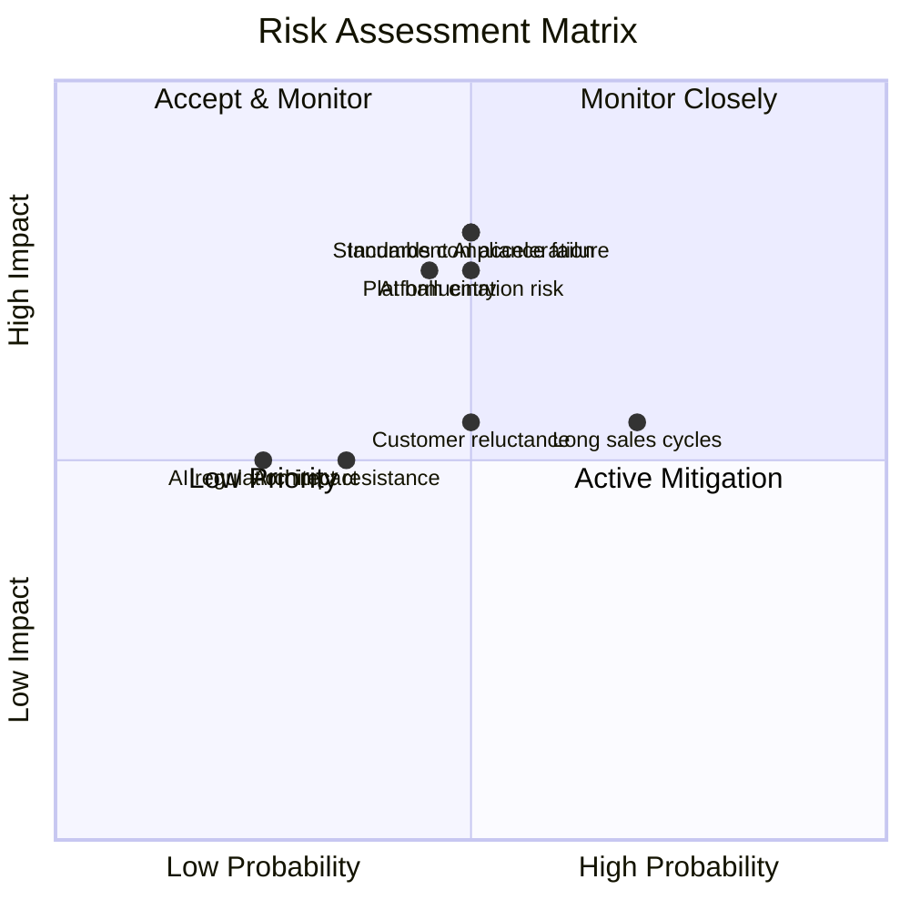
```mermaid
quadrantChart
    title Risk Assessment Matrix
    x-axis Low Probability --> High Probability
    y-axis Low Impact --> High Impact
    quadrant-1 "Monitor Closely"
    quadrant-2 "Accept & Monitor"
    quadrant-3 "Low Priority"
    quadrant-4 "Active Mitigation"
    "Incumbent AI acceleration": [0.50, 0.80]
    "Standards compliance failure": [0.50, 0.80]
    "AI hallucination risk": [0.50, 0.75]
    "Platform entry": [0.45, 0.75]
    "Customer reluctance": [0.50, 0.55]
    "Architect resistance": [0.35, 0.50]
    "Long sales cycles": [0.70, 0.55]
    "AI regulation impact": [0.25, 0.50]
```

**Overall Risk Level: Medium** -- Manageable with proper mitigation strategies and fast execution.

---

## 5. Product Positioning

### 5.1 Value Proposition -- Jobs To Be Done Framework

```mermaid
flowchart TD
    subgraph "Functional Jobs"
        FJ1["Document current-state<br/>architecture accurately"]
        FJ2["Design target-state<br/>architecture efficiently"]
        FJ3["Communicate architecture<br/>to diverse stakeholders"]
        FJ4["Ensure compliance with<br/>standards and regulations"]
        FJ5["Track and manage<br/>architecture changes"]
    end

    subgraph "Emotional Jobs"
        EJ1["Feel confident that<br/>documentation is complete"]
        EJ2["Be recognized as strategic<br/>rather than just documenting"]
        EJ3["Avoid blame when<br/>projects fail due to<br/>architecture gaps"]
    end

    subgraph "Social Jobs"
        SJ1["Demonstrate EA value<br/>to executive leadership"]
        SJ2["Engage business stakeholders<br/>who dismiss EA"]
        SJ3["Build credibility<br/>across the organization"]
    end

    subgraph "ArchForge Value Delivery"
        AF["ArchForge AI Engine"]
    end

    AF -->|"Generates artifacts<br/>in minutes"| FJ1
    AF -->|"Proposes target state<br/>from requirements"| FJ2
    AF -->|"Creates role-specific<br/>views automatically"| FJ3
    AF -->|"Auto-validates against<br/>TOGAF, ArchiMate"| FJ4
    AF -->|"Living architecture<br/>tracks drift"| FJ5
    AF -->|"Complete, always-current<br/>documentation"| EJ1
    AF -->|"Frees architects for<br/>strategic work"| EJ2
    AF -->|"Comprehensive audit<br/>trail"| EJ3
    AF -->|"Executive dashboards<br/>with AI insights"| SJ1
    AF -->|"Natural language<br/>access for all"| SJ2
    AF -->|"Data-driven<br/>recommendations"| SJ3

    style AF fill:#7950f2,color:#fff,stroke:#5c3dba,stroke-width:3px
```

#### Primary Job Statement

> **When** I need to document, communicate, and govern my organization's enterprise architecture,
> **I want** a tool that generates accurate, standards-compliant artifacts from natural language descriptions,
> **So that** I can spend my time on strategic architecture decisions instead of manual documentation, and ensure stakeholders at every level understand and engage with the architecture.

#### Job Map with Pain Points and Gains

| Job Step | Pain (Current Tools) | Gain (ArchForge) |
|----------|---------------------|------------------|
| **Define scope** | Unclear where to start; frameworks are overwhelming | AI suggests scope based on organizational context |
| **Gather information** | Manual interviews, spreadsheets, wiki scraping | AI ingests existing docs, repos, infrastructure automatically |
| **Create models** | Hours/days per diagram; requires framework expertise | Generate complete models from natural language in minutes |
| **Validate compliance** | Manual cross-referencing against standards | Automatic validation against TOGAF, ArchiMate, BPMN |
| **Communicate** | Single view; stakeholders don't understand | AI generates role-appropriate views (CTO, developer, auditor) |
| **Maintain** | Models go stale within weeks | Living architecture auto-syncs with infrastructure |
| **Govern** | Ad-hoc reviews; no enforcement | Continuous compliance monitoring and drift detection |

### 5.2 Target Personas

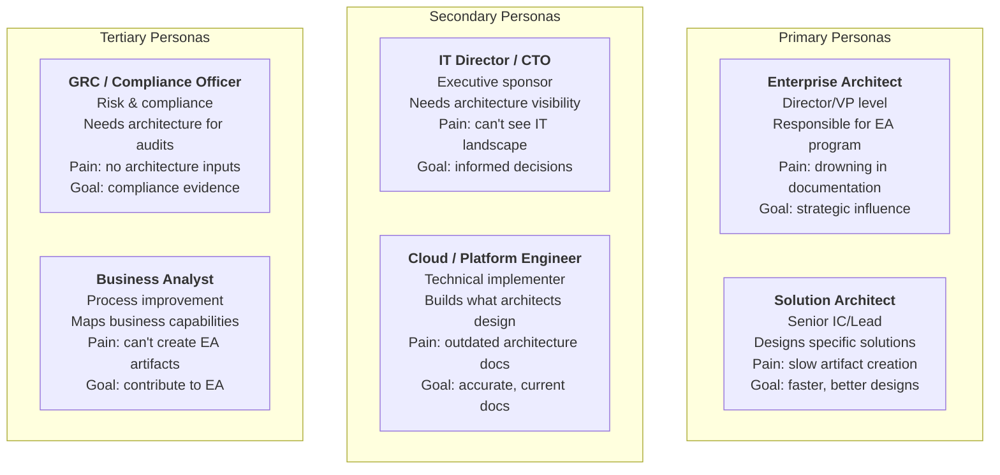
```mermaid
flowchart TD
    subgraph "Primary Personas"
        P1["<b>Enterprise Architect</b><br/>Director/VP level<br/>Responsible for EA program<br/>Pain: drowning in documentation<br/>Goal: strategic influence"]
        P2["<b>Solution Architect</b><br/>Senior IC/Lead<br/>Designs specific solutions<br/>Pain: slow artifact creation<br/>Goal: faster, better designs"]
    end

    subgraph "Secondary Personas"
        P3["<b>IT Director / CTO</b><br/>Executive sponsor<br/>Needs architecture visibility<br/>Pain: can't see IT landscape<br/>Goal: informed decisions"]
        P4["<b>Cloud / Platform Engineer</b><br/>Technical implementer<br/>Builds what architects design<br/>Pain: outdated architecture docs<br/>Goal: accurate, current docs"]
    end

    subgraph "Tertiary Personas"
        P5["<b>GRC / Compliance Officer</b><br/>Risk & compliance<br/>Needs architecture for audits<br/>Pain: no architecture inputs<br/>Goal: compliance evidence"]
        P6["<b>Business Analyst</b><br/>Process improvement<br/>Maps business capabilities<br/>Pain: can't create EA artifacts<br/>Goal: contribute to EA"]
    end
```

#### Persona Detail: Enterprise Architect (Primary Buyer)

| Attribute | Detail |
|-----------|--------|
| **Title** | Enterprise Architect, Chief Architect, VP of Architecture |
| **Reports to** | CTO or CIO |
| **Team size** | 3-15 architects in their team |
| **Current tools** | LeanIX, MEGA, Sparx, or (often) PowerPoint and Visio |
| **Budget authority** | $50K-500K for EA tools |
| **Key frustration** | "I spend more time making diagrams than making decisions" |
| **Desired outcome** | Be seen as a strategic advisor, not a documentation team |
| **Decision criteria** | Standards compliance, integration capabilities, time-to-value, stakeholder accessibility |
| **Buying trigger** | Cloud migration, M&A activity, regulatory audit, digital transformation initiative |

### 5.3 Key Differentiators vs. Incumbents

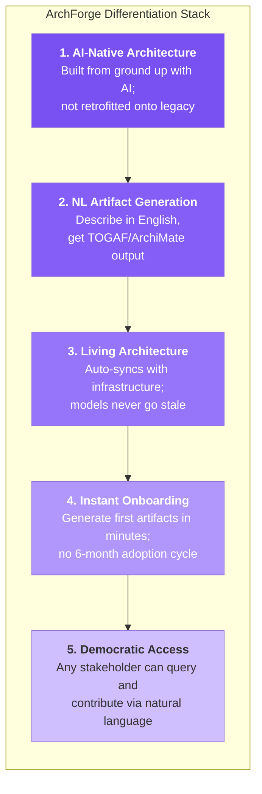
```mermaid
flowchart LR
    subgraph "ArchForge Differentiation Stack"
        D1["<b>1. AI-Native Architecture</b><br/>Built from ground up with AI;<br/>not retrofitted onto legacy"]
        D2["<b>2. NL Artifact Generation</b><br/>Describe in English,<br/>get TOGAF/ArchiMate output"]
        D3["<b>3. Living Architecture</b><br/>Auto-syncs with infrastructure;<br/>models never go stale"]
        D4["<b>4. Instant Onboarding</b><br/>Generate first artifacts in minutes;<br/>no 6-month adoption cycle"]
        D5["<b>5. Democratic Access</b><br/>Any stakeholder can query and<br/>contribute via natural language"]
    end

    D1 --> D2 --> D3 --> D4 --> D5

    style D1 fill:#7950f2,color:#fff
    style D2 fill:#845ef7,color:#fff
    style D3 fill:#9775fa,color:#fff
    style D4 fill:#b197fc,color:#fff
    style D5 fill:#d0bfff,color:#333
```

| Differentiator | Why It Matters | Competitor Response |
|---------------|---------------|-------------------|
| **AI-native, not AI-bolted** | Purpose-built AI delivers better results than features added to legacy platforms | Incumbents have 5-15 years of technical debt preventing architectural rethink |
| **Natural language to artifacts** | Eliminates the #1 pain point (manual artifact creation) | No competitor offers this comprehensively today |
| **Living architecture** | Solves the #2 pain point (stale documentation) | Partial solutions exist but none are real-time |
| **Minutes to first value** | Removes the adoption barrier that kills EA programs | Incumbent tools require months of setup and training |
| **Framework-agnostic AI** | AI translates between TOGAF, ArchiMate, BPMN, C4 automatically | Competitors are framework-specific; users must learn each notation |

### 5.4 Positioning Statement

> **For** enterprise architects, solution architects, and IT leaders
> **Who** need to document, communicate, and govern their organization's IT landscape
> **ArchForge** is an AI-powered enterprise architecture platform
> **That** generates standards-compliant architecture artifacts from natural language descriptions
> **Unlike** LeanIX, Ardoq, MEGA, and other traditional EA tools
> **ArchForge** is built AI-first, delivers value in minutes instead of months, and keeps architecture living and current through continuous infrastructure synchronization.

---

## 6. Roadmap Horizons

### 6.1 Overview

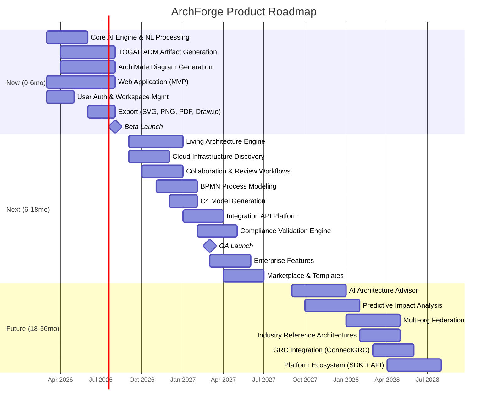
```mermaid
gantt
    title ArchForge Product Roadmap
    dateFormat YYYY-MM
    axisFormat %b %Y

    section Now (0-6mo)
    Core AI Engine & NL Processing       :a1, 2026-03, 3M
    TOGAF ADM Artifact Generation         :a2, 2026-04, 4M
    ArchiMate Diagram Generation          :a3, 2026-04, 4M
    Web Application (MVP)                 :a4, 2026-03, 5M
    User Auth & Workspace Mgmt           :a5, 2026-03, 2M
    Export (SVG, PNG, PDF, Draw.io)       :a6, 2026-06, 2M
    Beta Launch                          :milestone, m1, 2026-08, 0d

    section Next (6-18mo)
    Living Architecture Engine           :b1, 2026-09, 4M
    Cloud Infrastructure Discovery       :b2, 2026-09, 3M
    Collaboration & Review Workflows     :b3, 2026-10, 3M
    BPMN Process Modeling                :b4, 2026-11, 3M
    C4 Model Generation                  :b5, 2026-12, 2M
    Integration API Platform             :b6, 2027-01, 3M
    Compliance Validation Engine         :b7, 2027-02, 3M
    GA Launch                            :milestone, m2, 2027-03, 0d
    Enterprise Features                  :b8, 2027-03, 3M
    Marketplace & Templates              :b9, 2027-04, 3M

    section Future (18-36mo)
    AI Architecture Advisor              :c1, 2027-09, 4M
    Predictive Impact Analysis           :c2, 2027-10, 4M
    Multi-org Federation                 :c3, 2028-01, 4M
    Industry Reference Architectures     :c4, 2028-02, 3M
    GRC Integration (ConnectGRC)         :c5, 2028-03, 3M
    Platform Ecosystem (SDK + API)       :c6, 2028-04, 4M
```

### 6.2 Now -- MVP (0-6 Months: March - August 2026)

**Goal**: Prove the core value proposition: natural language to standards-compliant EA artifacts.

**Theme**: "Describe it, ArchForge builds it."

| Feature | Description | Priority | JTBD |
|---------|------------|----------|------|
| **NL-to-ArchiMate Engine** | Generate ArchiMate diagrams from natural language descriptions | P0 | Create models without framework expertise |
| **NL-to-TOGAF Artifacts** | Generate TOGAF ADM deliverables (principles, building blocks, gap analysis) | P0 | Document architecture quickly |
| **Interactive Canvas** | View, edit, and refine AI-generated diagrams in a web-based editor | P0 | Validate and customize AI output |
| **Multi-format Export** | Export to SVG, PNG, PDF, Draw.io, PlantUML, Mermaid | P0 | Integrate with existing workflows |
| **Workspace Management** | Teams, projects, version history | P1 | Organize architecture work |
| **Template Library** | Pre-built prompts for common architecture scenarios | P1 | Accelerate onboarding |
| **Framework Validation** | Validate generated artifacts against ArchiMate 3.2 and TOGAF 10 specifications | P1 | Ensure compliance |
| **User Authentication** | SSO, OAuth, email/password | P1 | Enterprise security |

**Success Metrics (MVP)**:
- Generate first artifact from NL input in <60 seconds
- 80%+ of generated ArchiMate diagrams pass standards validation
- 100 beta users within 2 months of launch
- NPS >40 from beta users

### 6.3 Next -- Growth (6-18 Months: September 2026 - August 2027)

**Goal**: Become the living architecture platform; expand framework coverage and enterprise features.

**Theme**: "Architecture that breathes."

| Feature | Description | Priority | JTBD |
|---------|------------|----------|------|
| **Living Architecture Engine** | Connect to cloud infrastructure (AWS, Azure, GCP) and auto-update models | P0 | Keep architecture current |
| **BPMN Process Modeling** | AI-generated business process diagrams | P0 | Expand framework coverage |
| **C4 Model Generation** | Generate C4 architecture diagrams from code repos | P0 | Bridge code and architecture |
| **Collaboration Workflows** | Review, comment, approve architecture artifacts | P0 | Team-based architecture governance |
| **Compliance Validation Engine** | Auto-check against regulatory frameworks (EU AI Act, DORA, SOX) | P1 | Reduce compliance risk |
| **Integration API Platform** | REST/GraphQL API for embedding ArchForge in CI/CD pipelines | P1 | Developer adoption |
| **Enterprise SSO + RBAC** | SAML, SCIM, role-based access control | P1 | Enterprise readiness |
| **Architecture Repository** | Centralized, searchable repository of all architecture artifacts | P1 | Institutional knowledge |
| **Marketplace & Templates** | Community-contributed templates, industry patterns, reference architectures | P2 | Ecosystem growth |
| **AI Chat Interface** | Conversational interface for querying and exploring architecture | P2 | Democratized access |

**Success Metrics (Growth)**:
- 1,000+ paying customers
- $2-5M ARR
- Infrastructure sync latency <15 minutes
- 3+ cloud provider integrations (AWS, Azure, GCP)
- SOC 2 Type II certification

### 6.4 Future -- Platform Vision (18-36 Months: September 2027 - August 2028)

**Goal**: Become the AI architecture intelligence platform; cross-sell with ConnectSW portfolio.

**Theme**: "The architect's AI co-pilot."

| Feature | Description | Priority | JTBD |
|---------|------------|----------|------|
| **AI Architecture Advisor** | Proactive recommendations for architecture improvements, anti-pattern detection | P0 | Strategic architecture guidance |
| **Predictive Impact Analysis** | AI predicts impact of proposed changes across the architecture | P0 | Risk-aware decision making |
| **Multi-org Federation** | Share architecture across organizational boundaries (M&A, partnerships) | P1 | Enterprise-scale governance |
| **Industry Reference Architectures** | AI-generated reference architectures for finance, healthcare, retail, etc. | P1 | Accelerate greenfield projects |
| **ConnectGRC Integration** | Bi-directional data flow between ArchForge (architecture) and ConnectGRC (risk/compliance) | P1 | Unified EA + GRC |
| **CodeGuardian Integration** | Architecture-informed code security analysis | P2 | Security-by-design |
| **Platform SDK** | Developer SDK for building custom ArchForge extensions | P2 | Platform ecosystem |
| **Architecture Digital Twin** | Full simulation of architecture changes before implementation | P2 | Zero-risk architecture evolution |

**Success Metrics (Platform)**:
- $15-45M ARR
- 5,000+ customers across 3+ verticals
- 50+ marketplace templates/extensions
- ConnectSW cross-sell rate >20%
- Gartner MQ recognition (Visionary or Challenger)

---

## 7. SWOT Analysis

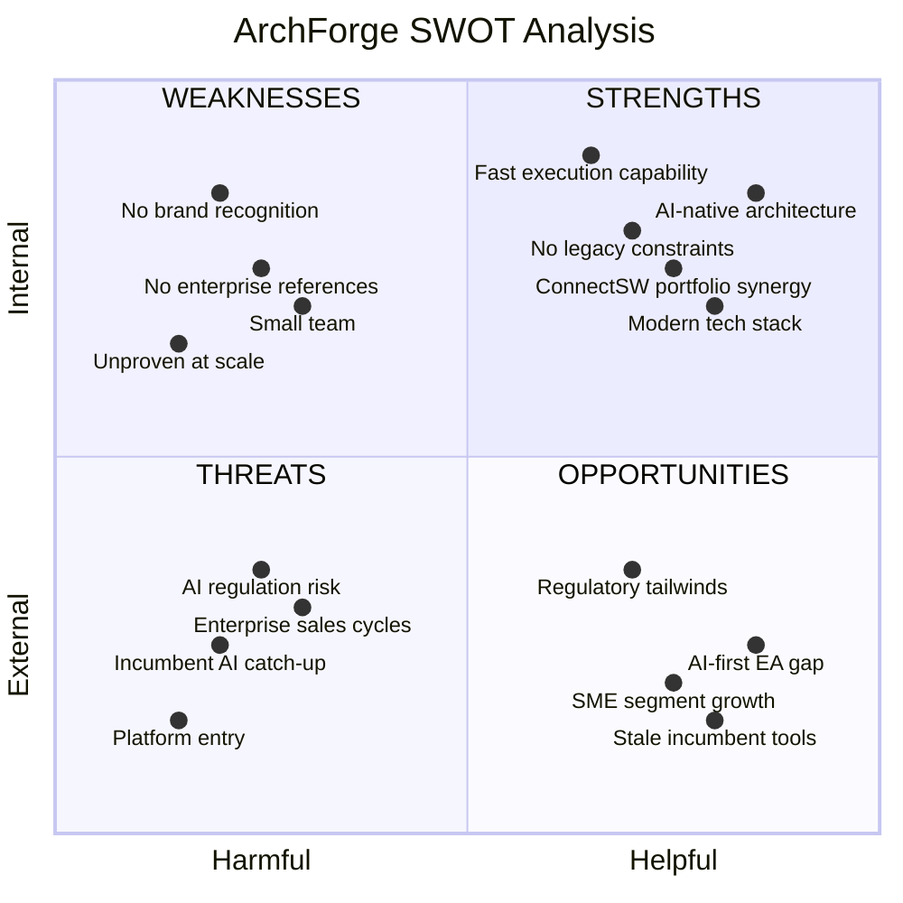
```mermaid
quadrantChart
    title ArchForge SWOT Analysis
    x-axis Harmful --> Helpful
    y-axis External --> Internal
    quadrant-1 "STRENGTHS"
    quadrant-2 "WEAKNESSES"
    quadrant-3 "THREATS"
    quadrant-4 "OPPORTUNITIES"
    "AI-native architecture": [0.85, 0.85]
    "ConnectSW portfolio synergy": [0.75, 0.75]
    "Modern tech stack": [0.80, 0.70]
    "No legacy constraints": [0.70, 0.80]
    "Fast execution capability": [0.65, 0.90]
    "No brand recognition": [0.20, 0.85]
    "No enterprise references": [0.25, 0.75]
    "Small team": [0.30, 0.70]
    "Unproven at scale": [0.15, 0.65]
    "AI-first EA gap": [0.85, 0.25]
    "SME segment growth": [0.75, 0.20]
    "Regulatory tailwinds": [0.70, 0.35]
    "Stale incumbent tools": [0.80, 0.15]
    "Incumbent AI catch-up": [0.20, 0.25]
    "Platform entry": [0.15, 0.15]
    "AI regulation risk": [0.25, 0.35]
    "Enterprise sales cycles": [0.30, 0.30]
```

### Detailed SWOT

#### Strengths (Internal, Helpful)

| Strength | Strategic Value |
|----------|----------------|
| **AI-native architecture** | No technical debt; every feature built around AI from day one |
| **ConnectSW portfolio synergy** | Cross-sell with ConnectGRC, CodeGuardian; shared enterprise customer base |
| **Modern tech stack** | TypeScript, Fastify, Next.js, PostgreSQL -- fast development, easy hiring |
| **No legacy constraints** | Can innovate without worrying about backward compatibility |
| **Fast execution (agent-based dev)** | ConnectSW's AI agent development model enables rapid feature delivery |
| **Natural language interface** | Lowers barrier to entry; attracts non-traditional EA users |

#### Weaknesses (Internal, Harmful)

| Weakness | Mitigation Strategy |
|----------|-------------------|
| **No brand recognition in EA market** | Content marketing, thought leadership, conference presence; leverage ConnectSW brand |
| **No enterprise references** | Offer free/discounted pilot programs to 10-20 design partners; publish case studies early |
| **Small team (initially)** | Focus on AI-driven features that differentiate; don't try to match incumbents feature-for-feature |
| **Unproven at enterprise scale** | Invest in infrastructure early; SOC 2 certification; enterprise SLAs |
| **EA domain expertise gap** | Hire or contract experienced enterprise architects as domain advisors |

#### Opportunities (External, Helpful)

| Opportunity | How to Capture |
|------------|----------------|
| **No AI-native EA leader exists** | First-mover advantage in "AI-first EA" category; define the category |
| **SME segment growing at 9.48% CAGR** | Product-led growth with transparent pricing; freemium tier |
| **Regulatory complexity increasing** | Build compliance automation as a key feature (EU AI Act, DORA, CSRD) |
| **Incumbent tools have stale UX** | Modern, intuitive interface that delights users accustomed to clunky tools |
| **Enterprise architects want strategic role** | Position ArchForge as the tool that frees architects from documentation for strategy |
| **Cloud migration driving EA adoption** | Target organizations in active cloud migration; infrastructure sync as hook |

#### Threats (External, Harmful)

| Threat | Probability | Response |
|--------|------------|---------|
| **Incumbents accelerate AI features** | Medium | Move fast; ship MVP in 6 months; focus on AI-native advantage |
| **Major platform (Microsoft, ServiceNow) enters** | Medium | Differentiate on EA depth; platforms will offer breadth, not depth |
| **AI hallucination undermines trust** | Medium | Human-in-the-loop validation; confidence scores; audit trails |
| **AI regulation restricts capabilities** | Low | Build compliance into the product; transparency and explainability |
| **Long enterprise sales cycles** | High | Start with PLG/SME; build enterprise pipeline in parallel |
| **Open-source EA tools improve** | Low | OSS lacks AI capabilities and enterprise features; different market segment |

---

## 8. Strategic Recommendation

### 8.1 Opportunity Scoring

| Dimension | Score (1-10) | Weight | Weighted Score |
|-----------|-------------|--------|---------------|
| **Market Size & Growth** | 8 | 20% | 1.60 |
| **Strategic Fit** | 9 | 20% | 1.80 |
| **Timing** | 8 | 20% | 1.60 |
| **Competitive Gap** | 9 | 15% | 1.35 |
| **Technical Feasibility** | 7 | 15% | 1.05 |
| **Revenue Potential** | 8 | 10% | 0.80 |
| **Total** | | **100%** | **8.2 / 10** |

### 8.2 Porter's Five Forces Assessment

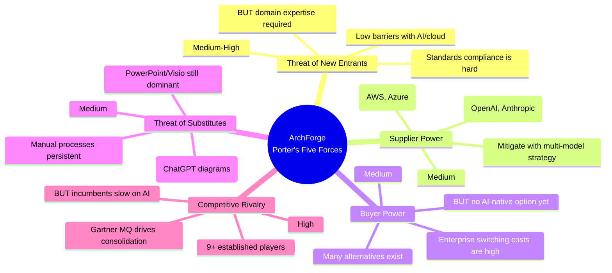
```mermaid
mindmap
  root(("ArchForge<br/>Porter's Five Forces"))
    Threat of New Entrants
      Medium-High
      Low barriers with AI/cloud
      BUT domain expertise required
      Standards compliance is hard
    Supplier Power
      Medium
      LLM providers (OpenAI, Anthropic)
      Cloud infrastructure (AWS, Azure)
      Mitigate with multi-model strategy
    Buyer Power
      Medium
      Many alternatives exist
      BUT no AI-native option yet
      Enterprise switching costs are high
    Threat of Substitutes
      Medium
      PowerPoint/Visio still dominant
      Manual processes persistent
      General AI tools (ChatGPT diagrams)
    Competitive Rivalry
      High
      9+ established players
      Gartner MQ drives consolidation
      BUT incumbents slow on AI
```

### 8.3 Wardley Map

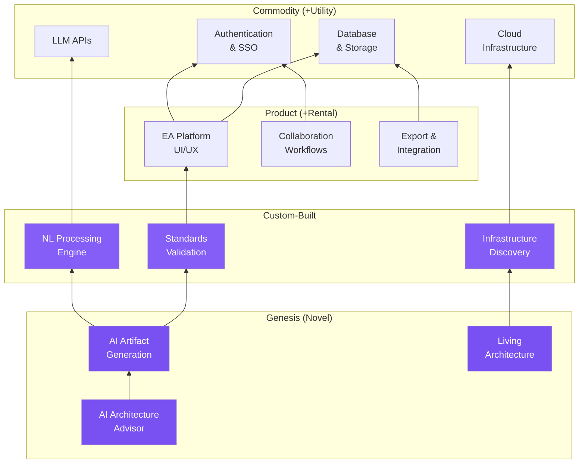
```mermaid
graph BT
    subgraph "Genesis (Novel)"
        G1["AI Artifact<br/>Generation"]
        G2["Living<br/>Architecture"]
        G3["AI Architecture<br/>Advisor"]
    end

    subgraph "Custom-Built"
        C1["NL Processing<br/>Engine"]
        C2["Standards<br/>Validation"]
        C3["Infrastructure<br/>Discovery"]
    end

    subgraph "Product (+Rental)"
        P1["EA Platform<br/>UI/UX"]
        P2["Collaboration<br/>Workflows"]
        P3["Export &<br/>Integration"]
    end

    subgraph "Commodity (+Utility)"
        U1["Authentication<br/>& SSO"]
        U2["Cloud<br/>Infrastructure"]
        U3["LLM APIs"]
        U4["Database<br/>& Storage"]
    end

    G1 --> C1
    G1 --> C2
    G2 --> C3
    G3 --> G1
    C1 --> U3
    C2 --> P1
    C3 --> U2
    P1 --> U1
    P1 --> U4
    P2 --> U1
    P3 --> U4

    style G1 fill:#7950f2,color:#fff
    style G2 fill:#7950f2,color:#fff
    style G3 fill:#7950f2,color:#fff
    style C1 fill:#845ef7,color:#fff
    style C2 fill:#845ef7,color:#fff
    style C3 fill:#845ef7,color:#fff
```

**Strategic Insight from Wardley Map**: ArchForge's competitive advantage lives in the Genesis and Custom-Built layers (AI artifact generation, living architecture, NL processing). The commodity layers (auth, cloud, LLMs, databases) should be bought, not built. Focus engineering effort on the differentiating layers.

### 8.4 Go-to-Market Strategy

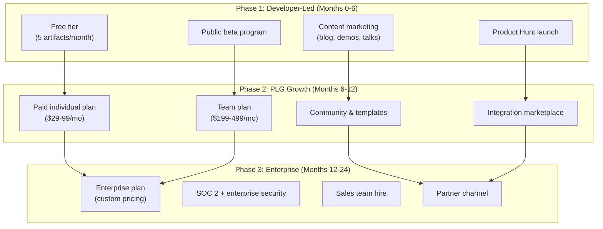
```mermaid
flowchart TD
    subgraph "Phase 1: Developer-Led (Months 0-6)"
        A1["Free tier<br/>(5 artifacts/month)"]
        A2["Public beta program"]
        A3["Content marketing<br/>(blog, demos, talks)"]
        A4["Product Hunt launch"]
    end

    subgraph "Phase 2: PLG Growth (Months 6-12)"
        B1["Paid individual plan<br/>($29-99/mo)"]
        B2["Team plan<br/>($199-499/mo)"]
        B3["Community & templates"]
        B4["Integration marketplace"]
    end

    subgraph "Phase 3: Enterprise (Months 12-24)"
        C1["Enterprise plan<br/>(custom pricing)"]
        C2["SOC 2 + enterprise security"]
        C3["Sales team hire"]
        C4["Partner channel"]
    end

    A1 --> B1
    A2 --> B2
    A3 --> B3
    A4 --> B4
    B1 --> C1
    B2 --> C1
    B3 --> C4
    B4 --> C4
```

### 8.5 Pricing Strategy

| Tier | Price | Target | Included |
|------|-------|--------|----------|
| **Free** | $0/mo | Individual architects, students | 5 artifacts/mo, 1 workspace, community support |
| **Pro** | $49/user/mo | Small teams, freelance architects | Unlimited artifacts, 3 workspaces, all frameworks, export |
| **Team** | $99/user/mo | Mid-market teams (5-20 architects) | Everything in Pro + collaboration, version history, API access |
| **Enterprise** | Custom | Large organizations (20+ architects) | Everything in Team + SSO/SAML, RBAC, SLA, dedicated support, on-prem option |

**Pricing Rationale**:
- Significantly cheaper than LeanIX, MEGA, BiZZdesign (typically $50K-500K/yr)
- Competitive with Sparx Systems on entry price but with AI capabilities
- Transparent pricing (unlike most competitors' "contact sales" model)
- Free tier enables PLG motion and community building

### 8.6 Investment Requirements (Estimated)

| Phase | Duration | Investment | Expected ARR |
|-------|----------|-----------|-------------|
| **MVP** | 6 months | $150-250K | $0 (beta) |
| **Growth** | 12 months | $500K-1M | $2-5M |
| **Scale** | 12 months | $1-2M | $15-45M |
| **Total (30 months)** | | **$1.65-3.25M** | **$15-45M target** |

### 8.7 Final Recommendation

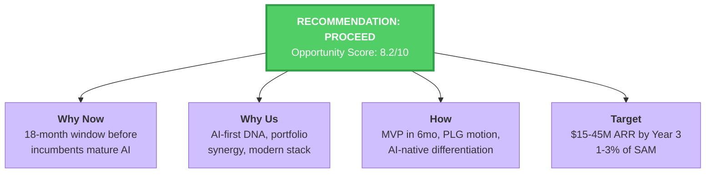
```mermaid
flowchart TD
    R["<b>RECOMMENDATION: PROCEED</b><br/>Opportunity Score: 8.2/10"]
    R --> R1["<b>Why Now</b><br/>18-month window before<br/>incumbents mature AI"]
    R --> R2["<b>Why Us</b><br/>AI-first DNA, portfolio<br/>synergy, modern stack"]
    R --> R3["<b>How</b><br/>MVP in 6mo, PLG motion,<br/>AI-native differentiation"]
    R --> R4["<b>Target</b><br/>$15-45M ARR by Year 3<br/>1-3% of SAM"]

    style R fill:#51cf66,color:#fff,stroke:#2f9e44,stroke-width:3px
    style R1 fill:#d0bfff,color:#333
    style R2 fill:#d0bfff,color:#333
    style R3 fill:#d0bfff,color:#333
    style R4 fill:#d0bfff,color:#333
```

**Proceed with ArchForge development.** The convergence of AI maturity, market pain points, incumbent inertia, and ConnectSW's AI-first capabilities creates a compelling window of opportunity. The key to success is speed: ship the MVP within 6 months, validate with beta users, and iterate rapidly before the window narrows.

**Critical Success Factors**:
1. Ship MVP by August 2026 -- speed is the primary competitive advantage
2. Achieve 80%+ standards compliance on AI-generated artifacts at launch
3. Hire or contract 2-3 experienced enterprise architects as domain advisors
4. Build in public: transparency and community engagement will differentiate from enterprise incumbents
5. Maintain pricing transparency as a competitive weapon against opaque incumbent pricing

---

## 9. Sources

### Market Research
- [Enterprise Architecture Tools Market Size, Share Report 2030 - Grand View Research](https://www.grandviewresearch.com/industry-analysis/enterprise-architecture-tools-market-report)
- [Enterprise Architecture Tools Market Size & Forecast to 2030 - Research and Markets](https://www.researchandmarkets.com/report/enterprise-architecture)
- [Enterprise Architecture Tools Market Size, Share & 2030 Growth Trends Report - Mordor Intelligence](https://www.mordorintelligence.com/industry-reports/enterprise-architecture-tools-market)
- [Enterprise Architecture Tools Market Size & Share 2025-2030 - 360iResearch](https://www.360iresearch.com/library/intelligence/enterprise-architecture-tools)
- [Enterprise Architecture Tools Global Market Report 2025 - GII Research](https://www.giiresearch.com/report/tbrc1843692-enterprise-architecture-tools-global-market-report.html)
- [Enterprise Architecture Market Outlook: Trends, Growth & Opportunities 2025-2030 - Market Business Insights](https://www.marketbusinessinsights.com/enterprise-architecture-market)
- [Enterprise Architecture Tools To Reach $1.60Bn By 2030 - Grand View Research](https://www.grandviewresearch.com/press-release/global-enterprise-architecture-tools-market)

### Competitor Analysis
- [SAP LeanIX Enterprise Architecture - Pricing](https://www.leanix.net/en/enterprise-architecture/pricing)
- [LeanIX Pricing - A Detailed Comparison with Features in 2025 - Spendflo](https://www.spendflo.com/blog/leanix-pricing-and-features)
- [Ardoq - Enterprise Architecture Software](https://www.ardoq.com/)
- [What Will An Enterprise Architecture Tool Cost You in 2025? - Ardoq](https://www.ardoq.com/blog/enterprise-architecture-cost-in-2025)
- [HOPEX Enterprise Architecture Pricing - MEGA](https://www.mega.com/product-hopex-enterprise-architecture-pricing)
- [iServer - Leading Enterprise Architecture Solution - Orbus Software](https://www.orbussoftware.com/product/iserver)
- [Bizzdesign - Enterprise Transformation That Flows](https://bizzdesign.com/)
- [Avolution - Leading Enterprise Architecture Modeling Tool](https://www.avolutionsoftware.com/)
- [ADOIT Enterprise Architecture Suite - BOC Group](https://www.boc-group.com/en/adoit/)
- [Enterprise Architect: Pricing - Sparx Systems](https://sparxsystems.com/products/ea/shop/)
- [ITOM - Enterprise IT Operations Management - ServiceNow](https://www.servicenow.com/products/it-operations-management.html)

### AI in Enterprise Architecture
- [How AI is Revolutionizing Enterprise Architecture - Go-TOGAF](https://www.go-togaf.com/how-ai-is-revolutionizing-enterprise-architecture-trends-tools-and-tactics/)
- [The Augmented Architect: Real-Time Enterprise Architecture In The Age Of AI - Forrester](https://www.forrester.com/blogs/the-augmented-architect-real-time-enterprise-architecture-in-the-age-of-ai/)
- [AI and Innovation at Ardoq](https://www.ardoq.com/ai-and-innovation)
- [New AI Features in Bizzdesign Horizzon - Bizzdesign](https://content.bizzdesign.com/webinar-adopt-generative-ai-at-scale-in-your-enterprise-architecture/p/1-resources-ea-and-ai)
- [AI-Powered Enterprise Architecture: A Complete Guide to Modern Modeling - Go-TOGAF](https://www.go-togaf.com/ai-powered-enterprise-architecture-guide/)
- [Why 2026 Will Prioritize AI-Ready Enterprise Architecture - SIDGS](https://sidgs.com/2026-ai-ready-enterprise-architecture/)

### Gartner Magic Quadrant
- [Gartner Magic Quadrant for Enterprise Architecture Tools](https://www.gartner.com/en/documents/4947731)
- [SAP LeanIX: Five-time Leader in 2025 Gartner MQ for EA Tools](https://www.leanix.net/en/download/gartner-magic-quadrant-for-enterprise-architecture-tools-2025)
- [2025 Gartner MQ for Enterprise Architecture Tools - Avolution](https://www.avolutionsoftware.com/our-resources/2025-gartner-magic-quadrant-for-enterprise-architecture-tools/)
- [2025 Gartner MQ for Enterprise Architecture Tools - Bizzdesign](https://bizzdesign.com/analyst-report/gartner-magic-quadrant-enterprise-architecture-tools-2025)

### Industry Trends
- [Enterprise Architecture Trends 2025 - Forrester](https://www.forrester.com/report/enterprise-architecture-trends-2025/RES191347)
- [3 Trends Driving Enterprise Architecture Strategy in 2025 - Gartner](https://www.gartner.com/en/articles/2025-trends-for-enterprise-architecture)
- [Enterprise Architecture Trends for 2026 - BOC Group](https://www.boc-group.com/en/blog/ea/ea-outlook-trends-2025/)
- [Top 6 Enterprise Architecture Trends for 2026 and Beyond - ACL Digital](https://www.acldigital.com/blogs/top-6-enterprise-architecture-trends-shaping-2026-and-beyond)

### Pain Points and Customer Insights
- [Solving 7 Common Enterprise Architecture Challenges - ValueBlue](https://www.valueblue.com/blog/7-common-enterprise-architecture-challenges-and-how-to-solve-them)
- [Challenges of Enterprise Architecture 2025 - Bizzdesign](https://bizzdesign.com/blog/challenges-of-enterprise-architecture)
- [6 Deadly Sins of Enterprise Architecture - CIO](https://www.cio.com/article/652779/6-deadly-sins-of-enterprise-architecture.html)
- [EA Pain Points - Internet2 Wiki](https://spaces.at.internet2.edu/display/itana/EA+Pain+Points)
- [Leveraging Jobs to Be Done to Start a Target Architecture - Capital One](https://www.capitalone.com/tech/software-engineering/leveraging-jtbd/)
