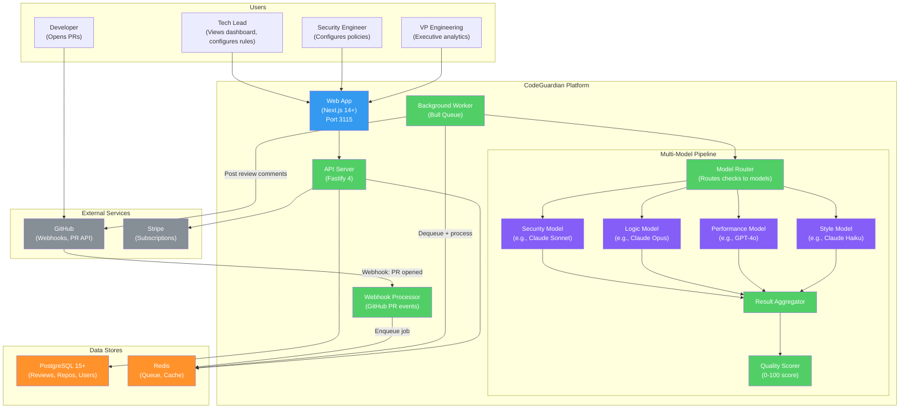

# CodeGuardian -- Multi-Model AI Code Review and Security Platform

CodeGuardian is a multi-model AI code review and security platform that routes different analysis checks -- logic, security, performance, and style -- to specialized AI models, then aggregates their findings into a unified, actionable review posted directly on GitHub pull requests. Every PR receives a 0-100 quality score with transparent breakdown.

CodeGuardian is ConnectSW's DNA product: every other ConnectSW product is built with CodeGuardian reviewing its code.

## Why CodeGuardian Exists

Modern development teams face three compounding problems:

1. **Code reviews are slow and inconsistent.** Human reviewers miss 40-60% of defects, and reviews take 4-8 hours of wall-clock time.
2. **Security vulnerabilities ship to production.** 83% of codebases contain at least one known vulnerability (Synopsys 2024). Most teams lack a dedicated security reviewer.
3. **Single-model AI tools have blind spots.** GitHub Copilot, Amazon CodeWhisperer, and similar tools use one model for all tasks. A model fine-tuned for code generation may miss security flaws. A security-focused model may not understand business logic.

**The CodeGuardian insight**: Different analysis tasks require different AI expertise. A multi-model ensemble -- where security checks go to a security-specialized model, logic checks to a reasoning model, performance checks to an optimization model -- produces higher-quality reviews than any single model alone.

The DevSecOps market is valued at $7.2B (2025) with a 28% CAGR. GitHub Copilot proved developers pay for AI tools, but Copilot assists with code generation, not code review. CodeGuardian fills the review gap.

## Architecture Overview



## Tech Stack

| Layer | Technology | Version |
|-------|-----------|---------|
| Runtime | Node.js | 20+ |
| Language | TypeScript | 5+ |
| Backend Framework | Fastify | 4+ |
| Frontend Framework | Next.js (App Router) | 14+ |
| UI Library | React | 18+ |
| Styling | Tailwind CSS | Latest |
| Database | PostgreSQL | 15+ |
| ORM | Prisma | Latest |
| Queue | Bull (Redis-backed) | Latest |
| Cache | Redis | 7+ |
| AI Models | Anthropic Claude, OpenAI GPT-4o, Google Gemini | Latest |
| GitHub Integration | GitHub App (Webhooks + REST/GraphQL API) | v4 |
| Payments | Stripe | Latest |
| Validation | Zod | Latest |
| Testing | Jest, Playwright | Latest |

## Port Assignments

| Service | Port |
|---------|------|
| Frontend (Web App) | 3115 |
| PostgreSQL | 5432 |
| Redis | 6379 |

## Getting Started

### Prerequisites

- Node.js 20+
- Docker and Docker Compose
- PostgreSQL 15+ (or use Docker)
- Redis 7+ (or use Docker)
- AI model API keys (Anthropic, OpenAI, and/or Google)
- A GitHub App (for webhook integration)

### Current Status

CodeGuardian is in the **architecture and design phase**. The product has comprehensive documentation (PRD, architecture, ADRs, API contracts, database schema) but source code implementation has not yet begun.

To review the design:

```bash
# Read the PRD
cat products/codeguardian/docs/PRD.md

# Read the architecture
cat products/codeguardian/docs/architecture.md

# Review the database schema
cat products/codeguardian/docs/db-schema.sql

# Review the API contract
cat products/codeguardian/docs/api-contract.yaml

# Read architecture decision records
ls products/codeguardian/docs/ADRs/
```

## Project Structure

```
products/codeguardian/
├── docs/
│   ├── PRD.md                              # Product Requirements Document
│   ├── architecture.md                     # System Architecture (C4 diagrams)
│   ├── db-schema.sql                       # Database schema design
│   ├── api-contract.yaml                   # OpenAPI 3.0 API contract
│   └── ADRs/
│       ├── ADR-001-multi-model-routing.md  # Multi-model routing strategy
│       ├── ADR-002-async-review-pipeline.md # Async review pipeline design
│       ├── ADR-003-github-integration.md   # GitHub App integration approach
│       └── ADR-004-scoring-algorithm.md    # Quality scoring algorithm
└── README.md                               # This file
```

## Key Features (Planned)

### MVP (Phase 1)

| Feature | Description |
|---------|-------------|
| Multi-Model Review Pipeline | Route security, logic, performance, and style checks to specialized AI models |
| GitHub-Native Reviews | Post review comments as native GitHub PR reviews with inline suggestions |
| Quality Score | 0-100 composite score with transparent breakdown per category |
| Review Dashboard | View review history, scores, and trends per repository |
| GitHub App Install | One-click install from GitHub Marketplace |
| Free Tier | Individual developers: free for public repos, 50 reviews/month |

### Phase 2

| Feature | Description |
|---------|-------------|
| Team Dashboard | Per-team quality scores, trends, and benchmarks |
| Custom Rules | Configure team-specific review rules and thresholds |
| Blocking Reviews | Prevent merge when critical security issues are found |
| Executive Analytics | Org-wide quality metrics and trends |
| Enterprise SSO | SAML/OIDC for enterprise authentication |

### Future

| Feature | Description |
|---------|-------------|
| Auto-Fix Suggestions | AI generates fix PRs for common issues |
| CI/CD Pipeline Integration | Quality gates in CI/CD workflows |
| Compliance Reports | SOC 2, ISO 27001 audit evidence generation |
| IDE Integration | VS Code and JetBrains extensions |

## Key Differentiators

| Differentiator | CodeGuardian | Competitors |
|---------------|-------------|------------|
| Multi-model ensemble | Routes each check type to best-suited AI model | Single model for everything |
| GitHub-native | Reviews appear as native PR comments | Separate dashboard |
| Quantified quality | 0-100 score with transparent breakdown | Pass/fail or no score |
| Bottom-up adoption | Free tier for individuals; teams upgrade organically | Enterprise sales-led |
| Dog-fooded internally | Used on all ConnectSW products | Not self-tested |

## Documentation

| Document | Path | Description |
|----------|------|-------------|
| PRD | [docs/PRD.md](docs/PRD.md) | Full requirements with personas and acceptance criteria |
| Architecture | [docs/architecture.md](docs/architecture.md) | System architecture with C4 diagrams |
| Database Schema | [docs/db-schema.sql](docs/db-schema.sql) | PostgreSQL schema design |
| API Contract | [docs/api-contract.yaml](docs/api-contract.yaml) | OpenAPI 3.0 specification |
| ADR-001 | [docs/ADRs/ADR-001-multi-model-routing.md](docs/ADRs/ADR-001-multi-model-routing.md) | Multi-model routing strategy |
| ADR-002 | [docs/ADRs/ADR-002-async-review-pipeline.md](docs/ADRs/ADR-002-async-review-pipeline.md) | Async review pipeline |
| ADR-003 | [docs/ADRs/ADR-003-github-integration.md](docs/ADRs/ADR-003-github-integration.md) | GitHub integration |
| ADR-004 | [docs/ADRs/ADR-004-scoring-algorithm.md](docs/ADRs/ADR-004-scoring-algorithm.md) | Quality scoring algorithm |

## License

UNLICENSED -- ConnectSW Internal
