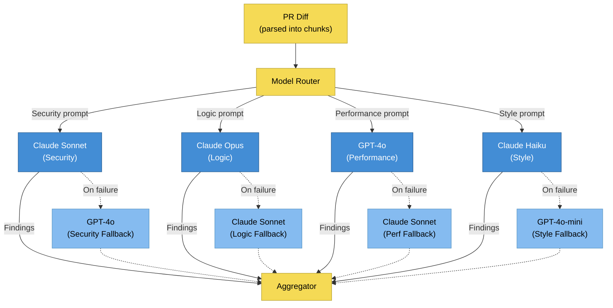
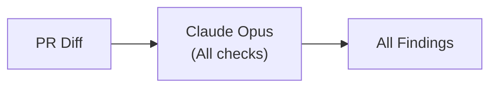
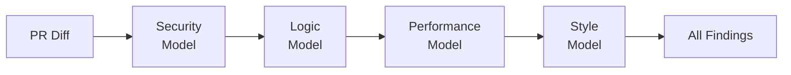

# ADR-001: Multi-Model Routing Strategy

**Status**: Accepted
**Date**: 2026-02-18
**Decision Makers**: Architect Agent
**Product**: CodeGuardian

---

## Context

CodeGuardian needs to analyze pull request diffs for four categories of issues: security vulnerabilities, logic errors, performance problems, and style violations. The core architectural question is whether to use a single AI model for all analysis or to route different check types to different specialized models.

**Constraints:**
- Different AI models have different strengths (security reasoning, code understanding, speed)
- Review latency should be under 60 seconds for diffs under 500 lines
- AI API costs must be manageable (~$0.08 per review target)
- The system must handle model provider outages gracefully

## Decision

**Route each check type to a specialized AI model in parallel, with configurable primary and fallback models per check type.**

### Architecture: Parallel Fan-Out with Fallback



### Default Routing Table

| Check Type | Primary Model | Fallback Model | Timeout | Rationale |
|-----------|--------------|----------------|---------|-----------|
| Security | Claude Sonnet | GPT-4o | 30s | Strong reasoning on vulnerability patterns; OWASP taxonomy |
| Logic | Claude Opus | Claude Sonnet | 45s | Best reasoning capability for complex logic analysis |
| Performance | GPT-4o | Claude Sonnet | 30s | Strong performance pattern recognition |
| Style | Claude Haiku | GPT-4o-mini | 15s | Fast, cheap; style checks are simpler |

### Routing Process

1. Worker dequeues review job from BullMQ
2. Diff is split into chunks (max 500 lines each)
3. For each chunk, 4 requests fire in parallel (one per check type)
4. Each uses the primary model with a category-specific system prompt
5. On timeout/error: retry once with exponential backoff
6. If retry fails: fall back to secondary model
7. If fallback also fails: mark check type as "skipped"
8. Aggregator collects all findings, deduplicates by file+line range
9. Scorer calculates composite 0-100 score

### Configuration Schema

```typescript
interface RoutingConfig {
  security: CheckTypeConfig;
  logic: CheckTypeConfig;
  performance: CheckTypeConfig;
  style: CheckTypeConfig;
}

interface CheckTypeConfig {
  primaryModel: string;     // e.g., "claude-sonnet"
  fallbackModel: string;    // e.g., "gpt-4o"
  timeoutSeconds: number;   // 5-120
}
```

Configurable at three levels (in order of precedence):
1. **Repository level** -- overrides org and system defaults
2. **Organization level** -- overrides system defaults
3. **System level** -- hardcoded defaults

## Consequences

### Positive
- **Higher accuracy**: Each model is prompted for its specialty, producing more relevant findings
- **Parallel execution**: Total latency is bounded by the slowest model, not the sum
- **Resilience**: If one provider is down, other check types still complete; fallback models provide redundancy
- **Configurability**: Organizations can choose which models to use per check type
- **Competitive moat**: Multi-model ensemble is architecturally unique and hard to replicate

### Negative
- **Higher cost**: 4 API calls per chunk instead of 1 (~4x cost per review, mitigated by using cheaper models for simpler tasks)
- **Complexity**: Routing logic, fallback handling, and aggregation add code complexity
- **Deduplication challenge**: Different models may flag the same issue; aggregator must deduplicate
- **Provider dependency**: Dependent on 2-3 AI API providers simultaneously

### Risks
- **Cost overrun**: Mitigated by chunk limits (max 20 chunks) and model selection (Haiku for style is cheap)
- **Inconsistent findings**: Mitigated by structured prompts with consistent output schema
- **Provider lock-in**: Mitigated by adapter pattern -- each provider has its own adapter behind a common interface

## Alternatives Considered

### Alternative A: Single Model for All Checks



- **Pros**: Simpler architecture, lower code complexity, single provider dependency
- **Cons**: No specialization benefit, sequential processing, single point of failure, no competitive differentiation
- **Rejected because**: This is what every competitor does. CodeGuardian's value proposition is the multi-model ensemble.

### Alternative B: Sequential Model Pipeline



- **Pros**: Each model can see findings from previous models; simpler aggregation
- **Cons**: Latency is the sum of all models (120s+); no parallelism benefit
- **Rejected because**: Latency would be 4x slower, violating the 60-second target for most diffs.

### Alternative C: Dynamic Model Selection (ML Router)

Route each check to whatever model scores best for that language/framework based on historical accuracy data.

- **Pros**: Optimal model selection; learns over time
- **Cons**: Requires significant training data, cold start problem, adds ML infrastructure dependency
- **Rejected because**: Premature optimization for MVP. Can be added as a Phase 2 enhancement once we have accuracy data from user feedback.

---

*This ADR will be revisited when Phase 2 features (custom model training, dynamic selection) are planned.*
