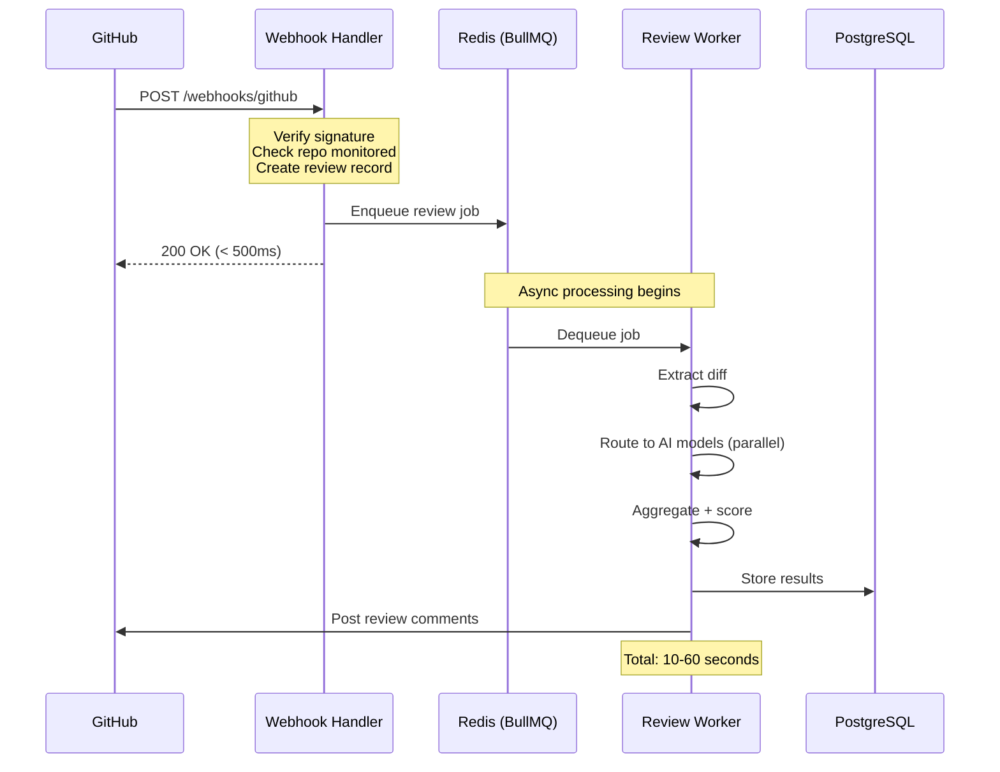
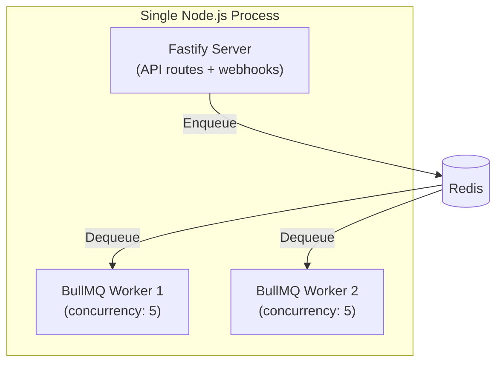
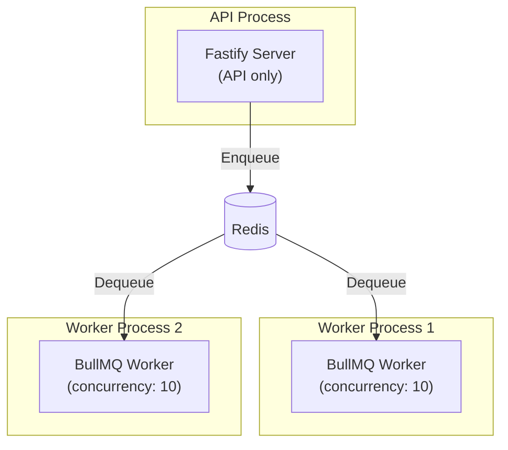
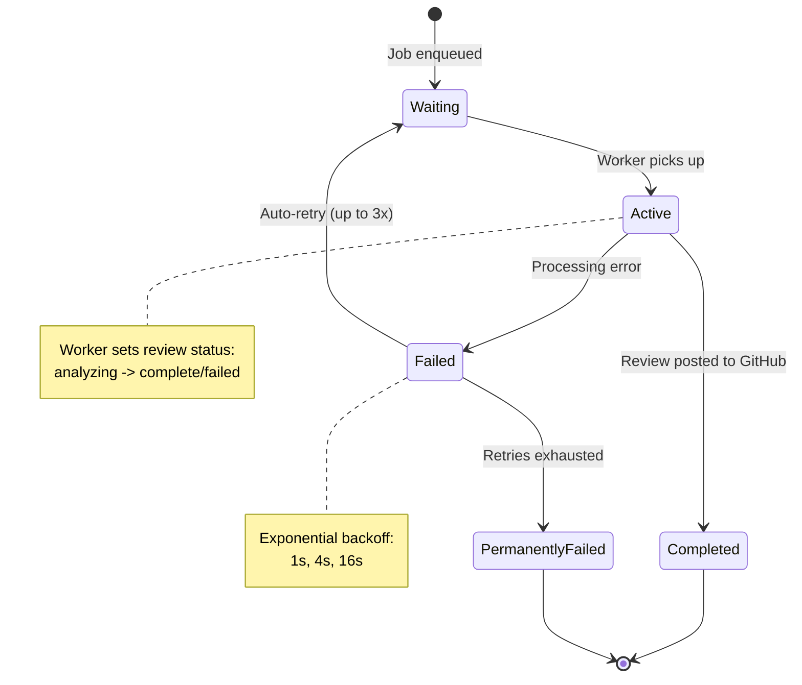
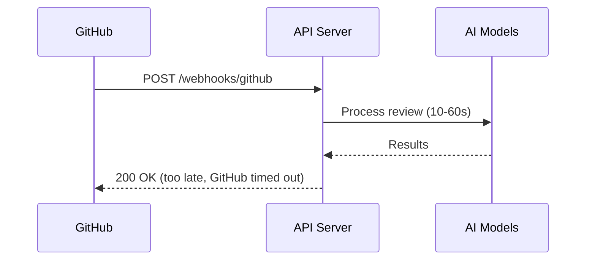

# ADR-002: Async Review Pipeline

**Status**: Accepted
**Date**: 2026-02-18
**Decision Makers**: Architect Agent
**Product**: CodeGuardian

---

## Context

When GitHub sends a PR webhook, CodeGuardian must process it and eventually post review comments back. The processing involves multiple AI model calls that can take 10-60 seconds. The webhook endpoint must respond quickly (GitHub expects a response within 10 seconds and will retry on timeout), but the actual review takes much longer.

**Constraints:**
- GitHub webhook timeout: 10 seconds (will retry 3x on failure)
- Target review time: < 60 seconds for diffs under 500 lines
- Must handle 100 concurrent reviews (NFR-006)
- Must not lose review jobs if the server restarts
- Dashboard needs to show review status to users

## Decision

**Use BullMQ (Redis-backed job queue) with embedded workers in the Fastify process for MVP. Webhook handler acknowledges immediately and enqueues the job. Workers process jobs asynchronously.**

### Architecture



### Why BullMQ?

| Feature | BullMQ | Bull | pg-boss | Custom Redis |
|---------|--------|------|---------|-------------|
| Redis-backed | Yes | Yes | No (PostgreSQL) | Yes |
| Job retry with backoff | Built-in | Built-in | Built-in | Manual |
| Concurrency control | Built-in | Built-in | Built-in | Manual |
| Job events/progress | Built-in | Built-in | Limited | Manual |
| Delayed jobs | Built-in | Built-in | Built-in | Manual |
| TypeScript support | Native | Partial | Good | Manual |
| Active maintenance | Very active | Maintenance mode | Active | N/A |
| Dashboard (Bull Board) | Compatible | Compatible | No | No |

BullMQ is the successor to Bull with better TypeScript support and is actively maintained. It uses Redis for persistence, which we already need for caching and rate limiting.

### Worker Embedding Strategy (MVP)

For MVP, workers run inside the same Fastify process:



When scaling is needed, workers can be extracted to a separate process without code changes:



### Job Schema

```typescript
interface ReviewJob {
  reviewId: string;          // UUID of the Review record
  repositoryId: string;      // UUID of the Repository
  installationId: string;    // GitHub App installation ID
  prNumber: number;
  headSha: string;
  baseBranch: string;
  headBranch: string;
}
```

### Job Lifecycle



### Review Status in Dashboard

The dashboard polls for review status via the REST API. No WebSocket/SSE needed for MVP.

```mermaid
flowchart LR
    subgraph "Dashboard (Browser)"
        POLL["Poll GET /api/reviews/:id<br/>every 5 seconds while<br/>status != complete|failed"]
    end

    subgraph "API"
        API["GET /api/reviews/:id"]
    end

    subgraph "Database"
        DB["reviews table<br/>(status column)"]
    end

    POLL -->|"HTTP"| API -->|"Query"| DB
    DB -->|"Status"| API -->|"JSON"| POLL
```

## Consequences

### Positive
- **Webhook reliability**: Always responds within 500ms; GitHub never retries
- **Job persistence**: BullMQ persists jobs in Redis; survives process restarts
- **Concurrency control**: BullMQ limits concurrent workers, preventing AI API overload
- **Retry handling**: Built-in exponential backoff for transient failures
- **Observability**: Job progress, failure reasons, and timing are tracked
- **Scalability path**: Workers can be extracted to separate processes without code changes
- **Simple MVP**: Embedded workers mean one process to deploy and monitor

### Negative
- **Redis dependency**: System requires Redis in addition to PostgreSQL
- **Polling overhead**: Dashboard polls for status instead of receiving push updates
- **Memory pressure**: Embedded workers share memory with the API server
- **Eventual consistency**: Review results are not instantly available after webhook

### Risks
- **Redis data loss**: Mitigated by enabling Redis persistence (AOF or RDB)
- **Worker memory leak**: Mitigated by BullMQ's process-level isolation and Node.js GC
- **Stuck jobs**: Mitigated by BullMQ's stalled job detection (default 30s timeout)

## Alternatives Considered

### Alternative A: Synchronous Processing

Process the review synchronously within the webhook handler.



- **Pros**: Simpler architecture, no queue needed
- **Cons**: GitHub webhook timeout (10s), blocks the event loop, no retry on failure
- **Rejected because**: Violates GitHub webhook contract and blocks the server for 10-60 seconds per review.

### Alternative B: WebSocket/SSE for Status Updates

Use WebSocket or Server-Sent Events instead of polling for dashboard status.

- **Pros**: Real-time updates without polling overhead
- **Cons**: Adds WebSocket/SSE infrastructure, connection management, reconnection logic
- **Rejected because**: Premature for MVP. Polling every 5 seconds is acceptable for a dashboard that refreshes periodically. WebSocket/SSE can be added in Phase 2 if users demand real-time status.

### Alternative C: PostgreSQL-backed Queue (pg-boss)

Use pg-boss instead of BullMQ, eliminating the Redis dependency.

- **Pros**: No Redis needed, job data in same database, transactional consistency
- **Cons**: PostgreSQL polling adds load, slower throughput than Redis, less mature ecosystem
- **Rejected because**: We already need Redis for rate limiting and session cache. BullMQ leverages that same Redis instance with higher throughput and better worker tooling.

### Alternative D: AWS SQS / Cloud Queue

Use a managed cloud queue service.

- **Pros**: Fully managed, auto-scaling, no infrastructure to maintain
- **Cons**: Vendor lock-in, adds latency (network hop to cloud service), cost for low volume
- **Rejected because**: Adds unnecessary cloud dependency and latency for MVP. BullMQ is simpler for a single-server deployment. Can migrate to SQS later if needed.

---

*This ADR will be revisited when scaling to multiple worker processes or considering cloud queue migration.*
