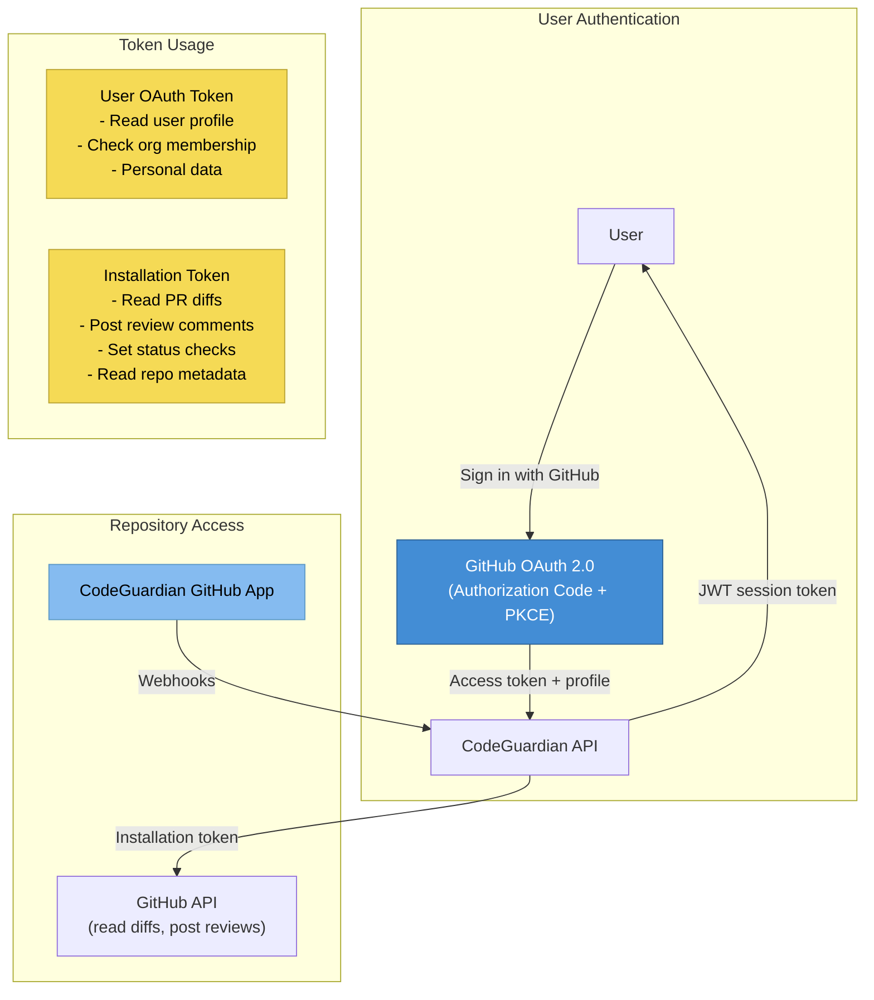
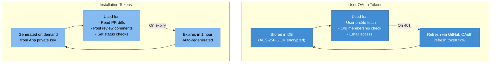
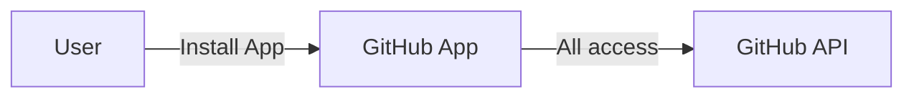
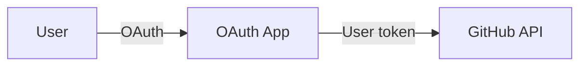

# ADR-003: GitHub Integration Approach

**Status**: Accepted
**Date**: 2026-02-18
**Decision Makers**: Architect Agent
**Product**: CodeGuardian

---

## Context

CodeGuardian must integrate with GitHub for three purposes:

1. **User authentication**: Users sign in with their GitHub identity
2. **Repository access**: Receive PR webhooks, read diffs, post review comments and status checks
3. **Installation management**: Users install CodeGuardian on their accounts/organizations

GitHub offers three integration mechanisms:

| Mechanism | Purpose | Token Type |
|-----------|---------|-----------|
| **OAuth App** | User authentication, access user data | User access token |
| **GitHub App** | Webhooks, repo access, PR comments, status checks | Installation access token |
| **Personal Access Token (PAT)** | Developer testing, scripts | User's PAT |

The question is which combination to use.

## Decision

**Use both a GitHub App and GitHub OAuth 2.0 together. The GitHub App handles repository access (webhooks, diffs, reviews). GitHub OAuth handles user identity (authentication, profile data).**

### Architecture: Dual Integration



### Why Both?

| Capability | OAuth App Only | GitHub App Only | Both (Chosen) |
|-----------|---------------|-----------------|---------------|
| User identity (login, email, avatar) | Yes | No (App tokens are not user-scoped) | Yes (via OAuth) |
| Webhooks from all repos | No (requires user token per repo) | Yes (App receives webhooks) | Yes (via App) |
| Post reviews on behalf of "CodeGuardian" bot | No (posts as user) | Yes (posts as App) | Yes (via App) |
| Status checks | No | Yes | Yes (via App) |
| Installation management (add/remove repos) | No | Yes | Yes (via App) |
| User's org membership | Yes | Partial (only installed orgs) | Yes (via OAuth) |
| Token refresh | Yes | Automatic (installation tokens expire in 1h) | Yes |

### GitHub App Permissions

| Permission | Access | Purpose |
|-----------|--------|---------|
| Pull requests | Read & Write | Read PR diffs, post review comments |
| Checks | Read & Write | Post status checks (pass/fail with score) |
| Contents | Read | Read file contents for context around diff |
| Metadata | Read | Repository and organization metadata |
| Members | Read | Org member list for team features |

### Webhook Events Subscribed

| Event | Actions | Purpose |
|-------|---------|---------|
| `pull_request` | opened, synchronize, reopened | Trigger code review |
| `installation` | created, deleted, suspend, unsuspend | Manage app installation lifecycle |
| `installation_repositories` | added, removed | Track which repos are accessible |

### OAuth Scopes

| Scope | Purpose |
|-------|---------|
| `read:user` | Read user profile (login, email, avatar) |
| `user:email` | Access user's email addresses |

### Token Management



### Installation Token Generation

GitHub App installation tokens are short-lived (1 hour) and generated by signing a JWT with the App's private key, then exchanging it for an installation token:

```typescript
// 1. Create a JWT signed with the App's private key
const jwt = createAppJWT(appId, privateKey); // 10 min expiry

// 2. Exchange JWT for an installation access token
const token = await github.apps.createInstallationAccessToken({
  installation_id: installationId,
  headers: { authorization: `Bearer ${jwt}` }
});
// token.token expires in 1 hour
```

## Consequences

### Positive
- **Clean separation of concerns**: User identity via OAuth, repo access via App
- **Bot identity**: Reviews appear from "CodeGuardian[bot]", not a user -- clear attribution
- **Granular permissions**: App permissions are tightly scoped per capability
- **Automatic webhook delivery**: GitHub routes webhooks to the App without per-repo configuration
- **Marketplace listing**: GitHub App can be listed on GitHub Marketplace for discovery
- **Installation management**: Users manage repos via GitHub's native UI
- **No user token for reviews**: Reviews work even if a user's OAuth token expires

### Negative
- **Two token types to manage**: OAuth tokens (encrypted in DB) and installation tokens (generated on demand)
- **App private key management**: The GitHub App private key must be stored securely (env var)
- **Dual registration**: Must register both an OAuth App and a GitHub App in GitHub settings
- **Complexity**: Two authentication flows to implement and maintain

### Risks
- **Private key exposure**: Mitigated by storing in environment variable, never in code or database
- **Installation token expiry**: Mitigated by generating tokens on demand (not caching) or caching with TTL check
- **OAuth token expiry**: Mitigated by automatic refresh using stored refresh token

## Alternatives Considered

### Alternative A: GitHub App Only (No OAuth)

Use the GitHub App for everything, including user identity.



- **Pros**: Single integration point, simpler setup
- **Cons**: GitHub App tokens are installation-scoped, not user-scoped. Cannot determine which user is logged in. Cannot access user's email or org memberships beyond installed orgs.
- **Rejected because**: We need user identity for the dashboard. GitHub App tokens do not represent a user -- they represent an installation.

### Alternative B: OAuth App Only (No GitHub App)

Use only OAuth for everything.



- **Pros**: Simpler (single flow), user-scoped access
- **Cons**: No webhook support (must poll for PR events), reviews posted as the user (not a bot), requires each user to grant broad repo access, no installation lifecycle management.
- **Rejected because**: Webhooks are essential for real-time review triggering. Posting reviews as a bot is cleaner than posting as the user.

### Alternative C: Personal Access Token (PAT) Based

Users provide a PAT with repo access.

- **Pros**: Simple to implement, no OAuth flow needed
- **Cons**: Security risk (PATs are long-lived), user experience is poor (copy-paste token), no webhook support, no Marketplace listing
- **Rejected because**: Unacceptable security and UX for a production SaaS product.

---

*This ADR is final for MVP. Phase 2 may add support for fine-grained PATs as an alternative authentication method for CI/CD integration.*
