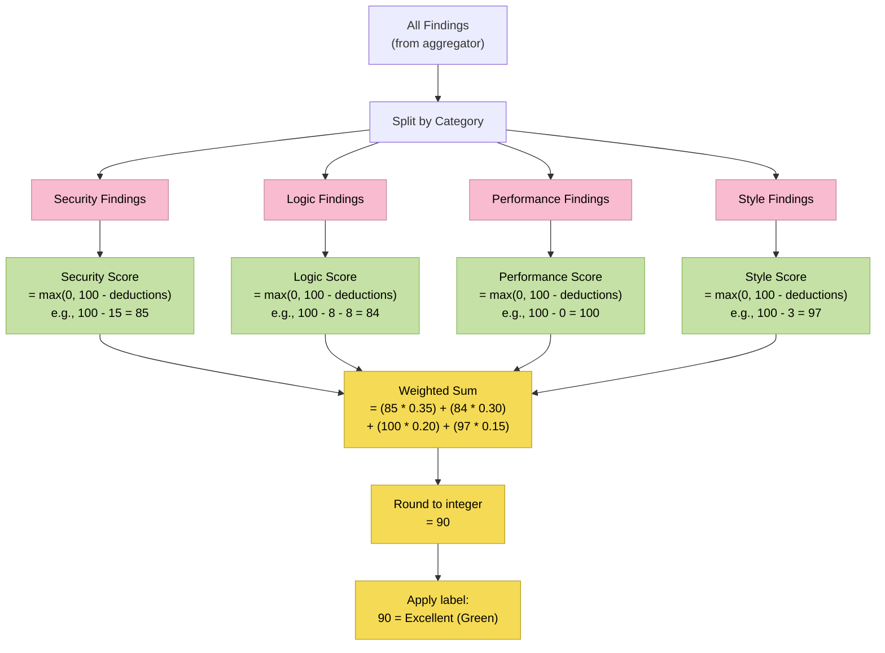
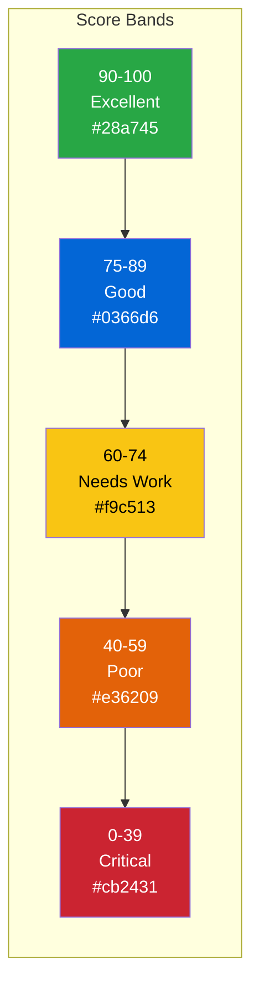

# ADR-004: Scoring Algorithm

**Status**: Accepted
**Date**: 2026-02-18
**Decision Makers**: Architect Agent
**Product**: CodeGuardian

---

## Context

Every reviewed PR needs a quality score that:

1. Is a single, easy-to-understand number (0-100)
2. Reflects quality across four dimensions: security, logic, performance, style
3. Is transparent -- users can see exactly how the score was calculated
4. Is deterministic -- same findings always produce the same score
5. Is configurable -- organizations can adjust weights and thresholds
6. Drives action -- the score should map to clear merge/no-merge guidance

## Decision

**Use a weighted deduction model: each category starts at 100, findings deduct points by severity, then categories are combined with configurable weights.**

### Formula

```
Total Score = round(
    (Security Score * 0.35) +
    (Logic Score    * 0.30) +
    (Performance Score * 0.20) +
    (Style Score    * 0.15)
)
```

Each category score:
```
Category Score = max(0, 100 - sum_of_deductions)
```

### Severity Deductions

| Severity | Points Deducted | Rationale |
|----------|----------------|-----------|
| Critical | -25 | Blocking: security vulnerabilities, data loss risks |
| High | -15 | Serious: logic errors, significant performance issues |
| Medium | -8 | Notable: should fix before merge |
| Low | -3 | Minor: nice to fix but not blocking |
| Info | 0 | Informational: no score impact |

### Category Weights

| Category | Weight | Rationale |
|----------|--------|-----------|
| Security | 35% | Highest weight: security issues have the most impact |
| Logic | 30% | Second: logic errors cause bugs in production |
| Performance | 20% | Third: performance matters but is less critical |
| Style | 15% | Lowest: style is important but least impactful |

### Score Calculation Flow



### Score Interpretation



| Range | Label | Color | GitHub Status | Merge Guidance |
|-------|-------|-------|---------------|---------------|
| 90-100 | Excellent | Green | Pass | Merge-ready |
| 75-89 | Good | Blue | Pass | Minor improvements recommended |
| 60-74 | Needs Work | Yellow | Configurable | Address findings before merge |
| 40-59 | Poor | Orange | Fail | Significant issues found |
| 0-39 | Critical | Red | Fail | Blocking issues, do not merge |

### GitHub Status Check Behavior

The GitHub status check (pass/fail) is determined by:

1. If `blockOnCritical` is true and any Critical-severity finding exists: **Fail** (regardless of score)
2. If the score is below the `scoreThreshold` (default 70): **Fail**
3. Otherwise: **Pass**

Status check description format:
```
CodeGuardian: 78/100 (Security: 85 | Logic: 72 | Performance: 100 | Style: 97)
```

### Worked Example

A PR has:
- 1 High security finding (SQL injection)
- 2 Medium logic findings (missing null checks)
- 1 Low style finding (unused import)

```
Security Score = max(0, 100 - 15) = 85
Logic Score    = max(0, 100 - 8 - 8) = 84
Perf Score     = max(0, 100 - 0) = 100
Style Score    = max(0, 100 - 3) = 97

Total = (85 * 0.35) + (84 * 0.30) + (100 * 0.20) + (97 * 0.15)
      = 29.75 + 25.20 + 20.00 + 14.55
      = 89.50
      = 90 (rounded)

Label: Excellent (Green)
Status: Pass (90 >= 70 threshold, no Critical findings)
```

### Edge Cases

| Scenario | Behavior |
|----------|----------|
| No findings | Score = 100, all categories = 100 |
| All categories at 0 | Score = 0 (many severe findings) |
| Only one category has findings | Other categories contribute their full weight at 100 |
| Dismissed findings | Excluded from score calculation |
| Skipped check types (model failure) | Category excluded from weighting; remaining categories normalized |

**Skipped category normalization:**

If the style model fails and style is skipped:
```
Adjusted weights: Security 41%, Logic 35%, Performance 24%
(original weights divided by sum of active weights: 0.35 + 0.30 + 0.20 = 0.85)
Security: 0.35 / 0.85 = 0.412
Logic:    0.30 / 0.85 = 0.353
Perf:     0.20 / 0.85 = 0.235
```

## Consequences

### Positive
- **Transparent**: Users can see exactly which findings affect which category and by how much
- **Deterministic**: Same findings always produce the same score
- **Intuitive**: 0-100 scale is universally understood; color coding provides instant recognition
- **Configurable**: Weights and thresholds adjustable per organization (Phase 2)
- **Actionable**: Score maps to clear merge guidance (pass/fail status check)
- **Fair**: Dismissed findings are excluded; skipped categories do not penalize

### Negative
- **Linear deductions**: A category with 5 Medium findings (40 points) looks worse than 1 High + 1 Medium (23 points), even if the High finding is more critical
- **No severity weighting within categories**: All Critical findings deduct the same regardless of actual risk
- **Fixed weights for MVP**: Cannot be customized per org until Phase 2
- **Score inflation on clean code**: A PR with only style issues can still score 85+ due to style's low weight

### Risks
- **Gamification**: Developers may focus on score rather than actual code quality. Mitigated by emphasizing findings over score in the dashboard.
- **False sense of security**: A 90+ score does not mean no issues exist (dismissed or info-level findings). Mitigated by always showing finding count alongside score.

## Alternatives Considered

### Alternative A: Multiplicative Scoring

```
Score = Security^0.35 * Logic^0.30 * Performance^0.20 * Style^0.15
```

- **Pros**: A zero in any category makes the total score very low (enforces all categories)
- **Cons**: Non-intuitive (what does "Security to the power of 0.35" mean?), hard to explain to users
- **Rejected because**: Transparency and explainability are more important than mathematical elegance.

### Alternative B: Finding Count-Based Scoring

```
Score = max(0, 100 - (critical_count * 30 + high_count * 15 + ...))
```

No category breakdown.

- **Pros**: Simpler calculation, no category weights needed
- **Cons**: No category-level visibility, cannot identify which area needs improvement
- **Rejected because**: Category breakdown is a key differentiator. Users need to know if their security is good but style needs work.

### Alternative C: Machine Learning-Based Scoring

Train a model on historical data to predict "code quality" from findings.

- **Pros**: Could capture non-linear relationships between findings and quality
- **Cons**: Black box (not explainable), requires training data, cold start problem
- **Rejected because**: Transparency is a core product value. Users must be able to understand and trust the score.

### Alternative D: Percentage-Based (Findings per Lines Changed)

```
Score = 100 * (1 - findings_count / lines_changed)
```

- **Pros**: Normalizes by diff size (large diffs with few issues score well)
- **Cons**: Does not differentiate severity, does not separate categories, a single Critical finding in 1000 lines scores 99.9%
- **Rejected because**: Severity differentiation is essential. A single SQL injection should tank the security score regardless of diff size.

---

*This ADR will be revisited when Phase 2 introduces customizable weights and per-organization scoring profiles.*
