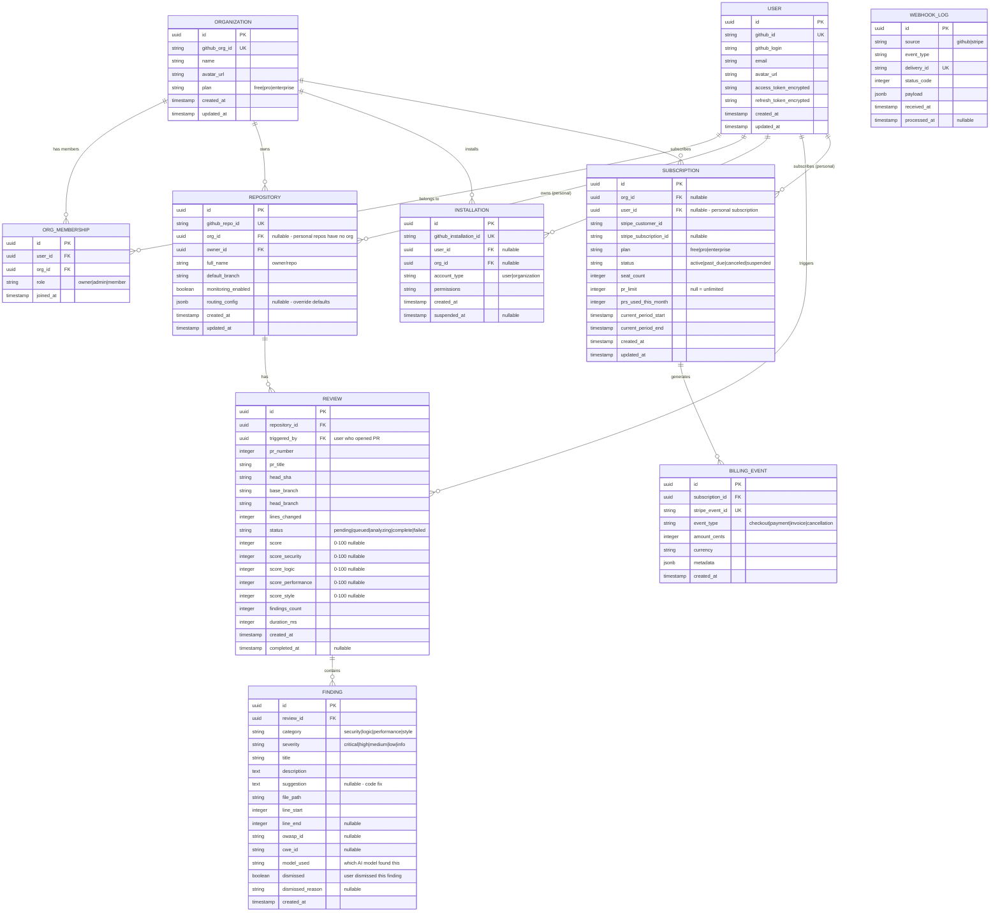

# CodeGuardian - Product Requirements Document

**Version**: 1.0
**Status**: Draft
**Last Updated**: 2026-02-18
**Product Manager**: Claude Product Manager
**Product**: CodeGuardian
**Ports**: Frontend 3115 | Backend API 5011

---

## 1. Executive Summary

### 1.1 Vision

CodeGuardian is a multi-model AI code review and security platform that routes different analysis checks -- logic, security, performance, and style -- to specialized AI models, then aggregates their findings into a unified, actionable review posted directly on GitHub pull requests. It is ConnectSW's DNA product: every other ConnectSW product is built with CodeGuardian reviewing its code.

### 1.2 Problem Statement

Modern development teams face three compounding problems:

1. **Code reviews are slow and inconsistent.** Human reviewers catch different issues depending on their expertise, fatigue, and workload. Studies show that reviewers miss 40-60% of defects, and reviews take an average of 4-8 hours of wall-clock time.
2. **Security vulnerabilities ship to production.** 83% of codebases contain at least one known vulnerability (Synopsys 2024). Most teams lack a dedicated security reviewer, and general-purpose code review tools treat security as an afterthought.
3. **Single-model AI tools have blind spots.** GitHub Copilot, Amazon CodeWhisperer, and similar tools use a single model for all tasks. A model fine-tuned for code generation may miss subtle security flaws. A security-focused model may not understand business logic. No single model excels at everything.

**The CodeGuardian Insight**: Different analysis tasks require different AI expertise. A multi-model ensemble -- where security checks go to a security-specialized model, logic checks to a reasoning model, performance checks to an optimization model -- produces higher-quality reviews than any single model alone.

### 1.3 Market Opportunity

| Metric | Value | Source |
|--------|-------|--------|
| DevSecOps market size (2025) | $7.2B | MarketsAndMarkets |
| DevSecOps CAGR | 28% | MarketsAndMarkets |
| GitHub Copilot subscribers | 1.8M+ | GitHub (2024) |
| Average cost of a production bug | $4,000-$25,000 | IBM Systems Sciences Institute |
| Teams using automated code review | 34% | GitLab DevSecOps Survey |

GitHub Copilot proved that developers will pay for AI tools. But Copilot assists with code *generation*, not code *review*. CodeGuardian fills the review gap with a differentiated multi-model approach.

### 1.4 Key Differentiators

1. **Multi-model ensemble**: Route each check type to the best-suited AI model, then aggregate results. No competitor does this.
2. **GitHub-native**: Reviews appear as native PR comments with inline suggestions, not a separate dashboard to check.
3. **Quantified quality**: Every PR gets a 0-100 quality score with transparent breakdown (security, logic, performance, style).
4. **Bottom-up adoption**: Individual developers install it on personal repos for free; teams upgrade when they see value.
5. **Dog-fooded internally**: ConnectSW uses CodeGuardian on all 9 products, proving it in production before selling it.

### 1.5 Success Metrics

**Business KPIs (6-month targets)**:

| Metric | Target | Measurement |
|--------|--------|-------------|
| GitHub App installs | 5,000 | GitHub Marketplace analytics |
| Monthly active repositories | 1,000 | Repos with at least 1 review/month |
| Reviews per day | 500 | Aggregated review count |
| Free-to-Pro conversion rate | 8% | Stripe subscription data |
| Monthly Recurring Revenue (MRR) | $50,000 | Stripe dashboard |
| Net Promoter Score (NPS) | >50 | Quarterly survey |

**Product KPIs**:

| Metric | Target | Measurement |
|--------|--------|-------------|
| Mean time to review (MTTR) | <60 seconds for <500 line diffs | Internal telemetry |
| Review accuracy (true positive rate) | >85% | User feedback on findings |
| False positive rate | <15% | "Dismiss" actions on findings |
| API uptime | 99.9% | Uptime monitoring |
| Time to first review (new user) | <5 minutes from install | Onboarding funnel analytics |
| Daily active users (DAU) | 2,000 | Auth + activity logs |

---

## 2. User Personas

### Persona 1: Alex - Individual Developer

**Demographics**:
- Age: 26
- Role: Full-stack developer at a 15-person startup
- Technical Skill: High (4 years experience)
- GitHub Activity: 10-15 PRs per week
- Current Tools: GitHub Copilot, ESLint, basic GitHub Actions CI

**Goals**:
- Get faster, more thorough code reviews (team is too small for dedicated reviewers)
- Catch security issues before they reach production
- Improve personal coding quality with objective feedback
- Reduce review turnaround time from hours to minutes

**Pain Points**:
- PRs sit unreviewed for 4-8 hours because teammates are busy
- Missed a SQL injection vulnerability last quarter that cost 2 days to fix in production
- ESLint catches syntax issues but not logic errors or security flaws
- No consistent quality standard across the team

**Usage Context**:
- Opens PRs multiple times per day
- Reads review comments on mobile during commute
- Values inline suggestions that are copy-paste ready
- Will pay out of pocket if the tool saves time

**What Alex Says**:
_"I want something that reviews my PR the moment I open it -- not tomorrow when my teammate has time. And I want it to catch the stuff ESLint misses."_

---

### Persona 2: Priya - Tech Lead

**Demographics**:
- Age: 34
- Role: Tech lead managing a team of 8 developers
- Technical Skill: Very high (10 years experience)
- GitHub Activity: Reviews 15-20 PRs per week, opens 5-8
- Current Tools: SonarQube, GitHub Actions, custom linting rules

**Goals**:
- Establish consistent code quality standards across the team
- Reduce time spent on repetitive review comments ("use const not let", "missing error handling")
- Focus human review time on architecture and design decisions
- Track team code quality trends over time

**Pain Points**:
- Spends 30% of her time reviewing PRs for issues AI could catch
- Junior developers repeat the same mistakes; she writes the same comments weekly
- SonarQube generates too many false positives, so the team ignores it
- No visibility into whether code quality is improving or declining over time

**Usage Context**:
- Reviews team PRs every morning (9-10 AM ritual)
- Needs dashboard to see team trends and identify coaching opportunities
- Wants to configure custom rules specific to the team's codebase
- Budget authority for tools under $500/month

**What Priya Says**:
_"I don't want to automate away code review -- I want to automate away the boring parts so I can focus on the interesting parts: architecture, patterns, and mentoring."_

---

### Persona 3: Marcus - Security Engineer

**Demographics**:
- Age: 38
- Role: Application Security Engineer at a 200-person fintech company
- Technical Skill: Expert in security, moderate in general development
- GitHub Activity: Reviews security-critical PRs (5-10 per week)
- Current Tools: Snyk, Semgrep, OWASP ZAP, manual pen testing

**Goals**:
- Catch OWASP Top 10 vulnerabilities before code merges
- Scan dependencies for known CVEs automatically
- Reduce the security review bottleneck (he is the only AppSec engineer)
- Generate compliance evidence for SOC 2 and ISO 27001 audits

**Pain Points**:
- Cannot review every PR; only reviews security-critical paths
- Snyk focuses on dependencies but misses application-level vulnerabilities
- Semgrep rules require constant maintenance and produce false positives
- Security findings from different tools are scattered across multiple dashboards
- Auditors ask for evidence that security reviews happen; he has no centralized trail

**Usage Context**:
- Configures security rules and thresholds, then monitors dashboards
- Needs severity ratings (Critical/High/Medium/Low) with OWASP/CWE references
- Wants to set "blocking" rules that prevent merge when critical issues are found
- Reports to CISO quarterly on security posture trends

**What Marcus Says**:
_"I need a security co-pilot that reviews every PR with security eyes, not just the ones I have time for. And I need the audit trail to prove it to the auditors."_

---

### Persona 4: Diana - VP of Engineering

**Demographics**:
- Age: 42
- Role: VP of Engineering at a 500-person SaaS company
- Technical Skill: Strategic (former developer, now management)
- GitHub Activity: Does not use GitHub directly
- Current Tools: Jira, LinearB, Pluralsight Flow

**Goals**:
- Reduce mean time to merge (MTTM) across 40 development teams
- Quantify code quality improvements for board reporting
- Justify engineering tool spend with measurable ROI
- Ensure security compliance across all teams without hiring 10 more AppSec engineers

**Pain Points**:
- No single metric for "code quality" across the organization
- Each team uses different linting rules, review standards, and tools
- Security team is a bottleneck; they cannot scale to 40 teams
- Board asks "is our code getting better?" and she has no data-driven answer
- Tool sprawl: 8 different code quality and security tools with no unified view

**Usage Context**:
- Views executive dashboard weekly (10 minutes)
- Needs org-wide and per-team quality scores, trends, and benchmarks
- Makes purchasing decisions based on ROI data
- Requires SSO (SAML/OIDC) and audit logs for enterprise compliance

**What Diana Says**:
_"Show me one dashboard with one score per team, trending over time. If that score correlates with fewer production incidents, I will buy it for every team in the company."_

---

## 3. System Architecture

### 3.1 C4 Context Diagram (Level 1)


### 3.2 C4 Container Diagram (Level 2)


---

## 4. Features

### 4.1 MVP Features (Phase 1)

#### F-001: GitHub OAuth Authentication

Users authenticate via GitHub OAuth to link their GitHub identity. No separate username/password.

**User Stories**:
- As Alex (developer), I want to sign in with my GitHub account so that I do not need to create a separate login.
- As Priya (tech lead), I want my team members to authenticate via GitHub so that repository permissions are automatically respected.

**Acceptance Criteria**:
- **Given** a user is on the CodeGuardian login page, **When** they click "Sign in with GitHub", **Then** they are redirected to GitHub OAuth authorization.
- **Given** a user authorizes CodeGuardian on GitHub, **When** the OAuth callback completes, **Then** a CodeGuardian account is created (if new) or linked (if existing) and a session is established.
- **Given** a user has an active session, **When** they visit any authenticated page, **Then** they see their GitHub avatar and username in the navigation bar.
- **Given** a user's GitHub token expires, **When** they make an API request, **Then** the system refreshes the token automatically or prompts re-authentication.

---

#### F-002: GitHub App Installation & Repository Selection

Users install the CodeGuardian GitHub App on their personal accounts or organizations, then select which repositories to monitor.

**User Stories**:
- As Alex (developer), I want to install CodeGuardian on my personal repos so that my PRs get reviewed automatically.
- As Priya (tech lead), I want to install CodeGuardian on our organization and select specific repos so that only production repos are monitored.

**Acceptance Criteria**:
- **Given** an authenticated user, **When** they navigate to the onboarding flow, **Then** they are prompted to install the CodeGuardian GitHub App.
- **Given** a user clicks "Install GitHub App", **When** they are redirected to GitHub, **Then** they can choose between "All repositories" and "Select repositories".
- **Given** the app is installed, **When** the installation webhook fires, **Then** CodeGuardian stores the installation ID, account type (user/org), and selected repositories.
- **Given** a user has installed the app, **When** they visit Settings > Repositories, **Then** they see all repositories the app has access to with toggle switches to enable/disable monitoring.

---

#### F-003: PR Webhook Listener & Diff Extraction

CodeGuardian listens for pull request events via GitHub webhooks, extracts the diff, and queues it for analysis.

**User Stories**:
- As Alex (developer), I want CodeGuardian to automatically start reviewing when I open or update a PR so that I do not need to trigger reviews manually.

**Acceptance Criteria**:
- **Given** a PR is opened on a monitored repository, **When** GitHub sends a `pull_request.opened` webhook, **Then** CodeGuardian extracts the diff and enqueues a review job within 5 seconds.
- **Given** a PR is updated with new commits, **When** GitHub sends a `pull_request.synchronize` webhook, **Then** CodeGuardian enqueues a new review job for the updated diff.
- **Given** a diff exceeds 2,000 lines, **When** the webhook is received, **Then** CodeGuardian splits the diff into chunks of 500 lines and processes them in parallel.
- **Given** a webhook signature is invalid, **When** the webhook endpoint receives the request, **Then** it returns 401 and does not process the payload.
- **Given** a PR is on a non-monitored repository, **When** the webhook fires, **Then** CodeGuardian acknowledges but does not process (returns 200, no job enqueued).

---

#### F-004: Multi-Model Routing Engine

The routing engine determines which AI model handles each check type based on configurable routing rules.

**User Stories**:
- As Priya (tech lead), I want security checks routed to a security-specialized model so that vulnerability detection is more accurate than a general-purpose model.
- As Marcus (security engineer), I want to configure which model handles security analysis so that I can choose the model with the best detection rate for our stack.

**Acceptance Criteria**:
- **Given** a review job is dequeued, **When** the router processes it, **Then** it splits the diff into check categories (security, logic, performance, style) and routes each to the configured model.
- **Given** the default routing configuration, **When** a security check is routed, **Then** it is sent to the model configured for security analysis (default: Claude Sonnet).
- **Given** a model provider returns an error, **When** the router receives the error, **Then** it retries once with exponential backoff, then falls back to the secondary model for that check type.
- **Given** routing rules are updated in the dashboard, **When** the next review runs, **Then** the updated routing rules are used.
- **Given** multiple check types are routed in parallel, **When** all models respond, **Then** the total latency is approximately equal to the slowest individual model response (parallel execution, not sequential).

**Routing Configuration Schema**:
```
Check Type -> Primary Model -> Fallback Model -> Timeout (seconds)
security   -> claude-sonnet  -> gpt-4o         -> 30
logic      -> claude-opus    -> claude-sonnet   -> 45
performance-> gpt-4o         -> claude-sonnet   -> 30
style      -> claude-haiku   -> gpt-4o-mini    -> 15
```

---

#### F-005: Review Comment Generation with Inline Suggestions

After analysis, CodeGuardian posts findings as native GitHub PR review comments with inline code suggestions.

**User Stories**:
- As Alex (developer), I want review comments posted directly on the PR diff lines so that I can see issues in context without switching tools.
- As Alex (developer), I want actionable suggestions (not just "this is wrong") so that I can fix issues with one click.

**Acceptance Criteria**:
- **Given** the aggregator has produced findings, **When** the review is posted, **Then** each finding is posted as an inline comment on the exact diff line where the issue occurs.
- **Given** a finding includes a fix suggestion, **When** the comment is posted, **Then** it uses GitHub's suggestion syntax (` ```suggestion `) so the developer can apply it with one click.
- **Given** a review produces 0 findings, **When** the review is posted, **Then** a single summary comment is posted: "CodeGuardian found no issues. Score: [X]/100."
- **Given** a review produces findings, **When** the summary comment is posted, **Then** it includes: total findings count by severity, quality score, and a breakdown by category (security, logic, performance, style).
- **Given** a finding has severity "Critical" or "High", **When** the review is posted, **Then** the PR status check is set to "failure" (blocking merge, if configured).

---

#### F-006: Code Quality Scoring (0-100)

Every reviewed PR receives a composite quality score from 0 to 100 with a transparent breakdown.

**User Stories**:
- As Alex (developer), I want a single score so I can quickly gauge PR quality without reading every comment.
- As Priya (tech lead), I want a score breakdown so I can identify which quality dimension needs the most improvement.
- As Diana (VP), I want team-level average scores so I can compare and benchmark teams.

**Acceptance Criteria**:
- **Given** a review is complete, **When** the score is calculated, **Then** it is a weighted sum: Security (35%) + Logic (30%) + Performance (20%) + Style (15%).
- **Given** a PR has 0 findings, **When** the score is calculated, **Then** the score is 100.
- **Given** a PR has Critical findings, **When** the score is calculated, **Then** Critical findings deduct 25 points each from the relevant category, capped at reducing that category to 0.
- **Given** a PR has High findings, **When** the score is calculated, **Then** High findings deduct 15 points each from the relevant category.
- **Given** a PR has Medium findings, **When** the score is calculated, **Then** Medium findings deduct 8 points each.
- **Given** a PR has Low findings, **When** the score is calculated, **Then** Low findings deduct 3 points each.
- **Given** a score is calculated, **When** it is posted to GitHub, **Then** the PR status check shows: "CodeGuardian: [Score]/100 (Security: [X] | Logic: [X] | Performance: [X] | Style: [X])".

---

#### F-007: Security Vulnerability Detection (OWASP Top 10)

CodeGuardian detects security vulnerabilities mapped to OWASP Top 10 categories and CWE identifiers.

**User Stories**:
- As Marcus (security engineer), I want every PR scanned for OWASP Top 10 vulnerabilities so that common security issues are caught before merge.
- As Marcus (security engineer), I want findings mapped to CWE identifiers so that I can cross-reference with our vulnerability management system.

**Acceptance Criteria**:
- **Given** a diff contains a SQL query built with string concatenation, **When** the security model analyzes it, **Then** it flags it as "A03:2021 - Injection" with CWE-89.
- **Given** a diff contains hardcoded credentials (API keys, passwords, tokens), **When** the security model analyzes it, **Then** it flags it as "A07:2021 - Identification and Authentication Failures" with CWE-798.
- **Given** a diff adds a dependency, **When** the security model analyzes it, **Then** it checks the dependency against known CVE databases and flags any with severity >= Medium.
- **Given** a security finding is Critical, **When** the review is posted, **Then** the finding includes: OWASP category, CWE ID, severity, description, remediation guidance, and a code suggestion for the fix.
- **Given** a diff has no security issues, **When** the security analysis completes, **Then** the security category score is 100.

**OWASP Top 10 (2021) Coverage**:

| OWASP ID | Category | Detection Method |
|----------|----------|------------------|
| A01:2021 | Broken Access Control | Missing auth checks, IDOR patterns |
| A02:2021 | Cryptographic Failures | Weak algorithms, hardcoded keys |
| A03:2021 | Injection | SQL/NoSQL/OS/LDAP injection patterns |
| A04:2021 | Insecure Design | Missing input validation, unsafe defaults |
| A05:2021 | Security Misconfiguration | Debug modes, default credentials |
| A06:2021 | Vulnerable Components | Known CVEs in dependencies |
| A07:2021 | Auth Failures | Hardcoded credentials, weak auth |
| A08:2021 | Data Integrity Failures | Deserialization, unsigned updates |
| A09:2021 | Logging Failures | Missing audit logs, PII in logs |
| A10:2021 | SSRF | Unvalidated URL inputs |

---

#### F-008: Dashboard - Review History & Team Analytics

A web dashboard showing review history, team statistics, and quality trend charts.

**User Stories**:
- As Alex (developer), I want to see my review history so that I can track my improvement over time.
- As Priya (tech lead), I want team-level analytics so that I can identify patterns and coaching opportunities.
- As Diana (VP), I want organization-wide trend charts so that I can report code quality metrics to the board.

**Acceptance Criteria**:
- **Given** an authenticated user, **When** they visit `/dashboard`, **Then** they see: total reviews (last 30 days), average score, top issues, and a score trend line chart.
- **Given** a tech lead with team members, **When** they visit `/dashboard/team`, **Then** they see: per-member review counts, average scores, most common issue types, and team score trend.
- **Given** a user clicks on a specific review, **When** the review detail page loads, **Then** they see: PR title, score, all findings with severity, the diff with annotations, and a link to the GitHub PR.
- **Given** a user selects a date range, **When** the dashboard updates, **Then** all metrics reflect only the selected period.
- **Given** an organization has 5+ repositories, **When** the VP views the org dashboard, **Then** they see a per-repo quality score comparison chart.

---

#### F-009: Billing - Free / Pro / Enterprise Tiers

Subscription management with Stripe integration supporting three pricing tiers.

**User Stories**:
- As Alex (developer), I want to use CodeGuardian for free on personal projects so that I can evaluate it before paying.
- As Priya (tech lead), I want to upgrade to Pro for my team so that we get unlimited reviews and team analytics.
- As Diana (VP), I want Enterprise features (SSO, audit logs, custom models) so that the platform meets our compliance requirements.

**Acceptance Criteria**:
- **Given** a new user signs up, **When** their account is created, **Then** they are on the Free tier by default.
- **Given** a Free tier user, **When** they exceed 5 PR reviews in a calendar month, **Then** subsequent PRs are queued but not reviewed until the next month (with a notification).
- **Given** a user clicks "Upgrade to Pro", **When** they enter payment details via Stripe Checkout, **Then** their subscription activates immediately and they can review unlimited PRs.
- **Given** a Pro user, **When** they cancel their subscription, **Then** they retain Pro features until the end of the current billing cycle, then revert to Free.
- **Given** an Enterprise prospect, **When** they click "Contact Sales", **Then** a form is submitted and the sales team is notified via email.

---

### 4.2 Phase 2 Features

| Feature | Description | Target |
|---------|-------------|--------|
| Auto-fix Suggestions | One-click apply for suggested fixes with auto-commit | Q3 2026 |
| Custom Rules Engine | Define organization-specific rules in YAML/JSON | Q3 2026 |
| IDE Plugins | VS Code and JetBrains plugins for pre-commit reviews | Q4 2026 |
| GitLab Support | Extend webhook and review posting to GitLab MRs | Q4 2026 |
| Bitbucket Support | Extend webhook and review posting to Bitbucket PRs | Q4 2026 |
| Slack/Teams Integration | Post review summaries to team channels | Q3 2026 |
| Custom Model Training | Fine-tune models on organization's codebase patterns | Q4 2026 |

### 4.3 Future Features

| Feature | Description | Target |
|---------|-------------|--------|
| AI-Powered Refactoring | Full-file or multi-file refactoring suggestions | 2027 |
| Codebase Health Monitoring | Continuous scanning of entire codebase (not just diffs) | 2027 |
| Compliance Reports | SOC 2, ISO 27001, HIPAA compliance evidence generation | 2027 |
| API Security Testing | Dynamic analysis of API endpoints from code | 2027 |
| Dependency Update PRs | Auto-generate PRs to update vulnerable dependencies | 2027 |
| Technical Debt Tracking | Quantify and prioritize technical debt across repos | 2027 |

---

## 5. User Flows

### 5.1 New User Onboarding Flow


### 5.2 PR Review Flow (Core Loop)


### 5.3 Team Lead Dashboard Flow


---

## 6. Sequence Diagrams

### 6.1 PR Review Processing (End-to-End)


### 6.2 GitHub OAuth Authentication Flow


### 6.3 Subscription Upgrade Flow


---

## 7. State Diagram

### 7.1 Review Lifecycle


### 7.2 Subscription Lifecycle


---

## 8. Data Model

### 8.1 Entity-Relationship Diagram



---

## 9. Functional Requirements

| ID | Requirement | Priority | Feature |
|----|-------------|----------|---------|
| FR-001 | System SHALL authenticate users via GitHub OAuth 2.0 (authorization code flow with PKCE). | Must | F-001 |
| FR-002 | System SHALL store GitHub access tokens encrypted at rest using AES-256-GCM. | Must | F-001 |
| FR-003 | System SHALL automatically refresh expired GitHub tokens using the stored refresh token. | Must | F-001 |
| FR-004 | System SHALL support GitHub App installation on personal accounts and organizations. | Must | F-002 |
| FR-005 | System SHALL allow users to select specific repositories for monitoring after app installation. | Must | F-002 |
| FR-006 | System SHALL enable/disable repository monitoring via a toggle in Settings. | Must | F-002 |
| FR-007 | System SHALL listen for `pull_request.opened` and `pull_request.synchronize` webhook events. | Must | F-003 |
| FR-008 | System SHALL validate all incoming webhooks using HMAC-SHA256 signature verification. | Must | F-003 |
| FR-009 | System SHALL extract the full diff from the GitHub API for each PR event. | Must | F-003 |
| FR-010 | System SHALL split diffs exceeding 2,000 lines into chunks of 500 lines for parallel processing. | Should | F-003 |
| FR-011 | System SHALL route analysis checks to specialized AI models based on configurable routing rules. | Must | F-004 |
| FR-012 | System SHALL execute all model checks in parallel to minimize latency. | Must | F-004 |
| FR-013 | System SHALL retry failed model calls once with exponential backoff, then fall back to a secondary model. | Must | F-004 |
| FR-014 | System SHALL allow administrators to configure model routing rules per organization. | Should | F-004 |
| FR-015 | System SHALL post review findings as inline comments on the exact diff lines in GitHub PRs. | Must | F-005 |
| FR-016 | System SHALL use GitHub suggestion syntax for fix suggestions (` ```suggestion `). | Must | F-005 |
| FR-017 | System SHALL post a summary comment with total findings, score, and category breakdown. | Must | F-005 |
| FR-018 | System SHALL set a GitHub status check (pass/fail) based on configurable score thresholds. | Must | F-005 |
| FR-019 | System SHALL calculate a quality score (0-100) as a weighted sum: Security 35%, Logic 30%, Performance 20%, Style 15%. | Must | F-006 |
| FR-020 | System SHALL deduct points per finding based on severity: Critical -25, High -15, Medium -8, Low -3. | Must | F-006 |
| FR-021 | System SHALL detect OWASP Top 10 (2021) vulnerability categories in code diffs. | Must | F-007 |
| FR-022 | System SHALL map security findings to CWE identifiers. | Must | F-007 |
| FR-023 | System SHALL scan added dependencies against known CVE databases. | Should | F-007 |
| FR-024 | System SHALL provide a dashboard with review history, score trends, and finding breakdowns. | Must | F-008 |
| FR-025 | System SHALL support date range filtering on all dashboard metrics. | Must | F-008 |
| FR-026 | System SHALL provide team-level analytics showing per-member and per-repo metrics. | Must | F-008 |
| FR-027 | System SHALL support three subscription tiers: Free (5 PRs/month), Pro ($49/user/month, unlimited), Enterprise ($199/user/month). | Must | F-009 |
| FR-028 | System SHALL integrate with Stripe for payment processing and subscription management. | Must | F-009 |
| FR-029 | System SHALL enforce PR review limits based on the user's subscription tier. | Must | F-009 |
| FR-030 | System SHALL handle Stripe webhook events for subscription lifecycle management. | Must | F-009 |
| FR-031 | System SHALL provide a webhook event log for debugging and auditing. | Should | F-003 |
| FR-032 | System SHALL support organization-level and personal subscriptions independently. | Must | F-009 |

---

## 10. Non-Functional Requirements

### 10.1 Performance

| ID | Requirement | Metric |
|----|-------------|--------|
| NFR-001 | Review of a diff under 500 lines SHALL complete in under 60 seconds. | p95 latency |
| NFR-002 | Review of a diff between 500-2000 lines SHALL complete in under 120 seconds. | p95 latency |
| NFR-003 | Webhook endpoint SHALL respond within 500ms (acknowledgment only). | p99 latency |
| NFR-004 | Dashboard pages SHALL load in under 2 seconds (first contentful paint). | Lighthouse |
| NFR-005 | API endpoints SHALL respond within 200ms for read operations. | p95 latency |
| NFR-006 | System SHALL support 100 concurrent review jobs. | Load test |

### 10.2 Availability & Reliability

| ID | Requirement | Metric |
|----|-------------|--------|
| NFR-007 | System SHALL maintain 99.9% uptime (less than 8.76 hours downtime per year). | Uptime monitor |
| NFR-008 | System SHALL recover from single-component failures without data loss. | Chaos test |
| NFR-009 | System SHALL queue review jobs during outages and process them on recovery. | Integration test |
| NFR-010 | Database SHALL be backed up daily with point-in-time recovery capability. | Backup verification |

### 10.3 Security

| ID | Requirement | Metric |
|----|-------------|--------|
| NFR-011 | All API endpoints SHALL require authentication (except health check and webhooks). | Security audit |
| NFR-012 | All data in transit SHALL use TLS 1.2+. | SSL test |
| NFR-013 | All secrets (tokens, API keys) SHALL be encrypted at rest using AES-256-GCM. | Code review |
| NFR-014 | System SHALL implement rate limiting: 100 requests/minute per user, 1000/minute per organization. | Load test |
| NFR-015 | System SHALL log all authentication events for audit purposes. | Log review |
| NFR-016 | GitHub webhook payloads SHALL be verified using HMAC-SHA256 before processing. | Unit test |

### 10.4 Scalability

| ID | Requirement | Metric |
|----|-------------|--------|
| NFR-017 | System SHALL scale horizontally by adding worker instances. | Architecture review |
| NFR-018 | Database queries SHALL use indexes; no query SHALL exceed 100ms at 1M rows. | Query plan analysis |
| NFR-019 | Redis queue SHALL handle 10,000 pending jobs without degradation. | Load test |

---

## 11. API Overview

### 11.1 Authentication

All API endpoints (except webhooks and health check) require a valid JWT in the `Authorization` header:

```
Authorization: Bearer <jwt_token>
```

### 11.2 Key Endpoints

#### POST /auth/github/redirect

Initiates the GitHub OAuth flow.

**Request**: None (GET redirect)

**Response**: 302 Redirect to GitHub

---

#### GET /auth/github/callback

Handles the OAuth callback from GitHub.

**Request (Query)**:
```json
{
  "code": "abc123",
  "state": "random-state-string"
}
```

**Response (200)**:
```json
{
  "token": "eyJhbGciOiJIUzI1NiIs...",
  "user": {
    "id": "uuid",
    "githubLogin": "alexdev",
    "email": "alex@example.com",
    "avatarUrl": "https://avatars.githubusercontent.com/u/123"
  }
}
```

---

#### POST /webhooks/github

Receives GitHub webhook events for PR activity.

**Request Headers**:
```
X-Hub-Signature-256: sha256=abc123...
X-GitHub-Event: pull_request
X-GitHub-Delivery: uuid
```

**Request Body** (pull_request event):
```json
{
  "action": "opened",
  "number": 42,
  "pull_request": {
    "title": "Add user authentication",
    "head": { "sha": "abc123", "ref": "feature/auth" },
    "base": { "ref": "main" }
  },
  "repository": {
    "id": 123456,
    "full_name": "acme/webapp"
  },
  "installation": {
    "id": 789
  }
}
```

**Response (200)**:
```json
{
  "status": "accepted",
  "reviewId": "uuid"
}
```

**Error Responses**:
- 401: Invalid webhook signature
- 404: Repository not monitored
- 429: Rate limit exceeded

---

#### GET /api/reviews

List reviews for the authenticated user's repositories.

**Request (Query)**:
```
?repo=acme/webapp&status=complete&from=2026-01-01&to=2026-02-18&page=1&limit=20
```

**Response (200)**:
```json
{
  "reviews": [
    {
      "id": "uuid",
      "repository": "acme/webapp",
      "prNumber": 42,
      "prTitle": "Add user authentication",
      "status": "complete",
      "score": 78,
      "scoreBreakdown": {
        "security": 90,
        "logic": 72,
        "performance": 80,
        "style": 65
      },
      "findingsCount": 7,
      "durationMs": 34200,
      "createdAt": "2026-02-18T10:30:00Z",
      "completedAt": "2026-02-18T10:30:34Z"
    }
  ],
  "pagination": {
    "page": 1,
    "limit": 20,
    "total": 156,
    "pages": 8
  }
}
```

---

#### GET /api/reviews/:id

Get detailed review with all findings.

**Response (200)**:
```json
{
  "id": "uuid",
  "repository": "acme/webapp",
  "prNumber": 42,
  "prTitle": "Add user authentication",
  "status": "complete",
  "score": 78,
  "scoreBreakdown": {
    "security": 90,
    "logic": 72,
    "performance": 80,
    "style": 65
  },
  "findings": [
    {
      "id": "uuid",
      "category": "security",
      "severity": "high",
      "title": "SQL Injection Vulnerability",
      "description": "User input is concatenated directly into SQL query without parameterization.",
      "suggestion": "const result = await db.query('SELECT * FROM users WHERE id = $1', [userId]);",
      "filePath": "src/routes/users.ts",
      "lineStart": 42,
      "lineEnd": 42,
      "owaspId": "A03:2021",
      "cweId": "CWE-89",
      "modelUsed": "claude-sonnet",
      "dismissed": false
    }
  ],
  "metadata": {
    "headSha": "abc123",
    "baseBranch": "main",
    "headBranch": "feature/auth",
    "linesChanged": 347,
    "filesChanged": 12,
    "durationMs": 34200,
    "modelsUsed": ["claude-sonnet", "claude-opus", "gpt-4o", "claude-haiku"]
  }
}
```

---

#### GET /api/dashboard/stats

Get dashboard statistics for the authenticated user.

**Request (Query)**:
```
?from=2026-01-01&to=2026-02-18&orgId=uuid
```

**Response (200)**:
```json
{
  "period": {
    "from": "2026-01-01",
    "to": "2026-02-18"
  },
  "summary": {
    "totalReviews": 156,
    "averageScore": 82,
    "totalFindings": 423,
    "criticalFindings": 3,
    "highFindings": 28,
    "mediumFindings": 167,
    "lowFindings": 225
  },
  "trends": {
    "scoreHistory": [
      { "date": "2026-01-01", "averageScore": 74 },
      { "date": "2026-01-08", "averageScore": 77 },
      { "date": "2026-01-15", "averageScore": 80 },
      { "date": "2026-01-22", "averageScore": 82 }
    ],
    "reviewsPerWeek": [
      { "week": "2026-W01", "count": 32 },
      { "week": "2026-W02", "count": 38 },
      { "week": "2026-W03", "count": 41 },
      { "week": "2026-W04", "count": 45 }
    ]
  },
  "topIssues": [
    { "title": "Missing error handling", "category": "logic", "count": 45 },
    { "title": "Unused variables", "category": "style", "count": 38 },
    { "title": "N+1 query pattern", "category": "performance", "count": 22 }
  ]
}
```

---

#### POST /api/billing/checkout-session

Create a Stripe Checkout session for subscription upgrade.

**Request Body**:
```json
{
  "plan": "pro",
  "seats": 8,
  "orgId": "uuid"
}
```

**Response (200)**:
```json
{
  "checkoutUrl": "https://checkout.stripe.com/c/pay/cs_test_abc123",
  "sessionId": "cs_test_abc123"
}
```

---

#### GET /api/repositories

List repositories the authenticated user has access to.

**Response (200)**:
```json
{
  "repositories": [
    {
      "id": "uuid",
      "fullName": "acme/webapp",
      "monitoringEnabled": true,
      "lastReviewAt": "2026-02-18T10:30:00Z",
      "reviewCount": 42,
      "averageScore": 81
    }
  ]
}
```

---

#### PUT /api/repositories/:id/settings

Update repository monitoring settings.

**Request Body**:
```json
{
  "monitoringEnabled": true,
  "routingConfig": {
    "security": { "primaryModel": "claude-sonnet", "fallbackModel": "gpt-4o", "timeoutSeconds": 30 },
    "logic": { "primaryModel": "claude-opus", "fallbackModel": "claude-sonnet", "timeoutSeconds": 45 },
    "performance": { "primaryModel": "gpt-4o", "fallbackModel": "claude-sonnet", "timeoutSeconds": 30 },
    "style": { "primaryModel": "claude-haiku", "fallbackModel": "gpt-4o-mini", "timeoutSeconds": 15 }
  },
  "scoreThreshold": 70,
  "blockOnCritical": true
}
```

**Response (200)**:
```json
{
  "id": "uuid",
  "fullName": "acme/webapp",
  "monitoringEnabled": true,
  "routingConfig": { "..." : "..." },
  "scoreThreshold": 70,
  "blockOnCritical": true,
  "updatedAt": "2026-02-18T12:00:00Z"
}
```

---

## 12. Revenue Model

### 12.1 Pricing Tiers

| Feature | Free | Pro ($49/user/mo) | Enterprise ($199/user/mo) |
|---------|------|-------------------|---------------------------|
| PR reviews per month | 5 | Unlimited | Unlimited |
| Repositories | 1 | Unlimited | Unlimited |
| AI models used | 2 (basic) | 4 (full ensemble) | 4 + custom models |
| Review types | Security + Style | All 4 categories | All 4 + custom rules |
| Quality scoring | Basic (pass/fail) | Full 0-100 breakdown | Full + benchmarking |
| Dashboard | Personal only | Team analytics | Org-wide + executive |
| Inline suggestions | Yes | Yes | Yes |
| Custom routing rules | No | No | Yes |
| SSO (SAML/OIDC) | No | No | Yes |
| Audit logs | No | No | Yes |
| Priority support | Community | Email (24h SLA) | Dedicated CSM + Slack |
| SLA | Best effort | 99.9% uptime | 99.95% uptime |
| Data retention | 30 days | 1 year | Unlimited |

### 12.2 Revenue Projections (6-Month)

| Month | Free Users | Pro Users | Enterprise Users | MRR |
|-------|-----------|-----------|------------------|-----|
| 1 | 500 | 20 | 0 | $980 |
| 2 | 1,200 | 60 | 2 | $3,338 |
| 3 | 2,500 | 150 | 5 | $8,345 |
| 4 | 4,000 | 300 | 10 | $16,690 |
| 5 | 6,000 | 500 | 18 | $28,082 |
| 6 | 8,000 | 750 | 30 | $42,720 |

**Assumptions**: 8% free-to-pro conversion, 0.5% free-to-enterprise conversion, average 1.2 seats/pro account, average 8 seats/enterprise account.

### 12.3 Unit Economics

| Metric | Value |
|--------|-------|
| Cost per review (AI API calls) | ~$0.08 (4 models, avg 500 lines) |
| Free tier cost per user/month | ~$0.40 (5 reviews) |
| Pro tier margin | ~87% ($49 revenue, ~$6.40 cost at 80 reviews/user/month) |
| Enterprise tier margin | ~91% ($199 revenue, ~$18 cost at higher volume) |
| Breakeven | ~200 Pro users |

---

## 13. Out of Scope (MVP)

The following are explicitly NOT included in the MVP release:

| Excluded Feature | Reason | Target Phase |
|------------------|--------|--------------|
| GitLab / Bitbucket support | Focus on GitHub first where 90% of target users are | Phase 2 |
| IDE plugins (VS Code, JetBrains) | Pre-commit review is a different workflow; PR review first | Phase 2 |
| Auto-fix with auto-commit | Requires higher confidence; manual apply first | Phase 2 |
| Custom rule creation by users | Complex UX; built-in rules cover 80% of cases | Phase 2 |
| On-premises deployment | Cloud-only for MVP; enterprise customers may request | Future |
| Mobile app | Dashboard is desktop-first; mobile web is sufficient | Future |
| Multi-language support (UI) | English only for MVP | Future |
| AI model fine-tuning on customer data | Requires significant ML infrastructure | Future |
| Compliance report generation | Needs SOC 2 / ISO 27001 mapping framework | Future |
| Monorepo-aware reviews | Detecting monorepo structure adds complexity | Phase 2 |
| Review of draft PRs | Only reviews PRs marked as "ready for review" | Phase 2 |
| Self-hosted AI models | Requires GPU infrastructure management | Future |

---

## 14. Risks & Mitigations

### 14.1 Technical Risks

| Risk | Probability | Impact | Mitigation |
|------|-------------|--------|------------|
| AI model latency causes reviews to exceed 60s target | Medium | High | Parallel execution, aggressive timeouts, caching of common patterns. Pre-warm model connections. |
| AI model providers change pricing or rate limits | Medium | High | Multi-provider strategy. No single-provider dependency. Cost monitoring alerts at 80% budget. |
| False positives erode developer trust | High | Critical | Feedback loop ("dismiss" button), model prompt tuning, weekly false-positive rate monitoring. Target <15% FP rate. |
| GitHub API rate limiting during high-traffic periods | Medium | Medium | Token pooling across installations, request batching, exponential backoff. Cache GitHub responses (diffs, PRs). |
| Webhook delivery failures from GitHub | Low | Medium | GitHub retries webhooks 3x. CodeGuardian also polls for missed events every 5 minutes. |

### 14.2 Business Risks

| Risk | Probability | Impact | Mitigation |
|------|-------------|--------|------------|
| GitHub ships native multi-model review feature | Low | Critical | Move faster. Differentiate with scoring, dashboards, and ensemble approach. Build switching cost through analytics history. |
| Free tier costs exceed revenue from paid tiers | Medium | High | Monitor cost per free user. Adjust free tier limits (reduce from 5 to 3 PRs if needed). Convert aggressively. |
| Enterprise sales cycle too long (>6 months) | Medium | Medium | Bottom-up adoption: individual devs and teams adopt first, then enterprise procurement follows. |
| Competitors (Snyk Code, SonarQube AI) add similar features | High | Medium | Multi-model ensemble is hard to replicate. Focus on developer experience and GitHub-native integration. |

### 14.3 User Adoption Risks

| Risk | Probability | Impact | Mitigation |
|------|-------------|--------|------------|
| Developers find review comments annoying/noisy | Medium | High | Smart defaults: suppress Low-severity findings by default. Allow per-repo configuration. "Quiet mode" option. |
| Time-to-first-review is too long (>5 min) | Low | High | Pre-configure defaults so first review runs with zero configuration after app install. |
| Teams do not trust AI-generated security findings | Medium | Medium | Show model reasoning. Map to OWASP/CWE standards. Link to external references. Build credibility gradually. |
| Privacy concerns about sending code to AI providers | Medium | High | Clear data processing agreement. Option to exclude files via `.codeguardianignore`. SOC 2 certification on roadmap. |

---

## 15. Success Criteria for MVP Launch

The MVP is considered ready for launch when ALL of the following are true:

1. **Functional completeness**: All MVP features (F-001 through F-009) pass their acceptance criteria.
2. **Performance**: Reviews of <500 line diffs complete in under 60 seconds (p95).
3. **Reliability**: System passes a 24-hour soak test with simulated load (50 concurrent reviews) with zero data loss.
4. **Security**: Passes an internal security review covering OWASP Top 10 (we must eat our own dog food).
5. **Testing**: All unit tests pass (>80% coverage), all E2E tests pass, all integration tests pass.
6. **Documentation**: API documentation is complete with request/response examples for all endpoints.
7. **Dog-fooding**: CodeGuardian has reviewed at least 50 PRs across ConnectSW products with a false positive rate under 15%.
8. **Onboarding**: A new user can go from "never heard of CodeGuardian" to "first review posted" in under 5 minutes.
9. **Billing**: Free tier enforcement works. Pro upgrade flow works end-to-end with Stripe test mode.
10. **Monitoring**: Uptime monitoring, error tracking, and cost monitoring dashboards are operational.

---

## Appendix A: Glossary

| Term | Definition |
|------|------------|
| Diff | The set of file changes in a pull request (lines added, modified, removed) |
| Ensemble analysis | Using multiple AI models, each specialized for a different task, and combining their results |
| Finding | A specific issue identified during code review (e.g., a security vulnerability, a logic error) |
| GitHub App | A GitHub integration that receives webhooks and can post comments/status checks on behalf of CodeGuardian |
| Model Router | The service that decides which AI model processes each type of check |
| MTTR | Mean Time to Review -- the average time from PR creation to review completion |
| OWASP Top 10 | The Open Web Application Security Project's list of the 10 most critical web application security risks |
| Quality Score | A 0-100 composite score reflecting the security, logic, performance, and style quality of a PR |
| Webhook | An HTTP callback from GitHub or Stripe notifying CodeGuardian of events (PR opened, payment completed, etc.) |

---

## Appendix B: Competitive Landscape

| Competitor | Approach | Weakness vs. CodeGuardian |
|-----------|----------|---------------------------|
| GitHub Copilot | Single-model code generation + review | No multi-model ensemble, no quality scoring, no security focus |
| Snyk Code | Static analysis + ML for security | Security-only (no logic, performance, style). Separate dashboard from GitHub. |
| SonarQube / SonarCloud | Rule-based static analysis | High false positive rate. Not AI-powered. Complex setup. |
| Amazon CodeGuru | Single-model code review | AWS-only ecosystem. Limited language support. No security focus. |
| Codacy | Automated code quality | Rule-based, not AI-first. No multi-model approach. |
| DeepSource | AI-powered code review | Single model. No ensemble. Limited security coverage. |

**CodeGuardian's defensible advantage**: The multi-model routing engine is architecturally unique. No competitor routes different check types to different specialized models. This produces higher accuracy at the cost of higher complexity -- a moat that is expensive to replicate.

---

*End of PRD. This document is maintained by the Product Manager and reviewed at each major milestone.*
