# CodeGuardian -- System Architecture

**Version**: 1.0
**Status**: Approved
**Author**: Architect Agent
**Date**: 2026-02-18
**Product**: CodeGuardian -- Multi-Model AI Code Review & Security Platform
**Ports**: Frontend 3115 | Backend API 5011

---

## Table of Contents

1. [Architecture Overview](#1-architecture-overview)
2. [C4 Context Diagram (Level 1)](#2-c4-context-diagram-level-1)
3. [C4 Container Diagram (Level 2)](#3-c4-container-diagram-level-2)
4. [C4 Component Diagram (Level 3)](#4-c4-component-diagram-level-3)
5. [Sequence Diagrams](#5-sequence-diagrams)
6. [Data Flow Diagram](#6-data-flow-diagram)
7. [Deployment Architecture](#7-deployment-architecture)
8. [Key Architecture Decisions](#8-key-architecture-decisions)
9. [Technology Stack](#9-technology-stack)
10. [Reusable Components](#10-reusable-components)
11. [Non-Functional Requirements Mapping](#11-non-functional-requirements-mapping)

---

## 1. Architecture Overview

CodeGuardian is a multi-model AI code review platform that integrates with GitHub to automatically review pull requests. The system receives webhook events from GitHub, routes code analysis to specialized AI models in parallel, aggregates findings into a quality score, and posts review comments back to the PR.

**Key architectural characteristics:**

- **Event-driven**: GitHub webhooks trigger asynchronous review processing
- **Multi-model parallel execution**: Four AI models run concurrently, each specialized for a different check type
- **Background workers**: Decoupled from the API server via Redis-backed job queues (BullMQ)
- **Single deployable**: Fastify API server + embedded BullMQ workers in one process (scalable to separate processes later)
- **GitHub-native output**: All review results posted as native PR comments and status checks

---

## 2. C4 Context Diagram (Level 1)

This diagram shows CodeGuardian in its environment -- the users who interact with it, and the external systems it depends on.

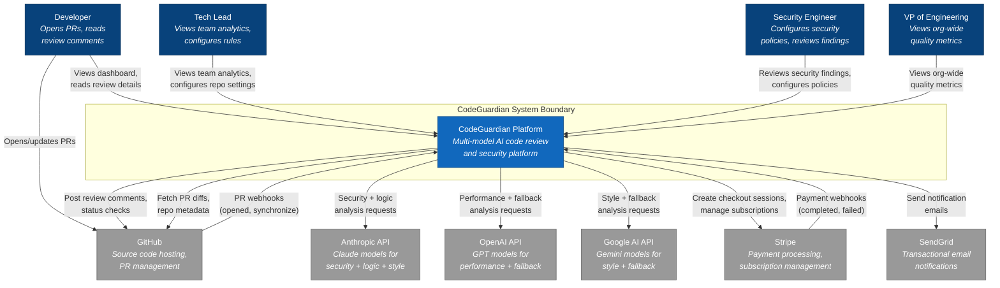

**Context boundaries:**

| Actor/System | Relationship | Protocol |
|-------------|-------------|----------|
| Developer | Uses dashboard, receives PR review comments via GitHub | HTTPS (dashboard), GitHub UI (comments) |
| Tech Lead | Uses dashboard for team analytics, configures repo settings | HTTPS |
| Security Engineer | Uses dashboard for security findings, configures policies | HTTPS |
| VP of Engineering | Uses dashboard for org-wide metrics | HTTPS |
| GitHub | Sends webhooks, receives review comments and status checks | HTTPS (REST API v3 + GraphQL v4) |
| Anthropic API | Processes security, logic, and style analysis | HTTPS (REST) |
| OpenAI API | Processes performance analysis and serves as fallback | HTTPS (REST) |
| Google AI API | Processes style analysis and serves as fallback | HTTPS (REST) |
| Stripe | Manages subscriptions, processes payments | HTTPS (REST + webhooks) |
| SendGrid | Delivers transactional emails | HTTPS (REST) |

---

## 3. C4 Container Diagram (Level 2)

This diagram shows the high-level technology choices and how the internal containers communicate.

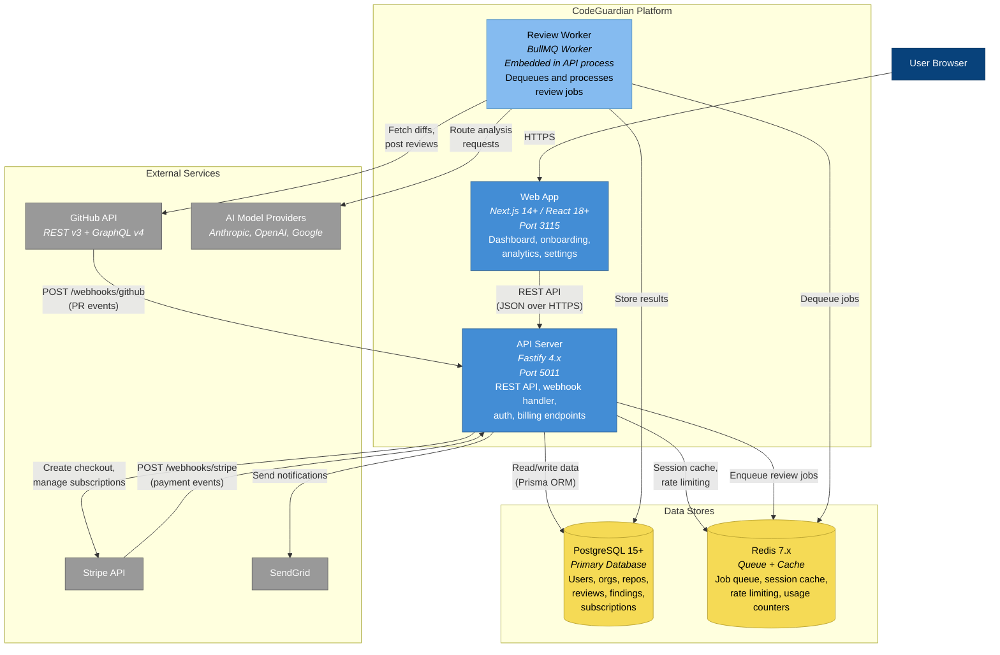

**Container responsibilities:**

| Container | Technology | Responsibility |
|-----------|-----------|---------------|
| Web App | Next.js 14+, React 18+, Tailwind CSS, shadcn/ui, Recharts | Dashboard UI, onboarding wizard, analytics charts, settings pages |
| API Server | Fastify 4.x, Prisma 5.x, TypeScript | REST API, webhook endpoints, GitHub OAuth, JWT auth, billing integration |
| Review Worker | BullMQ 5.x (embedded in API process) | Dequeues review jobs, routes to AI models, aggregates findings, posts to GitHub |
| PostgreSQL | PostgreSQL 15+ | Persistent storage for all business data |
| Redis | Redis 7.x | Job queue (BullMQ), session cache, rate limiting counters, usage metering |

**Why a single process for API + Worker (MVP)?**

For MVP, the Review Worker runs as BullMQ workers within the same Fastify process. This simplifies deployment (one process to manage) while still providing full async decoupling via Redis. When scaling is needed, workers can be extracted to a separate process/container by running the worker module independently -- no code changes required, only deployment topology changes. See ADR-002 for details.

---

## 4. C4 Component Diagram (Level 3)

This diagram shows the internal structure of the API Server container -- the routes, services, workers, and how they connect.

### 4.1 API Server Components

```mermaid
graph TD
    subgraph "API Server (Fastify)"
        subgraph "Plugins"
            AUTH_PLUGIN["Auth Plugin<br/><i>JWT verification,<br/>GitHub OAuth</i>"]
            DB_PLUGIN["Prisma Plugin<br/><i>Database connection<br/>lifecycle</i>"]
            REDIS_PLUGIN["Redis Plugin<br/><i>Connection, TLS,<br/>graceful degradation</i>"]
            RATE_LIMIT["Rate Limit Plugin<br/><i>Per-user and per-org<br/>request throttling</i>"]
            ERROR_HANDLER["Error Handler<br/><i>Global error formatting<br/>RFC 7807</i>"]
            CORS_PLUGIN["CORS Plugin<br/><i>Cross-origin config</i>"]
        end

        subgraph "Routes"
            AUTH_ROUTES["Auth Routes<br/><i>/auth/github/*</i><br/>OAuth redirect + callback"]
            WEBHOOK_ROUTES["Webhook Routes<br/><i>/webhooks/github</i><br/><i>/webhooks/stripe</i><br/>Signature verification"]
            REVIEW_ROUTES["Review Routes<br/><i>/api/reviews/*</i><br/>List, detail, retry"]
            REPO_ROUTES["Repository Routes<br/><i>/api/repositories/*</i><br/>List, settings"]
            DASH_ROUTES["Dashboard Routes<br/><i>/api/dashboard/*</i><br/>Stats, team, trends"]
            BILLING_ROUTES["Billing Routes<br/><i>/api/billing/*</i><br/>Checkout, subscription"]
            HEALTH_ROUTE["Health Route<br/><i>/health</i><br/>Readiness check"]
        end

        subgraph "Services"
            OAUTH_SVC["OAuth Service<br/><i>GitHub OAuth flow,<br/>token exchange,<br/>token refresh</i>"]
            GITHUB_APP_SVC["GitHub App Service<br/><i>Installation management,<br/>app token generation</i>"]
            DIFF_SVC["Diff Extractor<br/><i>Fetch PR diff from<br/>GitHub API</i>"]
            ROUTER_SVC["Model Router<br/><i>Route check types to<br/>AI models in parallel</i>"]
            AGGREGATOR_SVC["Result Aggregator<br/><i>Collect findings,<br/>deduplicate</i>"]
            SCORER_SVC["Quality Scorer<br/><i>Calculate weighted<br/>0-100 score</i>"]
            POSTER_SVC["Comment Poster<br/><i>Post inline comments<br/>+ status checks to GitHub</i>"]
            STRIPE_SVC["Stripe Service<br/><i>Checkout sessions,<br/>subscription management</i>"]
            USAGE_SVC["Usage Service<br/><i>Track PR reviews<br/>against tier limits</i>"]
        end

        subgraph "Model Providers"
            ANTHROPIC_ADAPTER["Anthropic Adapter<br/><i>Claude Opus, Sonnet, Haiku</i>"]
            OPENAI_ADAPTER["OpenAI Adapter<br/><i>GPT-4o, GPT-4o-mini</i>"]
            GOOGLE_ADAPTER["Google Adapter<br/><i>Gemini models</i>"]
        end

        subgraph "Worker"
            REVIEW_WORKER["Review Worker<br/><i>BullMQ processor</i><br/>Orchestrates full<br/>review pipeline"]
        end
    end

    DB[("PostgreSQL")]
    REDIS[("Redis")]
    GH["GitHub API"]
    AI["AI Providers"]
    STRIPE_EXT["Stripe"]

    AUTH_ROUTES --> OAUTH_SVC
    WEBHOOK_ROUTES --> DIFF_SVC
    WEBHOOK_ROUTES --> REVIEW_WORKER
    REVIEW_ROUTES --> DB
    REPO_ROUTES --> DB
    DASH_ROUTES --> DB
    BILLING_ROUTES --> STRIPE_SVC

    OAUTH_SVC --> GH
    GITHUB_APP_SVC --> GH
    DIFF_SVC --> GH

    REVIEW_WORKER --> DIFF_SVC
    REVIEW_WORKER --> ROUTER_SVC
    REVIEW_WORKER --> AGGREGATOR_SVC
    REVIEW_WORKER --> POSTER_SVC
    REVIEW_WORKER --> USAGE_SVC

    ROUTER_SVC --> ANTHROPIC_ADAPTER
    ROUTER_SVC --> OPENAI_ADAPTER
    ROUTER_SVC --> GOOGLE_ADAPTER

    ANTHROPIC_ADAPTER --> AI
    OPENAI_ADAPTER --> AI
    GOOGLE_ADAPTER --> AI

    AGGREGATOR_SVC --> SCORER_SVC
    POSTER_SVC --> GH

    STRIPE_SVC --> STRIPE_EXT
    USAGE_SVC --> REDIS

    AUTH_PLUGIN --> DB
    AUTH_PLUGIN --> REDIS
    DB_PLUGIN --> DB
    REDIS_PLUGIN --> REDIS
    RATE_LIMIT --> REDIS

    classDef plugin fill:#e8d5b7,stroke:#b8a078,color:#000000
    classDef route fill:#b8d4e3,stroke:#7fa9c0,color:#000000
    classDef service fill:#c5e1a5,stroke:#8cb860,color:#000000
    classDef adapter fill:#f8bbd0,stroke:#c48b9f,color:#000000
    classDef worker fill:#ce93d8,stroke:#9c64a6,color:#000000
    classDef external fill:#999999,stroke:#666666,color:#ffffff
    classDef datastore fill:#f5da55,stroke:#b8a230,color:#000000

    class AUTH_PLUGIN,DB_PLUGIN,REDIS_PLUGIN,RATE_LIMIT,ERROR_HANDLER,CORS_PLUGIN plugin
    class AUTH_ROUTES,WEBHOOK_ROUTES,REVIEW_ROUTES,REPO_ROUTES,DASH_ROUTES,BILLING_ROUTES,HEALTH_ROUTE route
    class OAUTH_SVC,GITHUB_APP_SVC,DIFF_SVC,ROUTER_SVC,AGGREGATOR_SVC,SCORER_SVC,POSTER_SVC,STRIPE_SVC,USAGE_SVC service
    class ANTHROPIC_ADAPTER,OPENAI_ADAPTER,GOOGLE_ADAPTER adapter
    class REVIEW_WORKER worker
    class DB,REDIS datastore
    class GH,AI,STRIPE_EXT external
```

### 4.2 Component Interaction Summary

| Component | Inputs | Outputs | Dependencies |
|-----------|--------|---------|-------------|
| Auth Plugin | HTTP requests with JWT/cookie | Authenticated request context | PostgreSQL, Redis |
| Webhook Routes | GitHub/Stripe HTTP POST | Job enqueue, acknowledgment | Redis (BullMQ) |
| Review Worker | Job from Redis queue | Stored review + GitHub comments | All services below |
| Diff Extractor | Installation ID, PR number | Parsed diff (files, lines, hunks) | GitHub API |
| Model Router | Diff chunks, routing config | Raw findings per check type | AI Provider Adapters |
| Result Aggregator | Raw findings from all models | Deduplicated finding list | None |
| Quality Scorer | Finding list with severities | Composite score (0-100) + breakdown | None |
| Comment Poster | Findings, score, PR metadata | GitHub review comments + status check | GitHub API |
| Usage Service | User/org ID, action type | Allow/deny + updated counter | Redis, PostgreSQL |
| Stripe Service | Checkout/subscription requests | Stripe session URLs, subscription status | Stripe API |

---

## 5. Sequence Diagrams

### 5.1 Full PR Review Flow

This is the core flow: from a developer opening a PR to review comments appearing on the PR.

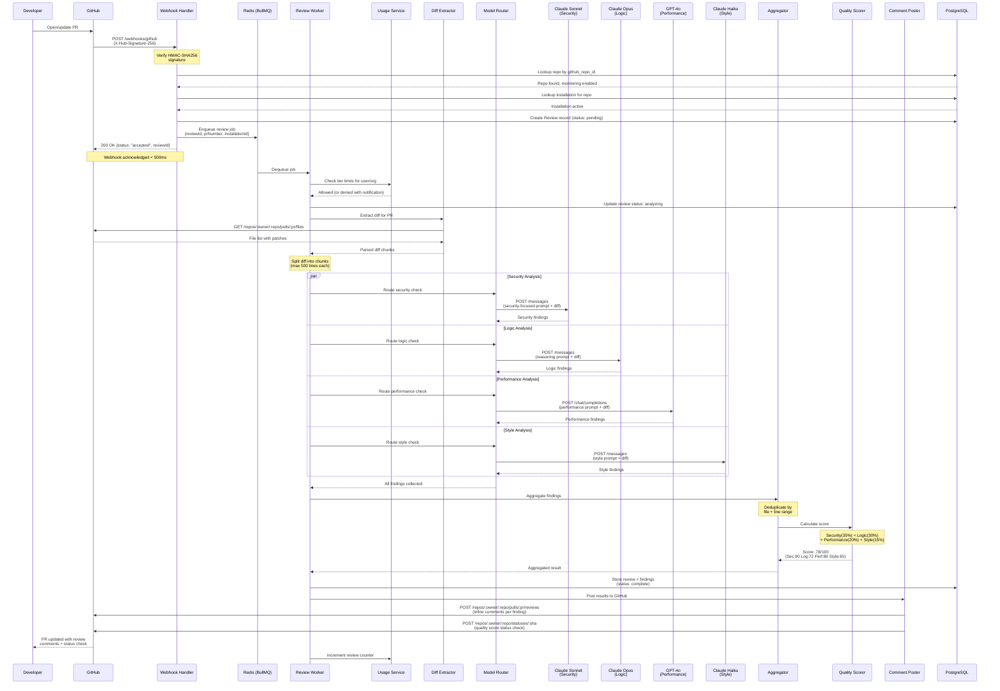

### 5.2 GitHub OAuth + App Installation Flow

This shows the dual flow: user authenticates via OAuth, then installs the GitHub App.

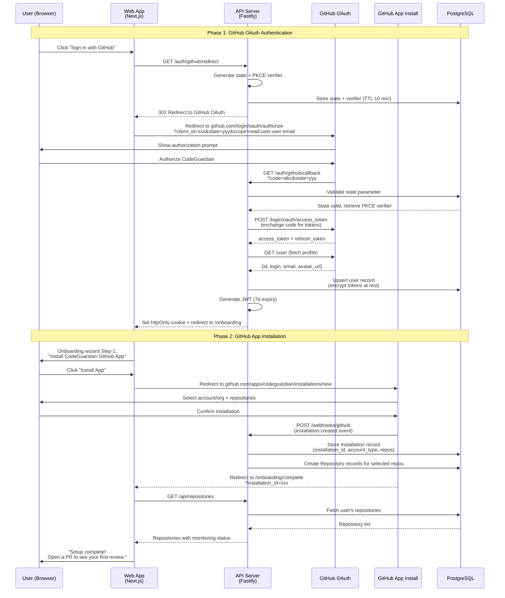

### 5.3 Billing Check + Metering Flow

This shows how billing enforcement works during a review request.

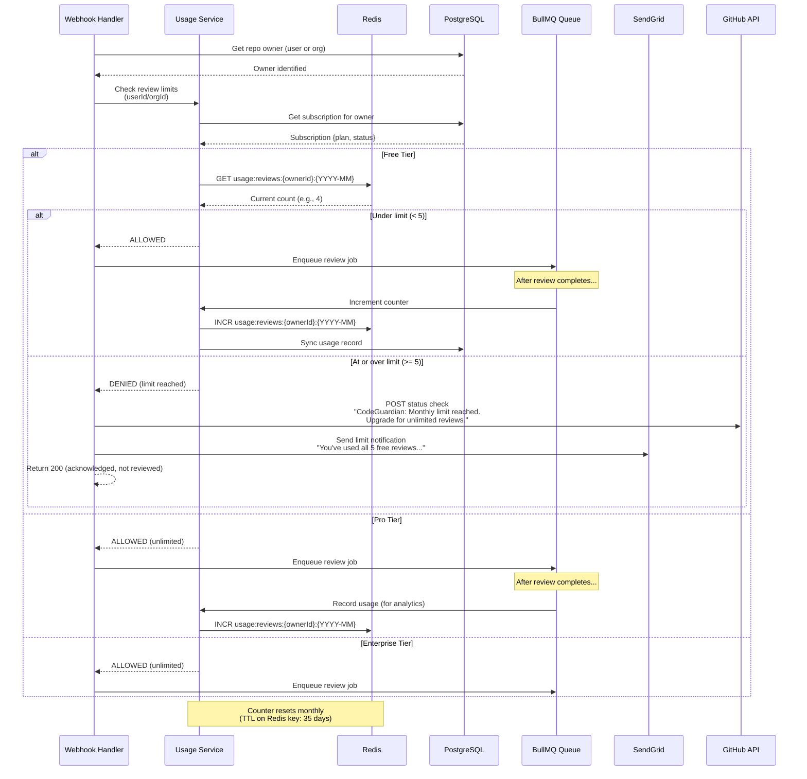

### 5.4 Stripe Subscription Lifecycle

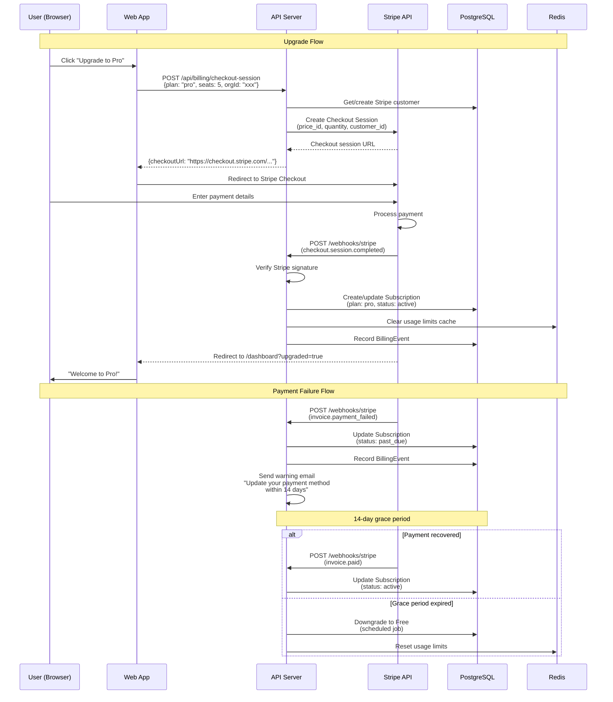

### 5.5 Model Routing with Fallback

This shows what happens when a primary model fails and the fallback is used.

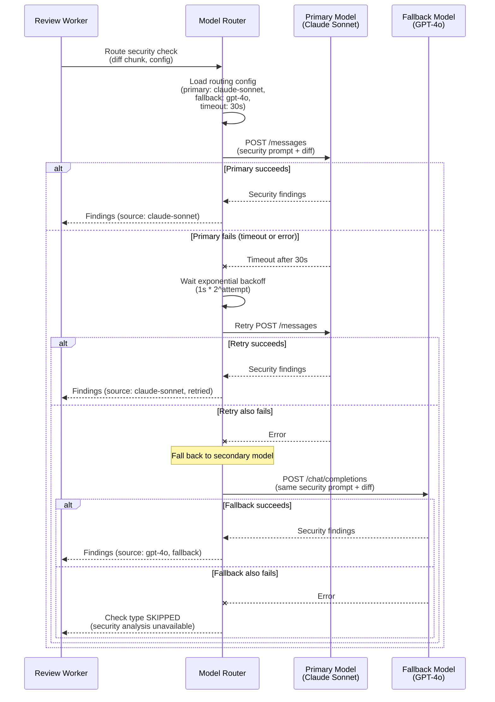

---

## 6. Data Flow Diagram

This shows how a PR diff moves through the entire system, from webhook receipt to GitHub review posting.

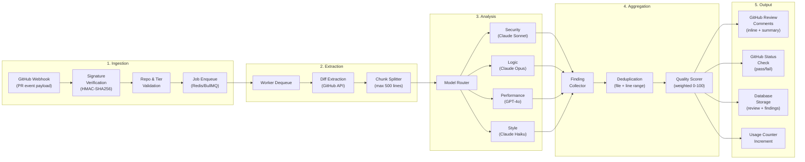

**Data transformation at each stage:**

| Stage | Input | Transformation | Output |
|-------|-------|---------------|--------|
| 1. Ingestion | Raw webhook JSON | Validate, extract PR metadata | Review job payload |
| 2. Extraction | PR number, installation ID | Fetch diff via GitHub API, split into chunks | Array of diff chunks (max 500 lines each) |
| 3. Analysis | Diff chunks + category prompts | AI model analysis (4 parallel streams) | Raw finding arrays per category |
| 4. Aggregation | 4 arrays of raw findings | Merge, deduplicate by file+line, score | Unified findings list + composite score |
| 5. Output | Findings + score + PR metadata | Format as GitHub review + status check | PR comments, DB records, usage increment |

---

## 7. Deployment Architecture

### 7.1 MVP Deployment (Single Server)

For MVP, CodeGuardian runs as a single Fastify process with embedded BullMQ workers, backed by managed PostgreSQL and Redis.

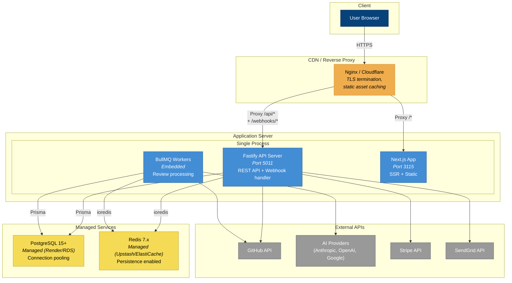

### 7.2 Scaled Deployment (Future)

When review volume exceeds what a single process can handle, the worker is extracted to independent instances.

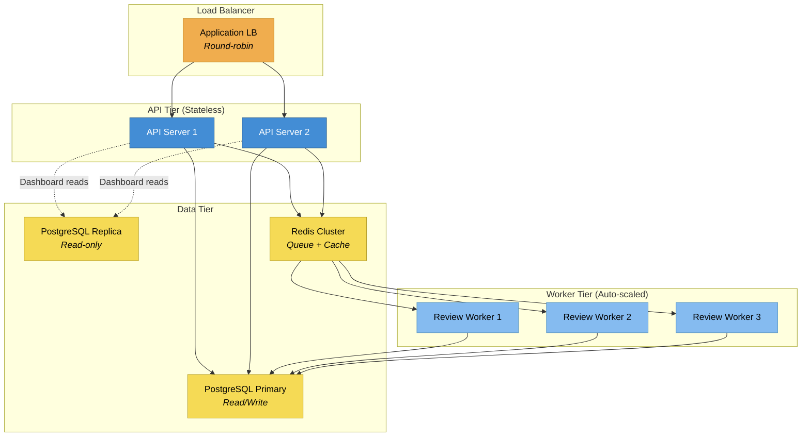

### 7.3 Docker Compose (Local Development)

```yaml
services:
  postgres:
    image: postgres:15-alpine
    ports: ["127.0.0.1:5432:5432"]
    environment:
      POSTGRES_DB: codeguardian_dev
      POSTGRES_HOST_AUTH_METHOD: trust
    volumes: [pgdata:/var/lib/postgresql/data]
    healthcheck:
      test: ["CMD-SHELL", "pg_isready -U postgres"]

  redis:
    image: redis:7-alpine
    ports: ["127.0.0.1:6379:6379"]
    healthcheck:
      test: ["CMD", "redis-cli", "ping"]

  api:
    build: ./apps/api
    ports: ["5011:5011"]
    environment:
      PORT: 5011
      DATABASE_URL: postgresql://postgres@postgres:5432/codeguardian_dev
      REDIS_URL: redis://redis:6379
    depends_on:
      postgres: {condition: service_healthy}
      redis: {condition: service_healthy}

  web:
    build: ./apps/web
    ports: ["3115:3115"]
    environment:
      NEXT_PUBLIC_API_URL: http://localhost:5011
    depends_on: [api]

volumes:
  pgdata:
```

---

## 8. Key Architecture Decisions

Detailed ADRs are in `docs/ADRs/`. Summary of key decisions:

| Decision | Choice | Rationale |
|----------|--------|-----------|
| Multi-model routing | Parallel fan-out with primary + fallback per check type | Different models excel at different tasks; parallel execution keeps latency bounded |
| Async processing | BullMQ workers with Redis queue | Decouples webhook response time from review processing time; enables retry/failure handling |
| GitHub integration | GitHub App + OAuth App (dual) | App for webhooks and PR access; OAuth for user identity. Both are needed. |
| Scoring algorithm | Weighted sum with severity-based deductions | Transparent, deterministic, configurable; easily explained to users |
| MVP deployment | Single process (API + embedded workers) | Simplifies deployment; extractable to separate processes when needed |
| State management | Server-side only (no WebSocket for MVP) | Dashboard polls API; avoids WebSocket complexity for MVP. SSE/WS can be added later. |

---

## 9. Technology Stack

| Layer | Technology | Version | Purpose |
|-------|-----------|---------|---------|
| Runtime | Node.js | 20+ | LTS, native ESM |
| Language | TypeScript | 5+ | Strict mode, type safety |
| Backend | Fastify | 4.x | High-performance HTTP, plugin architecture |
| Frontend | Next.js | 14+ | App Router, SSR, static pages |
| UI | React | 18+ | Component model |
| Styling | Tailwind CSS | 3.x | Utility-first CSS |
| Components | shadcn/ui | Latest | Accessible, composable UI components |
| Charts | Recharts | 2.x | Dashboard trend charts |
| ORM | Prisma | 5.x | Schema-first, type-safe queries |
| Database | PostgreSQL | 15+ | ACID, JSON support, full-text search |
| Queue | BullMQ | 5.x | Redis-backed job queue with retries |
| Cache | Redis | 7.x | Queue backend, session cache, rate limiting |
| Auth | GitHub OAuth 2.0 | -- | PKCE flow for user identity |
| JWT | @fastify/jwt | -- | Session tokens (7d expiry) |
| Payments | Stripe | -- | Checkout, subscriptions, webhooks |
| Email | SendGrid | -- | Transactional notifications |
| AI (Security) | Anthropic Claude Sonnet | -- | OWASP vulnerability detection |
| AI (Logic) | Anthropic Claude Opus | -- | Business logic analysis |
| AI (Performance) | OpenAI GPT-4o | -- | Performance issue detection |
| AI (Style) | Anthropic Claude Haiku | -- | Code style analysis |
| Testing (Unit) | Jest | 29+ | Unit + integration tests |
| Testing (Component) | React Testing Library | 14+ | UI component tests |
| Testing (E2E) | Playwright | 1.x | Full user flow tests |
| CI/CD | GitHub Actions | -- | Automated testing + deployment |

---

## 10. Reusable Components

From the ConnectSW Component Registry, CodeGuardian will use these shared packages:

| Package | Usage in CodeGuardian |
|---------|----------------------|
| `@connectsw/shared` | Logger (structured logging with PII redaction), Crypto Utils (webhook signature verification, token encryption), Prisma Plugin (DB lifecycle), Redis Plugin (connection management) |
| `@connectsw/billing` | SubscriptionService (plan management), UsageService (PR review metering), requireUsageLimit() middleware, PricingCard + UsageBar frontend components |
| `@connectsw/audit` | AuditLogService (security event trail for reviews, settings changes, auth events) |
| `@connectsw/notifications` | EmailService (limit notifications, upgrade prompts), NotificationService (in-app notifications) |
| `@connectsw/ui` | Button, Card, Input, Badge, StatCard, DataTable, Sidebar, DashboardLayout, useTheme |

**CodeGuardian-specific components (not reusable across products):**

| Component | Purpose |
|-----------|---------|
| Model Router | Routes check types to AI model providers with fallback logic |
| AI Provider Adapters | Anthropic, OpenAI, Google API clients with prompt management |
| Diff Extractor | Parses GitHub PR diffs into analyzable chunks |
| Quality Scorer | Calculates weighted 0-100 score from findings |
| Comment Poster | Formats and posts review comments to GitHub PRs |
| Review Worker | BullMQ processor orchestrating the full review pipeline |
| GitHub App Service | GitHub App authentication, installation management |

---

## 11. Non-Functional Requirements Mapping

How the architecture addresses each NFR from the PRD:

| NFR | Architecture Solution |
|-----|----------------------|
| NFR-001: Reviews < 60s for < 500 lines | Parallel model execution (4 concurrent), no chunking needed for small diffs |
| NFR-002: Reviews < 120s for 500-2000 lines | Chunk splitting + parallel processing per chunk |
| NFR-003: Webhook response < 500ms | Immediate acknowledgment; processing is async via BullMQ |
| NFR-004: Dashboard FCP < 2s | Next.js SSR + static generation for marketing pages; API responses < 200ms |
| NFR-005: API reads < 200ms | PostgreSQL indexes on common query patterns; Redis cache for hot data |
| NFR-006: 100 concurrent reviews | BullMQ concurrency config; extractable to multiple worker processes |
| NFR-007: 99.9% uptime | Managed PostgreSQL + Redis; health checks; automatic restarts |
| NFR-011: Auth on all endpoints | Fastify auth plugin (JWT) on all routes except /health and /webhooks |
| NFR-012: TLS 1.2+ | Nginx/Cloudflare TLS termination |
| NFR-013: Encryption at rest | AES-256-GCM for GitHub tokens (via @connectsw/shared crypto utils) |
| NFR-014: Rate limiting | Redis-backed rate limit store (100/min per user, 1000/min per org) |
| NFR-016: Webhook HMAC verification | Webhook handler verifies X-Hub-Signature-256 before processing |
| NFR-017: Horizontal scaling | Stateless API servers; workers scale independently via Redis queue |
| NFR-018: Query performance | Indexes on all foreign keys, composite indexes for common filters |
| NFR-019: Queue capacity | Redis persistence enabled; BullMQ handles backpressure |

---

*End of architecture document. See ADR documents in `docs/ADRs/` for detailed decision rationale.*
