# ConnectSW Command Center

## Business Context

The Command Center is the CEO's single pane of glass for monitoring and operating the AI software company. ConnectSW runs entirely through Claude Code agents — no human engineers — which means the CEO needs real-time visibility into what every agent, product, and pipeline is doing. The Command Center solves this by auto-discovering products from the filesystem, displaying agent capabilities and training status, tracking git activity across all repositories, managing CI/CD infrastructure, and providing a command invocation terminal for directing the Orchestrator. Without it, the CEO would have to manually inspect dozens of files, git logs, and GitHub Actions to understand company status.

## Architecture Overview

```mermaid
graph TD
    CEO["👤 CEO"] -->|HTTPS| WEB["🌐 React + Vite<br/>Port: 3113"]
    WEB -->|"REST API"| API["⚡ Fastify API<br/>Port: 5009"]
    API -->|"Filesystem reads"| FS["📁 products/, .claude/,<br/>packages/, .github/"]
    API -->|"execSync"| GIT["🔀 Git CLI"]

    style WEB fill:#339af0,color:#fff
    style API fill:#7950f2,color:#fff
```



The backend has no database — it reads all data directly from the filesystem and git CLI. This keeps the system simple and always in sync with the actual state of the monorepo.

## Quick Start

```bash
# Install dependencies
cd apps/api && npm install
cd ../web && npm install
cd ../..

# Start both services
npm run dev
```

- API: http://localhost:5009
- Web: http://localhost:3113

## Features

- **Executive Overview** — Product count, development phases, health indicators, and recent activity at a glance
- **Products** — All products with status, assigned ports, CI pipeline state, and documentation links
- **Agent Hub** — 17 agents with capabilities, role definitions, and performance metrics
- **Component Library** — 8 shared packages, 60+ reusable components from the Component Registry
- **Activity Feed** — Audit trail of git commits, task completions, and agent actions
- **Infrastructure** — Port map, Docker services, CI/CD pipelines, and environment health
- **Command Terminal** — Invoke Orchestrator commands directly from the dashboard

## Pages

| Page | Route | Description |
|------|-------|-------------|
| Executive Overview | `/` | Dashboard with KPIs, product summary, recent activity |
| Products | `/products` | All products with status, ports, CI, docs |
| Product Detail | `/products/:id` | Deep dive into a single product |
| Agent Hub | `/agents` | Agent roster with capabilities and metrics |
| Components | `/components` | Shared component library browser |
| Activity | `/activity` | Git commits, task log, audit trail |
| Infrastructure | `/infrastructure` | Port registry, Docker, CI/CD pipelines |

## Tech Stack

| Layer | Technology |
|-------|------------|
| Backend | Fastify (filesystem-based, no database) |
| Frontend | React + Vite + Tailwind CSS |
| Diagrams | Mermaid (client-side rendering) |
| Data Sources | `products/`, `.claude/`, `packages/`, `.github/`, `.specify/`, git CLI |
| Ports | API: 5009, Web: 3113 |
