# Command Center — Architecture

## 1. Business Context

Command Center is ConnectSW's internal operations dashboard — the CEO's single pane of glass for monitoring all products, agents, infrastructure, and activity across the AI software company. It auto-discovers products from the filesystem, displays agent capabilities and training status, tracks git activity, manages CI/CD infrastructure, and provides a command invocation terminal for operational tasks.

**Target user**: ConnectSW CEO (single user, internal tool).

**Key differentiator**: Zero-database architecture — reads everything from the monorepo filesystem and git history, so it's always in sync with the codebase.

---

## 2. C4 Level 1 — System Context

---

## 3. C4 Level 2 — Container Diagram

---

## 4. Sequence Diagram — Product Discovery Flow

---

## 5. Component Diagram — Frontend Pages

```mermaid
graph TD
    subgraph "Dashboard Section"
        OV["📊 Overview<br/>KPIs, phase breakdown,<br/>recent activity"]
        HEALTH["🏥 Health Scorecard<br/>(Phase 2)"]
        ALERTS["🔔 Alerts<br/>(Phase 2)"]
    end

    subgraph "Portfolio Section"
        PRODS["📦 Products<br/>Auto-discovered grid"]
        PRODDET["📄 Product Detail<br/>Doc viewer + Mermaid"]
        AGTS["🤖 Agents<br/>Capability cards"]
        AGTDET["👤 Agent Detail<br/>Full profile + experience"]
        WF["⚙️ Workflows<br/>(Phase 2)"]
        DEPS["🔗 Dependencies<br/>(Phase 2)"]
    end

    subgraph "Quality & Ops"
        QG["✅ Quality Gates<br/>(Phase 2)"]
        AUDIT_P["📋 Audit Reports"]
        SPRINT["📌 Sprint Board<br/>(Phase 2)"]
        MON["👁️ Agent Monitor<br/>(Phase 2)"]
    end

    subgraph "System Section"
        ACT["📈 Activity Feed<br/>Audit + Git merged"]
        GITANA["🔀 Git Analytics<br/>(Phase 2)"]
        KB["📚 Knowledge Base<br/>(Phase 2)"]
        COMP["🧱 Components<br/>Shared packages"]
        INFRA["🏗️ Infrastructure<br/>Ports + CI pipelines"]
        INV["💻 Invoke<br/>Command terminal"]
        SET["⚙️ Settings<br/>(Phase 2)"]
    end

    LAYOUT["Layout Shell<br/>Sidebar (w-56) + Main Content"] --> OV
    LAYOUT --> PRODS
    LAYOUT --> AGTS
    LAYOUT --> ACT
    LAYOUT --> INV

    PRODS -->|Click| PRODDET
    AGTS -->|Click| AGTDET

    style LAYOUT fill:#7950f2,color:#fff
    style OV fill:#339af0,color:#fff
    style PRODS fill:#339af0,color:#fff
    style AGTS fill:#339af0,color:#fff
    style INV fill:#339af0,color:#fff
```

---

## 6. Sequence Diagram — Command Invocation Flow

---

## 7. Data Sources Map

---

## 8. Phase Detection Heuristic

```mermaid
flowchart TD
    START(["Scan product directory"]) --> HAS_TESTS{"Has tests/ ?"}

    HAS_TESTS -->|Yes| HAS_E2E{"Has e2e/ ?"}
    HAS_TESTS -->|No| HAS_SRC{"Has api/src/<br/>or web/src/ ?"}

    HAS_E2E -->|Yes| HAS_DOCKER{"Has docker-compose.yml<br/>AND PRD.md ?"}
    HAS_E2E -->|No| HAS_DOCKER2{"Has docker-compose.yml ?"}

    HAS_DOCKER -->|Yes| PROD["🟢 Production"]
    HAS_DOCKER -->|No| MVP["🔵 MVP"]

    HAS_DOCKER2 -->|Yes| MVP
    HAS_DOCKER2 -->|No| FOUNDATION["🟡 Foundation"]

    HAS_SRC -->|Yes| FOUNDATION
    HAS_SRC -->|No| PLANNED["⚪ Planned"]

    style PROD fill:#20c997,color:#fff
    style MVP fill:#339af0,color:#fff
    style FOUNDATION fill:#ff922b,color:#fff
    style PLANNED fill:#868e96,color:#fff
```

---

## 9. API Endpoints

| Method | Endpoint | Purpose |
|--------|----------|---------|
| `GET` | `/api/v1/health` | Service health |
| `GET` | `/api/v1/overview` | CEO dashboard KPIs |
| `GET` | `/api/v1/products` | All products with metadata |
| `GET` | `/api/v1/products/:name` | Single product |
| `GET` | `/api/v1/products/:name/docs` | Product doc listing |
| `GET` | `/api/v1/products/:name/docs/*` | Raw markdown content |
| `GET` | `/api/v1/products/:name/docs-pdf/*` | PDF export |
| `GET` | `/api/v1/agents` | All agents |
| `GET` | `/api/v1/agents/:id` | Agent detail |
| `GET` | `/api/v1/components` | Shared packages |
| `GET` | `/api/v1/activity` | Unified feed (audit + git) |
| `GET` | `/api/v1/infrastructure` | Ports + CI pipelines |
| `POST` | `/api/v1/invoke` | Run whitelisted command |
| `GET` | `/api/v1/invoke` | Job history |
| `GET` | `/api/v1/invoke/:id/stream` | SSE output stream |
| `POST` | `/api/v1/invoke/:id/cancel` | Cancel running job |

---

## 10. Key Architectural Decisions

| Decision | Choice | Rationale |
|----------|--------|-----------|
| No database | Filesystem reads | Always in sync with codebase, zero setup, single-user tool |
| Product auto-discovery | Directory scan + heuristics | No hardcoded product lists; add a product folder → it appears |
| Command whitelist | Prefix-based allow list | Security for invoke feature; prevents arbitrary command execution |
| Mermaid client-side | Browser rendering | No server dependency; graceful fallback on render failure |
| 30s product cache | TTL-based | Balances freshness with filesystem I/O cost |
| SSE for job output | Server-Sent Events | Simpler than WebSocket for one-way streaming |
