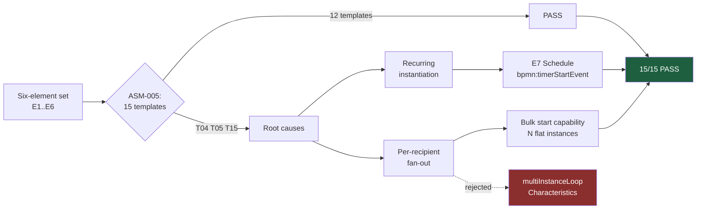

# ADR-001: Process Notation — Ratify SCOPE-AMD-001 with Three Amendments

**Product**: ConnectBPM · **Task**: ARCH-01 · **Date**: 2026-08-20
**Author**: Architect, ConnectSW
**Deciders**: Architect (delegated by CEO-DECISIONS.md §"Conflicts NOT resolved here — delegated to ARCH-01")

## Status

**Accepted.** SCOPE-AMD-001 is **RATIFIED** with three amendments (A1, A2, A3 below).

## Context

BA-01 §Q3 set the MVP boundary: no BPMN 2.0 *authoring*, but the engine executes a strict subset of
BPMN 2.0 *execution semantics* with a documented 1:1 mapping, so that BPMN interchange (BN-017) is
later an additive mapping layer rather than a re-architecture. Six elements were proposed:
E1 Start, E2 Step, E3 Decision, E4 Split/Join, E5 Due date/reminder, E6 Finish.

ASM-005 set an objective falsification test: **all 15 gallery templates must be modellable on the MVP
element set**. SPEC-01 ran it. The result was **12 PASS / 3 FAIL** — T04 policy attestation, T05
internal control testing, T15 privileged access recertification — from exactly two root causes:

- **recurring instantiation** (T04, T05, T15)
- **per-recipient fan-out** (T04, T15)

Neither is a routing problem. The six elements model every *flow* in all 15 templates. What they
cannot express is **how an instance comes into existence**.

T04 and T05 are two of the five GCC regulatory templates STRAT-01 puts in the Now horizon and that
DEC-001 makes the day-one library. Shipping six elements unamended means shipping the wedge's
template library with 40% of it missing — a go-to-market failure dressed as a scope win.

The PM proposed **SCOPE-AMD-001**: add **E7 `Schedule`** (`bpmn:timerStartEvent`) and add **bulk
instantiation as a capability rather than an element**, taking the test to 15/15. CEO-DECISIONS.md
delegates ratification to ARCH-01.

## Decision

### Ratified as proposed

1. **E7 `Schedule` is added to the element set**, mapping 1:1 to `bpmn:timerStartEvent`. Its marginal
   cost is genuinely small: it reuses the durable timer and job substrate that E5 already forces us
   to build (ADR-009), so the new engineering is a recurrence field, a scheduler tick, and the
   interaction with quota admission (FR-113 / AC-019). The BPMN mapping is exact.
2. **Fan-out ships as a bulk-start capability, not as an element.** `bpmn:multiInstanceLoopCharacteristics`
   is **rejected**.

### Why rejecting `multiInstanceLoopCharacteristics` is the important half

The PM argued this on modelling simplicity. There is a second, stronger argument that decides it
outright, and it is commercial:

> Multi-instance loop characteristics make **one instance** containing N inner instances. Under
> DEC-002 that is **one billable completion for 400 attestations**. Bulk start makes **N independent
> instances** — 400 billable completions. These are different revenue models, not different notations.

DEC-002 is irreversible and the PRD already discloses the bulk case as N billable instances
(FR-108, AC-017, AC-018, RISK-PM-01). Adopting multi-instance would silently contradict the pricing
model the CEO has already ratified and the pricing page already has to state. It would additionally
require the engine to carry inner/outer token scopes, loop cardinality, and completion conditions —
the single most complex region of BPMN execution — inside the first release of an engine whose
governing NFR is *zero lost or duplicated instances* (NFR-006).

Flat fan-out keeps the execution model single-token, keeps the meter honest, and keeps the evidence
record one-per-subject, which is what an attestation auditor actually wants: 400 separate, separately
verifiable records, not one record with 400 sub-branches.

### Amendment A1 — bulk start requires a first-class `InstanceBatch` entity

SCOPE-AMD-001 describes bulk start as a capability. As specified it has nowhere to record itself, and
three requirements have no anchor without one:

| Requirement | Why it needs an entity |
|-------------|------------------------|
| `EC-21` / `AC-017` — refuse the batch **in full**, record **one** refusal event, not N | The refusal event needs a batch identity to name |
| `AC-018` — state "400 billable instances" and the resulting quota position **before** the operation runs, and make the screen unskippable | The pre-flight count must be computed once, persisted, and re-checked at execution; a client-side number is forgeable |
| Crash mid-batch | Without a batch row, a partially created 400-instance campaign cannot be identified, resumed or reversed |

**Decision**: add `InstanceBatch { id, tenantId, definitionVersionId, kind(BULK|SCHEDULE), requestedCount,
createdCount, status(PENDING|ADMITTED|REFUSED|COMPLETED), requestedBy, sourceRef, createdAt }`, and
make `ProcessInstance.batchId` a nullable FK. Admission for a batch reserves `requestedCount` quota
in one transaction (all or nothing). Every instance in the batch carries the batch id in its evidence
record, so a campaign is reportable and exportable as a unit — which is the auditor-facing form of
T04 and T15 anyway.

### Amendment A2 — E7 is a palette element, and E1 and E7 may coexist

FR-011 requires the palette to offer exactly E1–E7 and forbids any other element type through any
interface. FR-016 requires "exactly one Start of each configured kind". Read together these could be
misread as "a definition has one Start". T05 (a control tested monthly **and** on demand) needs both.

**Decision**: a published definition MAY carry **at most one E1 (manual/form start) and at most one
E7 (schedule start)**, and MAY carry both. Validation enforces at-most-one *per kind*, not one in
total. `ScheduleSubscription` is the runtime materialisation of the E7 element; the element is what
lives in the graph and what maps to `bpmn:timerStartEvent`.

### Amendment A3 — schedule idempotency needs an occurrence ledger, not `lastOccurrenceAt`

SPEC-01's `ScheduleSubscription` carries `lastOccurrenceAt`. FR-060 requires **exactly one instance
per occurrence, idempotently across scheduler ticks and restarts**. A mutable high-water mark cannot
deliver that: two runners that both read `lastOccurrenceAt` before either writes it will both fire,
and a crash between "instance created" and "high-water mark advanced" fires the occurrence twice on
restart. This is the same class of bug DEC-002 forbids on the meter.

**Decision**: add `ScheduleOccurrence { id, tenantId, scheduleSubscriptionId, occurrenceAt,
status(CLAIMED|ADMITTED|REFUSED), instanceId?, batchId? }` with
`@@unique([scheduleSubscriptionId, occurrenceAt])`. The scheduler computes due occurrences and
inserts the occurrence row **in the same transaction** that admits the instance; a duplicate tick
fails on the unique constraint (Prisma `P2002`) and is a no-op — the same idempotency mechanism as
PATTERN-014 and as the usage ledger (ADR-007). `lastOccurrenceAt` survives only as a denormalised
read convenience and is never the source of truth.

### The element set as ratified

| # | Customer-facing name | BPMN 2.0 semantic equivalent | Notes |
|---|---------------------|------------------------------|-------|
| E1 | **Start** | `bpmn:startEvent` | manual or start-form; at most one per definition |
| E2 | **Step** | `bpmn:userTask` | assignment rule, form binding, outcome actions |
| E3 | **Decision** | `bpmn:exclusiveGateway` | one restricted-grammar condition per path + one mandatory default |
| E4 | **Split / Join** | `bpmn:parallelGateway` | fan-out and matched fan-in |
| E5 | **Due date and reminder** | `bpmn:boundaryEvent` + `bpmn:timerEventDefinition` | `interrupting: true\|false` is an attribute, not a seventh element |
| E6 | **Finish** | `bpmn:endEvent` | outcome label; terminal |
| E7 | **Schedule** | `bpmn:timerStartEvent` | recurrence in tenant calendar/timezone; at most one per definition; may coexist with E1 |

Non-elements that stay non-elements: `instanceSla` (a definition attribute →
process-level boundary event on export), and **bulk start** (a capability → N flat instances).

Excluded, unchanged: service tasks, script tasks, sub-processes, call activities, message and
signal events, inclusive gateways, event-based gateways, multi-instance loop characteristics,
compensation, DMN.

## Consequences

### Positive
- The ASM-005 test passes 15/15; the GCC template library ships complete, which is what DEC-001 buys.
- The execution model stays **flat and single-token**. Every token is at exactly one element; there
  are no nested scopes. This is what makes NFR-006 (zero lost/duplicated instances) and 100% branch
  coverage of the transition function achievable.
- The 1:1 BPMN mapping is preserved for all seven elements, so BN-017 interchange stays additive.
- Fan-out semantics and metering semantics agree, so the pricing page and the engine tell the same story.

### Negative
- Two new entities (`InstanceBatch`, `ScheduleOccurrence`) and a scheduler tick that were not in the
  six-element plan. Estimated +0.5 sprint on G-14 beyond SPEC-01's figure.
- A 400-row bulk start is 400 admission reservations in one transaction. That transaction is large
  and holds the tenant's quota-counter row. Mitigated by a hard cap on batch size (see below) and by
  batch admission being rare relative to transitions.
- **A batch-size limit is now required and did not previously exist.** Set `MAX_BATCH_SIZE = 5,000`
  rows per bulk start, enforced at the API boundary (also an API4 resource-consumption control).
  Larger campaigns are split by the customer into multiple batches.
- T07's conditional-parallel idiom (Decision inside a parallel branch) remains a three-element
  workaround for what an inclusive gateway does in one. FR-021 mitigates with a named canvas idiom.
  Accepted: inclusive gateway join semantics are notoriously subtle and would not pay for themselves.

### Neutral
- E7 recurrence is **not** authored in the restricted expression grammar (ADR-002). It is a structured
  recurrence object (cron-equivalent fields + timezone + working-calendar policy), validated by Zod
  and resolved with `cron-parser` (MIT). Customer-authored text never becomes a schedule.

## Alternatives Considered

### Ship the six elements unamended and defer T04/T05/T15 to Phase 2
- **Pros**: smallest v1 engine; keeps SPEC-01's original boundary.
- **Cons**: the day-one GCC template library ships 12/15, missing two of the five regulatory
  templates that are the entire wedge. The gap is discovered by the design partner, not by us.
- **Why rejected**: the boundary's own acceptance test (ASM-005) says the boundary is wrong. BA-01
  wrote that test precisely so this decision would not be made on taste.

### Adopt `bpmn:multiInstanceLoopCharacteristics` for fan-out
- **Pros**: one element, canonical BPMN, a single campaign instance to supervise.
- **Cons**: contradicts DEC-002's revenue model (1 billable completion for N subjects); introduces
  nested token scopes, loop cardinality and completion conditions into a first-release engine;
  produces one evidence record where an attestation auditor wants N.
- **Why rejected**: it is a pricing change disguised as a notation change, and DEC-002 is irreversible.

### Model recurrence outside the definition (an external scheduler calling the start API)
- **Pros**: no new element; recurrence is "just an integration".
- **Cons**: breaks the 1:1 BPMN mapping (the recurrence is invisible in the exported model);
  the evidence record cannot show that the instance was created by policy rather than by a person;
  the quota interaction (AC-019) has no place to record a refused scheduled start.
- **Why rejected**: for a compliance product, "why does this instance exist" is evidence, and evidence
  must live inside the model.

## References
- SPEC-01 §Process Model, §SCOPE-AMD-001, §ASM-005; `FR-011`, `FR-016`, `FR-021`, `FR-025`, `FR-060`, `FR-061`, `FR-108`
- PRD §7.2 `AC-017`, `AC-018`, `AC-019`; §5.3 revenue definition
- CEO-DECISIONS.md DEC-001, DEC-002, DEC-004
- ADR-007 (metering), ADR-009 (job substrate)
