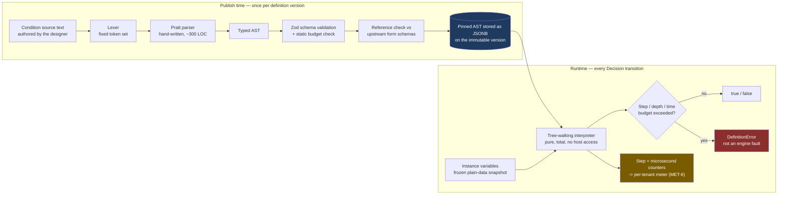

# ADR-002: Expression Evaluation — An Owned Grammar, Compiled to a Pinned AST, Evaluated Under a Budget

**Product**: ConnectBPM · **Task**: ARCH-01 · **Date**: 2026-08-20
**Author**: Architect, ConnectSW
**Deciders**: Architect (delegated by CEO-DECISIONS.md)

## Status

Accepted.

## Context

Two inputs appeared to conflict and were delegated here:

- **BA-01 BR-005 / FR-022 / NFR-009**: no customer-authored script execution in v1. Conditions use a
  restricted, **non-Turing-complete** grammar. *"No customer-authored input may reach `eval`,
  `Function`, a VM, an isolate or any dynamic code execution path in v1."*
- **STRAT-01 Now horizon**: "expression sandboxing".

They are reconcilable, and CEO-DECISIONS.md says so: a restricted grammar still needs safe
evaluation. **The mechanism is the decision, and this ADR makes it.**

The binding behavioural constraints:

| Requirement | Constraint |
|-------------|-----------|
| `FR-022` | Literals, form-field/variable references, comparison operators, boolean operators, parentheses, a fixed set of pure predicates. No function definition, assignment, iteration, recursion, host-object property traversal or dynamic execution. |
| `FR-023` / `EC-09` / `AC-076` | An absent variable is `null`; every comparison against `null` yields `false` **deterministically**. Never throws, never stalls. |
| `FR-024` | Hard limits on AST depth, node count and evaluation time; static limits refused **at publish time**. |
| `NFR-009` | Absolute. No `eval`, `Function`, `vm`, isolate. |
| `NFR-010` | The parser is fuzz-tested as a required QA deliverable. |
| `MET-6` / `FR-119` / `AC-026` | Per-tenant CPU and memory of evaluation metered and bounded; the bound is a **security control as well as a cost control**; exceeding it is a *definition error*, not an engine fault. |

## Research — what exists, and why none of it is adopted

| Candidate | Licence | Maintenance | Verdict |
|-----------|---------|-------------|---------|
| **filtrex** | MIT | active, ~338k weekly downloads | **Rejected — decisive.** Filtrex "compiles [the expression] into a JavaScript function at runtime". That is `new Function`. It is an excellent sandbox by capability-scoping standards and a direct `NFR-009` violation. No configuration removes the codegen. |
| **expression-eval / jse-eval** | MIT | **unmaintained**; the README states it "does not attempt to provide a secure sandbox" and cannot guarantee user expressions will not modify application state | Rejected on both maintenance and the explicit non-guarantee. |
| **json-logic-js** | MIT, ~447k weekly downloads | active | Rejected as the *authored* form: JavaScript truthiness/coercion semantics make `FR-023`'s deterministic `null` rule awkward, `var` traversal reaches into host objects by path, and the JSON form is unreadable to the ops analyst who is our designer persona. **Its shape is adopted** — evaluate a validated tree, never a string, at runtime. |
| **cel-js** (ChromeGG) | — | maintainer has publicly asked to hand it off; will be archived if none is found | Rejected on maintenance. |
| **@marcbachmann/cel-js** | active (v7.x, recent releases) | active | Serious candidate. Rejected because CEL is much larger than `FR-022`'s surface (macros, comprehensions `exists`/`all`/`map`, protobuf semantics, duration/timestamp algebra). Adopting it means either shipping capabilities the boundary forbids or maintaining a subset-validator over someone else's grammar — the same work as owning the grammar, minus the control. |
| **Chevrotain** (parser toolkit) | Apache-2.0, mature | active | Kept as the documented fallback if the grammar outgrows a hand-written parser. Not needed at this surface. |
| **Peggy** (PEG generator) | MIT | active | Considered. Generates parser source at build time (no runtime codegen, so `NFR-009`-compatible). Rejected because PEG error messages are poor and `FR-017` requires naming the offending element and the rule violated. |

**Conclusion**: every off-the-shelf *evaluator* either compiles to a function (disqualified outright)
or is a materially larger language than the one we are allowed to ship. The grammar we need is small
enough to state on one page. This is a case where "build" is the honest answer, and the evaluation
above is the evidence for it.

## Decision

A three-stage pipeline. **The stages are separated in time on purpose: parsing happens at publish
time, evaluation happens at runtime, and the two never share a code path.**



### 1. Grammar (the whole language)

```ebnf
expression   = or_expr ;
or_expr      = and_expr { "or" and_expr } ;
and_expr     = not_expr { "and" not_expr } ;
not_expr     = [ "not" ] comparison ;
comparison   = primary [ comp_op primary ] ;
comp_op      = "==" | "!=" | "<" | "<=" | ">" | ">=" | "in" ;
primary      = literal | reference | predicate | "(" expression ")" ;
literal      = number | string | boolean | "null" | date_literal | list ;
list         = "[" [ literal { "," literal } ] "]" ;
reference    = ident { "." ident } ;          (* resolved ONLY against the variable snapshot *)
predicate    = pred_name "(" [ expression { "," expression } ] ")" ;
pred_name    = "isEmpty" | "isNotEmpty" | "contains" | "startsWith" | "endsWith"
             | "daysBetween" | "isBefore" | "isAfter" | "length" | "abs" | "coalesce" ;
```

That is the complete language. There is no assignment, no lambda, no loop, no `if`, no user-defined
function, no method call, no indexing by a computed value, and no way to name a host object. It is
**structurally non-Turing-complete**: the AST is a finite tree and evaluation is a single bottom-up
walk with no back-edge. Termination is a property of the shape, not of a timeout.

### 2. Parse at publish time; store the AST, never the string

The authored text is parsed **once**, at publish. What is persisted on the immutable
`ProcessDefinitionVersion` is the **typed AST as JSONB**, alongside the original source text for
display. At runtime the engine loads a tree that has already been validated; **the parser is not on
the runtime path at all**. Three consequences:

- The parser's attack surface is reachable only by an authenticated Designer at publish time, at
  human frequency — not by a token transition at machine frequency.
- `FR-024`'s static limits (AST depth ≤ 16, node count ≤ 200, reference count ≤ 40, string literal
  ≤ 1 KiB) are enforced at publish and can therefore **refuse publication** with the offending
  element named, as `FR-017` demands.
- A running instance's conditions are pinned exactly like its graph and forms (`FR-018`), because
  they *are* part of the version.

### 3. Evaluate with a total, budgeted interpreter

- **Total function.** Every operator is defined for every input, including `null`. There is no throw
  path in the evaluator. `FR-023` is implemented as a single rule: any comparison with a `null`
  operand yields `false`; `not null` yields `false`; `null and x` yields `false`; `null or x` yields
  `x`'s truth value. Written as a truth table and tested exhaustively.
- **No host reachability.** References resolve against a `Readonly<Record<string, JsonValue>>`
  snapshot of instance variables, built by an allow-list from the pinned form schemas. Prototype
  keys (`__proto__`, `constructor`, `prototype`) are rejected **at parse time** as reserved
  identifiers, so they cannot appear in a stored AST at all.
- **Runtime budget.** A step counter increments per AST node visited (limit 1,000), plus a wall-clock
  guard of 50 ms checked every 64 steps. Exceeding either raises `DefinitionError` →
  the transition records `condition.budget_exceeded` in evidence and the Decision takes its
  **mandatory default path** (`FR-020`). The instance does not stall and is **not** `FAULT_TERMINATED`
  — this is `AC-026`'s "surfaced as a definition error rather than an engine fault", exactly.

### 4. MET-6 without a sandbox

`MET-6` says "per-tenant sandbox CPU/memory metering". **There is no sandbox in v1, because
`NFR-009` forbids the isolate that the word implies.** In v1 the only customer-authored compute is
expression evaluation, so MET-6 is implemented as:

| Dimension | Measure | Where it goes |
|-----------|---------|---------------|
| CPU | `process.hrtime.bigint()` delta around the walk, **and** the deterministic step count (the step count is the primary figure — it is reproducible; wall-clock is not) | `usage_counter` hourly bucket, meter `expression.eval.steps` / `expression.eval.micros` |
| Memory | Bounded by construction: no allocation beyond the AST and a fixed operand stack; the only growth vector, string concatenation, does not exist in the grammar | Peak operand-stack depth recorded per evaluation |

Aggregated per tenant per billing period into the **secondary-dimension counters** (ADR-007), never
into the billable ledger. This satisfies `FR-119`, `AC-026` and `AC-027` while writing bounded
volume.

### 5. Fuzzing (NFR-010)

`fast-check` (MIT) property tests, run in CI as a required gate:
1. **Parser totality** — random byte strings either parse to a valid AST or produce a structured
   `ParseError`. Never a thrown non-`ParseError`, never a hang.
2. **Round-trip** — `parse(print(ast)) ≡ ast` for generated ASTs.
3. **Evaluator totality** — random valid ASTs × random variable snapshots always return
   `true`/`false`/`DefinitionError`, never throw, always within budget.
4. **Determinism** — the same `(ast, snapshot)` yields the same result and the same step count across
   runs. This is what makes the meter reconcilable.

## Consequences

### Positive
- `NFR-009` is satisfied structurally, not by policy: there is no code path from a customer string to
  a callable, because the customer string never reaches the runtime.
- `FR-017`-grade error messages ("`operator '>' cannot compare a text field to a number`, element
  `Decision: Amount check`") fall out of a hand-written parser and would not from a PEG generator.
- Zero third-party dependency in the security-critical path. The fuzz corpus is ours and the failure
  modes are ours to fix on our own schedule.
- Deterministic step counts make `MET-6` a reproducible meter rather than a noisy wall-clock estimate.

### Negative
- ~500–700 LOC of parser + evaluator to own and maintain forever, plus a fuzz corpus. SPEC-01 budgets
  G-15 at ~1 sprint; this design fits that, but the *maintenance* is permanent.
- The grammar will feel narrow. The first three customer requests will be arithmetic on two fields,
  a date-window predicate, and a lookup against a list. Two of those three are already in the
  predicate set; arithmetic is deliberately absent and adding it is a v1.1 grammar change requiring a
  new ADR (a grammar change is a compatibility event because ASTs are pinned to published versions).
- **AST pinning means a grammar change is a versioned migration.** Old ASTs must remain evaluable
  forever. The AST JSONB therefore carries `grammarVersion`, and the evaluator dispatches on it. This
  is required from day one; retrofitting it is expensive.

### Neutral
- STRAT-01's "expression sandboxing" line item is satisfied without an isolate. If v2 ever admits
  customer scripts (service tasks, BN-017 territory), that is a genuinely new decision requiring an
  isolate, per-tenant CPU cgroups, and a new ADR — and the boundary drawn here is what makes that a
  clean addition rather than a retrofit.

## Alternatives Considered

### Adopt CEL via `@marcbachmann/cel-js`
- **Pros**: a real standard, actively maintained, no parser to own, familiar to anyone from Kubernetes
  or Envoy.
- **Cons**: CEL is far larger than `FR-022` permits. Shipping it whole ships comprehensions and macros
  the boundary excludes; shipping a subset means writing and maintaining a validator over another
  project's AST, which is the same work with less control and an upstream that can widen the language
  under us.
- **Why rejected**: the subset validator is the expensive part, and we would own it either way.

### Use `json-logic-js` as the authored format
- **Pros**: no parser at all; the stored form is already a tree; huge install base.
- **Cons**: JavaScript coercion semantics fight `FR-023`; `var` path traversal is a host-reachability
  shape we would have to fence; and the designer persona (an ops analyst) cannot read or write it, so
  we would build an expression UI over it anyway — at which point the string grammar is the better
  authored form and the tree is our own.
- **Why rejected**: we adopted its good idea (evaluate a tree, not a string) and none of its costs.

### Run expressions in an isolate (`isolated-vm`, `QuickJS-wasm`)
- **Pros**: full JavaScript for customers; genuine per-evaluation CPU/memory limits; the literal
  reading of MET-6's word "sandbox".
- **Cons**: directly prohibited by `NFR-009` and BR-005; adds a native dependency and a per-evaluation
  process/isolate cost on the hot path of the engine's p95 ≤ 500 ms budget; enormously widens the
  security surface of a product whose kill criterion is a tenant-boundary breach.
- **Why rejected**: prohibited, and the prohibition is correct. Recorded here so nobody builds one to
  satisfy the word "sandbox" in MET-6.

## References
- `FR-022`, `FR-023`, `FR-024`, `FR-017`, `FR-018`, `FR-020`, `FR-119`; `NFR-009`, `NFR-010`
- `EC-08`, `EC-09`; `AC-026`, `AC-027`, `AC-075`, `AC-076`
- CEO-DECISIONS.md §delegated conflicts; BA-01 BR-005; STRAT-01 Now horizon; RSK-002
- filtrex — https://github.com/joewalnes/filtrex (MIT; compiles to a runtime JS function)
- expression-eval — https://github.com/donmccurdy/expression-eval (unmaintained; explicitly not a sandbox)
- json-logic-js — https://www.npmjs.com/package/json-logic-js (MIT)
- cel-js — https://github.com/ChromeGG/cel-js (seeking a maintainer) · https://github.com/marcbachmann/cel-js (active)
- RFC-adjacent precedent: `credit-os` ADR-002 wraps `json-rules-engine` behind an owned metadata layer — the same instinct, a different constraint set (see ADR-003)
