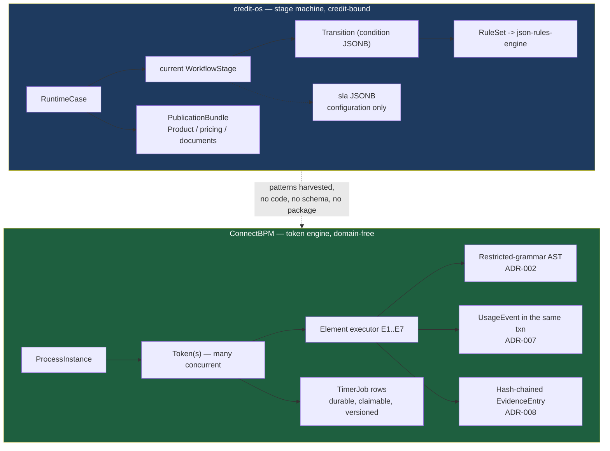

# ADR-003: The `credit-os` Boundary — Harvest Patterns, Share No Code

**Product**: ConnectBPM · **Task**: ARCH-01 · **Date**: 2026-08-20
**Author**: Architect, ConnectSW
**Deciders**: Architect (delegated by CEO-DECISIONS.md); position set by STRAT-01

## Status

Accepted.

## Context

`products/credit-os/` (Composable Credit OS) already contains workflow-shaped IP: a
`WorkflowDefinition` / `WorkflowStage` / `Transition` model, a versioning and publication scheme, a
tenant-scoping kernel, and a rules layer. ConnectBPM is being built as a generic workflow engine.
Without an explicit boundary, three failure modes are available and all of them are expensive:
forking credit-os's code into ConnectBPM, extracting a premature shared package, or building the same
thing twice with no learning transferred.

STRAT-01 set the position: **ConnectBPM owns the generic engine; `credit-os` keeps credit domain
semantics; harvest patterns, do not fork code; no migration before month 24.** CEO-DECISIONS.md
delegates recording it as an ADR to ARCH-01. This ADR records it *and* the inspection that justifies
it — because the interesting question is not whether to share, but **what is actually the same**.

### What `credit-os` actually has (inspected, not assumed)

| Artefact | File | Shape |
|----------|------|-------|
| `WorkflowDefinition` | `apps/api/prisma/schema.prisma:198` | `tenantId`, `version`, `lifecycleStatus`, `revision`; has many stages |
| `WorkflowStage` | `:219` | `type: StageType (MANUAL…)`, `sla Json`, optional `ruleSetId` |
| `Transition` | `:246` | `fromStageId`, `toStageId`, `condition Json`, optional `ruleSetId`, `isDefault` |
| `RuntimeCase` | `:449` | bound to a `PublicationBundle` — a *credit case*, not a generic instance |
| `TenantContext` | `apps/api/src/kernel/tenant-context.ts` | `tenantId`, `actorId`, `roles`, `correlationId`, `channel` |
| Tenancy model | ADR-004 | `tenantId` on all 16 entities; base repository forces `WHERE tenantId = ?`; one schema; one tenant per deployment |
| Versioning model | ADR-003 | integer `version` + `status`; published rows immutable; `revision` for optimistic concurrency; relational-vs-JSONB rule |
| Rules | ADR-002 | `json-rules-engine` wrapped behind an owned `RuleSet` metadata layer |
| Connectors | ADR-005 | provider-strategy with a sandbox provider |

### The decisive structural difference

`credit-os` models a **stage machine**: a case sits in exactly one stage, and a transition moves it
to the next. There is no token table, no parallel-branch concept, and no durable timer job store —
SLA is a JSONB configuration blob on a stage, not a scheduled, claimable, crash-recoverable job.

ConnectBPM models a **token engine**: an instance may hold several concurrent tokens (E4 Split/Join),
tokens carry versions for stale-timer detection, timers are first-class durable rows claimed with
`SELECT FOR UPDATE SKIP LOCKED`, and a terminal transition writes a billable meter row inside the
same transaction.

A generic engine is not a superset of the credit stage machine by accident — it is a superset because
the credit product deliberately constrained itself to what corporate credit origination needs. The
constraint is the value there. Removing it does not produce ConnectBPM; it produces a worse credit
product.

## Decision

**Harvest five patterns. Share zero code, zero schema, zero package. Revisit at month 24.**

### Harvested (pattern only — re-implemented in ConnectBPM's own terms)

| # | Pattern from `credit-os` | How ConnectBPM applies it | Where |
|---|--------------------------|---------------------------|-------|
| H1 | `TenantContext` + base repository forcing `WHERE tenantId = ?` — tenant safety as **one reviewable invariant**, not N modules' worth of ad-hoc predicates | Adopted, then hardened: the same context shape plus **PostgreSQL Row-Level Security** as a second, independent layer. ConnectBPM is genuinely multi-tenant, so a missing predicate is existential, not theoretical. | ADR-004 |
| H2 | Versioning: integer `version` + `status`, published rows immutable, enforced in the repository **and** by a database trigger as defence in depth | Adopted verbatim in intent for `ProcessDefinitionVersion` (`FR-013`, `FR-014`, `FR-015`) | ADR-008, schema |
| H3 | Optimistic concurrency via a `revision` column, `WHERE id = ? AND revision = ?`, zero-row update surfaced as HTTP 409 | Adopted for draft editing (`FR-028`, `EC-16`, `AC-…409`) **and generalised**: the same mechanism becomes the engine's token-version guard, which is what makes stale-timer discard correct (`FR-057`, `EC-02`) | ADR-009 |
| H4 | The relational-vs-JSONB rule: *"if the integrity engine or a tenant-scoped query needs to traverse or filter on it, it is a column with an index; if it is configuration shape that evolves, it is JSONB with a Zod schema"* | Adopted as the governing storage rule. It is why `graph`, `formSchemas` and condition ASTs are JSONB while `status`, `terminalReason`, `dueAt` and `billingPeriod` are indexed columns. | schema |
| H5 | Wrap a third-party evaluator behind an owned metadata layer so the library stays swappable (`credit-os` ADR-002) | Adopted as an *instinct*, rejected as an *implementation*: ConnectBPM's constraint set (`NFR-009` forbids runtime codegen) rules out every candidate library, so we own the whole grammar. Recorded so the difference is deliberate. | ADR-002 |

### Explicitly NOT shared

| Not shared | Why |
|-----------|-----|
| `WorkflowDefinition` / `WorkflowStage` / `Transition` schema | A stage machine, not a token engine. Adopting it would force ConnectBPM to bolt parallel tokens onto a single-current-stage model — the exact re-architecture the element set is designed to avoid. |
| `RuleSet` / `json-rules-engine` | ConnectBPM's `NFR-009` forbids what `credit-os` does not need to forbid (its authors are internal Policy Authors on a single-tenant deployment; ours are anonymous self-serve tenants). Different threat model, different answer. |
| Connector framework (`credit-os` ADR-005) | Service tasks are explicitly out of ConnectBPM v1 (`FR-011` exclusions). |
| The in-process `event-bus` and `module-contract` kernel | ConnectBPM uses a **transactional outbox** (ADR-009), because its events must be atomic with a database transaction that also carries money. An in-process bus is not. |
| A shared `@connectsw/workflow` package | **Premature.** Two implementations, one of which does not exist yet, is not enough evidence to design a shared abstraction. Extracting one now would couple a shipping product to a design that has never met a customer. |

### The boundary, stated for both teams

> **ConnectBPM owns generic process execution: elements, tokens, timers, tasks, forms, evidence and
> metering, with no domain vocabulary anywhere in its schema.**
> **`credit-os` owns credit domain semantics: products, pricing, eligibility rules, document
> requirements, publication bundles, and the credit case lifecycle.**
> Neither imports the other. Neither's schema references the other. The word "credit" does not appear
> in ConnectBPM's data model, and the word "token" does not appear in `credit-os`'s.

### The month-24 re-evaluation, and the interface that keeps it cheap

No migration before month 24 (STRAT-01). The option is kept open by exactly one thing:
**`FR-065`** — ConnectBPM exposes an internal, tenant-scoped engine API consumable by another
ConnectSW product without going through the web surface. If at month 24 `credit-os` wants generic
execution, the migration is *credit-os calling that API and mapping its stages onto ConnectBPM
definitions*, not a schema merge. That is a bounded, reversible integration.

**Trigger conditions for re-evaluating before month 24** (any one, and only then):
1. `credit-os` requires concurrent parallel branches or durable per-stage timers — i.e. it starts
   growing a token engine.
2. ConnectBPM ships a third product integration through `FR-065`, making the internal API a real
   contract with real consumers rather than a stated intention.
3. A third ConnectSW product needs process execution. Two implementations are a coincidence; three
   are a platform.

## Consequences

### Positive
- Neither product is blocked on the other. `credit-os` is shipping; ConnectBPM has not started.
- ConnectBPM's schema stays domain-free, which is what `NFR-020` (no jurisdiction or domain rule
  compiled into the application) and DEC-001's geography neutrality require.
- The most valuable thing `credit-os` has — a tested, reviewed tenant-scoping invariant and a
  versioning/immutability model — transfers immediately at near-zero cost.
- The `FR-065` interface makes the future convergence a decision rather than a rewrite.

### Negative
- Two versioning implementations and two tenant-scoping implementations exist in the company. They
  will drift. Accepted deliberately: STRAT-01's "harvest patterns, do not fork code" is a bet that
  drift is cheaper than premature coupling, and the ConnectBPM implementations are already diverging
  (RLS, token versions) for real reasons.
- A future reader may see the duplication and "fix" it. This ADR exists to be found first.

### Neutral
- Four ConnectBPM components are registry candidates once built — the transactional usage ledger, the
  hash-chained evidence trail, the `SELECT FOR UPDATE SKIP LOCKED` job runner, and the tenant-scoped
  data-access boundary. **If** extraction ever happens, it happens from these, upward into
  `packages/`, after they have run in production — not sideways from `credit-os`.

## Alternatives Considered

### Fork `credit-os`'s workflow module as ConnectBPM's starting point
- **Pros**: an immediate running start on definitions, versioning and publication.
- **Cons**: inherits a single-current-stage model that cannot express E4 Split/Join; inherits
  `RuntimeCase`'s binding to `PublicationBundle`; and creates a fork that must be reconciled forever.
- **Why rejected**: the stage machine is the part we must not have, and the versioning model — the
  part we do want — is a pattern, transferable in an afternoon.

### Extract `@connectsw/workflow` now and have both products consume it
- **Pros**: one implementation; the platform story STRAT-01 gestures at.
- **Cons**: designing a shared abstraction from one shipping implementation and one that does not
  exist is guesswork; it makes ConnectBPM's v1 schedule depend on refactoring a live product; and
  `credit-os` would take churn for a capability it does not need.
- **Why rejected**: STRAT-01's month-24 horizon exists for this reason. Revisit with three data points.

### Build ConnectBPM with no reference to `credit-os` at all
- **Pros**: maximum independence; no risk of inheriting the wrong shape.
- **Cons**: re-derives a tenant-scoping invariant and a versioning model that are already written,
  reviewed and running — including the mistakes already made in getting them right.
- **Why rejected**: Article II. Reuse of *patterns* is reuse.

## References
- STRAT-01 §8.5 (SO-4/SO-5), §credit-os overlap; CEO-DECISIONS.md §delegated conflicts
- `credit-os` ADR-001 (modular monolith), ADR-002 (json-rules-engine), ADR-003 (metadata storage), ADR-004 (single-tenant multi-tenant-ready), ADR-005 (connector sandbox)
- `products/credit-os/apps/api/prisma/schema.prisma:198-266, 449`; `apps/api/src/kernel/tenant-context.ts`
- `FR-065`; `NFR-019`, `NFR-020`; ConnectBPM ADR-002, ADR-004, ADR-007, ADR-008, ADR-009
