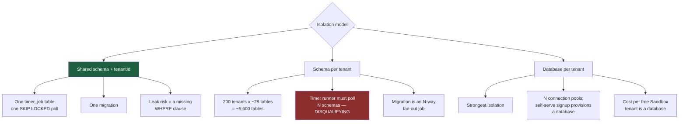

# ADR-004: Multi-Tenancy — Shared Schema, Mandatory Row-Level Security, Deployment as the Sovereignty Lever

**Product**: ConnectBPM · **Task**: ARCH-01 · **Date**: 2026-08-20
**Author**: Architect, ConnectSW
**Deciders**: Architect (delegated by CEO-DECISIONS.md)

## Status

**Accepted, and AMENDED by ARCH-02 on 2026-08-20.** Three corrections, each made against
working, tested code rather than against a reading of the ADR:

| # | What was wrong | Where |
|---|----------------|-------|
| A1 | The declared type of `TenantScopedClient` was `PrismaClient & { brand }`. `withTenant` opens a transaction, so it is `Prisma.TransactionClient & { brand }` — inside a transaction `$transaction`, `$connect` and `$extends` do not exist. ADR-007 already said `Prisma.TransactionClient` and was right. | §2 |
| A2 | The policy predicate `current_setting('app.tenant_id', true)::uuid` **raises** where it must deny. An unset variable yields NULL, but an EMPTY STRING makes `''::uuid` raise — turning a cross-tenant miss into a 500 instead of the 404 `FR-003` requires. The implementation wraps it in `nullif(…, '')`. | §3 |
| A3 | §3's blanket "the application connects as a role that is neither superuser nor `BYPASSRLS`" was true and remains true, but it left `job` unclaimed: ADR-009's runner needs one cross-tenant read, and under `FORCE` it got zero rows, silently. The bounded exception is **ADR-010**. | §3 |

Where an ADR disagrees with shipped, tested code, the ADR is what changes. A1 and A2 are
recorded here in the text below; A3 adds §3.1.

## Context

This is the product's highest-severity risk class. A cross-tenant leak is **existential** — STRAT-01
kill criterion **K6**, `NFR-008` (zero incidents), `RSK-001`. It is also the decision most likely to
be made once and never revisited, because every other design sits on top of it.

Four constraints bound the choice:

| Constraint | Source | Effect |
|-----------|--------|--------|
| Zero cross-tenant exposure; a two-tenant isolation suite is a **merge blocker** on every build; a new endpoint absent from the suite fails the build | `NFR-008`, `AC-049`, `AC-050` | Isolation must be *enumerable and testable*, not per-route discipline |
| Cross-tenant reads return **404, never 403** — existence is not disclosed | `FR-003`, `AC-052` | Enforcement must happen where "not found" and "not yours" become the same answer: the data-access boundary |
| The topology **must not foreclose** a future single-tenant / in-region / sovereign deployment of the same codebase, without re-architecture | `NFR-019`, DEC-001, STRAT A4 | No decision may assume one global database forever |
| `packages/` has **zero tenancy** — verified: `grep -ril "tenantid\|tenant_id" packages/` → 0 files | Orchestrator + re-verified in ARCH-01 | There is nothing to inherit; this is built |

### The options



## Decision

**Shared schema, `tenantId` on every tenant-scoped row, PostgreSQL Row-Level Security as a mandatory
second layer, and the deployment topology — not the schema — as the lever for sovereignty.**

### 1. Every tenant-scoped row carries a non-null `tenantId`

Including rows that are reachable only through a parent (`Token`, `InstanceVariable`, `FormSchema`).
Denormalising `tenantId` onto child tables is deliberate: it means the RLS predicate and the index
prefix are uniform, and no isolation guarantee depends on a join being written correctly.

**Every index on a tenant-scoped table leads with `tenantId`.** `@@index([tenantId, status, dueAt])`,
never `@@index([status, dueAt])`. This is both a correctness shape and the query plan we want.

Three indexes are exceptions, because the lookup they serve is inherently cross-tenant:
`Membership:(userId)` (workspace switching), `Subscription:(tier,status)` (billing control plane)
and `Job:(runAt,id)` (the runner's claim — ADR-009, bounded by ADR-010). Each is named in
`INDEX_EXCEPTIONS` in `scripts/check-rls.ts` with a written reason, and check B fails the build
on any index that is neither prefixed nor listed. The rule is enforced mechanically; the
exceptions are enumerable, which is the property `AC-050` actually needs.

### 2. Layer one — the data-access boundary, enforced by the type system

`AC-051` requires that a data-access method written without a tenant predicate "does not compile or
does not pass the access-layer test". A lint rule cannot deliver "does not compile". A **branded
type** can:

```ts
// Only the tenancy layer can construct this. There is no public constructor.
declare const TenantScopedBrand: unique symbol;
export type TenantScopedClient = Prisma.TransactionClient & {
  readonly [TenantScopedBrand]: true;
};

// The ONLY way to obtain one:
export async function withTenant<T>(
  ctx: TenantContext,
  fn: (db: TenantScopedClient) => Promise<T>,
): Promise<T>;
```

**A1 (ARCH-02).** The base type is `Prisma.TransactionClient`, **not** `PrismaClient`. This ADR
originally said `PrismaClient`, which was wrong for a reason that matters: `withTenant` hands the
callback a client that is *inside* an interactive transaction, and Prisma removes
`$transaction`, `$connect`, `$disconnect`, `$on`, `$use` and `$extends` from it — that is what
`Prisma.TransactionClient` (`Omit<PrismaClient, ITXClientDenyList>`) means. Declaring the brand
over `PrismaClient` would promise repository authors methods that do not exist at runtime, and
would in particular promise a nested `$transaction` — the one call that would let a repository
escape the tenant scope it was handed. ADR-007's `TransitionTx` already used
`Prisma.TransactionClient` and was correct; the two brands now agree, which is what lets
`withTransitionTx` promote one into the other.

Repository functions accept `TenantScopedClient`, never `PrismaClient`. A developer who reaches for
the raw client to write an unscoped query gets a **type error**, not a code review comment.
`withTenant` opens a transaction, sets the RLS variable (below), and hands over a client extended
with a Prisma `$extends` `query` hook that injects `where: { tenantId: ctx.tenantId }` into every
model operation on a tenant-scoped model, and **throws on any model operation it does not recognise**
— so a newly added model is scoped by default and a new unregistered model fails loudly rather than
silently leaking.

Cross-tenant reads therefore produce an empty result, which the API layer renders as **404**
(`FR-003`, `AC-052`), identical in shape to a genuinely absent row.

### 3. Layer two — PostgreSQL Row-Level Security, mandatory, not optional

`credit-os` ADR-004 lists RLS as "an available future hardening layer". For ConnectBPM it is **not
optional**, because unlike `credit-os` we run many tenants in one database from day one.

```sql
-- One function, so the predicate has ONE definition. Schema-qualified in every
-- policy, so a search_path manipulation at query time cannot redirect it, and
-- only the migrator can replace it (the app role holds no CREATE on public).
CREATE OR REPLACE FUNCTION public.app_current_tenant_id()
RETURNS uuid LANGUAGE sql STABLE AS $$
  SELECT nullif(current_setting('app.tenant_id', true), '')::uuid
$$;

ALTER TABLE process_instance ENABLE ROW LEVEL SECURITY;
ALTER TABLE process_instance FORCE ROW LEVEL SECURITY;
CREATE POLICY tenant_isolation ON process_instance
  AS PERMISSIVE FOR ALL TO PUBLIC
  USING      (tenant_id = public.app_current_tenant_id())
  WITH CHECK (tenant_id = public.app_current_tenant_id());
```

**A2 (ARCH-02).** `nullif(…, '')` is not tidiness, and this ADR's original predicate —
`current_setting('app.tenant_id', true)::uuid` — was wrong. `current_setting(…, true)` returns
NULL when the variable was never set, and NULL is the default-deny this design wants. But it
returns the **empty string** when the variable was set to one, and `''::uuid` **raises**:

```
--- what this ADR used to say ---
SELECT set_config('app.tenant_id', '', true);
SELECT current_setting('app.tenant_id', true)::uuid;
ERROR:  invalid input syntax for type uuid: ""

--- what the shipped migration does ---
SELECT public.app_current_tenant_id() IS NULL;  -->  t
SELECT count(*) FROM job;                       -->  0
```

A policy that raises turns a cross-tenant miss into a **500**, when `FR-003` and `AC-052` require
a **404 indistinguishable from a genuinely absent row**. A 500 on exactly the requests that touch
another tenant's identifiers is also an existence oracle — the disclosure this ADR spends §4
preventing. `WITH CHECK` mirroring `USING` is likewise part of the shipped policy and was missing
from the sketch above: without it a write claiming another tenant's id is silently accepted and
then invisible, rather than refused.

- `withTenant` sets `app.tenant_id` with `SELECT set_config('app.tenant_id', $1, true)`, not with
  a literal `SET LOCAL`, because `SET LOCAL` accepts no bind parameter and a tenant id
  interpolated into DDL-shaped SQL is an injection surface. `set_config(…, is_local => true)` is
  exactly `SET LOCAL` and is **transaction-scoped**, so it is safe behind PgBouncer in transaction
  pooling mode and cannot leak into a recycled connection. It is the first statement of the
  transaction except where `SET TRANSACTION READ ONLY` precedes it, which PostgreSQL requires to
  come first, and `SET LOCAL statement_timeout`.
- The application connects as a role that is **neither superuser nor `BYPASSRLS`**. Migrations and
  the reconciliation job use a separate, explicitly privileged role.
- `FORCE ROW LEVEL SECURITY` ensures the policy applies even to the table owner.
- Consequence, accepted deliberately: **every tenant-scoped read happens inside a transaction.**
  Read paths use `BEGIN READ ONLY`. The cost is roughly two extra round trips per request; against
  `NFR-001`'s 500 ms p95 for a transition and a co-located database this is single-digit
  milliseconds. It is the price of an isolation guarantee that survives a bug in our own code.

Global, non-tenant tables have no policy. There are **five** — `Tenant`, `User`, `RefreshToken`,
`Template`, `TemplateLocale` — each with its reason written next to it, and the same five names
are enumerated in three places (`src/tenancy/model-registry.ts`, `scripts/check-rls.ts`, and the
schema trailer note 4) which `tests/unit/tenancy/model-registry.test.ts` asserts equal. Adding a
table to that list is a reviewed, deliberate act that changes three files and turns a test red
until all three agree.

### 3.1 The ONE bounded exception — the job claim (`A3`, ARCH-02, ADR-010)

`FORCE ROW LEVEL SECURITY` binds the table **owner** too. That is the point of choosing `FORCE`,
and it is also what broke ADR-009: the runner's single cross-tenant
`SELECT … FOR UPDATE SKIP LOCKED` over `job` matched **zero rows and reported success** —
no error, no log, timers silently never firing. §3 as originally written had no room for a
process that legitimately must see more than one tenant, and the engine's durability substrate is
exactly such a process.

**ADR-010 carves the exception, and its whole width is stated here so that this ADR remains the
place the isolation posture is read from:**

| Dimension | The exception |
|-----------|---------------|
| Principal | `connectbpm_job_claimer` — **NOLOGIN**, NOSUPERUSER, **NOBYPASSRLS**. Nothing can connect as it. |
| Reachable how | Only by calling one of **two** `SECURITY DEFINER` functions it owns, whose bodies only `connectbpm_migrator` can replace |
| Tables | **`job` only.** It holds no privilege on the other 26. |
| Rows | `status IN ('PENDING','CLAIMED')` only |
| Columns readable | `id`, `tenant_id`, `run_at`, `status`, `attempts`, `locked_until` — **not `payload`** |
| Columns writable | `status`, `locked_by`, `locked_until`, `attempts`, `updated_at` — **not `tenant_id`**, not `payload` |
| Verbs | SELECT and UPDATE. No INSERT policy, no DELETE policy. |
| Who may call it | `connectbpm_runner` only. `connectbpm_app` — the HTTP role — is **refused**. |
| What crosses the boundary | `(job_id, tenant_id)`. The runner then enters `withTenant(tenantId)` and does everything else tenant-scoped. |

`tenant_isolation` is **not modified** by that ADR, on `job` or anywhere else. It remains one
unconditional equality on all 27 tables; the exception is two additional policy rows naming a
role nothing can log in as. A role clause added to `tenant_isolation` itself would be the option
ADR-010 rejected, and `check-rls.ts` check E fails the build if one ever appears.

The consequence for this ADR's central claim is small and worth stating plainly: **two
independent layers must both fail to produce a leak** still holds everywhere, including on `job`,
on every connection except inside those two function bodies. There, layer two is deliberately
open over six columns of one table, and layer one — the branded `TenantScopedClient` — is not
involved at all, because the functions are called through `$queryRawUnsafe` by the runner rather
than through a repository. That is why the boundary is asserted by a CI gate (check E) and by 18
integration tests rather than by a type.

### 4. Layer three — the enumerating isolation suite (`AC-049`, `AC-050`)

Two provisioned tenants, populated. The suite **enumerates endpoints from the generated OpenAPI
document**, not from a hand-maintained list, and requests every one as a member of A using B's
identifiers. Every response must be 404 and no response body may contain any value originating in B.
Because the source is the OpenAPI document (which CI already requires to match the router — API9), a
new endpoint is covered automatically and an endpoint missing from the document fails the build.
This is what makes `AC-050` real rather than aspirational.

### 5. Storage and side channels

- **Attachments** (`AC-055`, `NFR-011`): object keys are `t/{tenantId}/{instanceId}/{objectId}`, and
  the storage credential presented per request is scoped to the `t/{tenantId}/` prefix, so the read is
  refused **at the storage layer** and not only at the API. Signed URLs are short-lived (≤ 5 min),
  single-object, and bound to the tenant prefix.
- **Webhooks** (`AC-056`): `WebhookEndpoint` takes an additive `tenantId`; the dispatcher selects
  endpoints by `tenantId` from inside `withTenant`, so a delivery to another tenant's endpoint is not
  merely improbable, it is unqueryable.
- **Redis** (`FR-045`): keys are prefixed `bpm:{tenantId}:…`. Redis holds cache and soft counters
  only and **never** a value that billing, evidence or execution correctness depends on.
- **Search, analytics, reconciliation** (`AC-057`): every aggregate query runs inside `withTenant`.
  The nightly reconciliation iterates tenants by looping over tenant ids (readable from the global
  `Tenant` table) and entering `withTenant` per tenant, never by a single cross-tenant `GROUP BY`.
  That loop is the pattern **every** multi-tenant background job uses. The **one** exception in the
  product is the job claim (§3.1, ADR-010), which cannot use it — polling per tenant is the failure
  mode ADR-005 rejected third-party engines for.
- **Logs**: `tenantId` and `X-Request-ID` on every log line; PII fields are on the
  `@connectsw/shared` logger's redaction list and never logged.

### 6. `NFR-019` — how this does not foreclose sovereignty

The lever is the **deployment topology**, and it works precisely *because* `tenantId` is universal:

| Topology | Who it is for | What changes |
|----------|--------------|--------------|
| **Shared** (v1) | Sandbox / Starter / Growth / Business | One deployment, one database, many `tenantId` values |
| **Dedicated** | Business with a data-residency requirement | Same image, same schema, same migrations; its own database; a small tenant set |
| **Sovereign / in-region** | The Sovereign tier; STRAT A4 | Same image, same schema; one `tenantId` in its own database in-region; tenant routing at the edge by workspace slug |

**No schema change, no query change, no code fork** — a sovereign deployment is a configuration and a
DNS decision. This is the same conclusion `credit-os` ADR-004 reached from the opposite direction
(it runs one tenant and keeps `tenantId` so it can become many); ConnectBPM runs many and keeps the
topology open so it can become one. Both work only because the column is unconditional.

A tenant's home topology is recorded on the `Tenant` row (`residency`, `deploymentRef`) so that
routing and support tooling are data-driven from day one — this costs two columns now and is
unpleasant to retrofit.

### 7. What this means for the shared packages

| Package | Position | Change required |
|---------|----------|-----------------|
| `@connectsw/auth` | **EXTEND** | `User` stays global (one identity, several workspaces — `FR-006`, `EC-20`). `Membership(tenantId, userId, roles[])` is new and is ours. `ApiKey` takes `tenantId` (an API key belongs to a workspace, not a person). |
| `@connectsw/billing` | **EXTEND** | `Subscription` re-keyed `userId → tenantId`. `UsageService` **not used** for instance metering (ADR-007). |
| `@connectsw/audit` | **EXTEND, substantially** | `AuditLog` becomes tenant-scoped; the evidence chain is a new model (ADR-008). |
| `@connectsw/webhooks` | **REUSE the code, EXTEND the schema** | `WebhookEndpoint.userId → tenantId`. The delivery service, HMAC signing, SSRF guard, circuit breaker and retry logic are used as-is. |
| `@connectsw/notifications` | **REUSE the code, EXTEND the schema** | `Notification` takes `tenantId` (a notification is about work in one workspace). |

## Consequences

### Positive
- One `job` table, one `SELECT … FOR UPDATE SKIP LOCKED` poll, one migration, one connection
  pool. The engine's durability substrate (ADR-009) is only simple in this model. (The table is
  `job`, not `timer_job` — it carries schedules, retries and the outbox as well as timers. This
  ADR named it twice, differently; ADR-009 and the schema say `job`.)
- Two **independent** layers must both fail to produce a leak: an application bug is contained by RLS;
  an RLS misconfiguration is contained by the injected predicate. `NFR-008` is defended in depth.
- `AC-051` becomes literally true — the unscoped call does not compile.
- Sovereignty stays open at the cost of two columns, satisfying `NFR-019` and STRAT A4 without
  building anything for it now.

### Negative
- **Every tenant-scoped read runs in a transaction.** Extra round trips, and long-running read
  transactions can hold `xmin` back and affect vacuum if abused. Mitigation: read transactions are
  `READ ONLY`, a `statement_timeout` of 5 s applies to API transactions (30 s for jobs), and no HTTP
  handler may hold a transaction across an external call.
- Noisy neighbours are real. One tenant's 50,000-timer midnight burst shares a database with everyone
  else. Mitigations in v1: batch-size caps, per-tenant fairness in the job claim query
  (`ORDER BY due_at` with a per-tenant claim ceiling per batch), and per-tenant `statement_timeout`.
  Full resource isolation is what the Dedicated topology is for, and it is a tier, not a fix.
- RLS is invisible in tests that run as a privileged role. **The isolation suite must run as the
  application role**, and a CI check asserts that the application role has neither `BYPASSRLS` nor
  superuser. Without that check the second layer silently does nothing.
- **RLS is also invisible to the process it stops.** This is the ARCH-02 lesson and it is more
  general than the job claim: a policy that matches nothing produces an empty result, and an
  empty result is indistinguishable from "there was nothing to do". Every background process
  added from here must have a test that plants work in TWO tenants and asserts it reaches both —
  not merely a test that it runs without error. `tests/db.ts`'s two-tenant fixture is mandatory
  for that reason, and `seedDueJob` exists so a job-shaped process cannot be tested with one.
- A new tenant-scoped table added without a policy is a hole. Mitigation: a CI query compares
  `information_schema.tables` against `pg_policies` and fails on any tenant-scoped table without
  `ENABLE`+`FORCE`+a policy. This gate is required from the first migration.

### Neutral
- `User` and `Template` are deliberately global. Cross-tenant *identity* is a feature (`FR-006`);
  cross-tenant *data* is the failure. The distinction is enforced by the enumerated global-table list.

## Alternatives Considered

### Schema per tenant
- **Pros**: strong isolation with one database; a leak requires a wrong `search_path`, not a missing
  predicate; per-tenant restore is easy.
- **Cons, decisive**: the durable job substrate breaks. The timer runner's whole design is one indexed
  poll over one `job` table; with 200 schemas it becomes 200 polls per tick, or a dispatcher that
  reintroduces exactly the coordination we avoided. Add ~5,600 tables at v1 scale, a Prisma client
  that has no first-class per-schema multi-tenancy, migrations as an N-way fan-out with partial-failure
  states, and a self-serve signup that performs DDL on the request path.
- **Why rejected**: it makes `NFR-004` (50,000-timer burst, ≥99% within 60 s) hard for a benefit RLS
  already provides.

### Database per tenant
- **Pros**: the strongest isolation available; the natural shape of data residency.
- **Cons**: N connection pools; self-serve signup provisions a database; a free Sandbox tenant costs a
  database; cross-tenant operational work (reconciliation, support) becomes fan-out; and 200 databases
  at v1 scale is an operations product we are not staffed to run.
- **Why rejected as the default, retained as a tier**: this *is* the Dedicated/Sovereign topology.
  Choosing it for everyone would price the free tier out of existence.

### Shared schema with `tenantId` and application-level scoping only (no RLS)
- **Pros**: simplest; no transaction requirement on reads; the `credit-os` v1 position.
- **Cons**: a single forgotten predicate anywhere in ~28 tables and hundreds of queries is an
  existential incident. `credit-os` can accept this because one tenant exists; ConnectBPM cannot.
- **Why rejected**: K6 is a kill criterion. One layer is not defence in depth.

## References
- `FR-001`, `FR-002`, `FR-003`, `FR-006`, `FR-009`, `FR-045`, `FR-098`, `FR-112`
- `NFR-008`, `NFR-011`, `NFR-019`; `EC-20`; `AC-049`–`AC-057`; `RSK-001`; STRAT-01 K6, A4
- `credit-os` ADR-004 — the harvested pattern (ADR-003 H1)
- PostgreSQL RLS: `CREATE POLICY`, `FORCE ROW LEVEL SECURITY`, `SET LOCAL`
- **ADR-010** — the one bounded cross-tenant exception (§3.1), and the ARCH-02 amendments A1–A3
- `apps/api/src/tenancy/` — the shipped implementation this ADR was corrected against
- `apps/api/prisma/migrations/20260820125500_row_level_security/migration.sql`
