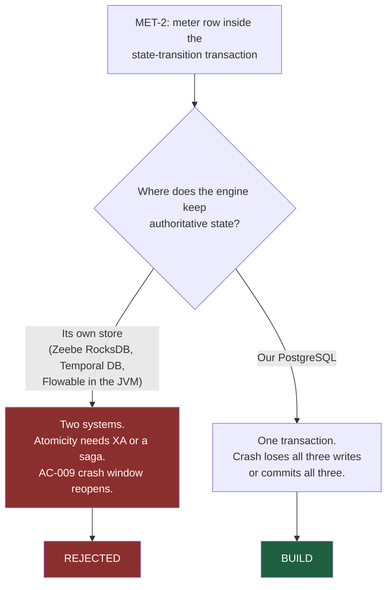

# ADR-005: The Workflow Engine — Build a Token Interpreter on PostgreSQL

**Product**: ConnectBPM · **Task**: ARCH-01 · **Date**: 2026-08-20
**Author**: Architect, ConnectSW

## Status

Accepted.

## Context

The engine is the product (SPEC-01 G-14, ~4 sprints, "the hard part"). Article II and the ConnectSW
research-first rule require that existing solutions be evaluated before anything is built. This ADR
records that evaluation. **"Build our own" is only legitimate with the evaluation attached**, so the
evaluation is the substance of this document.

The requirements that discriminate between candidates:

| # | Requirement | Source |
|---|-------------|--------|
| R1 | The billable meter row is written **inside the same database transaction** as the state transition | DEC-002 `MET-2`, `FR-101`, `FR-042`, `EC-05`, `AC-009` |
| R2 | Replay is a no-op; exactly-once accounting on an at-least-once substrate | `MET-3`, `FR-107`, `AC-010`, `AC-011` |
| R3 | Only E1–E7 may exist — **through any interface, including direct API calls** | `FR-011` |
| R4 | The evidence record is an append-only hash chain, per-instance sequenced, exportable and independently verifiable | `FR-086`–`FR-095`, DEC-001 |
| R5 | TypeScript, Fastify, Prisma, PostgreSQL | Constitution Articles IV & V |
| R6 | Per-tenant isolation is enforced at the data-access boundary with RLS underneath | ADR-004, `NFR-008` |
| R7 | No customer-authored code executes anywhere | `NFR-009` |
| R8 | 100% branch coverage of the transition function, against real PostgreSQL, no mocks | `NFR-018` |

## Research

| Candidate | Licence (checked 2026-08-20) | Maintenance | Fit assessment |
|-----------|------------------------------|-------------|----------------|
| **Camunda 8 / Zeebe** | **Camunda License 1.0** since 8.6 (Oct 2024). Source-available; free for development and testing; **production requires a paid licence**. 8.5 and below remain usable in production under the old terms. | Very active, large ecosystem | **Fails R1 decisively.** Zeebe's authoritative state lives in its own partitioned RocksDB state machine and reaches external systems through **exporters, which are at-least-once and asynchronous**. There is no transaction that spans a Zeebe state change and a row in our PostgreSQL. `MET-2` is not "difficult" here; it is architecturally unavailable. Also fails R5 (JVM/gRPC), R3 (executes the full BPMN element set), R4 (its own history model). Licence cost lands on every self-managed production deployment including the Sovereign tier. |
| **Temporal** | MIT | Very active | **Fails R1 and R3.** Temporal is durable execution for *developer-authored code*: workflows are compiled and deployed by us. Our workflows are **authored by customers at runtime**, so we would write an interpreter as a Temporal workflow — i.e. build the engine anyway, then run it on a cluster. Temporal's state is in its own datastore; a workflow state change and our usage-event insert are two systems, so `MET-2` becomes a saga with a compensation path — precisely what DEC-002 forbids. Adds a server cluster, a matching service and a history service to operate. |
| **Flowable** | Apache-2.0 | Active | The closest technical fit and the hardest rejection. Full BPMN 2.0, embeddable, PostgreSQL-backed with its own job executor, and its engine transaction *could* in principle wrap our writes — **if we were a Java application**. We are not (R5), so the meter write and the state transition sit in two runtimes and the atomicity has to be recovered with XA or an outbox, which reintroduces the exact crash window `AC-009` forbids. It also fails R3 (the full BPMN surface is executable, and `FR-011` forbids reaching elements outside E1–E7 through *any* interface), and R4 (Flowable history tables are not a hash chain and would be a second, competing record of truth alongside the evidence trail). Net: we would own less than a third of the problem and inherit a JVM sidecar. |
| **n8n** | Sustainable Use License (source-available, not OSI) | Very active | Wrong category (trigger automation, not human workflow: no task inbox, no claim semantics, no versioned human forms) and a licence that restricts offering it as a service — which is exactly what we do. Rejected. |
| **Node-RED** | Apache-2.0 | Active | Flow-based programming for IoT/integration; no human task model, no durable instance state, no versioning. Rejected. |
| **bpmn-server / other Node BPMN engines** | MIT | Small; low commit volume; single-maintainer | Would satisfy R5 but not R1, R4 or R8, and putting the correctness of the company's revenue on a low-bus-factor dependency is a worse risk than owning ~2,000 lines. Rejected. |
| **Build: a token interpreter over PostgreSQL** | — | — | Satisfies R1–R8 by construction. |

### The decisive point, stated once

> **Every third-party engine keeps its authoritative state in its own store.** DEC-002 `MET-2`
> requires the meter to be written in the *same database transaction* as the state transition. Those
> two facts cannot both be true. Since DEC-002 is irreversible and the CEO has said so in writing,
> the engine's state must live in our PostgreSQL — and an engine whose state lives in our database is
> an engine we have written.

This is not a preference for building. It is the one requirement that removes the option.

There is also a commercial point that would not decide it alone but reinforces it: STRAT-01 identifies
**Camunda refugees as a migration on-ramp**. A product whose answer to "why not Camunda?" is "we are
Camunda, plus a licence" has no on-ramp. Owning the engine is the position we are selling.

## Decision

**Build a token interpreter in TypeScript over PostgreSQL**, structured as:

1. **Transition Coordinator** — the single function through which every state change passes. Opens
   the transaction, takes the token lock, dispatches to an element executor, appends evidence, writes
   the meter when terminal, enqueues outbox rows, commits. Deliberately kept small (target ≤ 200 LOC)
   so `NFR-018`'s 100% branch coverage is achievable and meaningful.
2. **Element executors** — one pure function per element E1–E7: `(token, element, snapshot) → Effect[]`.
   `Effect` is a closed union (`MoveToken`, `CreateToken`, `ConsumeToken`, `CreateTask`,
   `WithdrawTask`, `ScheduleTimer`, `CancelTimer`, `SetVariable`, `Terminate`). Executors never touch
   the database; the coordinator applies effects. This is what makes the engine testable without
   mocks and what keeps element semantics reviewable one element at a time.
3. **Definition resolver** — loads and caches the **immutable** pinned `ProcessDefinitionVersion`.
   Cacheable without invalidation logic precisely because published versions never change (`FR-014`).
4. **Job runner** — durable timers, schedules and outbox drain (ADR-009).
5. **Restricted-grammar evaluator** (ADR-002).
6. **Metering and quota gate** (ADR-007), **evidence recorder** (ADR-008).

**Adopted third-party pieces, where they are genuinely the right answer**: `cron-parser` (MIT) for
recurrence arithmetic; `luxon` (MIT) for IANA timezone and DST resolution (`EC-10`); `zod` for schema
validation; `fast-check` (MIT) for property/fuzz testing; `@connectsw/webhooks` for outbound delivery
(reused wholesale — including its `SELECT FOR UPDATE SKIP LOCKED` claim loop, which is the direct
precedent for the job runner). We are not rejecting libraries; we are rejecting *engines*.

## Consequences

### Positive
- `MET-2`, `MET-3` and `EC-05` become properties of a single database transaction rather than
  distributed-systems problems. This is the largest single risk reduction available on this product.
- `FR-011` is enforceable: no element outside E1–E7 exists to be reached, through any interface.
- The evidence chain is written by the same transaction that moves the token, so `NFR-007`'s
  "100%, not within tolerance" agreement is structural.
- No JVM, no additional cluster, no per-production-deployment licence — which matters most for the
  Sovereign tier, where a licensed engine would be a per-deployment cost on our lowest-volume tier.
- The engine is ours to instrument, which is what `MET-7` (instrument everything on day one) needs.

### Negative
- **We own workflow-engine correctness.** Lost or duplicated work is now our defect class. Mitigated
  by: 100% branch coverage on the coordinator; a crash-recovery test in CI (`AC-070`); the nightly
  three-way reconciliation (`AC-022`, `AC-023`); and the deliberately small element set.
- No BPMN import/export in v1. Camunda refugees must re-model. Mitigated by the 1:1 mapping
  (ADR-001) making BN-017 an additive layer, and by the template gallery covering the common shapes.
- We do not get Zeebe's horizontal partitioning. At `NFR-014` scale (100k completed instances/month,
  500k open timers) a single well-indexed PostgreSQL is comfortable; the first scaling lever is read
  replicas for analytics, the second is partitioning `evidence_entry` and `usage_event` by month.
  Neither is v1 work, and both are recorded here so nobody optimises early.
- ~4 sprints that a "buy" path would nominally have saved — except that none of the buy paths
  actually satisfies `MET-2`, so the saving was never available.

### Neutral
- If BPMN interchange (BN-017) later demands full-spec fidelity, the mapping layer is where that
  argument happens, not the engine.

## Alternatives Considered

See the research table above; each row records licence, maintenance and the specific requirement it
fails. Summarised: **Camunda 8/Zeebe** — production licence plus `MET-2` architecturally unavailable;
**Temporal** — durable execution for code, not customer-authored graphs, and a second state store;
**Flowable** — right shape, wrong runtime, and a competing history model; **n8n** — wrong category and
a licence that restricts offering it as a service; **small Node BPMN engines** — bus factor on the
revenue path.

## References
- Camunda licensing — https://camunda.com/blog/2024/10/camunda-licensing-what-you-need-to-know/ · https://docs.camunda.io/docs/reference/licenses/
- Temporal — https://github.com/temporalio/temporal (MIT)
- Flowable — https://github.com/flowable/flowable-engine (Apache-2.0)
- `MET-1`..`MET-7`; `FR-011`, `FR-041`–`FR-065`, `FR-101`–`FR-113`; `NFR-006`, `NFR-009`, `NFR-014`, `NFR-018`
- PATTERN-014 (`packages/webhooks/src/backend/services/delivery.service.ts:98-128`)
