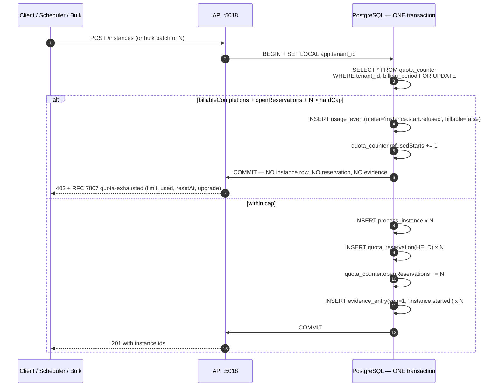
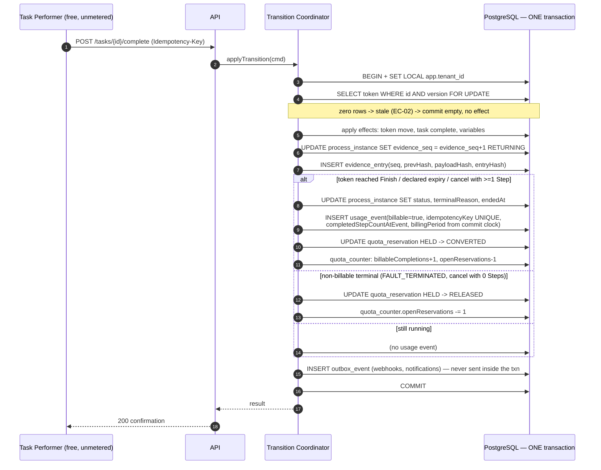

# ADR-007: Exactly-Once Metering — A Transactional Usage Ledger with Quota Reservations

**Product**: ConnectBPM · **Task**: ARCH-01 · **Date**: 2026-08-20
**Author**: Architect, ConnectSW

## Status

Accepted. **This ADR implements DEC-002, which the CEO recorded as irreversible.**

## Context

DEC-002: billing is on **completed process instances only**. No seat metering anywhere. Retroactive
metering is impossible, so every dimension must be instrumented on day one. Seven requirements bind:

| ID | Requirement |
|----|-------------|
| MET-1 | The billable event is **completion**, not start. `COMPLETED` and `EXPIRED` billable; `FAULT_TERMINATED` never; `CANCELLED` billable iff ≥1 Step completed (DEC-004); refused starts and draft test runs never. |
| MET-2 | The meter increments **inside the same DB transaction** as the state transition, with an idempotency key. |
| MET-3 | Exactly-once accounting on an at-least-once execution substrate — replay-safe. |
| MET-4 | Pre-start quota refusal — tier limits enforced **before** instance creation. |
| MET-5 | The meter is immutable and reconcilable against the audit trail. |
| MET-6 | Per-tenant CPU/memory metering of customer-authored evaluation. |
| MET-7 | All secondary dimensions instrumented day one even if not billed in v1. |

And the constraint that removes the obvious shortcut:

> **`@connectsw/billing`'s `UsageService` is a Redis `INCRBY` on `usage:{userId}:{feature}:{period}`
> with a DB upsert fallback** (verified: `packages/billing/src/backend/services/usage.service.ts`).
> It is keyed to `userId`, is not transactional with anything, and an `INCRBY` replayed after a crash
> increments twice. It fails MET-2 and MET-3. `AC-013` makes importing it into the metering path a
> **build failure**. It stays in use only for soft limits and dashboards.

## Decision

Three tables, one transaction, one deterministic key.

### The tables

| Table | Purpose | Volume | Mutability |
|-------|---------|--------|-----------|
| `usage_event` | The **billable ledger**. One row per billable completion, plus first-class non-billable events (`instance.start.refused`, compensations). | ~100k rows/month at `NFR-014` scale | **Append-only.** No `UPDATE`, no `DELETE`, enforced by a database trigger and by the absence of any such code path (`AC-021`). Corrections are compensating rows. |
| `quota_reservation` | Admission control. `HELD` from admission until the instance reaches a terminal state, then `CONVERTED` or `RELEASED`. | one per instance | State transitions only, never deleted |
| `quota_counter` | One row per `(tenantId, billingPeriod)`: `billableCompletions`, `openReservations`, `refusedStarts`. The **serialization point** for admission. | one per tenant per period | Updated under `FOR UPDATE` |
| `usage_counter` | **Secondary dimensions** (MET-7): hourly buckets per `(tenantId, billingPeriod, meter, hourBucket)`. | high volume, bounded by bucketing | Upsert-accumulated; reconstructible; **never** the source of an invoice |
| `usage_distinct_actor` | Exact distinct counts for MET-7's "distinct authoring users" / "distinct users completing tasks" — `@@unique([tenantId, billingPeriod, dimension, actorId])`. Counted and reported, **never billed, capped or gated** (`FR-118`, `AC-028`). | small | Insert-if-absent |

The separation of `usage_event` from `usage_counter` is deliberate: MET-5's immutability and exact
reconciliation apply to money. Applying them to ten million expression-evaluation samples would
produce an unreconcilable ledger and a storage problem, and would not make any invoice more correct.

### The idempotency key — the whole mechanism in one line

```
idempotencyKey = sha256( instanceId ‖ tokenId ‖ fromElementId ‖ transitionId ‖ 'billable_completion' )
```

**Derived only from immutable identifiers.** No clock, no random value, no attempt counter. A replay
of the same transition therefore computes the *same* key, and:

```prisma
@@unique([tenantId, idempotencyKey])
```

turns the second insert into a constraint violation, caught as Prisma `P2002` and interpreted as
"already accounted" — the same PATTERN-014 shape already proven in `@connectsw/webhooks`.

### Admission — MET-4, before any instance row exists



`FOR UPDATE` on the single counter row serialises admissions **for that tenant only**. It is what
makes `AC-015` (remaining quota 5, ten concurrent starts → exactly 5 instances, 5 reservations,
5 refusals) deterministic rather than probabilistic. Contention is bounded: it is taken on *starts*,
not on transitions, and a tenant at `NFR-014`'s ceiling starts ~2 instances per minute.

For a bulk batch the whole batch is admitted or refused in one transaction — `EC-21` / `AC-017`:
0 instances created, **one** refusal event for the batch, shortfall stated as a number.

### The billable transition — MET-1, MET-2, MET-3



### How a crash between the transition and the meter is survived — the three sentences

1. **It cannot occur.** The token move, the evidence entry and the usage-event insert are statements
   in **one PostgreSQL transaction**, so a `SIGKILL` at any point either loses all three or commits
   all three — there is no window in which the instance has advanced but the meter has not
   (`AC-009`).
2. **Redelivery is a no-op.** The job is retried after restart; the idempotency key is recomputed
   from the same immutable identifiers, the `UNIQUE(tenantId, idempotencyKey)` constraint rejects the
   second insert (`P2002` → "already accounted"), and the token-version guard matches zero rows, so
   the replay commits as an empty transaction and returns the first result (`AC-010`, `AC-011`).
3. **The invariant is asserted daily, not merely designed.** The nightly reconciliation replays the
   ledger three ways against instance terminal states and terminal evidence entries; agreement must be
   **exact, not within a tolerance**, and any divergence — including one deliberately injected in CI —
   names the instance and raises a P0 alert (`AC-022`, `AC-023`, `NFR-007`).

### Making MET-2 structurally enforceable, not merely reviewed

`AC-012` demands that CI fail any code path writing a usage event outside the transition transaction.
Static analysis cannot decide that in general. It is made decidable by construction:

```ts
declare const TxBrand: unique symbol;
export type TransitionTx = Prisma.TransactionClient & { readonly [TxBrand]: true };
// Constructed ONLY by the Transition Coordinator, inside its interactive transaction.

export function recordBillableCompletion(tx: TransitionTx, e: BillableCompletion): Promise<void>;
```

`recordBillableCompletion` is the only writer of `usage_event(billable=true)`, and it cannot be
called without a `TransitionTx`, which cannot be obtained outside the coordinator. The CI lint rule
(no import of `UsageService` from the metering path, `AC-013`; no `usageEvent.create` outside the
ledger module, `AC-012`) becomes a backstop over a type-level guarantee rather than the guarantee
itself. `AC-051` uses the same technique for tenant scoping (ADR-004).

### The billability decision table — one function, seven tests (`AC-008`)

| Terminal state | Condition | Billable | Reservation | FR |
|----------------|-----------|----------|-------------|-----|
| `COMPLETED` | token reached any `Finish`, including Rejected / Denied / Withdrawn | **Yes** | CONVERTED | `FR-049`, `FR-103` |
| `EXPIRED` | definition-declared expiry path | **Yes** | CONVERTED | `FR-050`, `FR-103` |
| `CANCELLED` | `completedStepCount ≥ 1` | **Yes** | CONVERTED | `FR-104`, DEC-004 |
| `CANCELLED` | `completedStepCount = 0` | No | RELEASED | `FR-104` |
| `FAULT_TERMINATED` | engine fault / invalid-definition runtime error | **Never** | RELEASED + P0 alert | `FR-052`, `FR-103` |
| refused at admission | quota reservation denied | Never | none — no instance row exists | `FR-105`, `FR-113` |
| draft test run | `isTest = true` | Never | none | `FR-029`, `FR-106` |

Implemented as a single exhaustive `switch` over `TerminalReason`. Adding a terminal state without a
billability test fails the build (`AC-008`) because the switch is exhaustive over a TypeScript union
**and** a CI test enumerates the union against the test file.

Every billable event records `completedStepCountAtEvent` (DEC-004, mandatory), so a future rule change
can be applied to history without re-deriving it.

### Period membership (`FR-123`, `EC-19`, `AC-025`)

`billingPeriod` is computed **at write time** from the transaction's commit clock
(`clock_timestamp()` captured in the transition) and stored as a `YYYY-MM` string column. It is never
recomputed and never derived from the instance start time. An instance committing at
`23:59:59.998Z` on the last day belongs to that period, permanently.

### Retention (`FR-111`, `AC-024`)

Retention deletes instance *payloads*. `usage_event` carries denormalised
`definitionId`, `definitionVersion`, `terminalReason`, `completedStepCountAtEvent` and `billingPeriod`,
so it stays readable and reconcilable after the instance payload is gone, and period totals do not
move. The `instanceId` FK is `ON DELETE RESTRICT` — instance rows are never hard-deleted while usage
events reference them; payload deletion nulls payload columns instead.

## Consequences

### Positive
- MET-1 through MET-5 are properties of one database transaction and one unique constraint, not of a
  distributed protocol. This is the cheapest possible way to be correct about money.
- The type-level guard makes `AC-012` and `AC-051` literally true rather than aspirational.
- Secondary dimensions are instrumented on day one at bounded volume, satisfying MET-7 without
  drowning the billable ledger.

### Negative
- The `quota_counter` row is a **per-tenant hot row on the start path**. At bulk-start scale a 5,000-row
  batch holds it for the duration of one transaction. Mitigations: `MAX_BATCH_SIZE = 5,000` (ADR-001),
  bulk admission does set-based inserts rather than per-row round trips, and a `statement_timeout`
  bounds the hold. If a tenant ever needs sustained high-frequency starts, the counter can be sharded
  into N sub-counters summed on read — **not v1 work**, recorded so it is not invented early.
- Reservations must be released reliably. A `RUNNING` instance whose reservation is never converted or
  released consumes quota forever. Mitigation: reservations are keyed 1:1 to instances and are
  transitioned in the same transaction as the terminal state; the nightly reconciliation additionally
  asserts `open_reservations = count(instances RUNNING|SUSPENDED)` per tenant and repairs drift as a
  compensating event with a P0 alert.
- Every terminal transition writes to the shared counter row, which serialises terminal transitions
  per tenant. Accepted: it is bounded per tenant and it is what makes the quota view exact.

### Neutral
- `@connectsw/billing`'s `SubscriptionService`, `requireFeature`, `PricingCard` and `UsageBar` are
  still reused; only `UsageService` is excluded, and only from the instance-metering path.

## Alternatives Considered

### Use `@connectsw/billing`'s `UsageService`
- **Pros**: exists; fast; already wired into the tier gate.
- **Cons**: Redis counters keyed to `userId`, not transactional, not replay-safe. A crash between the
  Redis `INCRBY` and the DB sync loses or duplicates revenue.
- **Why rejected**: fails MET-2 and MET-3; explicitly ruled out by CEO-DECISIONS.md; `AC-013` makes
  importing it a build failure.

### Emit a usage event to a queue from inside the transaction (transactional outbox for the meter)
- **Pros**: decouples billing from the engine; a familiar pattern; the meter could live in another service.
- **Cons**: the outbox gives at-least-once *delivery*, so the consumer still needs an idempotency key
  and a unique constraint — i.e. all of this ADR's machinery, plus a queue, plus a lag window during
  which the tenant's usage view disagrees with reality, plus a second place `AC-022`'s exact
  reconciliation can fail.
- **Why rejected**: the meter is in the same database as the state. Sending it elsewhere adds a failure
  mode and buys nothing. (The outbox **is** used, correctly, for webhooks and notifications — ADR-009.)

### Derive billing by querying instances at period close ("count completed instances")
- **Pros**: no ledger; no idempotency key; trivially reconcilable with itself.
- **Cons**: retention deletion mutates history; the DEC-004 cancellation rule requires the completed-Step
  count *at the moment of cancellation*, which is not recoverable later; a definition or state-machine
  change reprices past periods; and `FR-109` requires immutability with compensating corrections.
- **Why rejected**: a derived meter is a meter that changes when the code changes. DEC-002 says the
  meter is the record.

## References
- CEO-DECISIONS.md DEC-002 (`MET-1`..`MET-7`), DEC-004; PRD §5.2, §5.3, §7.2 `AC-001`–`AC-034`
- `FR-042`, `FR-043`, `FR-101`–`FR-125`; `NFR-006`, `NFR-007`; `EC-03`, `EC-05`, `EC-13`, `EC-19`, `EC-21`
- PATTERN-014 (`packages/webhooks/src/backend/services/delivery.service.ts`), verified in this task
- `packages/billing/src/backend/services/usage.service.ts` (the excluded path), verified in this task
